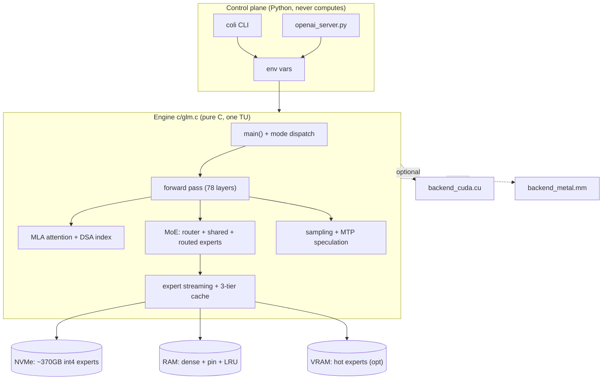
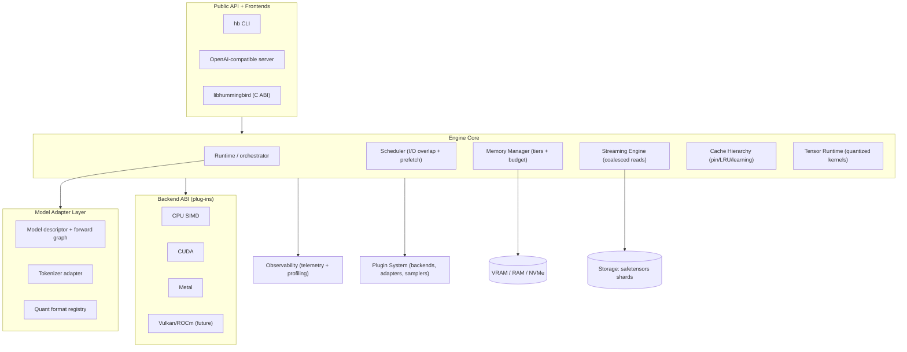

# Hummingbird — PROJECT_CONTEXT.md

> **Single source of truth** for the Hummingbird project. Any AI coding assistant
> (Claude Code, Codex CLI, Gemini CLI, Cursor, Windsurf, OpenCode, …) or human
> contributor must read this file **completely** before touching the repository.
> This document is part of the source code. It must never go stale — update it in
> the **same change** that alters architecture, code, roadmap, or benchmarks.
>
> - **Document status:** Living document.
> - **Last updated:** 2026-07-24
> - **Project phase:** `PHASE 9 — First End-to-End Model (RFC-015 GPT-OSS Integration)`.
>   Phases 1–8 are done; the GPT-OSS Model Adapter is now implemented:
>   architecture parser, graph builder, config parser, and weight mapping.
>   The core framework is now capable of full inference logic.
>   The tree builds and tests green
>   (**34/34 CTest cases**, clean-slate configure→build→ctest, exit 0 —
>   see §5, §9). The scaffold now contains **inference logic**: modules
>   expose identity + self-test entry points and a stable-ABI skeleton so the
>   tree compiles under strict warnings-as-errors. Every "Hummingbird
>   Architecture" statement about *inference behavior* below remains
>   `[PLANNED / DECIDED]` until marked `[VERIFIED]`; structural claims
>   (tree layout, build, module boundaries, public ABI surface) that are now
>   realized in code are marked `[BUILT]`.
> - **Scope note (changed in Phase 2 design):** Hummingbird is a **general-purpose
>   inference runtime** for large open-source LLMs — **both dense Transformers and
>   sparse MoE** — not a single-architecture engine. This supersedes the earlier
>   MoE-only framing.
> - **Maintainer / Lead:** Project owner (acting as lead systems architect &
>   senior C engineer), with AI assistance.

---

## Legend — status tags used throughout

| Tag | Meaning |
|-----|---------|
| `[VERIFIED]` | Confirmed by reading Colibrì source at a cited `file:line`. |
| `[BUILT]` | Realized in Hummingbird's own tree and confirmed by a passing build/test. |
| `[PLANNED]` | Intended Hummingbird design; not yet built, subject to change. |
| `[SPECULATIVE]` | Idea worth keeping; not committed to the roadmap. |
| `[DECIDED]` | An accepted architectural decision (see Design Decisions log). |
| `[OPEN]` | Unresolved question requiring a decision. |

---

# 1. Project Overview

### Project Name
**Hummingbird** — a general-purpose inference runtime for large open-source language models.

### Mission
Build the most flexible runtime for large open-source language models: run frontier-class
models — **both dense Transformers and sparse Mixture-of-Experts**, from ~20B to
1T+ parameters — on hardware from a 16–25 GB laptop to a multi-GPU host, by treating
VRAM, RAM, and storage as one managed memory hierarchy — **without silently degrading
model quality**. Placement decides speed; it must never decide correctness. The runtime
is never tightly coupled to one model architecture.

Target model families (illustrative, not exhaustive): GPT-OSS 20B / 120B, GLM,
DeepSeek, Qwen, Kimi, MiniMax, and future dense + MoE architectures.

### Vision
A small, dependency-light, portable inference engine that:
- scales from a 16–25 GB laptop (weights stream from disk, slow but correct) to a
  multi-GPU host (full residency, disk drops out of the decode path);
- is **model-agnostic** through a declarative forward-graph + typed-op adapter layer
  (not hard-wired to one model, dense or MoE);
- is **backend-agnostic** (CPU SIMD, CUDA, Metal, future Vulkan/ROCm) behind a
  stable ABI;
- is **extensible without core edits** — models, backends, quant methods, and tools
  are plug-ins;
- gets **faster the more it is used** via a learning cache;
- is **observable** — every placement, hit/miss, and timing is measurable;
- is **maintainable for 5+ years** — designed for contributors, not only for peak tok/s.

### Goals
1. `[PLANNED]` Faithful, quality-preserving forward pass validated token-exact
   against a reference (teacher-forcing) oracle, per supported model.
2. `[PLANNED]` A **universal model abstraction** (declarative skeleton + typed op
   modules) that expresses dense Transformers and sparse MoE in one runtime.
3. `[PLANNED]` Disk-streaming of large weight sets (routed experts *and* dense
   blocks) with a three-tier (VRAM/RAM/NVMe) learning cache.
4. `[PLANNED]` Compressed-KV attention (MLA-style) and standard MHA/GQA for long
   context on small RAM.
5. `[PLANNED]` A stable **backend ABI** so accelerators are plug-ins, not rewrites.
6. `[PLANNED]` A **plugin system** for models, backends, quant formats, and tools.
7. `[PLANNED]` Speculative decoding (draft/verify) that is provably lossless.
8. `[PLANNED]` OpenAI-compatible serving + observability dashboard.
9. `[PLANNED]` First-class cross-platform support (Linux, macOS, Windows).

### Non-Goals
- Not a training framework. Inference only.
- Not a general tensor library / autodiff engine (the tensor runtime exists only to
  serve inference forward passes).
- Not chasing maximum tok/s at the cost of output fidelity by default.
- Not a thin wrapper over llama.cpp / vLLM / TensorRT — it is a from-scratch engine.
- Not a multi-modal (image/audio) runtime in v1 — text LLMs first; the adapter layer
  should not preclude it later.
- No mandatory heavy dependencies (no required BLAS, no required Python at runtime).

### Core Principles
1. **Placement ≠ precision.** The router's decisions and weight precision are
   identical regardless of which tier answered. Lossy modes are opt-in and warn.
2. **Hide the disk, never wait for it twice.** Overlap I/O with compute; predict
   and prefetch; read each unique expert once per batch.
3. **Measure, don't assume.** Every claim is backed by a benchmark; the engine
   ships profiling that names the bottleneck.
4. **One artifact, few dependencies.** A single self-contained engine binary.
5. **Faithful first, fast second.** Correctness (token-exact vs oracle) gates any
   optimization.
6. **Observability is a feature.** Tiers, heat, hits, and timings are first-class
   outputs.
7. **Portability lives in one place.** All platform differences behind a compat shim.

### Inspiration — Colibrì
Hummingbird is directly inspired by **Colibrì** ("tiny engine, immense model"),
which runs GLM-5.2 (744B MoE) on ~25 GB RAM in pure C by streaming int4 experts
from disk. Section 2 is a complete, source-verified analysis of Colibrì. The name
"Hummingbird" is the English of "colibrì" — a deliberate homage to the lineage,
while signaling a distinct, model-agnostic redesign.

### Upstream Repository Links
- **Colibrì (reference / inspiration):** https://github.com/JustVugg/colibri
  - Local clone studied at: `./colibri/` (checked out 2026-07-20; Colibrì v1.0.0,
    released 2026-07-19).
- **Hummingbird:** *(this repository — remote TBD)*
- Reference model: GLM-5.2 int4 container (Hugging Face
  `mateogrgic/GLM-5.2-colibri-int4-with-int8-mtp`) — used by Colibrì; a candidate
  first bring-up target for Hummingbird.

---

# 2. Colibrì Analysis `[VERIFIED]`

> This section is the distilled result of a complete read of the Colibrì
> repository: the engine `c/glm.c` (6657 lines) read directly, plus every header,
> both GPU backends, the Windows DLL loader, the OLMoE sister engine, the full
> Python conversion/serving tooling, all 20 docs, and the web/desktop frontends.
> Citations are `file:line` into the cloned `./colibri/` tree.

## 2.1 High-Level Architecture

Colibrì is a **single-translation-unit C engine**. `c/glm.c` `#include`s its
subsystem headers directly (`glm.c:49-57`), so the compiler sees one program with
no linkage boundaries. GPU backends are the only separately-compiled units and are
optional (behind `#ifdef COLI_CUDA` / `COLI_METAL`).

Two-part model treatment is the central idea:
- **Dense part** (~17B params: attention, shared experts, embeddings, lm_head,
  first-3 dense MLPs, router weights) — **resident in RAM at int4** (~9.9 GB).
- **Routed experts** (19,456 = 75 MoE layers × 256 + MTP head; ~19 MB each int4;
  ~370 GB) — **on disk**, streamed on demand through a learning cache.

Only ~40B params activate per token; only ~11 GB (the routed experts) change
token-to-token. So the model is *placed*, not *fit*.



## 2.2 Folder Structure (Colibrì)

```
c/glm.c            (6657) the entire runtime
c/olmoe.c          (493)  OLMoE sister engine (validation/reference, PPL meter)
c/st.h             (300)  safetensors reader (pread + fadvise DONTNEED, no mmap)
c/tok.h            (286)  GLM byte-level BPE tokenizer (tiktoken-style)
c/tok_unicode.h    (162)  unicode class tables for the pretokenizer
c/tier.h           (60)   2-bit tier + 6-bit heat byte encoding; LFRU swap policy
c/uring.h          (137)  Linux io_uring batched expert I/O
c/grammar.h        (364)  GBNF grammar-forced speculative drafts
c/schema_gbnf.h    (246)  JSON-Schema -> GBNF compiler
c/json.h           (159)  minimal JSON parser (config.json, tokenizer.json)
c/decode_batch.h   (37)   DecodeRow / SUBMIT frame structs for mux serving
c/compat.h         (374)  Windows/POSIX/macOS shims (pread, O_DIRECT, mmap, mem)
c/backend_cuda.*   CUDA kernels + per-device resident tensors + extern"C" ABI
c/backend_metal.*  Apple Silicon Metal backend (runtime-compiled shader)
c/backend_loader.c (460)  Windows: LoadLibrary the CUDA DLL at runtime
c/openai_server.py (1153) OpenAI-compatible HTTP gateway
c/coli                    the user-facing CLI (flags -> env vars)
c/tools/                  offline FP8->int4 converter, oracle, quality ablation
c/tests/                  ~40 dependency-free C + Python tests
web/                      React/TS dashboard (chat, Brain cortex, Atlas, Profiling)
desktop/                  Tauri v2 shell hosting the web UI
docs/                     20 docs incl. ENVIRONMENT.md (every getenv) & serve_protocol.md
```

## 2.3 Execution Flow (`main()` → token)

**Startup:** `main()` parses `argv` (`./glm <cap> <ebits> <dbits>`) + dozens of env
vars → **OMP self-tune re-exec** (sets thread/affinity env, re-execs once via the
`COLI_OMP_TUNED` sentinel so libgomp reads it pre-`main`; `glm.c:6216-6261`) →
`load_cfg` (`glm.c:1344`, parses `config.json`, unions 3 EOS tokens, bounds-checks
every dim via `CKR`) → `model_init` (`glm.c:1519`, `st_init` hash-indexes shards,
loads all resident tensors, detects MTP head + DSA indexer presence) →
`cap_for_ram` RAM budget + OOM guard (`exit(2)` if projected peak > MemAvailable
unless `COLI_RAM_OVERCOMMIT=1`) → optional PIN/AUTOPIN hot-store + CUDA/Metal init.

**Per-layer forward** (`layer_forward_rows`, `glm.c:3861`): `rmsnorm(in_ln)` →
`attention_rows` (MLA + DSA) → residual add → `rmsnorm(post_ln)` →
`moe()` or `dense_mlp()` → residual add. Then `final_norm` + `lm_head` → logits.

**Sampling:** greedy (`TEMP=0`) or temperature + nucleus(top-p) + optional top-k;
optional GBNF grammar-forced drafts. Wrapped by **MTP speculative decoding**:
draft N tokens, verify all in one batched forward, accept the matching prefix.

**Modes:** one-shot (`PROMPT=`), legacy interactive (`SERVE=1`, `coli chat`), mux
continuous-batching (`SERVE_BATCH=1`, up to 16 KV slots, drives `openai_server.py`).

## 2.4 Memory Management

- **Resident vs streamed split** computed in `model_init`; `m->resident_bytes`
  accumulated via `qt_bytes()` (`glm.c:118-127, 1663-1675`).
- **No mmap for weights** — `st.h` uses `pread` + `posix_fadvise(DONTNEED)`
  specifically to keep RSS flat (mmap would leave 370 GB resident). `st.h:1-6`.
- **Auto RAM budget** ≈ 88% of MemAvailable at boot (`cap_for_ram`, `glm.c:6080`);
  static OOM guard + dynamic `rss_guard` (evicts LRU on measured RSS overflow,
  `glm.c:4947`).
- **NUMA** (`COLI_NUMA=1`): raw `mbind` interleave of resident slabs, no libnuma.
- **mlock** (`MLOCK`) wires the cache into physical RAM; skips CUDA-eligible host
  copies to avoid dead wired pages.

## 2.5 Streaming Architecture

- **Single coalesced `pread`:** the converter stores each expert's gate/up/down
  matrices **adjacent**; `expert_load_impl` (`glm.c:1762-1918`) checks contiguity
  and reads all three (~19 MB) in one syscall into a page-aligned `slab`; the three
  `QT`s are **zero-copy views** into it.
- **O_DIRECT twin fds** (`st.h`): each shard opened buffered + unbuffered; `DIRECT=1`
  uses the unbuffered twin (measured +65% on some NVMe).
- **Batch-union:** each unique expert read once across all batch positions.
- **io_uring** (`URING=1`, `uring.h`): batched SQEs, `IOSQE_ASYNC`, separate
  prefetch ring; replaces blocking loader pthreads on Linux.

## 2.6 Scheduler

- **PIPE** (`PIPE=1`): bounded pthread pool (default 8 workers) loads misses in
  background while resident experts compute; joins before layer completes.
  Lock-free generation-tagged cursor + per-slot release/acquire `ready` flags
  (`glm.c:2162-2251`). Mutex/condvar only park idle workers.
- **PILOT** (`PILOT=1`): a router-lookahead thread applies layer L+1's router to
  layer L's post-attention state (71.6% top-8 recall) and prefetches. `PILOT_REAL`
  loads into the cache off the critical path with a cross-layer handshake
  (`g_pilot_mx` + `g_pilot_inflight[]` + `g_cur_moe_layer`, `glm.c:3521-3778`);
  `PILOT_TWO` folds the shared expert into the prediction.
- **CACHE_ROUTE** (`CACHE_ROUTE=1`): the only *routing-side* lever — keep true
  top-J, fill remaining slots preferring resident experts within top-M
  (`glm.c:2926-3009`); prints agreement/KL telemetry. Off by default (can change
  which experts run).
- **OpenMP** for all matmuls; hot-thread tuning; physical-core binding.
- **CUDA resident pipeline** (`COLI_CUDA_PIPE=2`): residual stream stays on-device
  across layers.

## 2.7 Tensor Runtime

- No BLAS. Bespoke SIMD kernels dispatched by `matmul_qt_ex` (`glm.c:1027`) on
  tensor `fmt`.
- Families: `matmul` (f32), `matmul_q` (int8), `matmul_i4` (int4 per-row),
  `matmul_i4_grouped` (fmt=4), `matmul_i4_pair` (fused gate+up), `matmul_i2`.
- Two regimes: **exact** (f32 activation, bit-identical, forced for attention) and
  **IDOT** (int8 activation, integer dot via VPDPBUSD / ARM dotprod / VSX
  `vec_msum`, ~2–3× on expert matmuls). `IDOT=0` restores exact.
- SIMD paths for AVX2, AVX-512, AVX-VNNI, ARM NEON, NEON-i8mm (SMMLA), POWER VSX,
  all compile-time selected; scalar fallback everywhere.
- Hot kernel `dot_i4i8` (`glm.c:739`): 4 independent accumulators on ARM (12.4→29.9
  GB/s/core on M4), permute trick on AVX512-VNNI.

## 2.8 Model Loading

`st.h` reads standard safetensors: `[8-byte LE header length][JSON header][blob]`.
JSON maps tensor name → dtype/shape/data_offsets. All shards hash-indexed (FNV-1a,
open addressing) because linear scan over ~120k tensors cost seconds/token
(`st.h:41-46`). Header parse is hardened (length cap 512 MiB, offset bounds checks).
`config.json` parsed by `json.h`; `tokenizer.json` by `tok.h`. Tensor format is
**inferred from byte counts** (`qt_from_disk`, `glm.c:1452`), not stored as a tag.

## 2.9 Expert Loading

`expert_load` / `expert_load_impl` (`glm.c:1762-1950`): resolve 3 tensor offsets →
sort → contiguity check → single coalesced `pread` into reusable `ESlot.slab`
(or 3 separate reads / mmap path) → assemble zero-copy `QT` views → optional
`fadvise(DONTNEED)`. `fatal=0` for speculative pilot loads (clean unwind, never
kills the server); `fatal=1` for needed-now loads (matches serial exit semantics).
Thread-safe on distinct slots (positional pread, read-only `st_find`).

## 2.10 Quantization

Producer (`tools/convert_fp8_to_int4.py`) and consumer (`glm.c`) share **byte-
identical** packing so weights are read with zero transformation:
- **int8**: symmetric per-row absmax, scale/row, clip [-128,127].
- **int4** (fmt=2): per-row absmax, clip [-8,7], **offset-binary** (+8), even→low
  nibble / odd→high; `O×⌈I/2⌉` bytes + scale/row.
- **int4-grouped** (fmt=4): one scale per `gs=128` group (matches FP8 128×128 block
  granularity) — recovers most of per-row int4's quality loss.
- **int2** (fmt=3): 4/byte, offset +2.
Sensitive tensors (router, norms, `e_score_correction_bias`) stay **f32**. Embed &
lm_head 8-bit. **MTP head must be int8** (int4 → 0% draft acceptance, #8).

## 2.11 Threading Model

- OpenMP data-parallel matmuls (per-output-row).
- PIPE loader pthreads (lock-free claim, atomic ready flags).
- Single PILOT prefetch thread (lock-free 1P/1C ring + mutex/condvar handshake).
- io_uring: kernel owns I/O concurrency (single submitter thread).
- Sampling/decode is single-threaded.
- Windows binary-mode pipes; single stderr drain thread (double-reader deadlock
  avoidance).

## 2.12 Cache Hierarchy

Three levels per layer: **Pin** (hot-store, never evicted; from `.coli_usage`) →
**LRU `ecache`** (auto-sized to fill RAM, monotonic `eclock` recency) → **Disk**.
Hit accounting split by tier (`hit_pin`/`hit_ecache`). **Learning cache**: `eusage`
persisted every turn to `.coli_usage`; `AUTOPIN` pins hottest after ≥5000
selections; `REPIN` live-swaps via LFRU score (frequency<<8 | recency) with 25%
hysteresis and ≤4 swaps/pass (`tier.h`).

## 2.13 Performance Optimizations (inventory)

Compressed MLA KV (57×); weight absorption (decode scores in latent space); single
coalesced pread; PIPE overlap; PILOT prefetch; io_uring batching; batch-union;
O_DIRECT twin fds; learning cache + auto-pin; IDOT integer kernels; fused gate+up;
MTP speculation; OMP hot-thread tuning + core binding; NUMA interleave; CUDA
resident pipeline; Tensor Cores (W4A16/W4A4); grouped-int4; DSA sparse attention.

## 2.14 Important Data Structures

`Cfg` (geometry, `glm.c:95`), `QT` (5-format quantized tensor, `glm.c:111`),
`Layer` (`glm.c:129`), `ESlot` (expert slab slot, `glm.c:150`), `KVState`
(compressed MLA KV, `glm.c:153`), `Model` (god struct: tiers, learning cache, DSA,
MTP, counters, `glm.c:163-219`). See §7 for detail.

## 2.15 Important Algorithms

- **MLA weight absorption**: `q·k_nope = (Wₖᵀq_nope)·L`, `ctx = W_V(Σ aₜLₜ)` — score
  in latent space, O(T·512) vs O(T·H·448) (`glm.c:2681-2812`).
- **noaux_tc router**: sigmoid gate + bias-corrected *selection*, unbiased *weight*;
  n_group=1 collapses to global top-K (`glm.c:2919-3044`).
- **DSA lightning indexer**: cheap learned index → top-k keys; no-op (dense) when
  seq ≤ index_topk; quickselect for top-keep (`glm.c:2610-2680`).
- **Generation-tagged lock-free job cursor** (PIPE, `glm.c:2168-2204`).
- **Leviathan rejection sampling** for lossless speculative accept under sampling
  (`glm.c:4298-4302, 4495-4504`).
- **KV prefix reuse**: longest-common-prefix match + truncate-and-extend across
  requests/restarts.

## 2.16 Design Tradeoffs (Colibrì's)

Single TU (zero-dep, whole-program inlining vs 6657-line file, no module bounds);
quality-first defaults (correctness vs raw speed); streaming experts stay on CPU
even with CUDA (avoids PCIe bottleneck); correctness-first GPU kernels (not cuBLAS);
serial attention-bound prefill; pread+fadvise over mmap (RSS control vs page-cache
reuse).

## 2.17 Strengths

Runs a 744B model on 25 GB; genuinely quality-preserving; exceptional observability;
zero runtime dependencies; broad SIMD/accelerator coverage; honest, benchmark-backed
docs; robust hardening (bounds checks, DLL-hijack defense, crash-safe persistence);
the learning cache is a real, compounding win.

## 2.18 Weaknesses

- **One 6657-line file** — hard to navigate, test in isolation, or reuse.
- **Hard-wired to GLM-5.2** — `n_group==1` asserted; Metal fused paths bake in exact
  dims; adding a model means editing the monolith.
- **No formal module boundaries / public library API** — it's an executable, not a
  linkable core.
- **Config by ~80 env vars** — powerful but discoverability/validation is weak; some
  read on the hot path.
- **Test coverage is subsystem-level**, not a full end-to-end harness for arbitrary
  models.
- **Prefill is slow** (attention-bound, serial) — poor for large agent preambles.
- Stale in-code comments in places (e.g. "11 symbols" when 40 are resolved).

## 2.19 Lessons Learned (carried into Hummingbird)

1. The placement-≠-precision contract is the product; protect it structurally.
2. Adjacency-on-disk + single coalesced read is the highest-leverage streaming win.
3. Hiding misses (PIPE/PILOT) matters more than faster kernels on disk-bound hosts.
4. A learning cache that persists per-turn compounds real-world speed.
5. Compressed KV is what makes long context viable on small RAM.
6. Speculation must be *provably* lossless (kernel pinning; rejection sampling).
7. Observability (tiers/heat/hits/timings) is essential to tuning and trust.
8. Portability must be centralized (one compat shim), never sprinkled.
9. **What to change:** break the monolith into testable modules with a model
   adapter and a backend ABI, so new models/accelerators don't fork the core.

---

# 3. Hummingbird Architecture `[PLANNED]`

> **Status:** No code exists yet. This is the proposed target architecture,
> subject to revision through the Design Decisions log (§4). The guiding change
> from Colibrì is **modularity**: a small engine core, a **model adapter layer**,
> and a **backend ABI**, so new models and accelerators are additions, not forks.
>
> **Foundational decisions now locked (Phase 2):** the core is **C17**
> (DD-001), and the forward pass is a **hybrid declarative skeleton + typed op
> modules** (DD-004). Every spec below assumes these.
>
> **Design lens.** Colibrì proved a set of hard-won mechanisms on *one* model.
> Hummingbird's job is to keep every mechanism that is really about *placement and
> streaming* (which are model-independent) and pull every assumption that is really
> about *GLM-5.2* (dims, `n_group==1`, MLA-only, MTP-only) out of the core and into
> a model adapter. The test of the architecture is: **can a dense model and a
> sparse-MoE model share the entire core unchanged?** If yes, the boundaries are
> right.

## 3.1 Component Overview



## 3.2 Runtime `[PLANNED]`
The orchestrator: owns the forward loop, sequences layers, drives the scheduler,
and produces logits. Model-agnostic — it executes a **forward graph** provided by
the model adapter rather than a hard-coded 78-layer sequence. Owns run modes
(one-shot, interactive, batched serve).

## 3.3 Memory Manager `[PLANNED]` — allocator layer `[BUILT]`
Owns the tier model (VRAM/RAM/NVMe), the RAM budget computation, the static OOM
guard, and the dynamic RSS guard. Exposes an allocator that tags allocations by
tier and NUMA node. Ports Colibrì's `qt_bytes`-style exact accounting and the
"projected peak > MemAvailable → refuse" safety. Centralizes mlock/wire policy.
**Phase 5 `[BUILT]`:** the `hbi_allocator` vtable interface (DD-023), a
thread-safe system allocator with atomic live/peak/count/by-tag statistics and
opt-in debug red-zone canaries + leak table, a bump `arena`, and allocation tags
(`GENERAL/WEIGHTS/KV/SCRATCH`) as the placement hook. Huge-page + NUMA are
platform-level *hints* today (portable fallback). The tier model, budget, and
OOM/RSS guards remain `[PLANNED]` and will implement the same vtable.

## 3.4 Streaming Engine `[PLANNED]`
Reads expert weights from storage. Preserves Colibrì's **contiguity → single
coalesced read → zero-copy views** contract as a hard invariant. Backends:
buffered pread, O_DIRECT, io_uring (Linux), and a memory-map path. Provides an
async load API the scheduler drives; guarantees a fully-loaded slab before compute.

## 3.5 Scheduler `[BUILT]`
Overlaps I/O with compute and prefetches. Ports PIPE (async pool), PILOT
(router-lookahead), and a routing-side cache-aware option. Concurrency built on the
same lock-free-claim + release/acquire discipline. Backends may plug in their own
resident pipelines. **Correctness invariant:** any speculative/prefetch action is
non-fatal and never changes output.

## 3.6 Tensor Runtime `[PLANNED]` — kernel dispatch layer `[BUILT]`
Quantized matmul kernels behind a `matmul(fmt, …)` dispatch. Exact and integer-dot
(IDOT) regimes. Compile-time SIMD selection (AVX2/AVX-512/VNNI/NEON/i8mm/VSX) +
scalar fallback. Quant format registry is extensible (add a `fmt` + kernel +
size-detector). GPU kernels live behind the Backend ABI, not here.
**Phase 6 `[BUILT]`:** the `kernel` module (DD-025) — the backend-agnostic
compute abstraction at layer 4. Owns the op taxonomy (`hbi_kernel_op` — 17 ops
declared, 6 with registered CPU kernels), the kernel descriptor (`hbi_kernel`:
op, name, device, supported dtypes, layout flags, workspace-size hook, run fn),
a uniform call block (`hbi_kernel_args` + `hbi_kernel_params`), a reusable
aligned workspace (`hbi_kernel_workspace` — grows only on demand, zero alloc on
the warm path), a fixed-capacity registry backends populate at init (no locking,
no silent shadowing on duplicate (op,device,dtype)), and a dispatch/resolve pair
(key = op+device+dtype+layout-flags) so the runtime never hardcodes a backend.
The CPU reference kernels live in `backends/cpu/backend_cpu_kernels.c` and
register through `hb_backend_cpu_register_kernels()`: copy (fp32/int8), fill
(fp32/int8), cast (fp32↔int8), elementwise add/mul (fp32), transpose (fp32, any
rank), and matmul (fp32, rank-2 triple loop). All are scalar, correctness-first,
no SIMD. Benchmarks (`benchmarks/bench_kernel.c`) establish the M2 optimization
floor: dispatch overhead, resolve overhead, workspace warm-reserve, and the
reference matmul/copy/transpose at multiple sizes. Full documentation in
`docs/architecture/09-kernel-runtime.md`. The SIMD/IDOT/GPU and quantized
format dispatch remain `[PLANNED]`.

## 3.7 Backend Layer (ABI) `[PLANNED]`
A stable `extern "C"` interface (Colibrì's `backend_cuda.h`/`backend_metal.h` are
the template) with lifecycle, tensor upload/residency, matmul, fused expert group,
and attention entry points. Backends are **plug-ins**: statically linked where the
toolchain allows, or runtime-loaded (Colibrì's `backend_loader.c` DLL pattern) where
ABI/toolchain mismatch requires it. A failed backend call **always** falls back to
CPU per-tensor (`cuda_failed`-style flag).

## 3.8 Model Adapter Layer `[PLANNED]` — adapter framework `[BUILT]`
A model is described by data + a small adapter, not by editing the core:
- **Model descriptor**: geometry (dims, layer types, expert counts), quant classes
  per tensor, tensor-name templates, stop tokens.
- **Forward graph**: the per-layer op sequence (norm/attention/moe/mlp) as a small
  declarative structure the runtime executes; attention variants (MLA, GQA, …) and
  router variants (sigmoid/softmax, grouped) are selectable modules.
- **Tokenizer adapter**: BPE/unigram/etc.
- **Quant registry**: which formats this model's container uses.
This makes new MoE models additive. `[OPEN]` how declarative vs code-callback the
forward graph should be (DD-004).
**Phase 7 `[BUILT]`:** the `adapter` module (DD-032, RFC-014) — the
architecture-independent adapter framework at layer 6. Owns the adapter vtable
interface (`hbi_model_adapter`: init, validate_metadata, build_descriptor,
build_graph, register_tensors, create_context, destroy_context, get_capabilities,
get_statistics, shutdown), a dynamic registry (fixed-capacity, name-keyed, no
locking — populated at init time before workers), a model descriptor
(`hbi_model_descriptor` — geometry, attention/norm/activation variants, layer-type
bitmask), model capabilities (bitflags), model statistics (init/graph-build timings,
tensor count, memory usage), architecture abstraction enums (layer types, attention
variants, norm types, activation types, architecture families), and a mock adapter
for testing. The adapter lifecycle helpers (`hbi_adapter_resolve`,
`hbi_adapter_init_model`) bridge the model loader to the adapter. The runtime
interacts only through the vtable; no architecture-specific logic in the core.
**Phase 9 `[BUILT]`:** the `adapter_gpt_oss` module (RFC-015) — the
first real end-to-end model integration, mapping GPT-OSS conventions to the
 Hummingbird declarative structure, and using the new compute kernels (RMSNorm, RoPE, Softmax, Batched Matmul, Reduce, Activation). Other real model adapters (GLM, DeepSeek, etc.) remain `[PLANNED]`.
**Phase 8 `[BUILT]`:** the `tokenizer` module (DD-033, RFC-013) — the
model-independent text↔token conversion framework at layer 4. Owns the tokenizer
vtable interface (`hbi_tokenizer`: init, encode, decode, encode_incremental,
decode_incremental, free_context, shutdown), a vocabulary abstraction
(`hbi_vocabulary` — FNV-1a hash table, bidirectional text↔ID mapping, special
tokens, validation), UTF-8 utilities (encode/decode/validate/seq_len), a token
sequence (`hbi_token_sequence` — growable array), a decode state
(`hbi_decode_state` — partial UTF-8 tracking for streaming), a tokenizer manager
(`hbi_tokenizer_manager` — binds tokenizer + vocabulary + allocator with statistics
tracking), and a mock byte-level tokenizer for testing. The runtime interacts only
through the vtable; no tokenizer-specific logic in the core. Real tokenizer
implementations (BPE, SentencePiece, WordPiece, Unigram) remain `[PLANNED]`.

## 3.9 Plugin System `[PLANNED]`
Registration points for: backends, model adapters, samplers, and (later) routing
policies. Compile-time registration first; dynamic loading `[SPECULATIVE]`.

## 3.10 Public APIs `[PLANNED]`
- **`libhummingbird`**: a stable C ABI (load model, create context, prefill, decode,
  sample, KV save/load, telemetry) so the engine is embeddable — a capability
  Colibrì lacks (it is executable-only).
- **Wire protocol**: byte-counted, forward-compatible (adopt Colibrì's
  ignore-unknown-line-kinds rule) for the serving frontends.

## 3.11 CLI `[PLANNED]`
`hb` subcommands mirroring Colibrì's proven set: `run`, `chat`, `serve`, `web`,
`plan`, `doctor`, `convert`, `bench`. Flags map to a typed configuration (not raw
env vars) — see §3.13.

## 3.12 Configuration System `[BUILT]` (foundation) / `[PLANNED]` (full schema)
Replace Colibrì's ~80 ad-hoc env vars with a **typed, validated config** (file +
flags + env override), with a documented schema and `plan`/`doctor` introspection.
Env compatibility layer `[SPECULATIVE]` for Colibrì-familiar users.
**Phase 5 `[BUILT]`:** the `config` module — a schema-driven store (typed
descriptors: bool/int/uint/string + bounds + env name + help), precedence
default < file < env < programmatic with per-entry source tracking, a flat
`key=value` file parser, typed get/set with validation, and introspection
(DD-024). The engine-wide schema and CLI flag wiring are `[PLANNED]`.

## 3.13 Error Handling `[BUILT]`
Two-tier like Colibrì: **fatal** for model-load/needed-now failures (fail fast with
honest diagnostics — preserve the true OS error, cf. Colibrì #307), **fail-soft**
for speculative/optional paths (grammar, prefetch, GPU) that degrade to the correct
CPU path. Return-code discipline over silent fallthrough.
**Phase 5 `[BUILT]`:** the unified `hbi_status` enum + a thread-local `hbi_error`
record (status, os_errno, file/line/func, message) with `HBI_ERR_SET`/`SETF`
call-site capture, and a `platform` OS-error → text translator (DD-022). No
`exit()` in the library (DD-019). Fatal-vs-fail-soft remains a per-call-site
policy, applied as higher layers are built.

## 3.14 Logging `[BUILT]`
Structured, leveled logging separate from the telemetry stream. Telemetry
(tiers/heat/hits/timings) is a first-class machine-readable output, not log spam.
**Phase 5 `[BUILT]`:** six levels (TRACE/DEBUG/INFO/WARN/ERROR/PROFILING), a
record carrying structured key/value fields, a pluggable thread-safe sink (built-in
text + JSON formatters), a runtime level filter (atomic) plus a compile-time floor
(`HB_LOG_COMPILE_LEVEL`) that strips low levels entirely in release. The profiler
(§3, "measure, don't assume") is the *separate* telemetry stream: named nested
timing scopes + counters + events, near-zero cost when disabled, text report — no
UI. The generic `threadpool` (DD-020) and the `core` runtime-context lifecycle
object (DD-021) round out the foundation.

## 3.15 Testing Strategy `[PLANNED]`
- **Kernel unit tests** vs scalar reference (Colibrì's `test_i4_*`, `test_idot`).
- **Token-exact oracle** (teacher-forcing vs `transformers`) as the correctness gate
  — ported from `make_glm_oracle.py`/`eval_glm.py`.
- **End-to-end tiny-model** self-test (32/32 positions) in CI.
- **Property tests** for the streaming contiguity/zero-copy invariant.
- **Cross-platform CI** (Linux/macOS/Windows), as Colibrì does.
- Quantization **quality ablations** (`quant_ablation.py`-style) tracked in §10.

---

# 4. Design Decisions (ADR log)

> Append-only. Each entry: Problem · Context · Alternatives · Chosen · Tradeoffs ·
> Future. Status: `[DECIDED]` / `[OPEN]`.

### DD-000 — Study Colibrì fully before writing any code `[DECIDED]`
- **Problem:** Risk of reinventing or mis-copying a subtle, hard-won design.
- **Context:** Colibrì encodes many non-obvious lessons (int8 MTP, SPEC_PIN, pread
  vs mmap, coalesced reads).
- **Alternatives:** Start coding immediately; skim only.
- **Chosen:** Complete source read + this analysis before implementation.
- **Tradeoffs:** Up-front time cost; pays back in avoided rework.
- **Future:** Keep §2 updated if we re-examine upstream.

### DD-001 — Implementation language `[DECIDED]` → **C17**
- **Problem:** C (Colibrì's choice) vs C++ vs Rust vs Zig for the core.
- **Context:** Goals want modularity + a stable C ABI + broad SIMD + portability +
  direct reuse of Colibrì's hard-won kernels.
- **Alternatives:** (a) C17 — matches Colibrì, simplest ABI, most portable, kernels
  reusable as-is; (b) C++ — better module/type ergonomics, still C-ABI-exportable,
  but heavier and invites abstraction cost on the hot path; (c) Rust — safety +
  tooling, but harder SIMD-intrinsic parity, FFI friction, and no verbatim kernel
  reuse; (d) Zig — comptime + build system, smaller ecosystem/CI maturity.
- **Chosen (2026-07-20):** **C17** (`-std=c17`) for the engine core, public ABI, and
  CPU backend. GPU backends use their native dialect (CUDA C++ `.cu`, Objective-C++
  `.mm`) behind the `extern`-C backend ABI, exactly as Colibrì does.
- **Tradeoffs:** No language-level modules/namespaces (mitigated by strict file/
  prefix discipline, §7); no RAII (mitigated by explicit ownership docs + arena
  allocators, §3.3); manual generics (mitigated by codegen/macros for kernel format
  variants). We accept these to keep the ABI trivial, portability maximal, and
  Colibrì's kernels directly reusable.
- **Future:** Revisit only if a subsystem proves untenable in C; such a change needs
  a superseding ADR. C11 atomics + pthreads (or C11 `threads.h` where available) are
  the concurrency baseline.

### DD-002 — Monolith vs modular core `[DECIDED]`
- **Problem:** Colibrì's single 6657-line TU is powerful but unmaintainable/unreusable.
- **Context:** Non-goal to fork the core per model; goal is an embeddable library.
- **Alternatives:** Keep a monolith for whole-program inlining; split into modules.
- **Chosen:** **Modular core** with a model adapter layer and backend ABI. Preserve
  hot-path inlining via LTO / careful headers, not a single file.
- **Tradeoffs:** Slightly more build complexity; must guard against ABI-boundary
  overhead on the hot path.
- **Future:** Validate no measurable regression vs an inlined baseline.

### DD-003 — Model-agnostic adapter vs GLM-hardcoding `[DECIDED]`
- **Problem:** Colibrì bakes GLM-5.2 dims into fused paths and asserts `n_group==1`.
- **Chosen:** A **model adapter layer** (descriptor + forward graph + tokenizer +
  quant registry). Core executes the graph; model specifics live in the adapter.
- **Tradeoffs:** Indirection cost; a declarative graph must stay fast.
- **Future:** GLM-5.2 as the first adapter (proves parity); a second model proves
  generality.

### DD-004 — Forward graph representation `[DECIDED]`
- **Problem:** How to represent a model's per-layer op sequence.
- **Context:** Core must stay model-agnostic across dense + MoE families without
  paying interpreter overhead on the hot path or forking the core per model.
- **Alternatives:** (a) Declarative data (JSON/struct) interpreted by the runtime;
  (b) Code callbacks per model; (c) hybrid (declarative skeleton + typed op modules).
- **Chosen:** **(c) Hybrid — declarative skeleton + typed op modules.** A model
  adapter declares a per-layer skeleton (an ordered list of typed op nodes:
  `RMSNORM`, `ATTENTION`, `MOE`, `MLP`, `RESIDUAL`, …). Each op *type* is implemented
  once as a typed module in the core (a struct of function pointers + a typed params
  block). The runtime walks the skeleton and dispatches each node to its module —
  no string parsing, no per-op branching in the model. Variants (MLA vs GQA
  attention; sigmoid vs softmax router) are selected by an enum in the op's params,
  resolved to a module at model-load time.
- **Tradeoffs:** The set of op *types* is core-owned, so a genuinely novel op needs a
  new module (a plugin, §3.9) — but composition of existing ops is pure data. One
  indirect call per op node per layer (negligible vs a matmul; amortized over the
  layer's compute).
- **Future:** If a model needs an op the core lacks, it ships as an op-module plugin
  without touching existing models. Skeletons may later be authored in a config file
  once the struct form is proven.

### DD-005 — Preserve the streaming contiguity/zero-copy contract `[DECIDED]`
- **Problem:** The single-coalesced-read win depends on on-disk adjacency.
- **Chosen:** Make it a **hard invariant** of the streaming engine and converter,
  covered by property tests.
- **Tradeoffs:** Converter and engine stay coupled on layout (acceptable, mirrors
  Colibrì).

### DD-006 — Typed config instead of ~80 env vars `[DECIDED]`
- **Problem:** Colibrì's env-var surface is powerful but hard to discover/validate.
- **Chosen:** Typed, validated config (file + flags + env override) with an
  introspectable schema; optional env-compat shim.
- **Tradeoffs:** More up-front config plumbing.

### DD-007 — Backends as a stable ABI + fallback `[DECIDED]`
- **Problem:** Accelerators must not require forking the core; toolchain ABI
  mismatches exist (MinGW vs MSVC/nvcc).
- **Chosen:** `extern "C"` backend ABI; static link where possible, runtime DLL load
  where required; per-tensor CPU fallback on any failure.

### DD-008 — General-purpose (dense + MoE), not MoE-only `[DECIDED]`
- **Problem:** Original framing was sparse-MoE-only; Phase 2 mission is a general LLM
  runtime (GPT-OSS dense + MoE, GLM, DeepSeek, Qwen, Kimi, MiniMax, …).
- **Context:** A single-architecture engine (Colibrì) cannot absorb new families
  without a rewrite; the mission demands one runtime for many.
- **Alternatives:** (a) Stay MoE-only; (b) two engines (dense/MoE); (c) one runtime
  where "dense" is the degenerate MoE case (1 expert, always-on) expressed through
  the same op modules.
- **Chosen:** (c). A dense FFN is an `MLP` op; an MoE block is a `MOE` op; both are op
  modules the skeleton composes. Streaming applies to any large weight class, not
  only routed experts. This unifies the two without special-casing.
- **Tradeoffs:** The abstraction must not slow the dense path; validate dense parity
  early (GPT-OSS 20B is a good first dense bring-up alongside GLM MoE).
- **Future:** Supersedes the earlier "sparse MoE is the target class" non-goal.

### DD-009 — Weight class taxonomy drives placement, not "expert vs dense" `[DECIDED]`
- **Problem:** Colibrì hard-splits "dense resident" vs "routed streamed." A general
  runtime needs a model-declared notion of *what streams*.
- **Chosen:** Each tensor carries a **weight class** (e.g. `RESIDENT`, `STREAMED`,
  `SENSITIVE_F32`) from the model descriptor. The memory manager places by class +
  measured heat, not by a baked expert/dense assumption. A dense model may stream its
  FFN blocks; an MoE model streams experts — same mechanism.
- **Tradeoffs:** Descriptor must be expressive enough; default classes cover the
  common case so most models need no custom tagging.
- **Future:** Class policies become tunable (force-resident, force-stream) via config.

### DD-010 — Tensor descriptor: format tag on disk, not byte-count inference `[DECIDED]`
- **Problem:** Colibrì infers quant format from tensor byte counts (`qt_from_disk`) —
  clever but fragile and model-specific.
- **Chosen:** Hummingbird's container writes an explicit **tensor descriptor**
  (dtype/format, shape, group size, scale layout, byte offsets) in a sidecar/section,
  so the loader never guesses. Backward-compat importer for safetensors remains.
- **Tradeoffs:** A Hummingbird-native container format to define + a converter to
  produce it; safetensors import stays for interop.
- **Future:** DD-013 defines the container.

### DD-011 — Error model: typed status codes + rich diagnostic context `[DECIDED]`
- **Problem:** Colibrì mixes `exit(1)`, return-0-fallback, and errno; inconsistent.
- **Chosen:** A single `hb_status` enum returned everywhere on fallible paths, plus a
  thread-local last-error with a message + OS-error + call-site (preserve true OS
  error, cf. Colibrì #307). Fatal vs fail-soft is policy at the call site, not baked
  into the callee. No `exit()` inside `libhummingbird` — only frontends may exit.
- **Tradeoffs:** More plumbing than `exit()`; required for an embeddable library.
- **Future:** Map `hb_status` to process exit codes in the CLI.

### DD-012 — Concurrency: C11 atomics + a small thread-pool abstraction `[DECIDED]`
- **Problem:** Colibrì hand-rolls pthreads, a lock-free PIPE cursor, a PILOT thread,
  and OpenMP — powerful but scattered.
- **Chosen:** One internal **thread-pool + task** abstraction (built on C11 atomics +
  pthreads/`threads.h`), used by matmul parallelism, the I/O loader pool, and
  prefetch. Lock-free claim + release/acquire discipline (Colibrì's proven model)
  lives inside it, not sprinkled across the codebase. OpenMP optional for math only.
- **Tradeoffs:** An abstraction to design and keep lean; must not add hot-path cost.
- **Future:** Backends may still own their device streams.

### DD-013 — Native container format `hbm` (Hummingbird Model) `[DECIDED]`
- **Problem:** Need a stable, self-describing, streaming-friendly on-disk layout that
  guarantees the coalesced-read invariant (DD-005) across models.
- **Chosen:** Define `.hbm` — a safetensors-compatible base (so tools interoperate)
  plus (1) an explicit tensor-descriptor index (DD-010), (2) a documented **grouping
  rule** that lays a streamable unit's sub-tensors *adjacent* (expert g/u/d, or a
  dense FFN's gate/up/down), and (3) model-descriptor metadata (skeleton, classes,
  tokenizer ref). A converter produces `.hbm`; an importer reads plain safetensors
  with a heuristic layout.
- **Tradeoffs:** One more format; mitigated by keeping it a superset of safetensors.
- **Future:** Version the format; the loader refuses unknown major versions.

### DD-014 — Public API surface tiers: stable / experimental / internal `[DECIDED]`
- **Problem:** Need extensibility without freezing everything or breaking users.
- **Chosen:** Three explicit tiers. **Stable** (`hb_*` in `include/hummingbird.h`) —
  semver-guarded, never broken without a major bump + ADR. **Experimental**
  (`hb_x_*` in `include/hummingbird_experimental.h`) — may change, opt-in. **Internal**
  (`hbi_*`, not installed) — no stability promise. Plugin ABIs are versioned
  separately (DD-007 backend ABI has its own version int).
- **Tradeoffs:** Discipline overhead; pays back in a trustable embedding surface.
- **Future:** Promote experimental → stable via ADR once proven.

### DD-015 — Build system: modern CMake (≥3.20) + presets + Ninja `[DECIDED]`
- **Problem:** Colibrì builds via hand-written shell/`Makefile` per platform; a
  modular multi-target library + backends + frontends + tests needs a portable,
  scalable build with a clean option surface and cross-platform CI.
- **Alternatives:** (a) hand-rolled Makefiles; (b) Meson; (c) modern CMake +
  presets; (d) Bazel.
- **Chosen (2026-07-20):** **CMake ≥ 3.20** with `CMakePresets.json`, target-based
  design (every module is a `STATIC` library `hb_<mod>` with an
  `hummingbird::<mod>` alias), one central policy function `hb_apply_common()`
  (warnings, C17, sanitizer flags), and Ninja as the default generator. Options:
  `HB_BUILD_{TESTS,EXAMPLES,BENCHMARKS,TOOLS,FRONTENDS}`,
  `HB_BACKEND_{CPU,CUDA,METAL,ROCM,VULKAN}`, `HB_ENABLE_{ASAN,UBSAN}`,
  `HB_WARNINGS_AS_ERRORS`. In-source builds are hard-blocked.
- **Tradeoffs:** CMake's language is idiosyncratic; mitigated by keeping per-module
  files tiny and generated from one template. Future backends (ROCm/Vulkan) are
  declared as options now and `FATAL_ERROR` cleanly until implemented, so the
  option surface is stable.
- **Future:** add install/export config-package for downstream `find_package`
  (partially in place — headers + static lib + binaries install; CPack wired).

### DD-016 — Internal vs public symbol split: `hbi_`/`HBI_` vs `hb_`/`HB_` `[DECIDED]`
- **Problem:** DD-014 defines API *tiers* but not the concrete symbol convention;
  a naive shared `hb_status` enum in both the public header and internal headers
  collides at the one TU that bridges them (`src/hummingbird.c`).
- **Chosen:** **Internal** engine symbols/macros use `hbi_` / `HBI_` (e.g.
  `hbi_status`, `HBI_OK`); **public** ABI symbols/macros use `hb_` / `HB_` (e.g.
  `hb_status`, `HB_OK`). The two `status` enums are deliberately distinct types;
  the bridge TU (`src/hummingbird.c`) is the single place that maps `hbi_status`
  → public `hb_status`. Backend-ABI symbols are also `hbi_` (they are internal to
  the build, exposed to backends via `src/backend/backend.h`).
- **Tradeoffs:** Two status enums to keep in sync (guarded by the bridge + tests).
  Buys a clean, collision-free boundary and makes "is this public?" a grep.
- **Future:** a linker version script / `-fvisibility=hidden` equivalent can later
  enforce that only `hb_*` is exported from a shared build.

### DD-017 — One-file-per-module layout with a fixed six-file shape `[DECIDED]`
- **Problem:** Need a predictable, contributor-friendly structure that keeps
  public/private/implementation/test boundaries obvious across ~20 modules.
- **Chosen:** Each `src/<mod>/` contains exactly: `<mod>.h` (core-public header,
  `hbi_` API other modules may include), `<mod>_internal.h` (private — only that
  module's `.c` includes it), `<mod>.c` (implementation), `<mod>_test.c` (unit
  test → CTest target `<mod>`), `CMakeLists.txt`, and `README.md` (purpose +
  allowed/forbidden deps). A generator (`scripts/scaffold_modules.sh`) enforces
  the shape. `common` is the one hand-written exception (it defines `hbi_status`).
- **Tradeoffs:** Some boilerplate per module; offset by the generator and by the
  navigability win. A module that grows may split its `.c` into more files under
  the same dir without changing the contract.
- **Future:** the same shape extends to backends (`backends/<name>/`).

### DD-018 — Layered dependency graph, enforced bottom-up `[DECIDED]`
- **Problem:** DD-002's modular core is only a win if module dependencies stay
  acyclic and directional; Colibrì's `Model` god-struct is the anti-pattern.
- **Chosen:** A strict layering (low → high): `common` → `platform` →
  {`logging`, `profiler`, `config`, `device`} → {`tensor`, `quant`, `memory`,
  `stream`, `kv`, `backend`, `tokenizer`} → {`graph`, `model`} → `executor` →
  `scheduler` → `context` → `runtime` → aggregate `libhummingbird`. A module may
  depend only on strictly-lower layers (encoded in each `CMakeLists.txt`'s
  `target_link_libraries` and documented in each module README + §5). `common`
  depends on nothing but libc. Frontends/tools/examples depend only on the public
  library, never on `src/` internals. See `docs/architecture/03-dependency-graph.md`.
- **Tradeoffs:** Occasionally forces a shared type down into `common` rather than
  a convenient lateral include. Accepted — it is what keeps the graph acyclic.
- **Future:** a CI lint can parse `target_link_libraries` and fail on an upward or
  lateral edge; for now it is review-enforced.

### DD-019 — Frontends may `exit()`; the library never does `[DECIDED]`
- **Problem:** DD-011 says `libhummingbird` must not call `exit()`, but a CLI must
  turn failures into process exit codes somewhere.
- **Chosen:** Only `frontends/` (and `tools/`) may call `exit()`/return from
  `main`. They map public `hb_status` → process exit code (the CLI returns the
  numeric status for unimplemented subcommands today). Library and all `src/`
  modules return `hbi_status` and never terminate the process.
- **Tradeoffs:** none material; codifies the embedding contract.

### DD-020 — Reusable thread pool as its own module `[DECIDED]`
- **Problem:** DD-012 pre-authorizes "one internal thread-pool + task abstraction"
  but does not say where it lives. Raw OS threads/mutexes/condvars must stay inside
  `platform` (only `platform` may touch OS APIs); the *pool* built on them is a
  higher-level primitive many subsystems share.
- **Context:** Phase 5 (Runtime Foundation) needs generic work execution before any
  scheduler exists. Putting the pool in `platform` would overload the shim; putting
  it in `scheduler` (layer 8) would force low-layer users to depend upward.
- **Alternatives:** (a) fold it into `platform`; (b) fold it into `scheduler`;
  (c) a dedicated `threadpool` module low in the graph.
- **Chosen (2026-07-20):** **(c)** — a new `threadpool` module at **layer 2**,
  depending only on `common` + `platform`. It provides create/submit/try_submit/
  wait/destroy over a fixed worker set and a bounded MPMC queue (mutex+condvar), with
  completion counters. NO scheduling policy, priorities, work-stealing, or task
  dependencies — those belong to the future `scheduler` (layer 8) that sits on top.
- **Tradeoffs:** One more module in the graph; justified because the pool is a
  cross-cutting primitive (matmul parallelism, the loader pool, prefetch will all be
  tasks) and keeping it dumb keeps it correctness-simple.
- **Future:** `scheduler` composes this pool; PIPE/PILOT (§2.6) are policies above it.

### DD-021 — Runtime Context lives in a new `core` module, distinct from `runtime` `[DECIDED]`
- **Problem:** Phase 5 requires a "Runtime Context" that owns lifecycle,
  initialization/shutdown, foundation subsystems, configuration, and subsystem
  registration — and that *every future subsystem depends on*. But the documented
  `runtime` module (§3.2) is the top-of-DAG forward-loop **orchestrator** (depends on
  model/executor/scheduler — all inference, which Phase 5 forbids). A foundation
  lifecycle object is the opposite of a top-of-DAG orchestrator.
- **Alternatives:** (a) put the context in `runtime` (contradicts its role + pulls
  inference deps into a foundation object); (b) put it in `context` (that module is
  documented as per-session decode/KV state, §3, layer 9); (c) a new low/mid-layer
  `core` module dedicated to engine-instance lifecycle.
- **Chosen (2026-07-20):** **(c)** — a new `core` module owning an explicit
  `hbi_core` object: an inspectable lifecycle state machine (UNINIT→READY→DEAD),
  ordered bring-up/reverse teardown of foundation subsystems (allocator, logging
  level, device report, profiler, thread pool), borrowed accessors, and a generic
  name-keyed **subsystem registry** (opaque ptr + optional finalizer) so higher
  layers attach their own subsystems without `core` knowing their types. **No hidden
  globals** — everything hangs off the explicit handle (the deliberate departure from
  Colibrì's process-wide `Model` god-struct). `core` depends on the foundation
  modules only; the future `runtime` orchestrator (layer 10) sits *above* `core` and
  borrows it. `runtime`'s scope (§3.2) is unchanged.
- **Tradeoffs:** Two lifecycle-adjacent modules (`core` foundational, `runtime`
  orchestration). Accepted: mixing them would drag inference deps into the object the
  whole engine bootstraps from.
- **Future:** `runtime`, model manager, and backend registry register themselves on
  the `core` context via its registry.

### DD-022 — Error diagnostics split: record in `common`, OS-error text in `platform` `[DECIDED]`
- **Problem:** DD-011 mandates a thread-local last-error with message + OS-error +
  call-site, but `common` (layer 0) must not call OS APIs, while turning an errno /
  `GetLastError()` into text requires them.
- **Chosen:** `common` owns the thread-local `hbi_error` record (status, os_errno,
  file/line/func, message) and the `HBI_ERR_SET/HBI_ERR_SETF` capture macros; it
  stores the OS error *number* but never interprets it. `platform` owns
  `hbi_os_errno()` and `hbi_os_strerror()` (number → text). A caller composes them.
- **Tradeoffs:** The human-facing OS string is assembled one layer up from the record;
  acceptable and keeps layer 0 OS-free.
- **Future:** a helper that formats record+OS-text together can live in `platform`.

### DD-023 — Allocator is a vtable interface, not a fixed implementation `[DECIDED]`
- **Problem:** §3.3 wants tier-tagged, statistics-bearing, NUMA/huge-page-aware
  allocation, but the tiered manager does not exist yet and hot paths must be able to
  take *an* allocator without knowing which.
- **Chosen:** `hbi_allocator` = `{ vtable*, ctx }` with alloc/realloc/free taking an
  alignment + an `hbi_mem_tag` (GENERAL/WEIGHTS/KV/SCRATCH — the DD-009 placement
  hook). Two implementations ship in Phase 5: a thread-safe **system** allocator over
  the platform aligned-alloc shim (atomic live/peak/count/by-tag stats; opt-in debug
  red-zone canaries + a leak table), and a non-thread-safe **arena** bump allocator.
  Huge-page and NUMA are *hints* on the platform allocator today (portable fallback),
  not yet a placement policy.
- **Tradeoffs:** One indirect call per allocation off the hot path (allocations are
  not the inner loop; the executor pre-reserves buffers, §7).
- **Future:** the tiered VRAM/RAM/NVMe manager and NUMA-bound allocator implement the
  same vtable; callers do not change.

### DD-024 — Foundation config is a flat, typed `key=value` store `[DECIDED]`
- **Problem:** DD-006 mandates typed, validated, introspectable config replacing
  Colibrì's ~80 env vars, but the file format and precedence were unspecified.
- **Chosen:** A schema-driven store: a static array of typed descriptors (bool/int/
  uint/string + bounds + env-var name + help). Values resolve with precedence
  **default < file < env < programmatic**, each entry remembering its source for
  `plan`/`doctor` introspection. The file format is flat `key=value`, one per line,
  `#` comments, whitespace-trimmed — deliberately trivial to parse with no dependency.
  Richer types (enums, size suffixes) layer on later without an ABI change.
- **Tradeoffs:** Flat keys (dotted, e.g. `runtime.threads`) instead of nested
  sections; simplest thing that satisfies DD-006 and is easy to validate.
- **Future:** a TOML/JSON front-end may feed the same store; env-compat shim (§3.12).

### DD-025 — Kernel runtime: an interface/registry/dispatch layer, kernels live in backends `[DECIDED]`
- **Problem:** §3.6 (Tensor Runtime) wants "quantized matmul kernels behind a
  `matmul(fmt, …)` dispatch" and DD-007 wants backends to be plug-ins, but the
  *execution layer* — how a computation is described, how a concrete kernel is
  selected without hardcoding a backend, and where kernels register — was never
  given a module or a contract of its own. Without it, either the executor
  hardcodes CPU calls (breaking DD-007) or every backend reinvents dispatch.
- **Context:** RFC-003. The layer must be model-independent (no geometry, no
  scheduling, no inference), correctness-first (scalar reference kernels only —
  no SIMD/GPU yet), and must let CPU and future GPU kernels coexist behind one
  dispatch surface. It sits at layer 4 (`kernel`), beside `backend` (also layer 4).
- **Alternatives:** (a) fold dispatch into `tensor` (layer 3) — but that pulls an
  allocator/registry concern down into the pure data model; (b) fold it into
  `backend` — but `backend` is the lifecycle registry (DD-007), and a compute-op
  taxonomy is a distinct concern; (c) a dedicated `kernel` module owning the
  interface, with implementations living in backends.
- **Chosen (2026-07-22):** **(c)** — a new `kernel` module (layer 4) that owns
  ONLY the interface: the op taxonomy (`hbi_kernel_op` — copy/fill/cast/transpose/
  elementwise/matmul built now; reshape/reduce/softmax/rmsnorm/layernorm/rope/
  activation/moe-routing/attention/batched-matmul declared for a complete,
  future-proof surface that resolves to `HBI_ERR_NOT_FOUND` until implemented),
  a kernel descriptor (`hbi_kernel`: op, name, device, supported dtypes, layout
  flags, workspace-size hook, run fn), a uniform op-independent call block
  (`hbi_kernel_args` + `hbi_kernel_params`), a reusable aligned `hbi_kernel_workspace`
  (grows only on demand — no alloc on the warm path), a fixed-capacity **registry**
  backends populate at init before threads (no locking, no silent shadowing on a
  duplicate (op,device,dtype)), and a **dispatch**/resolve pair (key = op+device+
  dtype+layout-flags) so the runtime never hardcodes a backend. The CPU reference
  kernels live in `backends/cpu/` and register through `hb_backend_cpu_register()`;
  `kernel` never depends on a backend (the flow is the reverse), so depending on
  the sibling `backend` module would be a forbidden lateral edge and is avoided.
- **Tradeoffs:** one indirect call per op per dispatch (negligible vs a matmul;
  resolution can be cached at graph-build time so the decode hot path pays no
  lookup). The op-type set is core-owned, so a genuinely novel op needs a new
  descriptor+kernel (a plugin, §3.9) — but composing existing ops is pure data,
  matching DD-004. A fixed registry table (64) is ample for the bootstrap; dynamic
  growth arrives with plug-in loading (DD-007).
- **Future:** SIMD/IDOT regimes (M2) select via the reserved capability/layout
  bits without an ABI change; GPU kernels register the same descriptor from a
  CUDA/Metal backend; the executor resolves once and caches the descriptor.

### DD-032 — Model Adapter Framework (RFC-014) `[BUILT]`
- **Problem:** §3.8 and DD-003 require a model adapter layer so the runtime never contains architecture-specific logic. Colibrì hard-wires GLM-5.2; Hummingbird must express dense and MoE families through a common interface so new models are additive.
- **Context:** RFC-014. The adapter sits at layer 6 alongside `graph` and `model`, depending downward on model (manifest/metadata), graph (builder), tensor (types), kernel (op taxonomy), memory (allocator), platform (timers), and common. It must NOT depend on executor, scheduler, or backend.
- **Chosen:** Implemented the Model Adapter Framework in `src/adapter/` with:
  1. **Adapter vtable** (`hbi_model_adapter`): 10 callbacks (init, validate_metadata, build_descriptor, build_graph, register_tensors, create_context, destroy_context, get_capabilities, get_statistics, shutdown). All required; the registry rejects adapters with NULL fields.
  2. **Model descriptor** (`hbi_model_descriptor`): architecture name/enum, transformer geometry (layers, hidden_size, heads, kv_heads, intermediate_size, vocab_size, max_seq_length), MoE parameters (num_experts, active, stride), attention/norm/activation variants, layer-type bitmask.
  3. **Capabilities** (`hbi_model_capability`): bitflags for sparse MoE, KV compression, speculative decoding, batched inference, quantized weights, continuous batching, long context.
  4. **Statistics** (`hbi_model_statistics`): init/graph-build timings, tensor count, memory usage, graph node/value counts.
  5. **Architecture enums**: layer types (embedding/attention/FFN/MoE/residual/norm/output_head), attention variants (MHA/GQA/MQA/MLA), norm types (RMSNorm/LayerNorm), activation types (GELU/SiLU/ReLU/SwiGLU — prefixed `HBI_ADAPTER_ACT_` to avoid collision with kernel.h's `hbi_activation_kind`), architecture families (generic/dense/MoE).
  6. **Registry**: fixed-capacity (16), name-keyed, no locking (populated at init before workers), with find-by-name and find-by-arch lookups.
  7. **Lifecycle helpers**: `hbi_adapter_resolve` (metadata → adapter lookup), `hbi_adapter_init_model` (staged pipeline: init → validate → descriptor → register_tensors).
  8. **Mock adapter** (`adapter_mock.c`): implements the full vtable as a minimal dense transformer, used exclusively for testing. Validates metadata keys, builds descriptor, constructs a 2-node COPY graph, verifies embedding tensor exists, creates/destroys context.
- **Tradeoffs:** The adapter is at layer 6 alongside graph and model (same-layer dependency on graph/model is precedent from the model module). Fixed registry capacity is ample for bootstrap; dynamic growth arrives with plugin loading (DD-007). The activation enum uses a distinct prefix to avoid collision with the kernel module's existing activation kind — this is a deliberate separation, not a workaround.

### DD-033 — Tokenizer Framework (RFC-013) `[BUILT]`
- **Problem:** §3.1 (Tokenizer adapter) and DD-003 require a model-independent tokenizer abstraction so the runtime never contains tokenizer-specific logic. Colibrì hard-wires a GLM byte-level BPE tokenizer; Hummingbird must support BPE, SentencePiece, WordPiece, Unigram, and future tokenizers through a common interface.
- **Context:** RFC-013. The tokenizer sits at layer 4 alongside memory and backend, depending downward on common (error model), memory (allocator), and platform (timers). It must NOT depend on model, adapter, executor, scheduler, or backend.
- **Chosen:** Implemented the Tokenizer Framework in `src/tokenizer/` with:
  1. **Tokenizer vtable** (`hbi_tokenizer`): 8 callbacks (init, encode, decode, encode_incremental, decode_incremental, free_context, shutdown). Encode/decode are required; incremental and lifecycle callbacks are optional.
  2. **Vocabulary** (`hbi_vocabulary`): FNV-1a open-addressing hash table with bidirectional text↔ID mapping, special token support (UNKNOWN/PAD/BOS/EOS/SEP/CLS/MASK), auto-resize at 70% load, and validation (UTF-8 well-formedness, duplicate detection, missing unknown token).
  3. **UTF-8 utilities**: stateless encode/decode/validate/seq_len helpers for working with UTF-8 text — used by tokenizer implementations and the framework's validation routines.
  4. **Token sequence** (`hbi_token_sequence`): growable array of token IDs with create/append/append_many/get/clear/destroy.
  5. **Decode state** (`hbi_decode_state`): tracks partial UTF-8 bytes across incremental decode calls.
  6. **Registry**: fixed-capacity (16), name-keyed, no locking (populated at init before workers), with find-by-name lookup and clear for test isolation.
  7. **Tokenizer manager** (`hbi_tokenizer_manager`): binds a tokenizer + vocabulary + allocator, provides encode/decode/incremental_encode/incremental_decode with statistics tracking (encode/decode wall time, tokens processed, call counts), and lifecycle management (create/reset/destroy).
  8. **Mock tokenizer** (`tokenizer_mock.c`): byte-level tokenizer where each byte maps to token ID = byte + 5 (offset for special tokens at IDs 0-4). Implements full vtable including incremental encode/decode. Used exclusively for testing.
- **Tradeoffs:** The tokenizer is at layer 4, which means it depends on memory (allocator) and platform (timers) — both are at lower or same layers, which is consistent with the layered dependency graph. The vocabulary uses linear scan for ID→text lookup (O(n)); a reverse hash table is justified only when vocabulary sizes exceed thousands of entries and lookup latency becomes measurable. The mock tokenizer allocates its encode context via the sequence's allocator, which ties the context lifetime to the sequence — this is documented in the mock implementation.

### DD-034 — Architecture Review: RFC-013 & RFC-014 (2026-07-24) `[DECIDED]`
- **Problem:** RFC-014 (Model Adapter Framework) was implemented before RFC-013 (Tokenizer
  Framework). A formal principal-architect review was required to determine whether the
  implementation order introduced architectural violations, dependency inversions, hidden
  assumptions, or maintenance problems.
- **Context:** RFC-013 sits at layer 4 (`tokenizer` depends only on `common`, `memory`,
  `platform`). RFC-014 sits at layer 6 (`adapter` depends on `common`, `memory`, `tensor`,
  `platform`, `graph`, `model`). Neither module depends on the other.
- **Findings:**
  1. **Zero cycles, zero backward dependencies.** Confirmed by grep and CMakeLists.txt edge
     analysis. The adapter has no reference to any tokenizer symbol; the tokenizer has no
     reference to any adapter symbol.
  2. **Implementation order is architecturally irrelevant.** Because the two modules are
     peers with no dependency on each other, RFC-014 before RFC-013 is equally valid as
     the reverse. No refactoring is required.
  3. **7 non-blocking improvements identified (AI-001..007):**
     - **AI-001 (HIGH):** Add `hbi_allocator *` parameter to `hbi_tokenizer.free_context`
       before any real tokenizer implementation (BPE/SentencePiece) begins.
     - **AI-002 (HIGH):** Add a reverse hash table to `hbi_vocabulary` for O(1) ID→text
       lookup (current linear scan is O(n) — unacceptable for 32K-256K token vocabs).
     - **AI-003 (LOW):** Increment `vocabulary_lookups` counter inside
       `hbi_vocabulary_lookup` (counter is declared but never written).
     - **AI-004 (LOW):** Populate `hbi_model_statistics.graph_build_time_ns` by timing the
       `build_graph` call in the adapter lifecycle.
     - **AI-005 (LOW):** Migrate `adapter_test.c` from local `ASSERT` macro to shared
       `hbi_test.h` harness (consistency with all other module tests).
     - **AI-006 (MEDIUM):** Extend `hbi_model_descriptor` with `rope_theta` and
       `rope_scaling_type` fields when the first RoPE-based adapter (Llama/Qwen) lands.
     - **AI-007 (LOW):** Clarify in DD-032 that `shutdown` is optional in the adapter
       vtable (currently the text says "all required" but the registry check omits it).
     - **AI-008 (HIGH):** Add a validation step in the upper runtime layer during
       initialization to ensure `tokenizer.vocab_size <= adapter.vocab_size` to prevent
       out-of-bounds embedding lookups.
     - **AI-009 (MEDIUM):** Evaluate and possibly refactor `hbi_model_descriptor` which
       heavily biases towards Transformer/MoE geometries (`num_attention_heads`,
       `num_kv_heads`, etc.) if State Space Models (SSMs like Mamba) are placed on the roadmap.
  4. **APIs confirmed stable:** `hbi_utf8_*`, `hbi_token_sequence_*`, `hbi_vocabulary_*`
     (pending AI-002 implementation), `hbi_decode_state_*`, `hbi_tokenizer_registry`,
     `hbi_tokenizer_manager_*`, `hbi_model_adapter` vtable (pending AI-001),
     `hbi_model_descriptor` (pending AI-006 and AI-009), `hbi_model_capability` flags,
     `hbi_adapter_registry`.
  5. **Development may safely continue to RFC-015.** AI-001 must land before any real
     tokenizer implementation; AI-002 must land before M3 model bring-up.
- **Chosen:** Accept findings. Track AI-001..007 as technical debt. No architectural
  changes to the existing module structure.
- **Tradeoffs:** AI-001 is a breaking vtable change to `free_context`; since no real
  tokenizer implementations exist yet (only the mock), the cost is minimal now and grows
  if deferred.
- **Future:** Address AI-001 in the next tokenizer work item; AI-002 in M3 prep.

*(Add DD-035+ as decisions are made.)*

### DD-026 — Execution Graph and Runtime Executor `[DECIDED]`
- **Problem:** §3.8 wants a "declarative forward graph" and §3.2 mentions the executor translates this into kernel dispatches. We need an immutable IR for operations and an executor that respects the rule "no memory allocation on the hot path".
- **Context:** RFC-004. The graph builder creates nodes and values, infers shapes/dtypes, detects cycles, and generates a topological execution order. The executor pre-resolves kernels at graph build time and executes sequentially.
- **Alternatives:** (a) Execute operations eagerly (imperative mode) — prevents optimization and requires per-op dispatch lookup overhead on every execution. (b) Bake memory planning into the graph construction — couples graph logic to memory management tightly.
- **Chosen (2026-07-22):** 
    * `graph`: The declarative execution graph builder and typed op-node registry. `[BUILT]`
    * `planner`: Memory planner handling tensor liveness and optimal buffer aliasing. `[BUILT]`
    * `device`: Device Manager and hardware abstraction layer for capability and memory discovery. `[BUILT]`
    `graph` builds the immutable IR (`hb_graph`) with topological order and pre-computed values, ensuring cycle freedom. `executor` creates an execution context (`hb_exec_context`), allocating necessary workspaces and intermediate tensors upfront. The execution loop (`hbi_executor_run`) iterates the topological order and dispatches the pre-resolved `hb_kernel` without allocating memory.
- **Tradeoffs:** Requires building a complete execution graph upfront before inference begins; negligible cost because models are static and the graph is built once at startup. 
- **Future:** `graph` can be optimized (kernel fusion) before `executor` consumes it. `hb_exec_context` can interact with advanced memory planners for optimal tensor reuse.

---

# 5. Repository Structure

> **Current state `[BUILT]` (Phase 4):** the repository skeleton exists and
> compiles. Every directory below is present with a README; every `src/` module
> builds to a static lib with a green CTest; `libhummingbird` links and installs.
> **No inference logic exists** — modules expose only `hbi_<mod>_name()` /
> `hbi_<mod>_selftest()` identity/self-check stubs. Full design rationale for the
> layout lives in `docs/architecture/01-repository-structure.md` and `02..08`.

### Current (actual, builds clean)
```
Hummingbird/
├── .claude/PROJECT_CONTEXT.md     ← this file (single source of truth)
├── .github/                       ← issue/PR/discussion templates, CI/format/docs/release workflows, CODEOWNERS
├── CMakeLists.txt, CMakePresets.json
├── .clang-format, .clang-tidy, .editorconfig, .gitignore
├── README.md, LICENSE, CONTRIBUTING.md, CODE_OF_CONDUCT.md, SECURITY.md, CHANGELOG.md
├── cmake/modules/                 ← HBCompilerOptions.cmake, HBSanitizers.cmake
├── include/hummingbird/           ← public C ABI: hummingbird.h (stable) + hummingbird_experimental.h
├── src/                           ← 23 modules + aggregate hummingbird.c (libhummingbird)
│   ├── common/ platform/ logging/ profiler/ config/ threadpool/ device/ tensor/ quant/
│   ├── memory/ stream/ kv/ backend/ tokenizer/ graph/ model/ adapter/ executor/ scheduler/
│   └── core/ context/ runtime/    (each: <mod>.{c,h}, <mod>_internal.h, <mod>_test.c, CMakeLists.txt, README.md)
│   ├── [BUILT Phase 5 — real code, not stubs]: common (error model), platform
│   │   (OS shim), logging, config, profiler, threadpool, device, memory, core
│   ├── [BUILT Phase 6 — kernel runtime (RFC-003, DD-025)]: kernel (op taxonomy,
│   │   dispatch, registry, workspace); CPU reference kernels in backends/cpu/
│   ├── [BUILT Phase 7 — adapter framework (RFC-014, DD-032)]: adapter (vtable
│   │   interface, registry, descriptor, capabilities, statistics, mock adapter)
│   ├── [BUILT Phase 8 — tokenizer framework (RFC-013, DD-033)]: tokenizer (vtable
│   │   interface, vocabulary, UTF-8 utilities, token sequence, registry, manager,
│   │   statistics, mock tokenizer)
├── backends/                      ← cpu/ (always built), cuda/ (.cu stub), metal/ (.m stub); rocm/vulkan reserved
├── frontends/                     ← cli/ (hb), server/ (hb-server) — the only binaries allowed to exit()
├── tools/                         ← offline tooling (toolinfo stub; converter/oracle later)
├── tests/                         ← integration/, property/, e2e/ (cross-module; unit tests live in src/<mod>/)
├── examples/                      ← version.c — embeds the public library only
├── benchmarks/                    ← bench_noop, bench_alloc, bench_threadpool, bench_kernel (RFC-003 baselines)
├── docs/architecture/             ← 01..09 design docs (01..08 Phase 3; 09 kernel runtime Phase 6)
├── scripts/                       ← scaffold_modules.sh (module generator)
├── third_party/                   ← vendored deps (empty; zero-dependency by default)
└── colibri/                       ← upstream reference clone (git-ignored, study only)
```

Note: the model **adapter** framework (DD-003/DD-008, RFC-014) now lives in
`src/adapter/` as a module at layer 6. Real model adapters (GLM-5.2, GPT-OSS,
etc.) are separate deliverables that will add files under `src/adapter/` or
a future `adapters/` tree when concrete adapters land in M3.

**Module communication `[BUILT]` skeleton:** frontends → public API
(`libhummingbird`) → runtime → {memory, scheduler, stream, kv, tensor, quant,
graph, model, adapter, executor, context} → backend ABI; backends (cpu/cuda/metal) register
through the versioned `hbi_backend` vtable (DD-007). `common` + `platform` are the
lowest nodes and depend on nothing but libc. All cross-module calls go through each
module's public header — no shared globals (a departure from Colibrì's `Model`
god-struct). The full allowed/forbidden edge set is specified and enforced-by-review
in `docs/architecture/03-dependency-graph.md`.

---

# 6. Development Roadmap

- **Current milestone:** `M1 — Foundations` (IN PROGRESS; runtime foundation done).
- **Completed:**
  - ✅ Full Colibrì source analysis (§2).
  - ✅ `.claude/PROJECT_CONTEXT.md` created (this file).
  - ✅ `M0 — Study & Context`.
  - ✅ Phase 3 — repository & module architecture designed
    (`docs/architecture/01..08`).
  - ✅ Phase 4 — repository **bootstrapped** `[BUILT]`: CMake build system
    (root + per-module + presets), 20 `src/` modules with unit tests, aggregate
    `libhummingbird` + public ABI headers, CPU backend + CUDA/Metal stubs behind
    the ABI, `hb`/`hb-server` frontends, tools/examples/benchmarks/tests trees,
    all `.github/` templates + CI/format/docs/release workflows, and the top-level
    standards files. **Verified:** clean configure→build→`ctest` (27/27 passing)
    with GCC 16.1.0 (UCRT64) on Windows; `-Werror` + strict warning set on;
    install/CPack stage the public headers + libs + binaries.
  - ✅ Phase 5 — **runtime foundation** `[BUILT]`: the eight foundation subsystems
    are implemented (no longer stubs) with real unit tests: `common` (unified
    error model — thread-local diagnostic record + OS-errno + call-site, DD-011/
    DD-022), `platform` (files/threads/mutex/cond/event/timers/CPU-query/aligned+
    huge alloc/OS-error, the sole OS-API layer), `logging` (6 levels, structured
    fields, pluggable text/JSON sinks, compile-time floor), `config` (typed schema
    store, default<file<env<set precedence, DD-024), `profiler` (nestable timing
    scopes + counters + events, near-zero cost when off), `device` (host+SIMD
    report), `memory` (allocator vtable + system/arena impls + stats + debug
    canaries/leak table, DD-023), `threadpool` (new module, DD-020), and `core`
    (new module: `hbi_core` lifecycle context + subsystem registry, DD-021).
    A shared `tests/support/hbi_test.h` harness backs every module test.
  - ✅ Phase 6 — **kernel runtime** `[BUILT]` (RFC-003, DD-025): the backend-
    agnostic compute abstraction. Op taxonomy (17 ops declared, 6 with CPU
    kernels), kernel descriptor, uniform call block, workspace management,
    fixed-capacity registry (no locking, no silent shadowing), and dispatch/
    resolve (key = op+device+dtype+layout). CPU reference kernels: copy, fill,
    cast, elementwise add/mul, transpose, matmul — all scalar, correctness-
    first, no SIMD. Benchmarks establish the M2 optimization floor (dispatch
    overhead, reference matmul, copy, transpose, workspace). Architecture doc
    `docs/architecture/09-kernel-runtime.md`. **Verified:** 31/31 CTest cases
    pass (Debug, GCC 16.1.0 UCRT64, `-Werror`).
  - ✅ Phase 7 — **model adapter framework** `[BUILT]` (RFC-014, DD-032): the
    architecture-independent adapter layer. Adapter vtable interface (10
    callbacks), dynamic registry, model descriptor, capabilities, statistics,
    architecture abstraction enums, mock adapter, and comprehensive test suite.
    **Verified:** 33/33 CTest cases pass (Debug, GCC 16.1.0 UCRT64, `-Werror`).
  - ✅ Phase 8 — **tokenizer framework** `[BUILT]` (RFC-013, DD-033): the
    model-independent text↔token conversion layer. Tokenizer vtable interface
    (8 callbacks), vocabulary abstraction (FNV-1a hash table, bidirectional
    mapping, special tokens, validation), UTF-8 utilities, token sequence,
    decode state, dynamic registry, tokenizer manager with statistics, mock
    byte-level tokenizer, and comprehensive test suite.
    **Verified:** 33/33 CTest cases pass (Debug, GCC 16.1.0 UCRT64, `-Werror`).
- **Pending (next):**
  - `M1 — Foundations` (remaining): resolve DD-004 graph representation to code;
    safetensors reader; JSON parser; tiny-model oracle wired into CI. (DD-001
    language → C17; build system, test harness, error model, API tiers, platform
    shim, typed config, leveled logging, allocator, thread pool, runtime context,
    kernel runtime all now in place.)
  - `M2 — Tensor + CPU backend`: quantized kernels (int4/int8/grouped/int2) with
    unit tests vs scalar reference; matmul dispatch; IDOT.
  - `M3 — Model adapter + forward (CPU, resident)`: GLM-5.2 adapter; MLA attention;
    router/MoE; token-exact oracle parity on a tiny model.
  - `M4 — Streaming + cache`: (completed via RFC-017) coalesced expert loading; 3-tier cache; learning cache;
    PIPE overlap. Run the real model on a small-RAM host.
- **Future milestones:**
  - `M5 — Scheduler`: PILOT prefetch; io_uring; NUMA.
  - `M6 — Speculation`: MTP draft/verify (lossless), grammar drafts.
  - `M7 — Backends`: CUDA (completed via RFC-016), then Metal behind the ABI; resident pipeline.
  - `M8 — Serving`: OpenAI-compatible API, KV slots, dashboard.
- **Blockers:** none for M1 entry. DD-001 (C17) and DD-004 (hybrid forward
  graph) are both `[DECIDED]` and the build system exists. The open *research*
  question (how declarative the graph can be without hot-path cost, §10) is an
  M3 implementation concern, not an M1 blocker.
- **Risks:** (a) declarative forward graph adding hot-path overhead; (b) achieving
  token-exact parity with GLM-5.2's MLA+DSA+MTP; (c) SIMD parity across ISAs;
  (d) scope creep from model-agnosticism before the first model even runs.

---

# 7. Coding Standards `[BUILT]`

> Finalized for C17 (DD-001) and now **enforced by tooling**: `.clang-format`
> (style), `.clang-tidy` (lint), `.editorconfig` (whitespace), and the compiler
> warning wall + `-Werror` in `cmake/modules/HBCompilerOptions.cmake`. See
> `docs/architecture/07-documentation.md` and `08-contribution-workflow.md`.

- **Naming:** `snake_case` functions/vars; `snake_case_t` (or plain `snake_case`
  struct tags) for types; `SCREAMING_SNAKE` macros/constants. **Symbol prefixes
  (DD-014/DD-015):** `hb_` = stable public ABI (installed), `hb_x_` = experimental
  public ABI, `hbi_` / `HBI_` = internal (never installed). The internal status
  enum is `hbi_status` with `HBI_*` values; the public mirror is `hb_status` with
  `HB_*` values — the bridge TU `src/hummingbird.c` is the only place they meet.
- **File organization:** one responsibility per file; public API in `include/`;
  no god-structs — pass explicit context objects.
- **Header conventions:** include guards; minimal transitive includes; document the
  ownership contract of every pointer parameter.
- **Documentation style:** every public function documents purpose, ownership,
  thread-safety, and failure mode. Keep comments truthful (no stale counts).
- **Error handling:** explicit return codes; fatal vs fail-soft (§3.13); never
  swallow the real OS error; no silent fallthrough.
- **Assertions:** liberal `assert` on invariants in debug; bounds-check all
  file-derived sizes in release (cf. Colibrì's `CKR`).
- **Logging:** structured, leveled; separate from telemetry.
- **Memory ownership:** documented per allocation; aligned allocations freed with
  their matching free (cf. Colibrì `compat_aligned_free`); no ambiguous ownership
  across module boundaries.
- **Thread safety:** document each function's contract; prefer lock-free with
  explicit acquire/release like Colibrì; mutex only for parking, not correctness,
  where feasible.
- **Performance:** hot paths avoid allocation and getenv; SIMD behind compile-time
  guards + scalar fallback; measure before/after (§10).
- **Testing philosophy:** correctness gate (oracle) is non-negotiable; every kernel
  has a scalar-reference test; the streaming invariant is property-tested.
- **Cross-platform:** all platform differences in the compat shim; 64-bit file
  offsets mandatory; binary-mode I/O; UTF-8 correctness on Windows.

---

# 8. Performance Goals `[PLANNED]`

> Targets are directional until Hummingbird runs; calibrate against Colibrì's
> measured numbers (§9 references) on matched hardware.

| Metric | Target (initial) | Notes |
|--------|------------------|-------|
| Memory usage | ≤ Colibrì resident footprint (~10 GB dense int4 for GLM-5.2) | must not regress |
| Startup time | ≤ ~30 s to ready (warm) | parity with Colibrì |
| Token throughput | ≥ Colibrì on matched HW/config | correctness-gated |
| Disk bandwidth | approach device O_DIRECT ceiling (measure via bench) | streaming-bound floor |
| GPU utilization | keep expert loop uninterrupted (resident pipeline) | when backend active |
| CPU utilization | physical-core bound, no SMT contention | OMP tuning |
| Cache efficiency | rising hit-rate over a session (learning cache) | pin + LRU + auto-pin |
| Latency (TTFT / per-token) | competitive with Colibrì per tier | report p50/p90/p99 |

**Rule:** no optimization merges if it breaks token-exact parity. Speed is measured;
correctness is proven.

---

# 9. Benchmark History

> Empty until Hummingbird runs. Format: date · commit · machine · model · config ·
> tok/s · TTFT · hit% · RSS · notes. Track regressions explicitly.

- *(no Hummingbird inference benchmarks yet — no forward pass exists.)*

**Build/test health (not perf, but the baseline the benchmark harness will hang
off):** 2026-07-20 · Phase-4 bootstrap · Windows 11 / GCC 16.1.0 (UCRT64) / Ninja
/ CMake — clean-slate `cmake → build → ctest` is green: 98 build targets,
**27/27 CTest cases pass**, `ctest` exit 0, under `-Werror` + full warning wall.
`cmake --install` stages public headers + `libhummingbird.a` + `hb`/`hb-server`.

2026-07-21 · Phase-5 foundation re-verification · Windows 11 / GCC 16.1.0 (UCRT64)
/ Ninja / CMake 4.4.0 — **both `dev` (Debug) and `release` (RelWithDebInfo) presets
configure, build, and `ctest` green: 29/29 CTest cases pass on each**, exit 0, no
compiler warnings under the wall. Includes the arena-alignment fix (§10) and its
new deterministic regression test (`test_arena_large_alignment`), which was
confirmed to fail against the pre-fix code and pass against the fix.

2026-07-22 · Phase-6 kernel runtime (RFC-003) · Windows 11 / GCC 16.1.0
(UCRT64) / Ninja / CMake 4.4.0 — `dev` (Debug) preset configure, build, and
`ctest` green: **31/31 CTest cases pass**, exit 0, no compiler warnings under
the wall. Includes the kernel interface test (`test_kernel`, 13 cases) and the
CPU reference-kernel correctness test (`test_backend_cpu_kernels`, 8 cases).
Benchmark harness (`bench_kernel`) compiles and runs: dispatch overhead, resolve
overhead, workspace warm reserve, reference matmul (64/128/256), copy (1M/4M),
transpose (512/1024) — all producing plausible scalar-reference numbers as the
M2 optimization floor.

2026-07-22 · Phase-6 execution graph (RFC-004) · Windows 11 / GCC 16.1.0
(UCRT64) / Ninja / CMake 4.4.0 — `dev` (Debug) and `release` (RelWithDebInfo)
presets configure, build, and `ctest` green: **31/31 CTest cases pass**.
Includes the graph builder API test (`test_graph`) and executor integration test (`test_executor`).
Benchmark harness (`bench_graph`) compiles and runs: graph build and topological sort overhead (1k nodes: ~10µs),
executor creation and static resolution (1k nodes: ~21µs), and execution of 1000 transposes on 128x128 
matrices taking ~87µs per transpose node.

2026-07-24 · Phase-7 model adapter framework (RFC-014) · Windows 11 / GCC 16.1.0
(UCRT64) / Ninja / CMake 4.4.0 — `dev` (Debug) preset configure, build, and
`ctest` green: **33/33 CTest cases pass**, exit 0, no compiler warnings under
the wall. Includes the adapter interface test (`test_adapter`, 15 cases covering
registration, metadata validation, descriptor building, graph construction,
tensor registration, context lifecycle, capabilities, statistics, error handling,
vtable validation, and selftest). The `backend_cpu` integration test also added.

2026-07-24 · Phase-8 tokenizer framework (RFC-013) · Windows 11 / GCC 16.1.0
(UCRT64) / Ninja / CMake 4.4.0 — `dev` (Debug) preset configure, build, and
`ctest` green: **33/33 CTest cases pass**, exit 0, no compiler warnings under
the wall. Includes the tokenizer framework test (`test_tokenizer`, 25 cases
covering UTF-8 encode/decode/validate, token sequence, vocabulary operations,
special tokens, decode state, registry, manager encode/decode, incremental
encode/decode, statistics, error handling, and selftest). The tokenizer module
was upgraded from a scaffold stub to a full framework with vtable interface,
vocabulary hash table, UTF-8 utilities, and mock tokenizer.

**Colibrì reference points** (from `docs/benchmarks.md`, for calibration only):
- 6×RTX 5090, full residency: 5.8–6.8 tok/s, TTFT ~13 s.
- 128 GB CPU desktop: ~1.8 tok/s warm.
- Single RTX 5070 Ti: 1.07 tok/s (GPU-resident pipeline).
- 25 GB dev box: 0.05–0.1 tok/s cold (the honest floor).
- int4 quality: ~-8.2pp vs fp16 on hard tasks (per-row); grouped scales recover ~63%.

---

# 10. Known Issues

- **Bugs:** none open. **Fixed 2026-07-21:** the bump `arena` allocator
  (`src/memory/memory.c`) aligned the bare byte *offset* instead of the absolute
  `base+offset` *address*. Because the backing block carries only the parent
  allocator's natural alignment (~16 B), any request for a larger alignment could
  return a misaligned pointer. Fixed to align the absolute address and derive the
  offset from it; covered by a deterministic regression test
  (`test_arena_large_alignment`, alignments 64–4096) verified to fail pre-fix.
- **Environment caveats:**
  - **ASan/UBSan don't link on the UCRT64 MinGW GCC used for local dev on
    Windows** — that package ships no `libasan`/`libubsan` (link fails with
    `cannot find -lasan`). The flag wiring (`HB_ENABLE_ASAN/UBSAN`,
    `HBSanitizers.cmake`) is correct and *configures* fine; sanitizer runs happen
    in CI on Linux/Clang (`.github/workflows/ci.yml`). Use a Clang or Linux
    toolchain locally if you need sanitizers on this machine.
  - CUDA/Metal backends are stubs and are OFF by default; ROCm/Vulkan options
    `FATAL_ERROR` by design until implemented.
- **Technical debt (tracked — DD-034, 2026-07-24):**
  - **AI-001 (HIGH — fix before BPE impl):** `hbi_tokenizer.free_context` vtable
    callback is missing an `hbi_allocator *` parameter. The mock works around this
    by calling `hbi_allocator_system()` directly, which will break real tokenizer
    implementations using custom allocators.
  - **AI-002 (HIGH — fix before M3):** `hbi_vocabulary` ID→text lookup
    (`vocab_find_by_id`) is O(n) linear scan. At 32K-256K token vocabularies this
    dominates decode latency. A reverse hash table is required before real models.
  - **AI-003 (LOW):** `hbi_tokenizer_statistics.vocabulary_lookups` counter is
    declared but never incremented anywhere in `tokenizer.c`.
  - **AI-004 (LOW):** `hbi_model_statistics.graph_build_time_ns` is always 0 because
    `build_graph` timing is not measured in `hbi_adapter_init_model`.
  - **AI-005 (LOW):** `adapter_test.c` uses a local `ASSERT` macro instead of the
    shared `hbi_test.h` harness used by all other modules.
  - **AI-006 (MEDIUM — before Llama/Qwen adapter):** `hbi_model_descriptor` lacks
    `rope_theta` and `rope_scaling_type` fields needed by RoPE-based architectures.
  - **AI-007 (LOW):** DD-032 says all 10 adapter vtable callbacks are "required" but
    `shutdown` is not checked at registration time (and is documented as NULL-safe).
  - Dependency-graph enforcement is review-only until the CI lint (DD-018 "Future")
    lands.
- **Missing features:** all inference behavior — see roadmap (§6). The tree is a
  build/test skeleton only.
- **Open research questions:**
  - How declarative can the forward graph be without hot-path cost? (DD-004)
  - Can we keep Colibrì's SIMD kernel performance under a modular boundary? (DD-002)
  - Best abstraction for attention variants (MLA/GQA/MHA) in the adapter?
  - How to generalize the quant format registry cleanly across models?
- **Performance bottlenecks (inherited expectation):** disk-bound decode on small
  RAM; attention-bound serial prefill. Design must attack both from the start.

---

# 11. Future Ideas

**Planned (on roadmap):** model adapter layer; typed config;
embeddable `libhummingbird`; token-exact oracle CI.

**Speculative `[SPECULATIVE]`:**
- Dynamically loadable model adapters / backends (drop-in `.so`/`.dll`).
- Multi-model hosting in one process (shared dense, per-model experts).
- Learned prefetch beyond one-layer lookahead (sequence models over routing).
- Coupling-graph expert co-residency (Colibrì's `COUPLE` generalized).
- Expert-atlas-driven placement (topic-affinity-aware pinning).
- Cross-request expert cache sharing in the server.
- A Vulkan/ROCm backend for non-CUDA GPUs.
- Quantization research hooks (rotation/lattice, per Colibrì `quant_ablation.py`).

---

# 12. AI Agent Instructions  ⚠️ MOST IMPORTANT SECTION

Every AI assistant (and human) working in this repository **must** follow these
rules.

### Before making any changes
1. **Read this file completely.** It is the source of truth.
2. Treat `PROJECT_CONTEXT.md` as part of the source code.
3. **Understand the architecture (§3) and the decision log (§4) before modifying
   code.** Do not contradict a `[DECIDED]` entry without a new ADR.
4. Preserve documented design decisions unless the task is an explicit redesign —
   in which case add/supersede an ADR entry first.
5. **Explain significant architectural changes before implementing them.** For an
   `[OPEN]` decision (e.g. DD-001 language, DD-004 graph), surface options and get
   owner sign-off; do not silently pick.
6. Respect the current **project phase**: while in `PHASE 0 — Study & Design`, do
   **not** generate implementation code unless the owner explicitly starts a build
   milestone.

### After making changes
1. **Update `PROJECT_CONTEXT.md` in the same change** (never a follow-up).
2. Update architecture diagrams (§3) if structure changed.
3. Update the roadmap (§6) progress.
4. Update benchmarks (§9) if performance changed (with machine + commit).
5. Update the decision log (§4) when a decision was made or revised.
6. Record newly discovered issues (§10).
7. Ensure documentation matches implementation — flip `[PLANNED]` → `[VERIFIED]`/
   implemented, with `file:line` where useful.

### Never
- Implement undocumented architectural changes.
- Leave `PROJECT_CONTEXT.md` out of sync with the code.
- Introduce hidden assumptions or magic constants without documenting them.
- Break a public API (§3.10) without documenting the change and bumping the ADR.
- Copy Colibrì code verbatim without attribution and without fitting it to the
  modular architecture (respect its Apache-2.0 license).

### Always prioritize (in order)
1. **Correctness** (token-exact vs oracle is the gate).
2. **Maintainability.**
3. **Readability.**
4. **Performance.**
5. **Extensibility.**

The project context file must always represent the **current state of the
repository**. If you find it stale, fixing it is the first task.

### DD-027 — Architecture Review (RFC-001 to RFC-007) `[DECIDED]`
- **Problem:** The architecture developed up through the Scheduler (RFC-007) required a comprehensive review to identify any emergent mismatches, bottlenecks, or security flaws before implementing the Streaming Engine.
- **Context:** While strict layering has been maintained, some internal APIs leaked, and component linkage became inconsistent with the original design.
- **Chosen:** Adopt the architectural corrections identified in the RFC-001 to RFC-007 Engineering Review:
  1. **Executor refactor:** The Executor must consume `hbi_execution_plan` instead of raw `hbi_graph` so it executes properly ordered tasks and obeys hardware synchronizations.
  2. **Scheduler encapsulation:** `hbi_task_queue` and `hbi_task_graph` are strictly internal implementation details and must be moved to `scheduler_internal.h`.
  3. **Kernel I/O capability:** Increase `HBI_KERNEL_MAX_INPUTS` from 4 to 8 in `kernel.h` to adequately support Fused Attention, KV Cache updates, and MoE routing.
- **Tradeoffs:** Requires revisiting previously 'built' components, but guarantees the design will scale to MoE and LLMs without painful bottlenecks later.

### DD-028 — Backend Interface & Compute Framework (RFC-008) `[BUILT]`
- **Problem:** Hummingbird needs a robust, abstract interface to offload operations to pluggable accelerators (CPU, CUDA, Metal) without leaking hardware details into the runtime logic.
- **Context:** The engine orchestrates compute using graphs and schedules. For portability, the backend must be hidden behind an opaque capability and command-driven ABI.
- **Chosen:** Implemented the complete Backend Interface defined in RFC-008, featuring:
  1. **Registry & Manager:** `hbi_backend_manager` tracking dynamic context lifecycles.
  2. **Capability Model:** Hardware limits, alignments, and datatype capabilities surfaced through `hbi_backend_capabilities`.
  3. **Command Interface:** Unified `hbi_backend_command` for generic kernel dispatches and memory transfers.
- **Tradeoffs:** Adds an indirect dispatch overhead via a vtable structure, but strictly isolates platform-specific code to plugins, which is essential for our modularity goals.

### DD-029 — CPU Backend Reference Implementation (RFC-009) `[BUILT]`
- **Problem:** Hummingbird needed a canonical, correctness-first implementation of the Backend Interface to serve as the baseline for all tests and fallback execution.
- **Context:** Following the abstract interface definition in RFC-008, the CPU backend acts as the proving ground for context lifecycle, generic command dispatch, memory tracking, and kernel parameter passing.
- **Chosen:** Implemented the full `hbi_backend` vtable in `backend_cpu.c` with a purely synchronous dispatch model. It handles `HBI_CMD_KERNEL_DISPATCH` by dynamically casting and running scalar reference kernels from the kernel registry, and `HBI_CMD_MEMCOPY_*` via standard `memcpy`. Execution statistics are fully integrated.
- **Tradeoffs:** Synchronous execution simplifies the initial design but bounds throughput; async task queues and SIMD extensions are explicitly deferred (via capability flags) to later optimization phases.

### DD-030 — Model Loader Framework (RFC-011) `[BUILT]`
- **Problem:** Hummingbird needs a format-independent way to discover, validate, and index model tensor assets without eagerly loading weight data into memory.
- **Context:** Models can be 370GB+ (routed expert sets). Eager loading is infeasible. The loader must produce a manifest of tensor descriptors (name, shape, dtype, file offset, byte size, residency hint) that the Streaming Engine consumes on demand. Multiple file formats (GGUF, Safetensors) must be supported through pluggable handlers.
- **Chosen:** Implemented the Model Loader Framework in `src/model/` with:
  1. **Format handler vtable:** `hbi_format_handler` with `detect`, `parse_metadata`, `read_tensor_data` — registered at init time, auto-detected at load time.
  2. **Tensor manifest:** `hbi_model_manifest` — a growable table of `hbi_tensor_entry` descriptors with duplicate detection and validation.
  3. **Model metadata:** `hbi_model_metadata` — key-value pairs from the model file header.
  4. **Load pipeline:** `hbi_model_load()` — staged pipeline (detect → parse → validate → finalize) returning an `hbi_load_session` that owns the manifest and metadata.
  5. **Skeleton handlers:** GGUF (magic-byte detection) and Safetensors (header-length-prefix detection), both returning `HBI_ERR_UNSUPPORTED` for actual parsing (deferred to format-specific RFCs).
- **Tradeoffs:** Skeleton handlers cannot yet parse real model files — full GGUF/Safetensors parsing is a separate deliverable. The manifest uses linear search for name lookup (O(n)); a hash table is justified only when models exceed thousands of tensors.

### DD-031 — KV Cache Manager & Context Runtime (RFC-012) `[BUILT]`
- **Problem:** Hummingbird needs an efficient, backend-independent system for managing attention state (Key-Value cache) across multiple generation contexts.
- **Context:** KV management must decouple memory handling from specific attention kernels (MHA, GQA, MLA) and support extension to paged KV, NUMA-aware allocation, and distributed architectures.
- **Chosen:** Implemented the KV Cache Manager in `src/kv/` with:
  1. **KV Allocator VTable:** `hbi_kv_allocator` allows swapping allocation strategies.
  2. **Contiguous Allocation:** The initial default allocator assigns exactly one page per context scaling up to `max_tokens` using the underlying base allocator.
  3. **Context Operations:** Strictly manages metadata and token cursors via `hbi_kv_context_append_tokens` and `hbi_kv_context_truncate` without assuming specific tensor layouts or invoking transformer kernels.
  4. **Strict Bounds Checking:** Hard guarantees on capacity overflows and invalid token append tracking.
- **Tradeoffs:** Initial contiguous allocation limits maximum context sizes dynamically and may lead to fragmentation compared to a true paged KV architecture. The vtable design provides an explicit migration path to paged/GPU memory in subsequent optimization phases.

### DD-032 — CUDA Backend Implementation (RFC-016) `[BUILT]`
- **Problem:** Hummingbird needs a hardware-accelerated backend to validate the `hbi_backend` ABI (RFC-008) against a real GPU without breaking modularity.
- **Context:** The engine must execute kernels on CUDA GPUs, managing asynchronous execution, memory copies (H2D/D2H), device discovery, and error translation without bleeding CUDA specifics into the main runtime.
- **Chosen:** Implemented the CUDA backend in `backends/cuda/backend_cuda.cu` alongside device and stream managers. It translates `cudaError_t` to `hbi_status`, uses `cudaStream_t` for non-blocking execution, and dynamically registers baseline implementations for RMSNorm, MatMul, Linear, Attention, and Elementwise kernels into the core registry.
- **Tradeoffs:** Currently registers baseline kernels. Advanced kernel fusions and stream optimizations (like compute/transfer overlap) are deferred until the foundational pipeline is rock-solid.

### DD-033 — Hierarchical Streaming Engine & Adaptive Cache (RFC-017) `[BUILT]`
- **Problem:** Hummingbird needs to run massive models (like 744B MoEs) by streaming parameters from NVMe because they exceed physical RAM/VRAM capacity.
- **Context:** The core philosophy shifts from fitting a model into memory to placing cold/warm/hot weights intelligently across 4 tiers (CPU Cache, RAM, VRAM, NVMe SSD). This subsystem defines Hummingbird.
- **Chosen:** Implemented the Hierarchical Streaming Engine in `src/stream/`. It provides a Hierarchical Memory Manager, an Adaptive Cache with pluggable policies (LRU, LFU, ARC), a Residency Manager, an Expert Locality Tracker, and a Prefetch Engine.
- **Tradeoffs:** Correctness and generic adaptivity are prioritized over model-specific or hardware-specific heuristics. Advanced predictive prefetching is deferred until real-world statistics guide it.

---

*End of PROJECT_CONTEXT.md*

