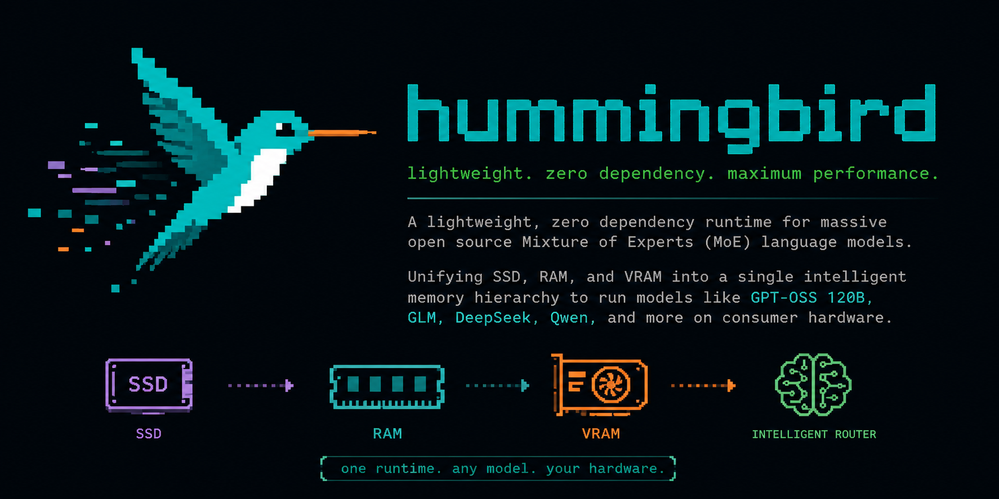
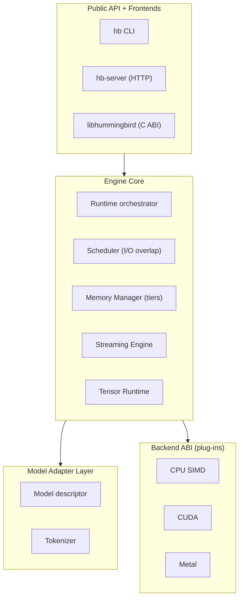
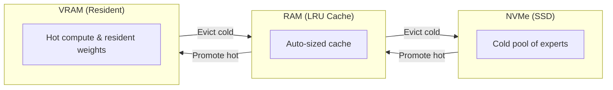

<p align="center">
  
</p>

<p align="center">
  
  
  
  
</p>

<p align="center">
  A zero-dependency C17 runtime for running massive open-source LLMs, <br/>
  both dense and Mixture of Experts, on consumer hardware.
</p>

---

## Why Hummingbird?

Frontier open-weight models have grown past the point where they fit in the memory of an ordinary machine. A model with hundreds of billions of parameters needs far more RAM than a laptop or a single consumer GPU can offer.

Hummingbird shifts the problem from fitting the model to **placing the model across the storage you already have**. It unifies SSD, RAM, and VRAM into a single managed hierarchy, keeping always-needed weights resident, streaming the large pool of expert weights from disk on demand, and caching what it has recently used. 

The design lets a machine with a modest amount of RAM run a model whose total size dwarfs that RAM, and it does so in portable C with no third-party runtime dependencies.

## Getting Started

You need a C17 compiler (GCC, Clang, or MSVC) and CMake version 3.20+. There are no third-party runtime dependencies (no BLAS, no Python).

```sh
# Clone the repository
git clone https://github.com/prayangshuuu/hummingbird.git
cd hummingbird

# Configure and build
cmake --preset dev
cmake --build --preset dev

# Run the test suite
ctest --preset dev
```

Run the scaffold binaries to confirm everything links and executes:

```sh
./build/frontends/cli/hb --version
./build/examples/example_version
```

## Usage & How to Run

Once the frontends are built, you can use the `hb` CLI for inference and serving (note: inference is currently in development).

```sh
# One-shot text generation
./build/frontends/cli/hb run --model /path/to/model.hbm --prompt "Hello world"

# Interactive chat mode
./build/frontends/cli/hb chat --model /path/to/model.hbm

# Start an OpenAI-compatible HTTP server
./build/frontends/cli/hb serve --model /path/to/model.hbm --port 8080
```

## Build Options

You can customize the engine by passing options to CMake (`-D<option>=ON`):

| Option | Default | Description |
|--------|:-------:|-------------|
| `HB_BUILD_TESTS` | ON | Build unit and integration tests. |
| `HB_BUILD_FRONTENDS` | ON | Build the `hb` CLI and `hb-server`. |
| `HB_BUILD_TOOLS` | ON | Build offline tooling (converters/oracles). |
| `HB_BACKEND_CPU` | ON | The reference CPU backend (correctness baseline). |
| `HB_BACKEND_CUDA` | OFF | Enable the CUDA backend accelerator. |
| `HB_BACKEND_METAL`| OFF | Enable the Apple Silicon Metal accelerator. |

## Architecture

The engine is organized in strict layers, allowing it to scale from small devices to large accelerators seamlessly.



## The Memory Hierarchy

The defining feature of Hummingbird is that SSD, RAM, and VRAM are treated as one hierarchy.



1. **Weight Classes:** Weights needed for every token (attention, embeddings) stay resident. The large pool of routed expert weights lives on disk and moves up on demand.
2. **Learning Cache:** Repeated workloads keep the right weights warm. The engine gets faster the more it is used.
3. **Coalesced Streaming:** Expert weights are read in one large sequential I/O and handed directly to kernels via zero-copy views.

## Upcoming Features

* **KV Cache Manager**: Paged memory allocator specifically for KV tensors.
* **Model Loader**: Serialization/Deserialization parser for Safetensors & GGUF.
* **GPU Backend Interface**: Unified abstractions for loading `.so/.dll` for CUDA and Metal at runtime.
* **Dynamic Batching**: Server-grade continuous batching for maximum throughput.
* **Streaming Engine**: Coalesced I/O via `io_uring` and memory-mapped IO.

## Embedding Hummingbird

Because the engine is a library with a stable C ABI, you can easily embed it directly into another application.

```c
#include <hummingbird/hummingbird.h>
#include <stdio.h>

int main(void) {
    /* Query the runtime version of the library */
    printf("hummingbird %s\n", hb_version_string());

    /* Status codes turn into stable, human-readable strings */
    hb_status st = HB_ERR_NOT_IMPLEMENTED;
    printf("Status: %s\n", hb_status_string(st));

    return 0;
}
```
## License

Hummingbird is released under the [Apache License, Version 2.0](LICENSE).
