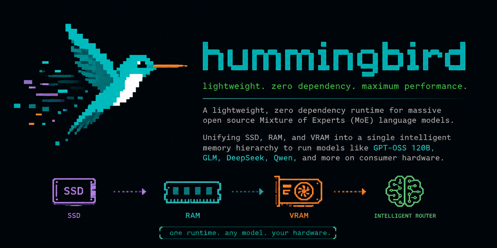
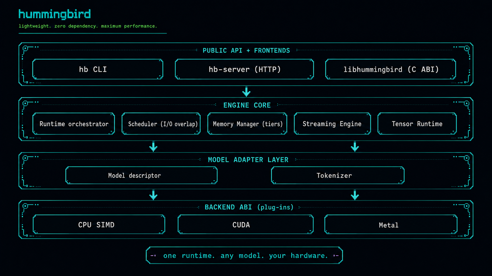
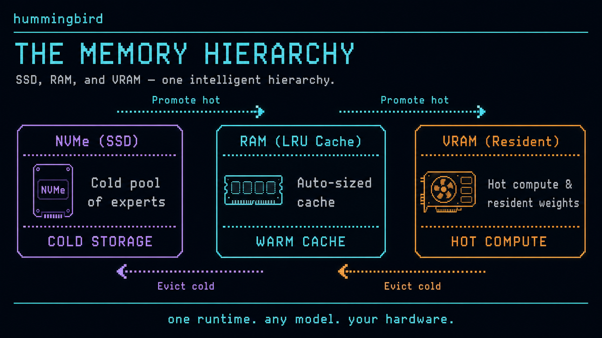

<p align="center">
  
</p>

<p align="center">
  
  
  
  
</p>

<p align="center">
  A zero-dependency C17 runtime for running massive open-source LLMs, <br/>
  both dense and Mixture of Experts, on consumer hardware.
</p>

---

## Acknowledgement

This project is heavily inspired by [Colibri](https://github.com/JustVugg/colibri). Hummingbird was never intended to be a direct copy of Colibri; rather, it aims to build upon those ideas with a completely different architecture and approach. The key difference is that while Colibri is a highly specialized engine allowing you to run massive models like GLM-5.2 (744B MoE) on a 25GB-RAM consumer machine via SSD streaming, Hummingbird provides a generalized, modular inference framework designed to run *any* model architecture through its flexible adapter interface.

## Why Hummingbird?

Frontier open-weight models have grown past the point where they fit in the memory of an ordinary machine. A model with hundreds of billions of parameters needs far more RAM than a laptop or a single consumer GPU can offer.

Hummingbird shifts the problem from fitting the model to **placing the model across the storage you already have**. It unifies SSD, RAM, and VRAM into a single managed hierarchy, keeping always-needed weights resident, streaming the large pool of expert weights from disk on demand, and caching what it has recently used. 

The design lets a machine with a modest amount of RAM run a model whose total size dwarfs that RAM, and it does so in portable C with no third-party runtime dependencies.

## Getting Started

The easiest way to install Hummingbird on Linux/macOS is using our one-liner installer:

```sh
curl -sSL https://raw.githubusercontent.com/prayangshuuu/Hummingbird/main/install.sh | bash
```

Alternatively, you can build from source. You need a C17 compiler (GCC, Clang, or MSVC) and CMake version 3.20+. There are no third-party runtime dependencies (no BLAS, no Python).

```sh
# Clone the repository
git clone https://github.com/prayangshuuu/hummingbird.git
cd hummingbird

# Configure and build
cmake --preset dev
cmake --build --preset dev

# Run the test suite
ctest --preset dev
```

Run the binaries to confirm everything links and executes:

```sh
./build/frontends/cli/hb --version
./build/examples/example_version
```

## Usage & How to Run

Once the frontends are built, you can use the `hb` CLI for inference and serving (CPU inference is now fully functional).

```sh
# One-shot text generation
./build/frontends/cli/hb run --model /path/to/model.hbm --prompt "Hello world"

# Interactive chat mode
./build/frontends/cli/hb chat --model /path/to/model.hbm

# Start an OpenAI-compatible HTTP server
./build/frontends/cli/hb serve --model /path/to/model.hbm --port 8080
```

## Build Options

You can customize the engine by passing options to CMake (`-D<option>=ON`):

| Option | Default | Description |
|--------|:-------:|-------------|
| `HB_BUILD_TESTS` | ON | Build unit and integration tests. |
| `HB_BUILD_FRONTENDS` | ON | Build the `hb` CLI and `hb-server`. |
| `HB_BUILD_TOOLS` | ON | Build offline tooling (converters/oracles). |
| `HB_BACKEND_CPU` | ON | The reference CPU backend (correctness baseline). |
| `HB_BACKEND_CUDA` | OFF | Enable the CUDA backend accelerator. |
| `HB_BACKEND_METAL`| OFF | Enable the Apple Silicon Metal accelerator. |

## Architecture

The engine is organized in strict layers, allowing it to scale from small devices to large accelerators seamlessly.



## The Memory Hierarchy

The defining feature of Hummingbird is that SSD, RAM, and VRAM are treated as one hierarchy.



1. **Weight Classes:** Weights needed for every token (attention, embeddings) stay resident. The large pool of routed expert weights lives on disk and moves up on demand.
2. **Learning Cache:** Repeated workloads keep the right weights warm. The engine gets faster the more it is used.
3. **Coalesced Streaming:** Expert weights are read in one large sequential I/O and handed directly to kernels via zero-copy views.

## Milestone Status

| Milestone | Scope | Status |
|-----------|-------|--------|
| **M1** | Platform, memory, tensor, config, common | ✅ Complete |
| **M2** | Kernel registry, thread pool, execution graph, scheduler | ✅ Complete |
| **M3** | Runtime orchestrator, tokenizer framework, model adapter, KV cache, greedy sampler | ✅ Complete |
| **M4** | Streaming engine (RFC-020), paged KV, SIMD kernels | 🔄 In Progress |
| **M5** | CUDA backend, Metal backend | ⏳ Planned |

## What's Implemented

All layers 0–9 of the inference stack are built and passing tests:

| Subsystem | Module | Notes |
|-----------|--------|-------|
| OS abstraction | `platform` | Threads, files, clocks, aligned alloc |
| Error propagation | `common` | Thread-local error records, stable status codes |
| Memory | `memory` | Arena allocator, debug canaries, tagged allocations |
| Typed config | `config` | Schema-driven, precedence-aware loading |
| Tensor | `tensor` | Shape, dtype, fp16/bf16/mxfp4 quant meta, view/slice |
| Quantization | `quant` | fp16 · bf16 · mxfp4 → fp32 dequantization |
| Kernel registry | `kernel` | Op taxonomy, pluggable dispatch table |
| CPU backend | `backends/cpu` | Scalar reference — correctness baseline |
| Thread pool | `threadpool` | Work-stealing, fully tested |
| Execution graph | `graph` | Builder + finalized graph |
| Scheduler | `scheduler` | Topological stage compiler |
| KV cache | `kv` | Contiguous allocator, paged interface defined (RFC-012) |
| Tokenizer | `tokenizer` | UTF-8 · vocab hash · vtable registry (RFC-017) |
| Model loader | `model` | Format detection, manifest, Safetensors parser |
| Adapter | `adapter` | Model family → graph mapping; GPT-OSS adapter shipped |
| Runtime orchestrator | `runtime` | Prefill + decode loop, greedy sampler, cancellation (RFC-019) |
| Streaming scaffold | `stream` | Interfaces defined; `io_uring` integration pending (RFC-020) |
| Structured logging | `logging` | Leveled, pluggable sinks |
| Profiler | `profiler` | Lightweight instrumentation hooks |

## Upcoming Features

* **Streaming Engine** (M4): Coalesced I/O via `io_uring` (Linux) / IOCP (Windows) + prefetch node injection into the execution graph so I/O latency hides behind compute.
* **Paged KV Cache** (M4): Re-architect the contiguous KV blocks into dynamic pages for long-context and batched inference.
* **SIMD Kernels** (M4): AVX2/AVX-512 optimized matrix-multiply to replace the scalar CPU fallback.
* **Model Loader — GGUF** (M4): Extend the format-handler registry with a GGUF parser alongside Safetensors.
* **Dynamic Batching** (M5): Server-grade continuous batching for maximum throughput.
* **CUDA Backend** (M5): Full kernel implementations for NVIDIA GPUs.
* **Metal Backend** (M5): Apple Silicon acceleration via the Metal compute pipeline.

## Embedding Hummingbird

Because the engine is a library with a stable C ABI, you can easily embed it directly into another application.

**Version query:**
```c
#include <hummingbird/hummingbird.h>
#include <stdio.h>

int main(void) {
    /* Query the runtime version of the library */
    printf("hummingbird %s\n", hb_version_string());

    /* Status codes turn into stable, human-readable strings */
    hb_status st = HB_ERR_NOT_IMPLEMENTED;
    printf("Status: %s\n", hb_status_string(st));

    return 0;
}
```

**Running a generation session (streaming token callback):**
```c
#include <hummingbird/hummingbird.h>
#include <stdio.h>

static void on_token(const char *text, void *ud) {
    (void)ud;
    fputs(text, stdout);
    fflush(stdout);
}

int main(void) {
    hbi_allocator      *alloc   = hbi_allocator_default();
    hbi_load_session   *model   = NULL; /* load via hbi_model_load() */
    hbi_model_adapter  *adapter = NULL; /* e.g. hbi_adapter_gpt_oss_register() */
    hbi_tokenizer_manager *tok  = NULL; /* register a tokenizer first */

    hbi_runtime_config cfg = {
        .greedy         = true,
        .max_new_tokens = 256,
        .eos_token_id   = 2,
    };

    hbi_runtime_session *session = NULL;
    hbi_runtime_session_create(model, adapter, tok, &cfg, alloc, &session);

    /* Streams decoded text token-by-token into on_token() */
    hbi_runtime_generate(session, "Explain KV caching in one paragraph:",
                         on_token, NULL);

    hbi_runtime_session_destroy(session);
    return 0;
}
```

## Contributing

See [CONTRIBUTING.md](CONTRIBUTING.md) for build instructions, module dependency rules, coding style, test requirements, and the PR checklist.

Quick links:
- [Architecture docs](docs/architecture/) — numbered 01–13, covers the full dependency graph
- [RFCs](docs/rfcs/) — active and historical design documents
- [Roadmap](docs/ROADMAP.md) — milestone plan

## License

Hummingbird is released under the [Apache License, Version 2.0](LICENSE).
