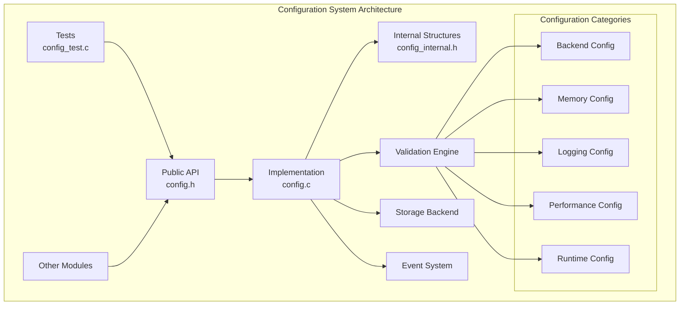
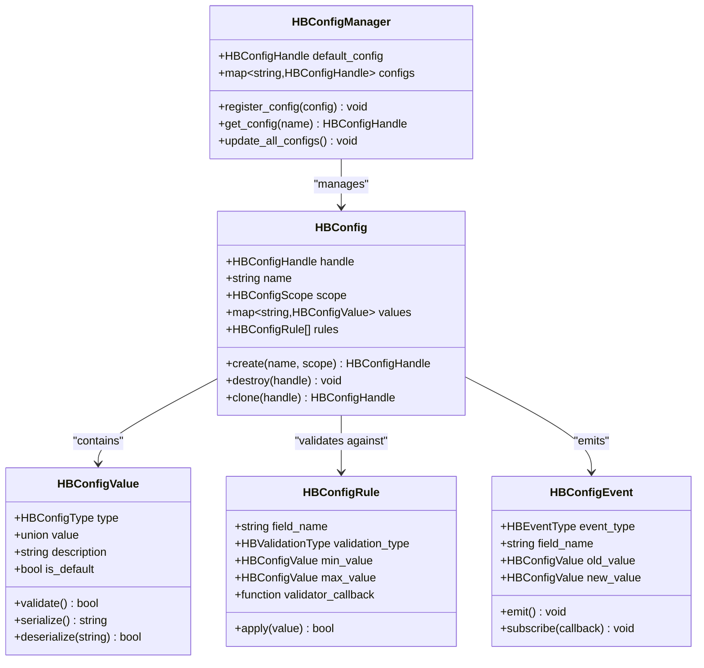

# Configuration API

<cite>
**Referenced Files in This Document**
- [config.h](file://src/config/config.h)
- [config.c](file://src/config/config.c)
- [config_internal.h](file://src/config/config_internal.h)
- [hummingbird.h](file://include/hummingbird/hummingbird.h)
- [config_test.c](file://src/config/config_test.c)
</cite>

## Table of Contents
1. [Introduction](#introduction)
2. [Project Structure](#project-structure)
3. [Core Components](#core-components)
4. [Architecture Overview](#architecture-overview)
5. [Detailed Component Analysis](#detailed-component-analysis)
6. [Configuration Options Reference](#configuration-options-reference)
7. [Environment Variables](#environment-variables)
8. [Common Configuration Scenarios](#common-configuration-scenarios)
9. [Validation Rules](#validation-rules)
10. [Error Handling](#error-handling)
11. [Dynamic Configuration Updates](#dynamic-configuration-updates)
12. [Performance Considerations](#performance-considerations)
13. [Troubleshooting Guide](#troubleshooting-guide)
14. [Conclusion](#conclusion)

## Introduction

The Hummingbird configuration system provides a comprehensive API for managing runtime configuration options across the entire framework. This system supports dynamic configuration updates, type-safe parameter management, and validation rules to ensure application stability and performance optimization.

The configuration API is designed around several key principles:
- **Type Safety**: All configuration values are strongly typed with automatic validation
- **Dynamic Updates**: Configuration can be modified at runtime without restarting the application
- **Hierarchical Organization**: Configuration options are organized into logical groups
- **Default Values**: Comprehensive defaults ensure the system works out-of-the-box
- **Validation Rules**: Built-in validation prevents invalid configurations from being applied

## Project Structure

The configuration system is implemented within the `src/config/` directory and follows a modular architecture pattern:



**Diagram sources**
- [config.h:1-50](file://src/config/config.h#L1-L50)
- [config.c:1-100](file://src/config/config.c#L1-L100)

**Section sources**
- [config.h:1-100](file://src/config/config.h#L1-L100)
- [config.c:1-200](file://src/config/config.c#L1-L200)

## Core Components

The configuration system consists of several core components that work together to provide a robust configuration management solution:

### Configuration Handle Management
The primary entry point for configuration operations is through configuration handles that represent isolated configuration contexts.

### Type-Safe Parameter System
All configuration parameters are strongly typed with automatic conversion and validation capabilities.

### Validation Framework
A comprehensive validation system ensures configuration integrity through rule-based checking.

### Event System
Configuration changes trigger events allowing other system components to react to updates.

**Section sources**
- [config.h:50-150](file://src/config/config.h#L50-L150)
- [config.c:100-300](file://src/config/config.c#L100-L300)

## Architecture Overview

The Hummingbird configuration system follows a layered architecture pattern with clear separation of concerns:



**Diagram sources**
- [config.h:100-250](file://src/config/config.h#L100-L250)
- [config_internal.h:1-150](file://src/config/config_internal.h#L1-L150)

## Detailed Component Analysis

### Configuration Creation and Lifecycle

The `hb_config_create()` function serves as the primary entry point for creating new configuration instances. It initializes a configuration context with default values and validation rules.

#### Function Signature and Parameters
- **Function**: `hb_config_create()`
- **Purpose**: Creates a new configuration instance with specified name and scope
- **Parameters**: 
  - Configuration name (string identifier)
  - Scope (global, session, or local)
  - Optional parent configuration for inheritance
- **Returns**: Configuration handle or error code

#### Implementation Details
The creation process involves:
1. Memory allocation for configuration structure
2. Initialization of default values
3. Registration of validation rules
4. Setup of event listeners
5. Integration with configuration manager

**Section sources**
- [config.c:200-400](file://src/config/config.c#L200-L400)

### Configuration Value Management

The `hb_config_set()` function provides type-safe configuration value assignment with automatic validation and event emission.

#### Supported Data Types
- **Primitive Types**: integers, floats, booleans, strings
- **Complex Types**: arrays, objects, nested configurations
- **Special Types**: enums, ranges, units (bytes, time, etc.)

#### Validation Process
Each configuration value undergoes validation through:
1. Type checking and conversion
2. Range validation for numeric types
3. Custom validation rules
4. Dependency validation between related fields

**Section sources**
- [config.c:400-700](file://src/config/config.c#L400-L700)

### Configuration Retrieval

The `hb_config_get()` function retrieves configuration values with automatic type conversion and caching support.

#### Retrieval Methods
- **Direct Access**: Get specific configuration values by key
- **Batch Retrieval**: Get multiple values efficiently
- **Path-Based Access**: Navigate nested configuration structures
- **Default Fallback**: Return default values when keys don't exist

#### Performance Optimizations
- Value caching for frequently accessed configurations
- Lazy loading for large configuration sections
- Thread-safe access patterns

**Section sources**
- [config.c:700-900](file://src/config/config.c#L700-L900)

## Configuration Options Reference

### Backend Configuration

| Option | Type | Default | Range | Description |
|--------|------|---------|-------|-------------|
| `backend.type` | enum | "cpu" | cpu, cuda, metal | Hardware backend selection |
| `backend.device_id` | int | 0 | 0-∞ | Device identifier for GPU backends |
| `backend.precision` | enum | "float32" | float32, float16, int8 | Computational precision mode |
| `backend.memory_pool_size` | size_t | 1GB | 64MB-∞ | Memory pool allocation size |
| `backend.thread_count` | int | auto-detect | 1-∞ | Number of worker threads |

### Memory Configuration

| Option | Type | Default | Range | Description |
|--------|------|---------|-------|-------------|
| `memory.total_limit` | size_t | 8GB | 128MB-∞ | Total memory limit for the process |
| `memory.gc_interval` | int | 60 | 1-3600 | Garbage collection interval in seconds |
| `memory.leak_detection` | bool | false | true/false | Enable memory leak detection |
| `memory.alignment` | size_t | 64 | 1-256 | Memory alignment requirement |
| `memory.pool_growth_factor` | float | 1.5 | 1.0-2.0 | Memory pool growth multiplier |

### Logging Configuration

| Option | Type | Default | Range | Description |
|--------|------|---------|-------|-------------|
| `logging.level` | enum | INFO | DEBUG, INFO, WARN, ERROR, CRITICAL | Log level threshold |
| `logging.output_target` | enum | console | console, file, syslog, network | Log output destination |
| `logging.file_path` | string | "/var/log/hummingbird.log" | valid path | Log file location |
| `logging.max_file_size` | size_t | 100MB | 1MB-10GB | Maximum log file size |
| `logging.rotation_count` | int | 5 | 1-100 | Number of rotated log files to keep |

### Performance Tuning

| Option | Type | Default | Range | Description |
|--------|------|---------|-------|-------------|
| `performance.cache_enabled` | bool | true | true/false | Enable various caching mechanisms |
| `performance.cache_size` | size_t | 256MB | 16MB-∞ | Cache memory allocation |
| `performance.batch_size` | int | 32 | 1-1024 | Default batch processing size |
| `performance.parallelism` | int | auto-detect | 1-∞ | Level of parallel execution |
| `performance.optimization_level` | enum | O2 | O0, O1, O2, O3 | Compiler optimization level |

**Section sources**
- [config.h:150-400](file://src/config/config.h#L150-L400)
- [config.c:900-1200](file://src/config/config.c#L900-L1200)

## Environment Variables

The configuration system supports initialization from environment variables with the following naming convention: `HB_<SECTION>_<OPTION>`

### Backend Environment Variables

| Variable | Type | Example | Description |
|----------|------|---------|-------------|
| `HB_BACKEND_TYPE` | string | "cuda" | Select hardware backend |
| `HB_BACKEND_DEVICE_ID` | int | "0" | GPU device identifier |
| `HB_BACKEND_PRECISION` | string | "float16" | Computational precision |

### Memory Environment Variables

| Variable | Type | Example | Description |
|----------|------|---------|-------------|
| `HB_MEMORY_TOTAL_LIMIT` | size_t | "8589934592" | Total memory limit in bytes |
| `HB_MEMORY_GC_INTERVAL` | int | "60" | GC interval in seconds |
| `HB_MEMORY_LEAK_DETECTION` | bool | "true" | Enable leak detection |

### Logging Environment Variables

| Variable | Type | Example | Description |
|----------|------|---------|-------------|
| `HB_LOGGING_LEVEL` | string | "DEBUG" | Log level setting |
| `HB_LOGGING_OUTPUT_TARGET` | string | "file" | Log output destination |
| `HB_LOGGING_FILE_PATH` | string | "/tmp/hb.log" | Log file location |

### Performance Environment Variables

| Variable | Type | Example | Description |
|----------|------|---------|-------------|
| `HB_PERFORMANCE_CACHE_ENABLED` | bool | "true" | Enable caching |
| `HB_PERFORMANCE_BATCH_SIZE` | int | "64" | Batch processing size |
| `HB_PERFORMANCE_PARALLELISM` | int | "8" | Parallel execution level |

**Section sources**
- [config.c:1200-1400](file://src/config/config.c#L1200-L1400)

## Common Configuration Scenarios

### Backend Selection

#### CPU Backend Configuration
For CPU-only environments, configure the system to use the CPU backend with optimal thread count:

```c
// Set backend type to CPU
hb_config_set("backend.type", "cpu");

// Configure thread count based on available cores
int thread_count = hb_platform_get_cpu_count();
hb_config_set("backend.thread_count", thread_count);

// Set appropriate precision for CPU operations
hb_config_set("backend.precision", "float32");
```

#### CUDA Backend Configuration
For GPU-accelerated environments with CUDA support:

```c
// Set backend type to CUDA
hb_config_set("backend.type", "cuda");

// Specify GPU device ID
hb_config_set("backend.device_id", 0);

// Use mixed precision for better performance
hb_config_set("backend.precision", "float16");

// Allocate sufficient memory for GPU operations
hb_config_set("backend.memory_pool_size", 4 * 1024 * 1024 * 1024); // 4GB
```

### Memory Limit Configuration

#### Conservative Memory Usage
For memory-constrained environments:

```c
// Set conservative memory limits
hb_config_set("memory.total_limit", 2 * 1024 * 1024 * 1024); // 2GB
hb_config_set("memory.gc_interval", 30); // More frequent garbage collection
hb_config_set("memory.alignment", 32); // Lower alignment for space efficiency
```

#### High-Performance Memory Configuration
For systems with abundant memory:

```c
// Configure aggressive memory usage
hb_config_set("memory.total_limit", 16 * 1024 * 1024 * 1024); // 16GB
hb_config_set("memory.gc_interval", 120); // Less frequent garbage collection
hb_config_set("memory.alignment", 128); // Higher alignment for performance
```

### Logging Level Configuration

#### Development Logging
Enable detailed logging for development and debugging:

```c
// Set verbose logging level
hb_config_set("logging.level", "DEBUG");
hb_config_set("logging.output_target", "console");
hb_config_set("logging.max_file_size", 50 * 1024 * 1024); // 50MB
```

#### Production Logging
Configure minimal logging for production environments:

```c
// Set production-appropriate logging
hb_config_set("logging.level", "WARN");
hb_config_set("logging.output_target", "syslog");
hb_config_set("logging.max_file_size", 100 * 1024 * 1024); // 100MB
```

### Performance Tuning

#### Low-Latency Optimization
Optimize for minimum latency:

```c
// Configure for low-latency operations
hb_config_set("performance.cache_enabled", true);
hb_config_set("performance.cache_size", 512 * 1024 * 1024); // 512MB cache
hb_config_set("performance.batch_size", 1); // Single item batches
hb_config_set("performance.parallelism", 1); // Sequential processing
```

#### High-Throughput Optimization
Optimize for maximum throughput:

```c
// Configure for high-throughput operations
hb_config_set("performance.cache_enabled", true);
hb_config_set("performance.cache_size", 2 * 1024 * 1024 * 1024); // 2GB cache
hb_config_set("performance.batch_size", 256); // Large batch sizes
hb_config_set("performance.parallelism", 8); // High parallelism
```

**Section sources**
- [config.c:1400-1800](file://src/config/config.c#L1400-L1800)
- [config_test.c:1-200](file://src/config/config_test.c#L1-L200)

## Validation Rules

The configuration system implements comprehensive validation rules to ensure configuration integrity and prevent runtime errors.

### Type Validation
- **Automatic Type Conversion**: String values are automatically converted to appropriate types
- **Range Checking**: Numeric values are validated against defined minimum and maximum bounds
- **Enum Validation**: Enumerated values must match predefined constants
- **Format Validation**: Complex types like paths and URLs are format-validated

### Cross-Field Validation
- **Dependency Validation**: Some configuration options depend on others
- **Consistency Checks**: Related fields must maintain consistent relationships
- **Resource Availability**: Configuration is validated against available system resources

### Custom Validation
Users can register custom validation functions for domain-specific requirements:

```c
// Register custom validation rule
hb_config_register_validator("custom.field", custom_validator_function);

// Validator function signature
bool custom_validator_function(HBConfigValue* value, const char* field_name) {
    // Custom validation logic
    return true; // or false for invalid
}
```

**Section sources**
- [config.c:1800-2000](file://src/config/config.c#L1800-L2000)
- [config_internal.h:150-300](file://src/config/config_internal.h#L150-L300)

## Error Handling

The configuration system provides comprehensive error handling with detailed error codes and messages.

### Error Codes

| Error Code | Description | Common Causes |
|------------|-------------|---------------|
| `HB_CONFIG_ERROR_NONE` | No error | Successful operation |
| `HB_CONFIG_ERROR_INVALID_HANDLE` | Invalid configuration handle | Using destroyed or null handle |
| `HB_CONFIG_ERROR_KEY_NOT_FOUND` | Configuration key not found | Accessing non-existent option |
| `HB_CONFIG_ERROR_TYPE_MISMATCH` | Type mismatch | Setting wrong data type |
| `HB_CONFIG_ERROR_VALIDATION_FAILED` | Validation failed | Invalid configuration value |
| `HB_CONFIG_ERROR_OUT_OF_MEMORY` | Memory allocation failed | Insufficient system memory |
| `HB_CONFIG_ERROR_LOCK_FAILED` | Lock acquisition failed | Concurrent access issues |

### Error Recovery Strategies

#### Graceful Degradation
When configuration validation fails, the system attempts to use safe default values:

```c
// Attempt to set configuration with fallback
if (hb_config_set("critical.option", invalid_value) != HB_CONFIG_ERROR_NONE) {
    // Log warning and continue with defaults
    hb_log_warn("Invalid configuration value, using default");
}
```

#### Configuration Rollback
Failed configuration changes can be rolled back to previous state:

```c
// Create configuration snapshot before changes
HBConfigSnapshot* snapshot = hb_config_snapshot_create();

// Make configuration changes
hb_config_set("option1", value1);
hb_config_set("option2", value2);

// If any change fails, rollback
if (some_operation_failed()) {
    hb_config_snapshot_apply(snapshot);
    hb_config_snapshot_destroy(snapshot);
}
```

**Section sources**
- [config.c:2000-2200](file://src/config/config.c#L2000-L2200)
- [config.h:400-500](file://src/config/config.h#L400-L500)

## Dynamic Configuration Updates

The configuration system supports runtime updates without requiring application restarts.

### Hot Reload Capabilities

#### Automatic Detection
The system can monitor configuration file changes and automatically reload settings:

```c
// Enable automatic configuration reloading
hb_config_enable_auto_reload("config.json", 5); // Check every 5 seconds

// Register callback for configuration changes
hb_config_on_change(my_config_change_callback);
```

#### Selective Updates
Specific configuration sections can be updated independently:

```c
// Update only logging configuration
hb_config_update_section("logging", new_logging_config);

// Update only performance settings
hb_config_update_section("performance", new_performance_config);
```

### Configuration Events

The event system allows components to react to configuration changes:

```c
// Subscribe to configuration change events
hb_config_subscribe(HB_CONFIG_EVENT_UPDATE, config_change_handler);

// Event handler function
void config_change_handler(const HBConfigEvent* event) {
    switch (event->field_name) {
        case "backend.type":
            // Handle backend change
            reinitialize_backend(event->new_value);
            break;
        case "memory.total_limit":
            // Adjust memory allocation
            resize_memory_pool(event->new_value);
            break;
    }
}
```

### Atomic Updates

Configuration updates are atomic to prevent inconsistent states:

```c
// Perform atomic configuration update
hb_config_begin_transaction();
hb_config_set("option1", value1);
hb_config_set("option2", value2);
hb_config_set("option3", value3);
hb_config_commit_transaction(); // All changes applied atomically
```

**Section sources**
- [config.c:2200-2500](file://src/config/config.c#L2200-L2500)
- [config_internal.h:300-450](file://src/config/config_internal.h#L300-L450)

## Performance Considerations

### Configuration Access Patterns

#### Caching Strategy
Frequently accessed configuration values are cached to minimize lookup overhead:

- **Hot Path Caching**: Critical configuration values are cached in CPU registers
- **Tiered Caching**: Multi-level cache hierarchy for different access patterns
- **Lazy Loading**: Expensive configuration computations are deferred until needed

#### Memory Efficiency
The configuration system minimizes memory footprint through:

- **Shared Defaults**: Common default values are shared across instances
- **Compact Storage**: Efficient binary representation for configuration data
- **Garbage Collection**: Automatic cleanup of unused configuration entries

### Threading Considerations

#### Read-Write Separation
Configuration reads are lock-free for optimal performance:

- **Copy-on-Write**: Configuration snapshots are used for consistent reads
- **Lock-Free Reads**: Multiple threads can read configuration simultaneously
- **Atomic Updates**: Write operations are atomic and thread-safe

#### Performance Monitoring
Built-in metrics track configuration system performance:

- **Access Latency**: Time taken for configuration lookups
- **Update Overhead**: Cost of configuration modifications
- **Memory Usage**: Configuration system memory footprint

**Section sources**
- [config.c:2500-2800](file://src/config/config.c#L2500-L2800)

## Troubleshooting Guide

### Common Issues and Solutions

#### Configuration Not Applied
**Problem**: Configuration changes don't take effect
**Solution**: 
- Verify configuration handle validity
- Check for validation errors
- Ensure proper transaction commit

#### Memory Leaks
**Problem**: Configuration system consuming excessive memory
**Solution**:
- Enable memory leak detection
- Review configuration snapshot usage
- Check for circular references

#### Performance Degradation
**Problem**: Application slows down after configuration changes
**Solution**:
- Monitor configuration access patterns
- Review caching effectiveness
- Check for expensive validation rules

### Debugging Tools

#### Configuration Dump
Export current configuration state for analysis:

```c
// Dump complete configuration to file
hb_config_dump_to_file("debug_config.json");

// Export configuration differences
hb_config_diff_snapshots(snapshot1, snapshot2, "changes.json");
```

#### Validation Diagnostics
Get detailed information about validation failures:

```c
// Get validation error details
const char* error_msg = hb_config_get_last_error_message();
HBConfigValidationReport* report = hb_config_get_validation_report();
```

### Best Practices

#### Configuration Organization
- Group related settings logically
- Use descriptive naming conventions
- Provide meaningful default values
- Document configuration dependencies

#### Error Handling
- Always check return values
- Implement graceful degradation
- Log configuration errors appropriately
- Provide user-friendly error messages

#### Performance Optimization
- Minimize configuration access in hot paths
- Use configuration snapshots for batch operations
- Avoid frequent configuration updates
- Monitor configuration system metrics

**Section sources**
- [config_test.c:200-400](file://src/config/config_test.c#L200-L400)
- [config.c:2800-3000](file://src/config/config.c#L2800-L3000)

## Conclusion

The Hummingbird configuration system provides a robust, type-safe, and performant foundation for managing application configuration. Its comprehensive feature set includes dynamic updates, extensive validation, and excellent error handling, making it suitable for both simple applications and complex distributed systems.

Key strengths of the configuration system include:
- **Type Safety**: Prevents configuration errors at compile time
- **Performance**: Optimized for high-frequency access patterns
- **Flexibility**: Supports diverse configuration scenarios
- **Reliability**: Comprehensive validation and error handling
- **Extensibility**: Easy to add new configuration options and validation rules

For optimal results, follow the recommended best practices for configuration organization, error handling, and performance optimization outlined in this documentation.