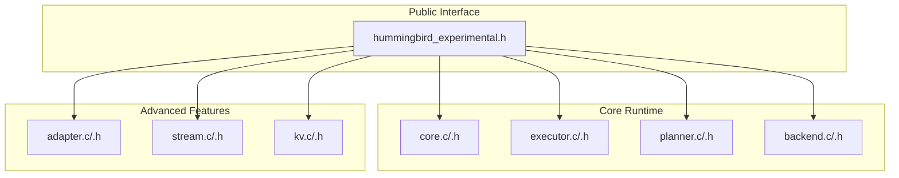
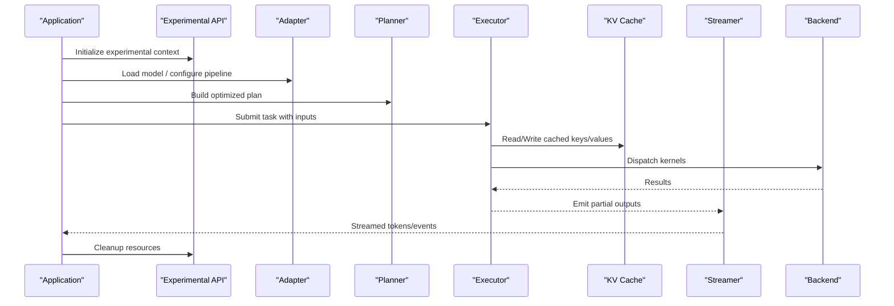
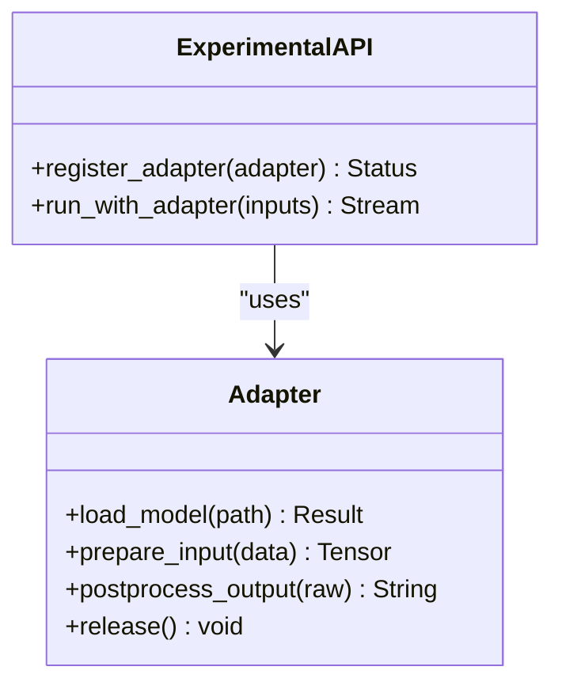
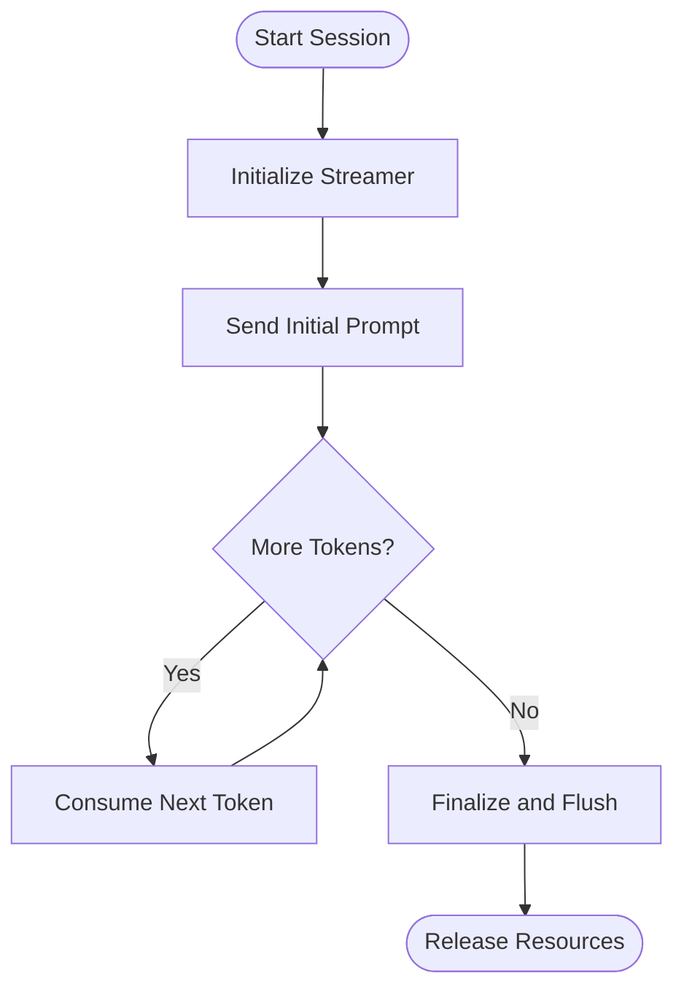
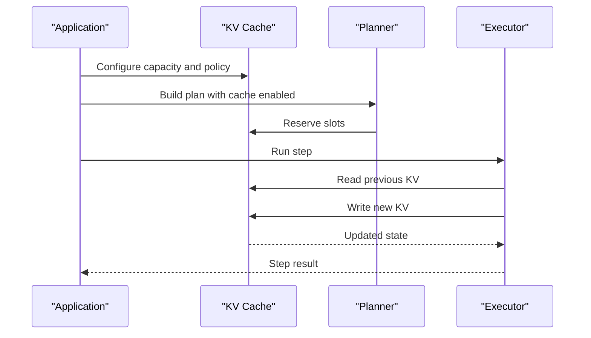
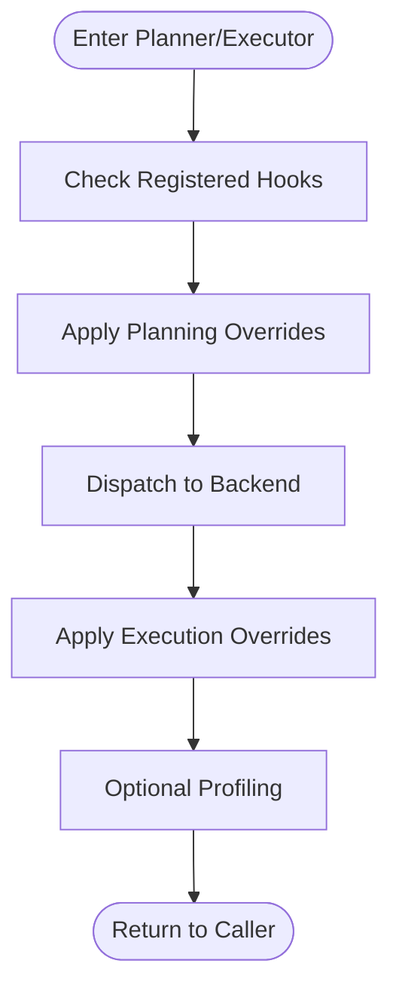
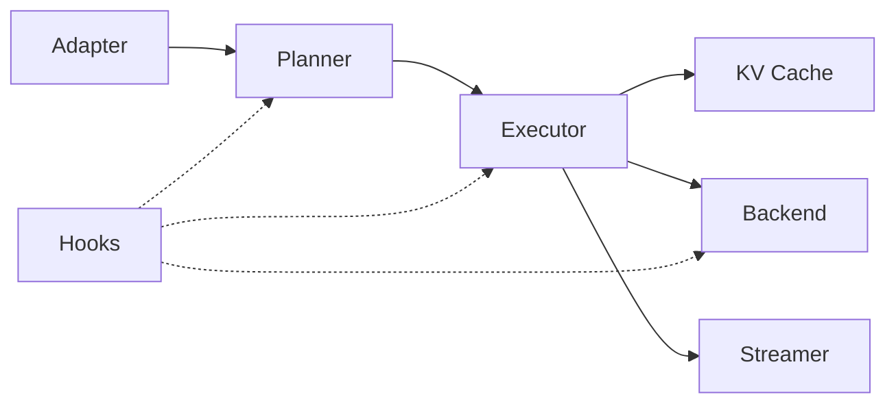
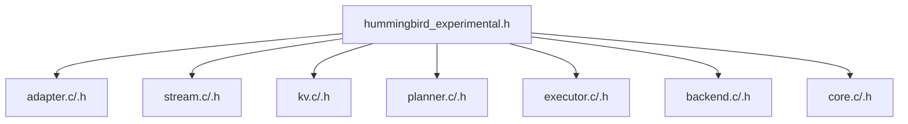

# Experimental API

<cite>
**Referenced Files in This Document**
- [hummingbird_experimental.h](file://include/hummingbird/hummingbird_experimental.h)
- [adapter.c](file://src/adapter/adapter.c)
- [adapter.h](file://src/adapter/adapter.h)
- [stream.c](file://src/stream/stream.c)
- [stream.h](file://src/stream/stream.h)
- [kv.c](file://src/kv/kv.c)
- [kv.h](file://src/kv/kv.h)
- [planner.c](file://src/planner/planner.c)
- [planner.h](file://src/planner/planner.h)
- [executor.c](file://src/executor/executor.c)
- [executor.h](file://src/executor/executor.h)
- [backend.c](file://src/backend/backend.c)
- [backend.h](file://src/backend/backend.h)
- [core.c](file://src/core/core.c)
- [core.h](file://src/core/core.h)
</cite>

## Table of Contents
1. [Introduction](#introduction)
2. [Project Structure](#project-structure)
3. [Core Components](#core-components)
4. [Architecture Overview](#architecture-overview)
5. [Detailed Component Analysis](#detailed-component-analysis)
6. [Dependency Analysis](#dependency-analysis)
7. [Performance Considerations](#performance-considerations)
8. [Troubleshooting Guide](#troubleshooting-guide)
9. [Conclusion](#conclusion)
10. [Appendices](#appendices)

## Introduction
This document describes Hummingbird’s experimental APIs that are marked as unstable or under development. It focuses on advanced capabilities such as custom adapter implementation, streaming inference, key-value caching, and low-level optimization hooks. The goal is to help you leverage these features safely while understanding their stability guarantees and migration paths when they graduate to stable status.

Experimental APIs may change without notice between versions. Use them for prototyping, research, and early integration only. For production workloads, prefer the stable public API unless you have a clear need for an experimental feature and can manage compatibility risks.

## Project Structure
The experimental surface is primarily exposed through a dedicated header and implemented across several subsystems:
- Public experimental declarations live in the include directory.
- Implementations span adapter, stream, kv (key-value cache), planner, executor, backend, and core modules.

**Diagram sources**
- [hummingbird_experimental.h](file://include/hummingbird/hummingbird_experimental.h)
- [adapter.c](file://src/adapter/adapter.c)
- [stream.c](file://src/stream/stream.c)
- [kv.c](file://src/kv/kv.c)
- [planner.c](file://src/planner/planner.c)
- [executor.c](file://src/executor/executor.c)
- [backend.c](file://src/backend/backend.c)
- [core.c](file://src/core/core.c)

**Section sources**
- [hummingbird_experimental.h](file://include/hummingbird/hummingbird_experimental.h)
- [adapter.h](file://src/adapter/adapter.h)
- [stream.h](file://src/stream/stream.h)
- [kv.h](file://src/kv/kv.h)
- [planner.h](file://src/planner/planner.h)
- [executor.h](file://src/executor/executor.h)
- [backend.h](file://src/backend/backend.h)
- [core.h](file://src/core/core.h)

## Core Components
This section summarizes the primary experimental components and their intended use cases.

- Custom Adapter Implementation
  - Purpose: Provide pluggable model I/O and preprocessing/postprocessing logic via an adapter interface.
  - Typical use: Integrating proprietary formats, custom tokenization, or domain-specific data pipelines.
  - Stability: Unstable; interfaces may evolve.

- Streaming Inference
  - Purpose: Incremental generation with backpressure control and event-driven callbacks.
  - Typical use: Chat completions, long-form text generation, interactive applications.
  - Stability: Unstable; callback signatures and lifecycle may change.

- Key-Value Caching
  - Purpose: Cache attention states or intermediate activations to accelerate autoregressive decoding.
  - Typical use: Long-context generation, repeated prompts, multi-turn conversations.
  - Stability: Unstable; cache policies and memory management may change.

- Low-Level Optimization Hooks
  - Purpose: Intercept planning, execution, and backend dispatch to apply custom optimizations.
  - Typical use: Kernel fusion hints, memory layout overrides, device-specific tuning.
  - Stability: Unstable; hook contracts may be revised.

**Section sources**
- [adapter.h](file://src/adapter/adapter.h)
- [stream.h](file://src/stream/stream.h)
- [kv.h](file://src/kv/kv.h)
- [planner.h](file://src/planner/planner.h)
- [executor.h](file://src/executor/executor.h)
- [backend.h](file://src/backend/backend.h)
- [core.h](file://src/core/core.h)

## Architecture Overview
The experimental layer composes adapters, streaming, KV cache, planner, executor, and backend into a cohesive runtime. The following diagram shows how requests flow through the system when using experimental features.

**Diagram sources**
- [hummingbird_experimental.h](file://include/hummingbird/hummingbird_experimental.h)
- [adapter.c](file://src/adapter/adapter.c)
- [planner.c](file://src/planner/planner.c)
- [executor.c](file://src/executor/executor.c)
- [kv.c](file://src/kv/kv.c)
- [stream.c](file://src/stream/stream.c)
- [backend.c](file://src/backend/backend.c)

## Detailed Component Analysis

### Custom Adapter Implementation
The adapter subsystem exposes an interface for integrating custom model loaders and processing steps. You implement adapter functions to handle loading, metadata extraction, input preparation, and output post-processing.

Key responsibilities:
- Model loading and format detection
- Input normalization and tokenization
- Output decoding and formatting
- Resource management and error propagation

**Diagram sources**
- [adapter.h](file://src/adapter/adapter.h)
- [hummingbird_experimental.h](file://include/hummingbird/hummingbird_experimental.h)

Implementation notes:
- Ensure deterministic behavior for identical inputs.
- Handle errors consistently and propagate meaningful diagnostics.
- Avoid global mutable state; keep adapter instances isolated per session.

**Section sources**
- [adapter.c](file://src/adapter/adapter.c)
- [adapter.h](file://src/adapter/adapter.h)
- [hummingbird_experimental.h](file://include/hummingbird/hummingbird_experimental.h)

### Streaming Inference
Streaming enables incremental consumption of generated tokens. The experimental stream API provides lifecycle methods to start, poll, and finalize streaming sessions, along with callbacks for backpressure and cancellation.

Typical workflow:
- Create a streaming session with model and options
- Feed initial prompt via the adapter
- Iterate over streamed events until completion or cancellation
- Release resources explicitly

**Diagram sources**
- [stream.h](file://src/stream/stream.h)
- [stream.c](file://src/stream/stream.c)
- [hummingbird_experimental.h](file://include/hummingbird/hummingbird_experimental.h)

Best practices:
- Respect backpressure signals to avoid memory spikes.
- Handle cancellation promptly to free resources.
- Batch small writes if your transport supports it.

**Section sources**
- [stream.c](file://src/stream/stream.c)
- [stream.h](file://src/stream/stream.h)
- [hummingbird_experimental.h](file://include/hummingbird/hummingbird_experimental.h)

### Key-Value Caching
The KV cache stores intermediate representations (e.g., attention keys and values) to speed up autoregressive decoding. It integrates with the planner and executor to decide when to read/write cached states.

Core operations:
- Allocate and configure cache capacity
- Attach cache to a session or request
- Evict or reset cache based on policy
- Query cache statistics for diagnostics

**Diagram sources**
- [kv.h](file://src/kv/kv.h)
- [kv.c](file://src/kv/kv.c)
- [planner.h](file://src/planner/planner.h)
- [executor.h](file://src/executor/executor.h)
- [hummingbird_experimental.h](file://include/hummingbird/hummingbird_experimental.h)

Guidance:
- Size the cache according to expected context length.
- Monitor memory usage and evict aggressively under pressure.
- Reset cache between unrelated conversations to prevent leakage.

**Section sources**
- [kv.c](file://src/kv/kv.c)
- [kv.h](file://src/kv/kv.h)
- [planner.c](file://src/planner/planner.c)
- [executor.c](file://src/executor/executor.c)
- [hummingbird_experimental.h](file://include/hummingbird/hummingbird_experimental.h)

### Low-Level Optimization Hooks
Optimization hooks allow intercepting planning and execution phases to inject custom behaviors such as kernel selection, memory layout changes, or profiling instrumentation.

Hook categories:
- Planning hooks: modify graph transformations, fuse ops, adjust scheduling
- Execution hooks: override dispatch, capture timings, enforce constraints
- Backend hooks: select devices, tune parameters, register custom kernels

**Diagram sources**
- [planner.h](file://src/planner/planner.h)
- [planner.c](file://src/planner/planner.c)
- [executor.h](file://src/executor/executor.h)
- [executor.c](file://src/executor/executor.c)
- [backend.h](file://src/backend/backend.h)
- [backend.c](file://src/backend/backend.c)
- [hummingbird_experimental.h](file://include/hummingbird/hummingbird_experimental.h)

Recommendations:
- Keep hooks idempotent and side-effect minimal.
- Validate assumptions about tensor shapes and layouts.
- Provide fallbacks when hardware or backend capabilities differ.

**Section sources**
- [planner.c](file://src/planner/planner.c)
- [planner.h](file://src/planner/planner.h)
- [executor.c](file://src/executor/executor.c)
- [executor.h](file://src/executor/executor.h)
- [backend.c](file://src/backend/backend.c)
- [backend.h](file://src/backend/backend.h)
- [hummingbird_experimental.h](file://include/hummingbird/hummingbird_experimental.h)

### Conceptual Overview
The experimental layer is designed to be modular and composable. Adapters encapsulate model-specific logic, streaming abstracts incremental output delivery, KV cache accelerates autoregressive loops, and hooks provide deep customization points. Together, they enable high-performance, flexible deployments at the cost of increased complexity and reduced stability guarantees.

[No sources needed since this diagram shows conceptual workflow, not actual code structure]

## Dependency Analysis
The experimental API depends on multiple subsystems. Understanding these relationships helps diagnose issues and plan migrations.

**Diagram sources**
- [hummingbird_experimental.h](file://include/hummingbird/hummingbird_experimental.h)
- [adapter.c](file://src/adapter/adapter.c)
- [stream.c](file://src/stream/stream.c)
- [kv.c](file://src/kv/kv.c)
- [planner.c](file://src/planner/planner.c)
- [executor.c](file://src/executor/executor.c)
- [backend.c](file://src/backend/backend.c)
- [core.c](file://src/core/core.c)

**Section sources**
- [hummingbird_experimental.h](file://include/hummingbird/hummingbird_experimental.h)
- [adapter.h](file://src/adapter/adapter.h)
- [stream.h](file://src/stream/stream.h)
- [kv.h](file://src/kv/kv.h)
- [planner.h](file://src/planner/planner.h)
- [executor.h](file://src/executor/executor.h)
- [backend.h](file://src/backend/backend.h)
- [core.h](file://src/core/core.h)

## Performance Considerations
- Streaming: Tune batch sizes and flush thresholds to balance latency and throughput.
- KV Cache: Choose eviction policies aligned with workload patterns; monitor memory fragmentation.
- Hooks: Profile before and after applying overrides to ensure net gains.
- Adapters: Minimize copies and conversions; reuse buffers where safe.

[No sources needed since this section provides general guidance]

## Troubleshooting Guide
Common issues and remedies:
- Adapter failures: Verify model path, format support, and resource availability. Log detailed diagnostics from adapter load and prepare steps.
- Streaming stalls: Check backpressure handling and ensure consumers consume tokens promptly. Confirm cancellation paths release resources.
- KV cache overflow: Reduce context length or increase capacity; consider periodic resets between sessions.
- Hook misbehavior: Validate shape/layout assumptions; add guards and fallbacks; isolate hooks during debugging.

Operational tips:
- Enable verbose logging around experimental entry points.
- Isolate experiments in separate processes or threads to contain failures.
- Record configuration snapshots for reproducibility.

**Section sources**
- [adapter.c](file://src/adapter/adapter.c)
- [stream.c](file://src/stream/stream.c)
- [kv.c](file://src/kv/kv.c)
- [planner.c](file://src/planner/planner.c)
- [executor.c](file://src/executor/executor.c)
- [backend.c](file://src/backend/backend.c)
- [core.c](file://src/core/core.c)

## Conclusion
Hummingbird’s experimental APIs offer powerful customization for adapters, streaming, KV caching, and low-level optimization hooks. While highly capable, they are unstable by design and subject to breaking changes. Use them judiciously, maintain strict version pinning, and plan migration strategies to stable APIs as they become available.

[No sources needed since this section summarizes without analyzing specific files]

## Appendices

### Migration Guide: From Experimental to Stable
When an experimental feature stabilizes:
- Replace experimental headers with the corresponding stable public header.
- Update function calls to match the new signatures and semantics.
- Remove workaround code introduced for experimental limitations.
- Re-run tests focusing on performance and correctness regressions.
- Update documentation and CI to reflect the stable API usage.

[No sources needed since this section provides general guidance]

### Example Patterns (Conceptual)
- Custom adapter pattern: Register an adapter instance, then run inference through the experimental entry point.
- Streaming loop: Initialize streamer, send prompt, iterate tokens, handle cancellation, finalize.
- KV cache usage: Configure cache, attach to session, run autoregressive steps, reset between turns.
- Hook registration: Install planning and execution hooks, validate effects, profile outcomes.

[No sources needed since this section provides general guidance]