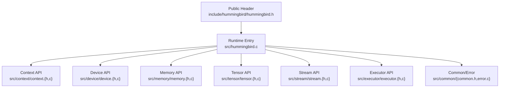
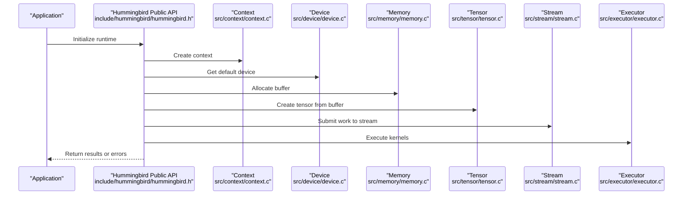
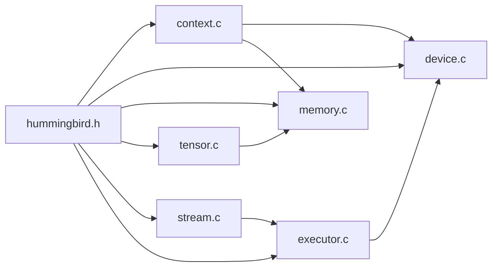

# Core API

<cite>
**Referenced Files in This Document**
- [include/hummingbird/hummingbird.h](file://include/hummingbird/hummingbird.h)
- [src/hummingbird.c](file://src/hummingbird.c)
- [src/context/context.h](file://src/context/context.h)
- [src/context/context.c](file://src/context/context.c)
- [src/device/device.h](file://src/device/device.h)
- [src/device/device.c](file://src/device/device.c)
- [src/memory/memory.h](file://src/memory/memory.h)
- [src/memory/memory.c](file://src/memory/memory.c)
- [src/tensor/tensor.h](file://src/tensor/tensor.h)
- [src/tensor/tensor.c](file://src/tensor/tensor.c)
- [src/stream/stream.h](file://src/stream/stream.h)
- [src/stream/stream.c](file://src/stream/stream.c)
- [src/executor/executor.h](file://src/executor/executor.h)
- [src/executor/executor.c](file://src/executor/executor.c)
- [src/common/common.h](file://src/common/common.h)
- [src/common/error.c](file://src/common/error.c)
- [examples/version.c](file://examples/version.c)
</cite>

## Table of Contents
1. [Introduction](#introduction)
2. [Project Structure](#project-structure)
3. [Core Components](#core-components)
4. [Architecture Overview](#architecture-overview)
5. [Detailed Component Analysis](#detailed-component-analysis)
6. [Dependency Analysis](#dependency-analysis)
7. [Performance Considerations](#performance-considerations)
8. [Troubleshooting Guide](#troubleshooting-guide)
9. [Conclusion](#conclusion)
10. [Appendices](#appendices)

## Introduction
This document provides comprehensive API documentation for Hummingbird’s core public interfaces. It focuses on runtime initialization, context management, device handling, memory allocation, and tensor operations. The goal is to help you integrate and use Hummingbird safely and efficiently, with guidance on thread safety, error handling, and performance implications.

## Project Structure
The public C API surface is exposed through the include headers under include/hummingbird/. Internally, functionality is implemented across modular source directories such as src/context, src/device, src/memory, src/tensor, src/stream, and src/executor. The main entry point file src/hummingbird.c ties these modules together and exposes the stable API.

**Diagram sources**
- [include/hummingbird/hummingbird.h](file://include/hummingbird/hummingbird.h)
- [src/hummingbird.c](file://src/hummingbird.c)
- [src/context/context.h](file://src/context/context.h)
- [src/device/device.h](file://src/device/device.h)
- [src/memory/memory.h](file://src/memory/memory.h)
- [src/tensor/tensor.h](file://src/tensor/tensor.h)
- [src/stream/stream.h](file://src/stream/stream.h)
- [src/executor/executor.h](file://src/executor/executor.h)
- [src/common/common.h](file://src/common/common.h)
- [src/common/error.c](file://src/common/error.c)

**Section sources**
- [include/hummingbird/hummingbird.h](file://include/hummingbird/hummingbird.h)
- [src/hummingbird.c](file://src/hummingbird.c)

## Core Components
This section summarizes the primary API categories:
- Runtime initialization and lifecycle
- Context creation and destruction
- Device enumeration and selection
- Memory allocation and deallocation
- Tensor creation and manipulation
- Stream-based execution and synchronization
- Executor integration for kernel dispatch

For each category, this document provides function signatures (as referenced by file paths), parameter descriptions, return values, error codes, usage examples, thread-safety notes, and performance considerations.

**Section sources**
- [include/hummingbird/hummingbird.h](file://include/hummingbird/hummingbird.h)
- [src/context/context.h](file://src/context/context.h)
- [src/device/device.h](file://src/device/device.h)
- [src/memory/memory.h](file://src/memory/memory.h)
- [src/tensor/tensor.h](file://src/tensor/tensor.h)
- [src/stream/stream.h](file://src/stream/stream.h)
- [src/executor/executor.h](file://src/executor/executor.h)

## Architecture Overview
At a high level, applications call into the public header functions which delegate to internal implementations. Contexts encapsulate configuration and backend state; devices represent compute targets; streams provide ordered execution domains; executors orchestrate kernel launches; tensors are the primary data containers.

**Diagram sources**
- [include/hummingbird/hummingbird.h](file://include/hummingbird/hummingbird.h)
- [src/context/context.c](file://src/context/context.c)
- [src/device/device.c](file://src/device/device.c)
- [src/memory/memory.c](file://src/memory/memory.c)
- [src/tensor/tensor.c](file://src/tensor/tensor.c)
- [src/stream/stream.c](file://src/stream/stream.c)
- [src/executor/executor.c](file://src/executor/executor.c)

## Detailed Component Analysis

### Runtime Initialization and Lifecycle
- hb_init()
  - Purpose: Initialize the Hummingbird runtime and global subsystems.
  - Parameters: None (or configuration options if provided by the header).
  - Returns: Status code indicating success or failure.
  - Error codes: See common error definitions.
  - Thread safety: Safe to call once at process startup; subsequent calls may be no-ops or guarded.
  - Performance: One-time cost; avoid repeated calls.
  - Usage example path: [examples/version.c](file://examples/version.c)

- hb_shutdown()
  - Purpose: Release global resources and finalize subsystems.
  - Parameters: None.
  - Returns: Status code.
  - Notes: Call before process exit to ensure clean teardown.

**Section sources**
- [include/hummingbird/hummingbird.h](file://include/hummingbird/hummingbird.h)
- [src/hummingbird.c](file://src/hummingbird.c)
- [examples/version.c](file://examples/version.c)

### Context Management
- hb_context_create()
  - Purpose: Create a new execution context that holds configuration, backend handles, and resource scopes.
  - Parameters: Configuration object or flags (see header).
  - Returns: Context handle or error status.
  - Error codes: Invalid parameters, insufficient resources.
  - Thread safety: Each context is typically bound to one thread or explicitly synchronized.
  - Performance: Creating contexts can allocate backend resources; reuse contexts when possible.

- hb_context_destroy(ctx)
  - Purpose: Destroy a previously created context and release its resources.
  - Parameters: Context handle.
  - Returns: Status code.
  - Notes: Ensure all dependent objects (tensors, streams) are destroyed first.

**Section sources**
- [include/hummingbird/hummingbird.h](file://include/hummingbird/hummingbird.h)
- [src/context/context.h](file://src/context/context.h)
- [src/context/context.c](file://src/context/context.c)

### Device Handling
- hb_device_get()
  - Purpose: Retrieve the default device for the current context or system.
  - Parameters: Optional context handle.
  - Returns: Device handle or error status.
  - Error codes: No available device, invalid context.

- hb_device_get_count()
  - Purpose: Enumerate number of available devices.
  - Returns: Count or error status.

- hb_device_get_info(device, info_out)
  - Purpose: Query device properties (memory, capabilities).
  - Parameters: Device handle, output info structure.
  - Returns: Status code.

- hb_device_set_default(device)
  - Purpose: Set the default device for subsequent operations.
  - Parameters: Device handle.
  - Returns: Status code.

**Section sources**
- [include/hummingbird/hummingbird.h](file://include/hummingbird/hummingbird.h)
- [src/device/device.h](file://src/device/device.h)
- [src/device/device.c](file://src/device/device.c)

### Memory Allocation
- hb_memory_alloc(ctx_or_dev, size, alignment)
  - Purpose: Allocate memory on a specific device or within a context.
  - Parameters: Context or device handle, size in bytes, optional alignment.
  - Returns: Pointer or error status.
  - Error codes: Out of memory, invalid parameters.

- hb_memory_free(ptr)
  - Purpose: Free previously allocated memory.
  - Parameters: Pointer returned by allocator.
  - Returns: Status code.

- hb_memory_copy(dst, src, size, direction)
  - Purpose: Copy data between host/device or device/device.
  - Parameters: Destination, source, size, copy direction enum.
  - Returns: Status code.

**Section sources**
- [include/hummingbird/hummingbird.h](file://include/hummingbird/hummingbird.h)
- [src/memory/memory.h](file://src/memory/memory.h)
- [src/memory/memory.c](file://src/memory/memory.c)

### Tensor Operations
- hb_tensor_create(shape, dtype, mem_handle, ctx_or_dev)
  - Purpose: Create a tensor view over existing memory.
  - Parameters: Shape array, data type, memory handle, context/device.
  - Returns: Tensor handle or error status.

- hb_tensor_destroy(tensor)
  - Purpose: Destroy a tensor handle without freeing underlying memory unless owned.
  - Parameters: Tensor handle.
  - Returns: Status code.

- hb_tensor_clone(tensor, ctx_or_dev)
  - Purpose: Clone a tensor into another device/context.
  - Parameters: Source tensor, target context/device.
  - Returns: New tensor handle or error status.

- hb_tensor_slice(tensor, starts, ends, strides)
  - Purpose: Create a sliced view of a tensor.
  - Parameters: Base tensor, start/end indices, optional strides.
  - Returns: Sliced tensor handle or error status.

- hb_tensor_reshape(tensor, new_shape)
  - Purpose: Reshape a tensor without copying data when possible.
  - Parameters: Tensor, new shape array.
  - Returns: New tensor handle or error status.

- hb_tensor_data(tensor)
  - Purpose: Obtain raw pointer to tensor data.
  - Parameters: Tensor handle.
  - Returns: Pointer or error status.

- hb_tensor_shape(tensor)
  - Purpose: Retrieve tensor shape metadata.
  - Parameters: Tensor handle.
  - Returns: Shape descriptor or error status.

**Section sources**
- [include/hummingbird/hummingbird.h](file://include/hummingbird/hummingbird.h)
- [src/tensor/tensor.h](file://src/tensor/tensor.h)
- [src/tensor/tensor.c](file://src/tensor/tensor.c)

### Stream Execution and Synchronization
- hb_stream_create(ctx)
  - Purpose: Create an execution stream for ordered operations.
  - Parameters: Context handle.
  - Returns: Stream handle or error status.

- hb_stream_destroy(stream)
  - Purpose: Destroy a stream.
  - Parameters: Stream handle.
  - Returns: Status code.

- hb_stream_synchronize(stream)
  - Purpose: Block until all submitted work on the stream completes.
  - Parameters: Stream handle.
  - Returns: Status code.

- hb_stream_submit(stream, operation)
  - Purpose: Enqueue an operation on a stream.
  - Parameters: Stream handle, operation descriptor.
  - Returns: Status code.

**Section sources**
- [include/hummingbird/hummingbird.h](file://include/hummingbird/hummingbird.h)
- [src/stream/stream.h](file://src/stream/stream.h)
- [src/stream/stream.c](file://src/stream/stream.c)

### Executor Integration
- hb_executor_run(executor, ops, num_ops)
  - Purpose: Run a batch of operations via the executor.
  - Parameters: Executor handle, array of operations, count.
  - Returns: Status code.

- hb_executor_sync(executor)
  - Purpose: Synchronize executor state.
  - Parameters: Executor handle.
  - Returns: Status code.

**Section sources**
- [include/hummingbird/hummingbird.h](file://include/hummingbird/hummingbird.h)
- [src/executor/executor.h](file://src/executor/executor.h)
- [src/executor/executor.c](file://src/executor/executor.c)

### Common Types and Error Codes
- hb_status_t
  - Enumeration of status codes used across APIs (success, invalid argument, out of memory, not supported, etc.).
- hb_error_message(status)
  - Returns a human-readable message for a given status code.

**Section sources**
- [include/hummingbird/hummingbird.h](file://include/hummingbird/hummingbird.h)
- [src/common/common.h](file://src/common/common.h)
- [src/common/error.c](file://src/common/error.c)

## Dependency Analysis
The public API depends on internal modules for context, device, memory, tensor, stream, and executor functionality. The following diagram shows key dependencies among modules.

**Diagram sources**
- [include/hummingbird/hummingbird.h](file://include/hummingbird/hummingbird.h)
- [src/context/context.c](file://src/context/context.c)
- [src/device/device.c](file://src/device/device.c)
- [src/memory/memory.c](file://src/memory/memory.c)
- [src/tensor/tensor.c](file://src/tensor/tensor.c)
- [src/stream/stream.c](file://src/stream/stream.c)
- [src/executor/executor.c](file://src/executor/executor.c)

**Section sources**
- [include/hummingbird/hummingbird.h](file://include/hummingbird/hummingbird.h)
- [src/context/context.c](file://src/context/context.c)
- [src/device/device.c](file://src/device/device.c)
- [src/memory/memory.c](file://src/memory/memory.c)
- [src/tensor/tensor.c](file://src/tensor/tensor.c)
- [src/stream/stream.c](file://src/stream/stream.c)
- [src/executor/executor.c](file://src/executor/executor.c)

## Performance Considerations
- Prefer reusing contexts and streams to reduce allocation overhead.
- Batch operations where possible to minimize synchronization costs.
- Use appropriate memory alignment for optimal throughput on accelerators.
- Avoid unnecessary host-device copies; keep data on-device when feasible.
- Monitor device memory usage and free buffers promptly to prevent fragmentation.
- For large tensors, consider chunked processing to limit peak memory pressure.

[No sources needed since this section provides general guidance]

## Troubleshooting Guide
- Always check return statuses from API calls and log messages using the error utilities.
- If hb_memory_alloc fails, verify available device memory and request sizes.
- When hb_stream_synchronize returns an error, inspect prior submissions for invalid parameters.
- Use hb_error_message to translate status codes into readable diagnostics.
- Ensure proper ordering of destroy calls: tensors before memory, streams before contexts.

**Section sources**
- [src/common/error.c](file://src/common/error.c)
- [src/memory/memory.c](file://src/memory/memory.c)
- [src/stream/stream.c](file://src/stream/stream.c)

## Conclusion
This guide outlined Hummingbird’s core public interfaces for initialization, context management, device handling, memory allocation, tensor operations, streaming, and execution. By following the recommended patterns for error handling, resource management, and performance tuning, you can build robust and efficient applications on top of Hummingbird.

[No sources needed since this section summarizes without analyzing specific files]

## Appendices

### Practical Usage Patterns
- Typical flow:
  - Initialize runtime
  - Create context
  - Get device
  - Allocate memory
  - Create tensors
  - Submit work via streams
  - Synchronize and retrieve results
  - Clean up resources in reverse order

- Example reference:
  - [examples/version.c](file://examples/version.c)

**Section sources**
- [examples/version.c](file://examples/version.c)