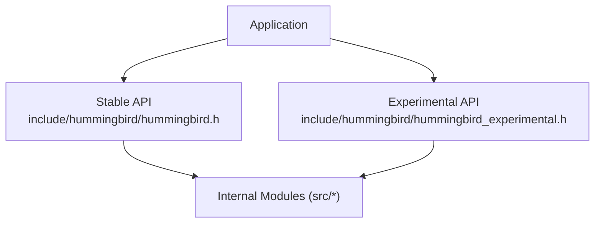
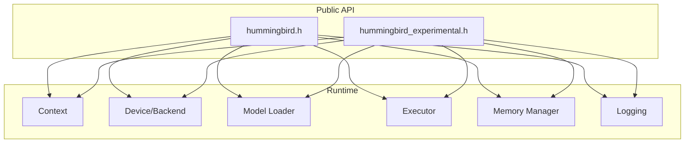
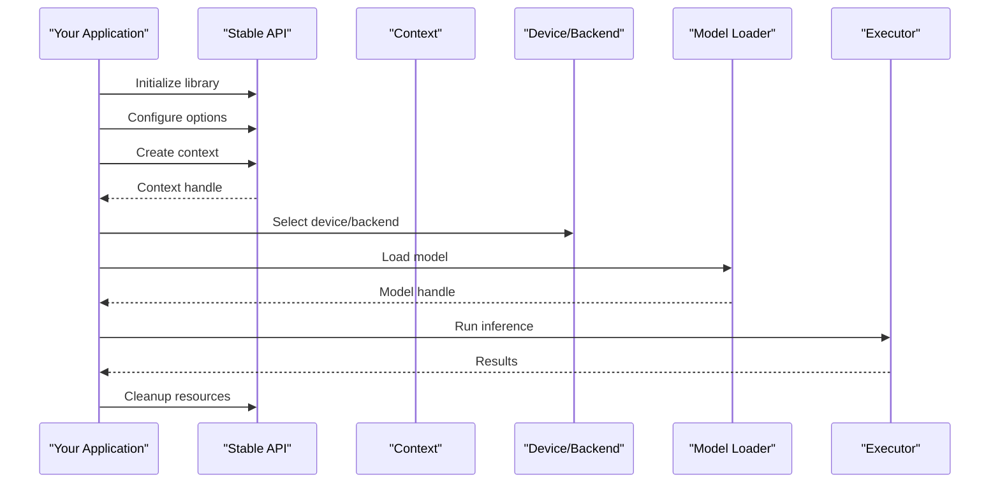
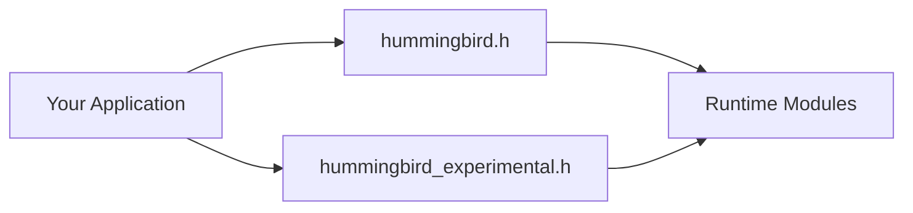

# API Reference

<cite>
**Referenced Files in This Document**
- [hummingbird.h](file://include/hummingbird/hummingbird.h)
- [hummingbird_experimental.h](file://include/hummingbird/hummingbird_experimental.h)
- [README.md](file://include/README.md)
</cite>

## Table of Contents
1. [Introduction](#introduction)
2. [Project Structure](#project-structure)
3. [Core Components](#core-components)
4. [Architecture Overview](#architecture-overview)
5. [Detailed Component Analysis](#detailed-component-analysis)
6. [Dependency Analysis](#dependency-analysis)
7. [Performance Considerations](#performance-considerations)
8. [Troubleshooting Guide](#troubleshooting-guide)
9. [Conclusion](#conclusion)
10. [Appendices](#appendices)

## Introduction
This document provides a comprehensive reference for Hummingbird’s public C APIs, focusing on the stable interface and experimental features. It covers function signatures, parameters, return values, data structures, enumerations, constants, configuration options, error codes, versioning, deprecation policy, and migration guidance. The goal is to enable developers to integrate Hummingbird into their applications confidently and correctly.

## Project Structure
The public C API surface is exposed through two primary headers:
- Stable API: include/hummingbird/hummingbird.h
- Experimental API: include/hummingbird/hummingbird_experimental.h

Additional context about the public headers and usage conventions can be found in include/README.md.

[No sources needed since this diagram shows conceptual structure]

## Core Components
This section summarizes the major categories of the public API as defined by the headers. For precise definitions, refer to the source files listed in Section Sources.

- Initialization and lifecycle
  - Library initialization and shutdown
  - Context creation and destruction
  - Resource management helpers

- Device and backend selection
  - Device enumeration and selection
  - Backend capabilities and configuration

- Model loading and inference
  - Model loading from supported formats
  - Inference execution and result handling
  - Tokenizer integration (if exposed)

- Configuration and logging
  - Global and per-context configuration
  - Logging levels and hooks

- Error handling and diagnostics
  - Error codes and status types
  - Diagnostic information retrieval

- Experimental features
  - Advanced or evolving interfaces guarded by an experimental header

For exact type names, function prototypes, and enumerations, see the detailed references below.

**Section sources**
- [hummingbird.h](file://include/hummingbird/hummingbird.h)
- [hummingbird_experimental.h](file://include/hummingbird/hummingbird_experimental.h)
- [README.md](file://include/README.md)

## Architecture Overview
At a high level, applications interact with Hummingbird via the stable C API. The experimental API exposes additional capabilities that may evolve across versions. Internally, these APIs coordinate with modules such as device management, model loading, execution, memory, and logging.

[No sources needed since this diagram shows conceptual architecture]

## Detailed Component Analysis

### Stable API: hummingbird.h
This header defines the stable public interface. Typical categories include:
- Versioning macros and compatibility checks
- Opaque handles for core objects (e.g., context, model, stream)
- Data types for shapes, dtypes, and tensors
- Enumerations for devices, backends, and error codes
- Functions for initialization, configuration, model loading, inference, and cleanup

Key areas to review:
- Version and ABI stability markers
- Handle types and lifetime rules
- Configuration keys and defaults
- Error code semantics and diagnostic retrieval
- Threading and concurrency guarantees

Usage example outline:
- Initialize library
- Create context
- Select device/backend
- Load model
- Run inference
- Retrieve results
- Clean up resources

**Section sources**
- [hummingbird.h](file://include/hummingbird/hummingbird.h)

### Experimental API: hummingbird_experimental.h
This header exposes advanced or evolving features not yet stabilized. Expect:
- New functions and types under development
- Potential breaking changes across minor versions
- Optional performance or capability enhancements

Guidance:
- Guard usage behind feature flags if available
- Avoid relying on experimental symbols in long-term stable builds
- Monitor release notes for deprecations and migrations

**Section sources**
- [hummingbird_experimental.h](file://include/hummingbird/hummingbird_experimental.h)

### Public Types and Structures
Common categories of types exposed by the public API:
- Opaque handles for library-managed resources
- Value types for dimensions, strides, and data layouts
- Enumerations for devices, backends, and error states
- Configuration descriptors and option sets

Best practices:
- Treat opaque handles as non-copyable unless documented otherwise
- Validate all inputs before passing to the API
- Use provided constructors/factories instead of manual initialization

**Section sources**
- [hummingbird.h](file://include/hummingbird/hummingbird.h)
- [hummingbird_experimental.h](file://include/hummingbird/hummingbird_experimental.h)

### Configuration Options
Typical configuration surfaces include:
- Global settings (e.g., thread pool size, logging level)
- Per-context settings (e.g., device affinity, memory limits)
- Model-specific options (e.g., quantization, cache behavior)

Recommendations:
- Apply global configuration once at startup
- Prefer per-context overrides for multi-model deployments
- Validate configuration values and handle errors explicitly

**Section sources**
- [hummingbird.h](file://include/hummingbird/hummingbird.h)

### Error Codes and Diagnostics
Error handling patterns:
- Functions return status codes or set error codes on handles
- Diagnostic messages can be retrieved after failures
- Some operations may return partial results with warnings

Recommended flow:
- Check return codes immediately
- Retrieve diagnostics only when necessary
- Normalize errors in your application layer

**Section sources**
- [hummingbird.h](file://include/hummingbird/hummingbird.h)

### Threading and Concurrency
Considerations:
- Determine whether calls are thread-safe
- Understand context isolation and sharing rules
- Plan resource lifetimes across threads

Guidelines:
- Do not share mutable state between contexts without synchronization
- Use separate contexts per thread where appropriate
- Avoid concurrent modifications to the same handle

**Section sources**
- [hummingbird.h](file://include/hummingbird/hummingbird.h)

### Example Integration Flow
A typical integration follows these steps:
- Initialize the library
- Configure global and per-context options
- Create a context and select a device/backend
- Load a model
- Execute inference
- Process outputs
- Release resources

[No sources needed since this diagram shows conceptual workflow]

## Dependency Analysis
The public headers define the contract between applications and the runtime. Internal module boundaries are encapsulated behind opaque handles and stable function signatures.

[No sources needed since this diagram shows conceptual dependencies]

## Performance Considerations
- Prefer batching and preallocation where supported
- Pin device selection to avoid runtime switches
- Tune thread pool and memory settings based on workload
- Profile critical paths using built-in profiling hooks if available

[No sources needed since this section provides general guidance]

## Troubleshooting Guide
Common issues and resolutions:
- Initialization failures: verify environment, dependencies, and permissions
- Device selection errors: confirm backend availability and driver support
- Model load errors: validate file format and integrity
- Runtime errors: inspect diagnostics and reduce complexity (e.g., smaller models)

Diagnostic tips:
- Enable verbose logging during development
- Reproduce with minimal configurations
- Capture stack traces or logs around failure points

**Section sources**
- [hummingbird.h](file://include/hummingbird/hummingbird.h)

## Conclusion
Hummingbird’s public C API provides a clear separation between stable and experimental functionality. By adhering to the documented types, configuration patterns, and error-handling strategies, you can build robust integrations. Always consult the latest headers for authoritative definitions and track versioning notes for migration guidance.

[No sources needed since this section summarizes without analyzing specific files]

## Appendices

### API Versioning and Compatibility
- Stable API guarantees across major/minor releases as indicated by version macros
- Experimental API may change without notice; use cautiously in production

Deprecation Policy:
- Deprecated symbols will remain for a transition period
- Migration notices will be included in release notes and headers

Migration Guide for Breaking Changes:
- Replace deprecated functions with new equivalents
- Update configuration keys and enum values
- Rebuild against updated headers and link against compatible binaries

**Section sources**
- [hummingbird.h](file://include/hummingbird/hummingbird.h)
- [hummingbird_experimental.h](file://include/hummingbird/hummingbird_experimental.h)
- [README.md](file://include/README.md)