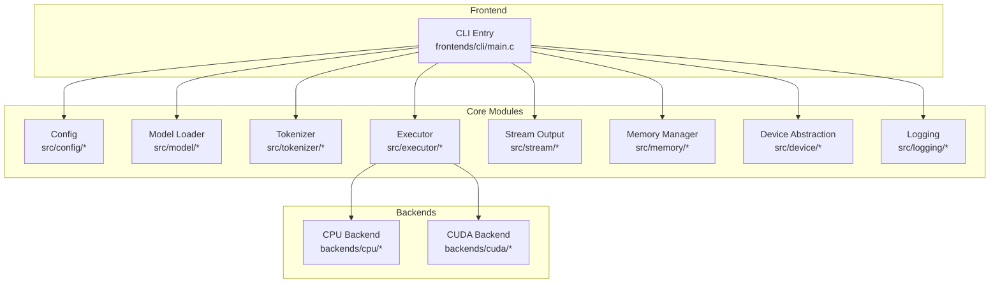
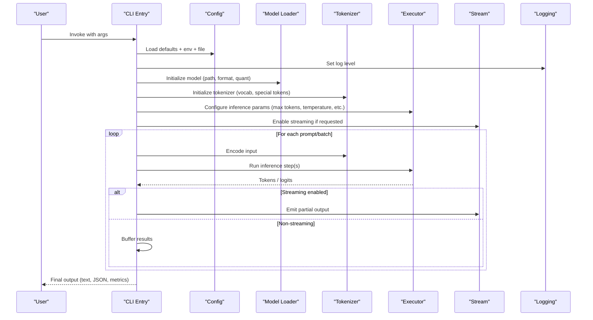
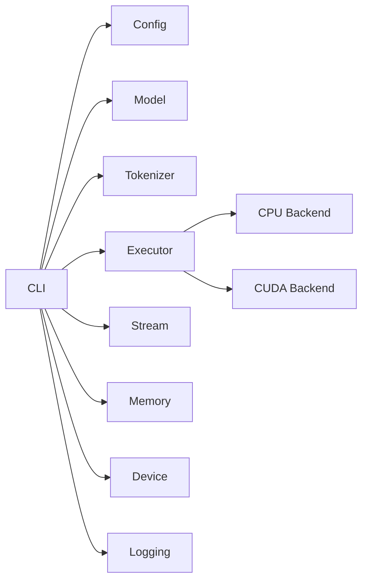

# CLI Interface

<cite>
**Referenced Files in This Document**
- [frontends/cli/main.c](file://frontends/cli/main.c)
- [src/config/config.h](file://src/config/config.h)
- [src/config/config.c](file://src/config/config.c)
- [src/model/model.h](file://src/model/model.h)
- [src/model/model.c](file://src/model/model.c)
- [src/tokenizer/tokenizer.h](file://src/tokenizer/tokenizer.h)
- [src/tokenizer/tokenizer.c](file://src/tokenizer/tokenizer.c)
- [src/executor/executor.h](file://src/executor/executor.h)
- [src/executor/executor.c](file://src/executor/executor.c)
- [src/stream/stream.h](file://src/stream/stream.h)
- [src/stream/stream.c](file://src/stream/stream.c)
- [src/logging/logging.h](file://src/logging/logging.h)
- [src/logging/logging.c](file://src/logging/logging.c)
- [src/memory/memory.h](file://src/memory/memory.h)
- [src/memory/memory.c](file://src/memory/memory.c)
- [src/device/device.h](file://src/device/device.h)
- [src/device/device.c](file://src/device/device.c)
- [backends/cpu/backend_cpu.h](file://backends/cpu/backend_cpu.h)
- [backends/cuda/backend_cuda.h](file://backends/cuda/backend_cuda.h)
- [CMakeLists.txt](file://CMakeLists.txt)
- [README.md](file://README.md)
</cite>

## Table of Contents
1. [Introduction](#introduction)
2. [Project Structure](#project-structure)
3. [Core Components](#core-components)
4. [Architecture Overview](#architecture-overview)
5. [Detailed Component Analysis](#detailed-component-analysis)
6. [Dependency Analysis](#dependency-analysis)
7. [Performance Considerations](#performance-considerations)
8. [Troubleshooting Guide](#troubleshooting-guide)
9. [Conclusion](#conclusion)
10. [Appendices](#appendices)

## Introduction
This document provides comprehensive documentation for Hummingbird’s Command Line Interface (CLI). It explains how to load models, configure inference, control output formatting, and use debugging options. It also covers configuration files, environment variables, shell integration, error handling, logging levels, and common troubleshooting scenarios. Practical examples illustrate batch processing, streaming generation, and performance tuning workflows from model loading to result output.

## Project Structure
The CLI is implemented as a C program under the frontends directory and integrates with core modules such as configuration, model loading, tokenization, execution, streaming, memory management, device selection, and logging. The build system uses CMake, and the project exposes public headers under include/hummingbird.

**Diagram sources**
- [frontends/cli/main.c](file://frontends/cli/main.c)
- [src/config/config.h](file://src/config/config.h)
- [src/model/model.h](file://src/model/model.h)
- [src/tokenizer/tokenizer.h](file://src/tokenizer/tokenizer.h)
- [src/executor/executor.h](file://src/executor/executor.h)
- [src/stream/stream.h](file://src/stream/stream.h)
- [src/memory/memory.h](file://src/memory/memory.h)
- [src/device/device.h](file://src/device/device.h)
- [src/logging/logging.h](file://src/logging/logging.h)
- [backends/cpu/backend_cpu.h](file://backends/cpu/backend_cpu.h)
- [backends/cuda/backend_cuda.h](file://backends/cuda/backend_cuda.h)

**Section sources**
- [CMakeLists.txt](file://CMakeLists.txt)
- [README.md](file://README.md)

## Core Components
- CLI entrypoint: Parses command-line arguments, initializes subsystems, loads configuration, and orchestrates the inference pipeline.
- Configuration: Loads defaults, merges environment variables, and reads user-provided config files.
- Model loader: Supports multiple formats and handles quantization and backend-specific optimizations.
- Tokenizer: Encodes input text into tokens for the model.
- Executor: Schedules and runs model inference with configurable parameters.
- Stream: Handles incremental output for streaming generation.
- Memory manager: Controls allocation strategies and limits.
- Device abstraction: Selects CPU or GPU backends and manages resources.
- Logging: Provides structured logs with configurable verbosity.

Key responsibilities and interactions are orchestrated by the CLI entrypoint based on parsed flags and options.

**Section sources**
- [frontends/cli/main.c](file://frontends/cli/main.c)
- [src/config/config.h](file://src/config/config.h)
- [src/model/model.h](file://src/model/model.h)
- [src/tokenizer/tokenizer.h](file://src/tokenizer/tokenizer.h)
- [src/executor/executor.h](file://src/executor/executor.h)
- [src/stream/stream.h](file://src/stream/stream.h)
- [src/memory/memory.h](file://src/memory/memory.h)
- [src/device/device.h](file://src/device/device.h)
- [src/logging/logging.h](file://src/logging/logging.h)

## Architecture Overview
The CLI follows a layered architecture:
- Presentation layer: CLI argument parsing and help display.
- Orchestration layer: Config resolution, resource initialization, and pipeline control.
- Execution layer: Model loading, tokenization, inference scheduling, and streaming output.
- Infrastructure layer: Memory, device abstraction, and logging.

**Diagram sources**
- [frontends/cli/main.c](file://frontends/cli/main.c)
- [src/config/config.c](file://src/config/config.c)
- [src/model/model.c](file://src/model/model.c)
- [src/tokenizer/tokenizer.c](file://src/tokenizer/tokenizer.c)
- [src/executor/executor.c](file://src/executor/executor.c)
- [src/stream/stream.c](file://src/stream/stream.c)
- [src/logging/logging.c](file://src/logging/logging.c)

## Detailed Component Analysis

### CLI Argument Parsing and Options
The CLI parses flags for:
- Model loading: path, format, quantization, adapter selection.
- Inference settings: max tokens, temperature, top-k/top-p, repetition penalty, seed, parallelism.
- Output formatting: plain text, JSON, CSV; field selection; pretty-print; newline behavior.
- Streaming: enable/disable streaming mode and chunk size.
- Debugging: verbose logging, profiling hooks, memory dumps, device diagnostics.
- Configuration: config file path, override keys via environment variables.

Typical usage patterns:
- Single prompt generation with default settings.
- Batch processing using an input file or stdin stream.
- Streaming generation for real-time output.
- Performance tuning via thread count, memory limits, and backend selection.

Example commands (descriptive):
- Basic generation: specify model path and prompt.
- JSON output: add flag to emit structured results.
- Streaming: enable streaming and set chunk size.
- Batch: provide input file and output file paths.
- Debug: increase log level and enable profiler.

**Section sources**
- [frontends/cli/main.c](file://frontends/cli/main.c)

### Configuration File Support and Environment Variables
Configuration is loaded in priority order:
- Defaults
- Environment variables
- Config file (YAML/JSON-like structure)
- CLI overrides

Common configuration keys:
- model.path, model.format, model.quantization
- tokenizer.vocab_path, tokenizer.special_tokens
- executor.max_tokens, executor.temperature, executor.top_k, executor.top_p
- stream.enabled, stream.chunk_size
- memory.limit_mb, memory.strategy
- device.backend (cpu, cuda), device.gpu_id
- logging.level, logging.file

Environment variable naming convention:
- Prefix-based mapping (e.g., HB_MODEL_PATH, HB_EXECUTOR_MAX_TOKENS)
- Case-insensitive parsing with underscore separators

Validation:
- Missing required fields produce clear errors.
- Type coercion and range checks are enforced.
- Unknown keys are reported but do not abort unless strict mode is enabled.

**Section sources**
- [src/config/config.h](file://src/config/config.h)
- [src/config/config.c](file://src/config/config.c)

### Model Loading and Formats
Supported formats:
- GGUF
- Safetensors

Loading workflow:
- Validate path and format.
- Allocate memory according to model size and quantization.
- Initialize backend-specific kernels and caches.
- Apply adapters if specified.

Quantization:
- Supported types mapped to backend capabilities.
- Fallback behavior when unsupported quantization is requested.

Adapters:
- Optional LoRA-style adapters can be loaded alongside base model.

Error handling:
- Corrupted files, missing weights, and incompatible versions are detected early.

**Section sources**
- [src/model/model.h](file://src/model/model.h)
- [src/model/model.c](file://src/model/model.c)

### Tokenizer Integration
Tokenization supports:
- Vocab files and special tokens configuration.
- Streaming-friendly token emission for long inputs.
- Error handling for unknown tokens and truncation policies.

Usage:
- Pre-tokenize prompts for batch processing.
- Handle context window limits and padding.

**Section sources**
- [src/tokenizer/tokenizer.h](file://src/tokenizer/tokenizer.h)
- [src/tokenizer/tokenizer.c](file://src/tokenizer/tokenizer.c)

### Executor and Inference Settings
Inference parameters:
- Max tokens, temperature, top-k, top-p, repetition penalty, seed.
- Parallelism controls (threads, batches).
- Early stopping and max time constraints.

Execution flow:
- Prepare tokens and context.
- Schedule inference steps across available devices.
- Manage KV cache and memory pressure.

Profiling:
- Optional timing hooks per step.
- Metrics collection for throughput and latency.

**Section sources**
- [src/executor/executor.h](file://src/executor/executor.h)
- [src/executor/executor.c](file://src/executor/executor.c)

### Streaming Output
Streaming modes:
- Character-level or token-level chunks.
- Controlled flush intervals and buffering.

Output formatting:
- Plain text with optional delimiters.
- JSON lines for structured streaming responses.

Integration:
- Works seamlessly with CLI flags to toggle streaming behavior.

**Section sources**
- [src/stream/stream.h](file://src/stream/stream.h)
- [src/stream/stream.c](file://src/stream/stream.c)

### Memory Management
Controls:
- Global memory limit and strategy (eager vs. lazy).
- Per-operation allocation bounds.
- Garbage collection triggers and fragmentation mitigation.

Diagnostics:
- Memory usage snapshots and leak detection.

**Section sources**
- [src/memory/memory.h](file://src/memory/memory.h)
- [src/memory/memory.c](file://src/memory/memory.c)

### Device Abstraction and Backends
Backend selection:
- CPU and CUDA backends exposed via device abstraction.
- Automatic fallback when preferred backend unavailable.

GPU specifics:
- GPU ID selection and multi-GPU awareness.
- CUDA capability checks and kernel availability.

**Section sources**
- [src/device/device.h](file://src/device/device.h)
- [src/device/device.c](file://src/device/device.c)
- [backends/cpu/backend_cpu.h](file://backends/cpu/backend_cpu.h)
- [backends/cuda/backend_cuda.h](file://backends/cuda/backend_cuda.h)

### Logging and Debugging
Log levels:
- Error, Warn, Info, Debug, Trace.

Options:
- Log to stdout, stderr, or file.
- Structured logging with timestamps and module tags.

Debugging features:
- Verbose mode for detailed traces.
- Profiler hooks for performance analysis.
- Device diagnostics and backend status.

**Section sources**
- [src/logging/logging.h](file://src/logging/logging.h)
- [src/logging/logging.c](file://src/logging/logging.c)

## Dependency Analysis
The CLI depends on core modules through well-defined interfaces. Coupling is minimized by abstracting device and backend details.

**Diagram sources**
- [frontends/cli/main.c](file://frontends/cli/main.c)
- [src/config/config.h](file://src/config/config.h)
- [src/model/model.h](file://src/model/model.h)
- [src/tokenizer/tokenizer.h](file://src/tokenizer/tokenizer.h)
- [src/executor/executor.h](file://src/executor/executor.h)
- [src/stream/stream.h](file://src/stream/stream.h)
- [src/memory/memory.h](file://src/memory/memory.h)
- [src/device/device.h](file://src/device/device.h)
- [src/logging/logging.h](file://src/logging/logging.h)
- [backends/cpu/backend_cpu.h](file://backends/cpu/backend_cpu.h)
- [backends/cuda/backend_cuda.h](file://backends/cuda/backend_cuda.h)

**Section sources**
- [CMakeLists.txt](file://CMakeLists.txt)

## Performance Considerations
- Use appropriate backend selection (CPU vs. CUDA) based on workload and hardware.
- Tune executor parameters: reduce max tokens for low-latency tasks; adjust temperature/top-k/top-p for quality vs. speed trade-offs.
- Enable streaming for interactive applications to reduce perceived latency.
- Monitor memory usage and set limits to avoid OOM conditions.
- Profile execution to identify bottlenecks and optimize batching.

[No sources needed since this section provides general guidance]

## Troubleshooting Guide
Common issues and resolutions:
- Model loading failures: verify file path, format, and quantization compatibility.
- Tokenizer errors: ensure vocab path and special tokens are correctly configured.
- Out-of-memory errors: reduce batch size, lower memory limits, or switch to CPU backend temporarily.
- Slow inference: check device utilization, adjust threads, and disable unnecessary profiling.
- Logging problems: confirm log level and file permissions; use structured logs for easier parsing.

Error handling strategies:
- Clear error messages with actionable hints.
- Graceful degradation when optional features are unavailable.
- Robust cleanup of resources on failure paths.

**Section sources**
- [src/logging/logging.c](file://src/logging/logging.c)
- [src/config/config.c](file://src/config/config.c)
- [src/model/model.c](file://src/model/model.c)
- [src/tokenizer/tokenizer.c](file://src/tokenizer/tokenizer.c)
- [src/memory/memory.c](file://src/memory/memory.c)
- [src/device/device.c](file://src/device/device.c)

## Conclusion
Hummingbird’s CLI provides a flexible and powerful interface for model inference, supporting diverse configurations, streaming outputs, and performance tuning. By leveraging configuration files, environment variables, and robust logging, users can integrate the CLI into automated pipelines and interactive workflows effectively. Proper error handling and troubleshooting practices ensure reliable operation across different environments and hardware backends.

[No sources needed since this section summarizes without analyzing specific files]

## Appendices

### Common Usage Patterns
- Single prompt generation:
  - Specify model path and prompt; choose output format (plain text or JSON).
- Batch processing:
  - Provide input file with multiple prompts; set output file and delimiter; enable streaming for large datasets.
- Streaming generation:
  - Enable streaming mode; configure chunk size; pipe output to downstream processors.
- Performance tuning:
  - Adjust executor parameters; select backend; monitor memory and logs.

### Configuration File Example Keys
- model.path, model.format, model.quantization
- tokenizer.vocab_path, tokenizer.special_tokens
- executor.max_tokens, executor.temperature, executor.top_k, executor.top_p
- stream.enabled, stream.chunk_size
- memory.limit_mb, memory.strategy
- device.backend, device.gpu_id
- logging.level, logging.file

### Environment Variable Mapping
- HB_MODEL_PATH, HB_MODEL_FORMAT, HB_MODEL_QUANTIZATION
- HB_TOKENIZER_VOCAB_PATH, HB_TOKENIZER_SPECIAL_TOKENS
- HB_EXECUTOR_MAX_TOKENS, HB_EXECUTOR_TEMPERATURE, HB_EXECUTOR_TOP_K, HB_EXECUTOR_TOP_P
- HB_STREAM_ENABLED, HB_STREAM_CHUNK_SIZE
- HB_MEMORY_LIMIT_MB, HB_MEMORY_STRATEGY
- HB_DEVICE_BACKEND, HB_DEVICE_GPU_ID
- HB_LOGGING_LEVEL, HB_LOGGING_FILE

### Shell Script Integration
- Use heredoc or temp files for prompts.
- Parse JSON output with jq for automation.
- Wrap CLI invocations in loops for batch processing.
- Capture exit codes and logs for monitoring.

[No sources needed since this section provides general guidance]