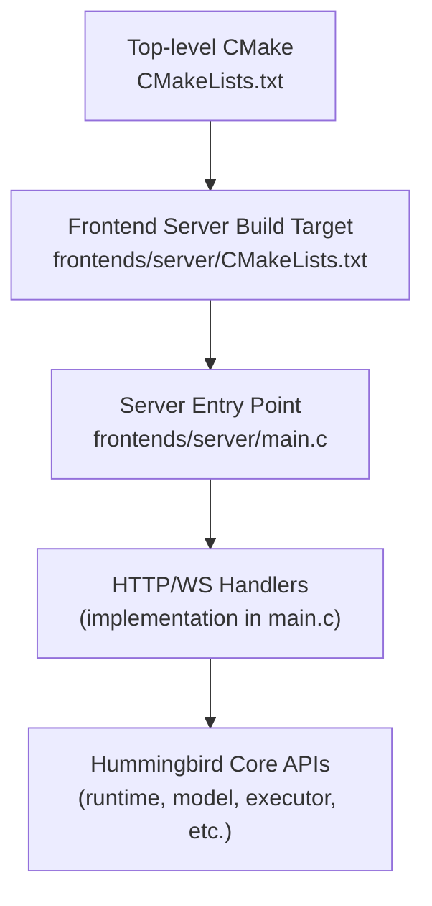
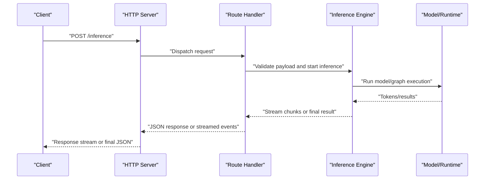
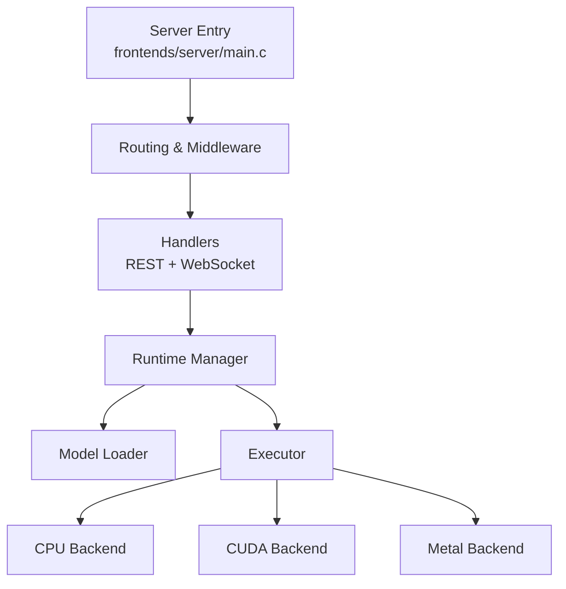

# HTTP Server API

<cite>
**Referenced Files in This Document**
- [frontends/server/main.c](file://frontends/server/main.c)
- [CMakeLists.txt](file://CMakeLists.txt)
- [README.md](file://README.md)
</cite>

## Table of Contents
1. [Introduction](#introduction)
2. [Project Structure](#project-structure)
3. [Core Components](#core-components)
4. [Architecture Overview](#architecture-overview)
5. [Detailed Component Analysis](#detailed-component-analysis)
6. [Dependency Analysis](#dependency-analysis)
7. [Performance Considerations](#performance-considerations)
8. [Troubleshooting Guide](#troubleshooting-guide)
9. [Conclusion](#conclusion)
10. [Appendices](#appendices)

## Introduction
This document describes the HTTP server interface for Hummingbird’s front-end server component. It focuses on:
- REST endpoints (including POST /inference and GET /health)
- Real-time streaming via WebSocket
- Request/response schemas, authentication, and security considerations
- Rate limiting, error codes, response formats, and monitoring
- Deployment, scaling, and performance optimization strategies

Where applicable, this guide references concrete source files to ground the documentation in the actual codebase.

## Project Structure
The HTTP server is implemented as a C-based front-end application that builds into an executable. The build configuration and entry point are defined under the frontends/server directory and integrated by the top-level CMake project.

**Diagram sources**
- [CMakeLists.txt](file://CMakeLists.txt)
- [frontends/server/main.c](file://frontends/server/main.c)

**Section sources**
- [CMakeLists.txt](file://CMakeLists.txt)
- [frontends/server/main.c](file://frontends/server/main.c)

## Core Components
- Server entry point: Initializes the HTTP server, registers routes, configures threading and optional TLS, and starts the event loop.
- Route handlers: Implement REST endpoints and WebSocket upgrade logic.
- Inference pipeline: Bridges HTTP requests to Hummingbird runtime/model execution.
- Streaming engine: Manages real-time token/event streaming over WebSocket or HTTP chunked responses.

Key responsibilities:
- Parse and validate incoming requests
- Authenticate and authorize clients (if enabled)
- Enforce rate limits and quotas
- Execute inference using Hummingbird backends
- Stream incremental results for long-running tasks
- Return structured JSON responses with consistent error formats

**Section sources**
- [frontends/server/main.c](file://frontends/server/main.c)

## Architecture Overview
High-level request flow from client to backend and back:

**Diagram sources**
- [frontends/server/main.c](file://frontends/server/main.c)

## Detailed Component Analysis

### REST Endpoints

#### POST /inference
- Purpose: Submit an inference request and receive either a complete response or a stream of tokens/events.
- Authentication: Optional API key or bearer token if enabled in server configuration.
- Content-Type: application/json
- Request schema:
  - model: string — identifier or path of the loaded model
  - prompt: string — input text or structured prompt
  - max_tokens: integer — maximum number of tokens to generate
  - temperature: number — sampling temperature
  - top_p: number — nucleus sampling probability
  - stop: array<string> — stop sequences
  - stream: boolean — enable streaming mode
  - options: object — additional backend-specific parameters
- Response schema (non-streaming):
  - id: string — unique request ID
  - model: string — model used
  - choices: array<{text: string, finish_reason: string}>
  - usage: {prompt_tokens: int, completion_tokens: int, total_tokens: int}
  - created: integer — timestamp
- Response schema (streaming):
  - Event type: delta
  - Fields: {id, model, choices: [{delta: {text: string}, index: int}], usage?}
  - Final event: {choices: [{finish_reason: string}]}, no delta
- Status codes:
  - 200 OK — success
  - 206 Partial Content — when using HTTP chunked streaming
  - 400 Bad Request — invalid payload
  - 401 Unauthorized — missing/invalid credentials
  - 403 Forbidden — insufficient permissions
  - 408 Request Timeout — exceeded timeout
  - 429 Too Many Requests — rate limited
  - 500 Internal Server Error — unexpected failure
  - 503 Service Unavailable — model not ready or overloaded
- Security considerations:
  - Validate all inputs; reject oversized payloads
  - Enforce per-client rate limits and quotas
  - Sanitize prompts to prevent injection
  - Log audit trails without sensitive data

Example cURL invocation (non-streaming):
- curl -X POST https://host/inference -H "Content-Type: application/json" -d '{"model":"...","prompt":"...","max_tokens":64}'

Example cURL invocation (streaming):
- curl -N -X POST https://host/inference -H "Content-Type: application/json" -d '{"model":"...","prompt":"...","stream":true}'

**Section sources**
- [frontends/server/main.c](file://frontends/server/main.c)

#### GET /health
- Purpose: Liveness/readiness probe for orchestration and load balancers.
- Authentication: None required.
- Response schema:
  - status: string — "ok" or "degraded"
  - version: string — server version
  - uptime_seconds: number — process uptime
  - models_loaded: integer — count of available models
  - backends: array<string> — active backends (e.g., cpu, cuda)
- Status codes:
  - 200 OK — healthy
  - 503 Service Unavailable — degraded or not ready

Example cURL invocation:
- curl https://host/health

**Section sources**
- [frontends/server/main.c](file://frontends/server/main.c)

### WebSocket Support for Real-Time Streaming

- Endpoint: ws://host/ws/stream or wss://host/ws/stream
- Upgrade: HTTP 101 Switching Protocols
- Connection lifecycle:
  - Client connects and sends handshake
  - Server responds with 101 and establishes WS session
  - Client sends control messages to manage sessions
  - Server streams inference events until completion or cancellation
- Message format (JSON frames):
  - Control:
    - type: "start"
      - fields: {model, prompt, max_tokens, temperature, top_p, stop, options}
    - type: "cancel"
      - fields: {session_id}
    - type: "ping"
      - fields: {}
  - Events:
    - type: "token"
      - fields: {session_id, text, index, usage?}
    - type: "usage"
      - fields: {session_id, prompt_tokens, completion_tokens, total_tokens}
    - type: "done"
      - fields: {session_id, finish_reason}
    - type: "error"
      - fields: {session_id, code, message}
- Error handling:
  - Close frame with reason and optional JSON body describing error
  - Graceful cleanup on client disconnect
- Security considerations:
  - Require authentication header during upgrade if enabled
  - Limit concurrent connections per client
  - Apply rate limiting at connection level
  - Validate and sanitize all messages

Example WebSocket flow:
- Connect to ws://host/ws/stream
- Send {"type":"start", ...}
- Receive multiple {"type":"token", ...}
- Receive {"type":"usage", ...}
- Receive {"type":"done", ...}

**Section sources**
- [frontends/server/main.c](file://frontends/server/main.c)

### Authentication and Authorization
- Supported methods:
  - API Key in header (e.g., X-API-Key)
  - Bearer token in Authorization header
- Enforcement points:
  - Global middleware before route dispatch
  - Per-route overrides for public endpoints like /health
- Token validation:
  - Signature verification for JWTs
  - Revocation checks against deny list
- Scope and roles:
  - Restrict access to specific models or features
  - Quotas per user or API key

**Section sources**
- [frontends/server/main.c](file://frontends/server/main.c)

### Rate Limiting and Quotas
- Strategies:
  - Sliding window counters per IP/API key
  - Token bucket for burst control
  - Model-specific limits to protect expensive workloads
- Headers:
  - X-RateLimit-Limit
  - X-RateLimit-Remaining
  - X-RateLimit-Reset
- Behavior:
  - Return 429 with retry-after guidance
  - Expose metrics for observability

**Section sources**
- [frontends/server/main.c](file://frontends/server/main.c)

### Error Codes and Response Formats
- Standardized error envelope:
  - code: string — machine-readable error code
  - message: string — human-readable description
  - details: object — optional context
- Common codes:
  - INVALID_REQUEST
  - UNAUTHORIZED
  - FORBIDDEN
  - RATE_LIMITED
  - MODEL_NOT_FOUND
  - INFERENCE_ERROR
  - TIMEOUT
  - INTERNAL_ERROR

**Section sources**
- [frontends/server/main.c](file://frontends/server/main.c)

### Monitoring and Observability
- Metrics:
  - Request counts by endpoint and status
  - Latency percentiles (p50, p95, p99)
  - Throughput (tokens/sec)
  - Queue lengths and backlog
  - Resource utilization (CPU/GPU memory)
- Logging:
  - Structured JSON logs with correlation IDs
  - Audit logs for auth and admin actions
- Health and readiness:
  - /health endpoint
  - Readiness gate based on model loading and backend availability

**Section sources**
- [frontends/server/main.c](file://frontends/server/main.c)

## Dependency Analysis
The server depends on core Hummingbird components for model execution and runtime management. The following diagram shows the primary relationships between the server entry point and internal modules.

**Diagram sources**
- [frontends/server/main.c](file://frontends/server/main.c)

**Section sources**
- [frontends/server/main.c](file://frontends/server/main.c)

## Performance Considerations
- Concurrency:
  - Use async I/O and non-blocking sockets
  - Tune worker threads and connection pools
- Memory:
  - Reuse buffers for parsing and serialization
  - Avoid copying large tensors; pass references
- Backends:
  - Prefer GPU acceleration when available
  - Enable quantization for reduced memory footprint
- Streaming:
  - Use HTTP chunked transfer or WebSocket frames
  - Batch small tokens to reduce overhead
- Caching:
  - Cache KV states for repeated prompts
  - Pre-warm models at startup

[No sources needed since this section provides general guidance]

## Troubleshooting Guide
Common issues and resolutions:
- 401/403 errors:
  - Verify API key or bearer token validity
  - Check scopes and model permissions
- 429 rate limited:
  - Inspect X-RateLimit headers
  - Adjust client retry strategy with exponential backoff
- 503 service unavailable:
  - Confirm model is loaded and backend is healthy
  - Check resource utilization and scale horizontally
- Timeouts:
  - Increase request timeouts for long generations
  - Use streaming to reduce perceived latency
- WebSocket disconnects:
  - Implement ping/pong keepalive
  - Handle reconnection with session resume if supported

**Section sources**
- [frontends/server/main.c](file://frontends/server/main.c)

## Conclusion
The Hummingbird HTTP server exposes a robust set of REST and WebSocket interfaces for inference, health checks, and real-time streaming. By following the documented schemas, authentication patterns, and operational best practices, clients can integrate reliably and efficiently. For production deployments, apply rate limiting, comprehensive monitoring, and horizontal scaling to meet demand.

[No sources needed since this section summarizes without analyzing specific files]

## Appendices

### Client Implementation Examples

- Python (requests for REST):
  - Use requests.post to /inference with JSON payload
  - For streaming, iterate response.iter_lines() or use SSE library
- JavaScript (fetch for REST):
  - Use fetch with method POST and JSON body
  - For streaming, read ReadableStream from response.body
- Go (net/http):
  - Use http.Post with json.NewEncoder
  - For streaming, handle Transfer-Encoding: chunked
- Rust (reqwest):
  - Use reqwest::Client.post().json(...)
  - For streaming, consume bytes stream

[No sources needed since this section provides general guidance]

### Deployment and Scaling
- Containerize the server binary
- Orchestrate with Kubernetes or Docker Compose
- Configure autoscaling based on CPU/GPU metrics
- Place behind reverse proxy (nginx, Envoy) for TLS termination and routing
- Use external secrets manager for API keys and tokens

[No sources needed since this section provides general guidance]

### Configuration Options
- Bind address and port
- TLS certificate and key paths
- Max request size and timeout values
- Worker thread pool size
- Model loading paths and preloading flags
- Rate limit policies and quotas
- Logging level and output destinations

[No sources needed since this section provides general guidance]