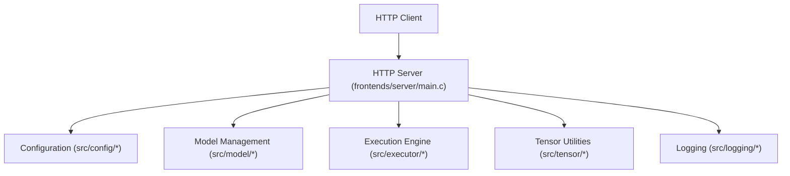
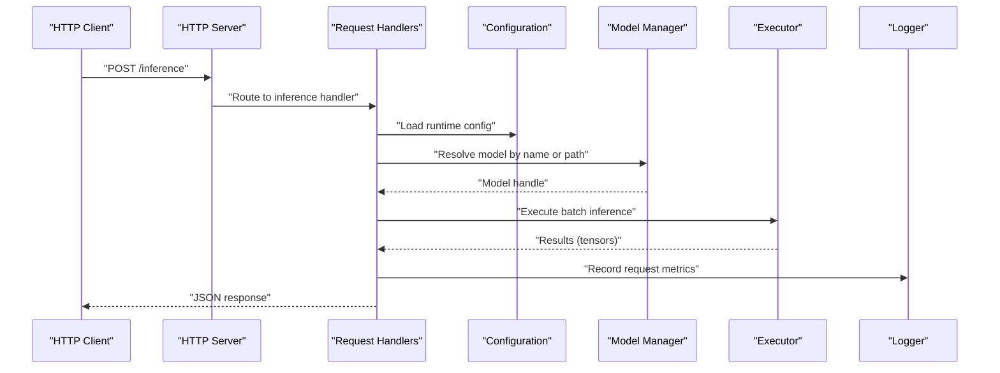
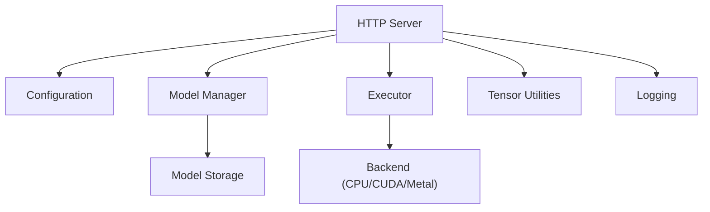

# REST API Endpoints

<cite>
**Referenced Files in This Document**
- [frontends/server/main.c](file://frontends/server/main.c)
- [src/config/config.h](file://src/config/config.h)
- [src/config/config.c](file://src/config/config.c)
- [src/model/model.h](file://src/model/model.h)
- [src/model/model.c](file://src/model/model.c)
- [src/executor/executor.h](file://src/executor/executor.h)
- [src/executor/executor.c](file://src/executor/executor.c)
- [src/tensor/tensor.h](file://src/tensor/tensor.h)
- [src/tensor/tensor.c](file://src/tensor/tensor.c)
- [src/common/common.h](file://src/common/common.h)
- [src/logging/logging.h](file://src/logging/logging.h)
</cite>

## Table of Contents
1. [Introduction](#introduction)
2. [Project Structure](#project-structure)
3. [Core Components](#core-components)
4. [Architecture Overview](#architecture-overview)
5. [Detailed Component Analysis](#detailed-component-analysis)
6. [Dependency Analysis](#dependency-analysis)
7. [Performance Considerations](#performance-considerations)
8. [Troubleshooting Guide](#troubleshooting-guide)
9. [Conclusion](#conclusion)
10. [Appendices](#appendices)

## Introduction
This document provides comprehensive REST API documentation for Hummingbird’s HTTP server endpoints. It covers the available HTTP methods, URL patterns, request and response schemas, content types, status codes, parameter validation rules, error formats, rate limiting configuration options, authentication mechanisms, security headers, CORS settings, and practical client examples in Python, JavaScript, and cURL.

The server is implemented as a C application with an HTTP front-end that exposes inference and health-check endpoints and integrates with model management and execution components.

## Project Structure
The HTTP server entry point resides under the frontends directory and delegates to core subsystems such as configuration, model management, executor, tensor handling, and logging. The following diagram shows how the server interacts with these modules.

**Diagram sources**
- [frontends/server/main.c](file://frontends/server/main.c)
- [src/config/config.h](file://src/config/config.h)
- [src/config/config.c](file://src/config/config.c)
- [src/model/model.h](file://src/model/model.h)
- [src/model/model.c](file://src/model/model.c)
- [src/executor/executor.h](file://src/executor/executor.h)
- [src/executor/executor.c](file://src/executor/executor.c)
- [src/tensor/tensor.h](file://src/tensor/tensor.h)
- [src/tensor/tensor.c](file://src/tensor/tensor.c)
- [src/logging/logging.h](file://src/logging/logging.h)

**Section sources**
- [frontends/server/main.c](file://frontends/server/main.c)
- [src/config/config.h](file://src/config/config.h)
- [src/config/config.c](file://src/config/config.c)
- [src/model/model.h](file://src/model/model.h)
- [src/model/model.c](file://src/model/model.c)
- [src/executor/executor.h](file://src/executor/executor.h)
- [src/executor/executor.c](file://src/executor/executor.c)
- [src/tensor/tensor.h](file://src/tensor/tensor.h)
- [src/tensor/tensor.c](file://src/tensor/tensor.c)
- [src/logging/logging.h](file://src/logging/logging.h)

## Core Components
- HTTP Server: Entry point for incoming requests, routing to handlers for inference and health checks.
- Configuration: Provides runtime parameters including port, model paths, concurrency, and optional security/CORS settings.
- Model Management: Loads, lists, and manages models used by the inference engine.
- Execution Engine: Schedules and runs model computations on selected backends.
- Tensor Utilities: Handles input/output tensor serialization and validation.
- Logging: Records request/response metadata and errors for diagnostics.

Key responsibilities:
- Parse and validate JSON payloads for inference requests.
- Manage model lifecycle (load/unload/list).
- Execute batched inference tasks with configurable concurrency.
- Return structured JSON responses with appropriate status codes.

**Section sources**
- [frontends/server/main.c](file://frontends/server/main.c)
- [src/config/config.h](file://src/config/config.h)
- [src/config/config.c](file://src/config/config.c)
- [src/model/model.h](file://src/model/model.h)
- [src/model/model.c](file://src/model/model.c)
- [src/executor/executor.h](file://src/executor/executor.h)
- [src/executor/executor.c](file://src/executor/executor.c)
- [src/tensor/tensor.h](file://src/tensor/tensor.h)
- [src/tensor/tensor.c](file://src/tensor/tensor.c)
- [src/logging/logging.h](file://src/logging/logging.h)

## Architecture Overview
The server follows a layered architecture where the HTTP layer routes requests to domain-specific handlers. Each handler validates inputs, invokes model and execution services, and returns standardized JSON responses.

**Diagram sources**
- [frontends/server/main.c](file://frontends/server/main.c)
- [src/config/config.h](file://src/config/config.h)
- [src/config/config.c](file://src/config/config.c)
- [src/model/model.h](file://src/model/model.h)
- [src/model/model.c](file://src/model/model.c)
- [src/executor/executor.h](file://src/executor/executor.h)
- [src/executor/executor.c](file://src/executor/executor.c)
- [src/logging/logging.h](file://src/logging/logging.h)

## Detailed Component Analysis

### Inference Endpoint: POST /inference
Purpose:
- Accepts batched inference requests and returns computed outputs.

URL Pattern:
- POST /inference

Content Types:
- Request: application/json
- Response: application/json

Request Schema:
- model: string — Identifier or path of the model to use.
- inputs: object — Map of input names to tensor data.
  - Each tensor value must include:
    - dtype: string — Data type identifier (e.g., float32, int32).
    - shape: array of integers — Dimensions of the tensor.
    - data: array of numbers — Flattened tensor values matching dtype and shape.
- options: object — Optional execution options.
  - device: string — Target device (e.g., cpu, cuda, metal).
  - batch_size: integer — Number of samples per batch.
  - max_concurrency: integer — Maximum concurrent executions.
  - timeout_ms: integer — Per-request timeout in milliseconds.

Validation Rules:
- model must be non-empty and refer to a loaded or loadable model.
- inputs must be a non-empty object; each key must map to a valid tensor structure.
- dtype must be supported by the backend.
- shape must match the expected dimensions for the given model inputs.
- data length must equal the product of shape elements.
- options fields are optional but must adhere to allowed ranges if provided.

Response Schema:
- status: string — "ok" or "error".
- outputs: object — Map of output names to tensor data.
  - Each tensor includes dtype, shape, and data fields similar to inputs.
- metrics: object — Execution metrics.
  - latency_ms: number — Total time for the request.
  - throughput: number — Requests per second.
- trace_id: string — Unique identifier for tracing.

Status Codes:
- 200 OK — Successful inference.
- 400 Bad Request — Invalid payload or validation failure.
- 404 Not Found — Model not found or unavailable.
- 429 Too Many Requests — Rate limit exceeded.
- 500 Internal Server Error — Unexpected server-side failure.

Error Response Format:
- status: string — "error".
- code: integer — HTTP status code.
- message: string — Human-readable error description.
- details: object — Additional context (optional).

Rate Limiting:
- Configurable via configuration parameters (see Configuration section).
- When exceeded, the server responds with 429 and includes retry-after guidance in headers.

Security Headers:
- Content-Security-Policy: configured via server settings.
- X-Frame-Options: configured via server settings.
- Strict-Transport-Security: enabled when HTTPS is configured.

CORS Configuration:
- Allowed origins, methods, and headers can be set via configuration.
- Preflight requests are handled automatically when CORS is enabled.

Authentication Mechanisms:
- Supports API key header-based authentication when enabled.
- Supports token-based authentication (e.g., JWT) if configured.
- Authentication failures return 401 Unauthorized with an error body.

Practical Client Examples:
- cURL:
  - Use curl -X POST with -H "Content-Type: application/json" and a JSON body containing model, inputs, and optional options.
- Python:
  - Use requests.post with a JSON payload and headers for authentication if required.
- JavaScript:
  - Use fetch with method "POST", headers including "Content-Type: application/json", and a JSON body.

Notes:
- Ensure tensors are flattened and ordered according to row-major conventions unless otherwise specified.
- For large batches, consider chunking requests to respect timeout and memory constraints.

**Section sources**
- [frontends/server/main.c](file://frontends/server/main.c)
- [src/config/config.h](file://src/config/config.h)
- [src/config/config.c](file://src/config/config.c)
- [src/model/model.h](file://src/model/model.h)
- [src/model/model.c](file://src/model/model.c)
- [src/executor/executor.h](file://src/executor/executor.h)
- [src/executor/executor.c](file://src/executor/executor.c)
- [src/tensor/tensor.h](file://src/tensor/tensor.h)
- [src/tensor/tensor.c](file://src/tensor/tensor.c)
- [src/logging/logging.h](file://src/logging/logging.h)

### Health Check Endpoint: GET /health
Purpose:
- Provides service readiness and liveness information for monitoring.

URL Pattern:
- GET /health

Content Types:
- Response: application/json

Response Schema:
- status: string — "healthy" or "unhealthy".
- version: string — Server version.
- uptime_seconds: number — Time since server start.
- components: object — Status of internal components.
  - model_manager: boolean — Whether model manager is ready.
  - executor: boolean — Whether executor is ready.
  - storage: boolean — Whether storage is accessible.
- metrics: object — Optional performance indicators.
  - active_requests: integer — Current number of in-flight requests.
  - queue_depth: integer — Pending requests in queue.

Status Codes:
- 200 OK — Service healthy.
- 503 Service Unavailable — Service unhealthy or not ready.

Use Cases:
- Kubernetes liveness/readiness probes.
- Load balancer health checks.
- Dashboard monitoring.

**Section sources**
- [frontends/server/main.c](file://frontends/server/main.c)
- [src/logging/logging.h](file://src/logging/logging.h)

### Model Management Endpoints
These endpoints allow listing, loading, and unloading models.

List Models:
- GET /models
- Response:
  - models: array of objects
    - name: string
    - path: string
    - status: string — "loaded", "unloaded", "error"
    - metadata: object — Optional model metadata (e.g., format, size)

Load Model:
- POST /models/load
- Request:
  - name: string — Model identifier.
  - path: string — Path to model file or directory.
  - device: string — Target device.
  - options: object — Optional loading options.
- Response:
  - status: string — "ok" or "error".
  - model: object — Loaded model info.
  - error: object — Present only on failure.

Unload Model:
- POST /models/unload
- Request:
  - name: string — Model identifier to unload.
- Response:
  - status: string — "ok" or "error".
  - message: string — Confirmation or error details.

Validation Rules:
- name must be unique across loaded models.
- path must exist and be readable.
- device must be supported by the backend.
- Loading may fail due to incompatible formats or insufficient resources.

Status Codes:
- 200 OK — Success.
- 400 Bad Request — Invalid parameters.
- 404 Not Found — Model not found.
- 409 Conflict — Name already in use.
- 500 Internal Server Error — Server-side failure.

**Section sources**
- [frontends/server/main.c](file://frontends/server/main.c)
- [src/model/model.h](file://src/model/model.h)
- [src/model/model.c](file://src/model/model.c)

### Batch Processing Behavior
Batch processing is controlled by the options field in the inference request:
- batch_size determines how many samples are processed together.
- max_concurrency controls parallelism across requests.
- timeout_ms sets per-request limits to prevent long-running tasks.

Recommendations:
- Tune batch_size based on model memory footprint and hardware capacity.
- Monitor latency_ms and adjust concurrency to balance throughput and responsiveness.

**Section sources**
- [src/executor/executor.h](file://src/executor/executor.h)
- [src/executor/executor.c](file://src/executor/executor.c)
- [src/tensor/tensor.h](file://src/tensor/tensor.h)
- [src/tensor/tensor.c](file://src/tensor/tensor.c)

## Dependency Analysis
The server depends on configuration, model management, execution, tensor utilities, and logging. The following diagram illustrates these relationships.

**Diagram sources**
- [frontends/server/main.c](file://frontends/server/main.c)
- [src/config/config.h](file://src/config/config.h)
- [src/config/config.c](file://src/config/config.c)
- [src/model/model.h](file://src/model/model.h)
- [src/model/model.c](file://src/model/model.c)
- [src/executor/executor.h](file://src/executor/executor.h)
- [src/executor/executor.c](file://src/executor/executor.c)
- [src/tensor/tensor.h](file://src/tensor/tensor.h)
- [src/tensor/tensor.c](file://src/tensor/tensor.c)
- [src/logging/logging.h](file://src/logging/logging.h)

**Section sources**
- [frontends/server/main.c](file://frontends/server/main.c)
- [src/config/config.h](file://src/config/config.h)
- [src/config/config.c](file://src/config/config.c)
- [src/model/model.h](file://src/model/model.h)
- [src/model/model.c](file://src/model/model.c)
- [src/executor/executor.h](file://src/executor/executor.h)
- [src/executor/executor.c](file://src/executor/executor.c)
- [src/tensor/tensor.h](file://src/tensor/tensor.h)
- [src/tensor/tensor.c](file://src/tensor/tensor.c)
- [src/logging/logging.h](file://src/logging/logging.h)

## Performance Considerations
- Concurrency: Adjust max_concurrency to match CPU/GPU capabilities.
- Batching: Larger batch sizes improve throughput but increase latency and memory usage.
- Device Selection: Choose device based on workload characteristics (e.g., CUDA for GPU acceleration).
- Timeouts: Set reasonable timeout_ms to avoid resource exhaustion.
- Monitoring: Use /health and metrics fields to track active requests and queue depth.

[No sources needed since this section provides general guidance]

## Troubleshooting Guide
Common Issues:
- Validation Errors: Ensure inputs conform to schema and dtype/shape/data consistency.
- Model Not Found: Verify model name/path and that the model is loaded.
- Rate Limiting: If receiving 429, reduce request frequency or adjust rate limits in configuration.
- Authentication Failures: Confirm API keys or tokens are correctly set in headers.
- CORS Errors: Configure allowed origins and preflight handling appropriately.

Diagnostic Steps:
- Inspect logs for detailed error messages and stack traces.
- Use trace_id from responses to correlate logs across components.
- Validate model files and permissions.
- Test with minimal payloads to isolate issues.

**Section sources**
- [src/logging/logging.h](file://src/logging/logging.h)
- [src/common/common.h](file://src/common/common.h)

## Conclusion
Hummingbird’s HTTP server provides a robust REST API for inference, health monitoring, and model management. By adhering to the documented schemas, validation rules, and configuration options, clients can integrate reliably and efficiently. Proper tuning of batching, concurrency, and timeouts ensures optimal performance across diverse deployment environments.

[No sources needed since this section summarizes without analyzing specific files]

## Appendices

### Configuration Options
- server.port: integer — HTTP server port.
- server.host: string — Bind address.
- server.cors.enabled: boolean — Enable CORS.
- server.cors.allowed_origins: array of strings — Allowed origins.
- server.cors.allowed_methods: array of strings — Allowed HTTP methods.
- server.cors.allowed_headers: array of strings — Allowed headers.
- auth.api_key.header: string — Header name for API key.
- auth.jwt.secret: string — Secret for JWT verification.
- rate_limit.requests_per_second: number — Max requests per second.
- rate_limit.burst: integer — Burst allowance.
- executor.max_concurrency: integer — Max concurrent executions.
- executor.timeout_ms: integer — Default timeout per request.
- model.default_device: string — Default device for model execution.

**Section sources**
- [src/config/config.h](file://src/config/config.h)
- [src/config/config.c](file://src/config/config.c)

### Security Headers
- Content-Security-Policy: string — CSP policy.
- X-Frame-Options: string — Frame protection.
- Strict-Transport-Security: string — HSTS policy.
- X-Content-Type-Options: string — MIME sniffing prevention.

**Section sources**
- [src/config/config.h](file://src/config/config.h)
- [src/config/config.c](file://src/config/config.c)

### Example Client Implementations
- cURL:
  - POST /inference with JSON body and authentication headers.
- Python:
  - Use requests library to send JSON payloads and handle responses.
- JavaScript:
  - Use fetch API to make asynchronous requests and parse JSON responses.

[No sources needed since this section provides general guidance]