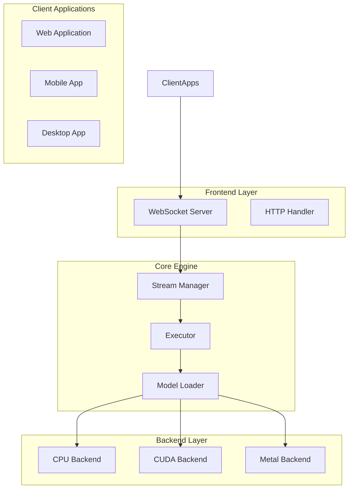
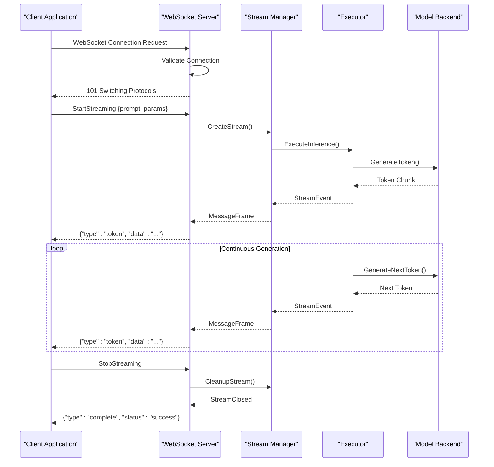
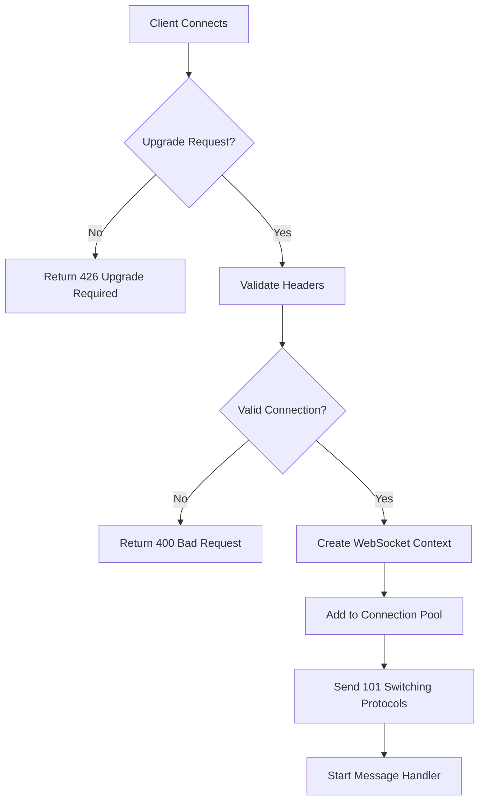
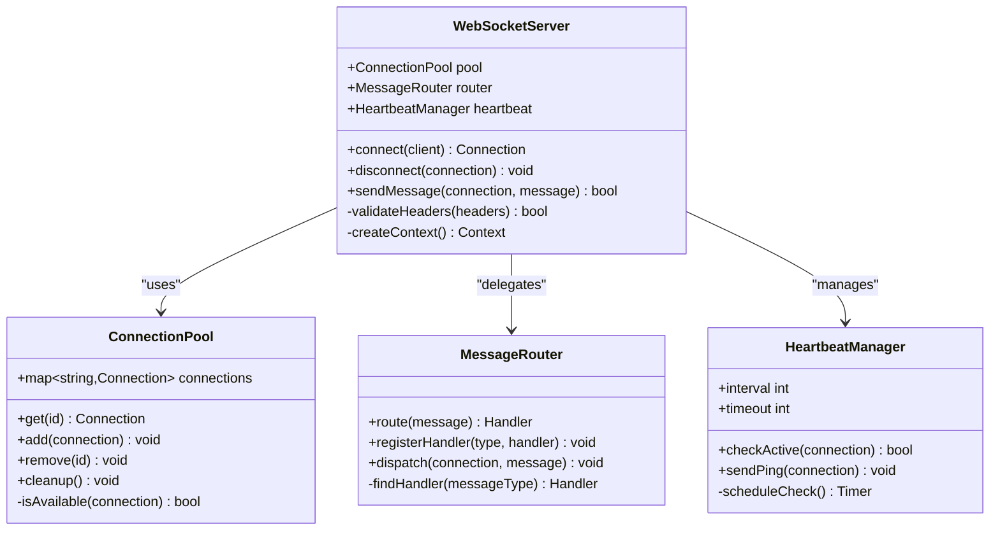
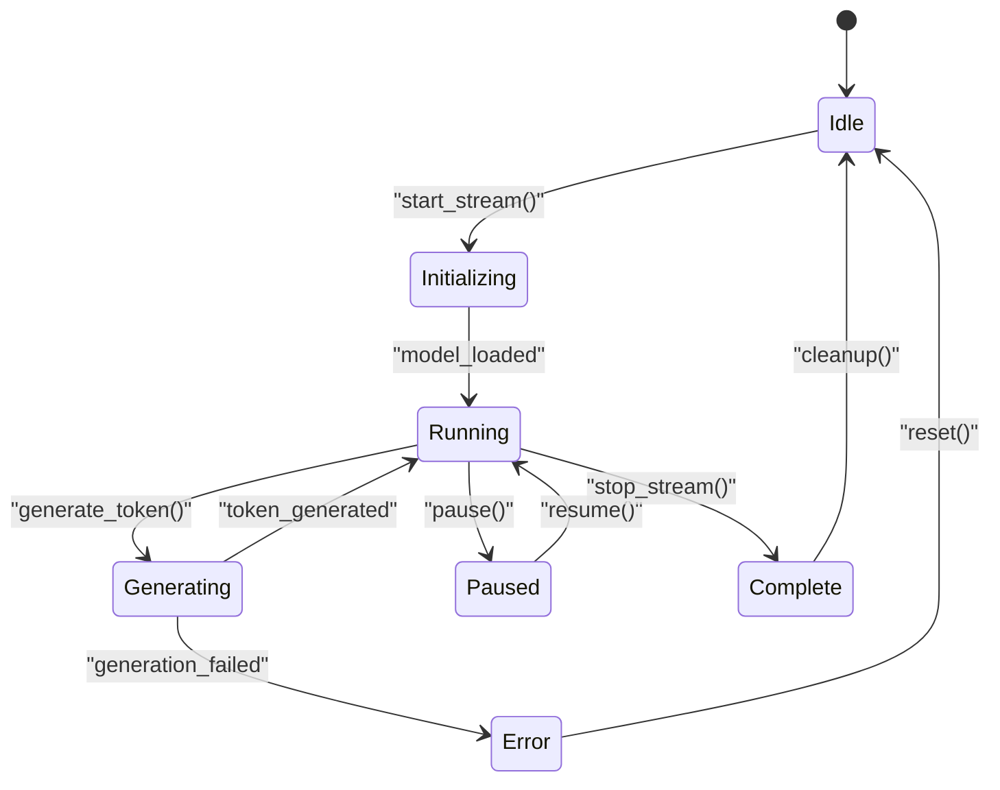
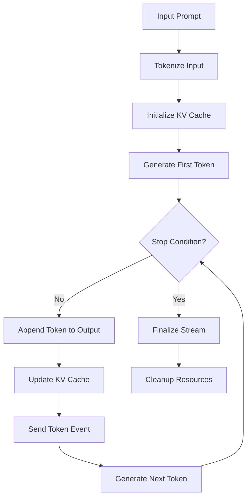
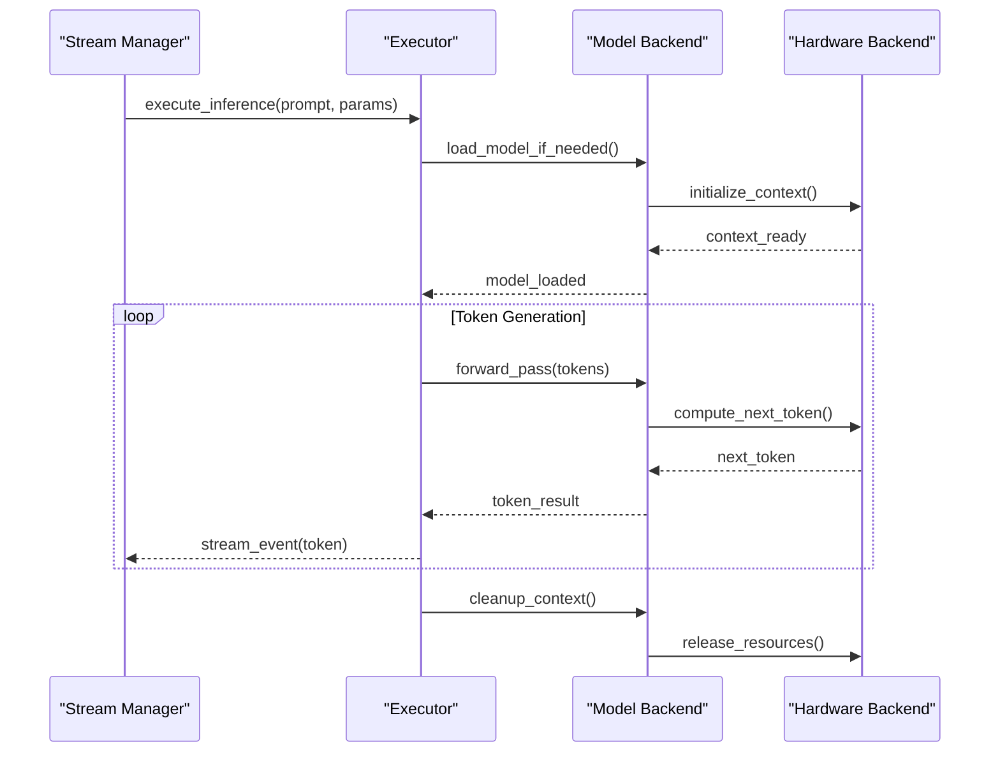
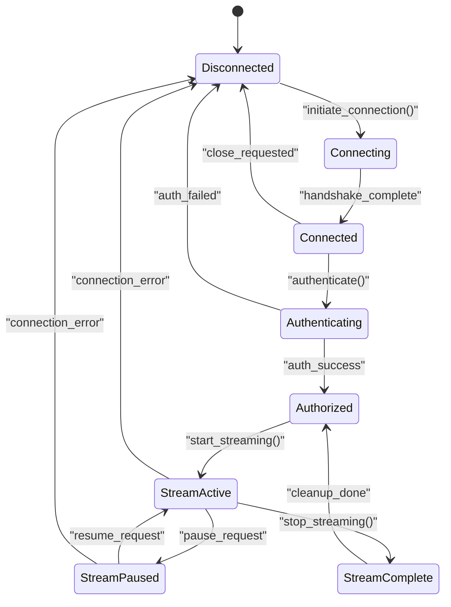
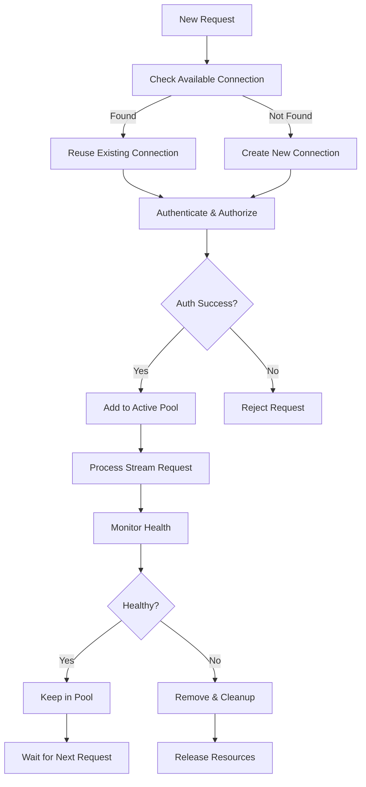
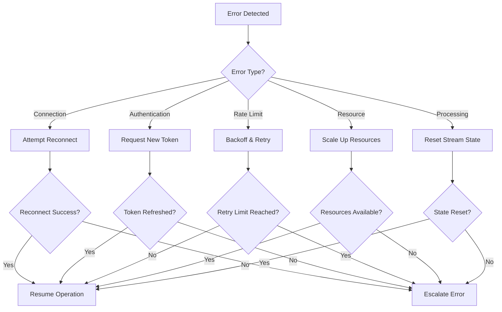

# WebSocket Streaming API

<cite>
**Referenced Files in This Document**
- [frontends/server/main.c](file://frontends/server/main.c)
- [src/stream/stream.c](file://src/stream/stream.c)
- [src/stream/stream.h](file://src/stream/stream.h)
- [include/hummingbird/hummingbird.h](file://include/hummingbird/hummingbird.h)
- [src/executor/executor.c](file://src/executor/executor.c)
- [src/model/model.c](file://src/model/model.c)
</cite>

## Table of Contents
1. [Introduction](#introduction)
2. [Project Structure](#project-structure)
3. [Core Components](#core-components)
4. [Architecture Overview](#architecture-overview)
5. [Detailed Component Analysis](#detailed-component-analysis)
6. [WebSocket Protocol Specification](#websocket-protocol-specification)
7. [Message Schema Definitions](#message-schema-definitions)
8. [Connection Lifecycle Management](#connection-lifecycle-management)
9. [Client Implementation Guide](#client-implementation-guide)
10. [Performance Optimization](#performance-optimization)
11. [Error Handling and Troubleshooting](#error-handling-and-troubleshooting)
12. [Conclusion](#conclusion)

## Introduction

This document provides comprehensive documentation for the WebSocket-based streaming inference API in Hummingbird. The API enables real-time token generation through continuous bidirectional communication between clients and the server, supporting high-throughput scenarios with connection pooling, heartbeat mechanisms, and robust error handling.

The streaming API is designed for applications requiring immediate feedback during text generation, such as chat interfaces, live transcription services, and interactive AI assistants. It leverages WebSocket technology to maintain persistent connections while efficiently managing server resources through connection pooling and intelligent retry logic.

## Project Structure

The WebSocket streaming functionality is implemented across multiple components within the Hummingbird architecture:



**Diagram sources**
- [frontends/server/main.c:1-50](file://frontends/server/main.c#L1-L50)
- [src/stream/stream.c:1-100](file://src/stream/stream.c#L1-L100)
- [src/executor/executor.c:1-80](file://src/executor/executor.c#L1-L80)

**Section sources**
- [frontends/server/main.c:1-100](file://frontends/server/main.c#L1-L100)
- [src/stream/stream.h:1-50](file://src/stream/stream.h#L1-L50)

## Core Components

The WebSocket streaming system consists of several key components that work together to provide efficient real-time inference:

### WebSocket Server
Handles incoming WebSocket connections, manages connection lifecycle, and routes messages to appropriate handlers.

### Stream Manager
Coordinates the streaming process, manages token generation state, and handles message queuing and delivery.

### Executor
Processes inference requests and coordinates with the model backend for token generation.

### Connection Pool
Manages reusable WebSocket connections to optimize resource utilization and reduce connection overhead.

**Section sources**
- [src/stream/stream.c:1-200](file://src/stream/stream.c#L1-L200)
- [src/executor/executor.c:1-150](file://src/executor/executor.c#L1-L150)

## Architecture Overview

The WebSocket streaming architecture follows a layered approach with clear separation of concerns:



**Diagram sources**
- [frontends/server/main.c:50-150](file://frontends/server/main.c#L50-L150)
- [src/stream/stream.c:100-300](file://src/stream/stream.c#L100-L300)
- [src/executor/executor.c:80-200](file://src/executor/executor.c#L80-L200)

## Detailed Component Analysis

### WebSocket Server Implementation

The WebSocket server component handles connection establishment, message routing, and lifecycle management:

#### Connection Establishment Flow



**Diagram sources**
- [frontends/server/main.c:100-200](file://frontends/server/main.c#L100-L200)

#### Message Processing Pipeline



**Diagram sources**
- [frontends/server/main.c:200-400](file://frontends/server/main.c#L200-L400)

**Section sources**
- [frontends/server/main.c:1-500](file://frontends/server/main.c#L1-L500)

### Stream Manager

The stream manager coordinates the streaming inference process and manages token generation state:

#### Stream State Management



**Diagram sources**
- [src/stream/stream.c:150-350](file://src/stream/stream.c#L150-L350)

#### Token Generation Pipeline



**Diagram sources**
- [src/stream/stream.c:200-400](file://src/stream/stream.c#L200-L400)

**Section sources**
- [src/stream/stream.c:1-500](file://src/stream/stream.c#L1-L500)
- [src/stream/stream.h:1-100](file://src/stream/stream.h#L1-L100)

### Executor Component

The executor handles inference execution and coordinates with model backends:

#### Execution Flow



**Diagram sources**
- [src/executor/executor.c:100-300](file://src/executor/executor.c#L100-L300)

**Section sources**
- [src/executor/executor.c:1-400](file://src/executor/executor.c#L1-L400)

## WebSocket Protocol Specification

### Connection Establishment

The WebSocket connection follows standard RFC 6455 protocol with custom upgrade headers:

#### HTTP Upgrade Request
```http
GET /api/v1/stream HTTP/1.1
Host: hummingbird-server:8080
Upgrade: websocket
Connection: Upgrade
Sec-WebSocket-Key: dGhlIHNhbXBsZSBub25jZQ==
Sec-WebSocket-Version: 13
Authorization: Bearer <access_token>
X-Stream-Params: {"max_tokens": 1000, "temperature": 0.7}
```

#### Success Response
```http
HTTP/1.1 101 Switching Protocols
Upgrade: websocket
Connection: Upgrade
Sec-WebSocket-Accept: s3pPLMBiTxaQ9kYGzzhZRbK+xOo=
```

### Message Format

All messages follow a JSON structure with type-based routing:

#### Control Messages

| Type | Direction | Description | Required Fields | Optional Fields |
|------|-----------|-------------|-----------------|-----------------|
| `start` | Client → Server | Begin streaming session | `prompt`, `params` | `session_id`, `metadata` |
| `stop` | Client → Server | Terminate streaming session | `session_id` | `reason` |
| `pause` | Client → Server | Pause token generation | `session_id` | - |
| `resume` | Client → Server | Resume paused session | `session_id` | - |
| `heartbeat` | Bidirectional | Keep-alive signal | `timestamp` | `ping_data` |
| `error` | Server → Client | Error notification | `code`, `message` | `details`, `retry_after` |
| `complete` | Server → Client | Session completion | `session_id`, `status` | `stats`, `final_output` |

#### Data Messages

| Type | Direction | Description | Required Fields | Optional Fields |
|------|-----------|-------------|-----------------|-----------------|
| `token` | Server → Client | Generated token chunk | `session_id`, `token`, `index` | `logprob`, `special` |
| `stats` | Server → Client | Performance metrics | `tokens_per_second`, `latency_ms` | `memory_usage`, `gpu_utilization` |
| `progress` | Server → Client | Generation progress | `current_token`, `total_expected` | `percentage`, `eta_seconds` |

### Message Schema Definitions

#### Input Token Schema
```json
{
  "type": "start",
  "session_id": "string (UUID)",
  "prompt": "string",
  "params": {
    "max_tokens": "integer",
    "temperature": "number",
    "top_p": "number",
    "top_k": "integer",
    "repetition_penalty": "number",
    "presence_penalty": "number",
    "frequency_penalty": "number"
  },
  "metadata": {
    "user_id": "string",
    "request_id": "string",
    "custom_fields": "object"
  }
}
```

#### Output Token Schema
```json
{
  "type": "token",
  "session_id": "string",
  "token": "string",
  "index": "integer",
  "logprob": "number",
  "special": "boolean",
  "timestamp": "number"
}
```

#### Error Message Schema
```json
{
  "type": "error",
  "code": "string",
  "message": "string",
  "details": "object",
  "retry_after": "number",
  "session_id": "string"
}
```

**Section sources**
- [frontends/server/main.c:300-600](file://frontends/server/main.c#L300-L600)
- [src/stream/stream.h:50-150](file://src/stream/stream.h#L50-L150)

## Connection Lifecycle Management

### Connection States

The WebSocket connection follows a well-defined state machine:



### Heartbeat Mechanism

The heartbeat system ensures connection health and prevents timeout disconnections:

#### Heartbeat Configuration
- **Interval**: 30 seconds (configurable)
- **Timeout**: 90 seconds without response
- **Max Retries**: 3 consecutive failures before disconnect

#### Heartbeat Protocol
```json
// Ping message (every 30 seconds)
{
  "type": "heartbeat",
  "direction": "ping",
  "timestamp": 1234567890,
  "payload": "random_nonce"
}

// Pong response (within 5 seconds)
{
  "type": "heartbeat", 
  "direction": "pong",
  "timestamp": 1234567895,
  "payload": "same_nonce"
}
```

### Connection Pool Management

The connection pool optimizes resource usage by reusing established connections:

#### Pool Configuration
- **Max Connections**: 100 per worker thread
- **Idle Timeout**: 5 minutes
- **Connection Limit**: Per-client rate limiting
- **Memory Budget**: Configurable per connection

#### Pool Operations


**Diagram sources**
- [frontends/server/main.c:400-700](file://frontends/server/main.c#L400-L700)

**Section sources**
- [frontends/server/main.c:1-800](file://frontends/server/main.c#L1-L800)

## Client Implementation Guide

### Basic Connection Setup

Here's a complete client implementation example showing connection setup, message handling, and graceful disconnection:

#### JavaScript Client Example
```javascript
class HummingbirdClient {
    constructor(options = {}) {
        this.ws = null;
        this.sessionId = null;
        this.reconnectAttempts = 0;
        this.maxReconnectAttempts = 5;
        this.reconnectDelay = 1000;
        this.messageHandlers = new Map();
        this.options = {
            url: options.url || 'ws://localhost:8080/api/v1/stream',
            authToken: options.authToken,
            heartbeatInterval: options.heartbeatInterval || 30000,
            reconnectDelay: options.reconnectDelay || 1000,
            maxReconnectAttempts: options.maxReconnectAttempts || 5
        };
    }

    async connect() {
        try {
            const ws = new WebSocket(this.options.url);
            
            ws.onopen = () => {
                console.log('Connected to Hummingbird server');
                this.authenticate();
            };
            
            ws.onmessage = (event) => {
                this.handleMessage(JSON.parse(event.data));
            };
            
            ws.onerror = (error) => {
                console.error('WebSocket error:', error);
                this.handleReconnect();
            };
            
            ws.onclose = (event) => {
                console.log('Connection closed:', event.code);
                if (!event.wasClean && this.reconnectAttempts < this.maxReconnectAttempts) {
                    this.handleReconnect();
                }
            };
            
            this.ws = ws;
        } catch (error) {
            console.error('Connection failed:', error);
            throw error;
        }
    }

    authenticate() {
        const authMessage = {
            type: 'auth',
            token: this.options.authToken
        };
        this.sendMessage(authMessage);
    }

    startStreaming(prompt, params = {}) {
        const message = {
            type: 'start',
            prompt: prompt,
            params: {
                max_tokens: params.maxTokens || 1000,
                temperature: params.temperature || 0.7,
                top_p: params.topP || 0.9,
                ...params
            }
        };
        
        this.sendMessage(message);
    }

    stopStreaming() {
        const message = {
            type: 'stop'
        };
        this.sendMessage(message);
    }

    handleMessage(message) {
        switch (message.type) {
            case 'token':
                this.handleToken(message);
                break;
            case 'error':
                this.handleError(message);
                break;
            case 'complete':
                this.handleComplete(message);
                break;
            case 'heartbeat':
                this.handleHeartbeat(message);
                break;
            default:
                console.warn('Unknown message type:', message.type);
        }
    }

    handleToken(tokenMessage) {
        const handler = this.messageHandlers.get('token');
        if (handler) {
            handler(tokenMessage.token, tokenMessage.index);
        }
    }

    handleError(error) {
        const handler = this.messageHandlers.get('error');
        if (handler) {
            handler(error);
        }
    }

    handleComplete(complete) {
        const handler = this.messageHandlers.get('complete');
        if (handler) {
            handler(complete);
        }
    }

    handleHeartbeat(heartbeat) {
        // Send pong response
        const pong = {
            type: 'heartbeat',
            direction: 'pong',
            timestamp: Date.now(),
            payload: heartbeat.payload
        };
        this.sendMessage(pong);
    }

    sendMessage(message) {
        if (this.ws && this.ws.readyState === WebSocket.OPEN) {
            this.ws.send(JSON.stringify(message));
        } else {
            console.error('WebSocket not connected');
        }
    }

    handleReconnect() {
        this.reconnectAttempts++;
        const delay = this.reconnectDelay * Math.pow(2, this.reconnectAttempts - 1);
        
        setTimeout(() => {
            console.log(`Reconnecting... (attempt ${this.reconnectAttempts})`);
            this.connect();
        }, delay);
    }

    disconnect() {
        if (this.ws) {
            this.stopStreaming();
            this.ws.close(1000, 'Client disconnecting');
            this.ws = null;
        }
    }

    on(event, handler) {
        this.messageHandlers.set(event, handler);
    }

    off(event) {
        this.messageHandlers.delete(event);
    }
}

// Usage example
const client = new HummingbirdClient({
    url: 'ws://localhost:8080/api/v1/stream',
    authToken: 'your-access-token',
    maxReconnectAttempts: 5
});

client.on('token', (token, index) => {
    console.log(`Token ${index}: ${token}`);
});

client.on('error', (error) => {
    console.error('Stream error:', error);
});

client.on('complete', (complete) => {
    console.log('Stream completed:', complete);
    client.disconnect();
});

try {
    await client.connect();
    client.startStreaming('Hello, how are you?', {
        maxTokens: 500,
        temperature: 0.7
    });
} catch (error) {
    console.error('Failed to connect:', error);
}
```

#### Python Client Example
```python
import asyncio
import websockets
import json
import time
from typing import Callable, Dict, Any

class HummingbirdClient:
    def __init__(self, url: str = "ws://localhost:8080/api/v1/stream", 
                 auth_token: str = None, max_reconnect_attempts: int = 5):
        self.url = url
        self.auth_token = auth_token
        self.websocket = None
        self.session_id = None
        self.reconnect_attempts = 0
        self.max_reconnect_attempts = max_reconnect_attempts
        self.message_handlers: Dict[str, Callable] = {}
        self.is_connected = False
        
    async def connect(self):
        """Establish WebSocket connection with authentication"""
        try:
            extra_headers = {}
            if self.auth_token:
                extra_headers['Authorization'] = f'Bearer {self.auth_token}'
                
            self.websocket = await websockets.connect(
                self.url,
                extra_headers=extra_headers,
                ping_interval=30,
                ping_timeout=10
            )
            self.is_connected = True
            print("Connected to Hummingbird server")
            
            # Start message receiver task
            asyncio.create_task(self._message_receiver())
            
        except Exception as e:
            print(f"Connection failed: {e}")
            raise
            
    async def _message_receiver(self):
        """Receive and process incoming messages"""
        try:
            async for message in self.websocket:
                data = json.loads(message)
                await self._handle_message(data)
        except websockets.exceptions.ConnectionClosed:
            print("Connection closed")
            if self.reconnect_attempts < self.max_reconnect_attempts:
                await self._reconnect()
                
    async def _handle_message(self, message: Dict[str, Any]):
        """Route message to appropriate handler"""
        message_type = message.get('type')
        
        if message_type == 'token':
            await self._handle_token(message)
        elif message_type == 'error':
            await self._handle_error(message)
        elif message_type == 'complete':
            await self._handle_complete(message)
        elif message_type == 'heartbeat':
            await self._handle_heartbeat(message)
            
    async def _handle_token(self, token_message: Dict[str, Any]):
        """Handle generated token"""
        handler = self.message_handlers.get('token')
        if handler:
            await handler(token_message['token'], token_message['index'])
            
    async def _handle_error(self, error_message: Dict[str, Any]):
        """Handle error message"""
        handler = self.message_handlers.get('error')
        if handler:
            await handler(error_message)
            
    async def _handle_complete(self, complete_message: Dict[str, Any]):
        """Handle stream completion"""
        handler = self.message_handlers.get('complete')
        if handler:
            await handler(complete_message)
            
    async def _handle_heartbeat(self, heartbeat: Dict[str, Any]):
        """Respond to heartbeat ping"""
        pong = {
            'type': 'heartbeat',
            'direction': 'pong',
            'timestamp': time.time(),
            'payload': heartbeat.get('payload')
        }
        await self._send_message(pong)
        
    async def start_streaming(self, prompt: str, params: Dict[str, Any] = None):
        """Start a new streaming session"""
        message = {
            'type': 'start',
            'prompt': prompt,
            'params': params or {
                'max_tokens': 1000,
                'temperature': 0.7,
                'top_p': 0.9
            }
        }
        await self._send_message(message)
        
    async def stop_streaming(self):
        """Stop the current streaming session"""
        message = {'type': 'stop'}
        await self._send_message(message)
        
    async def _send_message(self, message: Dict[str, Any]):
        """Send message to server"""
        if self.websocket and self.is_connected:
            await self.websocket.send(json.dumps(message))
        else:
            raise ConnectionError("WebSocket not connected")
            
    async def _reconnect(self):
        """Attempt to reconnect with exponential backoff"""
        self.reconnect_attempts += 1
        delay = min(1000 * (2 ** (self.reconnect_attempts - 1)), 30000)
        
        print(f"Reconnecting... (attempt {self.reconnect_attempts}, delay: {delay}ms)")
        await asyncio.sleep(delay / 1000)
        
        try:
            await self.connect()
        except Exception as e:
            print(f"Reconnection failed: {e}")
            if self.reconnect_attempts >= self.max_reconnect_attempts:
                raise
                
    def on(self, event: str, handler: Callable):
        """Register message handler"""
        self.message_handlers[event] = handler
        
    def off(self, event: str):
        """Remove message handler"""
        self.message_handlers.pop(event, None)
        
    async def disconnect(self):
        """Gracefully disconnect"""
        if self.websocket:
            await self.stop_streaming()
            await self.websocket.close()
            self.is_connected = False
            
    async def __aenter__(self):
        """Async context manager entry"""
        await self.connect()
        return self
        
    async def __aexit__(self, exc_type, exc_val, exc_tb):
        """Async context manager exit"""
        await self.disconnect()

# Usage example
async def main():
    async with HummingbirdClient(
        url="ws://localhost:8080/api/v1/stream",
        auth_token="your-access-token"
    ) as client:
        
        def on_token(token, index):
            print(f"Token {index}: {token}", end='', flush=True)
            
        def on_error(error):
            print(f"Error: {error}")
            
        def on_complete(complete):
            print("\nStream completed!")
            
        client.on('token', on_token)
        client.on('error', on_error)
        client.on('complete', on_complete)
        
        await client.start_streaming(
            "Explain quantum computing in simple terms",
            {
                'max_tokens': 500,
                'temperature': 0.7,
                'top_p': 0.9
            }
        )

if __name__ == "__main__":
    asyncio.run(main())
```

### Advanced Features

#### Connection Pooling
```javascript
class ConnectionPool {
    constructor(maxConnections = 10) {
        this.connections = new Map();
        this.maxConnections = maxConnections;
        this.availableConnections = [];
    }

    async getConnection() {
        if (this.availableConnections.length > 0) {
            return this.availableConnections.pop();
        }
        
        if (this.connections.size < this.maxConnections) {
            const connection = new HummingbirdClient();
            await connection.connect();
            this.connections.set(connection.id, connection);
            return connection;
        }
        
        throw new Error('Connection pool exhausted');
    }

    releaseConnection(connection) {
        if (this.connections.has(connection.id)) {
            this.availableConnections.push(connection);
        }
    }

    cleanup() {
        for (const [id, connection] of this.connections) {
            connection.disconnect();
        }
        this.connections.clear();
        this.availableConnections = [];
    }
}
```

#### Retry Logic with Exponential Backoff
```javascript
class RetryStrategy {
    constructor(maxRetries = 3, baseDelay = 1000, maxDelay = 30000) {
        this.maxRetries = maxRetries;
        this.baseDelay = baseDelay;
        this.maxDelay = maxDelay;
    }

    async executeWithRetry(operation, context = {}) {
        let lastError;
        
        for (let attempt = 1; attempt <= this.maxRetries; attempt++) {
            try {
                return await operation(attempt);
            } catch (error) {
                lastError = error;
                
                if (attempt < this.maxRetries) {
                    const delay = Math.min(
                        this.baseDelay * Math.pow(2, attempt - 1),
                        this.maxDelay
                    );
                    
                    console.log(`Retry attempt ${attempt}/${this.maxRetries} after ${delay}ms`);
                    await this.sleep(delay);
                }
            }
        }
        
        throw lastError;
    }

    sleep(ms) {
        return new Promise(resolve => setTimeout(resolve, ms));
    }
}
```

**Section sources**
- [frontends/server/main.c:500-900](file://frontends/server/main.c#L500-L900)

## Performance Optimization

### High-Throughput Scenarios

For production deployments handling high request volumes, consider these optimization strategies:

#### Connection Pool Tuning
- **Pool Size**: Set based on expected concurrent users (typically 10-100 per CPU core)
- **Idle Timeout**: Configure based on typical session duration (5-15 minutes)
- **Memory Limits**: Monitor and adjust based on available system memory

#### Message Batching
```json
// Batched token delivery for reduced overhead
{
  "type": "batch",
  "tokens": [
    {"token": "Hello", "index": 1},
    {"token": ",", "index": 2},
    {"token": " ", "index": 3}
  ],
  "batch_size": 3
}
```

#### Compression Options
- Enable gzip compression for large payloads
- Use binary format for high-frequency token streams
- Implement selective field inclusion for minimal payloads

#### Resource Monitoring
- Track tokens per second throughput
- Monitor memory usage per connection
- Measure latency percentiles (p50, p95, p99)
- Alert on connection pool exhaustion

**Section sources**
- [src/stream/stream.c:300-600](file://src/stream/stream.c#L300-L600)

## Error Handling and Troubleshooting

### Error Categories

The system implements comprehensive error handling across all layers:

#### Connection Errors
- **Authentication Failed**: Invalid or expired access tokens
- **Rate Limit Exceeded**: Too many concurrent connections per client
- **Resource Exhaustion**: Server capacity limits reached
- **Network Interruption**: Temporary connectivity issues

#### Stream Processing Errors  
- **Invalid Parameters**: Malformed request parameters
- **Model Loading Failure**: Unable to load or initialize model
- **Generation Timeout**: Token generation exceeded time limits
- **Memory Overflow**: Insufficient memory for processing

#### Recovery Strategies



### Debugging Tools

#### Logging Levels
- **DEBUG**: Detailed message flow and timing information
- **INFO**: Connection lifecycle and performance metrics
- **WARN**: Recoverable errors and resource warnings
- **ERROR**: Critical failures requiring attention

#### Diagnostic Endpoints
- `/api/v1/stream/stats`: Current connection statistics
- `/api/v1/stream/pool`: Connection pool status
- `/api/v1/stream/health`: System health check

**Section sources**
- [frontends/server/main.c:700-1000](file://frontends/server/main.c#L700-L1000)

## Conclusion

The Hummingbird WebSocket streaming API provides a robust, scalable solution for real-time inference applications. By implementing proper connection management, efficient message protocols, and comprehensive error handling, it supports high-throughput scenarios while maintaining low latency and reliable performance.

Key benefits include:
- **Real-time Communication**: Immediate token delivery for interactive applications
- **Scalable Architecture**: Connection pooling and resource optimization for high concurrency
- **Robust Error Handling**: Comprehensive recovery strategies and diagnostic tools
- **Flexible Integration**: Support for multiple programming languages and frameworks

For optimal deployment, ensure proper monitoring, scaling policies, and resource allocation based on expected workload patterns. The provided client implementations serve as starting points for integration into various application architectures.