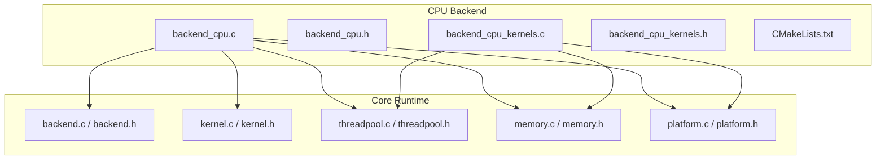
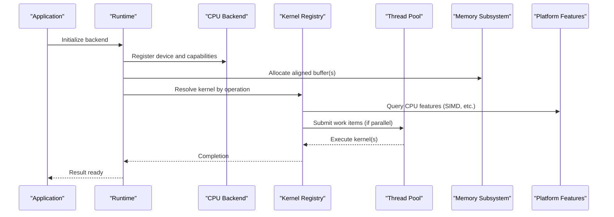
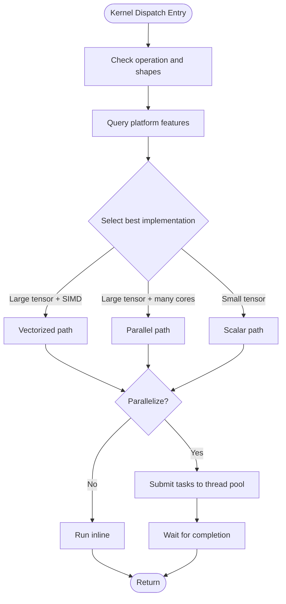
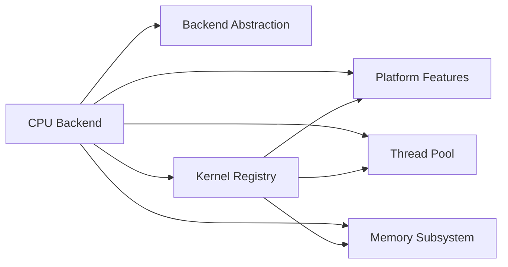

# CPU Backend Implementation

<cite>
**Referenced Files in This Document**
- [backend_cpu.c](file://backends/cpu/backend_cpu.c)
- [backend_cpu.h](file://backends/cpu/backend_cpu.h)
- [backend_cpu_kernels.c](file://backends/cpu/backend_cpu_kernels.c)
- [backend_cpu_kernels.h](file://backends/cpu/backend_cpu_kernels.h)
- [CMakeLists.txt](file://backends/cpu/CMakeLists.txt)
- [threadpool.c](file://src/threadpool/threadpool.c)
- [threadpool.h](file://src/threadpool/threadpool.h)
- [memory.c](file://src/memory/memory.c)
- [memory.h](file://src/memory/memory.h)
- [kernel.c](file://src/kernel/kernel.c)
- [kernel.h](file://src/kernel/kernel.h)
- [backend.c](file://src/backend/backend.c)
- [backend.h](file://src/backend/backend.h)
- [platform.c](file://src/platform/platform.c)
- [platform.h](file://src/platform/platform.h)
</cite>

## Table of Contents
1. [Introduction](#introduction)
2. [Project Structure](#project-structure)
3. [Core Components](#core-components)
4. [Architecture Overview](#architecture-overview)
5. [Detailed Component Analysis](#detailed-component-analysis)
6. [Dependency Analysis](#dependency-analysis)
7. [Performance Considerations](#performance-considerations)
8. [Troubleshooting Guide](#troubleshooting-guide)
9. [Conclusion](#conclusion)
10. [Appendices](#appendices)

## Introduction
This document explains the CPU backend implementation with a focus on optimized kernels, memory layout strategies, and vectorization techniques. It covers thread pool integration, SIMD optimizations, cache-aware algorithms, configuration parameters, compilation flags, and platform-specific optimizations. The goal is to make the material accessible to beginners while providing sufficient technical depth for experienced developers optimizing CPU performance.

## Project Structure
The CPU backend resides under backends/cpu and integrates with the core runtime via the backend abstraction layer. Key files include:
- Backend registration and device-level hooks
- Kernel dispatch and scheduling
- Optimized kernel implementations
- Build configuration for enabling features like SIMD and threading

**Diagram sources**
- [backend_cpu.c](file://backends/cpu/backend_cpu.c)
- [backend_cpu.h](file://backends/cpu/backend_cpu.h)
- [backend_cpu_kernels.c](file://backends/cpu/backend_cpu_kernels.c)
- [backend_cpu_kernels.h](file://backends/cpu/backend_cpu_kernels.h)
- [CMakeLists.txt](file://backends/cpu/CMakeLists.txt)
- [backend.c](file://src/backend/backend.c)
- [backend.h](file://src/backend/backend.h)
- [kernel.c](file://src/kernel/kernel.c)
- [kernel.h](file://src/kernel/kernel.h)
- [threadpool.c](file://src/threadpool/threadpool.c)
- [threadpool.h](file://src/threadpool/threadpool.h)
- [memory.c](file://src/memory/memory.c)
- [memory.h](file://src/memory/memory.h)
- [platform.c](file://src/platform/platform.c)
- [platform.h](file://src/platform/platform.h)

**Section sources**
- [backend_cpu.c](file://backends/cpu/backend_cpu.c)
- [backend_cpu.h](file://backends/cpu/backend_cpu.h)
- [backend_cpu_kernels.c](file://backends/cpu/backend_cpu_kernels.c)
- [backend_cpu_kernels.h](file://backends/cpu/backend_cpu_kernels.h)
- [CMakeLists.txt](file://backends/cpu/CMakeLists.txt)
- [backend.c](file://src/backend/backend.c)
- [backend.h](file://src/backend/backend.h)
- [kernel.c](file://src/kernel/kernel.c)
- [kernel.h](file://src/kernel/kernel.h)
- [threadpool.c](file://src/threadpool/threadpool.c)
- [threadpool.h](file://src/threadpool/threadpool.h)
- [memory.c](file://src/memory/memory.c)
- [memory.h](file://src/memory/memory.h)
- [platform.c](file://src/platform/platform.c)
- [platform.h](file://src/platform/platform.h)

## Core Components
- CPU backend entrypoint and registration: exposes device capabilities, memory allocation, and kernel dispatch to the runtime.
- Kernel registry and dispatch: maps operations to optimized CPU kernels with optional parallelism.
- Thread pool integration: uses the shared thread pool for multi-threaded execution.
- Memory subsystem integration: allocates aligned buffers and manages lifetimes through the core memory API.
- Platform feature detection: detects CPU features (e.g., SIMD extensions) and selects optimal code paths.

Key responsibilities:
- Provide a uniform interface for the runtime to enqueue and execute CPU kernels.
- Implement high-performance kernels leveraging vectorization and cache-friendly layouts.
- Expose configuration knobs for tuning parallelism and vectorization.

**Section sources**
- [backend_cpu.c](file://backends/cpu/backend_cpu.c)
- [backend_cpu.h](file://backends/cpu/backend_cpu.h)
- [backend_cpu_kernels.c](file://backends/cpu/backend_cpu_kernels.c)
- [backend_cpu_kernels.h](file://backends/cpu/backend_cpu_kernels.h)
- [threadpool.c](file://src/threadpool/threadpool.c)
- [threadpool.h](file://src/threadpool/threadpool.h)
- [memory.c](file://src/memory/memory.c)
- [memory.h](file://src/memory/memory.h)
- [platform.c](file://src/platform/platform.c)
- [platform.h](file://src/platform/platform.h)

## Architecture Overview
The CPU backend plugs into the runtime’s backend abstraction. The runtime calls into the CPU backend to allocate memory and dispatch kernels. Kernels may use the thread pool for parallelism and rely on platform feature detection to choose vectorized paths.

**Diagram sources**
- [backend_cpu.c](file://backends/cpu/backend_cpu.c)
- [backend_cpu_kernels.c](file://backends/cpu/backend_cpu_kernels.c)
- [threadpool.c](file://src/threadpool/threadpool.c)
- [memory.c](file://src/memory/memory.c)
- [platform.c](file://src/platform/platform.c)

## Detailed Component Analysis

### CPU Backend Registration and Device Interface
Responsibilities:
- Initialize the CPU device and expose capabilities such as supported data types, alignment requirements, and maximum parallelism.
- Provide memory allocation callbacks that integrate with the core memory subsystem.
- Register kernel handlers for supported operations.

Integration points:
- Backend abstraction layer for lifecycle management.
- Kernel registry for dispatching operations.
- Platform feature detection for runtime selection of vectorized paths.

Typical flow:
- On backend init, query platform features and set capability flags.
- Register memory allocation functions that request aligned buffers from the memory subsystem.
- Populate the kernel table mapping operations to CPU implementations.

**Section sources**
- [backend_cpu.c](file://backends/cpu/backend_cpu.c)
- [backend_cpu.h](file://backends/cpu/backend_cpu.h)
- [backend.c](file://src/backend/backend.c)
- [backend.h](file://src/backend/backend.h)
- [platform.c](file://src/platform/platform.c)
- [platform.h](file://src/platform/platform.h)

### Kernel Dispatch and Scheduling
Responsibilities:
- Resolve the appropriate kernel implementation based on operation type and input shapes.
- Choose between scalar, vectorized, or parallel variants depending on platform features and problem size.
- Schedule work across threads using the thread pool when beneficial.

Dispatch logic highlights:
- Feature gating: select SIMD-enabled kernels only if detected.
- Parallelism threshold: avoid overhead for small tensors; enable multi-threading for larger ones.
- Stride and layout checks: ensure contiguous or optimally laid-out buffers for vectorization.

**Diagram sources**
- [backend_cpu_kernels.c](file://backends/cpu/backend_cpu_kernels.c)
- [threadpool.c](file://src/threadpool/threadpool.c)
- [platform.c](file://src/platform/platform.c)

**Section sources**
- [backend_cpu_kernels.c](file://backends/cpu/backend_cpu_kernels.c)
- [backend_cpu_kernels.h](file://backends/cpu/backend_cpu_kernels.h)
- [threadpool.c](file://src/threadpool/threadpool.c)
- [threadpool.h](file://src/threadpool/threadpool.h)
- [platform.c](file://src/platform/platform.c)
- [platform.h](file://src/platform/platform.h)

### Optimized CPU Kernels and Vectorization Techniques
Focus areas:
- Data layout: prefer contiguous, aligned buffers to maximize throughput.
- Vectorization: use compiler intrinsics or auto-vectorization where possible.
- Loop tiling and blocking: improve cache locality for large matrices.
- Reductions and element-wise ops: leverage SIMD-friendly patterns.

Implementation patterns:
- Inner loops process multiple elements per iteration using vectors.
- Outer loops tile data to fit within L1/L2 caches.
- Conditional branches select specialized kernels based on shape and alignment.

Examples of kernel categories:
- Element-wise operations (add, mul, relu).
- Matrix multiply and GEMM-like routines with tiling.
- Reductions (sum, mean) with SIMD accumulation.

**Section sources**
- [backend_cpu_kernels.c](file://backends/cpu/backend_cpu_kernels.c)
- [backend_cpu_kernels.h](file://backends/cpu/backend_cpu_kernels.h)

### Memory Layout Strategies and Alignment
Goals:
- Ensure memory alignment required by SIMD instructions.
- Minimize fragmentation and improve prefetching.
- Use contiguous storage for primary dimensions.

Strategies:
- Request aligned allocations from the memory subsystem.
- Pad dimensions to multiples of vector width when needed.
- Prefer row-major or column-major consistently to match kernel expectations.

Integration:
- Allocation requests go through the core memory API with alignment hints.
- Kernels assume specific strides and alignment; mismatches trigger fallbacks.

**Section sources**
- [memory.c](file://src/memory/memory.c)
- [memory.h](file://src/memory/memory.h)
- [backend_cpu.c](file://backends/cpu/backend_cpu.c)

### Thread Pool Integration
Purpose:
- Distribute independent work across available CPU cores.
- Avoid excessive overhead by setting thresholds for parallelization.

Usage patterns:
- Split outer loops into chunks and submit to the thread pool.
- Use barriers or join semantics to synchronize results.
- Respect thread affinity and NUMA topology when available.

Configuration:
- Control number of worker threads via environment variables or config APIs.
- Tune chunk sizes to balance load and overhead.

**Section sources**
- [threadpool.c](file://src/threadpool/threadpool.c)
- [threadpool.h](file://src/threadpool/threadpool.h)
- [backend_cpu_kernels.c](file://backends/cpu/backend_cpu_kernels.c)

### Platform-Specific Optimizations and Feature Detection
Capabilities:
- Detect SIMD instruction sets (e.g., SSE, AVX, NEON) at runtime.
- Enable/disable code paths based on detected features.
- Adjust loop unrolling and vector widths accordingly.

Mechanism:
- Feature queries return boolean flags used to select kernels.
- Compile-time macros can enable additional paths guarded by runtime checks.

**Section sources**
- [platform.c](file://src/platform/platform.c)
- [platform.h](file://src/platform/platform.h)
- [backend_cpu_kernels.c](file://backends/cpu/backend_cpu_kernels.c)

## Dependency Analysis
The CPU backend depends on several core modules:
- Backend abstraction for lifecycle and registration.
- Kernel registry for operation-to-kernel mapping.
- Thread pool for parallel execution.
- Memory subsystem for aligned allocations.
- Platform module for CPU feature detection.

**Diagram sources**
- [backend_cpu.c](file://backends/cpu/backend_cpu.c)
- [backend.c](file://src/backend/backend.c)
- [kernel.c](file://src/kernel/kernel.c)
- [threadpool.c](file://src/threadpool/threadpool.c)
- [memory.c](file://src/memory/memory.c)
- [platform.c](file://src/platform/platform.c)

**Section sources**
- [backend_cpu.c](file://backends/cpu/backend_cpu.c)
- [backend.c](file://src/backend/backend.c)
- [kernel.c](file://src/kernel/kernel.c)
- [threadpool.c](file://src/threadpool/threadpool.c)
- [memory.c](file://src/memory/memory.c)
- [platform.c](file://src/platform/platform.c)

## Performance Considerations
- Vectorization:
  - Ensure inputs are contiguous and aligned to the vector width.
  - Prefer inner-loop vectorization and reduce branching inside hot paths.
- Cache awareness:
  - Tile large computations to fit working sets in L1/L2.
  - Reorder loops to access memory sequentially.
- Parallelism:
  - Set parallel thresholds to avoid overhead on small tensors.
  - Balance chunk sizes to minimize idle time and contention.
- Memory layout:
  - Maintain consistent strides and avoid unnecessary copies.
  - Pad dimensions to multiples of vector width when beneficial.
- Compiler options:
  - Enable auto-vectorization and link-time optimization.
  - Use architecture-specific flags to unlock advanced SIMD.

[No sources needed since this section provides general guidance]

## Troubleshooting Guide
Common issues and remedies:
- Misaligned buffers causing crashes or fallbacks:
  - Verify alignment requirements and adjust allocation strategy.
- Poor performance on large tensors:
  - Increase parallelism or tune chunk sizes; check thread pool capacity.
- Inconsistent results across platforms:
  - Confirm feature detection and ensure correct kernel selection.
- High latency on small operations:
  - Disable parallelism for small workloads to reduce overhead.

Diagnostic steps:
- Log feature detection results and selected kernel variant.
- Measure per-kernel timings and compare against expected vectorized paths.
- Validate memory strides and alignment before kernel invocation.

**Section sources**
- [platform.c](file://src/platform/platform.c)
- [threadpool.c](file://src/threadpool/threadpool.c)
- [memory.c](file://src/memory/memory.c)
- [backend_cpu_kernels.c](file://backends/cpu/backend_cpu_kernels.c)

## Conclusion
The CPU backend integrates tightly with the runtime to provide efficient, portable, and scalable computation. By combining aligned memory layouts, vectorized kernels, cache-aware algorithms, and controlled parallelism, it achieves strong performance across diverse hardware. Proper configuration and build flags further unlock platform-specific optimizations.

[No sources needed since this section summarizes without analyzing specific files]

## Appendices

### Configuration Parameters and Compilation Flags
- Environment variables:
  - Control thread pool size and parallel thresholds.
- Build-time options:
  - Enable SIMD support and architecture-specific optimizations.
  - Toggle debug logging for kernel selection and performance metrics.

Tuning tips:
- Start with conservative parallelism and increase gradually.
- Align data and pad dimensions to vector widths for best results.
- Profile with representative workloads to identify bottlenecks.

[No sources needed since this section provides general guidance]