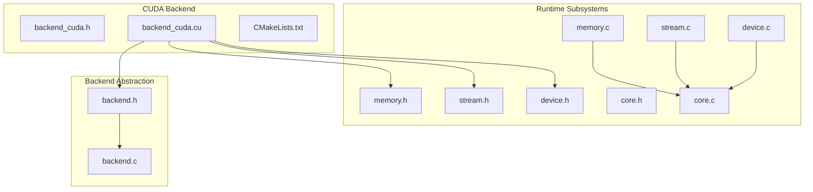
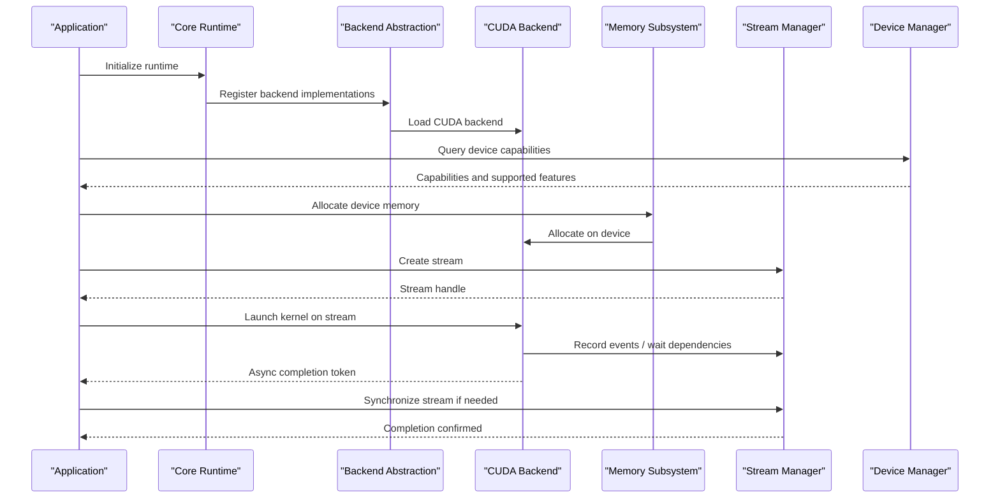
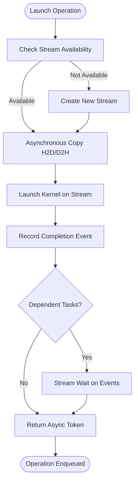
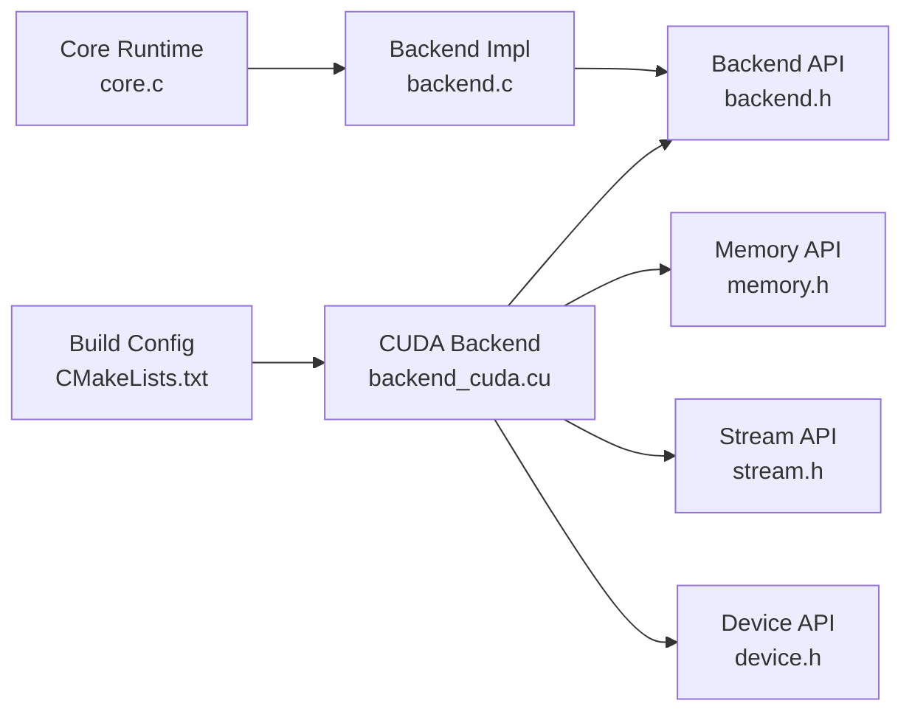

# CUDA Backend (GPU Acceleration)

<cite>
**Referenced Files in This Document**
- [backend_cuda.cu](file://backends/cuda/backend_cuda.cu)
- [backend_cuda.h](file://backends/cuda/backend_cuda.h)
- [CMakeLists.txt](file://backends/cuda/CMakeLists.txt)
- [backend.h](file://src/backend/backend.h)
- [backend.c](file://src/backend/backend.c)
- [memory.h](file://src/memory/memory.h)
- [memory.c](file://src/memory/memory.c)
- [stream.h](file://src/stream/stream.h)
- [stream.c](file://src/stream/stream.c)
- [device.h](file://src/device/device.h)
- [device.c](file://src/device/device.c)
- [core.h](file://src/core/core.h)
- [core.c](file://src/core/core.c)
</cite>

## Table of Contents
1. [Introduction](#introduction)
2. [Project Structure](#project-structure)
3. [Core Components](#core-components)
4. [Architecture Overview](#architecture-overview)
5. [Detailed Component Analysis](#detailed-component-analysis)
6. [Dependency Analysis](#dependency-analysis)
7. [Performance Considerations](#performance-considerations)
8. [Troubleshooting Guide](#troubleshooting-guide)
9. [Conclusion](#conclusion)
10. [Appendices](#appendices)

## Introduction
This document explains the CUDA backend GPU acceleration implementation within the project. It covers CUDA kernel development, device memory management, asynchronous execution patterns, context and stream handling, synchronization mechanisms, and integration with the core runtime and memory subsystems. It also provides guidance on CUDA toolkit requirements, compilation setup, GPU capability detection, debugging techniques, and performance profiling approaches. The content is designed to be accessible to developers new to GPU programming while offering sufficient depth for experienced CUDA developers.

## Project Structure
The CUDA backend resides under backends/cuda and integrates with the generic backend abstraction layer in src/backend. Memory, streams, devices, and core runtime are implemented in src/memory, src/stream, src/device, and src/core respectively. Build configuration for the CUDA backend is defined in backends/cuda/CMakeLists.txt.

**Diagram sources**
- [backend_cuda.h](file://backends/cuda/backend_cuda.h)
- [backend_cuda.cu](file://backends/cuda/backend_cuda.cu)
- [CMakeLists.txt](file://backends/cuda/CMakeLists.txt)
- [backend.h](file://src/backend/backend.h)
- [backend.c](file://src/backend/backend.c)
- [memory.h](file://src/memory/memory.h)
- [memory.c](file://src/memory/memory.c)
- [stream.h](file://src/stream/stream.h)
- [stream.c](file://src/stream/stream.c)
- [device.h](file://src/device/device.h)
- [device.c](file://src/device/device.c)
- [core.h](file://src/core/core.h)
- [core.c](file://src/core/core.c)

**Section sources**
- [backend_cuda.h](file://backends/cuda/backend_cuda.h)
- [backend_cuda.cu](file://backends/cuda/backend_cuda.cu)
- [CMakeLists.txt](file://backends/cuda/CMakeLists.txt)
- [backend.h](file://src/backend/backend.h)
- [backend.c](file://src/backend/backend.c)
- [memory.h](file://src/memory/memory.h)
- [memory.c](file://src/memory/memory.c)
- [stream.h](file://src/stream/stream.h)
- [stream.c](file://src/stream/stream.c)
- [device.h](file://src/device/device.h)
- [device.c](file://src/device/device.c)
- [core.h](file://src/core/core.h)
- [core.c](file://src/core/core.c)

## Core Components
- CUDA Backend Implementation: Provides device-specific operations such as memory allocation/deallocation, data transfers, kernel launches, and stream/context management. See [backend_cuda.cu](file://backends/cuda/backend_cuda.cu) and [backend_cuda.h](file://backends/cuda/backend_cuda.h).
- Backend Abstraction Layer: Defines a uniform interface that the CUDA backend implements, enabling pluggable backends. See [backend.h](file://src/backend/backend.h) and [backend.c](file://src/backend/backend.c).
- Memory Subsystem: Manages host and device memory lifecycles and exposes unified APIs used by backends. See [memory.h](file://src/memory/memory.h) and [memory.c](file://src/memory/memory.c).
- Stream and Execution Context: Encapsulates CUDA streams and synchronization primitives for asynchronous execution. See [stream.h](file://src/stream/stream.h) and [stream.c](file://src/stream/stream.c).
- Device Management: Handles device enumeration, capability queries, and selection. See [device.h](file://src/device/device.h) and [device.c](file://src/device/device.c).
- Core Runtime: Initializes and coordinates subsystems including backend registration and lifecycle management. See [core.h](file://src/core/core.h) and [core.c](file://src/core/core.c).

Key responsibilities:
- Kernel launch wrappers that map high-level operations to CUDA kernels.
- Asynchronous memory copies between host and device using streams.
- Synchronization points via events or stream waits where necessary.
- Capability checks to ensure required features are available.

**Section sources**
- [backend_cuda.cu](file://backends/cuda/backend_cuda.cu)
- [backend_cuda.h](file://backends/cuda/backend_cuda.h)
- [backend.h](file://src/backend/backend.h)
- [backend.c](file://src/backend/backend.c)
- [memory.h](file://src/memory/memory.h)
- [memory.c](file://src/memory/memory.c)
- [stream.h](file://src/stream/stream.h)
- [stream.c](file://src/stream/stream.c)
- [device.h](file://src/device/device.h)
- [device.c](file://src/device/device.c)
- [core.h](file://src/core/core.h)
- [core.c](file://src/core/core.c)

## Architecture Overview
The CUDA backend plugs into the backend abstraction layer and uses the memory and stream subsystems to perform device operations. The core runtime initializes the backend and registers it for use across the application.

**Diagram sources**
- [core.h](file://src/core/core.h)
- [core.c](file://src/core/core.c)
- [backend.h](file://src/backend/backend.h)
- [backend.c](file://src/backend/backend.c)
- [backend_cuda.h](file://backends/cuda/backend_cuda.h)
- [backend_cuda.cu](file://backends/cuda/backend_cuda.cu)
- [memory.h](file://src/memory/memory.h)
- [memory.c](file://src/memory/memory.c)
- [stream.h](file://src/stream/stream.h)
- [stream.c](file://src/stream/stream.c)
- [device.h](file://src/device/device.h)
- [device.c](file://src/device/device.c)

## Detailed Component Analysis

### CUDA Backend API Surface
The CUDA backend exposes functions aligned with the backend abstraction for device operations. Typical responsibilities include:
- Device initialization and capability checks
- Memory allocation and deallocation on the device
- Host-to-device and device-to-host transfers
- Kernel launch wrappers with grid/block configuration
- Stream creation, destruction, and synchronization
- Event recording and dependency management

Implementation references:
- [backend_cuda.h](file://backends/cuda/backend_cuda.h)
- [backend_cuda.cu](file://backends/cuda/backend_cuda.cu)

Integration with backend abstraction:
- [backend.h](file://src/backend/backend.h)
- [backend.c](file://src/backend/backend.c)

**Section sources**
- [backend_cuda.h](file://backends/cuda/backend_cuda.h)
- [backend_cuda.cu](file://backends/cuda/backend_cuda.cu)
- [backend.h](file://src/backend/backend.h)
- [backend.c](file://src/backend/backend.c)

### Kernel Development Patterns
Kernel development in this backend follows these patterns:
- Define kernels in .cu files and expose thin wrapper functions from the backend.
- Configure launch parameters (grid size, block size) based on tensor shapes and workload characteristics.
- Use shared memory where beneficial for data reuse within blocks.
- Employ coalesced memory access patterns for global memory operations.
- Leverage vectorized loads/stores when possible.

Example locations:
- Kernel definitions and launch wrappers: [backend_cuda.cu](file://backends/cuda/backend_cuda.cu)

Best practices:
- Validate input dimensions before launching kernels.
- Handle edge cases for non-aligned sizes and small tensors.
- Prefer constant memory for read-only parameters shared across threads.

**Section sources**
- [backend_cuda.cu](file://backends/cuda/backend_cuda.cu)

### Device Memory Management
The CUDA backend manages device memory through the memory subsystem:
- Allocation and deallocation calls are forwarded to CUDA device memory APIs.
- Zero-initialization may be requested depending on operation semantics.
- Alignment and capacity constraints are enforced at the backend level.

References:
- Memory API surface: [memory.h](file://src/memory/memory.h), [memory.c](file://src/memory/memory.c)
- Backend memory operations: [backend_cuda.cu](file://backends/cuda/backend_cuda.cu)

Data transfer operations:
- Host-to-device and device-to-host copies are performed asynchronously using streams.
- Synchronization can be achieved via stream synchronization or CUDA events.

References:
- Stream-based transfers: [stream.h](file://src/stream/stream.h), [stream.c](file://src/stream/stream.c)
- Transfer calls in backend: [backend_cuda.cu](file://backends/cuda/backend_cuda.cu)

**Section sources**
- [memory.h](file://src/memory/memory.h)
- [memory.c](file://src/memory/memory.c)
- [backend_cuda.cu](file://backends/cuda/backend_cuda.cu)
- [stream.h](file://src/stream/stream.h)
- [stream.c](file://src/stream/stream.c)

### Streams, Contexts, and Synchronization
Streams provide asynchronous execution contexts:
- Create and destroy streams per task or pipeline stage.
- Record events to mark completion and establish dependencies.
- Use stream waits to enforce ordering without blocking the host unnecessarily.

Synchronization mechanisms:
- Stream synchronize for strict ordering when required.
- Event-based synchronization for fine-grained control.
- Optional peer-to-peer transfers if supported by devices.

References:
- Stream API: [stream.h](file://src/stream/stream.h), [stream.c](file://src/stream/stream.c)
- Backend stream usage: [backend_cuda.cu](file://backends/cuda/backend_cuda.cu)

**Diagram sources**
- [stream.h](file://src/stream/stream.h)
- [stream.c](file://src/stream/stream.c)
- [backend_cuda.cu](file://backends/cuda/backend_cuda.cu)

**Section sources**
- [stream.h](file://src/stream/stream.h)
- [stream.c](file://src/stream/stream.c)
- [backend_cuda.cu](file://backends/cuda/backend_cuda.cu)

### Device Capability Detection and Selection
Capability detection ensures the selected device supports required features:
- Query compute capability and memory limits.
- Verify support for specific instructions or features used by kernels.
- Select an appropriate device index based on policy or user preference.

References:
- Device API: [device.h](file://src/device/device.h), [device.c](file://src/device/device.c)
- Backend capability checks: [backend_cuda.cu](file://backends/cuda/backend_cuda.cu)

**Section sources**
- [device.h](file://src/device/device.h)
- [device.c](file://src/device/device.c)
- [backend_cuda.cu](file://backends/cuda/backend_cuda.cu)

### Integration with Core Runtime
The core runtime initializes subsystems and registers backend implementations:
- Backend registration occurs during runtime startup.
- Core coordinates device selection and memory/stream lifecycle.
- Error propagation and logging are centralized through core utilities.

References:
- Core API: [core.h](file://src/core/core.h), [core.c](file://src/core/core.c)
- Backend registration: [backend.h](file://src/backend/backend.h), [backend.c](file://src/backend/backend.c)

**Section sources**
- [core.h](file://src/core/core.h)
- [core.c](file://src/core/core.c)
- [backend.h](file://src/backend/backend.h)
- [backend.c](file://src/backend/backend.c)

## Dependency Analysis
The CUDA backend depends on the backend abstraction, memory, stream, and device subsystems. The build system configures CUDA compilation flags and links against the CUDA runtime.

**Diagram sources**
- [backend_cuda.cu](file://backends/cuda/backend_cuda.cu)
- [backend.h](file://src/backend/backend.h)
- [backend.c](file://src/backend/backend.c)
- [memory.h](file://src/memory/memory.h)
- [stream.h](file://src/stream/stream.h)
- [device.h](file://src/device/device.h)
- [core.c](file://src/core/core.c)
- [CMakeLists.txt](file://backends/cuda/CMakeLists.txt)

**Section sources**
- [backend_cuda.cu](file://backends/cuda/backend_cuda.cu)
- [backend.h](file://src/backend/backend.h)
- [backend.c](file://src/backend/backend.c)
- [memory.h](file://src/memory/memory.h)
- [stream.h](file://src/stream/stream.h)
- [device.h](file://src/device/device.h)
- [core.c](file://src/core/core.c)
- [CMakeLists.txt](file://backends/cuda/CMakeLists.txt)

## Performance Considerations
- Coalesced memory access: Ensure contiguous memory accesses in kernels to maximize bandwidth utilization.
- Shared memory tiling: Reuse data within blocks to reduce global memory traffic.
- Vectorized I/O: Use 128-bit or wider loads/stores where supported.
- Occupancy tuning: Adjust block sizes to balance register usage and occupancy.
- Asynchronous pipelines: Overlap computation and data transfers using multiple streams.
- Event-driven scheduling: Use CUDA events to minimize host-side synchronization overhead.
- Avoid unnecessary synchronizations: Batch operations and defer sync until results are needed.
- Profile hotspots: Use NVIDIA Nsight Systems/Compute to identify bottlenecks.

[No sources needed since this section provides general guidance]

## Troubleshooting Guide
Common issues and remedies:
- Out-of-memory errors: Reduce batch sizes, enable memory pooling, or verify alignment constraints.
- Illegal memory access: Validate indices and bounds in kernels; check for misaligned pointers.
- Stream ordering bugs: Use events to enforce dependencies; avoid implicit synchronizations.
- Capability mismatches: Ensure target device meets minimum compute capability; fall back gracefully.
- Compilation failures: Confirm CUDA toolkit installation and correct CMake settings.

Debugging techniques:
- cuda-memcheck for memory errors.
- nsys/nsight systems for timeline analysis.
- Print device properties and kernel launch configurations for diagnostics.

References:
- Backend error paths and logs: [backend_cuda.cu](file://backends/cuda/backend_cuda.cu)
- Stream and event usage: [stream.h](file://src/stream/stream.h), [stream.c](file://src/stream/stream.c)
- Device capability checks: [device.h](file://src/device/device.h), [device.c](file://src/device/device.c)

**Section sources**
- [backend_cuda.cu](file://backends/cuda/backend_cuda.cu)
- [stream.h](file://src/stream/stream.h)
- [stream.c](file://src/stream/stream.c)
- [device.h](file://src/device/device.h)
- [device.c](file://src/device/device.c)

## Conclusion
The CUDA backend integrates tightly with the backend abstraction, memory, stream, and device subsystems to deliver efficient GPU acceleration. By following the outlined patterns for kernel development, memory management, asynchronous execution, and synchronization, developers can implement robust and high-performance GPU workloads. Proper capability detection and careful profiling ensure reliable deployment across diverse hardware configurations.

[No sources needed since this section summarizes without analyzing specific files]

## Appendices

### CUDA Toolkit Requirements and Compilation Setup
- Install a compatible CUDA toolkit version supporting the target device’s compute capability.
- Configure CMake to locate CUDA compiler and libraries; ensure backends/cuda/CMakeLists.txt sets appropriate flags.
- Enable CUDA language support and link against cudart and other required libraries.

References:
- Build configuration: [CMakeLists.txt](file://backends/cuda/CMakeLists.txt)

**Section sources**
- [CMakeLists.txt](file://backends/cuda/CMakeLists.txt)

### Unified Memory Access Notes
- Unified memory can simplify data movement but may incur overhead; prefer explicit allocations and transfers for predictable performance.
- If using unified memory, pin host pages and manage page migration carefully.

References:
- Memory subsystem: [memory.h](file://src/memory/memory.h), [memory.c](file://src/memory/memory.c)
- Backend memory ops: [backend_cuda.cu](file://backends/cuda/backend_cuda.cu)

**Section sources**
- [memory.h](file://src/memory/memory.h)
- [memory.c](file://src/memory/memory.c)
- [backend_cuda.cu](file://backends/cuda/backend_cuda.cu)