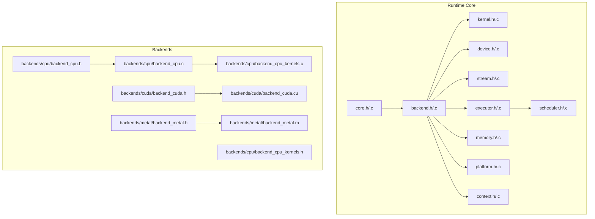
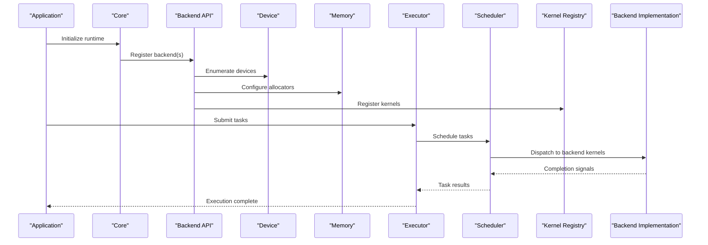
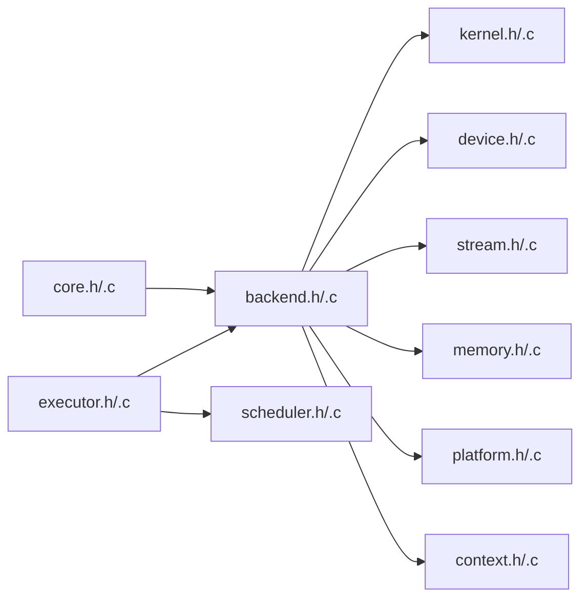

# Custom Backend Development Guide

<cite>
**Referenced Files in This Document**
- [backend.h](file://src/backend/backend.h)
- [backend.c](file://src/backend/backend.c)
- [backend_internal.h](file://src/backend/backend_internal.h)
- [backend_test.c](file://src/backend/backend_test.c)
- [kernel.h](file://src/kernel/kernel.h)
- [kernel.c](file://src/kernel/kernel.c)
- [kernel_internal.h](file://src/kernel/kernel_internal.h)
- [memory.h](file://src/memory/memory.h)
- [memory.c](file://src/memory/memory.c)
- [device.h](file://src/device/device.h)
- [device.c](file://src/device/device.c)
- [stream.h](file://src/stream/stream.h)
- [stream.c](file://src/stream/stream.c)
- [executor.h](file://src/executor/executor.h)
- [executor.c](file://src/executor/executor.c)
- [scheduler.h](file://src/scheduler/scheduler.h)
- [scheduler.c](file://src/scheduler/scheduler.c)
- [platform.h](file://src/platform/platform.h)
- [platform.c](file://src/platform/platform.c)
- [context.h](file://src/context/context.h)
- [context.c](file://src/context/context.c)
- [core.h](file://src/core/core.h)
- [core.c](file://src/core/core.c)
- [backend_cpu.h](file://backends/cpu/backend_cpu.h)
- [backend_cpu.c](file://backends/cpu/backend_cpu.c)
- [backend_cpu_kernels.h](file://backends/cpu/backend_cpu_kernels.h)
- [backend_cpu_kernels.c](file://backends/cpu/backend_cpu_kernels.c)
- [backend_cuda.h](file://backends/cuda/backend_cuda.h)
- [backend_cuda.cu](file://backends/cuda/backend_cuda.cu)
- [backend_metal.h](file://backends/metal/backend_metal.h)
- [backend_metal.m](file://backends/metal/backend_metal.m)
- [CMakeLists.txt](file://backends/CMakeLists.txt)
- [CMakeLists.txt](file://backends/cpu/CMakeLists.txt)
- [README.md](file://README.md)
</cite>

## Table of Contents
1. [Introduction](#introduction)
2. [Project Structure](#project-structure)
3. [Core Components](#core-components)
4. [Architecture Overview](#architecture-overview)
5. [Detailed Component Analysis](#detailed-component-analysis)
6. [Dependency Analysis](#dependency-analysis)
7. [Performance Considerations](#performance-considerations)
8. [Troubleshooting Guide](#troubleshooting-guide)
9. [Conclusion](#conclusion)
10. [Appendices](#appendices)

## Introduction
This guide explains how to develop custom backends for Hummingbird, including the backend interface specification, kernel registration patterns, lifecycle management, memory allocation strategies, and integration with third-party libraries. It provides step-by-step instructions for implementing hardware accelerators, optimizing performance, testing procedures, best practices for error handling and resource cleanup, cross-platform considerations, debugging techniques, and contribution guidelines.

## Project Structure
The repository organizes backend-related code under src/backend and includes reference implementations under backends (CPU, CUDA, Metal). The core runtime components such as device, stream, executor, scheduler, kernel registry, and memory are implemented in src.

**Diagram sources**
- [core.h](file://src/core/core.h)
- [core.c](file://src/core/core.c)
- [backend.h](file://src/backend/backend.h)
- [backend.c](file://src/backend/backend.c)
- [kernel.h](file://src/kernel/kernel.h)
- [kernel.c](file://src/kernel/kernel.c)
- [device.h](file://src/device/device.h)
- [device.c](file://src/device/device.c)
- [stream.h](file://src/stream/stream.h)
- [stream.c](file://src/stream/stream.c)
- [executor.h](file://src/executor/executor.h)
- [executor.c](file://src/executor/executor.c)
- [scheduler.h](file://src/scheduler/scheduler.h)
- [scheduler.c](file://src/scheduler/scheduler.c)
- [memory.h](file://src/memory/memory.h)
- [memory.c](file://src/memory/memory.c)
- [platform.h](file://src/platform/platform.h)
- [platform.c](file://src/platform/platform.c)
- [context.h](file://src/context/context.h)
- [context.c](file://src/context/context.c)
- [backend_cpu.h](file://backends/cpu/backend_cpu.h)
- [backend_cpu.c](file://backends/cpu/backend_cpu.c)
- [backend_cpu_kernels.h](file://backends/cpu/backend_cpu_kernels.h)
- [backend_cpu_kernels.c](file://backends/cpu/backend_cpu_kernels.c)
- [backend_cuda.h](file://backends/cuda/backend_cuda.h)
- [backend_cuda.cu](file://backends/cuda/backend_cuda.cu)
- [backend_metal.h](file://backends/metal/backend_metal.h)
- [backend_metal.m](file://backends/metal/backend_metal.m)

**Section sources**
- [README.md](file://README.md)

## Core Components
- Backend Interface: Defines the contract that each backend must implement, including initialization, device enumeration, kernel dispatch, memory operations, and lifecycle hooks.
- Kernel Registry: Provides operation registration and lookup mechanisms used by backends to expose kernels.
- Device and Stream: Abstractions for target devices and execution streams; backends typically bind their own device/stream implementations.
- Executor and Scheduler: Orchestrate task submission and scheduling across devices and threads.
- Memory Manager: Allocates and frees buffers on specific devices or host memory.
- Platform Utilities: Cross-platform helpers for threading, synchronization, and environment introspection.
- Context: Holds per-backend configuration and state.

Key responsibilities:
- Implement backend entry points and register kernels.
- Provide device-specific memory allocation and synchronization primitives.
- Expose a stable ABI for the runtime to discover and use your backend.

**Section sources**
- [backend.h](file://src/backend/backend.h)
- [backend.c](file://src/backend/backend.c)
- [backend_internal.h](file://src/backend/backend_internal.h)
- [kernel.h](file://src/kernel/kernel.h)
- [kernel.c](file://src/kernel/kernel.c)
- [kernel_internal.h](file://src/kernel/kernel_internal.h)
- [device.h](file://src/device/device.h)
- [device.c](file://src/device/device.c)
- [stream.h](file://src/stream/stream.h)
- [stream.c](file://src/stream/stream.c)
- [executor.h](file://src/executor/executor.h)
- [executor.c](file://src/executor/executor.c)
- [scheduler.h](file://src/scheduler/scheduler.h)
- [scheduler.c](file://src/scheduler/scheduler.c)
- [memory.h](file://src/memory/memory.h)
- [memory.c](file://src/memory/memory.c)
- [platform.h](file://src/platform/platform.h)
- [platform.c](file://src/platform/platform.c)
- [context.h](file://src/context/context.h)
- [context.c](file://src/context/context.c)

## Architecture Overview
The backend system follows a layered architecture:
- Runtime Core initializes and manages backends.
- Each backend implements device, stream, memory, and kernel dispatch.
- Kernels are registered via the kernel registry and invoked through the executor/scheduler pipeline.

**Diagram sources**
- [core.h](file://src/core/core.h)
- [core.c](file://src/core/core.c)
- [backend.h](file://src/backend/backend.h)
- [backend.c](file://src/backend/backend.c)
- [device.h](file://src/device/device.h)
- [device.c](file://src/device/device.c)
- [memory.h](file://src/memory/memory.h)
- [memory.c](file://src/memory/memory.c)
- [executor.h](file://src/executor/executor.h)
- [executor.c](file://src/executor/executor.c)
- [scheduler.h](file://src/scheduler/scheduler.h)
- [scheduler.c](file://src/scheduler/scheduler.c)
- [kernel.h](file://src/kernel/kernel.h)
- [kernel.c](file://src/kernel/kernel.c)

## Detailed Component Analysis

### Backend Interface Specification
A backend must provide:
- Initialization and shutdown routines.
- Device discovery and selection.
- Stream creation and synchronization.
- Memory allocation and deallocation.
- Kernel registration functions.
- Optional profiling and diagnostics hooks.

Lifecycle:
- Create backend instance.
- Initialize devices and resources.
- Register kernels.
- Execute workloads.
- Clean up resources and destroy backend.

Error handling:
- Return consistent error codes.
- Provide descriptive messages.
- Ensure partial failures do not leak resources.

Cross-platform:
- Use platform abstraction for threading and synchronization.
- Avoid OS-specific assumptions unless guarded by macros.

**Section sources**
- [backend.h](file://src/backend/backend.h)
- [backend.c](file://src/backend/backend.c)
- [backend_internal.h](file://src/backend/backend_internal.h)
- [platform.h](file://src/platform/platform.h)
- [platform.c](file://src/platform/platform.c)

### Kernel Registration and Operation Definition
Patterns:
- Define kernel descriptors with metadata (name, inputs, outputs, attributes).
- Register kernels at backend init time using the kernel registry.
- Implement dispatch logic that selects optimal kernel variants based on input shapes and types.

Best practices:
- Keep kernel signatures uniform.
- Validate inputs before dispatch.
- Log detailed errors for misconfiguration.

**Section sources**
- [kernel.h](file://src/kernel/kernel.h)
- [kernel.c](file://src/kernel/kernel.c)
- [kernel_internal.h](file://src/kernel/kernel_internal.h)

### Device and Stream Management
Responsibilities:
- Device: capabilities, limits, and device-local resources.
- Stream: ordered execution context, synchronization primitives, and async semantics.

Guidelines:
- Ensure stream ordering is respected across kernel calls.
- Provide explicit synchronization APIs when needed.
- Handle device resets and recovery gracefully.

**Section sources**
- [device.h](file://src/device/device.h)
- [device.c](file://src/device/device.c)
- [stream.h](file://src/stream/stream.h)
- [stream.c](file://src/stream/stream.c)

### Memory Allocation Strategies
Options:
- Host memory allocation.
- Device-local allocation.
- Pinned/host-accessible memory for DMA.
- Pooling and caching strategies to reduce overhead.

Recommendations:
- Align allocations to device requirements.
- Track allocation sizes and lifetimes.
- Provide zero-copy paths where possible.

**Section sources**
- [memory.h](file://src/memory/memory.h)
- [memory.c](file://src/memory/memory.c)

### Executor and Scheduler Integration
Flow:
- Application submits tasks to executor.
- Executor schedules tasks onto streams/devices.
- Scheduler coordinates concurrency and resource usage.
- Backend kernels execute asynchronously and signal completion.

Optimization tips:
- Batch small tasks.
- Overlap computation and data movement.
- Tune thread pool size per device.

**Section sources**
- [executor.h](file://src/executor/executor.h)
- [executor.c](file://src/executor/executor.c)
- [scheduler.h](file://src/scheduler/scheduler.h)
- [scheduler.c](file://src/scheduler/scheduler.c)

### Reference Backends

#### CPU Backend
- Implements host-based kernels and uses standard memory allocators.
- Demonstrates kernel registration and basic device/stream setup.

Implementation highlights:
- Backend entry points and registration.
- CPU kernel implementations and dispatch.

**Section sources**
- [backend_cpu.h](file://backends/cpu/backend_cpu.h)
- [backend_cpu.c](file://backends/cpu/backend_cpu.c)
- [backend_cpu_kernels.h](file://backends/cpu/backend_cpu_kernels.h)
- [backend_cpu_kernels.c](file://backends/cpu/backend_cpu_kernels.c)

#### CUDA Backend
- Integrates NVIDIA CUDA runtime for GPU acceleration.
- Shows device enumeration, memory management, and kernel launches.

Integration notes:
- Link against CUDA libraries.
- Manage CUDA contexts and streams.
- Handle device memory transfers.

**Section sources**
- [backend_cuda.h](file://backends/cuda/backend_cuda.h)
- [backend_cuda.cu](file://backends/cuda/backend_cuda.cu)

#### Metal Backend
- Integrates Apple Metal framework for macOS/iOS GPU acceleration.
- Demonstrates command queues, compute pipelines, and buffer management.

Integration notes:
- Use Metal headers and frameworks.
- Manage MTLCommandQueue and MTLBuffer lifecycles.

**Section sources**
- [backend_metal.h](file://backends/metal/backend_metal.h)
- [backend_metal.m](file://backends/metal/backend_metal.m)

### Minimal Backend Implementation Steps
1. Create a new backend module with header and source files.
2. Implement backend initialization and shutdown.
3. Implement device enumeration and selection.
4. Implement stream creation and synchronization.
5. Implement memory allocation/deallocation.
6. Register kernels via the kernel registry during init.
7. Build and link your backend into the project.
8. Add tests to validate correctness and performance.

Build integration:
- Update backends build configuration to include your module.

**Section sources**
- [CMakeLists.txt](file://backends/CMakeLists.txt)
- [CMakeLists.txt](file://backends/cpu/CMakeLists.txt)

### Testing Procedures
- Unit tests for backend initialization and device enumeration.
- Kernel-level tests validating numerical accuracy.
- End-to-end tests exercising executor/scheduler flows.
- Stress tests for memory pressure and concurrency.

Use existing test patterns from the CPU backend and core backend tests as references.

**Section sources**
- [backend_test.c](file://src/backend/backend_test.c)
- [backend_cpu_kernels_test.c](file://backends/cpu/backend_cpu_kernels_test.c)
- [backend_cpu_test.c](file://backends/cpu/backend_cpu_test.c)

### Error Handling and Resource Cleanup
- Always check return codes from device and memory APIs.
- On failure, release any partially allocated resources.
- Provide clear error messages and stack traces where available.
- Use RAII-like patterns or explicit cleanup functions.

**Section sources**
- [backend.h](file://src/backend/backend.h)
- [backend.c](file://src/backend/backend.c)
- [memory.h](file://src/memory/memory.h)
- [memory.c](file://src/memory/memory.c)

### Cross-Platform Compatibility
- Use platform abstractions for threading and synchronization.
- Guard platform-specific code with compile-time macros.
- Avoid hard-coded paths and OS-specific features.

**Section sources**
- [platform.h](file://src/platform/platform.h)
- [platform.c](file://src/platform/platform.c)

## Dependency Analysis
The following diagram shows key dependencies between backend and runtime components.

**Diagram sources**
- [core.h](file://src/core/core.h)
- [core.c](file://src/core/core.c)
- [backend.h](file://src/backend/backend.h)
- [backend.c](file://src/backend/backend.c)
- [kernel.h](file://src/kernel/kernel.h)
- [kernel.c](file://src/kernel/kernel.c)
- [device.h](file://src/device/device.h)
- [device.c](file://src/device/device.c)
- [stream.h](file://src/stream/stream.h)
- [stream.c](file://src/stream/stream.c)
- [memory.h](file://src/memory/memory.h)
- [memory.c](file://src/memory/memory.c)
- [platform.h](file://src/platform/platform.h)
- [platform.c](file://src/platform/platform.c)
- [context.h](file://src/context/context.h)
- [context.c](file://src/context/context.c)
- [executor.h](file://src/executor/executor.h)
- [executor.c](file://src/executor/executor.c)
- [scheduler.h](file://src/scheduler/scheduler.h)
- [scheduler.c](file://src/scheduler/scheduler.c)

**Section sources**
- [backend.h](file://src/backend/backend.h)
- [backend.c](file://src/backend/backend.c)
- [kernel.h](file://src/kernel/kernel.h)
- [kernel.c](file://src/kernel/kernel.c)
- [device.h](file://src/device/device.h)
- [device.c](file://src/device/device.c)
- [stream.h](file://src/stream/stream.h)
- [stream.c](file://src/stream/stream.c)
- [memory.h](file://src/memory/memory.h)
- [memory.c](file://src/memory/memory.c)
- [platform.h](file://src/platform/platform.h)
- [platform.c](file://src/platform/platform.c)
- [context.h](file://src/context/context.h)
- [context.c](file://src/context/context.c)
- [executor.h](file://src/executor/executor.h)
- [executor.c](file://src/executor/executor.c)
- [scheduler.h](file://src/scheduler/scheduler.h)
- [scheduler.c](file://src/scheduler/scheduler.c)

## Performance Considerations
- Minimize memory copies; prefer device-local buffers and zero-copy paths.
- Batch operations to reduce kernel launch overhead.
- Tune thread pool sizes and stream concurrency per device.
- Profile hotspots using built-in profilers or external tools.
- Validate numerical accuracy across different input shapes and types.

[No sources needed since this section provides general guidance]

## Troubleshooting Guide
Common issues:
- Kernel registration failures: verify descriptor fields and uniqueness.
- Memory leaks: ensure all allocations have corresponding frees and handle early exits.
- Deadlocks: review stream ordering and synchronization points.
- Platform-specific crashes: isolate with minimal reproductions and enable verbose logging.

Debugging techniques:
- Enable detailed logging around backend init and kernel dispatch.
- Use unit tests to isolate failing components.
- Employ sanitizers and memory debuggers during development.

**Section sources**
- [backend_test.c](file://src/backend/backend_test.c)
- [backend.h](file://src/backend/backend.h)
- [backend.c](file://src/backend/backend.c)

## Conclusion
Implementing a custom backend involves adhering to the backend interface, registering kernels, managing devices and streams, and integrating with the executor/scheduler pipeline. Follow the provided patterns, leverage reference backends, and rigorously test for correctness and performance. Maintain clean error handling, resource cleanup, and cross-platform compatibility to ensure robustness and ease of contribution.

[No sources needed since this section summarizes without analyzing specific files]

## Appendices

### Step-by-Step: Implementing a Custom Hardware Accelerator
1. Define backend entry points and configuration structures.
2. Implement device enumeration and capability queries.
3. Implement stream creation and synchronization.
4. Implement memory allocation aligned to accelerator requirements.
5. Register kernels with the kernel registry during backend init.
6. Integrate with executor/scheduler by submitting tasks to streams.
7. Build and link your backend; add it to the backends build configuration.
8. Write unit and integration tests; validate performance with benchmarks.

**Section sources**
- [backend.h](file://src/backend/backend.h)
- [backend.c](file://src/backend/backend.c)
- [kernel.h](file://src/kernel/kernel.h)
- [kernel.c](file://src/kernel/kernel.c)
- [device.h](file://src/device/device.h)
- [device.c](file://src/device/device.c)
- [stream.h](file://src/stream/stream.h)
- [stream.c](file://src/stream/stream.c)
- [memory.h](file://src/memory/memory.h)
- [memory.c](file://src/memory/memory.c)
- [executor.h](file://src/executor/executor.h)
- [executor.c](file://src/executor/executor.c)
- [scheduler.h](file://src/scheduler/scheduler.h)
- [scheduler.c](file://src/scheduler/scheduler.c)
- [CMakeLists.txt](file://backends/CMakeLists.txt)

### Integrating Third-Party Libraries
- Choose stable APIs and version pinning.
- Wrap library calls behind backend interfaces.
- Handle library initialization and teardown within backend lifecycle.
- Provide fallbacks or graceful degradation if unavailable.

[No sources needed since this section provides general guidance]

### Contributing Backends to the Main Repository
- Follow coding standards and formatting rules.
- Include comprehensive tests and documentation.
- Update build configurations to include your backend.
- Ensure cross-platform builds pass.
- Submit pull requests with clear descriptions and benchmark results.

[No sources needed since this section provides general guidance]