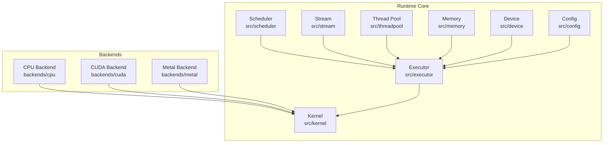
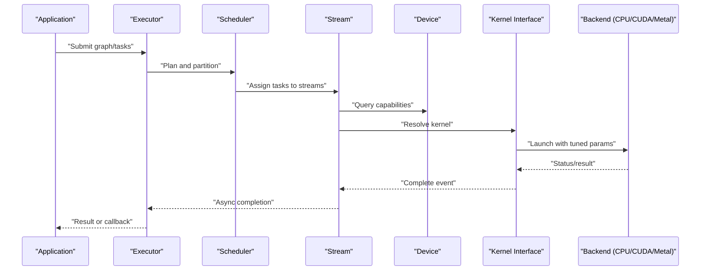
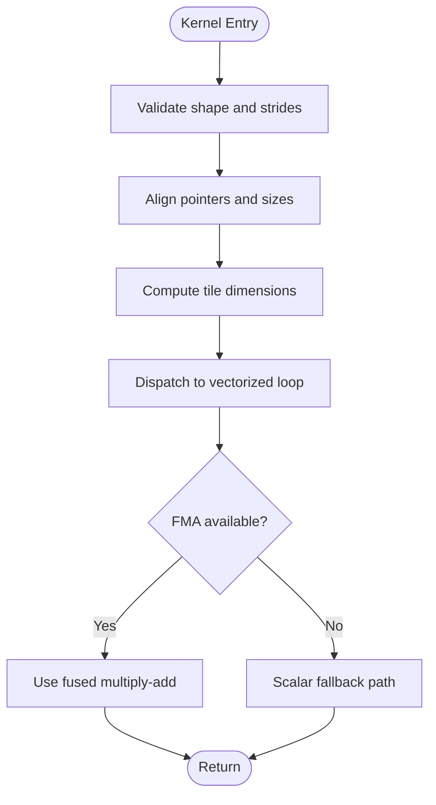
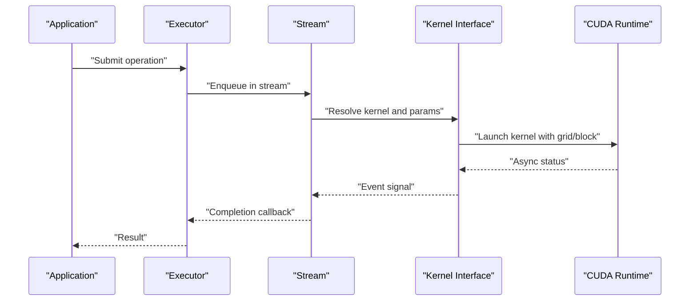
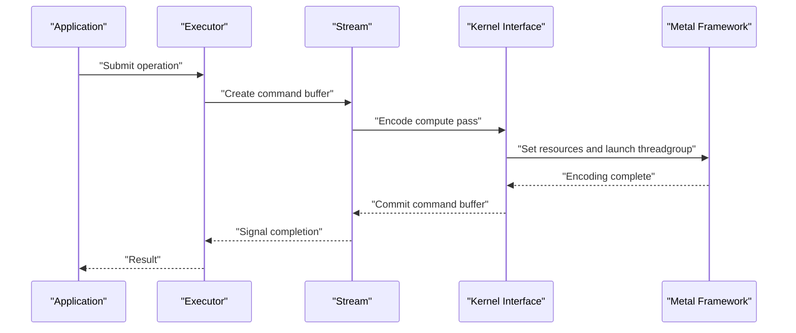
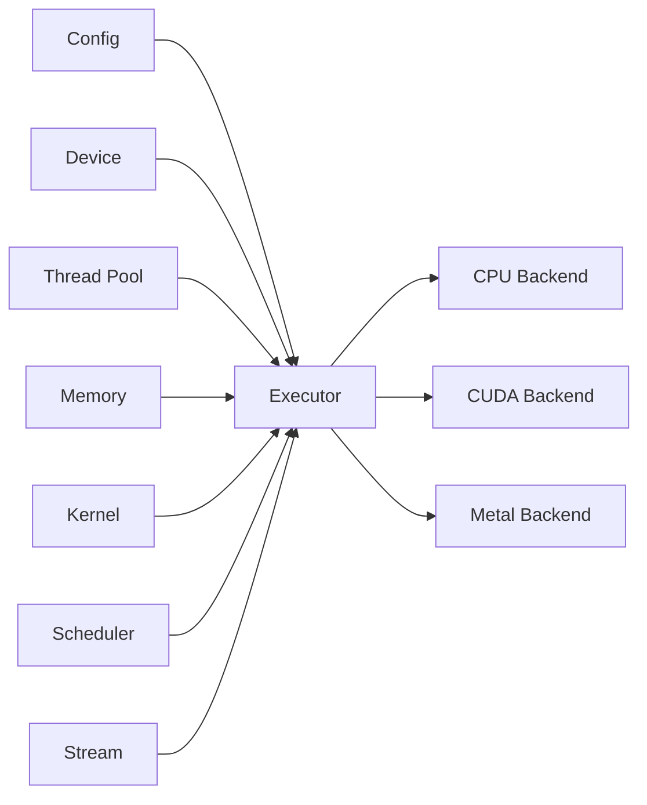

# Hardware-Specific Tuning

<cite>
**Referenced Files in This Document**
- [backend_cpu.c](file://backends/cpu/backend_cpu.c)
- [backend_cpu.h](file://backends/cpu/backend_cpu.h)
- [backend_cpu_kernels.c](file://backends/cpu/backend_cpu_kernels.c)
- [backend_cpu_kernels.h](file://backends/cpu/backend_cpu_kernels.h)
- [backend_cuda.cu](file://backends/cuda/backend_cuda.cu)
- [backend_cuda.h](file://backends/cuda/backend_cuda.h)
- [backend_metal.m](file://backends/metal/backend_metal.m)
- [backend_metal.h](file://backends/metal/backend_metal.h)
- [CMakeLists.txt](file://backends/CMakeLists.txt)
- [config.c](file://src/config/config.c)
- [config.h](file://src/config/config.h)
- [device.c](file://src/device/device.c)
- [device.h](file://src/device/device.h)
- [threadpool.c](file://src/threadpool/threadpool.c)
- [threadpool.h](file://src/threadpool/threadpool.h)
- [memory.c](file://src/memory/memory.c)
- [memory.h](file://src/memory/memory.h)
- [platform.c](file://src/platform/platform.c)
- [platform.h](file://src/platform/platform.h)
- [kernel.c](file://src/kernel/kernel.c)
- [kernel.h](file://src/kernel/kernel.h)
- [executor.c](file://src/executor/executor.c)
- [executor.h](file://src/executor/executor.h)
- [scheduler.c](file://src/scheduler/scheduler.c)
- [scheduler.h](file://src/scheduler/scheduler.h)
- [stream.c](file://src/stream/stream.c)
- [stream.h](file://src/stream/stream.h)
</cite>

## Table of Contents
1. [Introduction](#introduction)
2. [Project Structure](#project-structure)
3. [Core Components](#core-components)
4. [Architecture Overview](#architecture-overview)
5. [Detailed Component Analysis](#detailed-component-analysis)
6. [Dependency Analysis](#dependency-analysis)
7. [Performance Considerations](#performance-considerations)
8. [Troubleshooting Guide](#troubleshooting-guide)
9. [Conclusion](#conclusion)
10. [Appendices](#appendices)

## Introduction
This document provides a comprehensive guide to hardware-specific tuning across CPU, CUDA GPU, and Metal backends. It focuses on backend-specific optimization parameters, threading configurations, memory alignment requirements, and utilization of platform features. The guidance includes practical examples for tuning performance on diverse deployment scenarios ranging from embedded devices to high-performance servers, along with cross-platform considerations and strategies for performance portability.

## Project Structure
The project organizes hardware backends under the backends directory, with separate implementations for CPU, CUDA, and Metal. Core runtime subsystems (configuration, device discovery, thread pool, memory management, kernel execution, scheduling, and streams) reside under src. Build configuration for backends is centralized in CMake files.

**Diagram sources**
- [CMakeLists.txt](file://backends/CMakeLists.txt)
- [backend_cpu.c](file://backends/cpu/backend_cpu.c)
- [backend_cuda.cu](file://backends/cuda/backend_cuda.cu)
- [backend_metal.m](file://backends/metal/backend_metal.m)
- [config.c](file://src/config/config.c)
- [device.c](file://src/device/device.c)
- [threadpool.c](file://src/threadpool/threadpool.c)
- [memory.c](file://src/memory/memory.c)
- [kernel.c](file://src/kernel/kernel.c)
- [executor.c](file://src/executor/executor.c)
- [scheduler.c](file://src/scheduler/scheduler.c)
- [stream.c](file://src/stream/stream.c)

**Section sources**
- [CMakeLists.txt](file://backends/CMakeLists.txt)
- [backend_cpu.c](file://backends/cpu/backend_cpu.c)
- [backend_cuda.cu](file://backends/cuda/backend_cuda.cu)
- [backend_metal.m](file://backends/metal/backend_metal.m)
- [config.c](file://src/config/config.c)
- [device.c](file://src/device/device.c)
- [threadpool.c](file://src/threadpool/threadpool.c)
- [memory.c](file://src/memory/memory.c)
- [kernel.c](file://src/kernel/kernel.c)
- [executor.c](file://src/executor/executor.c)
- [scheduler.c](file://src/scheduler/scheduler.c)
- [stream.c](file://src/stream/stream.c)

## Core Components
- Configuration: Centralized settings that influence backend behavior, including threading and memory options.
- Device abstraction: Provides capabilities and constraints per backend (e.g., compute units, memory limits).
- Thread pool: Controls parallelism for CPU workloads and dispatch coordination.
- Memory manager: Handles allocation policies, alignment, and reuse strategies.
- Kernel interface: Abstracts kernel registration and invocation across backends.
- Executor and scheduler: Orchestrate task graphs, stream ordering, and resource usage.
- Streams: Provide asynchronous execution contexts and synchronization points.

Key areas to tune:
- Threading: Number of worker threads, affinity, and batching granularity.
- Memory: Alignment, buffer sizes, pooling, and reuse.
- Backends: Vectorization flags, SIMD width, launch grid/block sizing, and queue depth.
- Scheduling: Task partitioning, overlap between compute and data movement, and stream concurrency.

**Section sources**
- [config.c](file://src/config/config.c)
- [config.h](file://src/config/config.h)
- [device.c](file://src/device/device.c)
- [device.h](file://src/device/device.h)
- [threadpool.c](file://src/threadpool/threadpool.c)
- [threadpool.h](file://src/threadpool/threadpool.h)
- [memory.c](file://src/memory/memory.c)
- [memory.h](file://src/memory/memory.h)
- [kernel.c](file://src/kernel/kernel.c)
- [kernel.h](file://src/kernel/kernel.h)
- [executor.c](file://src/executor/executor.c)
- [executor.h](file://src/executor/executor.h)
- [scheduler.c](file://src/scheduler/scheduler.c)
- [scheduler.h](file://src/scheduler/scheduler.h)
- [stream.c](file://src/stream/stream.c)
- [stream.h](file://src/stream/stream.h)

## Architecture Overview
The system exposes a unified API while delegating execution to backend-specific kernels. The executor coordinates tasks via the scheduler, which partitions work into streams. Each backend implements its own kernel launch and memory semantics.

**Diagram sources**
- [executor.c](file://src/executor/executor.c)
- [scheduler.c](file://src/scheduler/scheduler.c)
- [stream.c](file://src/stream/stream.c)
- [device.c](file://src/device/device.c)
- [kernel.c](file://src/kernel/kernel.c)
- [backend_cpu.c](file://backends/cpu/backend_cpu.c)
- [backend_cuda.cu](file://backends/cuda/backend_cuda.cu)
- [backend_metal.m](file://backends/metal/backend_metal.m)

## Detailed Component Analysis

### CPU Backend Tuning
Focus areas:
- Threading: Configure thread pool size based on physical cores; consider NUMA locality and hyperthreading.
- Vectorization: Enable compiler vectorization flags and choose optimal SIMD width for the target ISA.
- Memory alignment: Ensure buffers are aligned to cache line boundaries and preferred alignment for SIMD loads/stores.
- Kernel tiling: Tune tile sizes to maximize L1/L2 hit rates and minimize overhead.

Practical tips:
- Set thread count equal to physical cores for latency-sensitive workloads; increase moderately for throughput-bound jobs.
- Align allocations to at least 64 bytes; prefer larger multiples for wide SIMD.
- Use block sizes that fit within L1/L2 caches; measure with profiling tools.
- Prefer contiguous layouts and avoid strided access patterns where possible.

**Section sources**
- [backend_cpu.c](file://backends/cpu/backend_cpu.c)
- [backend_cpu.h](file://backends/cpu/backend_cpu.h)
- [backend_cpu_kernels.c](file://backends/cpu/backend_cpu_kernels.c)
- [backend_cpu_kernels.h](file://backends/cpu/backend_cpu_kernels.h)
- [threadpool.c](file://src/threadpool/threadpool.c)
- [threadpool.h](file://src/threadpool/threadpool.h)
- [memory.c](file://src/memory/memory.c)
- [memory.h](file://src/memory/memory.h)

#### CPU Kernel Launch Flow

**Diagram sources**
- [backend_cpu_kernels.c](file://backends/cpu/backend_cpu_kernels.c)
- [backend_cpu_kernels.h](file://backends/cpu/backend_cpu_kernels.h)

### CUDA Backend Tuning
Focus areas:
- Grid/block sizing: Choose block dimensions that match warp size and occupancy targets; tune grid stride for large tensors.
- Memory coalescing: Ensure contiguous memory access patterns and proper alignment to 128-byte boundaries when beneficial.
- Shared memory: Use shared memory for reductions and sliding windows; manage bank conflicts.
- Streams and events: Overlap compute and data transfers using multiple streams; synchronize only when necessary.
- Compiler flags: Enable appropriate PTX/SASS optimizations and math precision modes.

Practical tips:
- Target occupancy by adjusting block size and register usage; profile with NVIDIA tools.
- Coalesce global memory accesses; pad arrays if needed to improve bandwidth utilization.
- Reuse pinned host memory for faster PCIe transfers.
- Batch small kernels to reduce launch overhead.

**Section sources**
- [backend_cuda.cu](file://backends/cuda/backend_cuda.cu)
- [backend_cuda.h](file://backends/cuda/backend_cuda.h)
- [stream.c](file://src/stream/stream.c)
- [stream.h](file://src/stream/stream.h)
- [memory.c](file://src/memory/memory.c)
- [memory.h](file://src/memory/memory.h)

#### CUDA Kernel Launch Sequence

**Diagram sources**
- [backend_cuda.cu](file://backends/cuda/backend_cuda.cu)
- [stream.c](file://src/stream/stream.c)
- [kernel.c](file://src/kernel/kernel.c)
- [executor.c](file://src/executor/executor.c)

### Metal Backend Tuning
Focus areas:
- Command buffers and queues: Batch commands efficiently; use concurrent render/compute queues where applicable.
- MTLBuffer alignment and storage types: Choose shared vs. private storage based on access patterns; ensure alignment for SIMD-like operations.
- Threadgroup sizing: Tune threadgroup dimensions to match GPU architecture and occupancy goals.
- Resource reuse: Recycle buffers and pipelines to reduce allocation overhead.

Practical tips:
- Minimize command buffer flushes; group related operations.
- Prefer constant buffers for uniform parameters.
- Profile with Xcode Instruments to identify bottlenecks in compute stages.

**Section sources**
- [backend_metal.m](file://backends/metal/backend_metal.m)
- [backend_metal.h](file://backends/metal/backend_metal.h)
- [stream.c](file://src/stream/stream.c)
- [memory.c](file://src/memory/memory.c)
- [memory.h](file://src/memory/memory.h)

#### Metal Command Buffer Flow

**Diagram sources**
- [backend_metal.m](file://backends/metal/backend_metal.m)
- [stream.c](file://src/stream/stream.c)
- [kernel.c](file://src/kernel/kernel.c)
- [executor.c](file://src/executor/executor.c)

### Cross-Platform Considerations
- Capability detection: Query device properties (cores, memory, supported features) to select optimal paths.
- Feature gates: Compile-time and runtime checks to enable/disable vectorization, atomics, or specific intrinsics.
- Portability layer: Abstract differences in memory models, alignment, and synchronization primitives.
- Benchmark-driven selection: Use lightweight benchmarks to pick best parameters at runtime.

**Section sources**
- [platform.c](file://src/platform/platform.c)
- [platform.h](file://src/platform/platform.h)
- [device.c](file://src/device/device.c)
- [device.h](file://src/device/device.h)

## Dependency Analysis
The following diagram shows key dependencies among core modules and backends.

**Diagram sources**
- [config.c](file://src/config/config.c)
- [device.c](file://src/device/device.c)
- [threadpool.c](file://src/threadpool/threadpool.c)
- [memory.c](file://src/memory/memory.c)
- [kernel.c](file://src/kernel/kernel.c)
- [executor.c](file://src/executor/executor.c)
- [scheduler.c](file://src/scheduler/scheduler.c)
- [stream.c](file://src/stream/stream.c)
- [backend_cpu.c](file://backends/cpu/backend_cpu.c)
- [backend_cuda.cu](file://backends/cuda/backend_cuda.cu)
- [backend_metal.m](file://backends/metal/backend_metal.m)

**Section sources**
- [config.c](file://src/config/config.c)
- [device.c](file://src/device/device.c)
- [threadpool.c](file://src/threadpool/threadpool.c)
- [memory.c](file://src/memory/memory.c)
- [kernel.c](file://src/kernel/kernel.c)
- [executor.c](file://src/executor/executor.c)
- [scheduler.c](file://src/scheduler/scheduler.c)
- [stream.c](file://src/stream/stream.c)
- [backend_cpu.c](file://backends/cpu/backend_cpu.c)
- [backend_cuda.cu](file://backends/cuda/backend_cuda.cu)
- [backend_metal.m](file://backends/metal/backend_metal.m)

## Performance Considerations
- CPU:
  - Match thread pool size to physical cores; consider NUMA-aware placement.
  - Align buffers to cache-line boundaries; prefer contiguous memory layouts.
  - Tune tile sizes to exploit L1/L2 caches; leverage vectorized instructions when available.
- CUDA:
  - Optimize block/grid dimensions for occupancy; coalesce memory accesses.
  - Use shared memory judiciously; avoid bank conflicts.
  - Employ streams and events to overlap compute and transfers; reuse pinned memory.
- Metal:
  - Batch commands into fewer, larger command buffers; recycle resources.
  - Choose appropriate storage types and alignments; tune threadgroup sizes.
- General:
  - Profile before and after changes; measure both latency and throughput.
  - Use capability detection to adapt parameters per device.
  - Keep a small benchmark suite to validate regressions across platforms.

[No sources needed since this section provides general guidance]

## Troubleshooting Guide
Common issues and remedies:
- Misaligned memory:
  - Symptom: Crashes or degraded performance on vectorized paths.
  - Action: Verify alignment requirements and adjust allocation strategy.
- Underutilized CPU cores:
  - Symptom: Low utilization despite heavy workload.
  - Action: Increase thread pool size; check affinity and oversubscription.
- CUDA launch failures:
  - Symptom: Errors during kernel launch or low occupancy.
  - Action: Validate grid/block sizes; check memory coalescing; review register usage.
- Metal encoding errors:
  - Symptom: Failures when creating or committing command buffers.
  - Action: Ensure resources are valid and properly retained; batch commands carefully.
- Stream ordering problems:
  - Symptom: Incorrect results due to unsynchronized dependencies.
  - Action: Insert explicit synchronization points; verify event signaling.

**Section sources**
- [memory.c](file://src/memory/memory.c)
- [threadpool.c](file://src/threadpool/threadpool.c)
- [backend_cuda.cu](file://backends/cuda/backend_cuda.cu)
- [backend_metal.m](file://backends/metal/backend_metal.m)
- [stream.c](file://src/stream/stream.c)

## Conclusion
Effective hardware-specific tuning requires understanding each backend’s strengths and constraints. For CPU, focus on threading, alignment, and vectorization; for CUDA, emphasize occupancy, memory coalescing, and stream concurrency; for Metal, prioritize command batching and resource reuse. Combine capability detection, benchmarking, and careful parameter selection to achieve robust performance across diverse deployments.

[No sources needed since this section summarizes without analyzing specific files]

## Appendices

### Practical Configuration Examples
- Embedded CPU:
  - Reduce thread pool size to physical cores; disable aggressive vectorization if power-constrained.
  - Favor smaller tiles to fit L1 cache; minimize memory footprint.
- Desktop CPU:
  - Use all logical cores; enable vectorization and FMA; align buffers to 64+ bytes.
  - Increase batch sizes to amortize overhead.
- High-performance server (CUDA):
  - Maximize occupancy; coalesce memory; use multiple streams; pin host memory.
  - Tune block sizes per kernel; leverage shared memory for reductions.
- Apple Silicon (Metal):
  - Batch commands; reuse buffers and pipelines; tune threadgroup sizes per model.
  - Profile with Instruments to balance compute and memory bandwidth.

[No sources needed since this section provides general guidance]