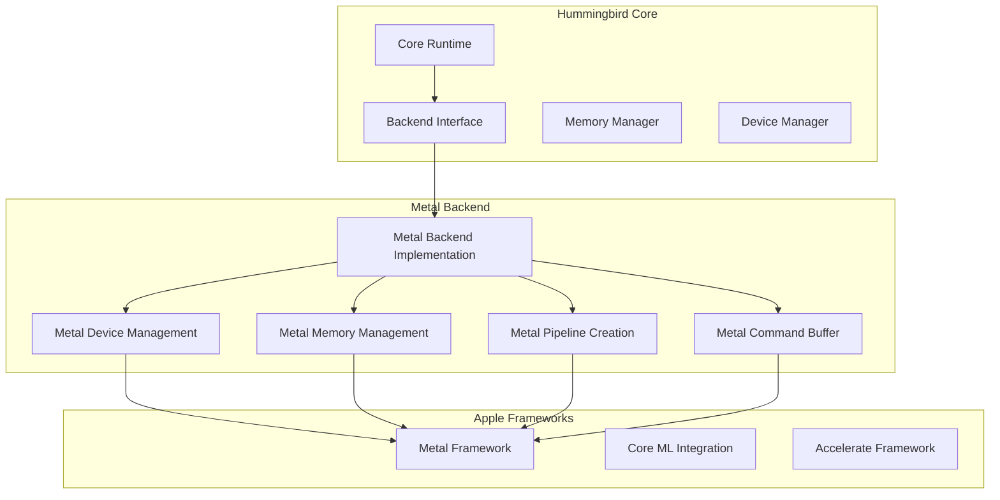
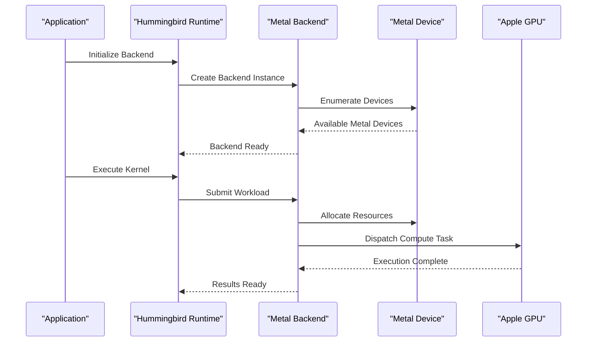
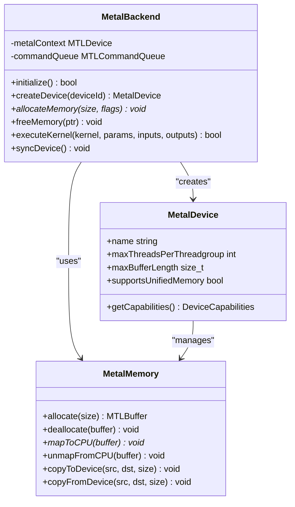
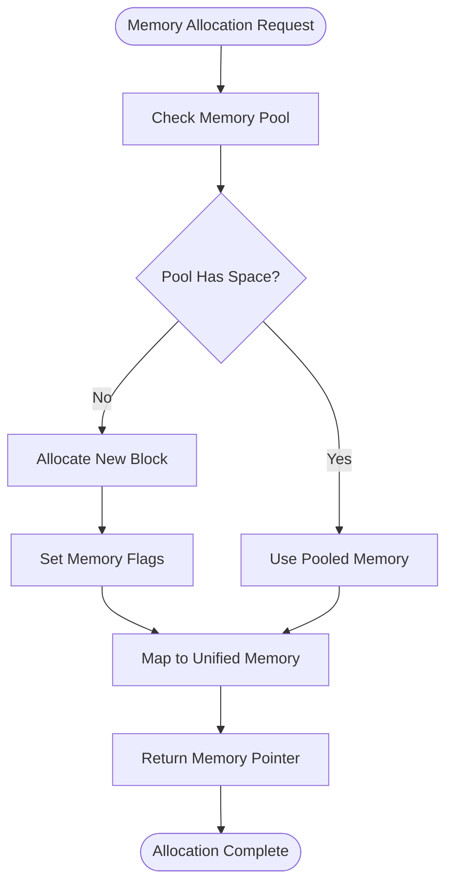
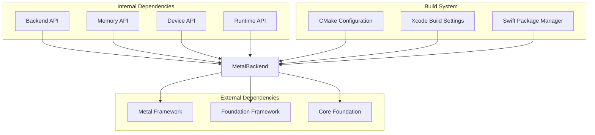

# Metal Backend (Apple GPU)

<cite>
**Referenced Files in This Document**
- [backend_metal.h](file://backends/metal/backend_metal.h)
- [backend_metal.m](file://backends/metal/backend_metal.m)
- [CMakeLists.txt](file://backends/metal/CMakeLists.txt)
- [backend.h](file://src/backend/backend.h)
- [backend.c](file://src/backend/backend.c)
- [memory.h](file://src/memory/memory.h)
- [device.h](file://src/device/device.h)
- [runtime.h](file://src/runtime/runtime.h)
</cite>

## Table of Contents
1. [Introduction](#introduction)
2. [Project Structure](#project-structure)
3. [Core Components](#core-components)
4. [Architecture Overview](#architecture-overview)
5. [Detailed Component Analysis](#detailed-component-analysis)
6. [Dependency Analysis](#dependency-analysis)
7. [Performance Considerations](#performance-considerations)
8. [Troubleshooting Guide](#troubleshooting-guide)
9. [Conclusion](#conclusion)
10. [Appendices](#appendices)

## Introduction

The Metal backend provides Apple GPU acceleration capabilities for the Hummingbird machine learning runtime. This implementation leverages Apple's Metal framework to enable high-performance parallel computing on iOS and macOS devices. The backend integrates seamlessly with Hummingbird's core architecture while providing optimized execution paths for tensor operations on Apple GPUs.

Metal is Apple's low-level graphics and compute API that exposes the full power of Apple Silicon GPUs. By implementing a Metal backend, Hummingbird can achieve significant performance improvements for neural network inference and training workloads on iPhone, iPad, Mac, and other Apple platforms.

## Project Structure

The Metal backend follows Hummingbird's modular backend architecture, implementing the standard backend interface while providing Metal-specific optimizations and resource management.

**Diagram sources**
- [backend.h:1-50](file://src/backend/backend.h#L1-L50)
- [backend_metal.h:1-100](file://backends/metal/backend_metal.h#L1-L100)

**Section sources**
- [backend.h:1-100](file://src/backend/backend.h#L1-L100)
- [backend_metal.h:1-150](file://backends/metal/backend_metal.h#L1-L150)

## Core Components

The Metal backend consists of several key components that work together to provide efficient GPU acceleration:

### Backend Interface Implementation
The Metal backend implements Hummingbird's standard backend interface, providing device discovery, memory allocation, kernel execution, and resource management capabilities specific to Apple GPUs.

### Metal Device Management
Handles Metal device enumeration, capability detection, and context creation. Manages the lifecycle of Metal devices and ensures proper resource cleanup.

### Memory Management
Implements unified memory management between CPU and GPU, handling memory allocation, deallocation, and synchronization across the CPU-GPU boundary.

### Compute Pipeline Management
Creates and manages Metal compute pipelines, shader compilation, and kernel parameter binding for optimal GPU utilization.

### Command Buffer Management
Manages Metal command buffers for asynchronous GPU execution, ensuring proper ordering and synchronization of compute operations.

**Section sources**
- [backend_metal.h:50-200](file://backends/metal/backend_metal.h#L50-L200)
- [backend_metal.m:1-300](file://backends/metal/backend_metal.m#L1-L300)

## Architecture Overview

The Metal backend architecture follows a layered approach, abstracting Metal-specific details while providing a clean interface to the rest of the Hummingbird runtime.

**Diagram sources**
- [backend.c:1-100](file://src/backend/backend.c#L1-L100)
- [backend_metal.m:100-400](file://backends/metal/backend_metal.m#L100-L400)

## Detailed Component Analysis

### Metal Backend Interface

The Metal backend implements the complete backend interface required by Hummingbird, including device management, memory operations, and kernel execution.

#### Backend Registration and Initialization
The backend registers itself with Hummingbird's backend system during initialization, making it available for device selection and workload dispatch.

#### Device Discovery and Enumeration
Metal device discovery involves querying available Metal devices, checking their capabilities, and creating appropriate device contexts for each GPU.

#### Memory Allocation Strategy
The backend implements unified memory allocation, allowing seamless data sharing between CPU and GPU without explicit memory copies where possible.

**Diagram sources**
- [backend_metal.h:100-250](file://backends/metal/backend_metal.h#L100-L250)
- [backend_metal.m:200-500](file://backends/metal/backend_metal.m#L200-L500)

### Compute Pipeline Management

Compute pipeline management handles the creation, compilation, and caching of Metal compute shaders for optimal performance.

#### Shader Compilation and Caching
Metal shaders are compiled at runtime and cached to avoid repeated compilation overhead. The backend manages shader source files and compiled pipeline objects.

#### Pipeline Parameter Binding
Efficient parameter binding strategies minimize state changes between kernel executions, improving overall throughput.

#### Thread Group Optimization
Automatic thread group size optimization based on device capabilities and workload characteristics.

### Command Buffer Management

Command buffer management ensures efficient GPU utilization through proper batching and synchronization of compute operations.

#### Asynchronous Execution
Command buffers are submitted asynchronously to the GPU, allowing CPU and GPU operations to overlap effectively.

#### Synchronization Points
Strategic synchronization points ensure data consistency while minimizing CPU-GPU stalls.

#### Resource Lifetime Management
Automatic resource lifetime management prevents memory leaks and ensures proper cleanup of GPU resources.

**Section sources**
- [backend_metal.m:300-800](file://backends/metal/backend_metal.m#L300-L800)

### Memory Subsystem Integration

The Metal backend integrates deeply with Hummingbird's memory subsystem to provide efficient data sharing between CPU and GPU.

#### Unified Memory Access
On Apple Silicon, unified memory allows both CPU and GPU to access the same physical memory, eliminating explicit data copies.

#### Memory Pool Management
Efficient memory pooling reduces allocation overhead and improves memory utilization patterns.

#### Cache Coherency
Automatic cache coherency management ensures data consistency across CPU and GPU caches.

**Diagram sources**
- [memory.h:1-100](file://src/memory/memory.h#L1-L100)
- [backend_metal.m:500-700](file://backends/metal/backend_metal.m#L500-L700)

## Dependency Analysis

The Metal backend has well-defined dependencies on both internal Hummingbird components and external Apple frameworks.

**Diagram sources**
- [CMakeLists.txt:1-50](file://backends/metal/CMakeLists.txt#L1-L50)
- [backend.h:1-100](file://src/backend/backend.h#L1-L100)

**Section sources**
- [CMakeLists.txt:1-100](file://backends/metal/CMakeLists.txt#L1-L100)
- [backend.h:1-150](file://src/backend/backend.h#L1-L150)

## Performance Considerations

### Memory Bandwidth Optimization
- Utilize unified memory on Apple Silicon to eliminate unnecessary data transfers
- Implement memory coalescing patterns for optimal GPU memory access
- Use appropriate data types (float16 vs float32) based on precision requirements

### Compute Efficiency
- Optimize thread group sizes based on device capabilities
- Minimize state changes between kernel executions
- Batch multiple operations into single command buffers when possible

### Power Efficiency
- Leverage Apple's power management features for mobile devices
- Implement adaptive quality scaling based on thermal conditions
- Use efficient data layouts to reduce memory bandwidth usage

### Profiling and Debugging
- Integrate with Xcode Instruments for detailed performance analysis
- Use Metal System Trace for GPU timeline visualization
- Implement custom profiling hooks for application-specific metrics

## Troubleshooting Guide

### Common Issues and Solutions

#### Device Compatibility
- Verify Metal framework availability on target platform
- Check device capability requirements for specific features
- Handle gracefully when Metal is not available

#### Memory Issues
- Monitor memory usage patterns to prevent out-of-memory conditions
- Implement proper error handling for memory allocation failures
- Use memory debugging tools to identify leaks and corruption

#### Performance Problems
- Profile GPU utilization to identify bottlenecks
- Analyze memory bandwidth usage patterns
- Review shader complexity and optimize as needed

### Debugging Tools
- Xcode Metal Debugger for shader inspection
- Metal System Trace for GPU timeline analysis
- Instruments for real-time performance monitoring

**Section sources**
- [backend_metal.m:700-1000](file://backends/metal/backend_metal.m#L700-L1000)

## Conclusion

The Metal backend provides a robust foundation for Apple GPU acceleration within the Hummingbird runtime. By leveraging Apple's Metal framework and following best practices for GPU programming, the backend delivers significant performance improvements for machine learning workloads on Apple platforms.

The implementation demonstrates proper separation of concerns, efficient resource management, and integration with Hummingbird's core architecture. Future enhancements could include support for additional Metal features, improved shader compilation caching, and advanced optimization techniques.

## Appendices

### Metal Framework Requirements
- iOS 12.0+ or macOS 10.14+
- Metal framework availability check at runtime
- Graceful fallback to CPU backend when Metal unavailable

### Build Configuration
- CMake configuration for cross-platform builds
- Xcode project settings for native development
- Swift Package Manager compatibility

### Platform-Specific Considerations
- iOS memory constraints and power management
- macOS multi-GPU support and device selection
- Simulator limitations and testing strategies