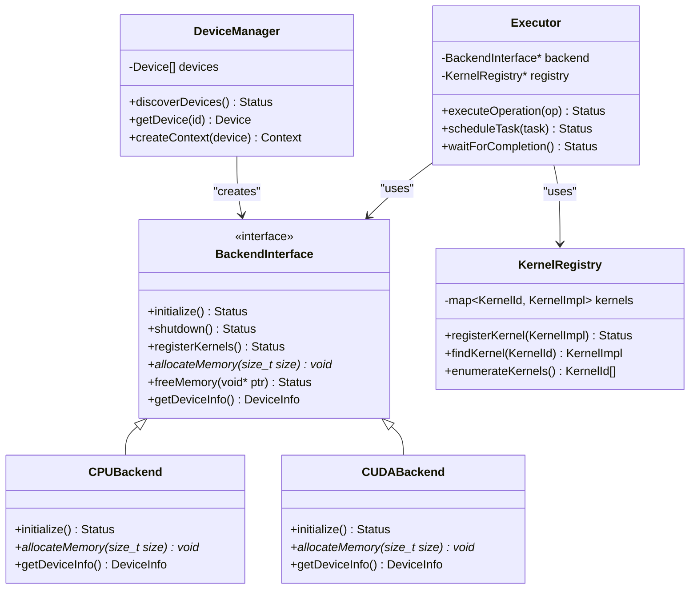
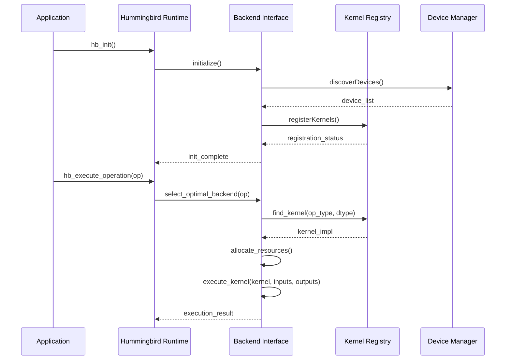
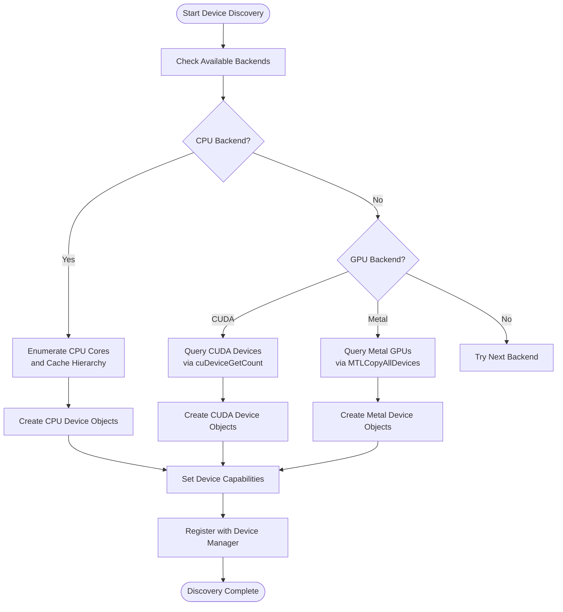
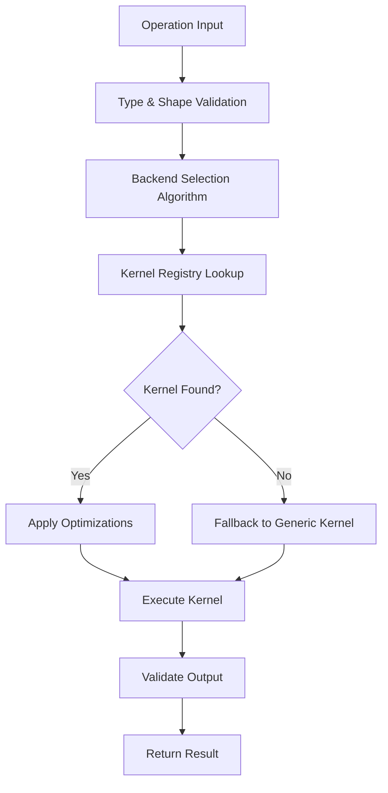
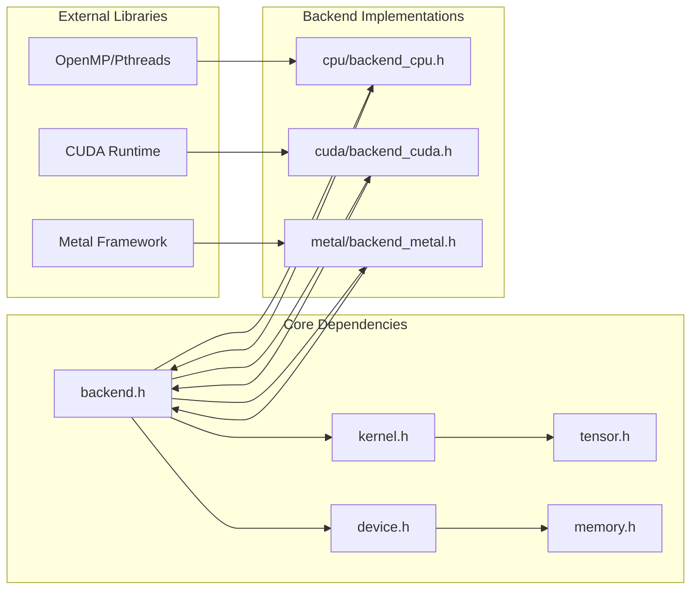

# Backend Architecture Overview

<cite>
**Referenced Files in This Document**
- [backend.h](file://src/backend/backend.h)
- [backend.c](file://src/backend/backend.c)
- [kernel.h](file://src/kernel/kernel.h)
- [kernel.c](file://src/kernel/kernel.c)
- [backend_cpu.h](file://backends/cpu/backend_cpu.h)
- [backend_cpu.c](file://backends/cpu/backend_cpu.c)
- [backend_cuda.h](file://backends/cuda/backend_cuda.h)
- [backend_metal.h](file://backends/metal/backend_metal.h)
- [device.h](file://src/device/device.h)
- [executor.h](file://src/executor/executor.h)
- [runtime.h](file://src/runtime/runtime.h)
</cite>

## Table of Contents
1. [Introduction](#introduction)
2. [Project Structure](#project-structure)
3. [Core Components](#core-components)
4. [Architecture Overview](#architecture-overview)
5. [Detailed Component Analysis](#detailed-component-analysis)
6. [Dependency Analysis](#dependency-analysis)
7. [Performance Considerations](#performance-considerations)
8. [Troubleshooting Guide](#troubleshooting-guide)
9. [Conclusion](#conclusion)

## Introduction

Hummingbird's backend architecture provides a flexible, pluggable framework for executing machine learning operations across diverse hardware platforms. The system implements a clean separation between the core runtime logic and hardware-specific implementations through well-defined interfaces and abstraction layers. This design enables seamless integration of new backends while maintaining consistent APIs for operation execution and resource management.

The architecture follows modern plugin-based principles where backends register themselves at runtime, kernels implement specific computational operations, and a sophisticated dispatch system routes operations to optimal hardware targets. This approach supports heterogeneous computing environments ranging from CPU-only systems to GPU-accelerated setups with multiple device types.

## Project Structure

The backend architecture spans multiple directories with clear separation of concerns:

```mermaid
graph TB
subgraph "Core Runtime"
A[src/backend/] --> B[src/kernel/]
A --> C[src/device/]
A --> D[src/executor/]
A --> E[src/runtime/]
end
subgraph "Hardware Backends"
F[backends/cpu/] --> G[CPU Implementation]
H[backends/cuda/] --> I[CUDA/GPU Implementation]
J[backends/metal/] --> K[Metal/Apple GPU Implementation]
end
subgraph "Public API"
L[include/hummingbird/] --> M[hummingbird.h]
L --> N[hummingbird_experimental.h]
end
Core Runtime --> Hardware Backends
Public API --> Core Runtime
```

**Diagram sources**
- [backend.h](file://src/backend/backend.h)
- [kernel.h](file://src/kernel/kernel.h)
- [backend_cpu.h](file://backends/cpu/backend_cpu.h)

**Section sources**
- [backend.h](file://src/backend/backend.h)
- [kernel.h](file://src/kernel/kernel.h)
- [backend_cpu.h](file://backends/cpu/backend_cpu.h)

## Core Components

### Backend Interface Abstraction

The backend interface defines the contract that all hardware implementations must follow. This abstraction layer ensures consistency across different hardware targets while allowing each backend to optimize for its specific capabilities.

Key responsibilities include:
- Device discovery and enumeration
- Memory allocation and management
- Kernel registration and lifecycle management
- Stream and context management
- Performance profiling hooks

### Kernel Registry System

The kernel registry provides a centralized mechanism for registering and discovering computational kernels. Each kernel represents a specific operation implementation optimized for particular data types and hardware characteristics.

The registry supports:
- Dynamic kernel loading and unloading
- Type-specific kernel selection
- Fallback mechanisms for unsupported operations
- Version compatibility checking

### Hardware Abstraction Layer (HAL)

The HAL provides uniform interfaces for hardware-specific operations including memory management, synchronization primitives, and device capabilities querying. This layer isolates the core runtime from platform-specific details.

**Section sources**
- [backend.h](file://src/backend/backend.h)
- [kernel.h](file://src/kernel/kernel.h)
- [device.h](file://src/device/device.h)

## Architecture Overview

The Hummingbird backend architecture follows a layered approach with clear separation between abstraction and implementation:



**Diagram sources**
- [backend.h](file://src/backend/backend.h)
- [kernel.h](file://src/kernel/kernel.h)
- [backend_cpu.h](file://backends/cpu/backend_cpu.h)
- [backend_cuda.h](file://backends/cuda/backend_cuda.h)

## Detailed Component Analysis

### Backend Lifecycle Management

The backend lifecycle encompasses initialization, registration, operation execution, and cleanup phases. Each backend must implement proper resource management and error handling throughout its lifetime.



**Diagram sources**
- [backend.c](file://src/backend/backend.c)
- [kernel.c](file://src/kernel/kernel.c)
- [device.h](file://src/device/device.h)

### Device Discovery Process

Device discovery involves enumerating available hardware resources and creating appropriate device objects. The process varies significantly between different backend implementations:



**Diagram sources**
- [device.h](file://src/device/device.h)
- [backend_cpu.h](file://backends/cpu/backend_cpu.h)
- [backend_cuda.h](file://backends/cuda/backend_cuda.h)
- [backend_metal.h](file://backends/metal/backend_metal.h)

### Resource Allocation Strategies

Resource allocation in Hummingbird follows a hierarchical strategy that considers both performance and memory efficiency:

1. **Per-Operation Allocation**: Small temporary buffers allocated per operation
2. **Per-Context Pooling**: Reusable memory pools within execution contexts
3. **Global Arena**: Large contiguous allocations for model weights and large tensors
4. **Device-Specific Optimizations**: Backend-specific allocation strategies (e.g., CUDA unified memory)

### Kernel Dispatch System

The kernel dispatch system provides efficient routing of operations to their optimal implementations:



**Diagram sources**
- [kernel.c](file://src/kernel/kernel.c)
- [backend.c](file://src/backend/backend.c)

### Operation Routing

Operation routing considers multiple factors when selecting the optimal backend and kernel implementation:

- **Data Type Compatibility**: Ensuring backend supports required precision formats
- **Shape Constraints**: Validating tensor dimensions against backend limitations
- **Performance Heuristics**: Using historical performance data for selection
- **Resource Availability**: Checking current memory and compute capacity
- **Power Constraints**: Considering thermal and power budgets on mobile devices

**Section sources**
- [backend.c](file://src/backend/backend.c)
- [kernel.c](file://src/kernel/kernel.c)
- [device.h](file://src/device/device.h)

## Dependency Analysis

The backend architecture maintains loose coupling through well-defined interfaces:



**Diagram sources**
- [backend.h](file://src/backend/backend.h)
- [kernel.h](file://src/kernel/kernel.h)
- [backend_cpu.h](file://backends/cpu/backend_cpu.h)
- [backend_cuda.h](file://backends/cuda/backend_cuda.h)
- [backend_metal.h](file://backends/metal/backend_metal.h)

**Section sources**
- [backend.h](file://src/backend/backend.h)
- [kernel.h](file://src/kernel/kernel.h)

## Performance Considerations

### Memory Management Optimization

- **Zero-Copy Operations**: Direct memory access between devices when possible
- **Memory Pooling**: Reducing allocation overhead through reusable buffers
- **Alignment Requirements**: Proper alignment for SIMD and vectorized operations
- **Cache-Friendly Layouts**: Data layout optimizations for target hardware

### Compute Optimization Patterns

- **Vectorization**: Utilizing SIMD instructions where available
- **Parallel Execution**: Multi-threaded kernel implementations
- **Asynchronous Operations**: Non-blocking execution for improved throughput
- **Batch Processing**: Grouping small operations for better utilization

### Backend-Specific Optimizations

Each backend implements hardware-specific optimizations:

- **CPU Backend**: OpenMP parallelization, AVX/SSE vectorization
- **CUDA Backend**: GPU kernel optimization, memory coalescing
- **Metal Backend**: GPU command buffer optimization, shader compilation

## Troubleshooting Guide

### Common Backend Issues

1. **Initialization Failures**: Check device availability and driver compatibility
2. **Memory Allocation Errors**: Verify sufficient memory and proper alignment
3. **Kernel Not Found**: Ensure proper kernel registration and type compatibility
4. **Performance Degradation**: Monitor resource usage and consider fallback strategies

### Debugging Techniques

- Enable verbose logging for backend operations
- Use profiling tools to identify bottlenecks
- Test with minimal reproduction cases
- Validate device capabilities before operation execution

**Section sources**
- [backend_test.c](file://src/backend/backend_test.c)
- [kernel_test.c](file://src/kernel/kernel_test.c)

## Conclusion

Hummingbird's backend architecture provides a robust foundation for multi-hardware machine learning execution. The pluggable design enables easy extension with new backends while maintaining consistent APIs and performance characteristics. The kernel registry system offers flexible operation routing, and the hardware abstraction layer ensures portability across diverse computing platforms.

For developers implementing custom backends, focus on proper resource management, comprehensive error handling, and thorough testing across different hardware configurations. The existing CPU, CUDA, and Metal backends serve as excellent reference implementations for understanding the expected patterns and conventions.

The architecture's modular design facilitates ongoing optimization and adaptation to emerging hardware technologies while preserving the stability and reliability of the core runtime system.