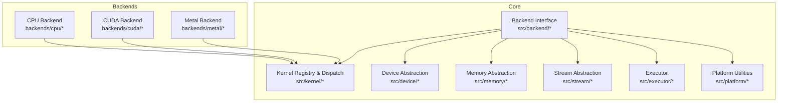
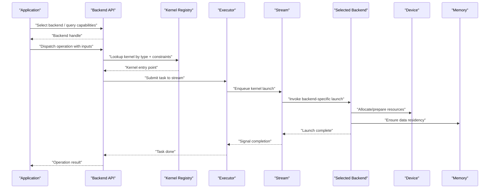
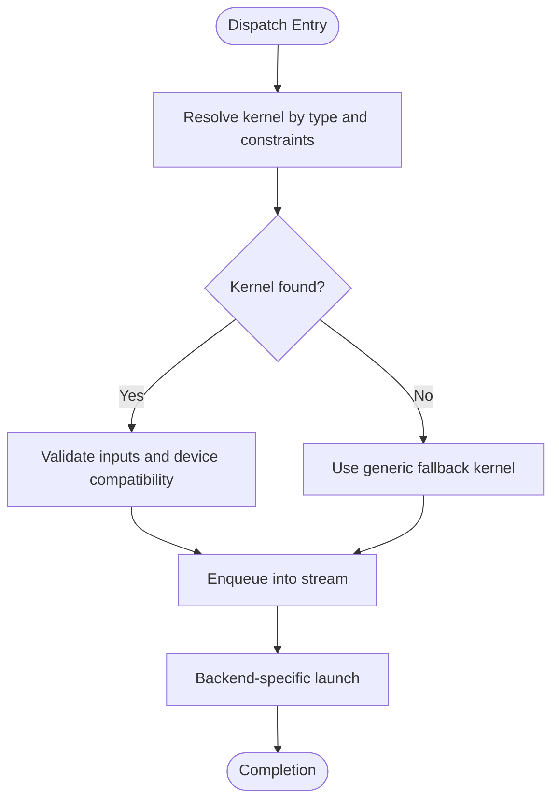
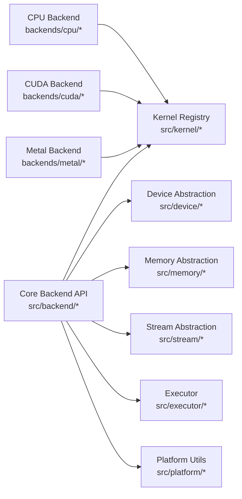

# Backend System

<cite>
**Referenced Files in This Document**
- [backend.h](file://src/backend/backend.h)
- [backend.c](file://src/backend/backend.c)
- [backend_internal.h](file://src/backend/backend_internal.h)
- [backend_test.c](file://src/backend/backend_test.c)
- [kernel.h](file://src/kernel/kernel.h)
- [kernel.c](file://src/kernel/kernel.c)
- [kernel_internal.h](file://src/kernel/kernel_internal.h)
- [kernel_test.c](file://src/kernel/kernel_test.c)
- [device.h](file://src/device/device.h)
- [device.c](file://src/device/device.c)
- [device_internal.h](file://src/device/device_internal.h)
- [executor.h](file://src/executor/executor.h)
- [executor.c](file://src/executor/executor.c)
- [executor_internal.h](file://src/executor/executor_internal.h)
- [stream.h](file://src/stream/stream.h)
- [stream.c](file://src/stream/stream.c)
- [memory.h](file://src/memory/memory.h)
- [memory.c](file://src/memory/memory.c)
- [platform.h](file://src/platform/platform.h)
- [platform.c](file://src/platform/platform.c)
- [CMakeLists.txt](file://backends/CMakeLists.txt)
- [backend_cpu.h](file://backends/cpu/backend_cpu.h)
- [backend_cpu.c](file://backends/cpu/backend_cpu.c)
- [backend_cpu_kernels.h](file://backends/cpu/backend_cpu_kernels.h)
- [backend_cpu_kernels.c](file://backends/cpu/backend_cpu_kernels.c)
- [backend_cuda.h](file://backends/cuda/backend_cuda.h)
- [backend_cuda.cu](file://backends/cuda/backend_cuda.cu)
- [backend_metal.h](file://backends/metal/backend_metal.h)
- [backend_metal.m](file://backends/metal/backend_metal.m)
</cite>

## Table of Contents
1. Introduction
2. Project Structure
3. Core Components
4. Architecture Overview
5. Detailed Component Analysis
6. Dependency Analysis
7. Performance Considerations
8. Troubleshooting Guide
9. Conclusion

## Introduction
This document explains Hummingbird’s backend system architecture with a focus on the pluggable backend design, kernel registry mechanism, and hardware-specific optimizations. It covers:
- The backend interface for creating custom backends
- Kernel registration and dispatch across CPU, CUDA (GPU), and Metal (Apple GPU) backends
- Practical examples for backend selection, configuration, and custom kernel development
- Performance optimization strategies and best practices

The terminology used aligns with the codebase: backend, kernel, dispatch, and acceleration.

## Project Structure
At a high level, the backend subsystem is composed of:
- A core backend abstraction layer that defines interfaces and runtime management
- A kernel registry and dispatch mechanism to select and execute optimized kernels
- Hardware-specific backend implementations (CPU, CUDA, Metal)
- Supporting infrastructure for device management, memory, streams, and execution context

**Diagram sources**
- [backend.h](file://src/backend/backend.h)
- [kernel.h](file://src/kernel/kernel.h)
- [device.h](file://src/device/device.h)
- [memory.h](file://src/memory/memory.h)
- [stream.h](file://src/stream/stream.h)
- [executor.h](file://src/executor/executor.h)
- [platform.h](file://src/platform/platform.h)
- [backend_cpu.h](file://backends/cpu/backend_cpu.h)
- [backend_cuda.h](file://backends/cuda/backend_cuda.h)
- [backend_metal.h](file://backends/metal/backend_metal.h)

**Section sources**
- [backend.h](file://src/backend/backend.h)
- [kernel.h](file://src/kernel/kernel.h)
- [device.h](file://src/device/device.h)
- [memory.h](file://src/memory/memory.h)
- [stream.h](file://src/stream/stream.h)
- [executor.h](file://src/executor/executor.h)
- [platform.h](file://src/platform/platform.h)
- [CMakeLists.txt](file://backends/CMakeLists.txt)

## Core Components
- Backend interface: Defines the contract for registering backends, querying capabilities, and invoking operations.
- Kernel registry: Provides registration and lookup of kernels by type and capability, enabling dispatch to the optimal implementation.
- Device abstraction: Encapsulates device properties and resource allocation semantics.
- Memory abstraction: Manages buffers and lifetimes across devices and backends.
- Stream abstraction: Models asynchronous execution contexts and ordering guarantees.
- Executor: Coordinates scheduling and dispatch of kernels within a stream and backend context.
- Platform utilities: Provide cross-platform helpers for initialization and feature detection.

These components together implement a pluggable backend design where new accelerators can be integrated without changing core logic.

**Section sources**
- [backend.h](file://src/backend/backend.h)
- [backend.c](file://src/backend/backend.c)
- [backend_internal.h](file://src/backend/backend_internal.h)
- [kernel.h](file://src/kernel/kernel.h)
- [kernel.c](file://src/kernel/kernel.c)
- [kernel_internal.h](file://src/kernel/kernel_internal.h)
- [device.h](file://src/device/device.h)
- [device.c](file://src/device/device.c)
- [device_internal.h](file://src/device/device_internal.h)
- [memory.h](file://src/memory/memory.h)
- [memory.c](file://src/memory/memory.c)
- [stream.h](file://src/stream/stream.h)
- [stream.c](file://src/stream/stream.c)
- [executor.h](file://src/executor/executor.h)
- [executor.c](file://src/executor/executor.c)
- [executor_internal.h](file://src/executor/executor_internal.h)
- [platform.h](file://src/platform/platform.h)
- [platform.c](file://src/platform/platform.c)

## Architecture Overview
The backend system follows a layered architecture:
- Application or higher-level modules request operations via the backend API.
- The backend selects an appropriate kernel from the registry based on device capabilities and input constraints.
- The executor schedules the kernel into a stream, which may run synchronously or asynchronously depending on backend support.
- Memory and device abstractions ensure data residency and lifetime are respected across backends.

**Diagram sources**
- [backend.h](file://src/backend/backend.h)
- [kernel.h](file://src/kernel/kernel.h)
- [executor.h](file://src/executor/executor.h)
- [stream.h](file://src/stream/stream.h)
- [device.h](file://src/device/device.h)
- [memory.h](file://src/memory/memory.h)

## Detailed Component Analysis

### Backend Interface and Pluggable Design
The backend interface exposes functions to:
- Initialize and finalize backends
- Query device and capability information
- Register and discover available backends
- Submit work through a unified API

Key responsibilities:
- Maintain a registry of backends and their capabilities
- Provide consistent error handling and status propagation
- Abstract differences between synchronous and asynchronous execution models

Implementation notes:
- Backend registration occurs at startup; each backend module registers itself with the core.
- Capability queries allow automatic selection of the most suitable backend for a given workload.

**Section sources**
- [backend.h](file://src/backend/backend.h)
- [backend.c](file://src/backend/backend.c)
- [backend_internal.h](file://src/backend/backend_internal.h)
- [backend_test.c](file://src/backend/backend_test.c)

### Kernel Registry and Dispatch Mechanism
The kernel registry provides:
- Registration of kernels by type and supported constraints (e.g., data types, shapes, device)
- Lookup and selection of the best matching kernel for a given operation
- Fallback mechanisms when no specialized kernel is available

Dispatch flow:
- The backend receives an operation request with typed inputs and constraints
- The registry resolves the optimal kernel implementation
- The executor enqueues the kernel into a stream for execution

**Diagram sources**
- [kernel.h](file://src/kernel/kernel.h)
- [kernel.c](file://src/kernel/kernel.c)
- [kernel_internal.h](file://src/kernel/kernel_internal.h)

**Section sources**
- [kernel.h](file://src/kernel/kernel.h)
- [kernel.c](file://src/kernel/kernel.c)
- [kernel_internal.h](file://src/kernel/kernel_internal.h)
- [kernel_test.c](file://src/kernel/kernel_test.c)

### Device, Memory, and Stream Abstractions
- Device abstraction encapsulates device properties (type, memory capacity, compute features) and lifecycle.
- Memory abstraction manages buffer allocation, copying, and residency across devices and backends.
- Stream abstraction models ordered execution contexts, enabling asynchronous acceleration where supported.

These abstractions decouple backend implementations from platform specifics and enable portable acceleration.

**Section sources**
- [device.h](file://src/device/device.h)
- [device.c](file://src/device/device.c)
- [device_internal.h](file://src/device/device_internal.h)
- [memory.h](file://src/memory/memory.h)
- [memory.c](file://src/memory/memory.c)
- [stream.h](file://src/stream/stream.h)
- [stream.c](file://src/stream/stream.c)

### Executor and Scheduling
The executor coordinates:
- Submission of tasks to streams
- Resource preparation and synchronization
- Error propagation and completion signaling

It ensures that kernel launches respect ordering and dependencies defined by the application.

**Section sources**
- [executor.h](file://src/executor/executor.h)
- [executor.c](file://src/executor/executor.c)
- [executor_internal.h](file://src/executor/executor_internal.h)

### CPU Backend Implementation
The CPU backend provides optimized kernels for general-purpose computation:
- Registers CPU-specific kernels with the registry
- Implements efficient vectorized paths where applicable
- Supports synchronous execution model

Key files:
- Header and implementation for the CPU backend
- Optimized kernel implementations for common operations

Practical usage:
- Select the CPU backend explicitly or rely on auto-selection when no accelerator is available.

**Section sources**
- [backend_cpu.h](file://backends/cpu/backend_cpu.h)
- [backend_cpu.c](file://backends/cpu/backend_cpu.c)
- [backend_cpu_kernels.h](file://backends/cpu/backend_cpu_kernels.h)
- [backend_cpu_kernels.c](file://backends/cpu/backend_cpu_kernels.c)

### CUDA Backend for GPU Acceleration
The CUDA backend enables GPU acceleration using NVIDIA GPUs:
- Registers CUDA kernels with the registry
- Manages GPU memory and streams
- Leverages CUDA runtime for parallel execution

Integration points:
- Backend initialization detects CUDA availability
- Kernels are dispatched to GPU streams when compatible

**Section sources**
- [backend_cuda.h](file://backends/cuda/backend_cuda.h)
- [backend_cuda.cu](file://backends/cuda/backend_cuda.cu)

### Metal Backend for Apple GPU Support
The Metal backend provides acceleration on Apple platforms:
- Registers Metal kernels with the registry
- Manages MTL buffers and command queues
- Executes kernels on Apple GPUs efficiently

Integration points:
- Backend initialization checks for Metal availability
- Kernels are launched via Metal command encoders

**Section sources**
- [backend_metal.h](file://backends/metal/backend_metal.h)
- [backend_metal.m](file://backends/metal/backend_metal.m)

### Creating Custom Backends and Kernels
To extend Hummingbird with a new backend:
- Implement the backend interface: initialization, capability queries, and launch hooks
- Register your backend with the core during startup
- Implement kernels and register them with the registry, specifying supported constraints
- Ensure memory and device abstractions are respected for data residency and lifetimes

Best practices:
- Provide robust capability detection to avoid unsupported configurations
- Use streams for asynchronous execution when possible
- Profile and validate performance across representative workloads

**Section sources**
- [backend.h](file://src/backend/backend.h)
- [backend.c](file://src/backend/backend.c)
- [kernel.h](file://src/kernel/kernel.h)
- [kernel.c](file://src/kernel/kernel.c)
- [device.h](file://src/device/device.h)
- [memory.h](file://src/memory/memory.h)
- [stream.h](file://src/stream/stream.h)

## Dependency Analysis
The following diagram shows how core components depend on each other and how backends integrate:

**Diagram sources**
- [backend.h](file://src/backend/backend.h)
- [kernel.h](file://src/kernel/kernel.h)
- [device.h](file://src/device/device.h)
- [memory.h](file://src/memory/memory.h)
- [stream.h](file://src/stream/stream.h)
- [executor.h](file://src/executor/executor.h)
- [platform.h](file://src/platform/platform.h)
- [backend_cpu.h](file://backends/cpu/backend_cpu.h)
- [backend_cuda.h](file://backends/cuda/backend_cuda.h)
- [backend_metal.h](file://backends/metal/backend_metal.h)

**Section sources**
- [backend.h](file://src/backend/backend.h)
- [kernel.h](file://src/kernel/kernel.h)
- [device.h](file://src/device/device.h)
- [memory.h](file://src/memory/memory.h)
- [stream.h](file://src/stream/stream.h)
- [executor.h](file://src/executor/executor.h)
- [platform.h](file://src/platform/platform.h)
- [CMakeLists.txt](file://backends/CMakeLists.txt)

## Performance Considerations
- Prefer specialized kernels over generic fallbacks to maximize acceleration.
- Align memory layouts and strides to reduce copies and improve throughput.
- Use streams to overlap computation and data movement where supported.
- Profile per-kernel hotspots and tune parameters (tile sizes, thread blocks).
- Ensure device memory residency to minimize host-device transfers.
- Batch operations when possible to increase utilization on accelerators.

[No sources needed since this section provides general guidance]

## Troubleshooting Guide
Common issues and remedies:
- Backend not selected: Verify capability queries and registration order; check platform availability.
- Kernel not found: Confirm kernel registration and constraint matching; inspect registry logs if available.
- Memory errors: Ensure proper residency and lifetime management across devices; validate buffer sizes.
- Asynchronous failures: Check stream synchronization and error propagation; use executor completion callbacks.

**Section sources**
- [backend_test.c](file://src/backend/backend_test.c)
- [kernel_test.c](file://src/kernel/kernel_test.c)

## Conclusion
Hummingbird’s backend system provides a clean, pluggable architecture for hardware acceleration. By separating backend interfaces, kernel registration, and device/memory abstractions, it enables easy integration of new accelerators while maintaining high performance. Developers can leverage existing CPU, CUDA, and Metal backends or create custom ones by adhering to the documented contracts and best practices.