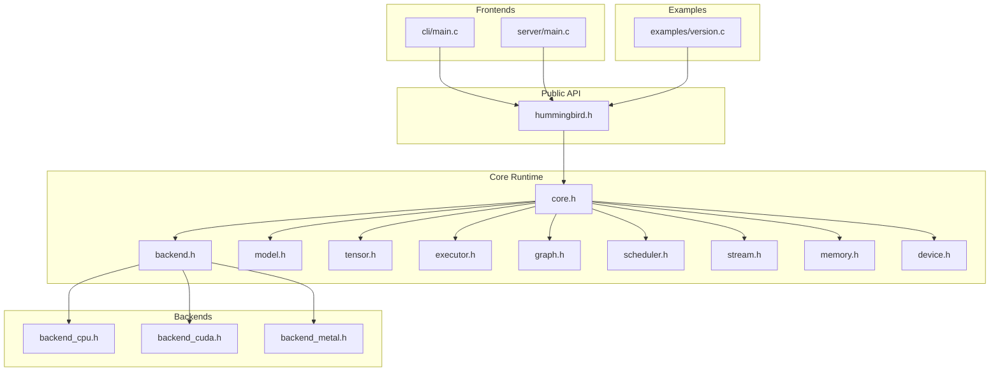
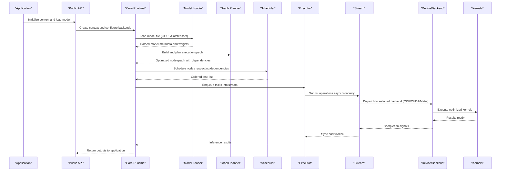
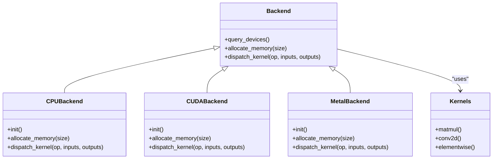
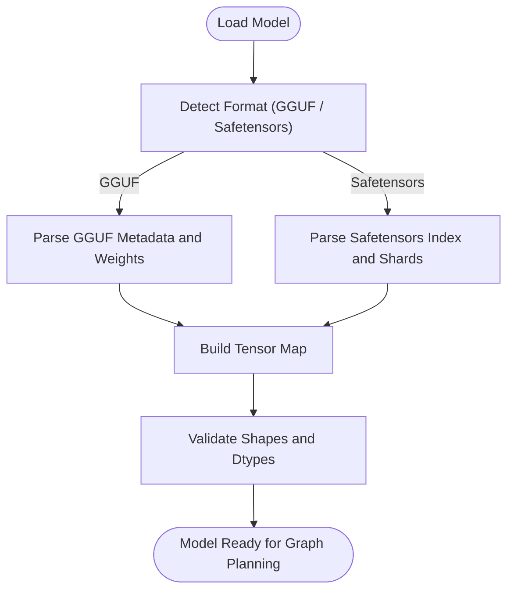
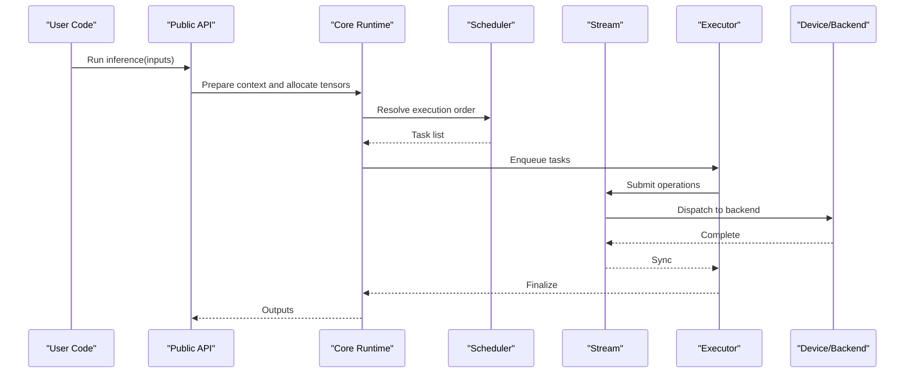
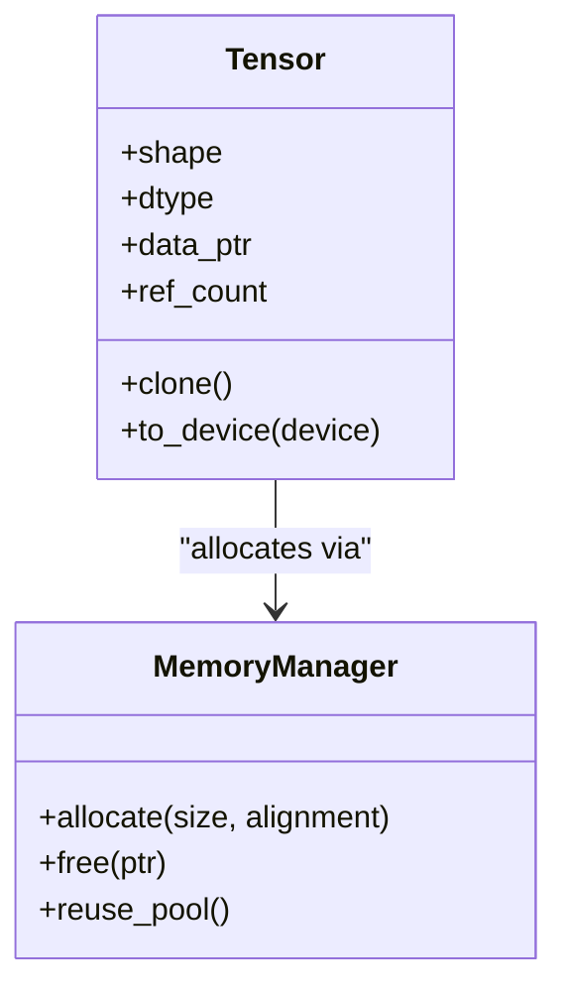
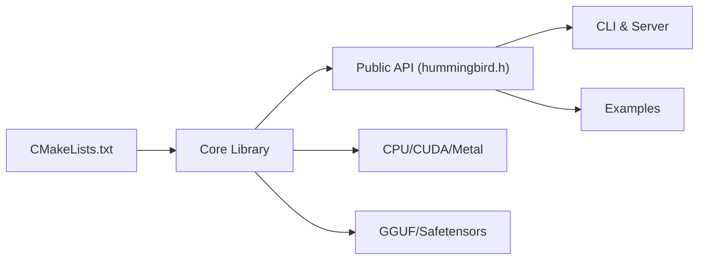

# Project Overview

<cite>
**Referenced Files in This Document**
- [README.md](file://README.md)
- [CMakeLists.txt](file://CMakeLists.txt)
- [include/hummingbird/hummingbird.h](file://include/hummingbird/hummingbird.h)
- [src/hummingbird.c](file://src/hummingbird.c)
- [src/core/core.h](file://src/core/core.h)
- [src/backend/backend.h](file://src/backend/backend.h)
- [backends/cpu/backend_cpu.h](file://backends/cpu/backend_cpu.h)
- [backends/cuda/backend_cuda.h](file://backends/cuda/backend_cuda.h)
- [backends/metal/backend_metal.h](file://backends/metal/backend_metal.h)
- [src/model/model.h](file://src/model/model.h)
- [src/model/model_format_gguf.c](file://src/model/model_format_gguf.c)
- [src/model/model_format_safetensors.c](file://src/model/model_format_safetensors.c)
- [src/tensor/tensor.h](file://src/tensor/tensor.h)
- [src/executor/executor.h](file://src/executor/executor.h)
- [src/graph/graph.h](file://src/graph/graph.h)
- [src/scheduler/scheduler.h](file://src/scheduler/scheduler.h)
- [src/stream/stream.h](file://src/stream/stream.h)
- [src/memory/memory.h](file://src/memory/memory.h)
- [src/device/device.h](file://src/device/device.h)
- [frontends/cli/main.c](file://frontends/cli/main.c)
- [examples/version.c](file://examples/version.c)
</cite>

## Table of Contents
1. [Introduction](#introduction)
2. [Project Structure](#project-structure)
3. [Core Components](#core-components)
4. [Architecture Overview](#architecture-overview)
5. [Detailed Component Analysis](#detailed-component-analysis)
6. [Dependency Analysis](#dependency-analysis)
7. [Performance Considerations](#performance-considerations)
8. [Troubleshooting Guide](#troubleshooting-guide)
9. [Conclusion](#conclusion)
10. [Appendices](#appendices)

## Introduction
Hummingbird is a high-performance C/C++ inference engine library designed for running machine learning models efficiently across multiple hardware backends. It emphasizes modularity, portability, and performance by separating the execution pipeline into well-defined layers: model loading, graph planning, scheduling, kernel dispatch, memory management, and stream-based execution. The library supports popular model formats such as GGUF and Safetensors and provides hardware acceleration through CPU, CUDA, and Metal backends.

Key differentiators include:
- A clean separation between backends and kernels, enabling easy extension to new accelerators without changing core logic.
- Stream-oriented execution that allows asynchronous operations and fine-grained control over concurrency.
- A pluggable backend registry with device abstraction, allowing runtime selection of CPU, CUDA, or Metal based on availability and configuration.
- Minimal dependencies and a focus on low-level control for systems integration and embedded deployments.

This overview introduces both conceptual ideas for beginners (what an inference engine does, what backends and kernels are) and technical details for experienced developers (execution pipeline, tensor handling, scheduling).

## Project Structure
The repository follows a modular layout:
- Public API headers under include/hummingbird
- Core runtime components under src
- Hardware-specific backends under backends
- Frontends (CLI and server) under frontends
- Examples and benchmarks under examples and benchmarks
- Build system using CMake

**Diagram sources**
- [include/hummingbird/hummingbird.h](file://include/hummingbird/hummingbird.h)
- [src/core/core.h](file://src/core/core.h)
- [src/backend/backend.h](file://src/backend/backend.h)
- [backends/cpu/backend_cpu.h](file://backends/cpu/backend_cpu.h)
- [backends/cuda/backend_cuda.h](file://backends/cuda/backend_cuda.h)
- [backends/metal/backend_metal.h](file://backends/metal/backend_metal.h)
- [src/model/model.h](file://src/model/model.h)
- [src/tensor/tensor.h](file://src/tensor/tensor.h)
- [src/executor/executor.h](file://src/executor/executor.h)
- [src/graph/graph.h](file://src/graph/graph.h)
- [src/scheduler/scheduler.h](file://src/scheduler/scheduler.h)
- [src/stream/stream.h](file://src/stream/stream.h)
- [src/memory/memory.h](file://src/memory/memory.h)
- [src/device/device.h](file://src/device/device.h)
- [frontends/cli/main.c](file://frontends/cli/main.c)
- [examples/version.c](file://examples/version.c)

**Section sources**
- [CMakeLists.txt](file://CMakeLists.txt)
- [include/hummingbird/hummingbird.h](file://include/hummingbird/hummingbird.h)
- [src/hummingbird.c](file://src/hummingbird.c)

## Core Components
- Backends: Abstract interfaces for hardware-specific implementations (CPU, CUDA, Metal). Each backend exposes device capabilities, memory allocation strategies, and kernel dispatch functions.
- Kernels: Low-level compute routines optimized per backend (e.g., matrix multiply, convolution, element-wise ops).
- Tensors: Multi-dimensional arrays with shape, dtype, and memory ownership semantics; central data structure passed through the execution pipeline.
- Execution Pipeline: Stages include model loading, graph construction/planning, scheduling, kernel dispatch, and stream synchronization.
- Streams: Asynchronous execution contexts that decouple enqueueing from completion, enabling concurrency and overlap.
- Scheduling: Determines order and parallelism of kernel execution based on graph dependencies and resource constraints.
- Memory Management: Allocation, reuse, and lifecycle control for tensors and buffers across devices.
- Device Abstraction: Unified interface to query and select available devices and backends at runtime.

These components work together to provide a flexible, high-throughput inference engine suitable for diverse deployment targets.

**Section sources**
- [src/backend/backend.h](file://src/backend/backend.h)
- [backends/cpu/backend_cpu.h](file://backends/cpu/backend_cpu.h)
- [backends/cuda/backend_cuda.h](file://backends/cuda/backend_cuda.h)
- [backends/metal/backend_metal.h](file://backends/metal/backend_metal.h)
- [src/tensor/tensor.h](file://src/tensor/tensor.h)
- [src/executor/executor.h](file://src/executor/executor.h)
- [src/graph/graph.h](file://src/graph/graph.h)
- [src/scheduler/scheduler.h](file://src/scheduler/scheduler.h)
- [src/stream/stream.h](file://src/stream/stream.h)
- [src/memory/memory.h](file://src/memory/memory.h)
- [src/device/device.h](file://src/device/device.h)

## Architecture Overview
The Hummingbird architecture separates concerns across layers:
- Public API layer: Stable C/C++ interface for users.
- Core runtime: Orchestrates model loading, graph planning, scheduling, and execution.
- Backend layer: Provides device-specific implementations and kernel dispatch.
- Frontends: CLI and server utilities built on top of the public API.

**Diagram sources**
- [include/hummingbird/hummingbird.h](file://include/hummingbird/hummingbird.h)
- [src/core/core.h](file://src/core/core.h)
- [src/model/model.h](file://src/model/model.h)
- [src/graph/graph.h](file://src/graph/graph.h)
- [src/scheduler/scheduler.h](file://src/scheduler/scheduler.h)
- [src/executor/executor.h](file://src/executor/executor.h)
- [src/stream/stream.h](file://src/stream/stream.h)
- [src/device/device.h](file://src/device/device.h)
- [src/backend/backend.h](file://src/backend/backend.h)

## Detailed Component Analysis

### Backends and Kernels
Backends encapsulate hardware-specific behavior. Each backend implements device discovery, memory allocation, and kernel dispatch. Kernels are the actual compute primitives tuned for each backend.

**Diagram sources**
- [src/backend/backend.h](file://src/backend/backend.h)
- [backends/cpu/backend_cpu.h](file://backends/cpu/backend_cpu.h)
- [backends/cuda/backend_cuda.h](file://backends/cuda/backend_cuda.h)
- [backends/metal/backend_metal.h](file://backends/metal/backend_metal.h)

**Section sources**
- [src/backend/backend.h](file://src/backend/backend.h)
- [backends/cpu/backend_cpu.h](file://backends/cpu/backend_cpu.h)
- [backends/cuda/backend_cuda.h](file://backends/cuda/backend_cuda.h)
- [backends/metal/backend_metal.h](file://backends/metal/backend_metal.h)

### Model Loading and Supported Formats
Hummingbird supports GGUF and Safetensors via dedicated loaders. These modules parse model metadata, extract weights, and construct internal representations compatible with the execution pipeline.

**Diagram sources**
- [src/model/model.h](file://src/model/model.h)
- [src/model/model_format_gguf.c](file://src/model/model_format_gguf.c)
- [src/model/model_format_safetensors.c](file://src/model/model_format_safetensors.c)

**Section sources**
- [src/model/model.h](file://src/model/model.h)
- [src/model/model_format_gguf.c](file://src/model/model_format_gguf.c)
- [src/model/model_format_safetensors.c](file://src/model/model_format_safetensors.c)

### Execution Pipeline and Streams
The execution pipeline orchestrates model inference across streams and schedulers. Streams enable asynchronous operation submission and synchronization, while the scheduler resolves dependencies and parallelism.

**Diagram sources**
- [src/executor/executor.h](file://src/executor/executor.h)
- [src/scheduler/scheduler.h](file://src/scheduler/scheduler.h)
- [src/stream/stream.h](file://src/stream/stream.h)
- [src/device/device.h](file://src/device/device.h)
- [include/hummingbird/hummingbird.h](file://include/hummingbird/hummingbird.h)

**Section sources**
- [src/executor/executor.h](file://src/executor/executor.h)
- [src/scheduler/scheduler.h](file://src/scheduler/scheduler.h)
- [src/stream/stream.h](file://src/stream/stream.h)
- [src/device/device.h](file://src/device/device.h)

### Tensors and Memory Management
Tensors represent multi-dimensional data with explicit shape and dtype. Memory management ensures efficient allocation and reuse across devices and streams.

**Diagram sources**
- [src/tensor/tensor.h](file://src/tensor/tensor.h)
- [src/memory/memory.h](file://src/memory/memory.h)

**Section sources**
- [src/tensor/tensor.h](file://src/tensor/tensor.h)
- [src/memory/memory.h](file://src/memory/memory.h)

## Dependency Analysis
At build time, CMake configures the core library and optional backends. The public API depends on core runtime components, which in turn depend on device abstractions and backend implementations. Frontends and examples link against the public API.

**Diagram sources**
- [CMakeLists.txt](file://CMakeLists.txt)
- [include/hummingbird/hummingbird.h](file://include/hummingbird/hummingbird.h)
- [src/hummingbird.c](file://src/hummingbird.c)
- [backends/cpu/backend_cpu.h](file://backends/cpu/backend_cpu.h)
- [backends/cuda/backend_cuda.h](file://backends/cuda/backend_cuda.h)
- [backends/metal/backend_metal.h](file://backends/metal/backend_metal.h)
- [src/model/model_format_gguf.c](file://src/model/model_format_gguf.c)
- [src/model/model_format_safetensors.c](file://src/model/model_format_safetensors.c)
- [frontends/cli/main.c](file://frontends/cli/main.c)
- [examples/version.c](file://examples/version.c)

**Section sources**
- [CMakeLists.txt](file://CMakeLists.txt)
- [include/hummingbird/hummingbird.h](file://include/hummingbird/hummingbird.h)
- [src/hummingbird.c](file://src/hummingbird.c)

## Performance Considerations
- Prefer GPU backends (CUDA/Metal) when available for large models and batched inference.
- Use streams to overlap computation and data movement where supported.
- Reuse tensors and memory pools to reduce allocation overhead.
- Tune scheduler settings to balance latency and throughput based on workload characteristics.
- Profile critical paths using provided tools and adjust kernel selection or graph optimizations accordingly.

[No sources needed since this section provides general guidance]

## Troubleshooting Guide
- If model loading fails, verify format support (GGUF/Safetensors) and file integrity.
- For backend initialization errors, check device availability and driver/runtime requirements.
- When encountering out-of-memory issues, reduce batch size or enable memory pooling.
- Use logging and profiling utilities to identify bottlenecks in the execution pipeline.

**Section sources**
- [src/model/model_format_gguf.c](file://src/model/model_format_gguf.c)
- [src/model/model_format_safetensors.c](file://src/model/model_format_safetensors.c)
- [src/device/device.h](file://src/device/device.h)
- [src/memory/memory.h](file://src/memory/memory.h)

## Conclusion
Hummingbird delivers a modular, high-performance inference engine with clear separation between backends, kernels, and the execution pipeline. Its design enables rapid adoption across CPUs and accelerators, supports widely used model formats, and provides the flexibility required for production-grade deployments. By leveraging streams, scheduling, and efficient memory management, it achieves strong performance while remaining accessible to both newcomers and seasoned developers.

[No sources needed since this section summarizes without analyzing specific files]

## Appendices

### Installation and System Requirements
- Build system: CMake
- Language: C/C++
- Optional backends:
  - CUDA backend requires NVIDIA drivers and CUDA toolkit
  - Metal backend requires macOS/iOS environment
- Recommended compilers: GCC/Clang with CMake 3.18+

Installation steps:
- Configure with CMake and enable desired backends
- Build the library and install artifacts
- Link your application against the public API headers and library

Quick start example references:
- Public API entry points and version utility:
  - [include/hummingbird/hummingbird.h](file://include/hummingbird/hummingbird.h)
  - [examples/version.c](file://examples/version.c)
- CLI frontend usage patterns:
  - [frontends/cli/main.c](file://frontends/cli/main.c)

Conceptual quick start workflow:
- Initialize context and select backend(s)
- Load a model file (GGUF or Safetensors)
- Prepare input tensors and run inference
- Retrieve outputs and synchronize streams if needed

**Section sources**
- [CMakeLists.txt](file://CMakeLists.txt)
- [include/hummingbird/hummingbird.h](file://include/hummingbird/hummingbird.h)
- [examples/version.c](file://examples/version.c)
- [frontends/cli/main.c](file://frontends/cli/main.c)
- [src/model/model_format_gguf.c](file://src/model/model_format_gguf.c)
- [src/model/model_format_safetensors.c](file://src/model/model_format_safetensors.c)