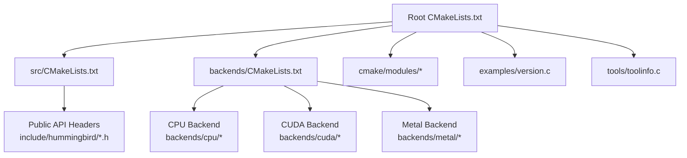
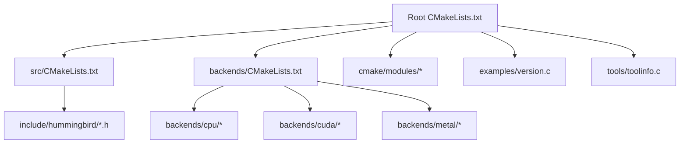
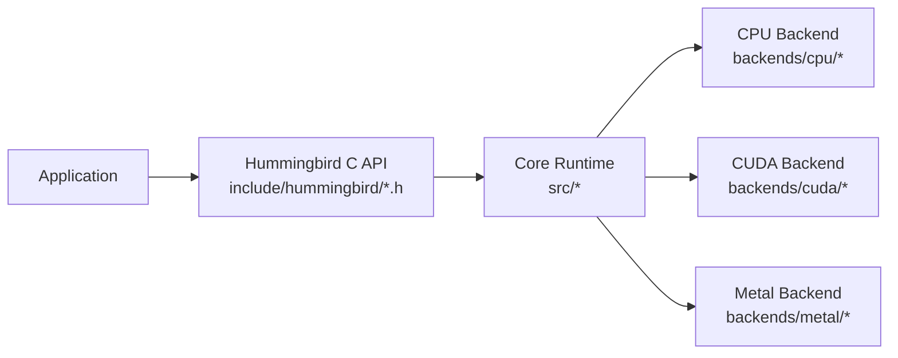
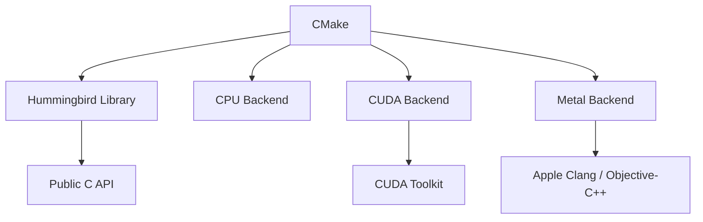
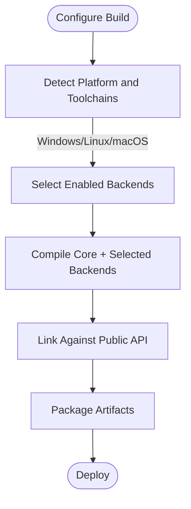

# Technology Stack

<cite>
**Referenced Files in This Document**
- [CMakeLists.txt](file://CMakeLists.txt)
- [CMakePresets.json](file://CMakePresets.json)
- [cmake/modules/HBCompilerOptions.cmake](file://cmake/modules/HBCompilerOptions.cmake)
- [cmake/modules/HBSanitizers.cmake](file://cmake/modules/HBSanitizers.cmake)
- [cmake/README.md](file://cmake/README.md)
- [src/CMakeLists.txt](file://src/CMakeLists.txt)
- [backends/CMakeLists.txt](file://backends/CMakeLists.txt)
- [backends/cpu/CMakeLists.txt](file://backends/cpu/CMakeLists.txt)
- [backends/cuda/CMakeLists.txt](file://backends/cuda/CMakeLists.txt)
- [backends/metal/CMakeLists.txt](file://backends/metal/CMakeLists.txt)
- [include/hummingbird/hummingbird.h](file://include/hummingbird/hummingbird.h)
- [include/hummingbird/hummingbird_experimental.h](file://include/hummingbird/hummingbird_experimental.h)
- [examples/version.c](file://examples/version.c)
- [tools/toolinfo.c](file://tools/toolinfo.c)
- [install.sh](file://install.sh)
</cite>

## Table of Contents
1. [Introduction](#introduction)
2. [Project Structure](#project-structure)
3. [Core Components](#core-components)
4. [Architecture Overview](#architecture-overview)
5. [Detailed Component Analysis](#detailed-component-analysis)
6. [Dependency Analysis](#dependency-analysis)
7. [Performance Considerations](#performance-considerations)
8. [Troubleshooting Guide](#troubleshooting-guide)
9. [Conclusion](#conclusion)
10. [Appendices](#appendices)

## Introduction
This document describes the complete technology stack powering Hummingbird, focusing on the C/C++ core implementation, the CMake-based build system, platform-specific optimizations, and external dependencies. It explains compiler requirements, supported toolchains, third-party libraries used for performance optimization, cross-platform compatibility strategies, hardware architecture adaptations, version compatibility matrix, and dependency management approaches.

## Project Structure
At a high level, Hummingbird is organized into:
- Core runtime and subsystems under src/
- Public API headers under include/hummingbird/
- Backend implementations for CPU, CUDA, and Metal under backends/
- Build configuration and presets under cmake/ and root CMake files
- Examples, tools, benchmarks, and tests
- Platform installation script

**Diagram sources**
- [CMakeLists.txt](file://CMakeLists.txt)
- [src/CMakeLists.txt](file://src/CMakeLists.txt)
- [backends/CMakeLists.txt](file://backends/CMakeLists.txt)
- [cmake/modules/HBCompilerOptions.cmake](file://cmake/modules/HBCompilerOptions.cmake)
- [cmake/modules/HBSanitizers.cmake](file://cmake/modules/HBSanitizers.cmake)
- [include/hummingbird/hummingbird.h](file://include/hummingbird/hummingbird.h)
- [include/hummingbird/hummingbird_experimental.h](file://include/hummingbird/hummingbird_experimental.h)
- [backends/cpu/CMakeLists.txt](file://backends/cpu/CMakeLists.txt)
- [backends/cuda/CMakeLists.txt](file://backends/cuda/CMakeLists.txt)
- [backends/metal/CMakeLists.txt](file://backends/metal/CMakeLists.txt)
- [examples/version.c](file://examples/version.c)
- [tools/toolinfo.c](file://tools/toolinfo.c)

**Section sources**
- [CMakeLists.txt](file://CMakeLists.txt)
- [src/CMakeLists.txt](file://src/CMakeLists.txt)
- [backends/CMakeLists.txt](file://backends/CMakeLists.txt)
- [cmake/README.md](file://cmake/README.md)

## Core Components
The technology stack centers around:
- Language and compilers: C and C++ with optional CUDA and Objective-C/Metal support
- Build system: CMake with modular options and sanitizers
- Backends: CPU (C), CUDA (C++), Metal (Objective-C++)
- Public ABI: Stable C API exposed via include/hummingbird/
- Tooling: Version reporting and environment introspection utilities

Key responsibilities:
- The root CMake orchestrates project configuration, feature toggles, and subprojects.
- Compiler options and sanitizer flags are centralized in cmake/modules/.
- Backends provide device-specific acceleration paths.
- Public headers define the stable interface consumed by applications.

**Section sources**
- [CMakeLists.txt](file://CMakeLists.txt)
- [cmake/modules/HBCompilerOptions.cmake](file://cmake/modules/HBCompilerOptions.cmake)
- [cmake/modules/HBSanitizers.cmake](file://cmake/modules/HBSanitizers.cmake)
- [include/hummingbird/hummingbird.h](file://include/hummingbird/hummingbird.h)
- [include/hummingbird/hummingbird_experimental.h](file://include/hummingbird/hummingbird_experimental.h)
- [backends/cpu/CMakeLists.txt](file://backends/cpu/CMakeLists.txt)
- [backends/cuda/CMakeLists.txt](file://backends/cuda/CMakeLists.txt)
- [backends/metal/CMakeLists.txt](file://backends/metal/CMakeLists.txt)

## Architecture Overview
The build-time architecture composes the core library, optional backends, examples, and tools. Feature flags control which backends are compiled and linked.

**Diagram sources**
- [CMakeLists.txt](file://CMakeLists.txt)
- [src/CMakeLists.txt](file://src/CMakeLists.txt)
- [backends/CMakeLists.txt](file://backends/CMakeLists.txt)
- [cmake/modules/HBCompilerOptions.cmake](file://cmake/modules/HBCompilerOptions.cmake)
- [cmake/modules/HBSanitizers.cmake](file://cmake/modules/HBSanitizers.cmake)
- [include/hummingbird/hummingbird.h](file://include/hummingbird/hummingbird.h)
- [include/hummingbird/hummingbird_experimental.h](file://include/hummingbird/hummingbird_experimental.h)
- [backends/cpu/CMakeLists.txt](file://backends/cpu/CMakeLists.txt)
- [backends/cuda/CMakeLists.txt](file://backends/cuda/CMakeLists.txt)
- [backends/metal/CMakeLists.txt](file://backends/metal/CMakeLists.txt)
- [examples/version.c](file://examples/version.c)
- [tools/toolinfo.c](file://tools/toolinfo.c)

## Detailed Component Analysis

### Build System and Compiler Requirements
- Primary build tool: CMake
- Modular configuration:
  - Compiler options and warnings are centralized in cmake/modules/HBCompilerOptions.cmake
  - Sanitizer integration is provided by cmake/modules/HBSanitizers.cmake
- Presets: CMakePresets.json provides common configurations to streamline builds across platforms
- Installation helper: install.sh automates setup tasks

What this means for users:
- Configure with CMake using standard workflows or presets
- Enable/disable features via CMake options (e.g., enabling CUDA or Metal backends)
- Use sanitizers for development builds when desired

**Section sources**
- [CMakeLists.txt](file://CMakeLists.txt)
- [CMakePresets.json](file://CMakePresets.json)
- [cmake/modules/HBCompilerOptions.cmake](file://cmake/modules/HBCompilerOptions.cmake)
- [cmake/modules/HBSanitizers.cmake](file://cmake/modules/HBSanitizers.cmake)
- [cmake/README.md](file://cmake/README.md)
- [install.sh](file://install.sh)

### Backends and Hardware Acceleration
- CPU backend: Pure C implementation for broad compatibility and portability
- CUDA backend: GPU acceleration path for NVIDIA devices
- Metal backend: Apple GPU acceleration path for macOS/iOS

Backend selection is controlled at build time through CMake configuration.

**Diagram sources**
- [include/hummingbird/hummingbird.h](file://include/hummingbird/hummingbird.h)
- [include/hummingbird/hummingbird_experimental.h](file://include/hummingbird/hummingbird_experimental.h)
- [backends/cpu/CMakeLists.txt](file://backends/cpu/CMakeLists.txt)
- [backends/cuda/CMakeLists.txt](file://backends/cuda/CMakeLists.txt)
- [backends/metal/CMakeLists.txt](file://backends/metal/CMakeLists.txt)

**Section sources**
- [backends/cpu/CMakeLists.txt](file://backends/cpu/CMakeLists.txt)
- [backends/cuda/CMakeLists.txt](file://backends/cuda/CMakeLists.txt)
- [backends/metal/CMakeLists.txt](file://backends/metal/CMakeLists.txt)

### Public API and ABI Stability
- Stable public interface is defined in include/hummingbird/hummingbird.h
- Experimental features are exposed via include/hummingbird/hummingbird_experimental.h
- Applications link against the compiled library and consume the C API

This separation allows internal evolution while maintaining a stable contract for consumers.

**Section sources**
- [include/hummingbird/hummingbird.h](file://include/hummingbird/hummingbird.h)
- [include/hummingbird/hummingbird_experimental.h](file://include/hummingbird/hummingbird_experimental.h)

### Versioning and Tooling
- Example version utility: examples/version.c demonstrates how to query version information
- Tooling: tools/toolinfo.c provides environment introspection capabilities useful for diagnostics

These components help ensure consistent version reporting and aid in troubleshooting build/runtime environments.

**Section sources**
- [examples/version.c](file://examples/version.c)
- [tools/toolinfo.c](file://tools/toolinfo.c)

## Dependency Analysis
External dependencies and their roles:
- CMake: Build orchestration and configuration
- Compilers:
  - C/C++ toolchain for core and CPU backend
  - CUDA toolkit for GPU backend
  - Apple Clang/Objective-C++ for Metal backend
- Optional sanitizers for development builds

Build-time dependency graph:

**Diagram sources**
- [CMakeLists.txt](file://CMakeLists.txt)
- [backends/cuda/CMakeLists.txt](file://backends/cuda/CMakeLists.txt)
- [backends/metal/CMakeLists.txt](file://backends/metal/CMakeLists.txt)
- [include/hummingbird/hummingbird.h](file://include/hummingbird/hummingbird.h)

**Section sources**
- [CMakeLists.txt](file://CMakeLists.txt)
- [backends/cuda/CMakeLists.txt](file://backends/cuda/CMakeLists.txt)
- [backends/metal/CMakeLists.txt](file://backends/metal/CMakeLists.txt)

## Performance Considerations
- Backend selection: Choose CPU, CUDA, or Metal based on target hardware
- Compiler optimizations: Centralized in cmake/modules/HBCompilerOptions.cmake to tune flags per platform
- Sanitizers: Use HBSanitizers.cmake for development-time checks without impacting release performance
- Threading and memory: Core modules such as threadpool and memory are designed for efficient resource usage

Recommendations:
- Enable appropriate backend for your deployment target
- Use presets from CMakePresets.json for reproducible builds
- Apply sanitizer-enabled configurations only during development

[No sources needed since this section provides general guidance]

## Troubleshooting Guide
Common areas to inspect:
- Build configuration: Verify CMake options and presets
- Backend availability: Ensure required toolchains (CUDA, Metal) are installed and discoverable
- Environment introspection: Use tools/toolinfo.c to capture environment details
- Version consistency: Confirm examples/version.c reports expected versions

Steps:
- Reconfigure with verbose output to identify missing dependencies
- Validate that the correct compiler and toolchain are selected
- Check sanitizer-related issues if enabled

**Section sources**
- [CMakePresets.json](file://CMakePresets.json)
- [cmake/README.md](file://cmake/README.md)
- [tools/toolinfo.c](file://tools/toolinfo.c)
- [examples/version.c](file://examples/version.c)

## Conclusion
Hummingbird’s technology stack combines a portable C/C++ core with a flexible CMake build system and pluggable backends for CPU, CUDA, and Metal. Centralized compiler options and sanitizers enable consistent, optimized builds across platforms. The stable C API ensures long-term compatibility, while tooling supports versioning and diagnostics. By selecting the appropriate backend and leveraging presets, developers can deliver performant deployments across diverse hardware architectures.

[No sources needed since this section summarizes without analyzing specific files]

## Appendices

### Cross-Platform Compatibility Approach
- Abstracted backend layer allows swapping device implementations without changing application code
- CMake conditionals select source sets and link targets per platform
- Public headers isolate ABI from internal changes

[No sources needed since this diagram shows conceptual workflow, not actual code structure]

### Supported Toolchains and Compiler Requirements
- C/C++ compilers for core and CPU backend
- CUDA toolkit for GPU backend
- Apple Clang/Objective-C++ for Metal backend
- CMake presets simplify toolchain selection

**Section sources**
- [CMakePresets.json](file://CMakePresets.json)
- [cmake/modules/HBCompilerOptions.cmake](file://cmake/modules/HBCompilerOptions.cmake)
- [cmake/modules/HBSanitizers.cmake](file://cmake/modules/HBSanitizers.cmake)

### Version Compatibility Matrix
- Use examples/version.c to report library version at runtime
- Align toolchain versions with backend requirements (e.g., CUDA toolkit version for CUDA backend)
- Prefer documented presets for known-good combinations

**Section sources**
- [examples/version.c](file://examples/version.c)

### Dependency Management Strategies
- External dependencies are integrated via CMake; manage them through CMake fetch or vendored sources as configured
- Pin versions in CMake configuration to ensure reproducibility
- Use install.sh for environment preparation where applicable

**Section sources**
- [CMakeLists.txt](file://CMakeLists.txt)
- [install.sh](file://install.sh)