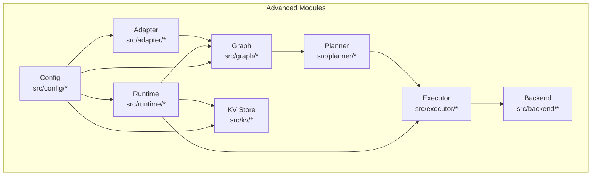
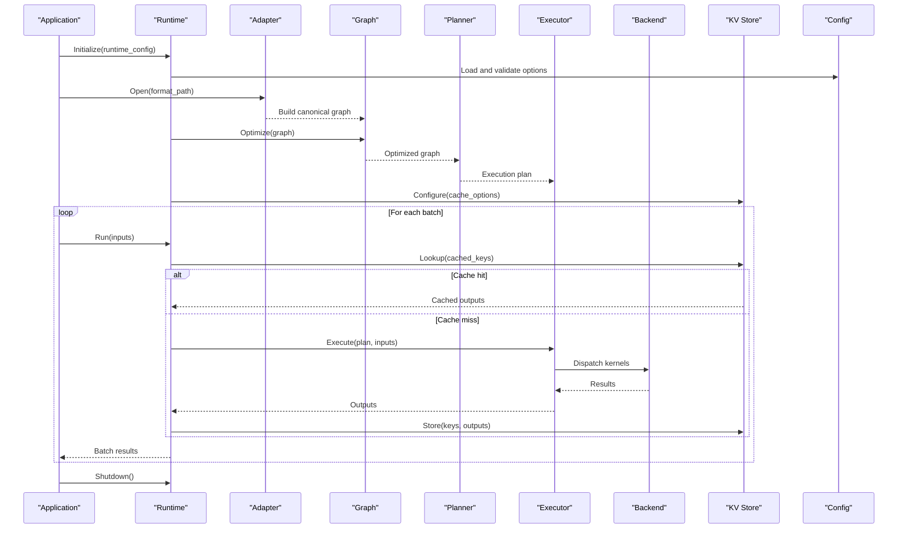
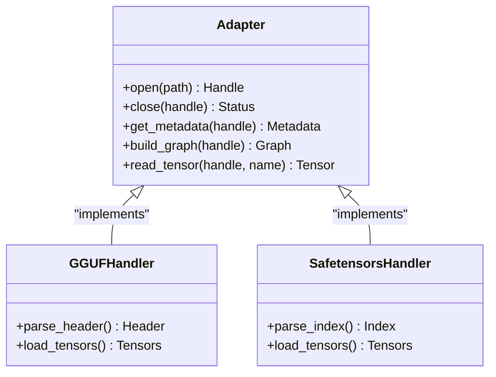
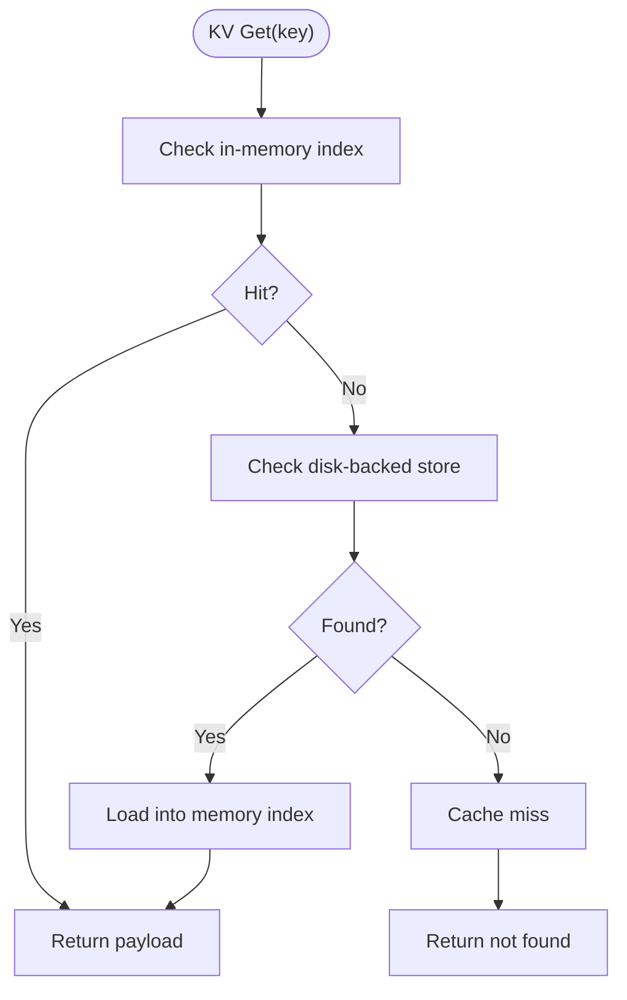
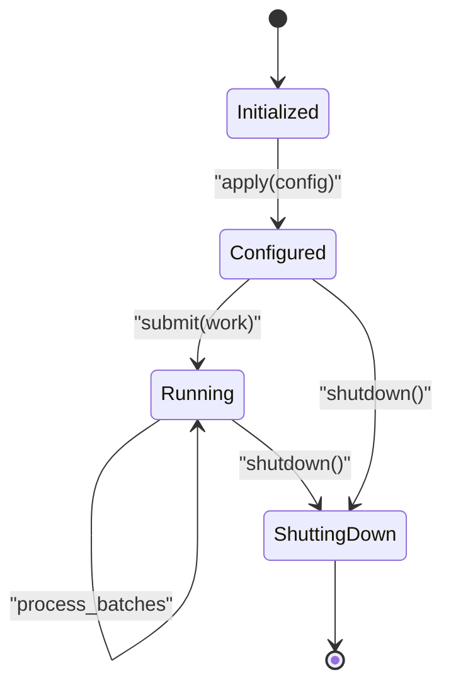
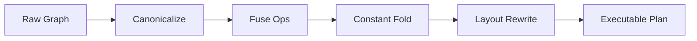
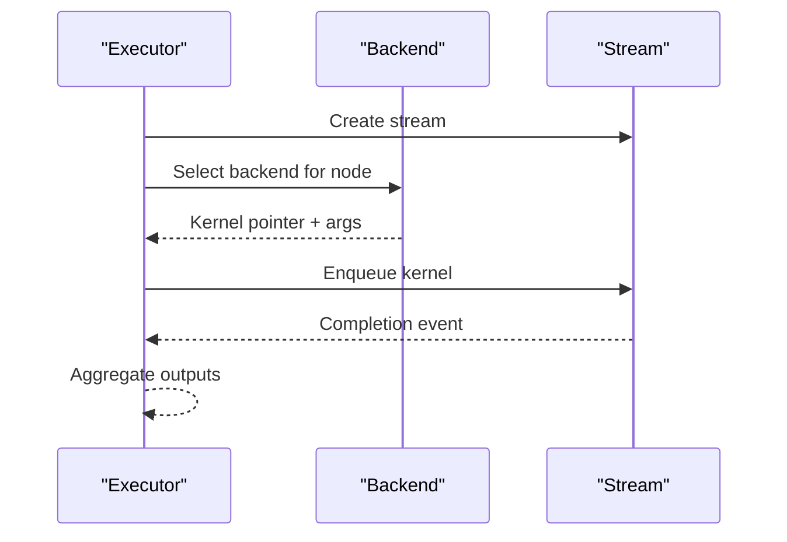
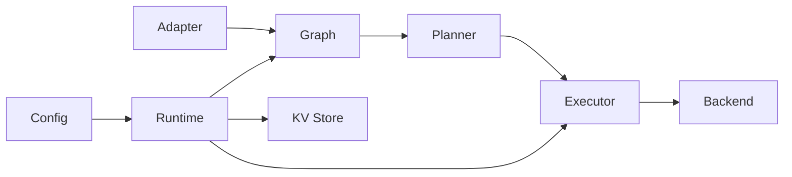

# Advanced Topics

<cite>
**Referenced Files in This Document**
- [adapter.h](file://src/adapter/adapter.h)
- [adapter.c](file://src/adapter/adapter.c)
- [adapter_internal.h](file://src/adapter/adapter_internal.h)
- [kv.h](file://src/kv/kv.h)
- [kv.c](file://src/kv/kv.c)
- [kv_internal.h](file://src/kv/kv_internal.h)
- [runtime.h](file://src/runtime/runtime.h)
- [runtime.c](file://src/runtime/runtime.c)
- [runtime_internal.h](file://src/runtime/runtime_internal.h)
- [graph.h](file://src/graph/graph.h)
- [graph.c](file://src/graph/graph.c)
- [graph_internal.h](file://src/graph/graph_internal.h)
- [planner.h](file://src/planner/planner.h)
- [planner.c](file://src/planner/planner.c)
- [planner_internal.h](file://src/planner/planner_internal.h)
- [executor.h](file://src/executor/executor.h)
- [executor.c](file://src/executor/executor.c)
- [executor_internal.h](file://src/executor/executor_internal.h)
- [backend.h](file://src/backend/backend.h)
- [backend.c](file://src/backend/backend.c)
- [backend_internal.h](file://src/backend/backend_internal.h)
- [config.h](file://src/config/config.h)
- [config.c](file://src/config/config.c)
- [config_internal.h](file://src/config/config_internal.h)
- [core.h](file://src/core/core.h)
- [core.c](file://src/core/core.c)
- [core_internal.h](file://src/core/core_internal.h)
- [model_format_gguf.c](file://src/model/model_format_gguf.c)
- [model_format_safetensors.c](file://src/model/model_format_safetensors.c)
- [stream.h](file://src/stream/stream.h)
- [stream.c](file://src/stream/stream.c)
- [stream_internal.h](file://src/stream/stream_internal.h)
</cite>

## Table of Contents
1. [Introduction](#introduction)
2. [Project Structure](#project-structure)
3. [Core Components](#core-components)
4. [Architecture Overview](#architecture-overview)
5. [Detailed Component Analysis](#detailed-component-analysis)
6. [Dependency Analysis](#dependency-analysis)
7. [Performance Considerations](#performance-considerations)
8. [Troubleshooting Guide](#troubleshooting-guide)
9. [Conclusion](#conclusion)
10. [Appendices](#appendices)

## Introduction
This document covers advanced Hummingbird topics for experienced developers and practitioners building complex integrations. It focuses on:
- Adapter pattern implementation for format compatibility
- Key-value storage mechanisms for caching
- Runtime management for lifecycle control
- Graph optimization for computational efficiency
- Advanced configuration options
- Custom plugin development
- Integration patterns with external systems

The content balances conceptual overviews with technical implementation details, using terminology consistent with the codebase such as adapter, KV store, runtime, and graph optimization.

## Project Structure
At a high level, Hummingbird organizes functionality into modular subsystems under src/. The advanced topics span several modules:
- Adapter layer for model format compatibility
- KV store for key-value caching
- Runtime for lifecycle and execution orchestration
- Graph and planner for representation and optimization
- Executor and backend for dispatch and device-specific kernels
- Config for advanced settings

**Diagram sources**
- [adapter.h:1-200](file://src/adapter/adapter.h#L1-L200)
- [kv.h:1-200](file://src/kv/kv.h#L1-L200)
- [runtime.h:1-200](file://src/runtime/runtime.h#L1-L200)
- [graph.h:1-200](file://src/graph/graph.h#L1-L200)
- [planner.h:1-200](file://src/planner/planner.h#L1-L200)
- [executor.h:1-200](file://src/executor/executor.h#L1-L200)
- [backend.h:1-200](file://src/backend/backend.h#L1-L200)
- [config.h:1-200](file://src/config/config.h#L1-L200)

**Section sources**
- [adapter.h:1-200](file://src/adapter/adapter.h#L1-L200)
- [kv.h:1-200](file://src/kv/kv.h#L1-L200)
- [runtime.h:1-200](file://src/runtime/runtime.h#L1-L200)
- [graph.h:1-200](file://src/graph/graph.h#L1-L200)
- [planner.h:1-200](file://src/planner/planner.h#L1-L200)
- [executor.h:1-200](file://src/executor/executor.h#L1-L200)
- [backend.h:1-200](file://src/backend/backend.h#L1-L200)
- [config.h:1-200](file://src/config/config.h#L1-L200)

## Core Components
- Adapter: Provides a uniform interface to load and interact with different model formats (e.g., GGUF, safetensors). It abstracts format-specific parsing and exposes a common API to the rest of the system.
- KV Store: A key-value cache used to persist or share intermediate results, weights, or metadata across runs. It supports pluggable backends and is integrated with the runtime and executor for performance-sensitive paths.
- Runtime: Manages lifecycle (init, configure, run, shutdown), coordinates graph execution, manages resources, and integrates with the KV store and config.
- Graph Optimization: Represents computation graphs, applies transformations (fusion, constant folding, layout changes), and prepares an optimized plan for execution.
- Planner and Executor: Planner builds an executable plan from the graph; Executor schedules and runs nodes on selected backends.
- Backend: Device-specific implementations (CPU, CUDA, Metal) that execute kernel operations.
- Config: Centralized configuration for enabling/disabling features, tuning performance, and selecting plugins.

**Section sources**
- [adapter.h:1-200](file://src/adapter/adapter.h#L1-L200)
- [adapter.c:1-200](file://src/adapter/adapter.c#L1-L200)
- [kv.h:1-200](file://src/kv/kv.h#L1-L200)
- [kv.c:1-200](file://src/kv/kv.c#L1-L200)
- [runtime.h:1-200](file://src/runtime/runtime.h#L1-L200)
- [runtime.c:1-200](file://src/runtime/runtime.c#L1-L200)
- [graph.h:1-200](file://src/graph/graph.h#L1-L200)
- [graph.c:1-200](file://src/graph/graph.c#L1-L200)
- [planner.h:1-200](file://src/planner/planner.h#L1-L200)
- [planner.c:1-200](file://src/planner/planner.c#L1-L200)
- [executor.h:1-200](file://src/executor/executor.h#L1-L200)
- [executor.c:1-200](file://src/executor/executor.c#L1-L200)
- [backend.h:1-200](file://src/backend/backend.h#L1-L200)
- [backend.c:1-200](file://src/backend/backend.c#L1-L200)
- [config.h:1-200](file://src/config/config.h#L1-L200)
- [config.c:1-200](file://src/config/config.c#L1-L200)

## Architecture Overview
The advanced architecture centers around a pipeline:
- Adapter loads models from various formats into a canonical representation.
- Graph captures dependencies and enables optimizations.
- Planner transforms the graph into an efficient execution plan.
- Executor runs the plan on selected backends.
- Runtime orchestrates initialization, configuration, and teardown.
- KV store provides fast access to cached data.
- Config drives feature flags and tuning parameters.

**Diagram sources**
- [runtime.h:1-200](file://src/runtime/runtime.h#L1-L200)
- [runtime.c:1-200](file://src/runtime/runtime.c#L1-L200)
- [adapter.h:1-200](file://src/adapter/adapter.h#L1-L200)
- [adapter.c:1-200](file://src/adapter/adapter.c#L1-L200)
- [graph.h:1-200](file://src/graph/graph.h#L1-L200)
- [graph.c:1-200](file://src/graph/graph.c#L1-L200)
- [planner.h:1-200](file://src/planner/planner.h#L1-L200)
- [planner.c:1-200](file://src/planner/planner.c#L1-L200)
- [executor.h:1-200](file://src/executor/executor.h#L1-L200)
- [executor.c:1-200](file://src/executor/executor.c#L1-L200)
- [backend.h:1-200](file://src/backend/backend.h#L1-L200)
- [backend.c:1-200](file://src/backend/backend.c#L1-L200)
- [kv.h:1-200](file://src/kv/kv.h#L1-L200)
- [kv.c:1-200](file://src/kv/kv.c#L1-L200)
- [config.h:1-200](file://src/config/config.h#L1-L200)
- [config.c:1-200](file://src/config/config.c#L1-L200)

## Detailed Component Analysis

### Adapter Pattern for Format Compatibility
The adapter layer standardizes loading of model artifacts across multiple formats. It encapsulates format-specific logic behind a unified interface so higher layers can remain format-agnostic.

Key responsibilities:
- Discover supported formats and open a handle for a given path or stream.
- Parse headers and metadata, then construct a canonical graph and weight map.
- Provide read-only accessors for tensors and auxiliary assets.
- Manage resource lifetimes and error propagation consistently.

Implementation highlights:
- Public API surface defined in the header with stable entry points.
- Internal structures and helpers in internal headers to hide complexity.
- Concrete format handlers implemented in dedicated files (e.g., GGUF, safetensors).

**Diagram sources**
- [adapter.h:1-200](file://src/adapter/adapter.h#L1-L200)
- [adapter.c:1-200](file://src/adapter/adapter.c#L1-L200)
- [adapter_internal.h:1-200](file://src/adapter/adapter_internal.h#L1-L200)
- [model_format_gguf.c:1-200](file://src/model/model_format_gguf.c#L1-L200)
- [model_format_safetensors.c:1-200](file://src/model/model_format_safetensors.c#L1-L200)

Practical usage patterns:
- Use the adapter to open a model file once at startup and reuse the handle across runs.
- Extract only required tensors to reduce memory pressure.
- Combine with KV store to cache parsed metadata or frequently accessed weights.

**Section sources**
- [adapter.h:1-200](file://src/adapter/adapter.h#L1-L200)
- [adapter.c:1-200](file://src/adapter/adapter.c#L1-L200)
- [adapter_internal.h:1-200](file://src/adapter/adapter_internal.h#L1-L200)
- [model_format_gguf.c:1-200](file://src/model/model_format_gguf.c#L1-L200)
- [model_format_safetensors.c:1-200](file://src/model/model_format_safetensors.c#L1-L200)

### KV Store for Caching
The KV store provides a pluggable key-value mechanism for caching intermediate results, weights, or serialized buffers. It is designed for low-latency lookups and optional persistence.

Core capabilities:
- Put/Get/Delete operations with typed keys and payloads.
- Optional TTL and eviction policies.
- Pluggable backends (in-memory, disk-backed, or hybrid).
- Integration hooks for runtime and executor to transparently cache hot paths.

**Diagram sources**
- [kv.h:1-200](file://src/kv/kv.h#L1-L200)
- [kv.c:1-200](file://src/kv/kv.c#L1-L200)
- [kv_internal.h:1-200](file://src/kv/kv_internal.h#L1-L200)

Best practices:
- Choose keys that are deterministic across runs to maximize hits.
- Size payloads carefully; avoid caching very large tensors unless necessary.
- Tune eviction and TTL based on workload characteristics.

**Section sources**
- [kv.h:1-200](file://src/kv/kv.h#L1-L200)
- [kv.c:1-200](file://src/kv/kv.c#L1-L200)
- [kv_internal.h:1-200](file://src/kv/kv_internal.h#L1-L200)

### Runtime Management for Lifecycle Control
The runtime coordinates initialization, configuration, execution, and shutdown. It binds together adapter, graph, planner, executor, backend, and KV store.

Lifecycle phases:
- Initialization: allocate resources, initialize logging/profiling, set up thread pools.
- Configuration: apply options from config, select backends, enable features.
- Execution: accept workloads, manage streams, schedule tasks.
- Teardown: release resources, flush caches, finalize metrics.

**Diagram sources**
- [runtime.h:1-200](file://src/runtime/runtime.h#L1-L200)
- [runtime.c:1-200](file://src/runtime/runtime.c#L1-L200)
- [runtime_internal.h:1-200](file://src/runtime/runtime_internal.h#L1-L200)

Integration tips:
- Keep a single runtime instance per process for stability.
- Use separate streams for concurrent inference to improve throughput.
- Pair runtime configuration with KV store tuning for best performance.

**Section sources**
- [runtime.h:1-200](file://src/runtime/runtime.h#L1-L200)
- [runtime.c:1-200](file://src/runtime/runtime.c#L1-L200)
- [runtime_internal.h:1-200](file://src/runtime/runtime_internal.h#L1-L200)

### Graph Optimization for Computational Efficiency
Graph optimization transforms the raw model graph into an efficient execution plan by applying passes such as fusion, constant folding, dead node elimination, and layout rewrites.

Optimization pipeline:
- Canonicalization: normalize node types and layouts.
- Fusion: merge compatible operations to reduce overhead.
- Constant folding: evaluate static subgraphs at compile time.
- Scheduling hints: annotate nodes for preferred backends or memory strategies.

**Diagram sources**
- [graph.h:1-200](file://src/graph/graph.h#L1-L200)
- [graph.c:1-200](file://src/graph/graph.c#L1-L200)
- [graph_internal.h:1-200](file://src/graph/graph_internal.h#L1-L200)
- [planner.h:1-200](file://src/planner/planner.h#L1-L200)
- [planner.c:1-200](file://src/planner/planner.c#L1-L200)
- [planner_internal.h:1-200](file://src/planner/planner_internal.h#L1-L200)

Tuning guidance:
- Enable fusion selectively for compute-bound models.
- Use layout rewrites when memory bandwidth is the bottleneck.
- Profile before and after optimization to validate gains.

**Section sources**
- [graph.h:1-200](file://src/graph/graph.h#L1-L200)
- [graph.c:1-200](file://src/graph/graph.c#L1-L200)
- [graph_internal.h:1-200](file://src/graph/graph_internal.h#L1-L200)
- [planner.h:1-200](file://src/planner/planner.h#L1-L200)
- [planner.c:1-200](file://src/planner/planner.c#L1-L200)
- [planner_internal.h:1-200](file://src/planner/planner_internal.h#L1-L200)

### Executor and Backend Integration
The executor executes the planned graph on selected backends. Backends implement device-specific kernels and memory management.

Responsibilities:
- Executor: task scheduling, dependency resolution, stream management, and result aggregation.
- Backend: registration, capability discovery, kernel dispatch, and device memory handling.

**Diagram sources**
- [executor.h:1-200](file://src/executor/executor.h#L1-L200)
- [executor.c:1-200](file://src/executor/executor.c#L1-L200)
- [executor_internal.h:1-200](file://src/executor/executor_internal.h#L1-L200)
- [backend.h:1-200](file://src/backend/backend.h#L1-L200)
- [backend.c:1-200](file://src/backend/backend.c#L1-L200)
- [backend_internal.h:1-200](file://src/backend/backend_internal.h#L1-L200)
- [stream.h:1-200](file://src/stream/stream.h#L1-L200)
- [stream.c:1-200](file://src/stream/stream.c#L1-L200)
- [stream_internal.h:1-200](file://src/stream/stream_internal.h#L1-L200)

**Section sources**
- [executor.h:1-200](file://src/executor/executor.h#L1-L200)
- [executor.c:1-200](file://src/executor/executor.c#L1-L200)
- [executor_internal.h:1-200](file://src/executor/executor_internal.h#L1-L200)
- [backend.h:1-200](file://src/backend/backend.h#L1-L200)
- [backend.c:1-200](file://src/backend/backend.c#L1-L200)
- [backend_internal.h:1-200](file://src/backend/backend_internal.h#L1-L200)
- [stream.h:1-200](file://src/stream/stream.h#L1-L200)
- [stream.c:1-200](file://src/stream/stream.c#L1-L200)
- [stream_internal.h:1-200](file://src/stream/stream_internal.h#L1-L200)

### Advanced Configuration Options
Configuration drives behavior across components:
- Feature toggles for adapters, graph passes, and KV store policies.
- Performance knobs for threading, memory allocation, and backend selection.
- Logging and profiling controls.

Typical categories:
- Runtime: threads, streams, device selection.
- Graph/Planner: pass enablement, fusion thresholds.
- KV Store: capacity, TTL, backend type.
- Logging/Profiling: verbosity, output targets.

**Section sources**
- [config.h:1-200](file://src/config/config.h#L1-L200)
- [config.c:1-200](file://src/config/config.c#L1-L200)
- [config_internal.h:1-200](file://src/config/config_internal.h#L1-L200)
- [core.h:1-200](file://src/core/core.h#L1-L200)
- [core.c:1-200](file://src/core/core.c#L1-L200)
- [core_internal.h:1-200](file://src/core/core_internal.h#L1-L200)

### Custom Plugin Development
To extend Hummingbird:
- Implement a new backend by registering kernel functions and device capabilities.
- Add a new adapter handler for a novel model format by conforming to the adapter interface.
- Integrate a custom KV backend by implementing the required put/get/delete semantics.
- Register plugins through the core registration APIs exposed by the platform layer.

Guidelines:
- Follow existing internal interfaces for consistency.
- Ensure thread safety and proper resource cleanup.
- Provide tests covering happy paths and error conditions.

**Section sources**
- [core.h:1-200](file://src/core/core.h#L1-L200)
- [core.c:1-200](file://src/core/core.c#L1-L200)
- [core_internal.h:1-200](file://src/core/core_internal.h#L1-L200)
- [backend.h:1-200](file://src/backend/backend.h#L1-L200)
- [adapter.h:1-200](file://src/adapter/adapter.h#L1-L200)
- [kv.h:1-200](file://src/kv/kv.h#L1-L200)

### Integration Patterns with External Systems
Common integration patterns:
- Model serving: wrap runtime in a server process, expose HTTP/gRPC endpoints, and use KV store for prompt caching.
- Batch processing: queue requests, leverage multiple streams, and aggregate results asynchronously.
- Edge deployment: minimize memory footprint by disabling heavy passes and using lightweight backends.

Operational considerations:
- Graceful shutdown and resource cleanup.
- Metrics collection and health checks.
- Versioned configuration and rollback strategies.

[No sources needed since this section doesn't analyze specific files]

## Dependency Analysis
High-level dependencies among advanced modules:

**Diagram sources**
- [config.h:1-200](file://src/config/config.h#L1-L200)
- [runtime.h:1-200](file://src/runtime/runtime.h#L1-L200)
- [adapter.h:1-200](file://src/adapter/adapter.h#L1-L200)
- [graph.h:1-200](file://src/graph/graph.h#L1-L200)
- [planner.h:1-200](file://src/planner/planner.h#L1-L200)
- [executor.h:1-200](file://src/executor/executor.h#L1-L200)
- [backend.h:1-200](file://src/backend/backend.h#L1-L200)
- [kv.h:1-200](file://src/kv/kv.h#L1-L200)

**Section sources**
- [config.h:1-200](file://src/config/config.h#L1-L200)
- [runtime.h:1-200](file://src/runtime/runtime.h#L1-L200)
- [adapter.h:1-200](file://src/adapter/adapter.h#L1-L200)
- [graph.h:1-200](file://src/graph/graph.h#L1-L200)
- [planner.h:1-200](file://src/planner/planner.h#L1-L200)
- [executor.h:1-200](file://src/executor/executor.h#L1-L200)
- [backend.h:1-200](file://src/backend/backend.h#L1-L200)
- [kv.h:1-200](file://src/kv/kv.h#L1-L200)

## Performance Considerations
- Prefer fusing compute-heavy ops and enabling constant folding for static subgraphs.
- Use appropriate backend selection based on model characteristics (e.g., GPU for large matrices).
- Tune KV store size and TTL to match request patterns; avoid excessive serialization overhead.
- Leverage multiple streams for concurrency while monitoring memory usage.
- Profile both CPU and memory bottlenecks; adjust graph passes accordingly.

[No sources needed since this section provides general guidance]

## Troubleshooting Guide
Common issues and diagnostics:
- Adapter errors: verify file integrity and format support; check metadata extraction logs.
- KV store misses: inspect key generation logic and TTL settings; ensure deterministic keys.
- Runtime failures: review initialization order, backend availability, and resource limits.
- Graph optimization regressions: disable passes incrementally to isolate problematic transformations.
- Executor/backends: confirm kernel registration and device memory alignment.

Recommended steps:
- Enable detailed logging and profiling to capture call stacks and timings.
- Reproduce with minimal configurations to isolate variables.
- Validate against known-good models and datasets.

**Section sources**
- [adapter.h:1-200](file://src/adapter/adapter.h#L1-L200)
- [kv.h:1-200](file://src/kv/kv.h#L1-L200)
- [runtime.h:1-200](file://src/runtime/runtime.h#L1-L200)
- [graph.h:1-200](file://src/graph/graph.h#L1-L200)
- [executor.h:1-200](file://src/executor/executor.h#L1-L200)
- [backend.h:1-200](file://src/backend/backend.h#L1-L200)

## Conclusion
Hummingbird’s advanced features—adapters, KV store, runtime, and graph optimization—enable flexible, high-performance model execution across diverse environments. By combining robust configuration, extensible plugins, and careful tuning, teams can build scalable integrations tailored to their workloads.

[No sources needed since this section summarizes without analyzing specific files]

## Appendices
- Example workflows:
  - Serve a GGUF model with prompt caching via KV store and fused graph passes.
  - Deploy a safetensors-based model on CPU with minimal memory footprint.
  - Develop a custom backend for a specialized accelerator and register it at runtime.

[No sources needed since this section doesn't analyze specific files]