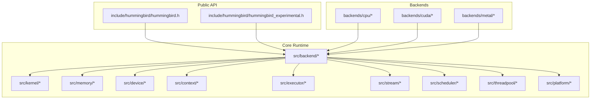
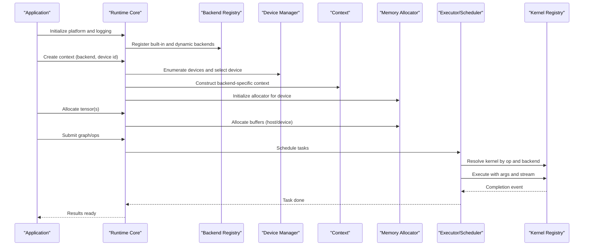
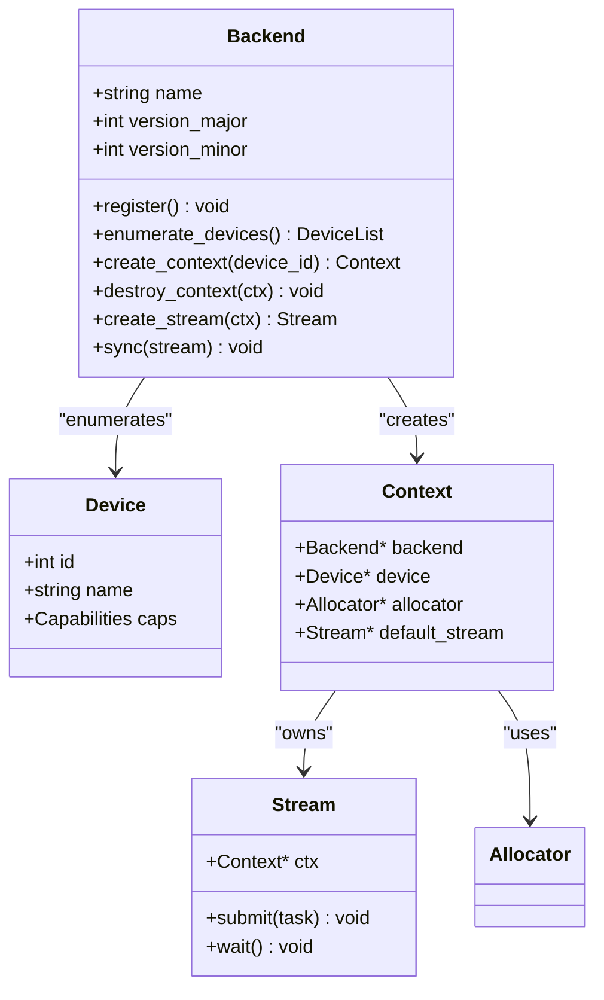
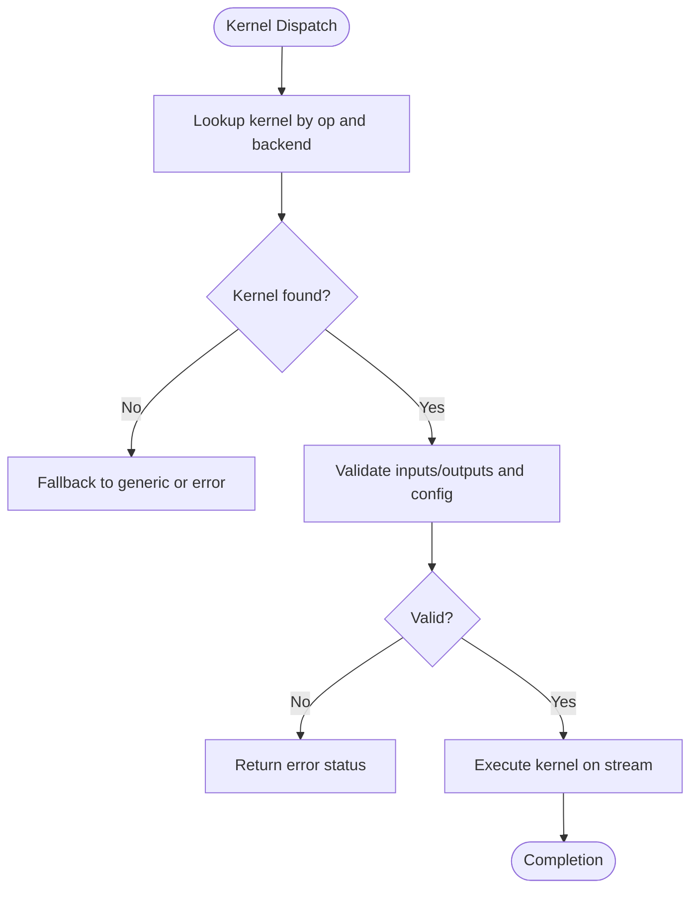
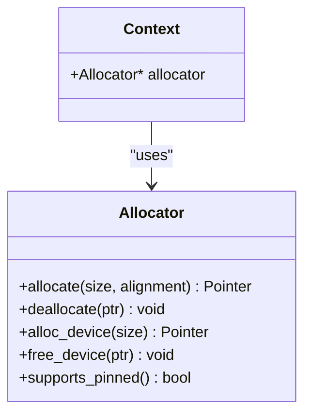
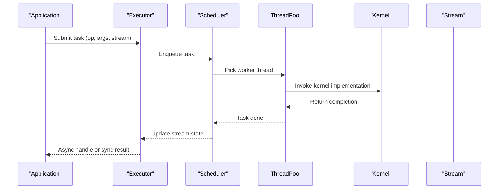
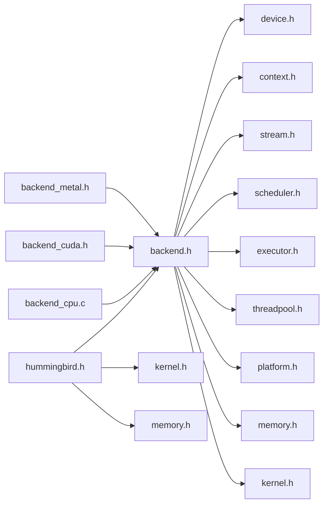

# Custom Plugin Development

<cite>
**Referenced Files in This Document**
- [backend.h](file://src/backend/backend.h)
- [backend.c](file://src/backend/backend.c)
- [backend_internal.h](file://src/backend/backend_internal.h)
- [kernel.h](file://src/kernel/kernel.h)
- [kernel.c](file://src/kernel/kernel.c)
- [kernel_internal.h](file://src/kernel/kernel_internal.h)
- [memory.h](file://src/memory/memory.h)
- [memory.c](file://src/memory/memory.c)
- [memory_internal.h](file://src/memory/memory_internal.h)
- [device.h](file://src/device/device.h)
- [device.c](file://src/device/device.c)
- [device_internal.h](file://src/device/device_internal.h)
- [context.h](file://src/context/context.h)
- [context.c](file://src/context/context.c)
- [context_internal.h](file://src/context/context_internal.h)
- [executor.h](file://src/executor/executor.h)
- [executor.c](file://src/executor/executor.c)
- [executor_internal.h](file://src/executor/executor_internal.h)
- [stream.h](file://src/stream/stream.h)
- [stream.c](file://src/stream/stream.c)
- [stream_internal.h](file://src/stream/stream_internal.h)
- [scheduler.h](file://src/scheduler/scheduler.h)
- [scheduler.c](file://src/scheduler/scheduler.c)
- [scheduler_internal.h](file://src/scheduler/scheduler_internal.h)
- [threadpool.h](file://src/threadpool/threadpool.h)
- [threadpool.c](file://src/threadpool/threadpool.c)
- [platform.h](file://src/platform/platform.h)
- [platform.c](file://src/platform/platform.c)
- [platform_internal.h](file://src/platform/platform_internal.h)
- [hummingbird.h](file://include/hummingbird/hummingbird.h)
- [hummingbird_experimental.h](file://include/hummingbird/hummingbird_experimental.h)
- [backend_cpu.h](file://backends/cpu/backend_cpu.h)
- [backend_cpu.c](file://backends/cpu/backend_cpu.c)
- [backend_cuda.h](file://backends/cuda/backend_cuda.h)
- [backend_metal.h](file://backends/metal/backend_metal.h)
- [CMakeLists.txt](file://CMakeLists.txt)
- [README.md](file://README.md)
</cite>

## Table of Contents
1. [Introduction](#introduction)
2. [Project Structure](#project-structure)
3. [Core Components](#core-components)
4. [Architecture Overview](#architecture-overview)
5. [Detailed Component Analysis](#detailed-component-analysis)
6. [Dependency Analysis](#dependency-analysis)
7. [Performance Considerations](#performance-considerations)
8. [Troubleshooting Guide](#troubleshooting-guide)
9. [Conclusion](#conclusion)
10. [Appendices](#appendices)

## Introduction
This document explains how to develop custom plugins for Hummingbird, focusing on the plugin architecture and extension points for backends, kernels, and memory allocators. It covers interface specifications, registration mechanisms, lifecycle callbacks, testing frameworks, debugging techniques, performance validation, packaging and distribution, version compatibility, security considerations, sandboxing requirements, and best practices for stability and performance. The goal is to enable contributors to implement robust, high-performance extensions that integrate seamlessly with the core runtime.

## Project Structure
Hummingbird organizes its code into modular subsystems under src/, with public APIs exposed via include/. Backends are implemented as separate modules under backends/. The build system uses CMake to compose components and link them into executables or libraries.

**Diagram sources**
- [hummingbird.h](file://include/hummingbird/hummingbird.h)
- [hummingbird_experimental.h](file://include/hummingbird/hummingbird_experimental.h)
- [backend.h](file://src/backend/backend.h)
- [kernel.h](file://src/kernel/kernel.h)
- [memory.h](file://src/memory/memory.h)
- [device.h](file://src/device/device.h)
- [context.h](file://src/context/context.h)
- [executor.h](file://src/executor/executor.h)
- [stream.h](file://src/stream/stream.h)
- [scheduler.h](file://src/scheduler/scheduler.h)
- [threadpool.h](file://src/threadpool/threadpool.h)
- [platform.h](file://src/platform/platform.h)
- [backend_cpu.h](file://backends/cpu/backend_cpu.h)
- [backend_cuda.h](file://backends/cuda/backend_cuda.h)
- [backend_metal.h](file://backends/metal/backend_metal.h)

**Section sources**
- [README.md](file://README.md)
- [CMakeLists.txt](file://CMakeLists.txt)

## Core Components
The plugin surface centers around three primary extension points:
- Backend: A pluggable execution target (e.g., CPU, CUDA, Metal). Backends register themselves with the runtime and provide device enumeration, context creation, kernel dispatch, and resource management.
- Kernel: Fine-grained compute operations (e.g., matmul, conv) registered per backend. Kernels expose signatures for inputs, outputs, and configuration.
- Memory Allocator: Pluggable memory strategies used by backends and kernels for allocation, deallocation, and synchronization.

Key responsibilities:
- Backend manages devices, contexts, streams, and schedules work.
- Kernel implements operation-specific logic and adheres to a stable ABI.
- Memory allocator provides allocation semantics and integrates with device memory spaces.

**Section sources**
- [backend.h](file://src/backend/backend.h)
- [backend.c](file://src/backend/backend.c)
- [backend_internal.h](file://src/backend/backend_internal.h)
- [kernel.h](file://src/kernel/kernel.h)
- [kernel.c](file://src/kernel/kernel.c)
- [kernel_internal.h](file://src/kernel/kernel_internal.h)
- [memory.h](file://src/memory/memory.h)
- [memory.c](file://src/memory/memory.c)
- [memory_internal.h](file://src/memory/memory_internal.h)

## Architecture Overview
At runtime, the core initializes platform services, discovers and registers backends, and exposes a unified API for creating contexts, allocating tensors, and executing kernels. Each backend may define multiple devices and manage their own memory pools and scheduling policies.

**Diagram sources**
- [backend.h](file://src/backend/backend.h)
- [backend.c](file://src/backend/backend.c)
- [device.h](file://src/device/device.h)
- [device.c](file://src/device/device.c)
- [context.h](file://src/context/context.h)
- [context.c](file://src/context/context.c)
- [memory.h](file://src/memory/memory.h)
- [memory.c](file://src/memory/memory.c)
- [executor.h](file://src/executor/executor.h)
- [executor.c](file://src/executor/executor.c)
- [scheduler.h](file://src/scheduler/scheduler.h)
- [scheduler.c](file://src/scheduler/scheduler.c)
- [kernel.h](file://src/kernel/kernel.h)
- [kernel.c](file://src/kernel/kernel.c)

## Detailed Component Analysis

### Backend Plugin Interface and Registration
A backend plugin must:
- Expose a registration function that creates a backend descriptor and registers it with the runtime.
- Implement device enumeration and selection.
- Provide context creation and destruction.
- Offer stream management and synchronization primitives.
- Integrate with the kernel registry to resolve ops.
- Optionally provide a custom memory allocator or bind to an existing one.

Lifecycle callbacks typically include:
- Initialization: probe capabilities, enumerate devices, set default policies.
- Context setup: allocate resources, initialize queues/streams.
- Teardown: release resources, flush pending work.

**Diagram sources**
- [backend.h](file://src/backend/backend.h)
- [backend.c](file://src/backend/backend.c)
- [device.h](file://src/device/device.h)
- [device.c](file://src/device/device.c)
- [context.h](file://src/context/context.h)
- [context.c](file://src/context/context.c)
- [stream.h](file://src/stream/stream.h)
- [stream.c](file://src/stream/stream.c)

**Section sources**
- [backend.h](file://src/backend/backend.h)
- [backend.c](file://src/backend/backend.c)
- [backend_internal.h](file://src/backend/backend_internal.h)
- [device.h](file://src/device/device.h)
- [device.c](file://src/device/device.c)
- [device_internal.h](file://src/device/device_internal.h)
- [context.h](file://src/context/context.h)
- [context.c](file://src/context/context.c)
- [context_internal.h](file://src/context/context_internal.h)
- [stream.h](file://src/stream/stream.h)
- [stream.c](file://src/stream/stream.c)
- [stream_internal.h](file://src/stream/stream_internal.h)

#### Example: Implementing a Custom Backend
Steps:
- Define a backend descriptor conforming to the public interface.
- Implement device enumeration and capability detection.
- Implement context and stream lifecycle functions.
- Register the backend during library initialization.
- Bind to a memory allocator suitable for your device.

Reference paths:
- [backend_cpu.h](file://backends/cpu/backend_cpu.h)
- [backend_cpu.c](file://backends/cpu/backend_cpu.c)
- [backend_cuda.h](file://backends/cuda/backend_cuda.h)
- [backend_metal.h](file://backends/metal/backend_metal.h)

**Section sources**
- [backend_cpu.h](file://backends/cpu/backend_cpu.h)
- [backend_cpu.c](file://backends/cpu/backend_cpu.c)
- [backend_cuda.h](file://backends/cuda/backend_cuda.h)
- [backend_metal.h](file://backends/metal/backend_metal.h)

### Kernel Registration and Dispatch
Kernels are registered per backend and selected at runtime based on operation type, data types, and device capabilities. A kernel entry point receives input/output descriptors and configuration.

**Diagram sources**
- [kernel.h](file://src/kernel/kernel.h)
- [kernel.c](file://src/kernel/kernel.c)
- [kernel_internal.h](file://src/kernel/kernel_internal.h)

**Section sources**
- [kernel.h](file://src/kernel/kernel.h)
- [kernel.c](file://src/kernel/kernel.c)
- [kernel_internal.h](file://src/kernel/kernel_internal.h)

#### Example: Registering Specialized Kernels
- Implement kernel functions matching the expected signature.
- Register kernels with the backend’s kernel registry during backend init.
- Ensure thread-safety and correct stream ordering.

Reference paths:
- [kernel.h](file://src/kernel/kernel.h)
- [kernel.c](file://src/kernel/kernel.c)

**Section sources**
- [kernel.h](file://src/kernel/kernel.h)
- [kernel.c](file://src/kernel/kernel.c)

### Memory Allocator Plugin
Custom allocators should implement:
- Allocation/deallocation for host and device memory.
- Optional zero-copy or pinned memory support.
- Synchronization hooks if needed.
- Integration with backend context.

**Diagram sources**
- [memory.h](file://src/memory/memory.h)
- [memory.c](file://src/memory/memory.c)
- [memory_internal.h](file://src/memory/memory_internal.h)
- [context.h](file://src/context/context.h)
- [context.c](file://src/context/context.c)

**Section sources**
- [memory.h](file://src/memory/memory.h)
- [memory.c](file://src/memory/memory.c)
- [memory_internal.h](file://src/memory/memory_internal.h)
- [context.h](file://src/context/context.h)
- [context.c](file://src/context/context.c)

#### Example: Creating a Custom Memory Management Strategy
- Implement allocation routines tailored to your device or use-case (e.g., pool-based, arena).
- Register the allocator with the backend context.
- Provide metrics and debugging hooks if necessary.

Reference paths:
- [memory.h](file://src/memory/memory.h)
- [memory.c](file://src/memory/memory.c)

**Section sources**
- [memory.h](file://src/memory/memory.h)
- [memory.c](file://src/memory/memory.c)

### Execution, Scheduling, and Threading
Execution flows through executor and scheduler layers, which coordinate task submission and threading via the thread pool. Streams enforce ordering within a device context.

**Diagram sources**
- [executor.h](file://src/executor/executor.h)
- [executor.c](file://src/executor/executor.c)
- [scheduler.h](file://src/scheduler/scheduler.h)
- [scheduler.c](file://src/scheduler/scheduler.c)
- [threadpool.h](file://src/threadpool/threadpool.h)
- [threadpool.c](file://src/threadpool/threadpool.c)
- [stream.h](file://src/stream/stream.h)
- [stream.c](file://src/stream/stream.c)

**Section sources**
- [executor.h](file://src/executor/executor.h)
- [executor.c](file://src/executor/executor.c)
- [executor_internal.h](file://src/executor/executor_internal.h)
- [scheduler.h](file://src/scheduler/scheduler.h)
- [scheduler.c](file://src/scheduler/scheduler.c)
- [scheduler_internal.h](file://src/scheduler/scheduler_internal.h)
- [threadpool.h](file://src/threadpool/threadpool.h)
- [threadpool.c](file://src/threadpool/threadpool.c)
- [stream.h](file://src/stream/stream.h)
- [stream.c](file://src/stream/stream.c)
- [stream_internal.h](file://src/stream/stream_internal.h)

### Platform Abstraction
Platform abstraction isolates OS-specific details such as threading primitives, timers, and logging. Plugins should rely on platform APIs rather than direct OS calls.

**Section sources**
- [platform.h](file://src/platform/platform.h)
- [platform.c](file://src/platform/platform.c)
- [platform_internal.h](file://src/platform/platform_internal.h)

## Dependency Analysis
The following diagram shows key dependencies between core modules and backends.

**Diagram sources**
- [hummingbird.h](file://include/hummingbird/hummingbird.h)
- [backend.h](file://src/backend/backend.h)
- [kernel.h](file://src/kernel/kernel.h)
- [memory.h](file://src/memory/memory.h)
- [device.h](file://src/device/device.h)
- [context.h](file://src/context/context.h)
- [stream.h](file://src/stream/stream.h)
- [scheduler.h](file://src/scheduler/scheduler.h)
- [executor.h](file://src/executor/executor.h)
- [threadpool.h](file://src/threadpool/threadpool.h)
- [platform.h](file://src/platform/platform.h)
- [backend_cpu.c](file://backends/cpu/backend_cpu.c)
- [backend_cuda.h](file://backends/cuda/backend_cuda.h)
- [backend_metal.h](file://backends/metal/backend_metal.h)

**Section sources**
- [backend.h](file://src/backend/backend.h)
- [kernel.h](file://src/kernel/kernel.h)
- [memory.h](file://src/memory/memory.h)
- [device.h](file://src/device/device.h)
- [context.h](file://src/context/context.h)
- [stream.h](file://src/stream/stream.h)
- [scheduler.h](file://src/scheduler/scheduler.h)
- [executor.h](file://src/executor/executor.h)
- [threadpool.h](file://src/threadpool/threadpool.h)
- [platform.h](file://src/platform/platform.h)
- [backend_cpu.c](file://backends/cpu/backend_cpu.c)
- [backend_cuda.h](file://backends/cuda/backend_cuda.h)
- [backend_metal.h](file://backends/metal/backend_metal.h)

## Performance Considerations
- Prefer batched kernel launches and coalesced memory access patterns.
- Use pinned memory for efficient host-device transfers when applicable.
- Minimize synchronization; leverage streams and async execution.
- Profile hot paths using provided profiling hooks and counters.
- Tune thread pool sizing based on workload characteristics.
- Avoid unnecessary allocations; reuse buffers where possible.

[No sources needed since this section provides general guidance]

## Troubleshooting Guide
Common issues and diagnostics:
- Backend not discovered: verify registration occurs before context creation and that symbols are exported correctly.
- Kernel misdispatch: check op-to-kernel mapping and ensure backend capabilities match requested ops.
- Memory errors: validate alignment, size limits, and device memory availability; inspect allocator logs.
- Deadlocks: review stream ordering and synchronization points; ensure no cross-stream dependencies without proper events.
- Profiling: enable profiler hooks and capture timing metadata for tasks and kernels.

Practical references:
- Backend registration and lifecycle: [backend.h](file://src/backend/backend.h), [backend.c](file://src/backend/backend.c)
- Kernel lookup and execution: [kernel.h](file://src/kernel/kernel.h), [kernel.c](file://src/kernel/kernel.c)
- Memory allocation and synchronization: [memory.h](file://src/memory/memory.h), [memory.c](file://src/memory/memory.c)
- Execution and scheduling: [executor.h](file://src/executor/executor.h), [scheduler.h](file://src/scheduler/scheduler.h), [threadpool.h](file://src/threadpool/threadpool.h)

**Section sources**
- [backend.h](file://src/backend/backend.h)
- [backend.c](file://src/backend/backend.c)
- [kernel.h](file://src/kernel/kernel.h)
- [kernel.c](file://src/kernel/kernel.c)
- [memory.h](file://src/memory/memory.h)
- [memory.c](file://src/memory/memory.c)
- [executor.h](file://src/executor/executor.h)
- [scheduler.h](file://src/scheduler/scheduler.h)
- [threadpool.h](file://src/threadpool/threadpool.h)

## Conclusion
By adhering to the backend, kernel, and memory allocator interfaces defined in Hummingbird, developers can create high-performance, portable plugins. Focus on clean separation of concerns, robust lifecycle management, and careful attention to concurrency and memory safety. Use the provided abstractions for platform, scheduling, and execution to ensure compatibility across devices and environments.

[No sources needed since this section summarizes without analyzing specific files]

## Appendices

### Plugin Packaging and Distribution
- Build plugins as shared libraries compatible with the target platform.
- Ensure symbol visibility and export macros align with the public ABI.
- Version your plugin and declare compatibility with the core runtime versions.
- Provide installation scripts or package manifests for discovery and loading.

References:
- Public headers: [hummingbird.h](file://include/hummingbird/hummingbird.h), [hummingbird_experimental.h](file://include/hummingbird/hummingbird_experimental.h)
- Build system: [CMakeLists.txt](file://CMakeLists.txt)

**Section sources**
- [hummingbird.h](file://include/hummingbird/hummingbird.h)
- [hummingbird_experimental.h](file://include/hummingbird/hummingbird_experimental.h)
- [CMakeLists.txt](file://CMakeLists.txt)

### Security and Sandboxing
- Validate all inputs and bounds before kernel execution.
- Restrict plugin privileges; avoid direct OS calls outside platform abstraction.
- Isolate plugin memory spaces where feasible; prefer explicit buffer ownership.
- Audit third-party dependencies and supply chain risks.
- Implement safe fallbacks and graceful degradation on errors.

[No sources needed since this section provides general guidance]

### Testing Frameworks and Validation
- Unit tests: exercise backend registration, device enumeration, and context lifecycle.
- Kernel tests: validate numerical correctness and edge cases across data types.
- Memory tests: stress allocators with varied sizes and lifetimes.
- Integration tests: run representative graphs end-to-end on each backend.
- Property tests: assert invariants like memory alignment and stream ordering.

References:
- Backend test structure: [backend_test.c](file://src/backend/backend_test.c)
- Kernel test structure: [kernel_test.c](file://src/kernel/kernel_test.c)
- Memory test structure: [memory_test.c](file://src/memory/memory_test.c)

**Section sources**
- [backend_test.c](file://src/backend/backend_test.c)
- [kernel_test.c](file://src/kernel/kernel_test.c)
- [memory_test.c](file://src/memory/memory_test.c)

### Debugging Techniques
- Enable verbose logging via platform logging hooks.
- Use profiler annotations around critical sections.
- Inspect stream states and task queues for ordering issues.
- Add assertion checks for preconditions in kernels and allocators.
- Reproduce failures deterministically by fixing seeds and inputs.

References:
- Logging: [logging.h](file://src/logging/logging.h)
- Profiler: [profiler.h](file://src/profiler/profiler.h)
- Platform utilities: [platform.h](file://src/platform/platform.h)

**Section sources**
- [logging.h](file://src/logging/logging.h)
- [profiler.h](file://src/profiler/profiler.h)
- [platform.h](file://src/platform/platform.h)