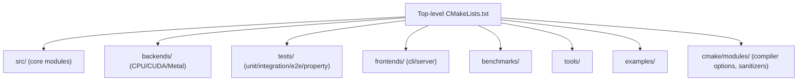
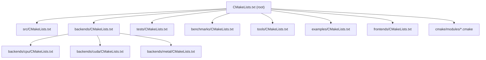
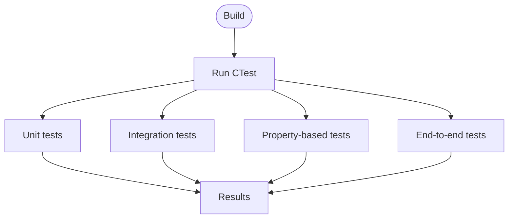
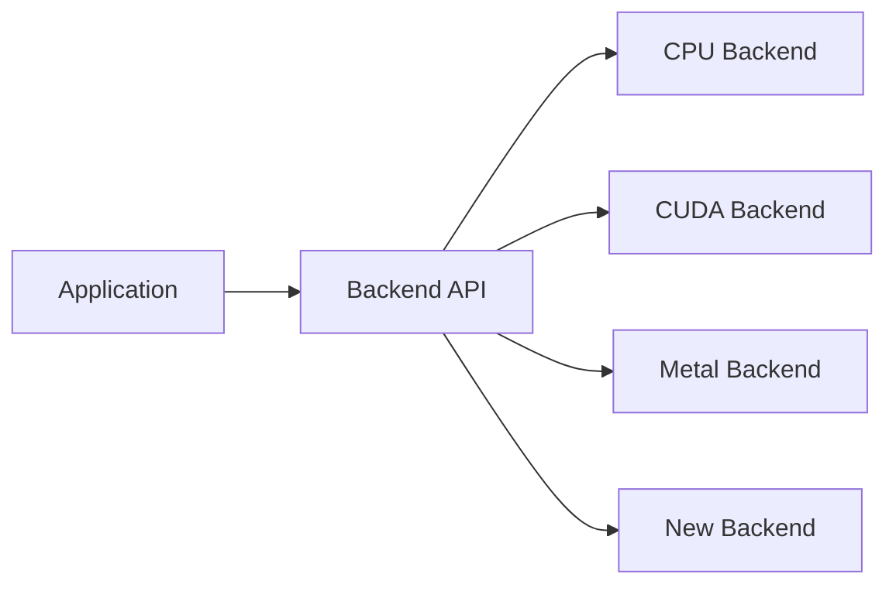
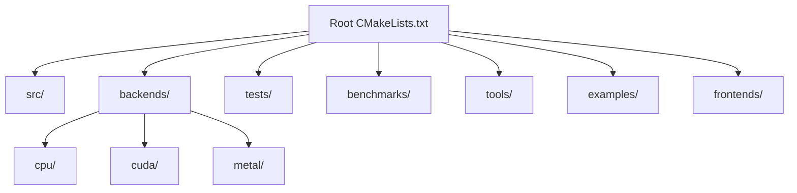

# Development Guide

<cite>
**Referenced Files in This Document**
- [CMakeLists.txt](file://CMakeLists.txt)
- [CMakePresets.json](file://CMakePresets.json)
- [cmake/README.md](file://cmake/README.md)
- [cmake/modules/HBCompilerOptions.cmake](file://cmake/modules/HBCompilerOptions.cmake)
- [cmake/modules/HBSanitizers.cmake](file://cmake/modules/HBSanitizers.cmake)
- [src/CMakeLists.txt](file://src/CMakeLists.txt)
- [backends/CMakeLists.txt](file://backends/CMakeLists.txt)
- [backends/cpu/CMakeLists.txt](file://backends/cpu/CMakeLists.txt)
- [backends/cuda/CMakeLists.txt](file://backends/cuda/CMakeLists.txt)
- [backends/metal/CMakeLists.txt](file://backends/metal/CMakeLists.txt)
- [tests/CMakeLists.txt](file://tests/CMakeLists.txt)
- [tests/support/hbi_test.h](file://tests/support/hbi_test.h)
- [scripts/scaffold_modules.sh](file://scripts/scaffold_modules.sh)
- [scripts/README.md](file://scripts/README.md)
- [.clang-format](file://.clang-format)
- [.clang-tidy](file://.clang-tidy)
- [.editorconfig](file://.editorconfig)
- [CONTRIBUTING.md](file://CONTRIBUTING.md)
- [install.sh](file://install.sh)
</cite>

## Table of Contents
1. Introduction
2. Project Structure
3. Core Components
4. Architecture Overview
5. Detailed Component Analysis
6. Dependency Analysis
7. Performance Considerations
8. Troubleshooting Guide
9. Conclusion
10. Appendices

## Introduction
This guide explains how to build, test, and extend Hummingbird during development. It covers the CMake-based build system, testing infrastructure (unit, integration, property-based), code quality tooling, development workflow, adding new backends and kernels, debugging and profiling, continuous integration setup, coding conventions, and contribution procedures.

## Project Structure
The repository is organized into feature modules under src/, optional hardware backends under backends/, frontends for CLI and server, tests across unit/integration/e2e/property categories, and shared build configuration via CMake. The top-level CMakeLists.txt orchestrates subprojects and presets are provided for common workflows.

**Diagram sources**
- [CMakeLists.txt](file://CMakeLists.txt)
- [src/CMakeLists.txt](file://src/CMakeLists.txt)
- [backends/CMakeLists.txt](file://backends/CMakeLists.txt)
- [tests/CMakeLists.txt](file://tests/CMakeLists.txt)

**Section sources**
- [CMakeLists.txt](file://CMakeLists.txt)
- [CMakePresets.json](file://CMakePresets.json)

## Core Components
- Build system: Top-level CMake project with subdirectories for src, backends, tests, benchmarks, tools, examples, and frontends. Presets simplify common configurations.
- Modules: Each feature area under src/ is a module with its own CMakeLists.txt and internal/public headers.
- Backends: Hardware-specific implementations under backends/ (CPU, CUDA, Metal).
- Tests: Unit tests co-located with modules; additional suites under tests/.
- Quality tooling: .clang-format, .clang-tidy, .editorconfig, and CMake modules for compiler flags and sanitizers.

Key build and configuration files:
- Top-level orchestration and presets: [CMakeLists.txt](file://CMakeLists.txt), [CMakePresets.json](file://CMakePresets.json)
- Module aggregation: [src/CMakeLists.txt](file://src/CMakeLists.txt)
- Backend aggregation: [backends/CMakeLists.txt](file://backends/CMakeLists.txt)
- Backend modules: [backends/cpu/CMakeLists.txt](file://backends/cpu/CMakeLists.txt), [backends/cuda/CMakeLists.txt](file://backends/cuda/CMakeLists.txt), [backends/metal/CMakeLists.txt](file://backends/metal/CMakeLists.txt)
- Test aggregation: [tests/CMakeLists.txt](file://tests/CMakeLists.txt)
- Compiler options and sanitizers: [cmake/modules/HBCompilerOptions.cmake](file://cmake/modules/HBCompilerOptions.cmake), [cmake/modules/HBSanitizers.cmake](file://cmake/modules/HBSanitizers.cmake)
- Code style and editor config: [.clang-format](file://.clang-format), [.clang-tidy](file://.clang-tidy), [.editorconfig](file://.editorconfig)

**Section sources**
- [CMakeLists.txt](file://CMakeLists.txt)
- [CMakePresets.json](file://CMakePresets.json)
- [src/CMakeLists.txt](file://src/CMakeLists.txt)
- [backends/CMakeLists.txt](file://backends/CMakeLists.txt)
- [backends/cpu/CMakeLists.txt](file://backends/cpu/CMakeLists.txt)
- [backends/cuda/CMakeLists.txt](file://backends/cuda/CMakeLists.txt)
- [backends/metal/CMakeLists.txt](file://backends/metal/CMakeLists.txt)
- [tests/CMakeLists.txt](file://tests/CMakeLists.txt)
- [cmake/modules/HBCompilerOptions.cmake](file://cmake/modules/HBCompilerOptions.cmake)
- [cmake/modules/HBSanitizers.cmake](file://cmake/modules/HBSanitizers.cmake)
- [.clang-format](file://.clang-format)
- [.clang-tidy](file://.clang-tidy)
- [.editorconfig](file://.editorconfig)

## Architecture Overview
At a high level, the build system composes core modules from src/, optionally links selected backends from backends/, and builds tests and utilities. The following diagram maps the primary CMake entry points and their relationships.

**Diagram sources**
- [CMakeLists.txt](file://CMakeLists.txt)
- [src/CMakeLists.txt](file://src/CMakeLists.txt)
- [backends/CMakeLists.txt](file://backends/CMakeLists.txt)
- [backends/cpu/CMakeLists.txt](file://backends/cpu/CMakeLists.txt)
- [backends/cuda/CMakeLists.txt](file://backends/cuda/CMakeLists.txt)
- [backends/metal/CMakeLists.txt](file://backends/metal/CMakeLists.txt)
- [tests/CMakeLists.txt](file://tests/CMakeLists.txt)
- [benchmarks/CMakeLists.txt](file://benchmarks/CMakeLists.txt)
- [tools/CMakeLists.txt](file://tools/CMakeLists.txt)
- [examples/CMakeLists.txt](file://examples/CMakeLists.txt)
- [frontends/CMakeLists.txt](file://frontends/CMakeLists.txt)
- [cmake/modules/HBCompilerOptions.cmake](file://cmake/modules/HBCompilerOptions.cmake)
- [cmake/modules/HBSanitizers.cmake](file://cmake/modules/HBSanitizers.cmake)

## Detailed Component Analysis

### Build System Configuration (CMake)
- Root configuration: The root CMakeLists.txt defines the project, includes presets, and adds subdirectories for src, backends, tests, benchmarks, tools, examples, and frontends.
- Presets: CMakePresets.json provides common configurations (configure/build/test/package) to streamline local development and CI.
- Compiler options and sanitizers: cmake/modules contains reusable modules for compiler flags and sanitizer support.
- Module organization: Each directory under src/ has its own CMakeLists.txt to define targets and dependencies.
- Backend selection: backends/CMakeLists.txt aggregates backend modules; individual backends have their own CMakeLists.txt.

Recommended local workflow:
- Configure using presets or manually with CMake.
- Build all targets or specific ones (e.g., library, tests, benchmarks).
- Run tests via CTest.

**Section sources**
- [CMakeLists.txt](file://CMakeLists.txt)
- [CMakePresets.json](file://CMakePresets.json)
- [cmake/README.md](file://cmake/README.md)
- [cmake/modules/HBCompilerOptions.cmake](file://cmake/modules/HBCompilerOptions.cmake)
- [cmake/modules/HBSanitizers.cmake](file://cmake/modules/HBSanitizers.cmake)
- [src/CMakeLists.txt](file://src/CMakeLists.txt)
- [backends/CMakeLists.txt](file://backends/CMakeLists.txt)
- [backends/cpu/CMakeLists.txt](file://backends/cpu/CMakeLists.txt)
- [backends/cuda/CMakeLists.txt](file://backends/cuda/CMakeLists.txt)
- [backends/metal/CMakeLists.txt](file://backends/metal/CMakeLists.txt)

### Testing Framework Usage
- Aggregation: tests/CMakeLists.txt wires up test targets and integrates with CTest.
- Support utilities: tests/support/hbi_test.h provides helpers used by unit tests.
- Test categories:
  - Unit tests: Co-located with modules under src/ and/or tests/.
  - Integration tests: Under tests/integration/.
  - Property-based tests: Under tests/property/.
  - End-to-end tests: Under tests/e2e/.
- Running tests: Use CTest after building; filters can be applied per suite.

**Diagram sources**
- [tests/CMakeLists.txt](file://tests/CMakeLists.txt)
- [tests/support/hbi_test.h](file://tests/support/hbi_test.h)

**Section sources**
- [tests/CMakeLists.txt](file://tests/CMakeLists.txt)
- [tests/support/hbi_test.h](file://tests/support/hbi_test.h)

### Code Generation and Scaffolding
- Scaffold script: scripts/scaffold_modules.sh helps generate boilerplate for new modules.
- Documentation: scripts/README.md describes usage and expectations.

Usage outline:
- Execute the scaffold script from the repository root.
- Follow prompts to create a new module directory and files.
- Register the new module in the appropriate CMakeLists.txt.

**Section sources**
- [scripts/scaffold_modules.sh](file://scripts/scaffold_modules.sh)
- [scripts/README.md](file://scripts/README.md)

### Adding a New Backend
Backends encapsulate device-specific implementations. To add a new backend:
- Create a new directory under backends/ with its own CMakeLists.txt.
- Implement backend entry points and kernel dispatch as needed.
- Wire the backend into backends/CMakeLists.txt so it is built when enabled.
- Add backend-specific tests if applicable.

**Diagram sources**
- [backends/CMakeLists.txt](file://backends/CMakeLists.txt)
- [backends/cpu/CMakeLists.txt](file://backends/cpu/CMakeLists.txt)
- [backends/cuda/CMakeLists.txt](file://backends/cuda/CMakeLists.txt)
- [backends/metal/CMakeLists.txt](file://backends/metal/CMakeLists.txt)

**Section sources**
- [backends/CMakeLists.txt](file://backends/CMakeLists.txt)
- [backends/cpu/CMakeLists.txt](file://backends/cpu/CMakeLists.txt)
- [backends/cuda/CMakeLists.txt](file://backends/cuda/CMakeLists.txt)
- [backends/metal/CMakeLists.txt](file://backends/metal/CMakeLists.txt)

### Implementing Custom Kernels
Kernels implement compute-intensive operations. Guidelines:
- Place kernel implementations in the relevant backend or kernel module.
- Ensure consistent function signatures and error handling patterns.
- Provide unit tests validating correctness and performance characteristics.
- Update documentation and any public headers if exposing APIs.

[No sources needed since this section provides general guidance]

### Extending Existing Functionality
When extending features:
- Keep changes localized to the relevant module under src/.
- Add or update tests alongside implementation.
- Update CMakeLists.txt only if introducing new targets or dependencies.
- Follow existing naming and structure conventions.

[No sources needed since this section provides general guidance]

### Debugging Techniques
- Enable debug builds via CMake presets or configure flags.
- Use sanitizers through cmake/modules/HBSanitizers.cmake where supported.
- Leverage logging facilities within modules for runtime diagnostics.
- Attach native debuggers to binaries produced by the build system.

**Section sources**
- [cmake/modules/HBSanitizers.cmake](file://cmake/modules/HBSanitizers.cmake)

### Profiling During Development
- Build benchmark targets under benchmarks/ to measure performance.
- Use platform profilers (e.g., perf, Instruments) on generated binaries.
- Instrument hot paths selectively and compare before/after changes.

**Section sources**
- [benchmarks/CMakeLists.txt](file://benchmarks/CMakeLists.txt)

### Continuous Integration Setup
- GitHub Actions workflows reside under .github/workflows/.
- Workflows typically use CMake presets to configure, build, and test.
- Artifacts and reports can be uploaded as needed.

**Section sources**
- [.github/workflows](file://.github/workflows)

### Coding Conventions and Tooling
- Formatting: .clang-format enforces consistent formatting.
- Linting: .clang-tidy applies static analysis rules.
- Editor settings: .editorconfig standardizes indentation and line endings.
- Apply pre-commit checks locally before pushing changes.

**Section sources**
- [.clang-format](file://.clang-format)
- [.clang-tidy](file://.clang-tidy)
- [.editorconfig](file://.editorconfig)

### Pull Request Procedures and Contribution Guidelines
- Review CONTRIBUTING.md for end-to-end contribution process.
- Ensure tests pass locally and CI succeeds.
- Include clear descriptions, rationale, and references to issues when applicable.
- Keep PRs focused and incremental.

**Section sources**
- [CONTRIBUTING.md](file://CONTRIBUTING.md)

## Dependency Analysis
The build graph shows how the root CMake file composes subprojects and how backends integrate.

**Diagram sources**
- [CMakeLists.txt](file://CMakeLists.txt)
- [src/CMakeLists.txt](file://src/CMakeLists.txt)
- [backends/CMakeLists.txt](file://backends/CMakeLists.txt)
- [backends/cpu/CMakeLists.txt](file://backends/cpu/CMakeLists.txt)
- [backends/cuda/CMakeLists.txt](file://backends/cuda/CMakeLists.txt)
- [backends/metal/CMakeLists.txt](file://backends/metal/CMakeLists.txt)
- [tests/CMakeLists.txt](file://tests/CMakeLists.txt)
- [benchmarks/CMakeLists.txt](file://benchmarks/CMakeLists.txt)
- [tools/CMakeLists.txt](file://tools/CMakeLists.txt)
- [examples/CMakeLists.txt](file://examples/CMakeLists.txt)
- [frontends/CMakeLists.txt](file://frontends/CMakeLists.txt)

**Section sources**
- [CMakeLists.txt](file://CMakeLists.txt)
- [src/CMakeLists.txt](file://src/CMakeLists.txt)
- [backends/CMakeLists.txt](file://backends/CMakeLists.txt)
- [tests/CMakeLists.txt](file://tests/CMakeLists.txt)

## Performance Considerations
- Prefer minimal allocations in hot paths.
- Use backend-specific optimizations (vectorization, parallelism) where available.
- Validate improvements with benchmarks under benchmarks/.
- Profile with system tools and consider enabling sanitizers cautiously in dev builds.

[No sources needed since this section provides general guidance]

## Troubleshooting Guide
Common issues and resolutions:
- Build failures due to missing dependencies: Verify third-party requirements and environment variables.
- Test failures: Inspect logs from CTest output; run targeted tests to isolate issues.
- Sanitizer errors: Reproduce with sanitizers enabled to catch undefined behavior early.
- Backend linking problems: Confirm backend targets are included and correctly configured.

Helpful scripts and configs:
- Install helper: install.sh may assist with environment setup.
- Presets: Use CMakePresets.json for reproducible configurations.

**Section sources**
- [install.sh](file://install.sh)
- [CMakePresets.json](file://CMakePresets.json)

## Conclusion
This guide outlined the build system, testing strategy, code quality practices, and development workflow for contributing to Hummingbird. By following these instructions—especially around CMake configuration, testing, scaffolding, backend addition, and CI—you can contribute effectively and maintain high standards across the codebase.

## Appendices

### Quickstart Commands
- Configure and build using presets:
  - Configure: cmake --preset=default
  - Build: cmake --build build --config Release
  - Test: ctest --test-dir build --output-on-failure
- Run a single test target:
  - ctest -R <target_name> --test-dir build

[No sources needed since this section provides general guidance]