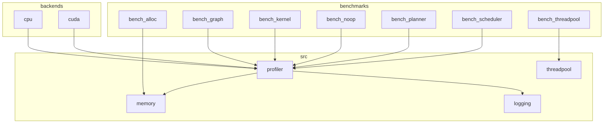
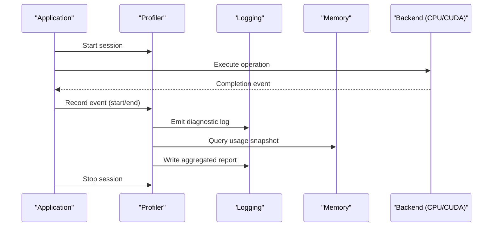
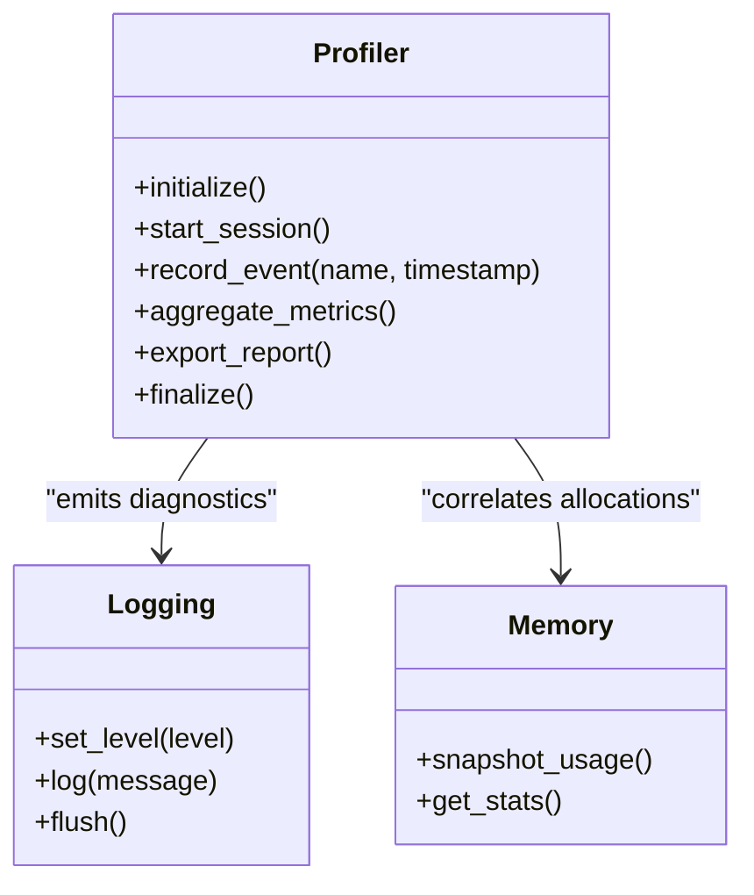
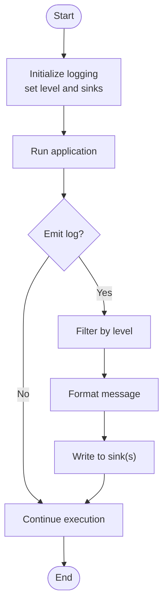
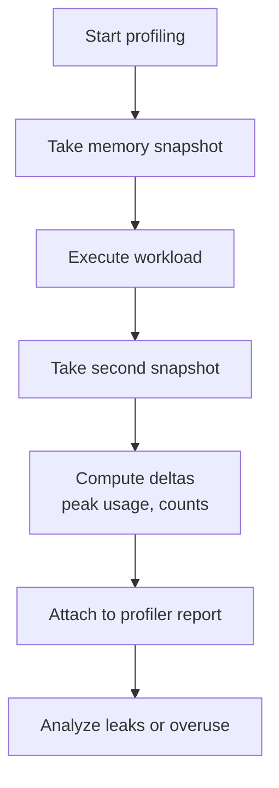
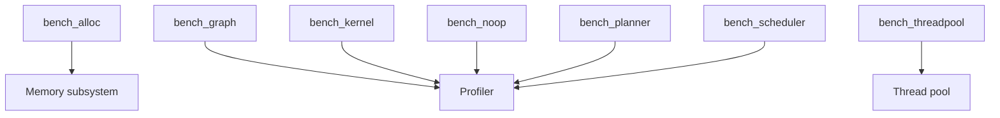
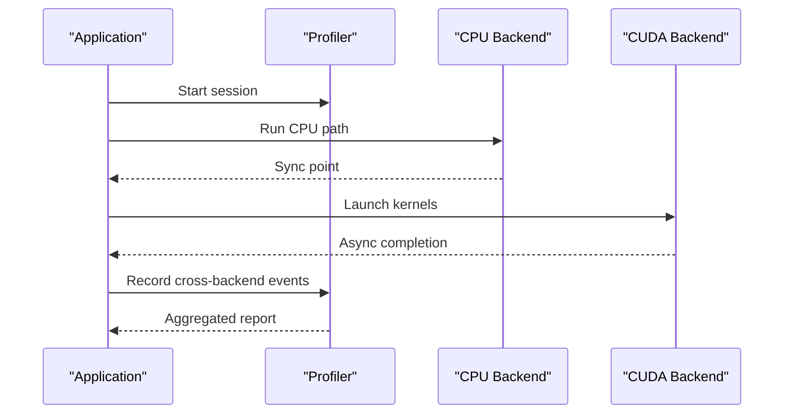
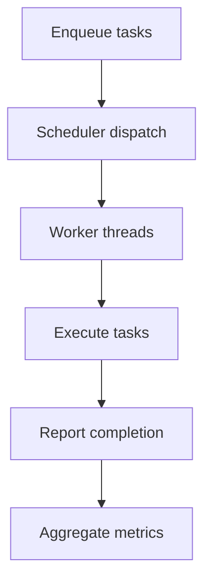
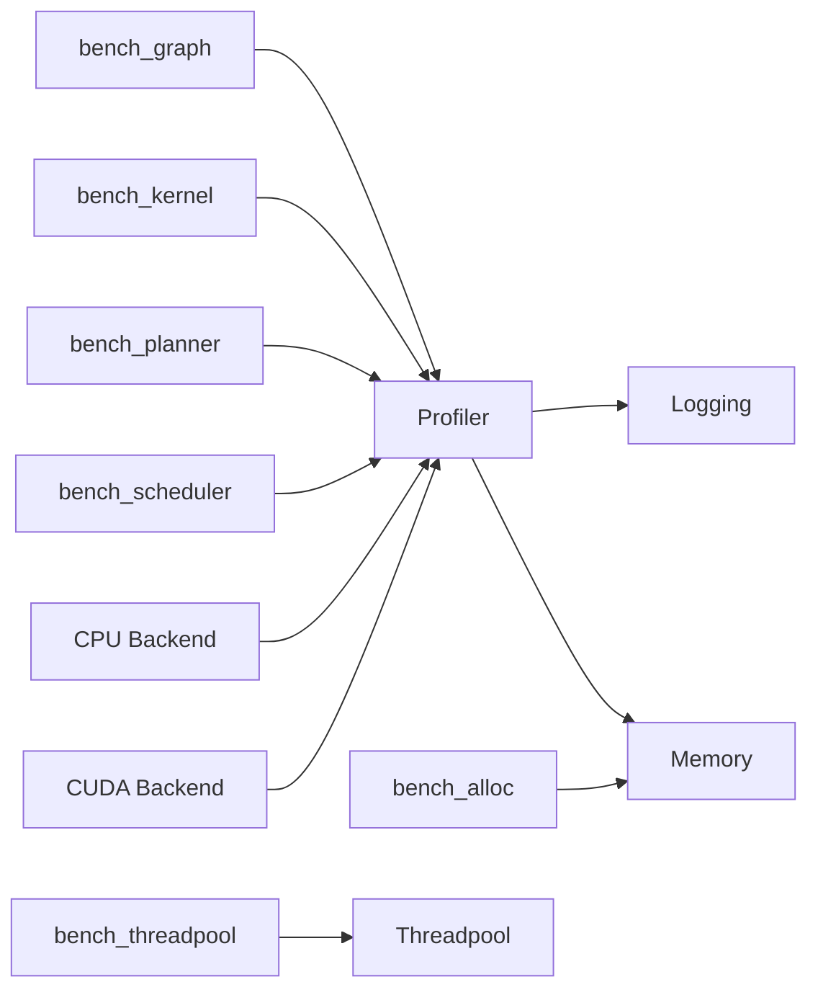

# Debugging and Profiling Tools

<cite>
**Referenced Files in This Document**
- [profiler.c](file://src/profiler/profiler.c)
- [profiler.h](file://src/profiler/profiler.h)
- [profiler_internal.h](file://src/profiler/profiler_internal.h)
- [logging.c](file://src/logging/logging.c)
- [logging.h](file://src/logging/logging.h)
- [logging_internal.h](file://src/logging/logging_internal.h)
- [memory.c](file://src/memory/memory.c)
- [memory.h](file://src/memory/memory.h)
- [memory_internal.h](file://src/memory/memory_internal.h)
- [bench_alloc.c](file://benchmarks/bench_alloc.c)
- [bench_graph.c](file://benchmarks/bench_graph.c)
- [bench_kernel.c](file://benchmarks/bench_kernel.c)
- [bench_noop.c](file://benchmarks/bench_noop.c)
- [bench_planner.c](file://benchmarks/bench_planner.c)
- [bench_scheduler.c](file://benchmarks/bench_scheduler.c)
- [bench_threadpool.c](file://benchmarks/bench_threadpool.c)
- [CMakeLists.txt](file://benchmarks/CMakeLists.txt)
- [backend_cpu.c](file://backends/cpu/backend_cpu.c)
- [backend_cuda.cu](file://backends/cuda/backend_cuda.cu)
- [threadpool.c](file://src/threadpool/threadpool.c)
- [threadpool.h](file://src/threadpool/threadpool.h)
</cite>

## Table of Contents
1. [Introduction](#introduction)
2. [Project Structure](#project-structure)
3. [Core Components](#core-components)
4. [Architecture Overview](#architecture-overview)
5. [Detailed Component Analysis](#detailed-component-analysis)
6. [Dependency Analysis](#dependency-analysis)
7. [Performance Considerations](#performance-considerations)
8. [Troubleshooting Guide](#troubleshooting-guide)
9. [Conclusion](#conclusion)
10. [Appendices](#appendices)

## Introduction
This document explains Hummingbird’s debugging and profiling capabilities with a focus on:
- Built-in profiler system for performance analysis, memory usage tracking, and bottleneck identification
- Logging mechanisms, log levels, and output formats for runtime diagnostics
- Benchmarking tools to measure allocation, graph operations, kernel execution, planning, scheduling, and thread pool behavior
- Debugging techniques for multi-backend applications, memory leak detection, and concurrency issues
- Guidance for using external tools (gdb, valgrind, perf) with Hummingbird applications
- Performance tuning workflows and optimization strategies based on profiling results

## Project Structure
The relevant components for debugging and profiling are organized under src/ and benchmarks/:
- Profiler: src/profiler/
- Logging: src/logging/
- Memory: src/memory/
- Thread Pool: src/threadpool/
- Backends: backends/cpu/, backends/cuda/
- Benchmarks: benchmarks/

**Diagram sources**
- [profiler.c](file://src/profiler/profiler.c)
- [logging.c](file://src/logging/logging.c)
- [memory.c](file://src/memory/memory.c)
- [threadpool.c](file://src/threadpool/threadpool.c)
- [backend_cpu.c](file://backends/cpu/backend_cpu.c)
- [backend_cuda.cu](file://backends/cuda/backend_cuda.cu)
- [bench_alloc.c](file://benchmarks/bench_alloc.c)
- [bench_graph.c](file://benchmarks/bench_graph.c)
- [bench_kernel.c](file://benchmarks/bench_kernel.c)
- [bench_noop.c](file://benchmarks/bench_noop.c)
- [bench_planner.c](file://benchmarks/bench_planner.c)
- [bench_scheduler.c](file://benchmarks/bench_scheduler.c)
- [bench_threadpool.c](file://benchmarks/bench_threadpool.c)

**Section sources**
- [profiler.c](file://src/profiler/profiler.c)
- [logging.c](file://src/logging/logging.c)
- [memory.c](file://src/memory/memory.c)
- [threadpool.c](file://src/threadpool/threadpool.c)
- [backend_cpu.c](file://backends/cpu/backend_cpu.c)
- [backend_cuda.cu](file://backends/cuda/backend_cuda.cu)
- [bench_alloc.c](file://benchmarks/bench_alloc.c)
- [bench_graph.c](file://benchmarks/bench_graph.c)
- [bench_kernel.c](file://benchmarks/bench_kernel.c)
- [bench_noop.c](file://benchmarks/bench_noop.c)
- [bench_planner.c](file://benchmarks/bench_planner.c)
- [bench_scheduler.c](file://benchmarks/bench_scheduler.c)
- [bench_threadpool.c](file://benchmarks/bench_threadpool.c)

## Core Components
- Profiler: Captures timing events, aggregates metrics, and exposes APIs to start/stop profiling sessions and query results. It integrates with logging and memory subsystems to correlate performance data with allocations and logs.
- Logging: Provides structured logging with configurable levels and output destinations. It is used by the profiler and other subsystems to emit diagnostic information.
- Memory: Tracks allocations and can expose usage statistics useful for leak detection and capacity planning.
- Thread Pool: Used by scheduler and kernels; profiling thread contention and utilization helps identify concurrency bottlenecks.

Key responsibilities:
- Profiler: event instrumentation, aggregation, reporting
- Logging: level filtering, formatting, sinks
- Memory: allocation tracking, usage queries
- Thread Pool: task dispatch, concurrency metrics

**Section sources**
- [profiler.h](file://src/profiler/profiler.h)
- [profiler_internal.h](file://src/profiler/profiler_internal.h)
- [logging.h](file://src/logging/logging.h)
- [logging_internal.h](file://src/logging/logging_internal.h)
- [memory.h](file://src/memory/memory.h)
- [memory_internal.h](file://src/memory/memory_internal.h)
- [threadpool.h](file://src/threadpool/threadpool.h)

## Architecture Overview
The profiler sits at the core of performance analysis. It records timestamps around critical sections, aggregates per-operation or per-kernel metrics, and writes reports via the logging subsystem. Memory tracking complements this by correlating allocations with execution phases.

**Diagram sources**
- [profiler.c](file://src/profiler/profiler.c)
- [logging.c](file://src/logging/logging.c)
- [memory.c](file://src/memory/memory.c)
- [backend_cpu.c](file://backends/cpu/backend_cpu.c)
- [backend_cuda.cu](file://backends/cuda/backend_cuda.cu)

## Detailed Component Analysis

### Profiler System
The profiler provides APIs to:
- Initialize and configure profiling sessions
- Mark entry/exit points for functions, kernels, and graph nodes
- Aggregate timings and produce summaries
- Integrate with logging for human-readable diagnostics

**Diagram sources**
- [profiler.h](file://src/profiler/profiler.h)
- [profiler_internal.h](file://src/profiler/profiler_internal.h)
- [logging.h](file://src/logging/logging.h)
- [memory.h](file://src/memory/memory.h)

**Section sources**
- [profiler.c](file://src/profiler/profiler.c)
- [profiler.h](file://src/profiler/profiler.h)
- [profiler_internal.h](file://src/profiler/profiler_internal.h)

### Logging Mechanisms
Logging supports:
- Configurable log levels (e.g., debug, info, warn, error)
- Structured messages with context tags
- Output sinks (console, file, or custom handlers)
- Integration with profiler for performance-related logs

Typical workflow:
- Set log level at startup
- Emit logs from hot paths sparingly to avoid overhead
- Use structured fields for machine parsing

**Diagram sources**
- [logging.h](file://src/logging/logging.h)
- [logging_internal.h](file://src/logging/logging_internal.h)
- [logging.c](file://src/logging/logging.c)

**Section sources**
- [logging.c](file://src/logging/logging.c)
- [logging.h](file://src/logging/logging.h)
- [logging_internal.h](file://src/logging/logging_internal.h)

### Memory Usage Tracking
Memory tracking enables:
- Allocation snapshots during profiling sessions
- Statistics such as peak usage, allocation counts, and fragmentation indicators
- Correlation between allocations and execution phases to identify hotspots

**Diagram sources**
- [memory.h](file://src/memory/memory.h)
- [memory_internal.h](file://src/memory/memory_internal.h)
- [memory.c](file://src/memory/memory.c)

**Section sources**
- [memory.c](file://src/memory/memory.c)
- [memory.h](file://src/memory/memory.h)
- [memory_internal.h](file://src/memory/memory_internal.h)

### Benchmarking Tools
Hummingbird includes dedicated benchmarks for:
- Allocation performance: bench_alloc
- Graph operations: bench_graph
- Kernel execution: bench_kernel
- No-op baseline: bench_noop
- Planner efficiency: bench_planner
- Scheduler throughput: bench_scheduler
- Thread pool behavior: bench_threadpool

These tools exercise specific subsystems and report timing and resource usage suitable for regression testing and optimization validation.

**Diagram sources**
- [bench_alloc.c](file://benchmarks/bench_alloc.c)
- [bench_graph.c](file://benchmarks/bench_graph.c)
- [bench_kernel.c](file://benchmarks/bench_kernel.c)
- [bench_noop.c](file://benchmarks/bench_noop.c)
- [bench_planner.c](file://benchmarks/bench_planner.c)
- [bench_scheduler.c](file://benchmarks/bench_scheduler.c)
- [bench_threadpool.c](file://benchmarks/bench_threadpool.c)
- [CMakeLists.txt](file://benchmarks/CMakeLists.txt)

**Section sources**
- [bench_alloc.c](file://benchmarks/bench_alloc.c)
- [bench_graph.c](file://benchmarks/bench_graph.c)
- [bench_kernel.c](file://benchmarks/bench_kernel.c)
- [bench_noop.c](file://benchmarks/bench_noop.c)
- [bench_planner.c](file://benchmarks/bench_planner.c)
- [bench_scheduler.c](file://benchmarks/bench_scheduler.c)
- [bench_threadpool.c](file://benchmarks/bench_threadpool.c)
- [CMakeLists.txt](file://benchmarks/CMakeLists.txt)

### Multi-Backend Debugging
Backends include CPU and CUDA implementations. Profiling across backends requires:
- Consistent event naming and tagging
- Backend-specific synchronization points
- Separate profiling sessions per backend when needed

**Diagram sources**
- [backend_cpu.c](file://backends/cpu/backend_cpu.c)
- [backend_cuda.cu](file://backends/cuda/backend_cuda.cu)
- [profiler.c](file://src/profiler/profiler.c)

**Section sources**
- [backend_cpu.c](file://backends/cpu/backend_cpu.c)
- [backend_cuda.cu](file://backends/cuda/backend_cuda.cu)
- [profiler.c](file://src/profiler/profiler.c)

### Concurrency and Threading
The thread pool manages task execution. Profiling should capture:
- Task enqueue/dequeue times
- Worker utilization and idle time
- Contention points and lock waits

**Diagram sources**
- [threadpool.c](file://src/threadpool/threadpool.c)
- [threadpool.h](file://src/threadpool/threadpool.h)

**Section sources**
- [threadpool.c](file://src/threadpool/threadpool.c)
- [threadpool.h](file://src/threadpool/threadpool.h)

## Dependency Analysis
The profiler depends on logging and memory subsystems. Benchmarks depend on the profiler and target subsystems. Backends integrate with the profiler for cross-platform timing.

**Diagram sources**
- [profiler.c](file://src/profiler/profiler.c)
- [logging.c](file://src/logging/logging.c)
- [memory.c](file://src/memory/memory.c)
- [threadpool.c](file://src/threadpool/threadpool.c)
- [backend_cpu.c](file://backends/cpu/backend_cpu.c)
- [backend_cuda.cu](file://backends/cuda/backend_cuda.cu)
- [bench_alloc.c](file://benchmarks/bench_alloc.c)
- [bench_graph.c](file://benchmarks/bench_graph.c)
- [bench_kernel.c](file://benchmarks/bench_kernel.c)
- [bench_planner.c](file://benchmarks/bench_planner.c)
- [bench_scheduler.c](file://benchmarks/bench_scheduler.c)
- [bench_threadpool.c](file://benchmarks/bench_threadpool.c)

**Section sources**
- [profiler.c](file://src/profiler/profiler.c)
- [logging.c](file://src/logging/logging.c)
- [memory.c](file://src/memory/memory.c)
- [threadpool.c](file://src/threadpool/threadpool.c)
- [backend_cpu.c](file://backends/cpu/backend_cpu.c)
- [backend_cuda.cu](file://backends/cuda/backend_cuda.cu)
- [bench_alloc.c](file://benchmarks/bench_alloc.c)
- [bench_graph.c](file://benchmarks/bench_graph.c)
- [bench_kernel.c](file://benchmarks/bench_kernel.c)
- [bench_planner.c](file://benchmarks/bench_planner.c)
- [bench_scheduler.c](file://benchmarks/bench_scheduler.c)
- [bench_threadpool.c](file://benchmarks/bench_threadpool.c)

## Performance Considerations
- Keep profiling overhead low: use coarse-grained events in hot paths and fine-grained events only where necessary
- Prefer batched aggregation: collect events and summarize at session boundaries
- Avoid excessive logging in tight loops; enable higher log levels only for targeted runs
- Use separate profiles per backend to isolate device vs host costs
- Validate benchmark inputs and warm-up phases to reduce noise

[No sources needed since this section provides general guidance]

## Troubleshooting Guide
Common issues and remedies:
- Missing or inconsistent events: ensure every backend path records start/end markers
- High overhead from logging: reduce verbosity and filter by level
- Memory growth during runs: take periodic snapshots and compare deltas
- Concurrency stalls: inspect thread pool metrics and worker utilization
- Cross-backend synchronization: verify async completion hooks are recorded

External tool integration:
- gdb: attach to running processes, set breakpoints at key profiler/logging calls
- valgrind: detect memory leaks and invalid accesses; run benchmarks under valgrind for targeted checks
- perf: capture CPU profiles and call graphs; combine with profiler events for correlation

[No sources needed since this section provides general guidance]

## Conclusion
Hummingbird’s profiler, logging, and memory tracking form a cohesive foundation for performance analysis and debugging. Benchmarks provide repeatable measurements across components. By combining internal instrumentation with external tools and disciplined workflows, teams can identify bottlenecks, validate optimizations, and maintain stable performance across multi-backend deployments.

[No sources needed since this section summarizes without analyzing specific files]

## Appendices

### Using External Tools with Hummingbird
- Build with debug symbols for richer stack traces
- Enable sanitizers during development builds
- Capture perf traces while running benchmarks to map user-space events to kernel activity
- Use valgrind on single-threaded scenarios first to simplify leak detection

[No sources needed since this section provides general guidance]