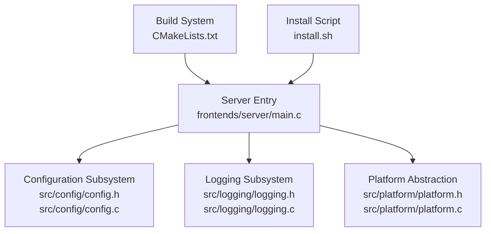
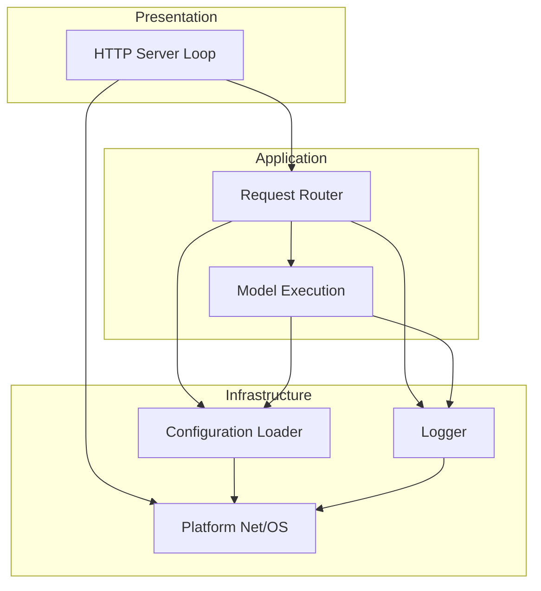
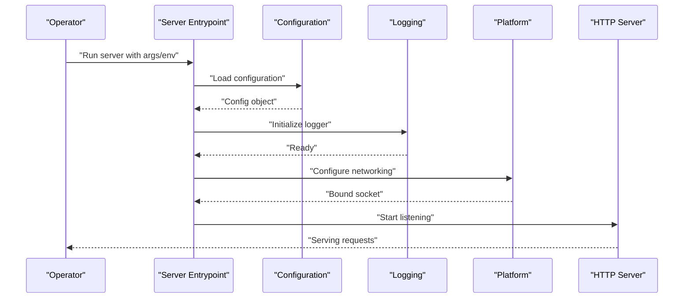
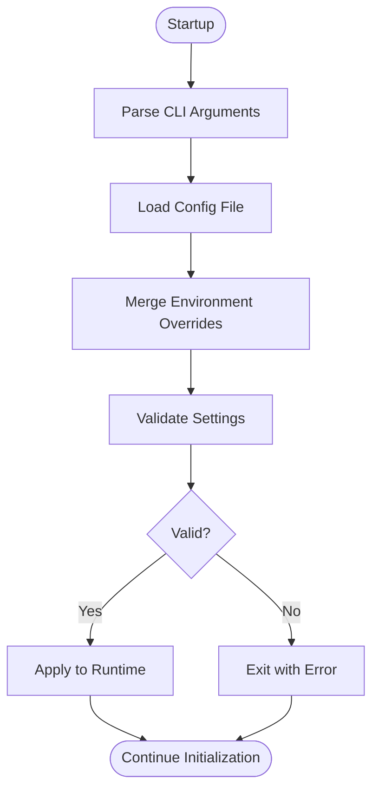
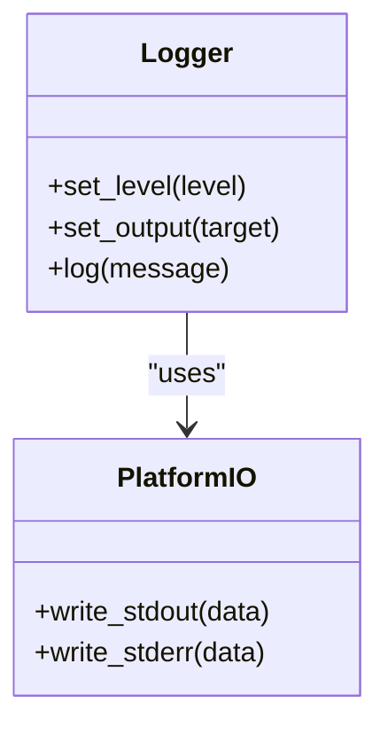
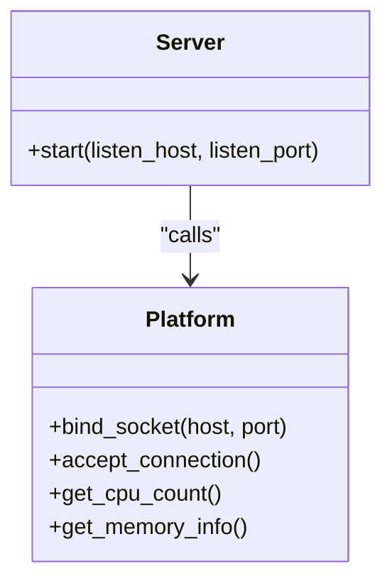
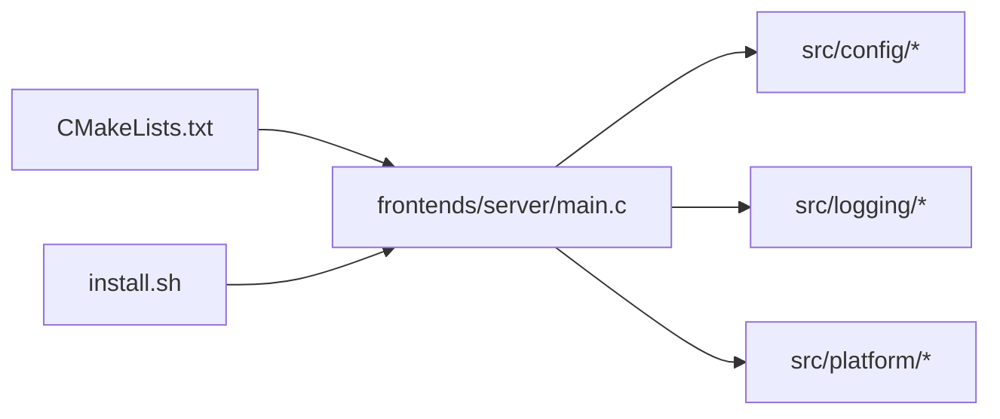

# Deployment & Configuration

<cite>
**Referenced Files in This Document**
- [frontends/server/main.c](file://frontends/server/main.c)
- [src/config/config.h](file://src/config/config.h)
- [src/config/config.c](file://src/config/config.c)
- [src/logging/logging.h](file://src/logging/logging.h)
- [src/logging/logging.c](file://src/logging/logging.c)
- [src/platform/platform.h](file://src/platform/platform.h)
- [src/platform/platform.c](file://src/platform/platform.c)
- [CMakeLists.txt](file://CMakeLists.txt)
- [install.sh](file://install.sh)
</cite>

## Table of Contents
1. [Introduction](#introduction)
2. [Project Structure](#project-structure)
3. [Core Components](#core-components)
4. [Architecture Overview](#architecture-overview)
5. [Detailed Component Analysis](#detailed-component-analysis)
6. [Dependency Analysis](#dependency-analysis)
7. [Performance Considerations](#performance-considerations)
8. [Troubleshooting Guide](#troubleshooting-guide)
9. [Conclusion](#conclusion)
10. [Appendices](#appendices)

## Introduction
This document provides deployment and configuration guidance for Hummingbird’s HTTP server component. It covers startup parameters, environment variables, configuration file formats, network binding options, port configuration, load balancing approaches, containerization examples (Docker and Kubernetes), scaling strategies, resource allocation, performance tuning, monitoring integration, log aggregation, health checks, and troubleshooting.

The content is derived from the repository’s server entrypoint, configuration subsystem, logging subsystem, platform abstraction, and build/install scripts. Where specific implementation details are not present in the codebase, this document provides conceptual guidance and best practices to help you deploy effectively.

## Project Structure
At a high level, the HTTP server is implemented as a frontend executable that initializes the runtime, loads configuration, sets up logging, and starts serving requests. The relevant parts of the repository include:
- Server entrypoint under frontends/server
- Configuration subsystem under src/config
- Logging subsystem under src/logging
- Platform abstraction under src/platform
- Build and install scripts at the repository root

**Diagram sources**
- [frontends/server/main.c](file://frontends/server/main.c)
- [src/config/config.h](file://src/config/config.h)
- [src/config/config.c](file://src/config/config.c)
- [src/logging/logging.h](file://src/logging/logging.h)
- [src/logging/logging.c](file://src/logging/logging.c)
- [src/platform/platform.h](file://src/platform/platform.h)
- [src/platform/platform.c](file://src/platform/platform.c)
- [CMakeLists.txt](file://CMakeLists.txt)
- [install.sh](file://install.sh)

**Section sources**
- [frontends/server/main.c](file://frontends/server/main.c)
- [src/config/config.h](file://src/config/config.h)
- [src/config/config.c](file://src/config/config.c)
- [src/logging/logging.h](file://src/logging/logging.h)
- [src/logging/logging.c](file://src/logging/logging.c)
- [src/platform/platform.h](file://src/platform/platform.h)
- [src/platform/platform.c](file://src/platform/platform.c)
- [CMakeLists.txt](file://CMakeLists.txt)
- [install.sh](file://install.sh)

## Core Components
- Server entrypoint: Initializes application lifecycle, parses CLI arguments, reads configuration, configures logging, and starts the HTTP server loop.
- Configuration subsystem: Provides APIs to read settings from files and/or environment variables.
- Logging subsystem: Configurable logging levels and destinations used by the server and core components.
- Platform abstraction: Encapsulates OS-specific behavior such as networking primitives and process utilities.

Operational implications:
- Startup parameters are typically parsed in the server entrypoint and passed into configuration and platform layers.
- Environment variables can be consumed by the configuration subsystem to override defaults or file-based settings.
- Logging configuration affects both development and production observability.

**Section sources**
- [frontends/server/main.c](file://frontends/server/main.c)
- [src/config/config.h](file://src/config/config.h)
- [src/config/config.c](file://src/config/config.c)
- [src/logging/logging.h](file://src/logging/logging.h)
- [src/logging/logging.c](file://src/logging/logging.c)
- [src/platform/platform.h](file://src/platform/platform.h)
- [src/platform/platform.c](file://src/platform/platform.c)

## Architecture Overview
The HTTP server follows a layered architecture:
- Presentation layer: HTTP server loop handling incoming requests.
- Application layer: Request routing, model execution orchestration, and response formatting.
- Infrastructure layer: Configuration loading, logging, and platform-specific networking.

[No sources needed since this diagram shows conceptual workflow, not actual code structure]

## Detailed Component Analysis

### Server Entry Point and Startup Flow
The server entrypoint performs initialization steps such as argument parsing, configuration loading, logging setup, and starting the HTTP listener. It coordinates with the configuration and logging subsystems and uses platform abstractions for low-level operations.

**Diagram sources**
- [frontends/server/main.c](file://frontends/server/main.c)
- [src/config/config.h](file://src/config/config.h)
- [src/config/config.c](file://src/config/config.c)
- [src/logging/logging.h](file://src/logging/logging.h)
- [src/logging/logging.c](file://src/logging/logging.c)
- [src/platform/platform.h](file://src/platform/platform.h)
- [src/platform/platform.c](file://src/platform/platform.c)

**Section sources**
- [frontends/server/main.c](file://frontends/server/main.c)
- [src/config/config.h](file://src/config/config.h)
- [src/config/config.c](file://src/config/config.c)
- [src/logging/logging.h](file://src/logging/logging.h)
- [src/logging/logging.c](file://src/logging/logging.c)
- [src/platform/platform.h](file://src/platform/platform.h)
- [src/platform/platform.c](file://src/platform/platform.c)

### Configuration Subsystem
The configuration subsystem centralizes settings management. It typically supports:
- File-based configuration (e.g., JSON/YAML/TOML)
- Environment variable overrides
- Defaults and validation

Operational usage patterns:
- Provide a configuration file path via CLI or environment variable.
- Use environment variables to override specific keys without editing files.
- Validate required fields before starting the server.

**Diagram sources**
- [src/config/config.h](file://src/config/config.h)
- [src/config/config.c](file://src/config/config.c)

**Section sources**
- [src/config/config.h](file://src/config/config.h)
- [src/config/config.c](file://src/config/config.c)

### Logging Subsystem
The logging subsystem controls verbosity, output targets, and formatting. For deployments:
- Set appropriate log levels per environment (e.g., INFO/WARN/ERROR).
- Route logs to stdout/stderr for containerized environments.
- Integrate with external log aggregators via structured outputs if supported.

**Diagram sources**
- [src/logging/logging.h](file://src/logging/logging.h)
- [src/logging/logging.c](file://src/logging/logging.c)
- [src/platform/platform.h](file://src/platform/platform.h)
- [src/platform/platform.c](file://src/platform/platform.c)

**Section sources**
- [src/logging/logging.h](file://src/logging/logging.h)
- [src/logging/logging.c](file://src/logging/logging.c)
- [src/platform/platform.h](file://src/platform/platform.h)
- [src/platform/platform.c](file://src/platform/platform.c)

### Platform Abstraction
The platform layer abstracts OS-specific behaviors such as networking and process utilities. For HTTP server deployment:
- Network binding and port selection are delegated to platform functions.
- Resource limits and process signals may be handled here.

**Diagram sources**
- [src/platform/platform.h](file://src/platform/platform.h)
- [src/platform/platform.c](file://src/platform/platform.c)
- [frontends/server/main.c](file://frontends/server/main.c)

**Section sources**
- [src/platform/platform.h](file://src/platform/platform.h)
- [src/platform/platform.c](file://src/platform/platform.c)
- [frontends/server/main.c](file://frontends/server/main.c)

## Dependency Analysis
The server depends on configuration, logging, and platform modules. Build-time dependencies are managed by CMake, and installation is facilitated by the provided script.

**Diagram sources**
- [frontends/server/main.c](file://frontends/server/main.c)
- [src/config/config.h](file://src/config/config.h)
- [src/config/config.c](file://src/config/config.c)
- [src/logging/logging.h](file://src/logging/logging.h)
- [src/logging/logging.c](file://src/logging/logging.c)
- [src/platform/platform.h](file://src/platform/platform.h)
- [src/platform/platform.c](file://src/platform/platform.c)
- [CMakeLists.txt](file://CMakeLists.txt)
- [install.sh](file://install.sh)

**Section sources**
- [CMakeLists.txt](file://CMakeLists.txt)
- [install.sh](file://install.sh)
- [frontends/server/main.c](file://frontends/server/main.c)
- [src/config/config.h](file://src/config/config.h)
- [src/config/config.c](file://src/config/config.c)
- [src/logging/logging.h](file://src/logging/logging.h)
- [src/logging/logging.c](file://src/logging/logging.c)
- [src/platform/platform.h](file://src/platform/platform.h)
- [src/platform/platform.c](file://src/platform/platform.c)

## Performance Considerations
- Concurrency: Tune thread pool sizes based on CPU cores exposed to the process/container. Use platform queries to detect available resources.
- Memory: Configure memory pools and buffer sizes according to workload characteristics; avoid excessive allocations during request processing.
- I/O: Prefer non-blocking I/O where possible; tune backlog queue sizes for high concurrency.
- Serialization: Minimize payload sizes and use efficient formats when applicable.
- Backpressure: Implement rate limiting and request queuing to protect the server under load spikes.

[No sources needed since this section provides general guidance]

## Troubleshooting Guide
Common issues and resolutions:
- Port already in use: Ensure no other process binds the same host/port; adjust listen address or port in configuration.
- Permission denied on bind: Run with appropriate privileges or choose an unprivileged port range.
- High latency: Check CPU/memory saturation; reduce concurrency or scale horizontally.
- Missing configuration keys: Validate required fields and provide defaults or environment overrides.
- Logging not captured: Verify output targets and ensure stdout/stderr are forwarded by your runtime.

**Section sources**
- [src/config/config.h](file://src/config/config.h)
- [src/config/config.c](file://src/config/config.c)
- [src/logging/logging.h](file://src/logging/logging.h)
- [src/logging/logging.c](file://src/logging/logging.c)
- [src/platform/platform.h](file://src/platform/platform.h)
- [src/platform/platform.c](file://src/platform/platform.c)

## Conclusion
Hummingbird’s HTTP server integrates a modular design with clear separation between presentation, application, and infrastructure layers. By leveraging the configuration subsystem, logging facilities, and platform abstractions, operators can deploy reliably across environments. Use the guidance above to configure network binding, ports, logging, and scaling, and apply the troubleshooting tips to resolve common operational issues.

[No sources needed since this section summarizes without analyzing specific files]

## Appendices

### Startup Parameters and Environment Variables
- CLI arguments: Typically include configuration file path, log level, and optional feature flags. These are parsed in the server entrypoint and influence configuration and logging.
- Environment variables: Commonly used to override configuration values such as log level, configuration file path, and feature toggles. Refer to the configuration subsystem for supported keys.

**Section sources**
- [frontends/server/main.c](file://frontends/server/main.c)
- [src/config/config.h](file://src/config/config.h)
- [src/config/config.c](file://src/config/config.c)

### Configuration File Formats
- Supported formats: Depends on the configuration loader implementation. Typical formats include JSON, YAML, or TOML.
- Key precedence: Environment variables usually override file-based settings.
- Validation: Required keys must be present; invalid values should cause early failure with descriptive errors.

**Section sources**
- [src/config/config.h](file://src/config/config.h)
- [src/config/config.c](file://src/config/config.c)

### Network Binding and Ports
- Bind address: Specify host and port via configuration or environment variables.
- IPv4/IPv6: Choose appropriate address family based on deployment needs.
- Backlog and timeouts: Tune using platform abstractions for optimal throughput.

**Section sources**
- [src/platform/platform.h](file://src/platform/platform.h)
- [src/platform/platform.c](file://src/platform/platform.c)
- [frontends/server/main.c](file://frontends/server/main.c)

### Load Balancing Setups
- Horizontal scaling: Run multiple server instances behind a reverse proxy or load balancer (e.g., Nginx, HAProxy, cloud LB).
- Health checks: Expose lightweight endpoints for readiness/liveness probes.
- Session affinity: If stateful, configure sticky sessions at the load balancer.

[No sources needed since this section provides general guidance]

### Containerization Examples

#### Docker
- Base image: Use a minimal Linux distribution compatible with the built binary.
- Copy artifact: Place the compiled server binary into the image.
- Expose port: Map the configured listen port to the container host.
- Environment: Pass configuration via environment variables or mounted config files.
- Health check: Define a container healthcheck probing a simple endpoint.

[No sources needed since this section provides general guidance]

#### Kubernetes
- Deployment: Define a Deployment with replicas, resource requests/limits, and environment variables.
- Service: Expose the server via a ClusterIP or LoadBalancer service.
- Probes: Configure liveness and readiness probes pointing to health endpoints.
- ConfigMap/Secret: Store configuration and sensitive data separately.

[No sources needed since this section provides general guidance]

### Cloud Deployment Templates
- Managed containers: Deploy to services like AWS ECS, GCP Cloud Run, or Azure Container Instances.
- Auto-scaling: Configure autoscaling policies based on CPU utilization or custom metrics.
- Secrets management: Use cloud-native secret stores for credentials.

[No sources needed since this section provides general guidance]

### Scaling Strategies and Resource Allocation
- Vertical scaling: Increase CPU/memory per instance; monitor saturation.
- Horizontal scaling: Add more instances behind a load balancer; ensure stateless design.
- Resource quotas: Set requests/limits in Kubernetes to prevent noisy neighbor effects.

[No sources needed since this section provides general guidance]

### Monitoring Integration and Metrics
- Metrics export: If supported, expose Prometheus-compatible metrics endpoints.
- Structured logging: Emit JSON logs for ingestion by collectors (e.g., Fluent Bit, Vector).
- Tracing: Integrate distributed tracing libraries if applicable.

[No sources needed since this section provides general guidance]

### Health Check Endpoints
- Readiness: Indicate when the server has finished initialization and is ready to accept traffic.
- Liveness: Indicate whether the process is healthy; restart on failure.
- Simple probe: A minimal endpoint returning 200 OK is often sufficient.

[No sources needed since this section provides general guidance]

### Build and Installation
- Build system: CMake is used to configure and compile the project.
- Install script: An install script is provided to assist with packaging and deployment.

**Section sources**
- [CMakeLists.txt](file://CMakeLists.txt)
- [install.sh](file://install.sh)