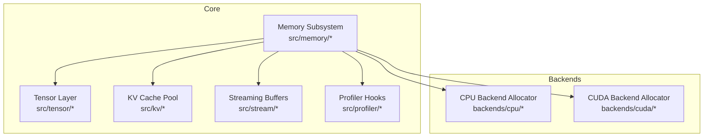
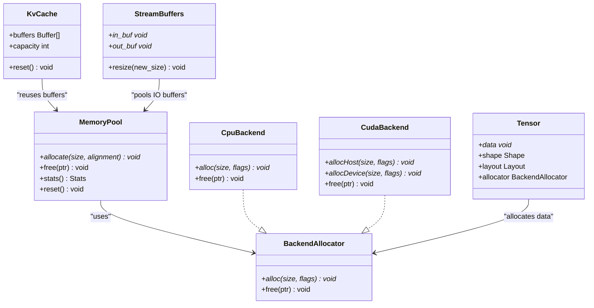
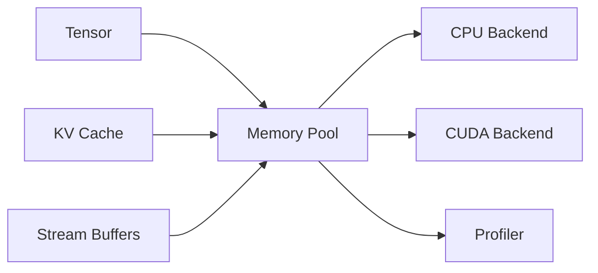
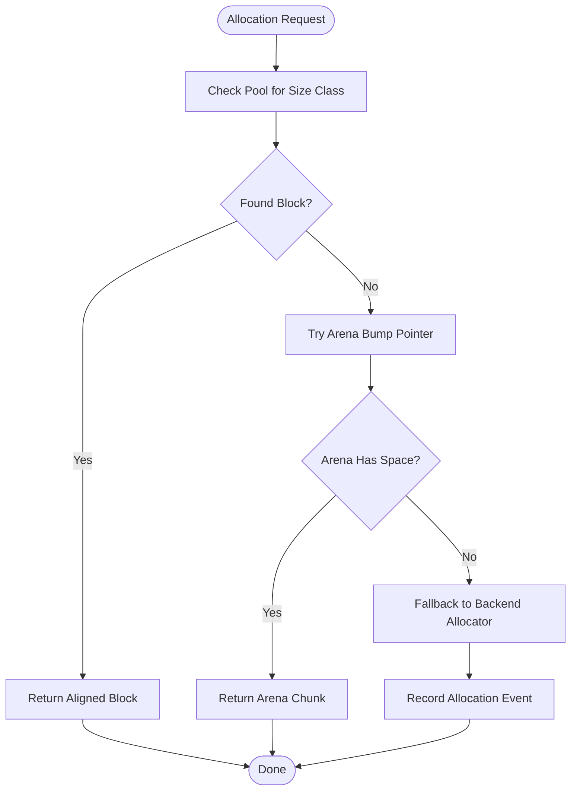

# Memory Optimization Strategies

<cite>
**Referenced Files in This Document**
- [memory.h](file://src/memory/memory.h)
- [memory.c](file://src/memory/memory.c)
- [memory_internal.h](file://src/memory/memory_internal.h)
- [memory_test.c](file://src/memory/memory_test.c)
- [bench_alloc.c](file://benchmarks/bench_alloc.c)
- [tensor.h](file://src/tensor/tensor.h)
- [tensor.c](file://src/tensor/tensor.c)
- [backend.h](file://backends/cpu/backend_cpu.h)
- [backend_cuda.h](file://backends/cuda/backend_cuda.h)
- [profiler.h](file://src/profiler/profiler.h)
- [profiler.c](file://src/profiler/profiler.c)
- [stream.h](file://src/stream/stream.h)
- [stream.c](file://src/stream/stream.c)
- [kv.h](file://src/kv/kv.h)
- [kv.c](file://src/kv/kv.c)
</cite>

## Table of Contents
1. [Introduction](#introduction)
2. [Project Structure](#project-structure)
3. [Core Components](#core-components)
4. [Architecture Overview](#architecture-overview)
5. [Detailed Component Analysis](#detailed-component-analysis)
6. [Dependency Analysis](#dependency-analysis)
7. [Performance Considerations](#performance-considerations)
8. [Troubleshooting Guide](#troubleshooting-guide)
9. [Conclusion](#conclusion)
10. [Appendices](#appendices)

## Introduction
This document explains memory optimization strategies in Hummingbird with a focus on the memory pool architecture, allocation patterns, garbage collection mechanisms, and memory layout optimizations. It also covers memory profiling techniques, leak detection, and fragmentation prevention. Practical examples are provided for optimizing memory usage across different model sizes, batch processing scenarios, and streaming inference. The content bridges conceptual understanding of memory management principles with implementation-specific techniques to achieve maximum performance.

## Project Structure
Hummingbird organizes memory-related functionality under src/memory, with device backends providing platform-specific allocators (CPU, CUDA, Metal). Tensor allocations, KV cache pools, streaming buffers, and profiling hooks integrate with the core memory subsystem. Benchmarks exercise allocation paths to validate performance characteristics.

**Diagram sources**
- [memory.h:1-200](file://src/memory/memory.h#L1-L200)
- [memory.c:1-400](file://src/memory/memory.c#L1-L400)
- [backend_cpu.h:1-200](file://backends/cpu/backend_cpu.h#L1-L200)
- [backend_cuda.h:1-200](file://backends/cuda/backend_cuda.h#L1-L200)
- [tensor.h:1-200](file://src/tensor/tensor.h#L1-L200)
- [kv.h:1-200](file://src/kv/kv.h#L1-L200)
- [stream.h:1-200](file://src/stream/stream.h#L1-L200)
- [profiler.h:1-200](file://src/profiler/profiler.h#L1-L200)

**Section sources**
- [memory.h:1-200](file://src/memory/memory.h#L1-L200)
- [memory.c:1-400](file://src/memory/memory.c#L1-L400)
- [backend_cpu.h:1-200](file://backends/cpu/backend_cpu.h#L1-L200)
- [backend_cuda.h:1-200](file://backends/cuda/backend_cuda.h#L1-L200)
- [tensor.h:1-200](file://src/tensor/tensor.h#L1-L200)
- [kv.h:1-200](file://src/kv/kv.h#L1-L200)
- [stream.h:1-200](file://src/stream/stream.h#L1-L200)
- [profiler.h:1-200](file://src/profiler/profiler.h#L1-L200)

## Core Components
- Memory pool manager: Centralized allocator that manages fixed-size blocks and large-object arenas, tracks usage, and exposes APIs for allocation and deallocation.
- Device backend allocators: Thin wrappers around CPU malloc/free and CUDA host/device memory APIs, exposing uniform allocation semantics.
- Tensor memory integration: Tensors request memory from the pool or backend, aligning strides and layouts for compute efficiency.
- KV cache pooling: Reusable buffers for attention state during generation, minimizing per-token allocations.
- Streaming buffers: Pinned or pooled buffers for incremental data ingestion and output.
- Profiling hooks: Allocation/deallocation events recorded by the profiler for analysis.

Key responsibilities:
- Minimize allocation overhead via pools and arenas.
- Reduce fragmentation through size classes and alignment.
- Provide deterministic lifetimes for hot-path objects.
- Expose metrics and hooks for diagnostics.

**Section sources**
- [memory.h:1-200](file://src/memory/memory.h#L1-L200)
- [memory.c:1-400](file://src/memory/memory.c#L1-L400)
- [backend_cpu.h:1-200](file://backends/cpu/backend_cpu.h#L1-L200)
- [backend_cuda.h:1-200](file://backends/cuda/backend_cuda.h#L1-L200)
- [tensor.h:1-200](file://src/tensor/tensor.h#L1-L200)
- [kv.h:1-200](file://src/kv/kv.h#L1-L200)
- [stream.h:1-200](file://src/stream/stream.h#L1-L200)
- [profiler.h:1-200](file://src/profiler/profiler.h#L1-L200)

## Architecture Overview
The memory architecture layers a unified API over device-specific allocators, with pools and arenas reducing allocation churn. Higher-level components (tensors, KV cache, streaming) consume memory according to their lifecycle needs.

**Diagram sources**
- [memory.h:1-200](file://src/memory/memory.h#L1-L200)
- [memory.c:1-400](file://src/memory/memory.c#L1-L400)
- [backend_cpu.h:1-200](file://backends/cpu/backend_cpu.h#L1-L200)
- [backend_cuda.h:1-200](file://backends/cuda/backend_cuda.h#L1-L200)
- [tensor.h:1-200](file://src/tensor/tensor.h#L1-L200)
- [kv.h:1-200](file://src/kv/kv.h#L1-L200)
- [stream.h:1-200](file://src/stream/stream.h#L1-L200)

## Detailed Component Analysis

### Memory Pool Manager
The pool manager implements:
- Fixed-size block pools for common sizes to reduce fragmentation.
- Large-object arena for oversized allocations with coalescing where possible.
- Per-thread caches to avoid contention.
- Alignment guarantees for SIMD-friendly layouts.
- Optional zero-initialization for safety-critical paths.

Optimization techniques:
- Size-class rounding to power-of-two boundaries.
- Bump-pointer allocation within arenas for O(1) allocation.
- Periodic compaction or reset to reclaim contiguous regions.
- Backpressure when pools exceed configured thresholds.

Garbage collection mechanism:
- Deterministic lifetime via explicit free/reset calls.
- Optional global GC pass triggered by thresholds or timers to release unused arenas.

**Section sources**
- [memory.h:1-200](file://src/memory/memory.h#L1-L200)
- [memory.c:1-400](file://src/memory/memory.c#L1-L400)
- [memory_internal.h:1-200](file://src/memory/memory_internal.h#L1-L200)
- [memory_test.c:1-200](file://src/memory/memory_test.c#L1-L200)

### Device Backend Allocators
- CPU backend wraps standard malloc/free with optional alignment and logging.
- CUDA backend provides host and device allocation APIs, supporting pinned memory for DMA and device memory for GPU kernels.
- Uniform interface abstracts differences while preserving performance characteristics.

Integration points:
- Memory pool falls back to backend allocators for large or misaligned requests.
- Tensors specify preferred backend based on execution target.

**Section sources**
- [backend_cpu.h:1-200](file://backends/cpu/backend_cpu.h#L1-L200)
- [backend_cuda.h:1-200](file://backends/cuda/backend_cuda.h#L1-L200)
- [memory.h:1-200](file://src/memory/memory.h#L1-L200)

### Tensor Memory Integration
Tensors encapsulate:
- Data pointer obtained from the pool or backend.
- Shape and layout metadata ensuring stride alignment.
- Ownership and lifetime tied to graph execution scope.

Layout optimizations:
- Contiguous storage for dense tensors.
- Channel-last or row-major selection based on kernel requirements.
- Padding to meet alignment constraints for vectorized loads/stores.

**Section sources**
- [tensor.h:1-200](file://src/tensor/tensor.h#L1-L200)
- [tensor.c:1-400](file://src/tensor/tensor.c#L1-L400)
- [memory.h:1-200](file://src/memory/memory.h#L1-L200)

### KV Cache Pooling
KV cache pools pre-allocate buffers for attention states and reuse them across tokens to avoid per-step allocations. Key features:
- Ring buffer or double-buffered design for sliding windows.
- Capacity planning based on max sequence length and batch size.
- Reset between sequences to prevent cross-contamination.

**Section sources**
- [kv.h:1-200](file://src/kv/kv.h#L1-L200)
- [kv.c:1-400](file://src/kv/kv.c#L1-L400)
- [memory.h:1-200](file://src/memory/memory.h#L1-L200)

### Streaming Buffers
Streaming buffers manage incremental input/output:
- Pooled input buffers sized to chunk granularity.
- Output buffers with flush semantics to minimize writes.
- Optional pinning for efficient transfers.

**Section sources**
- [stream.h:1-200](file://src/stream/stream.h#L1-L200)
- [stream.c:1-400](file://src/stream/stream.c#L1-L400)
- [memory.h:1-200](file://src/memory/memory.h#L1-L200)

### Profiler Hooks
Profiling integrates at allocation sites:
- Records allocation size, type, and stack trace.
- Aggregates live vs freed counts to detect leaks.
- Provides snapshots for peak usage and growth trends.

**Section sources**
- [profiler.h:1-200](file://src/profiler/profiler.h#L1-L200)
- [profiler.c:1-400](file://src/profiler/profiler.c#L1-L400)
- [memory.h:1-200](file://src/memory/memory.h#L1-L200)

## Dependency Analysis
The following diagram shows how higher-level modules depend on the memory subsystem and device backends.

**Diagram sources**
- [tensor.h:1-200](file://src/tensor/tensor.h#L1-L200)
- [kv.h:1-200](file://src/kv/kv.h#L1-L200)
- [stream.h:1-200](file://src/stream/stream.h#L1-L200)
- [memory.h:1-200](file://src/memory/memory.h#L1-L200)
- [backend_cpu.h:1-200](file://backends/cpu/backend_cpu.h#L1-L200)
- [backend_cuda.h:1-200](file://backends/cuda/backend_cuda.h#L1-L200)
- [profiler.h:1-200](file://src/profiler/profiler.h#L1-L200)

**Section sources**
- [memory.h:1-200](file://src/memory/memory.h#L1-L200)
- [memory.c:1-400](file://src/memory/memory.c#L1-L400)
- [backend_cpu.h:1-200](file://backends/cpu/backend_cpu.h#L1-L200)
- [backend_cuda.h:1-200](file://backends/cuda/backend_cuda.h#L1-L200)
- [tensor.h:1-200](file://src/tensor/tensor.h#L1-L200)
- [kv.h:1-200](file://src/kv/kv.h#L1-L200)
- [stream.h:1-200](file://src/stream/stream.h#L1-L200)
- [profiler.h:1-200](file://src/profiler/profiler.h#L1-L200)

## Performance Considerations
- Prefer fixed-size pools for hot-path allocations to reduce overhead and fragmentation.
- Align tensor data to hardware vector widths for better throughput.
- Use KV cache pooling for long-running generation to amortize allocation costs.
- Batch operations to increase allocation size and improve locality.
- Avoid frequent small allocations; coalesce into larger buffers when possible.
- Monitor allocation rates and peak memory via profiler hooks.
- Tune pool sizes and arena thresholds based on workload profiles.

[No sources needed since this section provides general guidance]

## Troubleshooting Guide
Common issues and remedies:
- Memory leaks: Enable profiler hooks, capture snapshots before/after workloads, and compare live allocations.
- Fragmentation: Increase pool size for dominant size classes; use reset between batches.
- High allocation latency: Switch to arena-backed allocations for sequential bursts; reduce fallback to backend allocators.
- Cross-device memory errors: Ensure tensors and kernels use matching backend allocators; verify pinned memory usage for transfers.

Diagnostic steps:
- Run allocation benchmarks to baseline performance.
- Inspect memory stats and histograms from the pool manager.
- Validate tensor layouts and strides against kernel expectations.

**Section sources**
- [memory_test.c:1-200](file://src/memory/memory_test.c#L1-L200)
- [bench_alloc.c:1-200](file://benchmarks/bench_alloc.c#L1-L200)
- [profiler.h:1-200](file://src/profiler/profiler.h#L1-L200)
- [profiler.c:1-400](file://src/profiler/profiler.c#L1-L400)

## Conclusion
Hummingbird’s memory optimization strategy centers on a layered pool-and-arena architecture backed by device-specific allocators. By aligning allocation patterns with component lifetimes—tensors, KV cache, and streaming buffers—the system minimizes overhead, reduces fragmentation, and improves throughput. Profiler hooks and benchmarks provide actionable insights for tuning pool sizes, layout choices, and batching strategies to achieve optimal performance across diverse workloads.

[No sources needed since this section summarizes without analyzing specific files]

## Appendices

### Practical Examples

#### Optimizing for Different Model Sizes
- Small models: Favor smaller pool size classes and tighter arenas to reduce footprint.
- Medium models: Balance pool sizes with moderate arena growth; enable periodic resets between runs.
- Large models: Pre-warm KV cache pools and streaming buffers; prefer contiguous layouts and aligned strides.

[No sources needed since this section provides general guidance]

#### Batch Processing Scenarios
- Allocate batch-sized tensors once and reuse via reshape or view operations.
- Use KV cache pooling to avoid per-token allocations during generation.
- Flush streaming outputs in batched chunks to reduce write overhead.

[No sources needed since this section provides general guidance]

#### Streaming Inference
- Maintain persistent input/output buffers sized to chunk granularity.
- Apply ring buffering for sliding windows to keep memory bounded.
- Profile allocation spikes during warm-up and adjust pool thresholds accordingly.

[No sources needed since this section provides general guidance]

### Memory Profiling Techniques
- Capture allocation traces at key checkpoints.
- Compare live vs freed counts to identify leaks.
- Track peak memory and growth trends across runs.
- Correlate allocation patterns with kernel execution phases.

**Section sources**
- [profiler.h:1-200](file://src/profiler/profiler.h#L1-L200)
- [profiler.c:1-400](file://src/profiler/profiler.c#L1-L400)
- [bench_alloc.c:1-200](file://benchmarks/bench_alloc.c#L1-L200)

### Fragmentation Prevention Flow

**Diagram sources**
- [memory.h:1-200](file://src/memory/memory.h#L1-L200)
- [memory.c:1-400](file://src/memory/memory.c#L1-L400)
- [backend_cpu.h:1-200](file://backends/cpu/backend_cpu.h#L1-L200)
- [backend_cuda.h:1-200](file://backends/cuda/backend_cuda.h#L1-L200)