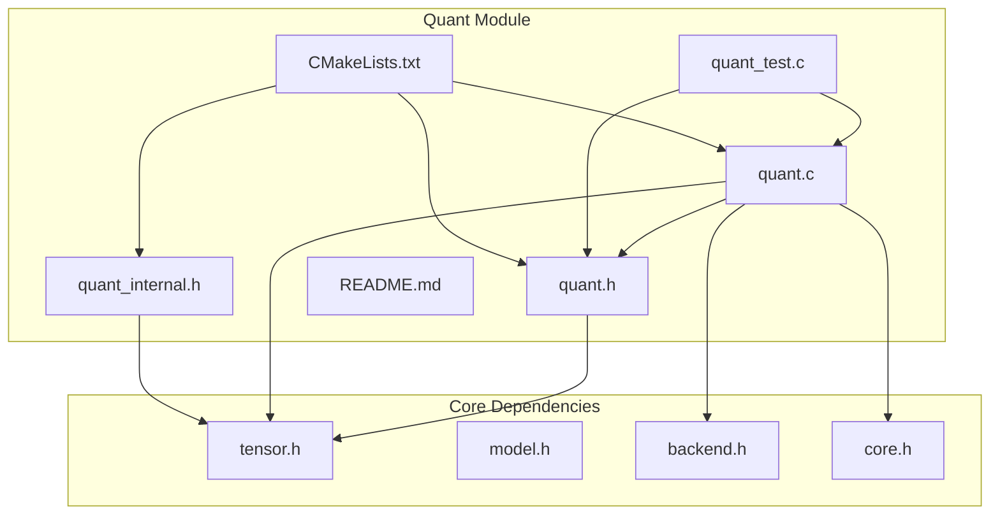
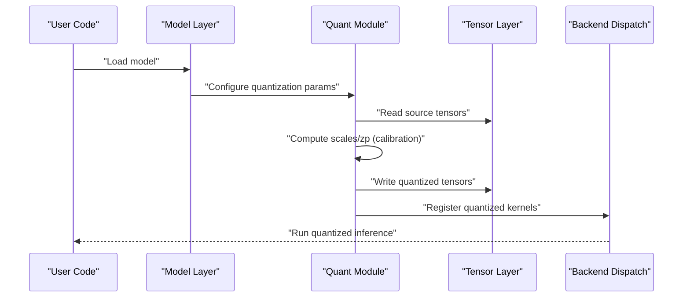
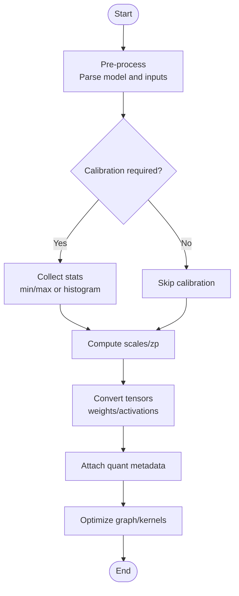
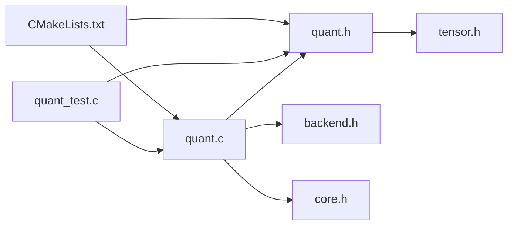

# Model Quantization

<cite>
**Referenced Files in This Document**
- [quant.h](file://src/quant/quant.h)
- [quant.c](file://src/quant/quant.c)
- [quant_internal.h](file://src/quant/quant_internal.h)
- [quant_test.c](file://src/quant/quant_test.c)
- [README.md](file://src/quant/README.md)
- [CMakeLists.txt](file://src/quant/CMakeLists.txt)
- [tensor.h](file://src/tensor/tensor.h)
- [model.h](file://src/model/model.h)
- [backend.h](file://src/backend/backend.h)
- [core.h](file://src/core/core.h)
</cite>

## Table of Contents
1. [Introduction](#introduction)
2. [Project Structure](#project-structure)
3. [Core Components](#core-components)
4. [Architecture Overview](#architecture-overview)
5. [Detailed Component Analysis](#detailed-component-analysis)
6. [Dependency Analysis](#dependency-analysis)
7. [Performance Considerations](#performance-considerations)
8. [Troubleshooting Guide](#troubleshooting-guide)
9. [Conclusion](#conclusion)
10. [Appendices](#appendices)

## Introduction
This document explains Hummingbird’s quantization system, focusing on concepts, supported data types, and their impact on model size and inference performance. It also documents the quantization pipeline (pre-processing, algorithms, post-processing), practical usage patterns, configuration options, calibration techniques, quantization-aware training considerations, and troubleshooting guidance. The goal is to help both newcomers and experienced users understand how to apply quantization effectively within Hummingbird.

## Project Structure
The quantization subsystem resides under src/quant and integrates with core tensor, model, backend, and runtime components. Key files include:
- Public API header for quantization operations and types
- Implementation of quantization routines and helpers
- Internal definitions for quantization state and parameters
- Unit tests validating behavior and edge cases
- Build configuration for the quant module
- README describing module responsibilities and usage

**Diagram sources**
- [quant.h](file://src/quant/quant.h)
- [quant.c](file://src/quant/quant.c)
- [quant_internal.h](file://src/quant/quant_internal.h)
- [quant_test.c](file://src/quant/quant_test.c)
- [README.md](file://src/quant/README.md)
- [CMakeLists.txt](file://src/quant/CMakeLists.txt)
- [tensor.h](file://src/tensor/tensor.h)
- [model.h](file://src/model/model.h)
- [backend.h](file://src/backend/backend.h)
- [core.h](file://src/core/core.h)

**Section sources**
- [quant.h](file://src/quant/quant.h)
- [quant.c](file://src/quant/quant.c)
- [quant_internal.h](file://src/quant/quant_internal.h)
- [quant_test.c](file://src/quant/quant_test.c)
- [README.md](file://src/quant/README.md)
- [CMakeLists.txt](file://src/quant/CMakeLists.txt)
- [tensor.h](file://src/tensor/tensor.h)
- [model.h](file://src/model/model.h)
- [backend.h](file://src/backend/backend.h)
- [core.h](file://src/core/core.h)

## Core Components
- Quantization API surface: Defines public functions and enumerations for configuring and executing quantization passes over tensors and models.
- Quantization internals: Encapsulates quantization parameters (scales, zero-points, ranges), per-channel vs per-tensor strategies, and algorithm-specific state.
- Tensor integration: Works with Hummingbird’s tensor representation to read/write quantized values and metadata.
- Backend hooks: Interfaces with CPU/GPU backends to dispatch optimized kernels for quantize/dequantize operations.
- Tests: Validate correctness across data types, shapes, and edge conditions.

Practical implications:
- INT8 typically halves memory footprint compared to FP32 and can accelerate inference on hardware with native INT8 support.
- FP16 reduces memory bandwidth and improves throughput on compatible accelerators while preserving higher precision than INT8.
- Mixed-precision pipelines may combine FP16 activations with INT8 weights for balanced accuracy and efficiency.

**Section sources**
- [quant.h](file://src/quant/quant.h)
- [quant.c](file://src/quant/quant.c)
- [quant_internal.h](file://src/quant/quant_internal.h)
- [quant_test.c](file://src/quant/quant_test.c)
- [README.md](file://src/quant/README.md)

## Architecture Overview
The quantization pipeline integrates with Hummingbird’s model loading, graph execution, and backend dispatch layers. High-level flow:
- Pre-processing: Load model weights and activations; optionally collect statistics for calibration.
- Quantization: Apply chosen algorithm (e.g., symmetric/asymmetric, per-tensor/per-channel) to compute scales and zero-points; convert weights or activations to target dtype.
- Post-processing: Attach quantization metadata to tensors/graph nodes; prepare optimized kernels for inference.

**Diagram sources**
- [quant.c](file://src/quant/quant.c)
- [quant.h](file://src/quant/quant.h)
- [tensor.h](file://src/tensor/tensor.h)
- [backend.h](file://src/backend/backend.h)
- [model.h](file://src/model/model.h)

## Detailed Component Analysis

### Quantization Data Types and Precision
Supported types commonly include:
- INT8: Low-bit integer for weights and activations; strong compression and speedups on capable hardware.
- FP16: Half-precision floating point; reduced memory and improved throughput where supported.
- BF16: Brain float format; often used for stability in mixed-precision workflows.
- INT4/INT2: Extreme compression scenarios; may require specialized kernels and careful calibration.

Impact summary:
- Model size: Lower bit-width directly reduces storage and memory footprint.
- Inference performance: Narrower dtypes reduce bandwidth and enable vectorized/integrated unit acceleration.
- Accuracy trade-offs: Lower precision can degrade accuracy; calibration and per-channel scaling mitigate losses.

**Section sources**
- [quant.h](file://src/quant/quant.h)
- [quant.c](file://src/quant/quant.c)
- [README.md](file://src/quant/README.md)

### Quantization Algorithms and Strategies
Common strategies implemented or exposed by the quant module:
- Per-tensor vs per-channel scaling: Per-channel often yields better accuracy for convolutional weights.
- Symmetric vs asymmetric quantization: Symmetric simplifies kernel math; asymmetric handles biased distributions.
- Calibration methods: Min-max, histogram-based, or learnable approaches to determine scale and zero-point.
- Mixed-precision graphs: Selective quantization of specific layers or tensors based on sensitivity analysis.

Calibration workflow:
- Collect activation histograms or min/max from a representative dataset.
- Compute optimal scales and zero-points per tensor or channel.
- Optionally refine via iterative re-quantization or fine-tuning.

**Section sources**
- [quant_internal.h](file://src/quant/quant_internal.h)
- [quant.c](file://src/quant/quant.c)
- [quant_test.c](file://src/quant/quant_test.c)

### Quantization Pipeline Stages
Pre-processing:
- Parse model structure and identify quantizable nodes.
- Prepare input datasets for calibration if needed.

Quantization:
- Choose target dtype(s) and strategy (per-tensor/per-channel).
- Run calibration to derive scales/zp.
- Convert weights and/or activations to quantized form.

Post-processing:
- Attach quantization metadata to tensors/nodes.
- Optimize graph for quantized kernels.
- Export quantized artifacts for deployment.

**Diagram sources**
- [quant.c](file://src/quant/quant.c)
- [quant_internal.h](file://src/quant/quant_internal.h)

**Section sources**
- [quant.c](file://src/quant/quant.c)
- [quant_internal.h](file://src/quant/quant_internal.h)

### Practical Usage Examples
Typical steps:
- Configure quantization parameters (dtype, strategy, channels).
- Provide calibration dataset or precomputed statistics.
- Invoke quantization pass on model or selected tensors.
- Validate outputs against baseline and measure latency/memory.

Configuration knobs:
- Target dtype selection (INT8, FP16, etc.).
- Per-tensor vs per-channel mode.
- Symmetric vs asymmetric mode.
- Calibration method and sample count.
- Sensitivity thresholds for selective quantization.

Measuring trade-offs:
- Compare model size before/after quantization.
- Benchmark latency and throughput on target device.
- Evaluate accuracy drop using validation metrics.

**Section sources**
- [quant.h](file://src/quant/quant.h)
- [quant.c](file://src/quant/quant.c)
- [quant_test.c](file://src/quant/quant_test.c)

### Quantization-Aware Training Considerations
When integrating quantization into training:
- Insert fake quantize/dequantize nodes during forward pass to simulate low-bit effects.
- Use straight-through estimator for gradients around discrete operations.
- Tune learning rates and regularization to stabilize training under quantization noise.
- Employ mixed-precision training alongside weight quantization for convergence.

Benefits:
- Improved robustness to post-training quantization.
- Better accuracy retention at lower bit-widths.

**Section sources**
- [quant_internal.h](file://src/quant/quant_internal.h)
- [quant.c](file://src/quant/quant.c)

### Calibration Techniques
Recommended techniques:
- Min-max calibration: Simple and effective for many layers; sensitive to outliers.
- Histogram-based calibration: Captures distribution shape; choose binning strategy carefully.
- KL-divergence calibration: Minimizes divergence between full-precision and quantized distributions.
- Adaptive calibration: Iteratively refine scales/zp based on error feedback.

Best practices:
- Use a representative dataset covering domain variability.
- Monitor outlier layers and consider per-channel scaling.
- Validate calibration quality with small subsets before full conversion.

**Section sources**
- [quant_internal.h](file://src/quant/quant_internal.h)
- [quant.c](file://src/quant/quant.c)

### Backends and Kernels
Integration points:
- Backend registration for quantized kernels (CPU/GPU).
- Kernel selection based on device capabilities and tensor layout.
- Fallback paths for unsupported configurations.

Considerations:
- Ensure alignment and padding requirements are met for optimal performance.
- Profile kernel dispatch overhead and fuse operations when possible.

**Section sources**
- [backend.h](file://src/backend/backend.h)
- [quant.c](file://src/quant/quant.c)

## Dependency Analysis
The quant module depends on core tensor and backend abstractions and exposes an API consumed by model and runtime layers.

**Diagram sources**
- [quant.h](file://src/quant/quant.h)
- [quant.c](file://src/quant/quant.c)
- [quant_test.c](file://src/quant/quant_test.c)
- [CMakeLists.txt](file://src/quant/CMakeLists.txt)
- [tensor.h](file://src/tensor/tensor.h)
- [backend.h](file://src/backend/backend.h)
- [core.h](file://src/core/core.h)

**Section sources**
- [quant.h](file://src/quant/quant.h)
- [quant.c](file://src/quant/quant.c)
- [quant_test.c](file://src/quant/quant_test.c)
- [CMakeLists.txt](file://src/quant/CMakeLists.txt)
- [tensor.h](file://src/tensor/tensor.h)
- [backend.h](file://src/backend/backend.h)
- [core.h](file://src/core/core.h)

## Performance Considerations
- Memory bandwidth: Lower bit-width reduces bandwidth pressure; ensure memory alignment and coalescing.
- Kernel specialization: Prefer dedicated INT8/FP16 kernels; avoid unnecessary dequantization steps.
- Graph fusion: Fuse quantize/dequantize pairs to minimize intermediate conversions.
- Batch sizing: Larger batches improve utilization on vectorized units; tune to device limits.
- Calibration quality: Accurate scales/zp reduce accuracy loss and allow more aggressive quantization.

[No sources needed since this section provides general guidance]

## Troubleshooting Guide
Common issues and remedies:
- Accuracy drop after quantization:
  - Revisit calibration dataset representativeness.
  - Switch to per-channel scaling for sensitive layers.
  - Try asymmetric quantization if activations are biased.
- Instability or NaNs:
  - Check for extreme outliers; clip or use robust calibration.
  - Verify dtype compatibility across ops; insert explicit casts if needed.
- Slowdown instead of speedup:
  - Ensure backend supports native quantized kernels.
  - Avoid excessive dequantization; fuse operations.
  - Validate memory layout and alignment.
- Build or runtime errors:
  - Confirm quant module is compiled and linked.
  - Check device capability flags and fallback paths.

Diagnostic tips:
- Log quantization parameters (scales/zp) and compare distributions.
- Profile kernel dispatch times and memory traffic.
- Isolate problematic layers by selectively quantizing subsets.

**Section sources**
- [quant_test.c](file://src/quant/quant_test.c)
- [quant.c](file://src/quant/quant.c)
- [quant_internal.h](file://src/quant/quant_internal.h)

## Conclusion
Hummingbird’s quantization system provides a flexible pipeline for reducing model size and improving inference performance through configurable data types and strategies. By combining robust calibration, per-channel scaling, and backend-optimized kernels, users can achieve significant gains while maintaining acceptable accuracy. Adopting quantization-aware training further enhances resilience to low-bit constraints. Follow the troubleshooting guidance to diagnose and resolve common issues, and leverage profiling to fine-tune performance on target devices.

[No sources needed since this section summarizes without analyzing specific files]

## Appendices

### Appendix A: Configuration Checklist
- Select target dtype(s): INT8, FP16, BF16, or mixed.
- Choose scaling strategy: per-tensor or per-channel.
- Decide symmetry: symmetric or asymmetric.
- Pick calibration method: min-max, histogram, KL-divergence.
- Prepare representative calibration dataset.
- Validate accuracy and performance on target device.

**Section sources**
- [quant.h](file://src/quant/quant.h)
- [quant.c](file://src/quant/quant.c)
- [README.md](file://src/quant/README.md)

### Appendix B: Example Workflow Outline
- Load model and inspect layer sensitivities.
- Configure quantization parameters and calibration settings.
- Run calibration to compute scales/zp.
- Convert weights and activations to quantized forms.
- Register quantized kernels and export artifacts.
- Benchmark latency, memory, and accuracy.

**Section sources**
- [quant.c](file://src/quant/quant.c)
- [quant_test.c](file://src/quant/quant_test.c)