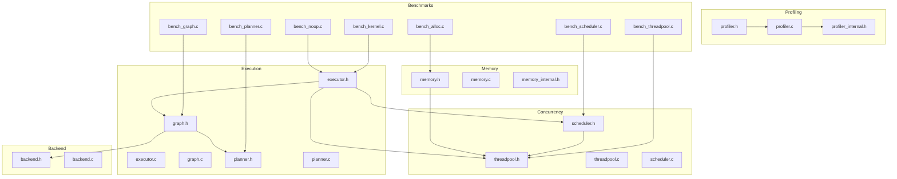
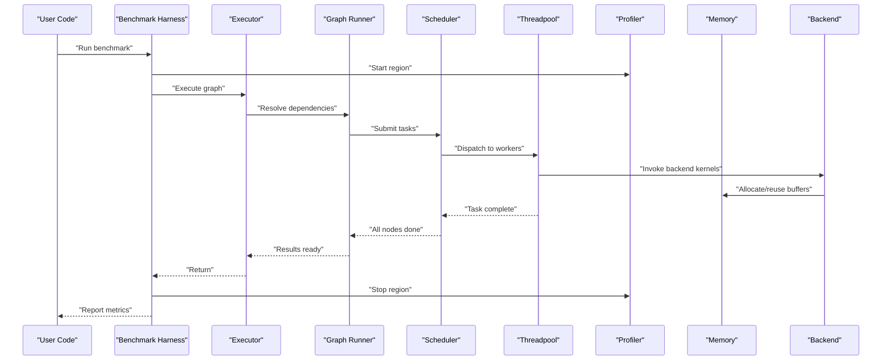
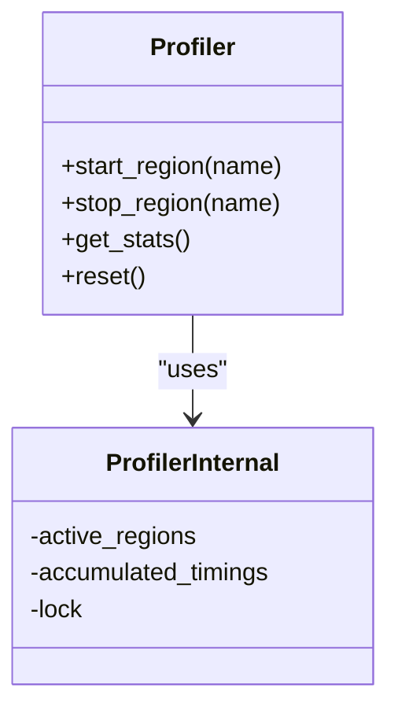
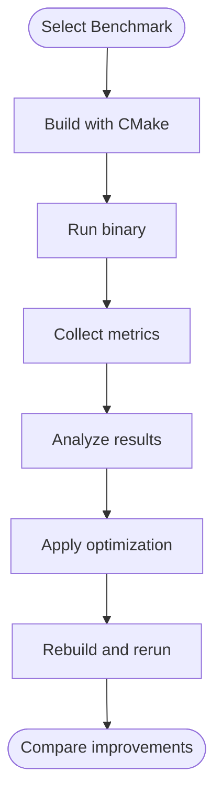
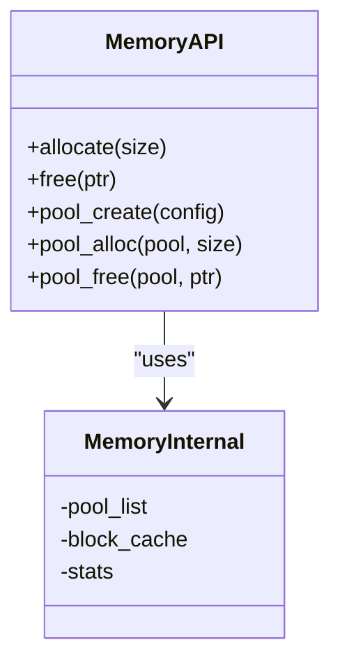
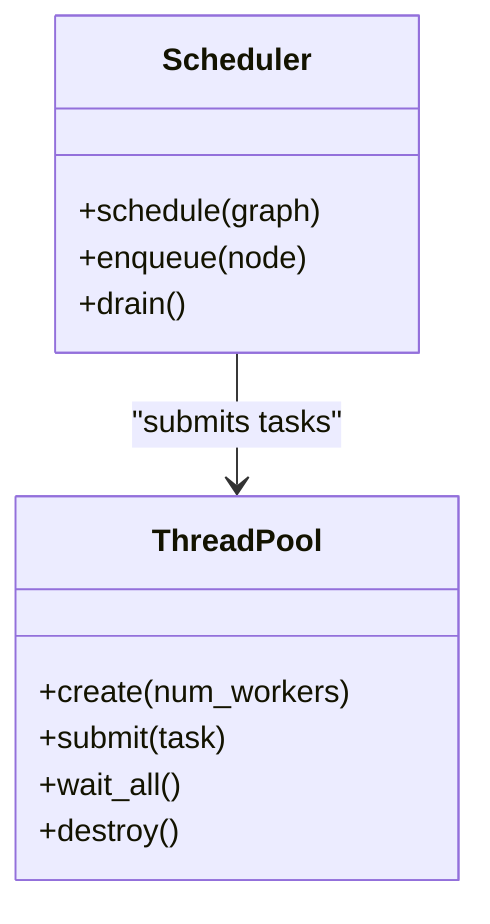
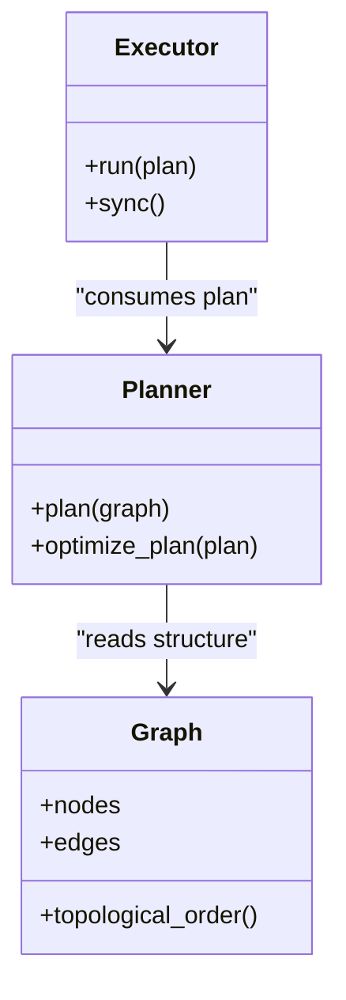
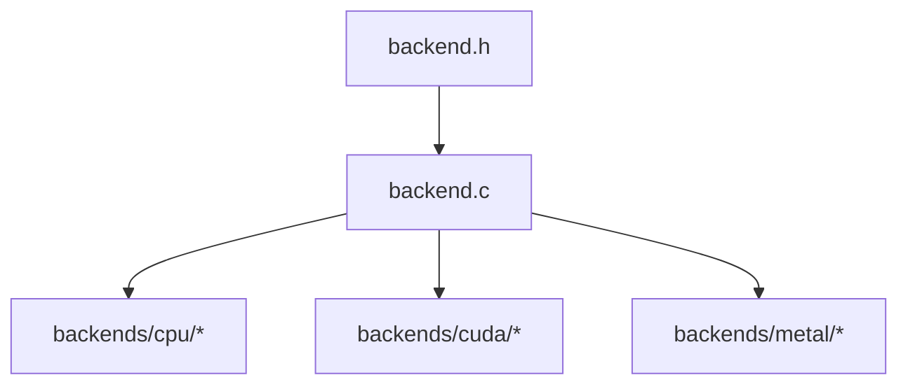
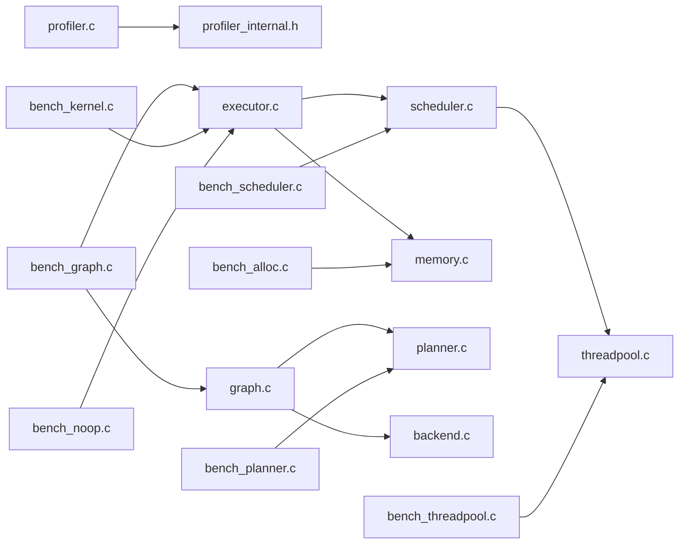

# Performance Optimization

<cite>
**Referenced Files in This Document**
- [profiler.h](file://src/profiler/profiler.h)
- [profiler.c](file://src/profiler/profiler.c)
- [profiler_internal.h](file://src/profiler/profiler_internal.h)
- [bench_alloc.c](file://benchmarks/bench_alloc.c)
- [bench_graph.c](file://benchmarks/bench_graph.c)
- [bench_kernel.c](file://benchmarks/bench_kernel.c)
- [bench_noop.c](file://benchmarks/bench_noop.c)
- [bench_planner.c](file://benchmarks/bench_planner.c)
- [bench_scheduler.c](file://benchmarks/bench_scheduler.c)
- [bench_threadpool.c](file://benchmarks/bench_threadpool.c)
- [memory.h](file://src/memory/memory.h)
- [memory.c](file://src/memory/memory.c)
- [memory_internal.h](file://src/memory/memory_internal.h)
- [threadpool.h](file://src/threadpool/threadpool.h)
- [threadpool.c](file://src/threadpool/threadpool.c)
- [scheduler.h](file://src/scheduler/scheduler.h)
- [scheduler.c](file://src/scheduler/scheduler.c)
- [executor.h](file://src/executor/executor.h)
- [executor.c](file://src/executor/executor.c)
- [graph.h](file://src/graph/graph.h)
- [graph.c](file://src/graph/graph.c)
- [planner.h](file://src/planner/planner.h)
- [planner.c](file://src/planner/planner.c)
- [backend.h](file://src/backend/backend.h)
- [backend.c](file://src/backend/backend.c)
- [CMakeLists.txt](file://benchmarks/CMakeLists.txt)
</cite>

## Table of Contents
1. [Introduction](#introduction)
2. [Project Structure](#project-structure)
3. [Core Components](#core-components)
4. [Architecture Overview](#architecture-overview)
5. [Detailed Component Analysis](#detailed-component-analysis)
6. [Dependency Analysis](#dependency-analysis)
7. [Performance Considerations](#performance-considerations)
8. [Troubleshooting Guide](#troubleshooting-guide)
9. [Conclusion](#conclusion)
10. [Appendices](#appendices)

## Introduction
This guide explains how to measure, analyze, and optimize performance in Hummingbird using the built-in profiler, benchmark suite, and memory subsystem. It covers profiling tools and techniques, benchmarking methodologies, memory optimization strategies (including memory pool usage), and hardware-specific tuning for CPU, CUDA, and Metal backends. The content is organized for both beginners learning performance measurement concepts and experienced developers optimizing inference pipelines.

Key terminology used throughout:
- profiler: component that records timing and optional metadata around operations
- benchmark: a controlled workload used to measure performance characteristics
- memory pool: a reusable allocator strategy to reduce allocation overhead
- optimization: any change intended to improve latency, throughput, or resource utilization

## Project Structure
The performance-related code spans several modules:
- Profiling API and implementation under src/profiler
- Benchmark harnesses under benchmarks
- Memory management under src/memory
- Concurrency primitives under src/threadpool and src/scheduler
- Execution orchestration under src/executor, src/graph, and src/planner
- Backend abstractions under src/backend and platform-specific implementations under backends

**Diagram sources**
- [profiler.h](file://src/profiler/profiler.h)
- [profiler.c](file://src/profiler/profiler.c)
- [profiler_internal.h](file://src/profiler/profiler_internal.h)
- [bench_alloc.c](file://benchmarks/bench_alloc.c)
- [bench_graph.c](file://benchmarks/bench_graph.c)
- [bench_kernel.c](file://benchmarks/bench_kernel.c)
- [bench_noop.c](file://benchmarks/bench_noop.c)
- [bench_planner.c](file://benchmarks/bench_planner.c)
- [bench_scheduler.c](file://benchmarks/bench_scheduler.c)
- [bench_threadpool.c](file://benchmarks/bench_threadpool.c)
- [memory.h](file://src/memory/memory.h)
- [memory.c](file://src/memory/memory.c)
- [memory_internal.h](file://src/memory/memory_internal.h)
- [threadpool.h](file://src/threadpool/threadpool.h)
- [threadpool.c](file://src/threadpool/threadpool.c)
- [scheduler.h](file://src/scheduler/scheduler.h)
- [scheduler.c](file://src/scheduler/scheduler.c)
- [executor.h](file://src/executor/executor.h)
- [executor.c](file://src/executor/executor.c)
- [graph.h](file://src/graph/graph.h)
- [graph.c](file://src/graph/graph.c)
- [planner.h](file://src/planner/planner.h)
- [planner.c](file://src/planner/planner.c)
- [backend.h](file://src/backend/backend.h)
- [backend.c](file://src/backend/backend.c)

**Section sources**
- [profiler.h](file://src/profiler/profiler.h)
- [profiler.c](file://src/profiler/profiler.c)
- [profiler_internal.h](file://src/profiler/profiler_internal.h)
- [bench_alloc.c](file://benchmarks/bench_alloc.c)
- [bench_graph.c](file://benchmarks/bench_graph.c)
- [bench_kernel.c](file://benchmarks/bench_kernel.c)
- [bench_noop.c](file://benchmarks/bench_noop.c)
- [bench_planner.c](file://benchmarks/bench_planner.c)
- [bench_scheduler.c](file://benchmarks/bench_scheduler.c)
- [bench_threadpool.c](file://benchmarks/bench_threadpool.c)
- [memory.h](file://src/memory/memory.h)
- [memory.c](file://src/memory/memory.c)
- [memory_internal.h](file://src/memory/memory_internal.h)
- [threadpool.h](file://src/threadpool/threadpool.h)
- [threadpool.c](file://src/threadpool/threadpool.c)
- [scheduler.h](file://src/scheduler/scheduler.h)
- [scheduler.c](file://src/scheduler/scheduler.c)
- [executor.h](file://src/executor/executor.h)
- [executor.c](file://src/executor/executor.c)
- [graph.h](file://src/graph/graph.h)
- [graph.c](file://src/graph/graph.c)
- [planner.h](file://src/planner/planner.h)
- [planner.c](file://src/planner/planner.c)
- [backend.h](file://src/backend/backend.h)
- [backend.c](file://src/backend/backend.c)

## Core Components
- Profiler: Provides APIs to start/stop timing regions and record metrics. Internal structures capture per-region timings and aggregation.
- Benchmarks: Focused workloads exercising allocators, graph execution, kernels, planning, scheduling, and threadpools.
- Memory: Allocator interfaces and internal details; supports pooling strategies to reduce allocation churn.
- Threadpool and Scheduler: Provide parallelism primitives and task dispatch used by executors and kernels.
- Executor, Graph, Planner: Orchestrate model execution, dependency resolution, and kernel invocation.
- Backend: Abstraction over device-specific implementations (CPU, CUDA, Metal).

Practical examples are referenced via file paths rather than code snippets.

**Section sources**
- [profiler.h](file://src/profiler/profiler.h)
- [profiler.c](file://src/profiler/profiler.c)
- [profiler_internal.h](file://src/profiler/profiler_internal.h)
- [bench_alloc.c](file://benchmarks/bench_alloc.c)
- [bench_graph.c](file://benchmarks/bench_graph.c)
- [bench_kernel.c](file://benchmarks/bench_kernel.c)
- [bench_noop.c](file://benchmarks/bench_noop.c)
- [bench_planner.c](file://benchmarks/bench_planner.c)
- [bench_scheduler.c](file://benchmarks/bench_scheduler.c)
- [bench_threadpool.c](file://benchmarks/bench_threadpool.c)
- [memory.h](file://src/memory/memory.h)
- [memory.c](file://src/memory/memory.c)
- [memory_internal.h](file://src/memory/memory_internal.h)
- [threadpool.h](file://src/threadpool/threadpool.h)
- [threadpool.c](file://src/threadpool/threadpool.c)
- [scheduler.h](file://src/scheduler/scheduler.h)
- [scheduler.c](file://src/scheduler/scheduler.c)
- [executor.h](file://src/executor/executor.h)
- [executor.c](file://src/executor/executor.c)
- [graph.h](file://src/graph/graph.h)
- [graph.c](file://src/graph/graph.c)
- [planner.h](file://src/planner/planner.h)
- [planner.c](file://src/planner/planner.c)
- [backend.h](file://src/backend/backend.h)
- [backend.c](file://src/backend/backend.c)

## Architecture Overview
The performance pipeline integrates profiling with execution and concurrency layers. The profiler can wrap high-level operations (e.g., executor runs) and low-level kernels. Benchmarks exercise these layers to produce reproducible measurements.

**Diagram sources**
- [bench_graph.c](file://benchmarks/bench_graph.c)
- [executor.h](file://src/executor/executor.h)
- [executor.c](file://src/executor/executor.c)
- [graph.h](file://src/graph/graph.h)
- [graph.c](file://src/graph/graph.c)
- [scheduler.h](file://src/scheduler/scheduler.h)
- [scheduler.c](file://src/scheduler/scheduler.c)
- [threadpool.h](file://src/threadpool/threadpool.h)
- [threadpool.c](file://src/threadpool/threadpool.c)
- [profiler.h](file://src/profiler/profiler.h)
- [memory.h](file://src/memory/memory.h)
- [backend.h](file://src/backend/backend.h)

## Detailed Component Analysis

### Profiler
The profiler exposes functions to mark timing regions and collect aggregated statistics. Internally, it maintains state for active regions and accumulates durations. Use it to instrument your own hot paths or rely on existing instrumentation in benchmarks.

**Diagram sources**
- [profiler.h](file://src/profiler/profiler.h)
- [profiler.c](file://src/profiler/profiler.c)
- [profiler_internal.h](file://src/profiler/profiler_internal.h)

Practical example references:
- Instrument a custom loop: see [profiler.h](file://src/profiler/profiler.h) and [profiler.c](file://src/profiler/profiler.c)
- Aggregate and export results: see [profiler_internal.h](file://src/profiler/profiler_internal.h)

**Section sources**
- [profiler.h](file://src/profiler/profiler.h)
- [profiler.c](file://src/profiler/profiler.c)
- [profiler_internal.h](file://src/profiler/profiler_internal.h)

### Benchmark Suite
The benchmark directory contains focused tests for different subsystems:
- bench_alloc.c: allocator throughput and fragmentation
- bench_graph.c: end-to-end graph execution latency/throughput
- bench_kernel.c: kernel-level performance
- bench_noop.c: baseline overhead and scheduler plumbing
- bench_planner.c: planning time and plan quality
- bench_scheduler.c: task scheduling efficiency
- bench_threadpool.c: worker utilization and contention

**Diagram sources**
- [bench_alloc.c](file://benchmarks/bench_alloc.c)
- [bench_graph.c](file://benchmarks/bench_graph.c)
- [bench_kernel.c](file://benchmarks/bench_kernel.c)
- [bench_noop.c](file://benchmarks/bench_noop.c)
- [bench_planner.c](file://benchmarks/bench_planner.c)
- [bench_scheduler.c](file://benchmarks/bench_scheduler.c)
- [bench_threadpool.c](file://benchmarks/bench_threadpool.c)
- [CMakeLists.txt](file://benchmarks/CMakeLists.txt)

Practical example references:
- Measure allocator performance: [bench_alloc.c](file://benchmarks/bench_alloc.c)
- Measure graph execution: [bench_graph.c](file://benchmarks/bench_graph.c)
- Measure kernel performance: [bench_kernel.c](file://benchmarks/bench_kernel.c)
- Establish baseline overhead: [bench_noop.c](file://benchmarks/bench_noop.c)
- Measure planning cost: [bench_planner.c](file://benchmarks/bench_planner.c)
- Measure scheduling efficiency: [bench_scheduler.c](file://benchmarks/bench_scheduler.c)
- Measure threadpool behavior: [bench_threadpool.c](file://benchmarks/bench_threadpool.c)

**Section sources**
- [bench_alloc.c](file://benchmarks/bench_alloc.c)
- [bench_graph.c](file://benchmarks/bench_graph.c)
- [bench_kernel.c](file://benchmarks/bench_kernel.c)
- [bench_noop.c](file://benchmarks/bench_noop.c)
- [bench_planner.c](file://benchmarks/bench_planner.c)
- [bench_scheduler.c](file://benchmarks/bench_scheduler.c)
- [bench_threadpool.c](file://benchmarks/bench_threadpool.c)
- [CMakeLists.txt](file://benchmarks/CMakeLists.txt)

### Memory Management and Memory Pool
The memory subsystem provides allocation APIs and internal mechanisms. A memory pool reduces allocation overhead by reusing buffers across runs. Tune pool sizes and lifetimes to match workload patterns.

**Diagram sources**
- [memory.h](file://src/memory/memory.h)
- [memory.c](file://src/memory/memory.c)
- [memory_internal.h](file://src/memory/memory_internal.h)

Practical example references:
- Configure and use a memory pool: [memory.h](file://src/memory/memory.h), [memory.c](file://src/memory/memory.c)
- Inspect internal pool structures: [memory_internal.h](file://src/memory/memory_internal.h)

**Section sources**
- [memory.h](file://src/memory/memory.h)
- [memory.c](file://src/memory/memory.c)
- [memory_internal.h](file://src/memory/memory_internal.h)

### Concurrency: Threadpool and Scheduler
The threadpool manages worker threads; the scheduler dispatches tasks based on dependencies. Proper sizing and affinity settings can significantly impact performance.

**Diagram sources**
- [threadpool.h](file://src/threadpool/threadpool.h)
- [threadpool.c](file://src/threadpool/threadpool.c)
- [scheduler.h](file://src/scheduler/scheduler.h)
- [scheduler.c](file://src/scheduler/scheduler.c)

Practical example references:
- Tune worker count and observe effects: [threadpool.c](file://src/threadpool/threadpool.c)
- Validate scheduling order and contention: [scheduler.c](file://src/scheduler/scheduler.c)

**Section sources**
- [threadpool.h](file://src/threadpool/threadpool.h)
- [threadpool.c](file://src/threadpool/threadpool.c)
- [scheduler.h](file://src/scheduler/scheduler.h)
- [scheduler.c](file://src/scheduler/scheduler.c)

### Execution Orchestration: Executor, Graph, Planner
The planner builds an execution plan from a graph; the executor runs the plan; the graph runner coordinates node execution and dependencies.

**Diagram sources**
- [planner.h](file://src/planner/planner.h)
- [planner.c](file://src/planner/planner.c)
- [graph.h](file://src/graph/graph.h)
- [graph.c](file://src/graph/graph.c)
- [executor.h](file://src/executor/executor.h)
- [executor.c](file://src/executor/executor.c)

Practical example references:
- Profile planning phase: [planner.c](file://src/planner/planner.c)
- Profile execution phase: [executor.c](file://src/executor/executor.c)
- Inspect graph structure: [graph.c](file://src/graph/graph.c)

**Section sources**
- [planner.h](file://src/planner/planner.h)
- [planner.c](file://src/planner/planner.c)
- [graph.h](file://src/graph/graph.h)
- [graph.c](file://src/graph/graph.c)
- [executor.h](file://src/executor/executor.h)
- [executor.c](file://src/executor/executor.c)

### Backend Integration
The backend abstraction allows plugging in device-specific implementations (CPU, CUDA, Metal). Hardware-specific tuning includes vectorization flags, memory alignment, and device stream configuration.

**Diagram sources**
- [backend.h](file://src/backend/backend.h)
- [backend.c](file://src/backend/backend.c)

Practical example references:
- Select backend at runtime: [backend.c](file://src/backend/backend.c)
- Tune CPU kernels: [backends/cpu/backend_cpu_kernels.c](file://backends/cpu/backend_cpu_kernels.c)
- Tune CUDA streams and memory: [backends/cuda/backend_cuda.cu](file://backends/cuda/backend_cuda.cu)
- Tune Metal command queues: [backends/metal/backend_metal.m](file://backends/metal/backend_metal.m)

**Section sources**
- [backend.h](file://src/backend/backend.h)
- [backend.c](file://src/backend/backend.c)
- [backends/cpu/backend_cpu_kernels.c](file://backends/cpu/backend_cpu_kernels.c)
- [backends/cuda/backend_cuda.cu](file://backends/cuda/backend_cuda.cu)
- [backends/metal/backend_metal.m](file://backends/metal/backend_metal.m)

## Dependency Analysis
The following diagram shows key dependencies among performance-critical components.

**Diagram sources**
- [profiler.c](file://src/profiler/profiler.c)
- [profiler_internal.h](file://src/profiler/profiler_internal.h)
- [bench_graph.c](file://benchmarks/bench_graph.c)
- [executor.c](file://src/executor/executor.c)
- [graph.c](file://src/graph/graph.c)
- [scheduler.c](file://src/scheduler/scheduler.c)
- [threadpool.c](file://src/threadpool/threadpool.c)
- [memory.c](file://src/memory/memory.c)
- [planner.c](file://src/planner/planner.c)
- [backend.c](file://src/backend/backend.c)
- [bench_alloc.c](file://benchmarks/bench_alloc.c)
- [bench_kernel.c](file://benchmarks/bench_kernel.c)
- [bench_noop.c](file://benchmarks/bench_noop.c)
- [bench_planner.c](file://benchmarks/bench_planner.c)
- [bench_scheduler.c](file://benchmarks/bench_scheduler.c)
- [bench_threadpool.c](file://benchmarks/bench_threadpool.c)

**Section sources**
- [profiler.c](file://src/profiler/profiler.c)
- [profiler_internal.h](file://src/profiler/profiler_internal.h)
- [bench_graph.c](file://benchmarks/bench_graph.c)
- [executor.c](file://src/executor/executor.c)
- [graph.c](file://src/graph/graph.c)
- [scheduler.c](file://src/scheduler/scheduler.c)
- [threadpool.c](file://src/threadpool/threadpool.c)
- [memory.c](file://src/memory/memory.c)
- [planner.c](file://src/planner/planner.c)
- [backend.c](file://src/backend/backend.c)
- [bench_alloc.c](file://benchmarks/bench_alloc.c)
- [bench_kernel.c](file://benchmarks/bench_kernel.c)
- [bench_noop.c](file://benchmarks/bench_noop.c)
- [bench_planner.c](file://benchmarks/bench_planner.c)
- [bench_scheduler.c](file://benchmarks/bench_scheduler.c)
- [bench_threadpool.c](file://benchmarks/bench_threadpool.c)

## Performance Considerations
- Profiling granularity: Prefer coarse-grained regions first (e.g., full graph run), then drill down into hot kernels or planning phases.
- Warm-up and steady-state: Always discard initial runs to avoid cold-start effects and cache misses.
- Statistical rigor: Repeat runs and report median/percentiles, not just averages.
- Memory pool sizing: Size pools to typical tensor shapes; too small causes frequent reallocation, too large wastes memory.
- Threadpool sizing: Match worker count to physical cores; consider NUMA locality and I/O overlap.
- Backends: Enable appropriate compiler flags and vectorization options; ensure proper memory alignment for SIMD.
- Overhead accounting: Use a noop benchmark to quantify framework overhead and subtract it when evaluating gains.

[No sources needed since this section provides general guidance]

## Troubleshooting Guide
Common issues and where to look:
- High allocation overhead: Check memory pool usage and fragmentation; compare against allocator benchmark.
  - References: [memory.h](file://src/memory/memory.h), [memory.c](file://src/memory/memory.c), [bench_alloc.c](file://benchmarks/bench_alloc.c)
- Low throughput due to contention: Inspect scheduler and threadpool metrics; adjust worker counts and task batching.
  - References: [scheduler.c](file://src/scheduler/scheduler.c), [threadpool.c](file://src/threadpool/threadpool.c), [bench_scheduler.c](file://benchmarks/bench_scheduler.c), [bench_threadpool.c](file://benchmarks/bench_threadpool.c)
- Planning dominates latency: Profile planner and consider caching plans for repeated graphs.
  - References: [planner.c](file://src/planner/planner.c), [bench_planner.c](file://benchmarks/bench_planner.c)
- Kernel bottlenecks: Use kernel benchmark and backend-specific tuning (vectorization, memory coalescing).
  - References: [bench_kernel.c](file://benchmarks/bench_kernel.c), [backend.c](file://src/backend/backend.c)
- Baseline drift: Compare against noop benchmark to detect changes in framework overhead.
  - References: [bench_noop.c](file://benchmarks/bench_noop.c)

**Section sources**
- [memory.h](file://src/memory/memory.h)
- [memory.c](file://src/memory/memory.c)
- [bench_alloc.c](file://benchmarks/bench_alloc.c)
- [scheduler.c](file://src/scheduler/scheduler.c)
- [threadpool.c](file://src/threadpool/threadpool.c)
- [bench_scheduler.c](file://benchmarks/bench_scheduler.c)
- [bench_threadpool.c](file://benchmarks/bench_threadpool.c)
- [planner.c](file://src/planner/planner.c)
- [bench_planner.c](file://benchmarks/bench_planner.c)
- [bench_kernel.c](file://benchmarks/bench_kernel.c)
- [backend.c](file://src/backend/backend.c)
- [bench_noop.c](file://benchmarks/bench_noop.c)

## Conclusion
Use the profiler to identify hotspots, the benchmark suite to validate changes, and the memory subsystem to minimize allocation overhead. Combine careful measurement with targeted optimizations—pool sizing, threadpool tuning, and backend-specific adjustments—to achieve meaningful performance gains. Iterate with data-driven decisions and always compare against stable baselines.

[No sources needed since this section summarizes without analyzing specific files]

## Appendices

### Practical Workflows

#### Workflow A: End-to-end Inference Optimization
- Define a representative input distribution and batch size.
- Run the graph benchmark to establish baseline latency/throughput.
- Wrap the executor call with profiler regions to isolate planning vs execution.
- If planning dominates, cache plans and profile again.
- If execution dominates, inspect kernel times and backend settings.
- Adjust memory pool sizes and rerun allocator and graph benchmarks.
- Tune threadpool workers and re-run scheduler and threadpool benchmarks.
- Confirm improvements with statistical reporting.

References:
- [bench_graph.c](file://benchmarks/bench_graph.c)
- [profiler.h](file://src/profiler/profiler.h)
- [planner.c](file://src/planner/planner.c)
- [executor.c](file://src/executor/executor.c)
- [memory.c](file://src/memory/memory.c)
- [scheduler.c](file://src/scheduler/scheduler.c)
- [threadpool.c](file://src/threadpool/threadpool.c)

#### Workflow B: Kernel-Level Optimization
- Isolate the target kernel using the kernel benchmark.
- Profile with the profiler around kernel launch and compute regions.
- Apply backend-specific optimizations (alignment, vectorization, memory layout).
- Re-run kernel benchmark and compare results.

References:
- [bench_kernel.c](file://benchmarks/bench_kernel.c)
- [backend.c](file://src/backend/backend.c)
- [profiler.c](file://src/profiler/profiler.c)