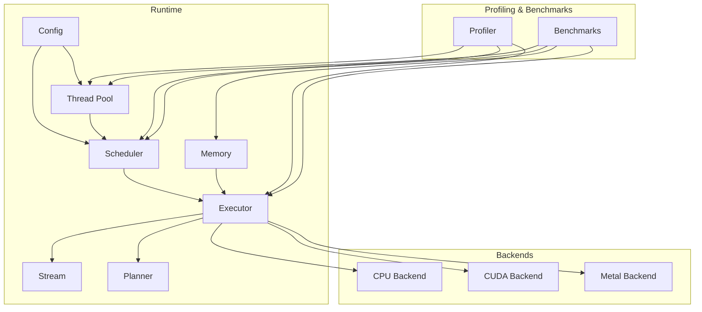
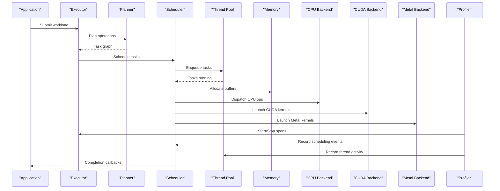
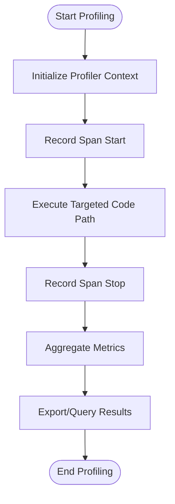
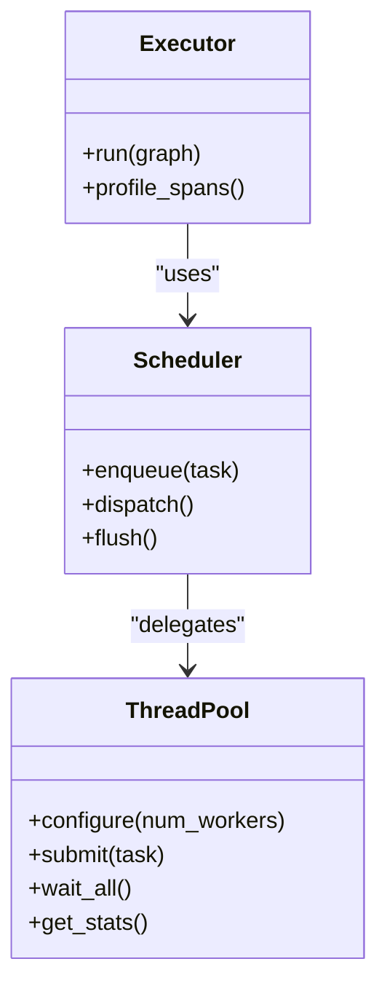
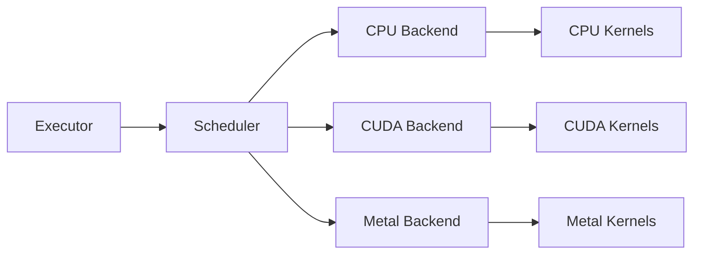
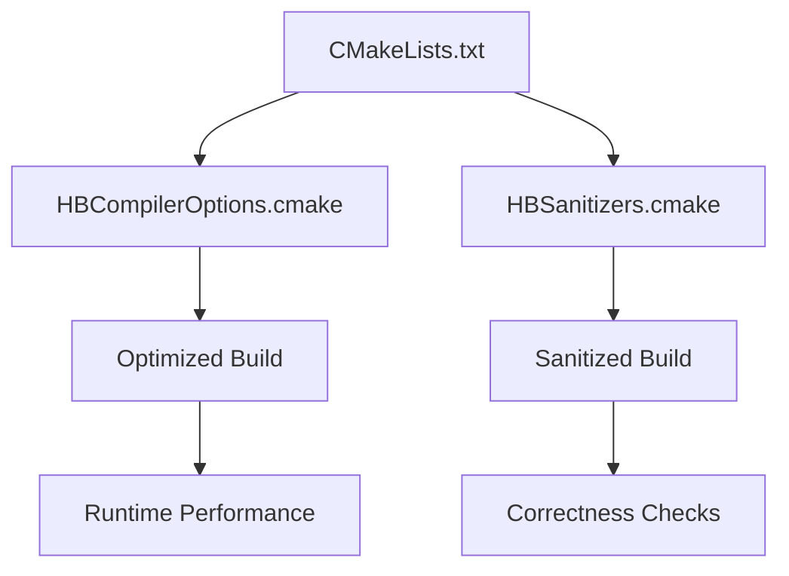

# Performance Tuning and Profiling

<cite>
**Referenced Files in This Document**
- [profiler.c](file://src/profiler/profiler.c)
- [profiler.h](file://src/profiler/profiler.h)
- [profiler_internal.h](file://src/profiler/profiler_internal.h)
- [bench_alloc.c](file://benchmarks/bench_alloc.c)
- [bench_graph.c](file://benchmarks/bench_graph.c)
- [bench_kernel.c](file://benchmarks/bench_kernel.c)
- [bench_noop.c](file://benchmarks/bench_noop.c)
- [bench_planner.c](file://benchmarks/bench_planner.c)
- [bench_scheduler.c](file://benchmarks/bench_scheduler.c)
- [bench_threadpool.c](file://benchmarks/bench_threadpool.c)
- [CMakeLists.txt](file://CMakeLists.txt)
- [HBCompilerOptions.cmake](file://cmake/modules/HBCompilerOptions.cmake)
- [HBSanitizers.cmake](file://cmake/modules/HBSanitizers.cmake)
- [threadpool.c](file://src/threadpool/threadpool.c)
- [threadpool.h](file://src/threadpool/threadpool.h)
- [threadpool_internal.h](file://src/threadpool/threadpool_internal.h)
- [memory.c](file://src/memory/memory.c)
- [memory.h](file://src/memory/memory.h)
- [memory_internal.h](file://src/memory/memory_internal.h)
- [backend_cpu.c](file://backends/cpu/backend_cpu.c)
- [backend_cpu_kernels.c](file://backends/cpu/backend_cpu_kernels.c)
- [backend_cuda.cu](file://backends/cuda/backend_cuda.cu)
- [backend_metal.m](file://backends/metal/backend_metal.m)
- [config.c](file://src/config/config.c)
- [config.h](file://src/config/config.h)
- [config_internal.h](file://src/config/config_internal.h)
- [scheduler.c](file://src/scheduler/scheduler.c)
- [scheduler.h](file://src/scheduler/scheduler.h)
- [planner.c](file://src/planner/planner.c)
- [planner.h](file://src/planner/planner.h)
- [executor.c](file://src/executor/executor.c)
- [executor.h](file://src/executor/executor.h)
- [stream.c](file://src/stream/stream.c)
- [stream.h](file://src/stream/stream.h)
</cite>

## Table of Contents
1. [Introduction](#introduction)
2. [Project Structure](#project-structure)
3. [Core Components](#core-components)
4. [Architecture Overview](#architecture-overview)
5. [Detailed Component Analysis](#detailed-component-analysis)
6. [Dependency Analysis](#dependency-analysis)
7. [Performance Considerations](#performance-considerations)
8. [Troubleshooting Guide](#troubleshooting-guide)
9. [Conclusion](#conclusion)
10. [Appendices](#appendices)

## Introduction
This document provides a comprehensive guide to performance tuning and profiling for Hummingbird. It covers profiling tools, benchmarking frameworks, and analysis techniques across CPU, GPU, and memory subsystems. You will learn how to identify bottlenecks, interpret profiling data, apply hardware-specific tuning, configure compiler flags, and optimize runtime behavior including multi-threading, memory pool sizing, and kernel fusion opportunities. The guide also outlines systematic approaches for regression testing, continuous monitoring, and capacity planning in production.

## Project Structure
The repository organizes performance-related code into dedicated modules:
- Profiler module for timing and event collection
- Benchmarks suite for micro- and macro-level measurements
- Thread pool and scheduler for concurrency control
- Memory subsystem for allocation strategies
- Backend implementations for CPU, CUDA, and Metal
- Configuration system for runtime knobs
- Build configuration for compiler options and sanitizers

**Diagram sources**
- [profiler.c](file://src/profiler/profiler.c)
- [threadpool.c](file://src/threadpool/threadpool.c)
- [scheduler.c](file://src/scheduler/scheduler.c)
- [memory.c](file://src/memory/memory.c)
- [backend_cpu.c](file://backends/cpu/backend_cpu.c)
- [backend_cuda.cu](file://backends/cuda/backend_cuda.cu)
- [backend_metal.m](file://backends/metal/backend_metal.m)
- [config.c](file://src/config/config.c)
- [bench_alloc.c](file://benchmarks/bench_alloc.c)
- [bench_graph.c](file://benchmarks/bench_graph.c)
- [bench_kernel.c](file://benchmarks/bench_kernel.c)
- [bench_noop.c](file://benchmarks/bench_noop.c)
- [bench_planner.c](file://benchmarks/bench_planner.c)
- [bench_scheduler.c](file://benchmarks/bench_scheduler.c)
- [bench_threadpool.c](file://benchmarks/bench_threadpool.c)

**Section sources**
- [profiler.c](file://src/profiler/profiler.c)
- [threadpool.c](file://src/threadpool/threadpool.c)
- [scheduler.c](file://src/scheduler/scheduler.c)
- [memory.c](file://src/memory/memory.c)
- [backend_cpu.c](file://backends/cpu/backend_cpu.c)
- [backend_cuda.cu](file://backends/cuda/backend_cuda.cu)
- [backend_metal.m](file://backends/metal/backend_metal.m)
- [config.c](file://src/config/config.c)
- [bench_alloc.c](file://benchmarks/bench_alloc.c)
- [bench_graph.c](file://benchmarks/bench_graph.c)
- [bench_kernel.c](file://benchmarks/bench_kernel.c)
- [bench_noop.c](file://benchmarks/bench_noop.c)
- [bench_planner.c](file://benchmarks/bench_planner.c)
- [bench_scheduler.c](file://benchmarks/bench_scheduler.c)
- [bench_threadpool.c](file://benchmarks/bench_threadpool.c)

## Core Components
- Profiler: Captures timing events around execution units and aggregates metrics for analysis.
- Benchmarks: Focused tests for allocator, graph, kernels, planner, scheduler, thread pool, and no-op paths.
- Thread Pool: Manages worker threads and task dispatch; key to CPU utilization and latency.
- Scheduler: Orders and schedules tasks across streams and backends.
- Memory: Allocation pools, alignment, and reuse strategies impacting throughput and fragmentation.
- Backends: CPU, CUDA, and Metal implementations with device-specific optimizations.
- Config: Runtime parameters controlling threading, scheduling, and backend behavior.

Key implementation references:
- Profiler API and internals
- Benchmark harnesses for targeted measurement
- Thread pool configuration and usage
- Memory pool and allocation patterns
- Backend entry points and kernel dispatch
- Configuration keys and defaults

**Section sources**
- [profiler.c](file://src/profiler/profiler.c)
- [profiler.h](file://src/profiler/profiler.h)
- [profiler_internal.h](file://src/profiler/profiler_internal.h)
- [bench_alloc.c](file://benchmarks/bench_alloc.c)
- [bench_graph.c](file://benchmarks/bench_graph.c)
- [bench_kernel.c](file://benchmarks/bench_kernel.c)
- [bench_noop.c](file://benchmarks/bench_noop.c)
- [bench_planner.c](file://benchmarks/bench_planner.c)
- [bench_scheduler.c](file://benchmarks/bench_scheduler.c)
- [bench_threadpool.c](file://benchmarks/bench_threadpool.c)
- [threadpool.c](file://src/threadpool/threadpool.c)
- [threadpool.h](file://src/threadpool/threadpool.h)
- [threadpool_internal.h](file://src/threadpool/threadpool_internal.h)
- [memory.c](file://src/memory/memory.c)
- [memory.h](file://src/memory/memory.h)
- [memory_internal.h](file://src/memory/memory_internal.h)
- [backend_cpu.c](file://backends/cpu/backend_cpu.c)
- [backend_cpu_kernels.c](file://backends/cpu/backend_cpu_kernels.c)
- [backend_cuda.cu](file://backends/cuda/backend_cuda.cu)
- [backend_metal.m](file://backends/metal/backend_metal.m)
- [config.c](file://src/config/config.c)
- [config.h](file://src/config/config.h)
- [config_internal.h](file://src/config/config_internal.h)

## Architecture Overview
The runtime orchestrates work through the executor and planner, which schedule tasks on the scheduler. The scheduler enqueues operations into streams and dispatches them to backends (CPU/CUDA/Metal). The profiler wraps critical sections to collect timing and resource usage. Benchmarks exercise these paths to measure performance characteristics.

**Diagram sources**
- [executor.c](file://src/executor/executor.c)
- [planner.c](file://src/planner/planner.c)
- [scheduler.c](file://src/scheduler/scheduler.c)
- [threadpool.c](file://src/threadpool/threadpool.c)
- [memory.c](file://src/memory/memory.c)
- [backend_cpu.c](file://backends/cpu/backend_cpu.c)
- [backend_cuda.cu](file://backends/cuda/backend_cuda.cu)
- [backend_metal.m](file://backends/metal/backend_metal.m)
- [profiler.c](file://src/profiler/profiler.c)

## Detailed Component Analysis

### Profiler Module
The profiler provides timing instrumentation and event aggregation. Use it to:
- Wrap high-level execution phases
- Measure per-kernel or per-task durations
- Correlate scheduling and thread activity

Typical workflow:
- Initialize profiler context
- Mark start/stop spans around critical regions
- Export or query aggregated metrics
- Integrate with CI benchmarks for regression detection

**Diagram sources**
- [profiler.c](file://src/profiler/profiler.c)
- [profiler.h](file://src/profiler/profiler.h)
- [profiler_internal.h](file://src/profiler/profiler_internal.h)

**Section sources**
- [profiler.c](file://src/profiler/profiler.c)
- [profiler.h](file://src/profiler/profiler.h)
- [profiler_internal.h](file://src/profiler/profiler_internal.h)

### Benchmark Suite
The benchmarks cover:
- Allocator throughput and fragmentation
- Graph construction and traversal
- Kernel hot paths
- Planner decisions and overhead
- Scheduler efficiency and contention
- Thread pool scaling and affinity
- No-op baseline for infrastructure overhead

Recommended approach:
- Run micro-benchmarks under controlled conditions
- Compare results across configurations and builds
- Track regressions via CI pipelines
- Use consistent warm-up and iteration counts

**Section sources**
- [bench_alloc.c](file://benchmarks/bench_alloc.c)
- [bench_graph.c](file://benchmarks/bench_graph.c)
- [bench_kernel.c](file://benchmarks/bench_kernel.c)
- [bench_noop.c](file://benchmarks/bench_noop.c)
- [bench_planner.c](file://benchmarks/bench_planner.c)
- [bench_scheduler.c](file://benchmarks/bench_scheduler.c)
- [bench_threadpool.c](file://benchmarks/bench_threadpool.c)

### Thread Pool and Concurrency
The thread pool manages worker threads and task distribution. Key tuning areas:
- Number of workers relative to physical cores
- Affinity and NUMA awareness
- Queue depth and backpressure
- Overhead of task submission vs compute time

**Diagram sources**
- [threadpool.c](file://src/threadpool/threadpool.c)
- [threadpool.h](file://src/threadpool/threadpool.h)
- [threadpool_internal.h](file://src/threadpool/threadpool_internal.h)
- [scheduler.c](file://src/scheduler/scheduler.c)
- [executor.c](file://src/executor/executor.c)

**Section sources**
- [threadpool.c](file://src/threadpool/threadpool.c)
- [threadpool.h](file://src/threadpool/threadpool.h)
- [threadpool_internal.h](file://src/threadpool/threadpool_internal.h)
- [scheduler.c](file://src/scheduler/scheduler.c)
- [executor.c](file://src/executor/executor.c)

### Memory Subsystem
Memory optimization focuses on:
- Pool sizing and fragmentation reduction
- Alignment and cache-friendly layouts
- Reuse of buffers across iterations
- Device memory management (pinned host, stream-ordered allocations)

Practical steps:
- Profile allocation hotspots
- Increase pool sizes where fragmentation is observed
- Prefer contiguous allocations for large tensors
- Minimize cross-device copies

**Section sources**
- [memory.c](file://src/memory/memory.c)
- [memory.h](file://src/memory/memory.h)
- [memory_internal.h](file://src/memory/memory_internal.h)

### Backends: CPU, CUDA, Metal
- CPU backend leverages optimized kernels and vectorization; tune parallelism and instruction sets.
- CUDA backend benefits from kernel fusion, coalesced memory access, and occupancy tuning.
- Metal backend requires attention to command buffer batching and resource lifetimes.

**Diagram sources**
- [backend_cpu.c](file://backends/cpu/backend_cpu.c)
- [backend_cpu_kernels.c](file://backends/cpu/backend_cpu_kernels.c)
- [backend_cuda.cu](file://backends/cuda/backend_cuda.cu)
- [backend_metal.m](file://backends/metal/backend_metal.m)

**Section sources**
- [backend_cpu.c](file://backends/cpu/backend_cpu.c)
- [backend_cpu_kernels.c](file://backends/cpu/backend_cpu_kernels.c)
- [backend_cuda.cu](file://backends/cuda/backend_cuda.cu)
- [backend_metal.m](file://backends/metal/backend_metal.m)

### Configuration System
Runtime configuration controls:
- Threading parameters (workers, affinity)
- Scheduling policies (order, priority)
- Backend selection and device IDs
- Profiling verbosity and output format

Use config to:
- Reproduce performance baselines
- Explore parameter sensitivity
- Enable/disable features for targeted tests

**Section sources**
- [config.c](file://src/config/config.c)
- [config.h](file://src/config/config.h)
- [config_internal.h](file://src/config/config_internal.h)

## Dependency Analysis
Build-time and runtime dependencies influence performance:
- Compiler options enable vectorization, link-time optimization, and architecture-specific tuning.
- Sanitizers aid correctness but add overhead; disable for production runs.
- Backend libraries (CUDA, Metal) introduce their own tuning surfaces.

**Diagram sources**
- [CMakeLists.txt](file://CMakeLists.txt)
- [HBCompilerOptions.cmake](file://cmake/modules/HBCompilerOptions.cmake)
- [HBSanitizers.cmake](file://cmake/modules/HBSanitizers.cmake)

**Section sources**
- [CMakeLists.txt](file://CMakeLists.txt)
- [HBCompilerOptions.cmake](file://cmake/modules/HBCompilerOptions.cmake)
- [HBSanitizers.cmake](file://cmake/modules/HBSanitizers.cmake)

## Performance Considerations
- CPU Utilization
  - Tune thread pool size to match physical cores; consider hyperthreading implications.
  - Ensure kernel-level parallelism aligns with data layout for cache efficiency.
  - Use compiler flags for vectorization and LTO; validate with benchmarks.

- Memory Usage Optimization
  - Size memory pools based on peak working set; avoid frequent reallocations.
  - Align tensor dimensions to improve vectorized loads/stores.
  - Reduce cross-device transfers by fusing operations when possible.

- GPU Acceleration Strategies
  - Favor kernel fusion to reduce launch overhead and memory traffic.
  - Coalesce memory accesses and prefer contiguous buffers.
  - Adjust occupancy and block sizes; profile with device profilers.

- Multi-Threading Considerations
  - Avoid oversubscription; pin threads to NUMA nodes if applicable.
  - Batch small tasks to reduce queue contention.
  - Monitor lock contention and adjust granularity.

- Kernel Fusion Opportunities
  - Identify adjacent element-wise or reduction ops that can be merged.
  - Validate fusion gains with targeted benchmarks.
  - Balance fusion depth against register pressure and memory bandwidth.

- Hardware-Specific Tuning Parameters
  - CPU: Instruction set flags, cache line sizes, prefetch hints.
  - CUDA: Stream ordering, pinned memory, shared memory usage.
  - Metal: Command buffer batching, resource lifetime management.

- Compiler Optimization Flags
  - Enable vectorization, interprocedural optimization, and target-specific flags.
  - Use release builds for accurate performance numbers.

- Runtime Configuration Options
  - Control threading, scheduling, and backend selection via config.
  - Toggle profiling verbosity and output formats for different environments.

[No sources needed since this section provides general guidance]

## Troubleshooting Guide
Common issues and diagnostics:
- High CPU idle despite heavy load
  - Check thread pool sizing and task granularity
  - Inspect scheduler queues for starvation
- Memory spikes or fragmentation
  - Analyze allocation patterns and pool sizes
  - Look for repeated small allocations; batch or reuse buffers
- GPU underutilization
  - Profile kernel launches and occupancy
  - Review memory access patterns and fusion opportunities
- Regression detection
  - Establish baseline benchmarks and track changes
  - Use CI to compare new builds against thresholds

Actionable steps:
- Run targeted benchmarks for suspect components
- Enable profiler spans around suspected hot paths
- Compare build configurations (optimized vs sanitized)
- Validate environment settings (NUMA, GPU drivers)

**Section sources**
- [bench_alloc.c](file://benchmarks/bench_alloc.c)
- [bench_kernel.c](file://benchmarks/bench_kernel.c)
- [bench_scheduler.c](file://benchmarks/bench_scheduler.c)
- [bench_threadpool.c](file://benchmarks/bench_threadpool.c)
- [profiler.c](file://src/profiler/profiler.c)

## Conclusion
Effective performance tuning in Hummingbird combines precise profiling, disciplined benchmarking, and targeted optimizations across CPU, GPU, and memory subsystems. By leveraging the profiler, benchmark suite, and configuration system, you can identify bottlenecks, validate improvements, and maintain stable performance in production. Adopt continuous monitoring and regression testing to sustain gains over time.

[No sources needed since this section summarizes without analyzing specific files]

## Appendices

### A. Benchmarking Workflow
- Define scenarios (micro vs macro)
- Select representative datasets
- Warm up, iterate, and aggregate results
- Compare across builds and configurations
- Automate in CI with threshold checks

**Section sources**
- [bench_noop.c](file://benchmarks/bench_noop.c)
- [bench_graph.c](file://benchmarks/bench_graph.c)
- [bench_planner.c](file://benchmarks/bench_planner.c)

### B. Continuous Performance Monitoring
- Capture key metrics (latency, throughput, memory)
- Store historical data and visualize trends
- Alert on regressions beyond acceptable bounds
- Correlate with configuration and environment changes

**Section sources**
- [profiler.c](file://src/profiler/profiler.c)
- [config.c](file://src/config/config.c)

### C. Capacity Planning for Production
- Model expected workload and peak concurrency
- Size thread pools and memory pools accordingly
- Provision GPU resources based on occupancy and bandwidth
- Stress test with realistic traffic patterns

**Section sources**
- [threadpool.c](file://src/threadpool/threadpool.c)
- [memory.c](file://src/memory/memory.c)
- [backend_cuda.cu](file://backends/cuda/backend_cuda.cu)