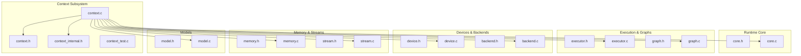
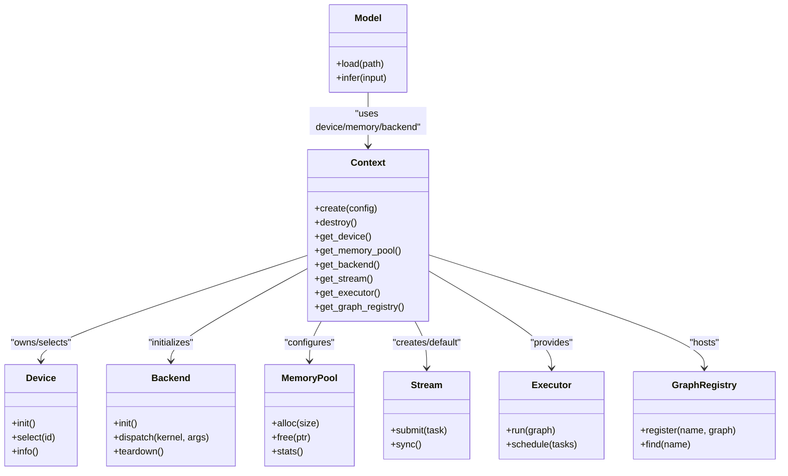
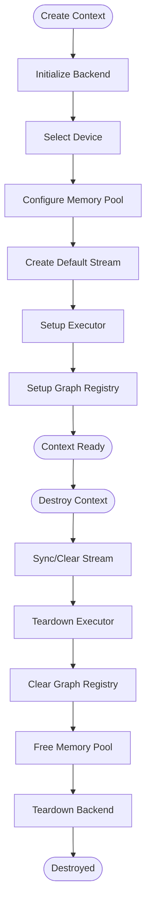
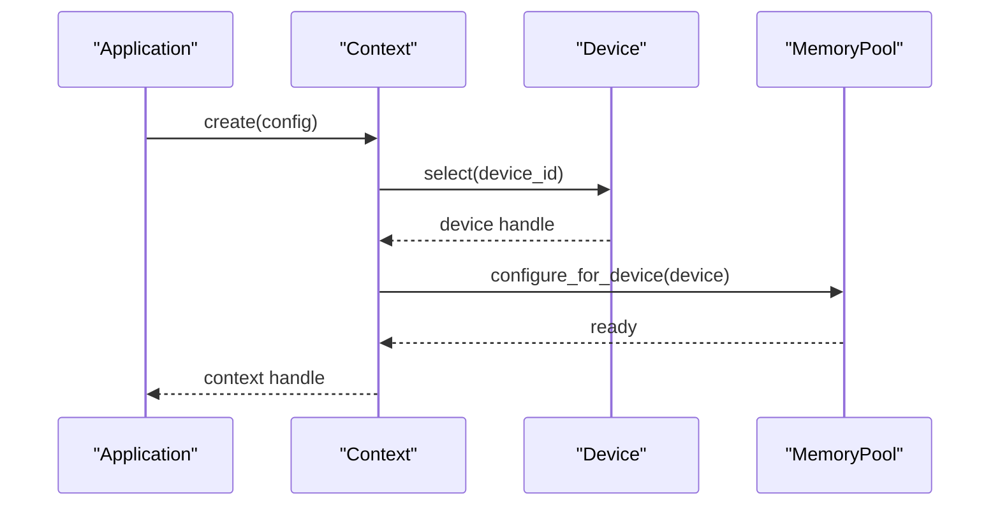
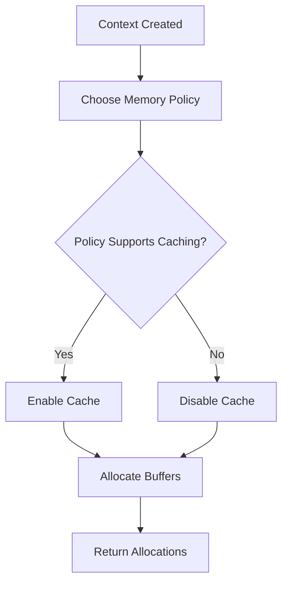
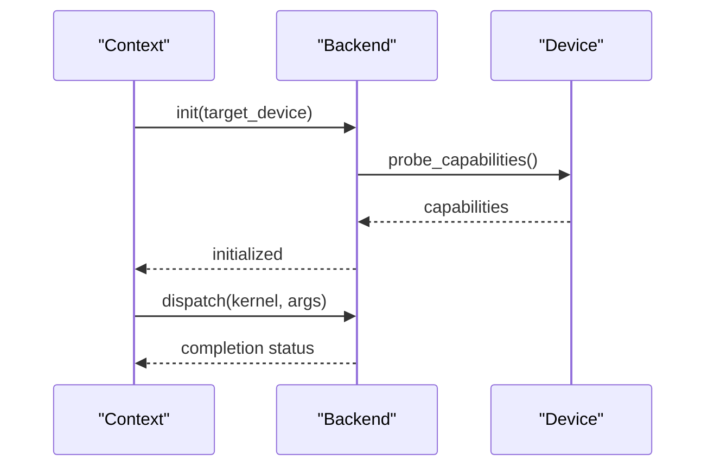
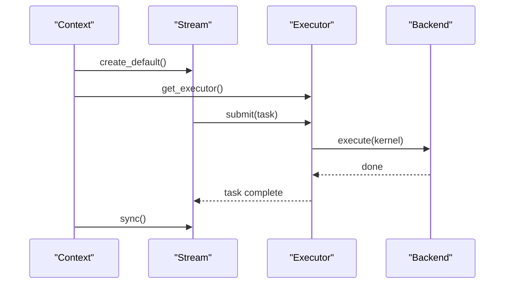
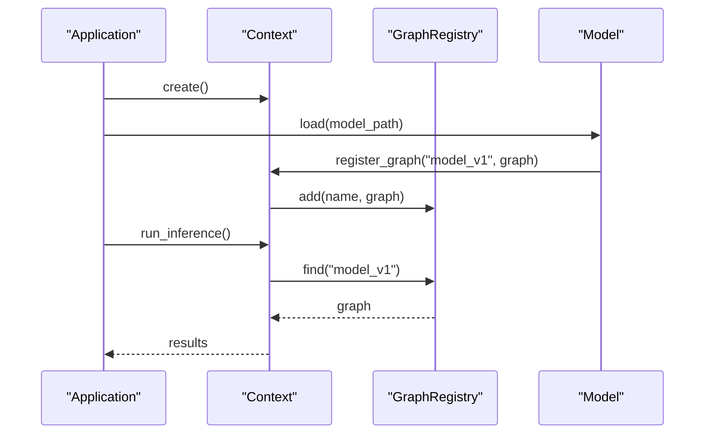
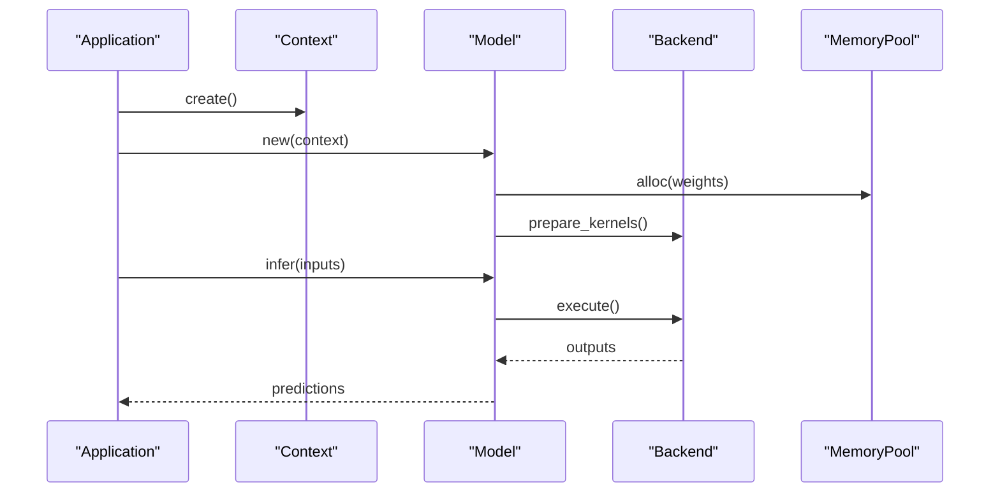
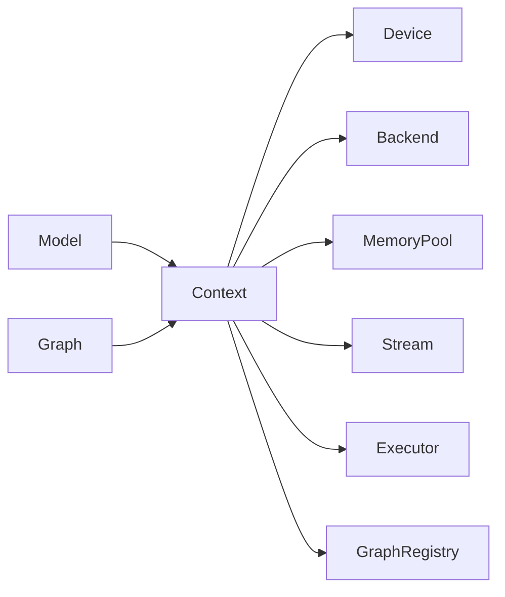

# Context Management

<cite>
**Referenced Files in This Document**
- [context.h](file://src/context/context.h)
- [context.c](file://src/context/context.c)
- [context_internal.h](file://src/context/context_internal.h)
- [context_test.c](file://src/context/context_test.c)
- [core.h](file://src/core/core.h)
- [core.c](file://src/core/core.c)
- [device.h](file://src/device/device.h)
- [device.c](file://src/device/device.c)
- [memory.h](file://src/memory/memory.h)
- [memory.c](file://src/memory/memory.c)
- [backend.h](file://src/backend/backend.h)
- [backend.c](file://src/backend/backend.c)
- [stream.h](file://src/stream/stream.h)
- [stream.c](file://src/stream/stream.c)
- [executor.h](file://src/executor/executor.h)
- [executor.c](file://src/executor/executor.c)
- [graph.h](file://src/graph/graph.h)
- [graph.c](file://src/graph/graph.c)
- [model.h](file://src/model/model.h)
- [model.c](file://src/model/model.c)
</cite>

## Table of Contents
1. [Introduction](#introduction)
2. [Project Structure](#project-structure)
3. [Core Components](#core-components)
4. [Architecture Overview](#architecture-overview)
5. [Detailed Component Analysis](#detailed-component-analysis)
6. [Dependency Analysis](#dependency-analysis)
7. [Performance Considerations](#performance-considerations)
8. [Troubleshooting Guide](#troubleshooting-guide)
9. [Conclusion](#conclusion)
10. [Appendices](#appendices)

## Introduction
This document explains Hummingbird’s Context Management system: how contexts are created, configured, and destroyed; how they encapsulate session state, resource isolation, and execution environment configuration; and how they relate to devices, memory pools, backends, streams, executors, graphs, and models. It also provides practical guidance for initialization patterns, multi-context usage, cleanup procedures, concurrent usage, error handling, scope management, and performance considerations.

## Project Structure
The Context subsystem is implemented under src/context with public headers and tests. It integrates with core runtime components such as device, memory, backend, stream, executor, graph, and model modules.

**Diagram sources**
- [context.h](file://src/context/context.h)
- [context.c](file://src/context/context.c)
- [context_internal.h](file://src/context/context_internal.h)
- [core.h](file://src/core/core.h)
- [core.c](file://src/core/core.c)
- [device.h](file://src/device/device.h)
- [device.c](file://src/device/device.c)
- [backend.h](file://src/backend/backend.h)
- [backend.c](file://src/backend/backend.c)
- [memory.h](file://src/memory/memory.h)
- [memory.c](file://src/memory/memory.c)
- [stream.h](file://src/stream/stream.h)
- [stream.c](file://src/stream/stream.c)
- [executor.h](file://src/executor/executor.h)
- [executor.c](file://src/executor/executor.c)
- [graph.h](file://src/graph/graph.h)
- [graph.c](file://src/graph/graph.c)
- [model.h](file://src/model/model.h)
- [model.c](file://src/model/model.c)

**Section sources**
- [context.h](file://src/context/context.h)
- [context.c](file://src/context/context.c)
- [context_internal.h](file://src/context/context_internal.h)
- [context_test.c](file://src/context/context_test.c)

## Core Components
- Context object: Encapsulates the execution environment, including active device, memory allocator, backend selection, stream(s), executor, and graph registry. It isolates resources per context so that tensors, graphs, and models can be bound to a specific execution domain.
- Configuration: Context creation accepts configuration options (e.g., target device, backend, memory policy). These determine which backend implementation is used, where allocations occur, and how kernels are dispatched.
- Lifecycle: Creation initializes internal state and binds to selected resources; destruction releases all owned resources and resets state.

Key responsibilities:
- Resource isolation: Each context owns or references its own device, memory pool, backend instance, and execution primitives.
- Session state: Holds per-session settings like default stream, profiling flags, and logging verbosity.
- Execution environment: Provides handles to executor and graph registries scoped to the context.

**Section sources**
- [context.h](file://src/context/context.h)
- [context.c](file://src/context/context.c)
- [context_internal.h](file://src/context/context_internal.h)

## Architecture Overview
The Context acts as a central hub connecting devices, memory, backends, streams, executors, graphs, and models. The following diagram shows the primary relationships and data/control flow during typical operations.

**Diagram sources**
- [context.h](file://src/context/context.h)
- [context.c](file://src/context/context.c)
- [device.h](file://src/device/device.h)
- [device.c](file://src/device/device.c)
- [backend.h](file://src/backend/backend.h)
- [backend.c](file://src/backend/backend.c)
- [memory.h](file://src/memory/memory.h)
- [memory.c](file://src/memory/memory.c)
- [stream.h](file://src/stream/stream.h)
- [stream.c](file://src/stream/stream.c)
- [executor.h](file://src/executor/executor.h)
- [executor.c](file://src/executor/executor.c)
- [graph.h](file://src/graph/graph.h)
- [graph.c](file://src/graph/graph.c)
- [model.h](file://src/model/model.h)
- [model.c](file://src/model/model.c)

## Detailed Component Analysis

### Context Lifecycle
- Creation: Initializes backend, selects device, configures memory pool, creates default stream, sets up executor and graph registry. Errors during any step should abort creation and return an error code.
- Configuration: After creation, you can adjust settings such as default stream, logging level, or profiler toggles. Some configurations may require re-initialization of dependent components.
- Destruction: Releases memory, tears down backend, destroys stream(s), clears graph registry, and resets device state. Ensure no outstanding tasks remain on the stream before teardown.

**Diagram sources**
- [context.c](file://src/context/context.c)
- [backend.c](file://src/backend/backend.c)
- [device.c](file://src/device/device.c)
- [memory.c](file://src/memory/memory.c)
- [stream.c](file://src/stream/stream.c)
- [executor.c](file://src/executor/executor.c)
- [graph.c](file://src/graph/graph.c)

**Section sources**
- [context.c](file://src/context/context.c)
- [context_test.c](file://src/context/context_test.c)

### Context and Devices
- Device selection determines where computations run (CPU/GPU/Metal). The context holds a reference to the active device and uses it for allocation and kernel dispatch.
- Device capabilities influence backend behavior and available optimizations.

**Diagram sources**
- [context.c](file://src/context/context.c)
- [device.c](file://src/device/device.c)
- [memory.c](file://src/memory/memory.c)

**Section sources**
- [device.h](file://src/device/device.h)
- [device.c](file://src/device/device.c)
- [memory.h](file://src/memory/memory.h)
- [memory.c](file://src/memory/memory.c)

### Context and Memory Pools
- The context configures a memory pool tailored to the selected device and backend. Allocation policies (e.g., fragmentation control, caching) are set at context creation time.
- All tensors and intermediate buffers within the context typically draw from this pool to ensure coherency and performance.

**Diagram sources**
- [context.c](file://src/context/context.c)
- [memory.c](file://src/memory/memory.c)

**Section sources**
- [memory.h](file://src/memory/memory.h)
- [memory.c](file://src/memory/memory.c)

### Context and Backends
- The backend abstracts platform-specific implementations (CPU, CUDA, Metal). The context initializes the chosen backend and routes kernel calls through it.
- Backend lifecycle is tied to the context: when the context is destroyed, the backend is torn down.

**Diagram sources**
- [context.c](file://src/context/context.c)
- [backend.c](file://src/backend/backend.c)
- [device.c](file://src/device/device.c)

**Section sources**
- [backend.h](file://src/backend/backend.h)
- [backend.c](file://src/backend/backend.c)

### Context and Streams
- A context provides a default stream for asynchronous execution. Tasks submitted to the stream are executed by the executor using the context’s backend and device.
- Synchronization points ensure ordering and safe teardown.

**Diagram sources**
- [context.c](file://src/context/context.c)
- [stream.c](file://src/stream/stream.c)
- [executor.c](file://src/executor/executor.c)
- [backend.c](file://src/backend/backend.c)

**Section sources**
- [stream.h](file://src/stream/stream.h)
- [stream.c](file://src/stream/stream.c)
- [executor.h](file://src/executor/executor.h)
- [executor.c](file://src/executor/executor.c)

### Context and Graphs
- Graphs represent compiled computation plans. The context hosts a graph registry scoped to itself, ensuring isolation between contexts.
- Models often compile or cache graphs within the owning context.

**Diagram sources**
- [context.c](file://src/context/context.c)
- [graph.c](file://src/graph/graph.c)
- [model.c](file://src/model/model.c)

**Section sources**
- [graph.h](file://src/graph/graph.h)
- [graph.c](file://src/graph/graph.c)
- [model.h](file://src/model/model.h)
- [model.c](file://src/model/model.c)

### Context and Models
- Models depend on the context’s device, memory, and backend for loading weights and executing inference.
- Best practice: keep model instances bound to the same context that loaded them.

**Diagram sources**
- [context.c](file://src/context/context.c)
- [model.c](file://src/model/model.c)
- [backend.c](file://src/backend/backend.c)
- [memory.c](file://src/memory/memory.c)

**Section sources**
- [model.h](file://src/model/model.h)
- [model.c](file://src/model/model.c)

## Dependency Analysis
The context depends on several subsystems. The following diagram summarizes direct dependencies and their roles.

**Diagram sources**
- [context.h](file://src/context/context.h)
- [context.c](file://src/context/context.c)
- [device.h](file://src/device/device.h)
- [backend.h](file://src/backend/backend.h)
- [memory.h](file://src/memory/memory.h)
- [stream.h](file://src/stream/stream.h)
- [executor.h](file://src/executor/executor.h)
- [graph.h](file://src/graph/graph.h)
- [model.h](file://src/model/model.h)

**Section sources**
- [context.h](file://src/context/context.h)
- [context.c](file://src/context/context.c)

## Performance Considerations
- Prefer one context per device to avoid cross-device transfers and synchronization overhead.
- Reuse contexts across multiple inference runs to amortize backend and graph setup costs.
- Tune memory pool policies based on workload characteristics (e.g., enable caching for repeated shapes).
- Use streams judiciously: batch submissions and explicit sync only when necessary.
- Keep model graphs cached within the context to avoid recompilation.

[No sources needed since this section provides general guidance]

## Troubleshooting Guide
Common issues and resolutions:
- Initialization failures: Check backend availability and device capability probing. Validate configuration parameters passed to context creation.
- Out-of-memory errors: Inspect memory pool stats and reduce batch sizes or enable more aggressive caching if supported.
- Deadlocks or hangs: Ensure streams are synchronized before destroying contexts; verify no pending tasks remain.
- Cross-context misuse: Do not share tensors, graphs, or models across contexts without explicit migration; bind objects to the correct context.

Operational checks:
- Verify context creation returns success and that device/backend are initialized.
- Confirm stream sync completes before teardown.
- Validate graph registry entries exist when running inference.

**Section sources**
- [context_test.c](file://src/context/context_test.c)
- [context.c](file://src/context/context.c)

## Conclusion
Hummingbird’s Context Management provides a robust abstraction for isolating execution environments, managing resources, and coordinating devices, memory, backends, streams, executors, graphs, and models. By adhering to proper lifecycle practices, scoping resources to contexts, and tuning configuration for your workload, you can achieve predictable performance and reliable operation across single- and multi-context scenarios.

[No sources needed since this section summarizes without analyzing specific files]

## Appendices

### Practical Examples and Patterns
- Single-context initialization:
  - Create a context with a CPU device and default memory policy.
  - Load a model into the context and run inference.
  - Destroy the context after use.
- Multi-context scenarios:
  - Create separate contexts for different devices (e.g., CPU and GPU).
  - Bind models to their respective contexts and run concurrently.
  - Ensure each context is destroyed independently.
- Proper cleanup:
  - Synchronize streams, clear graphs, free memory, and tear down backend in reverse order of initialization.

[No sources needed since this section provides conceptual examples]