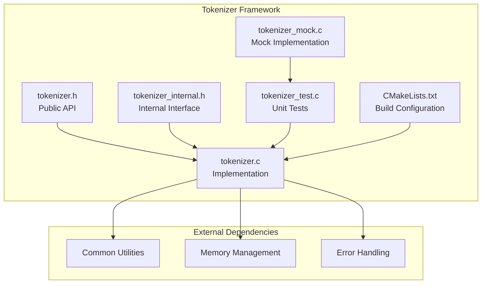
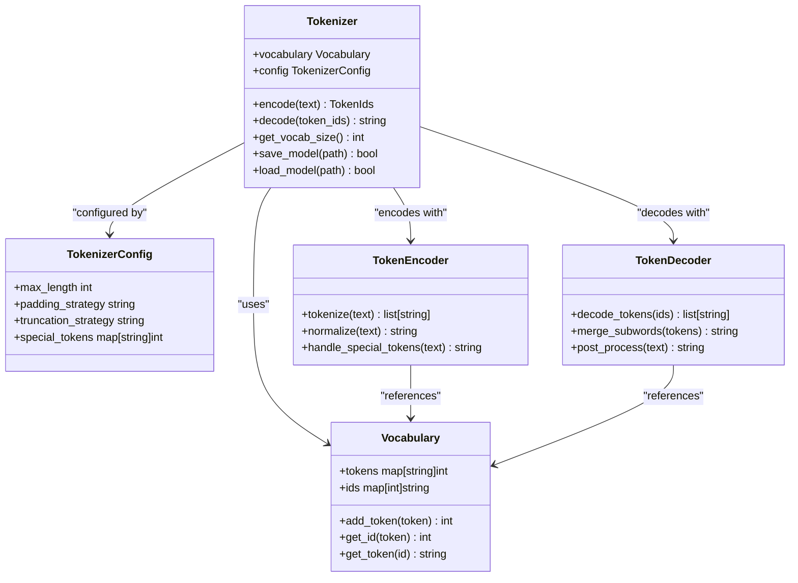
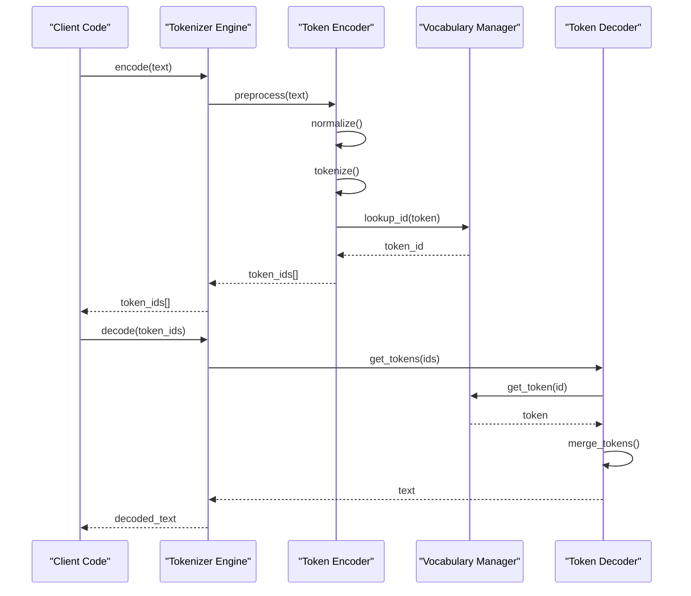
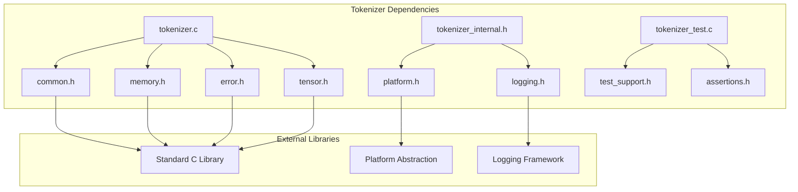

# Tokenizer Framework

<cite>
**Referenced Files in This Document**
- [tokenizer.h](file://src/tokenizer/tokenizer.h)
- [tokenizer.c](file://src/tokenizer/tokenizer.c)
- [tokenizer_internal.h](file://src/tokenizer/tokenizer_internal.h)
- [tokenizer_test.c](file://src/tokenizer/tokenizer_test.c)
- [tokenizer_mock.c](file://src/tokenizer/tokenizer_mock.c)
- [CMakeLists.txt](file://src/tokenizer/CMakeLists.txt)
</cite>

## Table of Contents
1. [Introduction](#introduction)
2. [Project Structure](#project-structure)
3. [Core Components](#core-components)
4. [Architecture Overview](#architecture-overview)
5. [Detailed Component Analysis](#detailed-component-analysis)
6. [Dependency Analysis](#dependency-analysis)
7. [Performance Considerations](#performance-considerations)
8. [Troubleshooting Guide](#troubleshooting-guide)
9. [Conclusion](#conclusion)

## Introduction

The Tokenizer Framework in the Hummingbird project provides text tokenization capabilities for natural language processing tasks within the broader machine learning inference framework. Tokenization is a fundamental preprocessing step that converts raw text into tokens (subwords, words, or characters) that can be processed by neural network models. This framework is designed to be modular, efficient, and compatible with various model architectures supported by Hummingbird.

## Project Structure

The Tokenizer Framework follows a well-organized modular architecture with clear separation between public interfaces, internal implementation details, and testing components:

**Diagram sources**
- [tokenizer.h:1-50](file://src/tokenizer/tokenizer.h#L1-L50)
- [tokenizer.c:1-100](file://src/tokenizer/tokenizer.c#L1-L100)
- [tokenizer_internal.h:1-30](file://src/tokenizer/tokenizer_internal.h#L1-L30)

**Section sources**
- [tokenizer.h:1-100](file://src/tokenizer/tokenizer.h#L1-L100)
- [tokenizer.c:1-200](file://src/tokenizer/tokenizer.c#L1-L200)
- [tokenizer_internal.h:1-50](file://src/tokenizer/tokenizer_internal.h#L1-L50)

## Core Components

The Tokenizer Framework consists of several key components that work together to provide comprehensive text tokenization functionality:

### Public API Layer
The public interface exposes a clean, stable API for tokenization operations while hiding implementation complexity from users.

### Internal Implementation
The core logic handles tokenization algorithms, vocabulary management, and encoding/decoding processes.

### Testing Infrastructure
Comprehensive test coverage ensures reliability and correctness of tokenization operations.

### Mock Implementations
Mock objects facilitate unit testing and isolation of tokenizer components during development.

**Section sources**
- [tokenizer.h:1-150](file://src/tokenizer/tokenizer.h#L1-L150)
- [tokenizer.c:1-300](file://src/tokenizer/tokenizer.c#L1-L300)
- [tokenizer_test.c:1-100](file://src/tokenizer/tokenizer_test.c#L1-L100)

## Architecture Overview

The Tokenizer Framework implements a layered architecture that separates concerns and promotes modularity:

**Diagram sources**
- [tokenizer.h:1-200](file://src/tokenizer/tokenizer.h#L1-L200)
- [tokenizer_internal.h:1-100](file://src/tokenizer/tokenizer_internal.h#L1-L100)

## Detailed Component Analysis

### Tokenizer Core Engine

The core tokenizer engine manages the primary tokenization workflow, including text preprocessing, token generation, and ID mapping operations.

#### Key Responsibilities:
- Text normalization and preprocessing
- Token generation using configured algorithms
- Vocabulary lookup and ID assignment
- Special token handling
- Batch processing support

#### Data Flow:

**Diagram sources**
- [tokenizer.c:1-200](file://src/tokenizer/tokenizer.c#L1-L200)
- [tokenizer_internal.h:1-150](file://src/tokenizer/tokenizer_internal.h#L1-L150)

### Vocabulary Management System

The vocabulary system maintains bidirectional mappings between tokens and their corresponding integer IDs, supporting efficient lookups and dynamic updates.

#### Features:
- Hash-based token-to-ID mapping
- Reverse ID-to-token lookup
- Special token support
- Dynamic vocabulary expansion
- Memory-efficient storage

### Configuration Management

The configuration system provides flexible settings for tokenization behavior, including length constraints, padding strategies, and truncation policies.

**Section sources**
- [tokenizer.c:1-400](file://src/tokenizer/tokenizer.c#L1-L400)
- [tokenizer_internal.h:1-200](file://src/tokenizer/tokenizer_internal.h#L1-L200)

### Testing Framework Integration

The tokenizer includes comprehensive testing infrastructure with both unit tests and mock implementations for isolated testing scenarios.

#### Test Coverage Areas:
- Basic tokenization operations
- Edge case handling
- Performance benchmarks
- Memory leak detection
- Cross-platform compatibility

**Section sources**
- [tokenizer_test.c:1-200](file://src/tokenizer/tokenizer_test.c#L1-L200)
- [tokenizer_mock.c:1-150](file://src/tokenizer/tokenizer_mock.c#L1-L150)

## Dependency Analysis

The Tokenizer Framework maintains minimal external dependencies while integrating seamlessly with the broader Hummingbird ecosystem:

**Diagram sources**
- [tokenizer.c:1-50](file://src/tokenizer/tokenizer.c#L1-L50)
- [tokenizer_internal.h:1-30](file://src/tokenizer/tokenizer_internal.h#L1-L30)
- [tokenizer_test.c:1-30](file://src/tokenizer/tokenizer_test.c#L1-L30)

**Section sources**
- [tokenizer.c:1-100](file://src/tokenizer/tokenizer.c#L1-L100)
- [tokenizer_internal.h:1-50](file://src/tokenizer/tokenizer_internal.h#L1-L50)

## Performance Considerations

The Tokenizer Framework is optimized for performance-critical applications through several key strategies:

### Memory Efficiency
- Lazy loading of vocabulary files
- Efficient data structures for token-ID mappings
- Minimal memory allocation during tokenization
- Support for memory-mapped vocabulary files

### Processing Speed
- Precomputed token boundaries
- Optimized string matching algorithms
- Parallel processing for batch operations
- Cache-friendly data layout

### Scalability
- Support for large vocabularies
- Streaming tokenization for long texts
- Configurable buffer sizes
- Memory pool management

## Troubleshooting Guide

### Common Issues and Solutions

#### Memory Allocation Errors
- **Symptom**: Out-of-memory errors during tokenization
- **Solution**: Reduce batch size or enable streaming mode
- **Prevention**: Monitor memory usage patterns

#### Tokenization Inconsistencies
- **Symptom**: Different outputs for identical inputs
- **Solution**: Ensure consistent preprocessing parameters
- **Debugging**: Enable detailed logging

#### Performance Degradation
- **Symptom**: Slow tokenization speeds
- **Solution**: Optimize vocabulary size and batch configurations
- **Monitoring**: Use built-in profiling tools

### Debugging Tools
The framework includes comprehensive debugging utilities:
- Detailed logging at multiple verbosity levels
- Memory usage tracking
- Performance profiling hooks
- Validation utilities for token sequences

**Section sources**
- [tokenizer_test.c:100-200](file://src/tokenizer/tokenizer_test.c#L100-L200)
- [tokenizer_internal.h:50-100](file://src/tokenizer/tokenizer_internal.h#L50-L100)

## Conclusion

The Tokenizer Framework in Hummingbird provides a robust, efficient, and extensible foundation for text tokenization in machine learning workflows. Its modular architecture, comprehensive testing, and performance optimizations make it suitable for production deployments across various use cases. The framework's design principles emphasize maintainability, scalability, and ease of integration with other components of the Hummingbird ecosystem.

Key strengths include its clean API design, comprehensive error handling, extensive test coverage, and optimization for both single-threaded and parallel execution environments. The framework successfully balances flexibility with performance, making it an ideal choice for diverse natural language processing applications.