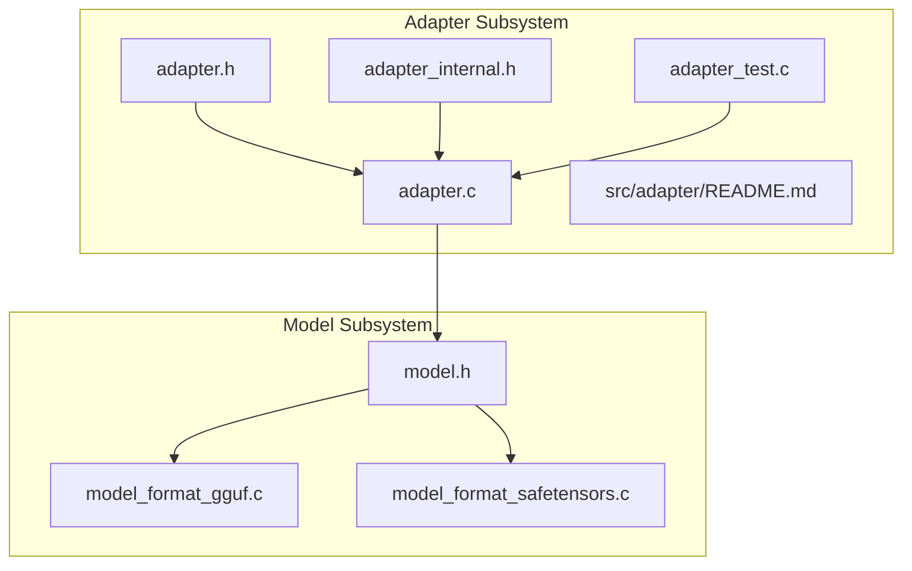
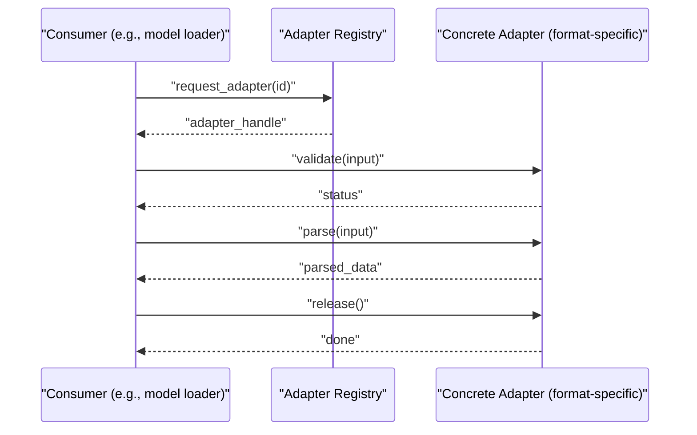
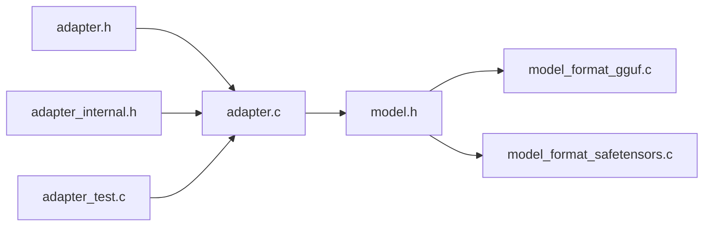

# Adapter Pattern Implementation

<cite>
**Referenced Files in This Document**
- [adapter.h](file://src/adapter/adapter.h)
- [adapter.c](file://src/adapter/adapter.c)
- [adapter_internal.h](file://src/adapter/adapter_internal.h)
- [adapter_test.c](file://src/adapter/adapter_test.c)
- [model.h](file://src/model/model.h)
- [model_format_gguf.c](file://src/model/model_format_gguf.c)
- [model_format_safetensors.c](file://src/model/model_format_safetensors.c)
- [README.md](file://src/adapter/README.md)
</cite>

## Table of Contents
1. [Introduction](#introduction)
2. [Project Structure](#project-structure)
3. [Core Components](#core-components)
4. [Architecture Overview](#architecture-overview)
5. [Detailed Component Analysis](#detailed-component-analysis)
6. [Dependency Analysis](#dependency-analysis)
7. [Performance Considerations](#performance-considerations)
8. [Troubleshooting Guide](#troubleshooting-guide)
9. [Conclusion](#conclusion)
10. [Appendices](#appendices)

## Introduction
This document explains the adapter pattern implementation in Hummingbird, focusing on how the system provides format compatibility between different model formats and external interfaces. It covers the adapter interface design, registration mechanism, lifecycle management, error handling strategies, validation patterns, performance considerations, and practical examples for implementing custom adapters for new model formats or data types. The goal is to help both newcomers and experienced contributors understand and extend the adapter system effectively.

## Project Structure
The adapter subsystem resides under src/adapter and integrates with the model subsystem under src/model. The key files include:
- Public API header for adapters
- Core adapter implementation
- Internal structures and helpers
- Tests demonstrating usage patterns
- Model format adapters (GGUF, safetensors) that implement the adapter contract

**Diagram sources**
- [adapter.h](file://src/adapter/adapter.h)
- [adapter.c](file://src/adapter/adapter.c)
- [adapter_internal.h](file://src/adapter/adapter_internal.h)
- [adapter_test.c](file://src/adapter/adapter_test.c)
- [model.h](file://src/model/model.h)
- [model_format_gguf.c](file://src/model/model_format_gguf.c)
- [model_format_safetensors.c](file://src/model/model_format_safetensors.c)

**Section sources**
- [adapter.h](file://src/adapter/adapter.h)
- [adapter.c](file://src/adapter/adapter.c)
- [adapter_internal.h](file://src/adapter/adapter_internal.h)
- [adapter_test.c](file://src/adapter/adapter_test.c)
- [model.h](file://src/model/model.h)
- [model_format_gguf.c](file://src/model/model_format_gguf.c)
- [model_format_safetensors.c](file://src/model/model_format_safetensors.c)
- [README.md](file://src/adapter/README.md)

## Core Components
The adapter system centers around a small set of concepts:
- Adapter Interface: A uniform contract that abstracts differences across model formats and external data sources.
- Registry: A runtime registry that maps identifiers (such as format names or MIME types) to concrete adapter implementations.
- Lifecycle Management: Initialization, discovery, and cleanup of adapters.
- Validation and Error Handling: Consistent checks and error reporting when loading or using adapters.

Key responsibilities:
- Provide a stable public API for registering and retrieving adapters.
- Encapsulate format-specific parsing and conversion logic behind a common interface.
- Ensure safe initialization and teardown of resources used by adapters.
- Offer clear diagnostics and error codes for integration issues.

**Section sources**
- [adapter.h](file://src/adapter/adapter.h)
- [adapter.c](file://src/adapter/adapter.c)
- [adapter_internal.h](file://src/adapter/adapter_internal.h)
- [README.md](file://src/adapter/README.md)

## Architecture Overview
At a high level, the adapter layer sits between consumers (e.g., model loaders) and format-specific implementations. Consumers request an adapter by identifier; the registry resolves it and returns a handle that exposes a consistent interface. Format-specific adapters implement the contract and perform actual parsing/conversion.

**Diagram sources**
- [adapter.c](file://src/adapter/adapter.c)
- [adapter.h](file://src/adapter/adapter.h)
- [model_format_gguf.c](file://src/model/model_format_gguf.c)
- [model_format_safetensors.c](file://src/model/model_format_safetensors.c)

## Detailed Component Analysis

### Adapter Interface Design
The adapter interface defines a minimal, composable contract:
- Identification: Each adapter has a unique identifier (e.g., format name).
- Capability Queries: Methods to query supported features or constraints.
- Validation: Validate input before parsing to fail fast with informative errors.
- Parsing/Conversion: Transform raw bytes into internal representations.
- Resource Management: Allocate and release any resources held during parsing.

Design principles:
- Immutability where possible: Avoid mutating shared state during parse operations.
- Fail-fast validation: Check headers, magic numbers, and schema early.
- Clear error semantics: Use standardized error codes and messages.
- Thread-safety: Adapters should be safe for concurrent reads if they are stateless.

Practical guidance:
- Keep per-parse allocations minimal and reuse buffers when feasible.
- Expose only necessary capabilities to avoid accidental misuse.
- Prefer streaming APIs for large models to reduce memory pressure.

**Section sources**
- [adapter.h](file://src/adapter/adapter.h)
- [adapter_internal.h](file://src/adapter/adapter_internal.h)

### Registration Mechanism
The registry maintains a mapping from identifiers to adapter implementations. Typical operations:
- Register: Add a new adapter at startup or plugin load time.
- Lookup: Retrieve an adapter by identifier.
- Unregister: Remove an adapter during shutdown or hot-reload.
- Enumerate: List available adapters for diagnostics or UI.

Implementation notes:
- Use a thread-safe container for concurrent lookups.
- Guard against duplicate registrations and provide clear diagnostics.
- Support versioning or capability negotiation if needed.

Lifecycle:
- Initialize registry once at process start.
- Register built-in adapters (e.g., GGUF, safetensors) during library init.
- Optionally register third-party adapters via dynamic loading.
- Clean up all adapters during shutdown.

**Section sources**
- [adapter.c](file://src/adapter/adapter.c)
- [adapter.h](file://src/adapter/adapter.h)

### Lifecycle Management
Adapters may hold resources such as memory-mapped files, caches, or temporary buffers. Lifecycle stages:
- Creation: Construct adapter instance with configuration.
- Initialization: Perform one-time setup (e.g., open file handles).
- Operation: Validate and parse inputs.
- Cleanup: Release resources and reset state.

Best practices:
- Always pair resource acquisition with explicit release calls.
- Provide idempotent cleanup to handle partial failures gracefully.
- Track reference counts if adapters are shared across threads.

**Section sources**
- [adapter.c](file://src/adapter/adapter.c)
- [adapter_internal.h](file://src/adapter/adapter_internal.h)

### Built-in Format Adapters
Hummingbird includes adapters for popular model formats:
- GGUF adapter: Parses GGUF binary format metadata and tensors.
- Safetensors adapter: Parses safetensors layout and loads tensor data.

These adapters implement the adapter interface and register themselves with the registry. They demonstrate:
- Header validation and magic number checks.
- Schema-aware parsing with robust error reporting.
- Efficient memory access patterns for large datasets.

Usage example references:
- See tests and model loader code paths that request adapters by format ID and invoke validate/parse/release.

**Section sources**
- [model_format_gguf.c](file://src/model/model_format_gguf.c)
- [model_format_safetensors.c](file://src/model/model_format_safetensors.c)
- [adapter_test.c](file://src/adapter/adapter_test.c)

### Implementing a Custom Adapter
To add support for a new model format or data type:
1. Define your adapter structure implementing the adapter interface methods.
2. Implement validation logic to detect the format and verify integrity.
3. Implement parsing/conversion routines to produce internal representations.
4. Implement resource management (allocate/release).
5. Register your adapter with the registry at startup.
6. Add tests covering valid and invalid inputs, edge cases, and performance.

Common pitfalls:
- Forgetting to validate input length or offsets can lead to out-of-bounds reads.
- Not releasing resources leads to leaks.
- Returning ambiguous error codes makes debugging difficult.

Integration tips:
- Follow existing naming conventions for identifiers and capabilities.
- Mirror the behavior of built-in adapters for consistency.
- Provide clear documentation for supported versions and constraints.

**Section sources**
- [adapter.h](file://src/adapter/adapter.h)
- [adapter.c](file://src/adapter/adapter.c)
- [adapter_test.c](file://src/adapter/adapter_test.c)

### Error Handling Strategies
Robust error handling ensures reliable integration:
- Use distinct error codes for different failure modes (e.g., unsupported format, corrupted file, insufficient memory).
- Include contextual information (file path, offset, expected vs. actual values).
- Log detailed diagnostics at appropriate verbosity levels.
- Avoid leaking sensitive information in error messages.

Validation patterns:
- Early exit on malformed headers.
- Range checks for indices and sizes.
- Type checks for fields and enums.
- Cross-field consistency checks (e.g., shape vs. element count).

Recovery options:
- Graceful degradation (e.g., fallback to CPU-only parsing).
- Partial load with warnings for non-critical fields.

**Section sources**
- [adapter.c](file://src/adapter/adapter.c)
- [adapter_internal.h](file://src/adapter/adapter_internal.h)

### Performance Considerations
When designing and using adapters:
- Minimize allocations: Reuse buffers and avoid repeated copies.
- Stream large payloads: Parse incrementally to reduce peak memory usage.
- Avoid heavy work during lookup: Defer expensive initialization until first use.
- Cache parsed metadata: If multiple consumers need the same model, cache results safely.
- Profile hot paths: Focus on I/O-bound and serialization bottlenecks.

Concurrency:
- Stateless adapters are naturally thread-safe for read-only operations.
- If state is required, protect with locks or use per-thread instances.

**Section sources**
- [adapter.c](file://src/adapter/adapter.c)
- [adapter_internal.h](file://src/adapter/adapter_internal.h)

## Dependency Analysis
The adapter subsystem depends on core utilities and is consumed by higher-level components like the model loader.

**Diagram sources**
- [adapter.h](file://src/adapter/adapter.h)
- [adapter.c](file://src/adapter/adapter.c)
- [adapter_internal.h](file://src/adapter/adapter_internal.h)
- [adapter_test.c](file://src/adapter/adapter_test.c)
- [model.h](file://src/model/model.h)
- [model_format_gguf.c](file://src/model/model_format_gguf.c)
- [model_format_safetensors.c](file://src/model/model_format_safetensors.c)

**Section sources**
- [adapter.h](file://src/adapter/adapter.h)
- [adapter.c](file://src/adapter/adapter.c)
- [adapter_internal.h](file://src/adapter/adapter_internal.h)
- [adapter_test.c](file://src/adapter/adapter_test.c)
- [model.h](file://src/model/model.h)
- [model_format_gguf.c](file://src/model/model_format_gguf.c)
- [model_format_safetensors.c](file://src/model/model_format_safetensors.c)

## Performance Considerations
[General guidance on optimizing adapter usage]
- Prefer zero-copy views over deep copies when possible.
- Batch operations to reduce overhead.
- Use memory pools for frequently allocated small objects.
- Measure and monitor memory footprint and throughput.

[No sources needed since this section provides general guidance]

## Troubleshooting Guide
Common issues and resolutions:
- Adapter not found: Verify the identifier matches the registered name and that the adapter was initialized.
- Validation failures: Inspect error messages for details about malformed headers or unsupported features.
- Memory leaks: Ensure every successful initialization has a corresponding cleanup call.
- Concurrency bugs: Confirm adapters are either stateless or properly synchronized.

Diagnostic steps:
- Enable verbose logging to capture adapter selection and parsing traces.
- Run unit tests to validate basic functionality.
- Use sanitizers to detect undefined behavior.

**Section sources**
- [adapter_test.c](file://src/adapter/adapter_test.c)
- [adapter.c](file://src/adapter/adapter.c)

## Conclusion
The adapter pattern in Hummingbird provides a clean, extensible way to support multiple model formats and external interfaces through a unified contract. By following the interface design, leveraging the registry, managing lifecycles carefully, and applying robust validation and error handling, you can integrate new formats efficiently and reliably. The built-in adapters serve as templates for custom implementations, and the provided tests offer guidance for ensuring correctness and performance.

[No sources needed since this section summarizes without analyzing specific files]

## Appendices

### Practical Code Example References
- Creating and registering a custom adapter:
  - See [adapter_test.c](file://src/adapter/adapter_test.c) for patterns of constructing and registering adapters.
- Using an adapter to parse a model:
  - Refer to [model_format_gguf.c](file://src/model/model_format_gguf.c) and [model_format_safetensors.c](file://src/model/model_format_safetensors.c) for concrete usage within model loaders.
- Understanding the adapter API:
  - Review [adapter.h](file://src/adapter/adapter.h) and [adapter_internal.h](file://src/adapter/adapter_internal.h) for method signatures and internal helpers.

**Section sources**
- [adapter_test.c](file://src/adapter/adapter_test.c)
- [model_format_gguf.c](file://src/model/model_format_gguf.c)
- [model_format_safetensors.c](file://src/model/model_format_safetensors.c)
- [adapter.h](file://src/adapter/adapter.h)
- [adapter_internal.h](file://src/adapter/adapter_internal.h)