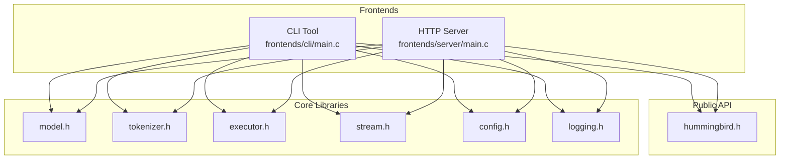
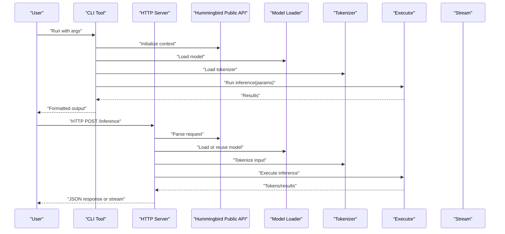
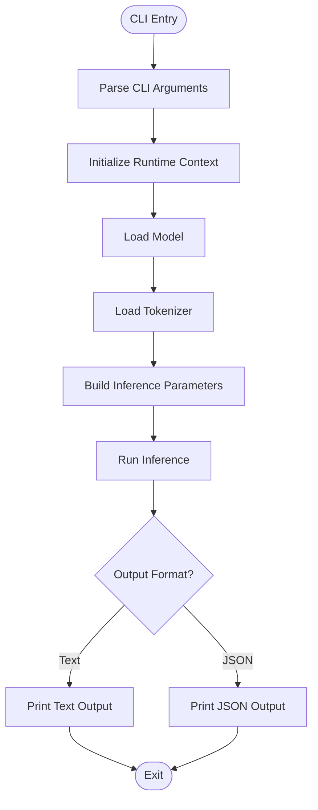
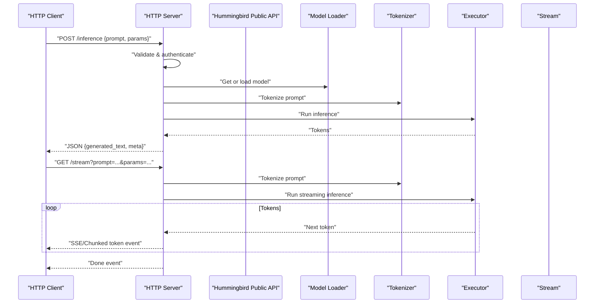
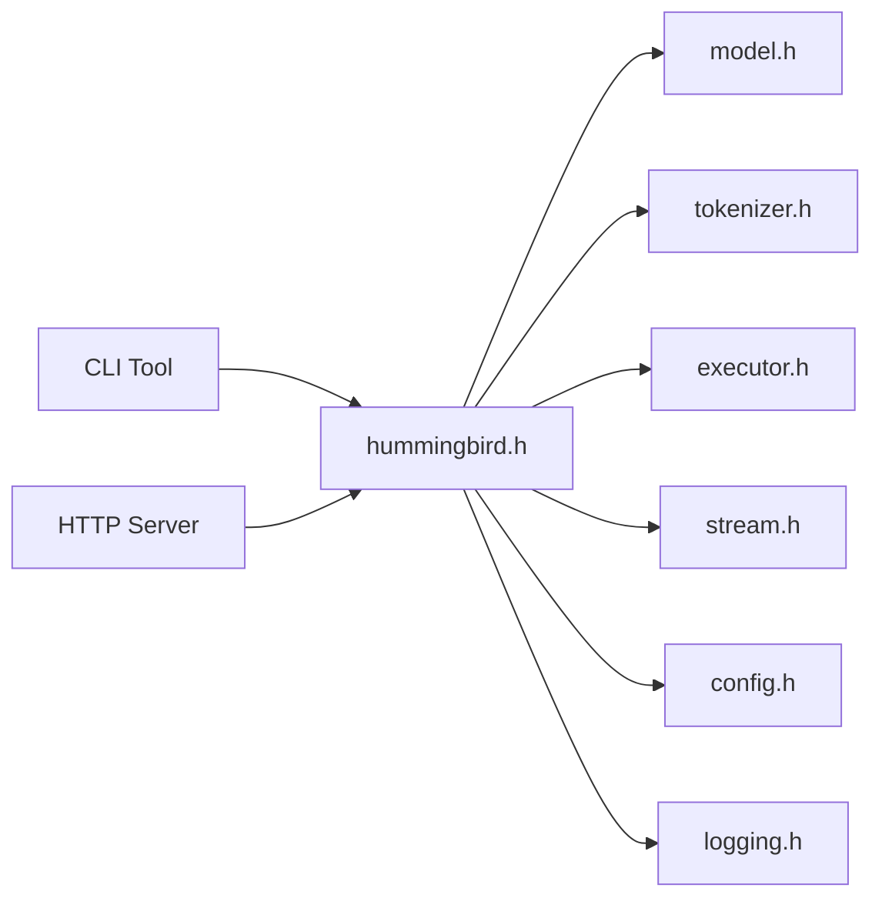

# Frontend Interfaces

<cite>
**Referenced Files in This Document**
- [frontends/cli/main.c](file://frontends/cli/main.c)
- [frontends/server/main.c](file://frontends/server/main.c)
- [include/hummingbird/hummingbird.h](file://include/hummingbird/hummingbird.h)
- [src/model/model.h](file://src/model/model.h)
- [src/tokenizer/tokenizer.h](file://src/tokenizer/tokenizer.h)
- [src/executor/executor.h](file://src/executor/executor.h)
- [src/stream/stream.h](file://src/stream/stream.h)
- [src/config/config.h](file://src/config/config.h)
- [src/logging/logging.h](file://src/logging/logging.h)
</cite>

## Table of Contents
1. [Introduction](#introduction)
2. [Project Structure](#project-structure)
3. [Core Components](#core-components)
4. [Architecture Overview](#architecture-overview)
5. [Detailed Component Analysis](#detailed-component-analysis)
6. [Dependency Analysis](#dependency-analysis)
7. [Performance Considerations](#performance-considerations)
8. [Troubleshooting Guide](#troubleshooting-guide)
9. [Conclusion](#conclusion)
10. [Appendices](#appendices)

## Introduction
This document describes Hummingbird’s frontend interfaces: the command-line interface (CLI) and the HTTP server. It covers model loading options, inference parameters, output formatting, REST endpoints, request/response schemas, authentication, streaming, error handling, security considerations, client integration guidelines, deployment configuration, performance optimization, and monitoring approaches. The goal is to enable both CLI users and server integrators to use Hummingbird effectively and safely.

## Project Structure
The frontends are implemented as two separate executables:
- CLI tool for local inference via command-line arguments
- HTTP server exposing RESTful endpoints for remote inference

**Diagram sources**
- [frontends/cli/main.c](file://frontends/cli/main.c)
- [frontends/server/main.c](file://frontends/server/main.c)
- [include/hummingbird/hummingbird.h](file://include/hummingbird/hummingbird.h)
- [src/model/model.h](file://src/model/model.h)
- [src/tokenizer/tokenizer.h](file://src/tokenizer/tokenizer.h)
- [src/executor/executor.h](file://src/executor/executor.h)
- [src/stream/stream.h](file://src/stream/stream.h)
- [src/config/config.h](file://src/config/config.h)
- [src/logging/logging.h](file://src/logging/logging.h)

**Section sources**
- [frontends/cli/main.c](file://frontends/cli/main.c)
- [frontends/server/main.c](file://frontends/server/main.c)
- [include/hummingbird/hummingbird.h](file://include/hummingbird/hummingbird.h)

## Core Components
- CLI Tool
  - Parses command-line arguments for model path, tokenizer settings, device selection, and inference parameters.
  - Loads models and tokenizers, runs inference, and prints results with configurable formatting.
- HTTP Server
  - Starts an HTTP listener and exposes REST endpoints for model loading, inference, and streaming.
  - Handles request parsing, invokes core libraries, and returns JSON responses or streamed tokens.

Key responsibilities:
- Argument and request validation
- Model and tokenizer lifecycle management
- Inference execution and result serialization
- Streaming support for real-time token delivery
- Error reporting and logging

**Section sources**
- [frontends/cli/main.c](file://frontends/cli/main.c)
- [frontends/server/main.c](file://frontends/server/main.c)
- [include/hummingbird/hummingbird.h](file://include/hummingbird/hummingbird.h)

## Architecture Overview
The frontends act as thin orchestration layers over Hummingbird’s core libraries. They translate user inputs into library calls and serialize outputs for display or network transport.

**Diagram sources**
- [frontends/cli/main.c](file://frontends/cli/main.c)
- [frontends/server/main.c](file://frontends/server/main.c)
- [include/hummingbird/hummingbird.h](file://include/hummingbird/hummingbird.h)
- [src/model/model.h](file://src/model/model.h)
- [src/tokenizer/tokenizer.h](file://src/tokenizer/tokenizer.h)
- [src/executor/executor.h](file://src/executor/executor.h)
- [src/stream/stream.h](file://src/stream/stream.h)

## Detailed Component Analysis

### CLI Tool
Responsibilities:
- Parse command-line flags for model path, tokenizer config, device selection, and inference parameters.
- Initialize runtime context and load model/tokenizer.
- Execute inference and format output (text, JSON, or structured).
- Provide help and usage information.

Typical workflow:
- Validate arguments
- Load model and tokenizer
- Prepare prompt and parameters
- Run inference
- Print formatted results

**Diagram sources**
- [frontends/cli/main.c](file://frontends/cli/main.c)
- [src/model/model.h](file://src/model/model.h)
- [src/tokenizer/tokenizer.h](file://src/tokenizer/tokenizer.h)
- [src/executor/executor.h](file://src/executor/executor.h)

**Section sources**
- [frontends/cli/main.c](file://frontends/cli/main.c)
- [src/model/model.h](file://src/model/model.h)
- [src/tokenizer/tokenizer.h](file://src/tokenizer/tokenizer.h)
- [src/executor/executor.h](file://src/executor/executor.h)

### HTTP Server
Responsibilities:
- Listen on a configured host/port.
- Serve REST endpoints for model management and inference.
- Support synchronous JSON responses and real-time streaming.
- Enforce authentication and rate limiting (if configured).
- Log requests and errors.

Endpoints overview:
- Health check endpoint for readiness/liveness
- Model management endpoints for loading/unloading
- Inference endpoint accepting prompts and parameters
- Streaming endpoint returning tokens incrementally

Request/response patterns:
- Synchronous inference returns a JSON payload with generated text and metadata
- Streaming returns a sequence of partial tokens until completion

**Diagram sources**
- [frontends/server/main.c](file://frontends/server/main.c)
- [include/hummingbird/hummingbird.h](file://include/hummingbird/hummingbird.h)
- [src/model/model.h](file://src/model/model.h)
- [src/tokenizer/tokenizer.h](file://src/tokenizer/tokenizer.h)
- [src/executor/executor.h](file://src/executor/executor.h)
- [src/stream/stream.h](file://src/stream/stream.h)

**Section sources**
- [frontends/server/main.c](file://frontends/server/main.c)
- [include/hummingbird/hummingbird.h](file://include/hummingbird/hummingbird.h)
- [src/model/model.h](file://src/model/model.h)
- [src/tokenizer/tokenizer.h](file://src/tokenizer/tokenizer.h)
- [src/executor/executor.h](file://src/executor/executor.h)
- [src/stream/stream.h](file://src/stream/stream.h)

### Configuration and Logging
- Configuration
  - Centralized settings for model paths, device selection, concurrency, and server bindings.
  - Environment variables and/or config files can be used to override defaults.
- Logging
  - Structured logs for requests, errors, and performance metrics.
  - Log levels adjustable for development vs production.

**Section sources**
- [src/config/config.h](file://src/config/config.h)
- [src/logging/logging.h](file://src/logging/logging.h)

## Dependency Analysis
Frontends depend on public APIs and core modules for model loading, tokenization, execution, and streaming.

**Diagram sources**
- [frontends/cli/main.c](file://frontends/cli/main.c)
- [frontends/server/main.c](file://frontends/server/main.c)
- [include/hummingbird/hummingbird.h](file://include/hummingbird/hummingbird.h)
- [src/model/model.h](file://src/model/model.h)
- [src/tokenizer/tokenizer.h](file://src/tokenizer/tokenizer.h)
- [src/executor/executor.h](file://src/executor/executor.h)
- [src/stream/stream.h](file://src/stream/stream.h)
- [src/config/config.h](file://src/config/config.h)
- [src/logging/logging.h](file://src/logging/logging.h)

**Section sources**
- [include/hummingbird/hummingbird.h](file://include/hummingbird/hummingbird.h)
- [src/model/model.h](file://src/model/model.h)
- [src/tokenizer/tokenizer.h](file://src/tokenizer/tokenizer.h)
- [src/executor/executor.h](file://src/executor/executor.h)
- [src/stream/stream.h](file://src/stream/stream.h)
- [src/config/config.h](file://src/config/config.h)
- [src/logging/logging.h](file://src/logging/logging.h)

## Performance Considerations
- Model caching: Keep frequently used models loaded to avoid reload overhead.
- Batch size and concurrency: Tune executor concurrency based on hardware capabilities.
- Quantization: Use quantized models when memory or latency is constrained.
- Streaming: Prefer streaming for long generations to reduce perceived latency.
- I/O: Minimize JSON serialization overhead; consider binary formats if applicable.
- Device selection: Choose optimal device (CPU/GPU) and ensure drivers are up-to-date.
- Resource limits: Set timeouts and maximum request sizes to protect the server.

[No sources needed since this section provides general guidance]

## Troubleshooting Guide
Common issues and strategies:
- Model loading failures
  - Verify model path and format compatibility.
  - Check permissions and disk space.
  - Inspect logs for detailed error messages.
- Tokenization errors
  - Ensure tokenizer files match the model.
  - Validate input encoding and special tokens.
- Inference timeouts
  - Adjust generation parameters (max tokens, temperature).
  - Increase server timeouts and worker threads.
- Streaming interruptions
  - Implement retry logic and backoff.
  - Monitor connection health and server heartbeat events.
- Authentication and authorization
  - Confirm credentials and scopes.
  - Review access control policies and audit logs.

**Section sources**
- [src/logging/logging.h](file://src/logging/logging.h)
- [src/config/config.h](file://src/config/config.h)

## Conclusion
Hummingbird’s frontends provide flexible access to inference capabilities through both CLI and HTTP server. The CLI is ideal for local experimentation and scripting, while the server enables scalable, network-accessible services with streaming support. Proper configuration, robust error handling, and security measures are essential for reliable deployments.

[No sources needed since this section summarizes without analyzing specific files]

## Appendices

### CLI Usage Guidelines
- Typical arguments include model path, tokenizer path, device selection, and inference parameters such as max tokens, temperature, and top-p.
- Output formats commonly include plain text and JSON for programmatic consumption.
- Use help flags to discover available options and examples.

**Section sources**
- [frontends/cli/main.c](file://frontends/cli/main.c)

### HTTP Server Integration Guidelines
- Base URL and endpoints should be documented per environment.
- Authentication methods may include API keys, JWT, or mTLS depending on deployment.
- For streaming, follow SSE or chunked transfer semantics and handle partial responses gracefully.
- Implement retries with exponential backoff and circuit breakers for resilience.

**Section sources**
- [frontends/server/main.c](file://frontends/server/main.c)

### Security Considerations
- Enforce TLS for all external-facing endpoints.
- Validate and sanitize all inputs; reject oversized payloads.
- Apply least-privilege principles for file system and network access.
- Rotate secrets and monitor for anomalies.

[No sources needed since this section provides general guidance]

### Deployment Configuration Tips
- Containerize the server with resource limits and health checks.
- Use reverse proxies for load balancing and SSL termination.
- Configure log aggregation and metrics collection.
- Plan autoscaling based on CPU/GPU utilization and queue depth.

[No sources needed since this section provides general guidance]

### Monitoring Approaches
- Track request latency, throughput, and error rates.
- Monitor model memory usage and GPU utilization.
- Alert on high error rates, slow generations, and resource saturation.
- Correlate application logs with infrastructure metrics.

[No sources needed since this section provides general guidance]