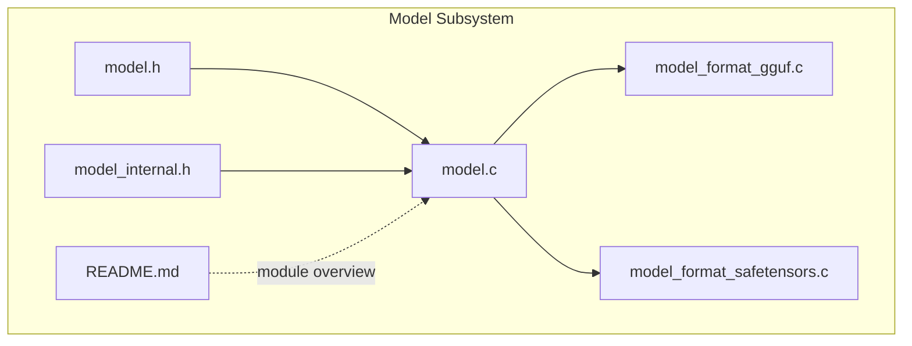
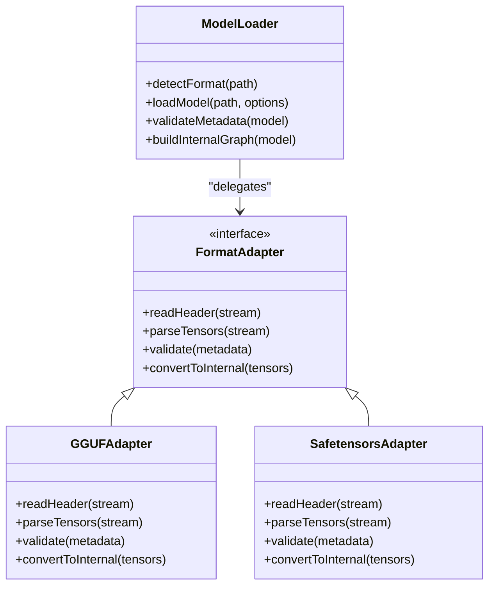
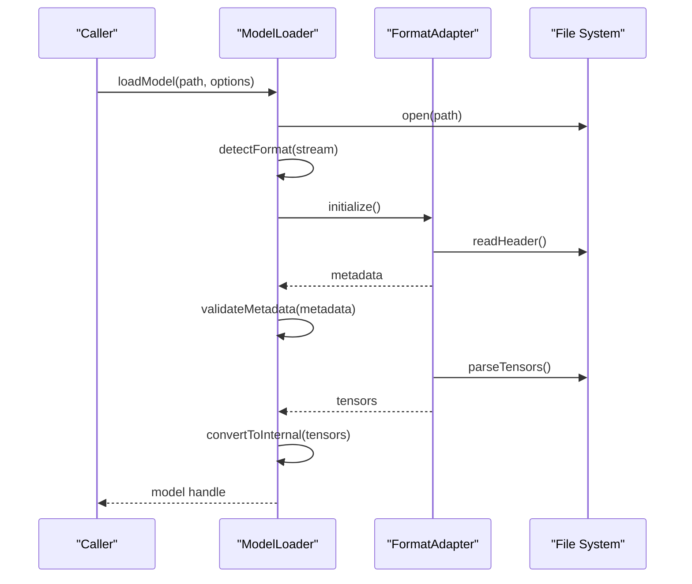
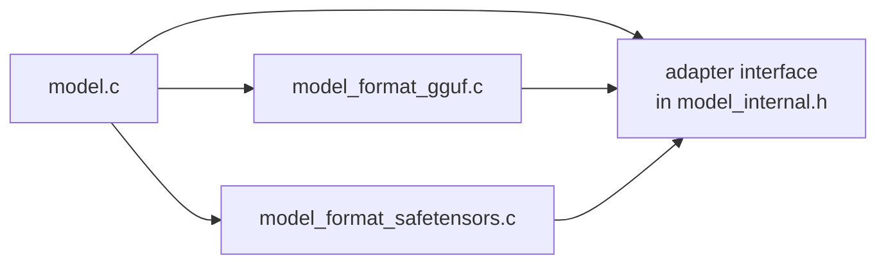

# Model Formats and Loading

<cite>
**Referenced Files in This Document**
- [model.h](file://src/model/model.h)
- [model.c](file://src/model/model.c)
- [model_internal.h](file://src/model/model_internal.h)
- [model_format_gguf.c](file://src/model/model_format_gguf.c)
- [model_format_safetensors.c](file://src/model/model_format_safetensors.c)
- [README.md](file://src/model/README.md)
</cite>

## Table of Contents
1. [Introduction](#introduction)
2. [Project Structure](#project-structure)
3. [Core Components](#core-components)
4. [Architecture Overview](#architecture-overview)
5. [Detailed Component Analysis](#detailed-component-analysis)
6. [Dependency Analysis](#dependency-analysis)
7. [Performance Considerations](#performance-considerations)
8. [Troubleshooting Guide](#troubleshooting-guide)
9. [Conclusion](#conclusion)
10. [Appendices](#appendices)

## Introduction
This document explains Hummingbird’s model format support and loading mechanisms, focusing on GGUF and Safetensors implementations. It covers the loader architecture, the format adapter pattern used to integrate multiple formats, metadata parsing and validation flows, error handling strategies, and practical guidance for converting models and choosing formats based on performance and compatibility needs.

## Project Structure
The model subsystem is implemented under src/model. The key files include:
- Public API and internal structures for models
- Core loader orchestration
- Format-specific adapters for GGUF and Safetensors
- A README describing module responsibilities

**Diagram sources**
- [model.h](file://src/model/model.h)
- [model.c](file://src/model/model.c)
- [model_internal.h](file://src/model/model_internal.h)
- [model_format_gguf.c](file://src/model/model_format_gguf.c)
- [model_format_safetensors.c](file://src/model/model_format_safetensors.c)
- [README.md](file://src/model/README.md)

**Section sources**
- [model.h](file://src/model/model.h)
- [model.c](file://src/model/model.c)
- [model_internal.h](file://src/model/model_internal.h)
- [model_format_gguf.c](file://src/model/model_format_gguf.c)
- [model_format_safetensors.c](file://src/model/model_format_safetensors.c)
- [README.md](file://src/model/README.md)

## Core Components
- Model Loader Orchestrator: Centralizes file discovery, format detection, and dispatching to a specific format adapter. It manages lifecycle (open, parse, validate, build), resource allocation, and error propagation.
- Format Adapters: Implement a common interface for reading tensors and metadata from a given format. Each adapter encapsulates format-specific parsing, validation, and conversion into Hummingbird’s internal representation.
- Internal Structures: Define shared types for model descriptors, tensor metadata, and adapter function tables. These are not exposed publicly but enable consistent behavior across formats.

Key responsibilities:
- Detect format by magic bytes or file structure
- Parse and validate headers/metadata
- Stream or map weights into memory efficiently
- Build an internal model graph with quantization and device hints
- Provide uniform APIs for inference regardless of source format

**Section sources**
- [model.c](file://src/model/model.c)
- [model_internal.h](file://src/model/model_internal.h)

## Architecture Overview
Hummingbird uses a format adapter pattern to decouple the loader core from format-specific logic. The orchestrator selects an adapter based on detected format and delegates all parsing/validation to it.

**Diagram sources**
- [model.c](file://src/model/model.c)
- [model_format_gguf.c](file://src/model/model_format_gguf.c)
- [model_format_safetensors.c](file://src/model/model_format_safetensors.c)

## Detailed Component Analysis

### Model Loader Orchestrator
Responsibilities:
- Open and probe the file to determine format
- Initialize the appropriate adapter
- Run header parsing and metadata validation
- Convert parsed data into Hummingbird’s internal model representation
- Manage resources and errors consistently

Typical flow:
- Entry point receives a path and optional configuration
- Format detection returns an adapter instance
- Adapter reads header and validates required fields
- Tensors are streamed or mapped; shapes/dtypes are verified
- Internal model is constructed and returned

Error handling:
- Early failures (invalid path, unsupported format) return clear errors
- Validation failures (missing keys, incompatible dtypes/shapes) provide actionable messages
- Resource cleanup is guaranteed on error paths

**Section sources**
- [model.c](file://src/model/model.c)
- [model_internal.h](file://src/model/model_internal.h)

### GGUF Format Adapter
Purpose:
- Read GGUF binary headers and index sections
- Extract tensor names, shapes, dtypes, and offsets
- Validate consistency between header and tensor entries
- Convert to Hummingbird’s internal tensor descriptors

File structure highlights:
- Header contains magic/version and global metadata
- Index section enumerates tensors with name, shape, dtype, and storage offset
- Optional quantization parameters may be present

Parsing and validation:
- Verify magic/version compatibility
- Ensure required metadata keys exist
- Check that tensor count and offsets are well-formed
- Validate dtype and shape against expected ranges

Conversion:
- Map or stream weight buffers according to offsets
- Apply any quantization decoding if needed
- Populate internal tensor list and metadata

**Section sources**
- [model_format_gguf.c](file://src/model/model_format_gguf.c)

### Safetensors Format Adapter
Purpose:
- Read Safetensors JSON header and subsequent binary payload
- Extract tensor metadata including dtype, shape, and byte offsets
- Validate header integrity and tensor layout
- Convert to Hummingbird’s internal representation

File structure highlights:
- A JSON header describes each tensor’s metadata
- Binary payload follows immediately after the header
- Offsets indicate where each tensor’s bytes begin

Parsing and validation:
- Parse and validate JSON header schema
- Ensure offsets are within bounds and non-overlapping
- Confirm dtype and shape validity
- Handle large files via streaming when possible

Conversion:
- Map or read tensor slices using offsets
- Normalize dtypes and shapes to internal expectations
- Build internal tensor list and metadata

**Section sources**
- [model_format_safetensors.c](file://src/model/model_format_safetensors.c)

### Format Adapter Pattern and Extensibility
Design:
- A common adapter interface defines functions for header reading, tensor parsing, validation, and conversion
- The loader maintains a registry of supported formats and their corresponding adapters
- Adding a new format requires implementing the adapter interface and registering it

Integration steps:
- Implement the adapter functions for the new format
- Add format detection rules (magic bytes or structural checks)
- Register the adapter with the loader
- Update tests and documentation

**Diagram sources**
- [model.c](file://src/model/model.c)
- [model_format_gguf.c](file://src/model/model_format_gguf.c)
- [model_format_safetensors.c](file://src/model/model_format_safetensors.c)

## Dependency Analysis
- The loader depends on the adapter interface and the selected adapter implementation
- GGUF and Safetensors adapters depend on low-level IO utilities and internal tensor structures
- Shared internal headers define common types and helper functions used by both adapters

**Diagram sources**
- [model.c](file://src/model/model.c)
- [model_internal.h](file://src/model/model_internal.h)
- [model_format_gguf.c](file://src/model/model_format_gguf.c)
- [model_format_safetensors.c](file://src/model/model_format_safetensors.c)

**Section sources**
- [model.c](file://src/model/model.c)
- [model_internal.h](file://src/model/model_internal.h)
- [model_format_gguf.c](file://src/model/model_format_gguf.c)
- [model_format_safetensors.c](file://src/model/model_format_safetensors.c)

## Performance Considerations
- Memory mapping vs. streaming: Prefer memory-mapped reads for random access patterns; use streaming for very large files to reduce peak memory usage.
- Quantization overhead: GGUF often includes quantized weights; ensure efficient decoding paths to avoid CPU bottlenecks.
- I/O throughput: Use buffered reads and minimize redundant seeks; align buffer sizes with underlying filesystem block sizes.
- Parallelism: If safe, parallelize independent tensor loads while respecting ordering constraints for metadata.
- Cache locality: Coalesce contiguous tensors and maintain predictable access patterns during graph construction.

[No sources needed since this section provides general guidance]

## Troubleshooting Guide
Common issues and recovery strategies:
- Unsupported or corrupted format:
  - Verify file integrity and checksums if available
  - Re-export or re-convert the model to a supported format
- Missing or invalid metadata:
  - Inspect the header for required keys and valid ranges
  - Ensure dtype and shape values match expected constraints
- Incompatible versions:
  - Upgrade/downgrade the exporter to produce compatible headers
  - Pin version requirements in your pipeline
- Out-of-memory during load:
  - Reduce batch size or switch to streaming mode
  - Enable quantized formats where applicable
- Permission or path errors:
  - Confirm file existence and read permissions
  - Use absolute paths to avoid ambiguity

Operational tips:
- Log detailed error codes and context (path, format, step)
- Provide user-friendly messages indicating next steps (e.g., “Re-export with compatible dtype”)
- Offer fallbacks such as automatic conversion when feasible

**Section sources**
- [model.c](file://src/model/model.c)
- [model_format_gguf.c](file://src/model/model_format_gguf.c)
- [model_format_safetensors.c](file://src/model/model_format_safetensors.c)

## Conclusion
Hummingbird’s model loading system leverages a clean adapter pattern to support multiple formats uniformly. GGUF and Safetensors adapters implement consistent interfaces for header parsing, validation, and conversion, enabling easy extension to additional formats. By following the integration steps and adhering to the performance and troubleshooting recommendations, teams can reliably load models from diverse sources and optimize for their deployment targets.

[No sources needed since this section summarizes without analyzing specific files]

## Appendices

### Practical Usage Examples
- Load a GGUF model:
  - Call the loader with the GGUF file path and default options
  - The loader detects GGUF, initializes the GGUF adapter, parses metadata, and builds the internal model
- Load a Safetensors model:
  - Provide the Safetensors file path
  - The loader detects the format, reads the JSON header, validates tensors, and constructs the model
- Error recovery:
  - On failure, inspect logs for the failing step and adjust inputs (dtype, shape, or file) accordingly

[No sources needed since this section provides general guidance]

### Conversion Workflows
- From PyTorch/HF to GGUF:
  - Export weights to a standard checkpoint
  - Use a converter tool to produce GGUF with desired quantization
- From PyTorch/HF to Safetensors:
  - Save tensors directly in Safetensors format
  - Ensure metadata includes dtype and shape for each tensor
- Validation:
  - After conversion, run a quick load test to verify header and tensor integrity

[No sources needed since this section provides general guidance]

### Compatibility Matrix
- Supported formats:
  - GGUF: widely used for quantized models; strong ecosystem support
  - Safetensors: structured JSON header with binary payload; good for interoperability
- Choosing a format:
  - Prefer GGUF for compactness and quantization efficiency
  - Prefer Safetensors for portability and straightforward inspection

[No sources needed since this section provides general guidance]