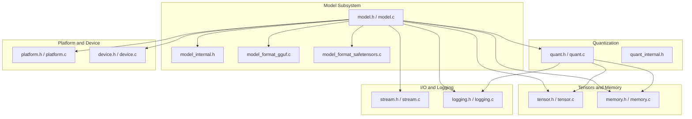
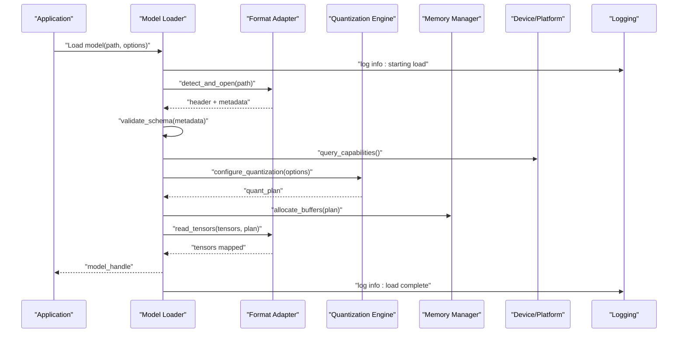
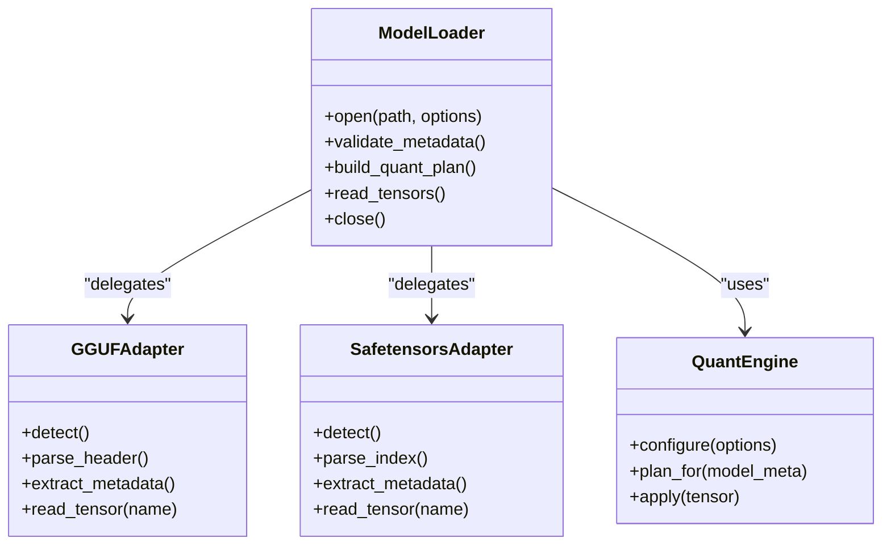
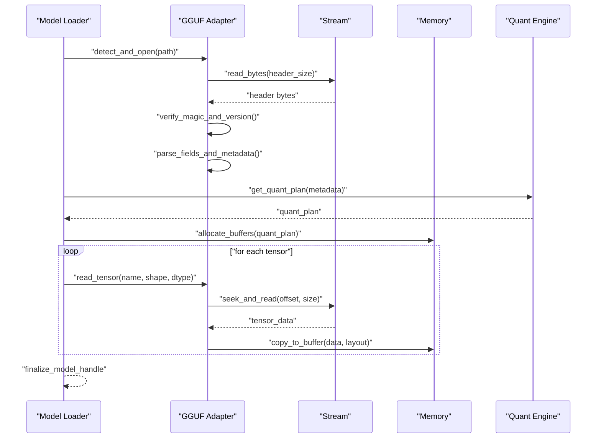
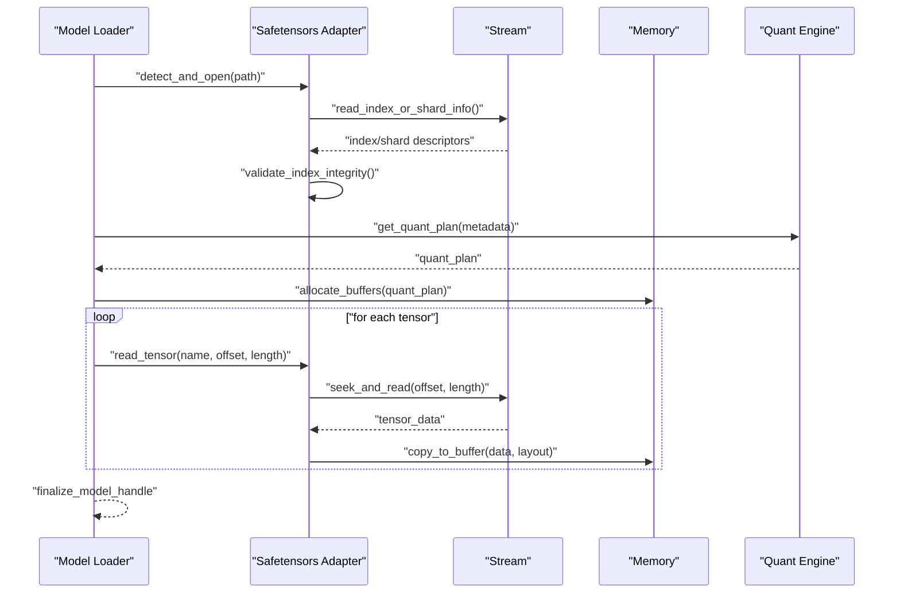
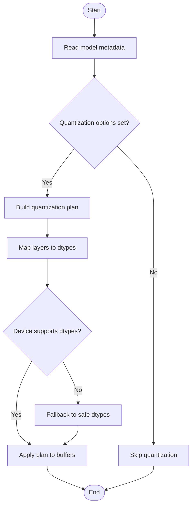
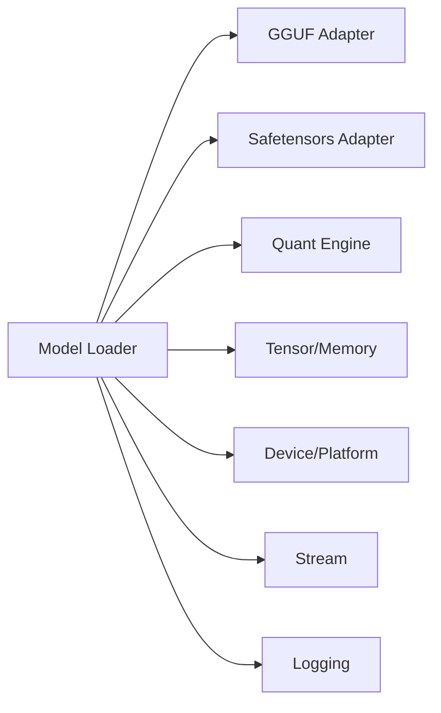

# Model Management

<cite>
**Referenced Files in This Document**
- [model.h](file://src/model/model.h)
- [model.c](file://src/model/model.c)
- [model_internal.h](file://src/model/model_internal.h)
- [model_format_gguf.c](file://src/model/model_format_gguf.c)
- [model_format_safetensors.c](file://src/model/model_format_safetensors.c)
- [quant.h](file://src/quant/quant.h)
- [quant.c](file://src/quant/quant.c)
- [quant_internal.h](file://src/quant/quant_internal.h)
- [tensor.h](file://src/tensor/tensor.h)
- [tensor.c](file://src/tensor/tensor.c)
- [memory.h](file://src/memory/memory.h)
- [memory.c](file://src/memory/memory.c)
- [platform.h](file://src/platform/platform.h)
- [platform.c](file://src/platform/platform.c)
- [device.h](file://src/device/device.h)
- [device.c](file://src/device/device.c)
- [stream.h](file://src/stream/stream.h)
- [stream.c](file://src/stream/stream.c)
- [logging.h](file://src/logging/logging.h)
- [logging.c](file://src/logging/logging.c)
</cite>

## Table of Contents
1. [Introduction](#introduction)
2. [Project Structure](#project-structure)
3. [Core Components](#core-components)
4. [Architecture Overview](#architecture-overview)
5. [Detailed Component Analysis](#detailed-component-analysis)
6. [Dependency Analysis](#dependency-analysis)
7. [Performance Considerations](#performance-considerations)
8. [Troubleshooting Guide](#troubleshooting-guide)
9. [Conclusion](#conclusion)
10. [Appendices](#appendices)

## Introduction
This document explains Hummingbird’s model management system with a focus on how models are loaded, validated, and optimized for execution. It covers:
- Model loader responsibilities and lifecycle
- Format adapters for GGUF and Safetensors
- Metadata extraction and validation
- Quantization support and integration points
- Conversion workflows and optimization techniques
- Practical examples for loading, validating, configuring, and optimizing models

The content is designed to be accessible to beginners while providing technical depth for experienced developers building model pipelines.

## Project Structure
Hummingbird organizes model-related functionality under the model subsystem, with dedicated format adapters and quantization utilities. The following diagram shows the high-level structure relevant to model management.

**Diagram sources**
- [model.h](file://src/model/model.h)
- [model.c](file://src/model/model.c)
- [model_internal.h](file://src/model/model_internal.h)
- [model_format_gguf.c](file://src/model/model_format_gguf.c)
- [model_format_safetensors.c](file://src/model/model_format_safetensors.c)
- [quant.h](file://src/quant/quant.h)
- [quant.c](file://src/quant/quant.c)
- [quant_internal.h](file://src/quant/quant_internal.h)
- [tensor.h](file://src/tensor/tensor.h)
- [tensor.c](file://src/tensor/tensor.c)
- [memory.h](file://src/memory/memory.h)
- [memory.c](file://src/memory/memory.c)
- [platform.h](file://src/platform/platform.h)
- [platform.c](file://src/platform/platform.c)
- [device.h](file://src/device/device.h)
- [device.c](file://src/device/device.c)
- [stream.h](file://src/stream/stream.h)
- [stream.c](file://src/stream/stream.c)
- [logging.h](file://src/logging/logging.h)
- [logging.c](file://src/logging/logging.c)

**Section sources**
- [model.h](file://src/model/model.h)
- [model.c](file://src/model/model.c)
- [model_format_gguf.c](file://src/model/model_format_gguf.c)
- [model_format_safetensors.c](file://src/model/model_format_safetensors.c)
- [quant.h](file://src/quant/quant.h)
- [quant.c](file://src/quant/quant.c)
- [tensor.h](file://src/tensor/tensor.h)
- [memory.h](file://src/memory/memory.h)
- [platform.h](file://src/platform/platform.h)
- [device.h](file://src/device/device.h)
- [stream.h](file://src/stream/stream.h)
- [logging.h](file://src/logging/logging.h)

## Core Components
- Model Loader: Orchestrates discovery, validation, and instantiation of models from supported formats. It coordinates metadata extraction, parameter resolution, and backend selection.
- Format Adapters: Implement parsing and validation for specific model file formats (GGUF and Safetensors). Each adapter exposes a consistent interface for reading tensors and metadata.
- Quantization Engine: Provides quantization utilities and transformations applied to model weights or activations as configured by the pipeline.
- Tensor and Memory Abstractions: Provide data structures and allocation strategies used by loaders and quantizers.
- Platform and Device: Abstract hardware capabilities and constraints that influence model loading and optimization decisions.
- Stream and Logging: Provide I/O primitives and diagnostics for robust model ingestion and debugging.

Key responsibilities:
- Model loader: entry point for model ingestion; delegates to format adapters; validates schema and metadata; configures quantization; prepares tensors for execution.
- Format adapter: reads binary headers, verifies magic/version, extracts named parameters and shapes, and maps them into internal representations.
- Quantization: applies precision reduction schemes based on configuration and target device capabilities.

**Section sources**
- [model.h](file://src/model/model.h)
- [model.c](file://src/model/model.c)
- [model_internal.h](file://src/model/model_internal.h)
- [model_format_gguf.c](file://src/model/model_format_gguf.c)
- [model_format_safetensors.c](file://src/model/model_format_safetensors.c)
- [quant.h](file://src/quant/quant.h)
- [quant.c](file://src/quant/quant.c)
- [quant_internal.h](file://src/quant/quant_internal.h)
- [tensor.h](file://src/tensor/tensor.h)
- [memory.h](file://src/memory/memory.h)
- [platform.h](file://src/platform/platform.h)
- [device.h](file://src/device/device.h)
- [stream.h](file://src/stream/stream.h)
- [logging.h](file://src/logging/logging.h)

## Architecture Overview
The model management architecture follows a layered design:
- API Layer: Public interfaces for model loading, validation, and configuration.
- Orchestration Layer: Model loader that selects format adapters and applies quantization.
- Format Layer: GGUF and Safetensors adapters implementing common parsing contracts.
- Data Layer: Tensors, memory allocators, and streams.
- Platform Layer: Device and platform capabilities informing optimization choices.

**Diagram sources**
- [model.c](file://src/model/model.c)
- [model_format_gguf.c](file://src/model/model_format_gguf.c)
- [model_format_safetensors.c](file://src/model/model_format_safetensors.c)
- [quant.c](file://src/quant/quant.c)
- [memory.c](file://src/memory/memory.c)
- [device.c](file://src/device/device.c)
- [platform.c](file://src/platform/platform.c)
- [logging.c](file://src/logging/logging.c)

## Detailed Component Analysis

### Model Loader
Responsibilities:
- Detect model format via path or header inspection
- Validate metadata against expected schema
- Resolve device and platform constraints
- Configure quantization strategy
- Allocate buffers and read tensors
- Expose a stable handle for downstream components

Lifecycle:
- Initialize loader context
- Open and validate model source
- Build quantization plan
- Read and map tensors
- Finalize and return model handle

Error handling:
- Invalid format or corrupted header
- Missing required keys in metadata
- Incompatible device capabilities
- Allocation failures

Optimization hooks:
- Select quantization levels per layer type
- Choose memory layout based on device alignment
- Batch tensor reads where possible

**Section sources**
- [model.h](file://src/model/model.h)
- [model.c](file://src/model/model.c)
- [model_internal.h](file://src/model/model_internal.h)

#### Class Diagram: Model Loader and Adapters

**Diagram sources**
- [model.c](file://src/model/model.c)
- [model_format_gguf.c](file://src/model/model_format_gguf.c)
- [model_format_safetensors.c](file://src/model/model_format_safetensors.c)
- [quant.c](file://src/quant/quant.c)

### Format Adapters: GGUF and Safetensors
Both adapters implement a common contract:
- Detection: verify magic bytes or index presence
- Header/Index parsing: extract version, shape, dtype, and optional metadata
- Metadata extraction: normalize keys and types for the loader
- Tensor reading: stream data into allocated buffers respecting strides and alignment

Validation rules:
- Required fields present and well-formed
- Shapes consistent with declared dtypes
- Version compatibility within supported range

Conversion notes:
- For GGUF, ensure endianness and version match platform expectations
- For Safetensors, validate index JSON integrity and shard ordering if applicable

**Section sources**
- [model_format_gguf.c](file://src/model/model_format_gguf.c)
- [model_format_safetensors.c](file://src/model/model_format_safetensors.c)

#### Sequence Diagram: GGUF Load Flow

**Diagram sources**
- [model.c](file://src/model/model.c)
- [model_format_gguf.c](file://src/model/model_format_gguf.c)
- [stream.c](file://src/stream/stream.c)
- [memory.c](file://src/memory/memory.c)
- [quant.c](file://src/quant/quant.c)

#### Sequence Diagram: Safetensors Load Flow

**Diagram sources**
- [model.c](file://src/model/model.c)
- [model_format_safetensors.c](file://src/model/model_format_safetensors.c)
- [stream.c](file://src/stream/stream.c)
- [memory.c](file://src/memory/memory.c)
- [quant.c](file://src/quant/quant.c)

### Metadata Extraction and Validation
Metadata includes:
- Model name, version, and authorship
- Architecture and topology hints
- Parameter registry with names, shapes, and dtypes
- Optional training or deployment tags

Validation steps:
- Schema conformance checks
- Shape-dtype consistency
- Required key presence
- Range and enum validations

Normalization:
- Canonical naming conventions
- Dtype mapping to internal types
- Shape canonicalization (e.g., contiguous layouts)

**Section sources**
- [model_internal.h](file://src/model/model_internal.h)
- [model_format_gguf.c](file://src/model/model_format_gguf.c)
- [model_format_safetensors.c](file://src/model/model_format_safetensors.c)

### Quantization Support
Quantization reduces precision to improve performance and reduce memory footprint. Key aspects:
- Configuration: select per-layer or global quantization policies
- Plan generation: determine which tensors to quantize and target dtypes
- Application: transform weights and/or activations during load or pre-processing
- Compatibility: ensure device kernels support chosen dtypes

Integration points:
- Quant engine receives metadata and options to produce a quantization plan
- Loader uses the plan to allocate appropriately sized buffers
- Adapters write directly into quantized buffers when possible

**Section sources**
- [quant.h](file://src/quant/quant.h)
- [quant.c](file://src/quant/quant.c)
- [quant_internal.h](file://src/quant/quant_internal.h)
- [model.c](file://src/model/model.c)

#### Flowchart: Quantization Planning

**Diagram sources**
- [quant.c](file://src/quant/quant.c)
- [device.c](file://src/device/device.c)
- [platform.c](file://src/platform/platform.c)

### Supported Formats: GGUF and Safetensors
- GGUF:
  - Binary format with a structured header and field table
  - Supports multiple dtypes and explicit shape metadata
  - Requires version and magic verification
- Safetensors:
  - Index-based format describing offsets and metadata for each tensor
  - Enables streaming and sharded loading
  - Requires index integrity checks before reading

Common requirements:
- Consistent dtype and shape declarations
- Deterministic ordering for reproducibility
- Clear separation between metadata and raw data

**Section sources**
- [model_format_gguf.c](file://src/model/model_format_gguf.c)
- [model_format_safetensors.c](file://src/model/model_format_safetensors.c)

### Model Conversion Processes
Conversion typically involves:
- Source ingestion: parse original model artifacts
- Normalization: unify naming, shapes, and dtypes
- Optimization: apply quantization or layout changes
- Emission: write to target format with appropriate headers/indexes

Best practices:
- Preserve metadata fidelity
- Validate outputs post-conversion
- Use deterministic seeds and ordering

**Section sources**
- [model_format_gguf.c](file://src/model/model_format_gguf.c)
- [model_format_safetensors.c](file://src/model/model_format_safetensors.c)

### Practical Examples
- Loading a model:
  - Call the loader with a path and options
  - Ensure the file matches a supported format
  - Verify logs indicate successful detection and validation
- Validating metadata:
  - Confirm required keys exist
  - Check dtype-shape consistency
  - Review warnings for non-critical mismatches
- Configuring quantization:
  - Set quantization policy in options
  - Inspect the generated plan for target dtypes
  - Confirm device capability compatibility
- Performance optimization:
  - Prefer contiguous memory layouts
  - Enable batched tensor reads where supported
  - Align buffer sizes to device preferences

[No sources needed since this section provides general guidance]

## Dependency Analysis
The model subsystem depends on several core modules. The following diagram highlights direct dependencies and their roles.

**Diagram sources**
- [model.c](file://src/model/model.c)
- [model_format_gguf.c](file://src/model/model_format_gguf.c)
- [model_format_safetensors.c](file://src/model/model_format_safetensors.c)
- [quant.c](file://src/quant/quant.c)
- [tensor.c](file://src/tensor/tensor.c)
- [memory.c](file://src/memory/memory.c)
- [device.c](file://src/device/device.c)
- [platform.c](file://src/platform/platform.c)
- [stream.c](file://src/stream/stream.c)
- [logging.c](file://src/logging/logging.c)

**Section sources**
- [model.c](file://src/model/model.c)
- [quant.c](file://src/quant/quant.c)
- [tensor.c](file://src/tensor/tensor.c)
- [memory.c](file://src/memory/memory.c)
- [device.c](file://src/device/device.c)
- [platform.c](file://src/platform/platform.c)
- [stream.c](file://src/stream/stream.c)
- [logging.c](file://src/logging/logging.c)

## Performance Considerations
- Prefer streaming reads over full-file loads to reduce peak memory usage
- Align allocations to device-preferred boundaries to minimize copy overhead
- Use quantization judiciously; validate accuracy impact per workload
- Batch tensor reads to reduce I/O calls
- Reuse buffers across model runs when possible
- Monitor device capabilities to avoid unsupported dtypes or layouts

[No sources needed since this section provides general guidance]

## Troubleshooting Guide
Common issues and remedies:
- Corrupted or incompatible model files:
  - Verify magic/version and index integrity
  - Re-export or re-download the model artifact
- Missing metadata keys:
  - Normalize naming and ensure required fields are present
- Dtype or shape mismatches:
  - Re-check conversion pipeline and dtype mappings
- Quantization errors:
  - Confirm device support for target dtypes
  - Fall back to safer dtypes if necessary
- Allocation failures:
  - Reduce model size or enable quantization
  - Check available memory and fragmentation

Diagnostic tips:
- Enable detailed logging around load phases
- Inspect quantization plans and buffer layouts
- Validate intermediate tensors after reads

**Section sources**
- [logging.c](file://src/logging/logging.c)
- [model.c](file://src/model/model.c)
- [quant.c](file://src/quant/quant.c)

## Conclusion
Hummingbird’s model management system provides a robust, extensible foundation for loading, validating, and optimizing models across multiple formats. By separating concerns among the model loader, format adapters, quantization engine, and platform abstractions, it enables efficient and reliable model pipelines. Adopting the recommended practices for metadata validation, quantization planning, and performance tuning will help achieve both correctness and efficiency.

[No sources needed since this section summarizes without analyzing specific files]

## Appendices

### Glossary
- Model loader: Component responsible for discovering, validating, and instantiating models from supported formats.
- Format adapter: Module implementing parsing and validation for a specific model file format.
- Metadata: Structured information about model architecture, parameters, and configuration.
- Quantization: Technique to reduce numerical precision to improve performance and memory usage.

[No sources needed since this section provides general definitions]