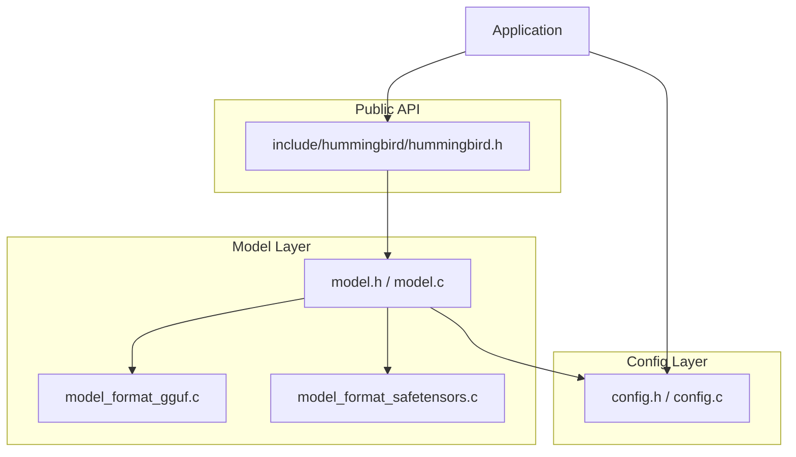
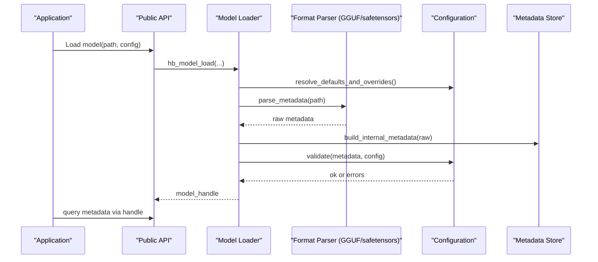
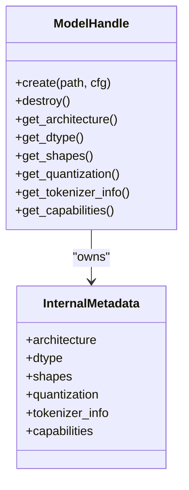
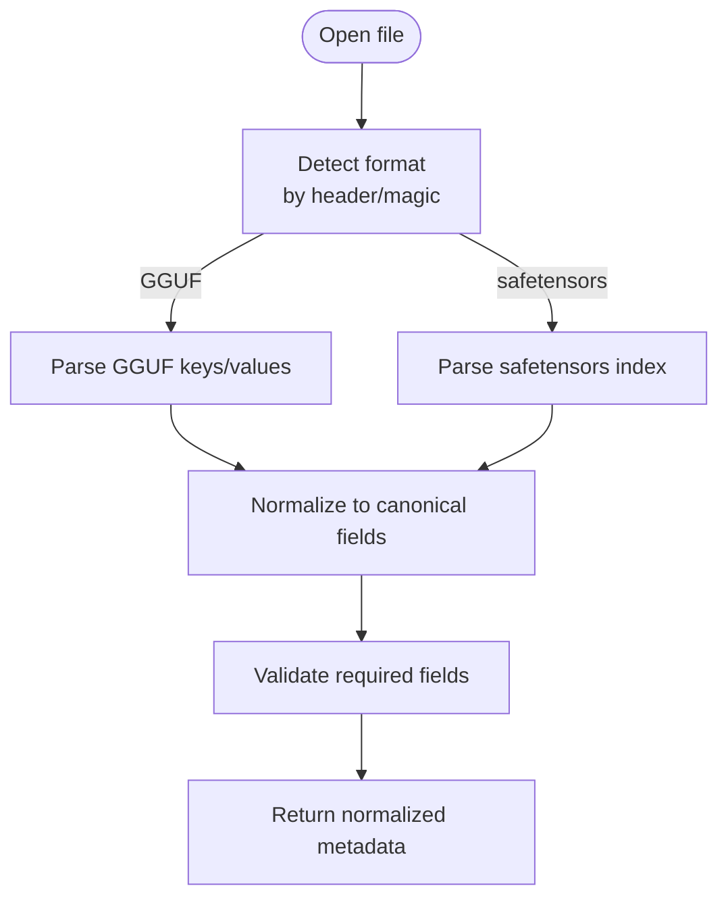
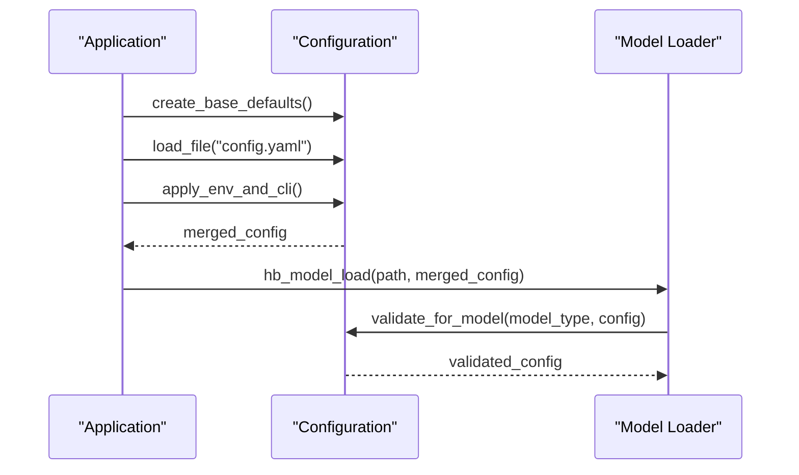
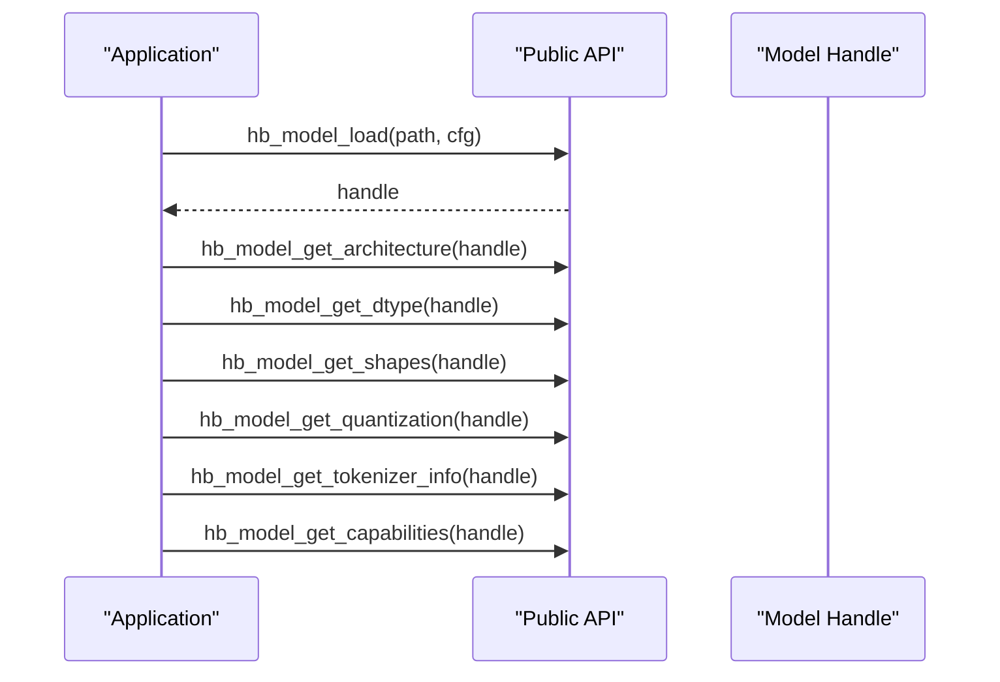
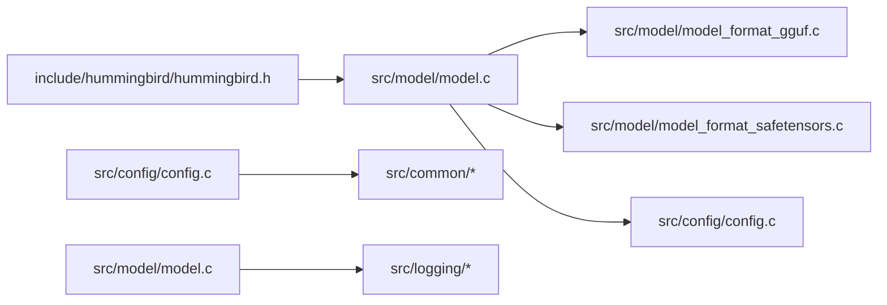

# Model Metadata and Configuration

<cite>
**Referenced Files in This Document**
- [model.h](file://src/model/model.h)
- [model.c](file://src/model/model.c)
- [model_format_gguf.c](file://src/model/model_format_gguf.c)
- [model_format_safetensors.c](file://src/model/model_format_safetensors.c)
- [config.h](file://src/config/config.h)
- [config.c](file://src/config/config.c)
- [hummingbird.h](file://include/hummingbird/hummingbird.h)
</cite>

## Table of Contents
1. [Introduction](#introduction)
2. [Project Structure](#project-structure)
3. [Core Components](#core-components)
4. [Architecture Overview](#architecture-overview)
5. [Detailed Component Analysis](#detailed-component-analysis)
6. [Dependency Analysis](#dependency-analysis)
7. [Performance Considerations](#performance-considerations)
8. [Troubleshooting Guide](#troubleshooting-guide)
9. [Conclusion](#conclusion)
10. [Appendices](#appendices)

## Introduction

This document explains how Hummingbird extracts, validates, and stores model metadata during loading, and how it integrates with the configuration system to manage parameters, defaults, and version compatibility. It also provides guidance for accessing model information, customizing behavior via configuration files, implementing model-specific settings, and planning schema evolution and migrations.

## Project Structure

The relevant code is organized under src/model and src/config:
- src/model: Model loading, format-specific parsers (GGUF, safetensors), and public model API
- src/config: Configuration parsing, validation, defaults, and runtime accessors
- include/hummingbird: Public ABI headers used by applications

[No sources needed since this diagram shows conceptual workflow, not actual code structure]

## Core Components

- Model metadata structures and lifecycle:
  - Model handle creation, initialization, and destruction
  - Metadata fields such as architecture, dtype, shape, quantization, tokenizer info, and capability flags
  - Format-specific parsing for GGUF and safetensors
- Configuration subsystem:
  - Global and per-model configuration scopes
  - Parameter types, default values, validation rules, and overrides
  - File-backed configuration loading and merging strategies
- Integration points:
  - Model loader uses configuration to decide backend selection, memory layout, and feature toggles
  - Validation ensures metadata consistency and compatibility with runtime capabilities

**Section sources**
- [model.h](file://src/model/model.h)
- [model.c](file://src/model/model.c)
- [model_format_gguf.c](file://src/model/model_format_gguf.c)
- [model_format_safetensors.c](file://src/model/model_format_safetensors.c)
- [config.h](file://src/config/config.h)
- [config.c](file://src/config/config.c)
- [hummingbird.h](file://include/hummingbird/hummingbird.h)

## Architecture Overview

The model loading pipeline reads a model file, parses its metadata into an internal representation, validates it against supported schemas and runtime capabilities, and applies configuration-driven behaviors. The configuration layer provides typed accessors, defaults, and validation hooks.

**Diagram sources**
- [model.c](file://src/model/model.c)
- [model_format_gguf.c](file://src/model/model_format_gguf.c)
- [model_format_safetensors.c](file://src/model/model_format_safetensors.c)
- [config.c](file://src/config/config.c)
- [hummingbird.h](file://include/hummingbird/hummingbird.h)

## Detailed Component Analysis

### Model Metadata Structures and Lifecycle

- Responsibilities:
  - Represent parsed metadata in a stable internal form
  - Provide getters for architecture, dtypes, shapes, quantization, tokenizers, and features
  - Manage memory and lifetime of metadata objects
- Key operations:
  - Create/destroy model handles
  - Initialize from parsed metadata
  - Query metadata at runtime

**Diagram sources**
- [model.h](file://src/model/model.h)
- [model.c](file://src/model/model.c)

**Section sources**
- [model.h](file://src/model/model.h)
- [model.c](file://src/model/model.c)

### Format-Specific Parsers (GGUF and safetensors)

- Responsibilities:
  - Read binary headers and key-value metadata blocks
  - Normalize field names and types into a common intermediate representation
  - Surface errors for unsupported or malformed entries
- Processing logic:
  - Detect format by magic/version bytes
  - Iterate tensors and attributes
  - Map to canonical metadata fields

**Diagram sources**
- [model_format_gguf.c](file://src/model/model_format_gguf.c)
- [model_format_safetensors.c](file://src/model/model_format_safetensors.c)

**Section sources**
- [model_format_gguf.c](file://src/model/model_format_gguf.c)
- [model_format_safetensors.c](file://src/model/model_format_safetensors.c)

### Configuration System Integration

- Responsibilities:
  - Provide typed configuration APIs for global and per-model scopes
  - Merge defaults, environment variables, CLI flags, and file-based configs
  - Validate parameter ranges and cross-field constraints
- Typical flow:
  - Build base defaults
  - Apply user-provided overrides
  - Run validators and return resolved configuration
  - Expose read-only accessors to model loader and runtime

**Diagram sources**
- [config.h](file://src/config/config.h)
- [config.c](file://src/config/config.c)
- [model.c](file://src/model/model.c)

**Section sources**
- [config.h](file://src/config/config.h)
- [config.c](file://src/config/config.c)

### Accessing Model Information

Applications typically use the public API to:
- Load a model with optional configuration
- Query architecture, data types, tensor shapes, quantization, and tokenizer details
- Inspect capabilities and constraints before execution

**Diagram sources**
- [hummingbird.h](file://include/hummingbird/hummingbird.h)
- [model.c](file://src/model/model.c)

**Section sources**
- [hummingbird.h](file://include/hummingbird/hummingbird.h)
- [model.c](file://src/model/model.c)

### Customizing Behavior Through Configuration

Common customization areas:
- Backend selection and device preferences
- Memory allocation policies and caching
- Quantization-aware optimizations
- Tokenizer options and vocabulary paths
- Feature toggles for experimental capabilities

Best practices:
- Use explicit per-model configuration when multiple models are loaded
- Prefer file-based configuration for reproducibility
- Validate early and fail fast on incompatible combinations

**Section sources**
- [config.h](file://src/config/config.h)
- [config.c](file://src/config/config.c)
- [model.c](file://src/model/model.c)

### Implementing Model-Specific Settings

Guidelines:
- Define model-type-specific configuration sections
- Provide sensible defaults and documented ranges
- Add validators for cross-field dependencies
- Emit clear error messages indicating which setting caused failure

Example pattern:
- Register a validator for a given architecture family
- Enforce minimum context length or maximum batch size
- Gate advanced features behind capability checks

**Section sources**
- [config.h](file://src/config/config.h)
- [config.c](file://src/config/config.c)

### Metadata Schema Definitions and Version Compatibility

Schema concepts:
- Canonical field names and types
- Required vs optional fields
- Enumerated values for architecture and quantization modes
- Versioned metadata blocks to support evolution

Compatibility checks:
- Compare model metadata version with runtime-supported range
- Reject unknown architectures or unsupported dtypes
- Warn on deprecated fields while continuing if safe

Migration strategy:
- Maintain backward-compatible readers that map legacy fields to canonical ones
- Provide migration helpers to transform older metadata formats
- Log deprecations and suggest updated configuration keys

**Section sources**
- [model_format_gguf.c](file://src/model/model_format_gguf.c)
- [model_format_safetensors.c](file://src/model/model_format_safetensors.c)
- [model.c](file://src/model/model.c)

## Dependency Analysis

**Diagram sources**
- [hummingbird.h](file://include/hummingbird/hummingbird.h)
- [model.c](file://src/model/model.c)
- [model_format_gguf.c](file://src/model/model_format_gguf.c)
- [model_format_safetensors.c](file://src/model/model_format_safetensors.c)
- [config.c](file://src/config/config.c)

**Section sources**
- [hummingbird.h](file://include/hummingbird/hummingbird.h)
- [model.c](file://src/model/model.c)
- [config.c](file://src/config/config.c)

## Performance Considerations

- Avoid repeated parsing by caching normalized metadata after first load
- Defer expensive validations until necessary
- Batch configuration merges and avoid redundant string allocations
- Use streaming reads for large indices where possible
- Profile parser hot paths and prefer contiguous memory layouts

[No sources needed since this section provides general guidance]

## Troubleshooting Guide

Common issues and resolutions:
- Unsupported architecture or dtype: check model metadata and ensure runtime supports the combination
- Missing required fields: verify file integrity and format; confirm parser supports the version
- Incompatible configuration: review validator errors and adjust settings accordingly
- Backward compatibility warnings: update configuration keys and migrate legacy metadata using provided helpers

Diagnostic tips:
- Enable detailed logging around model load and config validation
- Dump normalized metadata for inspection
- Reproduce with minimal configuration to isolate conflicts

**Section sources**
- [model.c](file://src/model/model.c)
- [config.c](file://src/config/config.c)

## Conclusion

Hummingbird’s model metadata and configuration systems work together to provide robust, extensible, and forward-compatible model loading. By normalizing metadata across formats, validating against well-defined schemas, and integrating a typed configuration layer, the framework enables predictable behavior and easy customization. Following the schema and migration guidelines ensures smooth upgrades and long-term maintainability.

[No sources needed since this section summarizes without analyzing specific files]

## Appendices

### Example Workflows

- Loading a model with defaults:
  - Call the public load function with path only; defaults are applied automatically
- Overriding configuration:
  - Provide a configuration object or file path; merge order follows documented precedence
- Inspecting metadata:
  - Use public getters to retrieve architecture, dtype, shapes, quantization, tokenizer info, and capabilities

[No sources needed since this section provides general guidance]