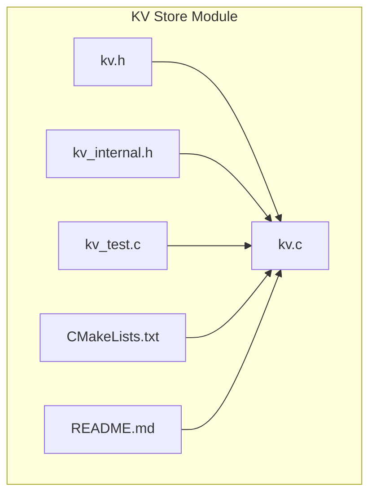
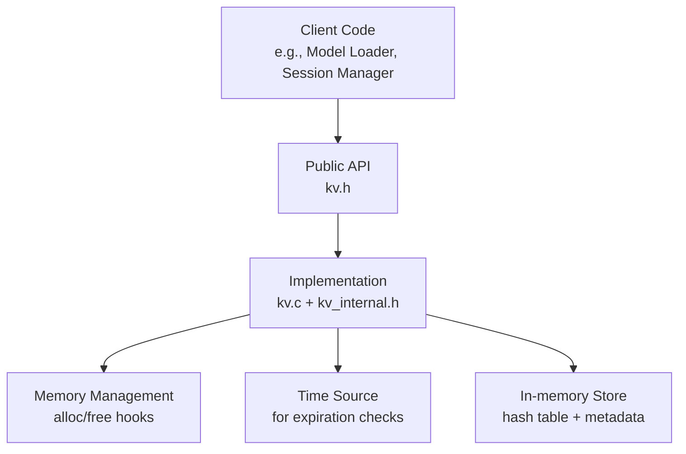
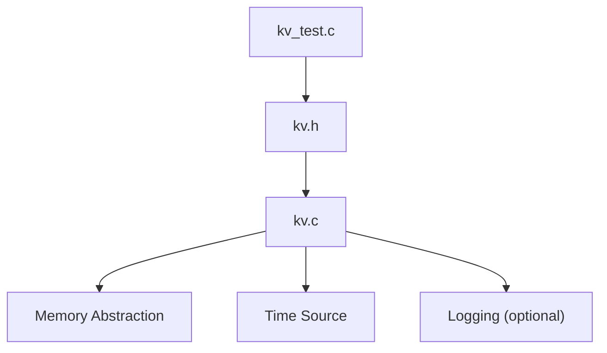

# Key-Value Storage System

<cite>
**Referenced Files in This Document**
- [kv.h](file://src/kv/kv.h)
- [kv.c](file://src/kv/kv.c)
- [kv_internal.h](file://src/kv/kv_internal.h)
- [kv_test.c](file://src/kv/kv_test.c)
- [CMakeLists.txt](file://src/kv/CMakeLists.txt)
- [README.md](file://src/kv/README.md)
</cite>

## Table of Contents
1. [Introduction](#introduction)
2. [Project Structure](#project-structure)
3. [Core Components](#core-components)
4. [Architecture Overview](#architecture-overview)
5. [Detailed Component Analysis](#detailed-component-analysis)
6. [Dependency Analysis](#dependency-analysis)
7. [Performance Considerations](#performance-considerations)
8. [Troubleshooting Guide](#troubleshooting-guide)
9. [Conclusion](#conclusion)
10. [Appendices](#appendices)

## Introduction
This document explains the key-value storage system in Hummingbird, focusing on its architecture, data persistence mechanisms, caching strategies, and API for storing, retrieving, and managing key-value pairs. It also covers expiration policies, memory management, concurrency handling, performance optimization techniques, relationships with other components such as runtime and memory subsystems, common use cases (model caching, session state, intermediate results), configuration options, scaling considerations, and troubleshooting approaches.

## Project Structure
The KV store is implemented under src/kv and includes public headers, internal implementation details, tests, and build configuration:
- Public API header: kv.h
- Internal structures and helpers: kv_internal.h
- Implementation: kv.c
- Tests: kv_test.c
- Build configuration: CMakeLists.txt
- Module documentation: README.md

**Diagram sources**
- [kv.h](file://src/kv/kv.h)
- [kv.c](file://src/kv/kv.c)
- [kv_internal.h](file://src/kv/kv_internal.h)
- [kv_test.c](file://src/kv/kv_test.c)
- [CMakeLists.txt](file://src/kv/CMakeLists.txt)
- [README.md](file://src/kv/README.md)

**Section sources**
- [kv.h](file://src/kv/kv.h)
- [kv.c](file://src/kv/kv.c)
- [kv_internal.h](file://src/kv/kv_internal.h)
- [kv_test.c](file://src/kv/kv_test.c)
- [CMakeLists.txt](file://src/kv/CMakeLists.txt)
- [README.md](file://src/kv/README.md)

## Core Components
- Public API surface: defined in the module header to expose initialization, lifecycle, and CRUD operations for keys and values.
- Internal implementation: encapsulates storage engine, expiration handling, memory allocation/deallocation, and thread-safety primitives.
- Tests: validate correctness across normal paths, edge cases, and concurrent access patterns.
- Build integration: compiles into the core library and exposes symbols for consumers.

Key responsibilities:
- Provide a stable interface for put/get/delete/exists/clear operations.
- Manage value lifetimes including optional expiration.
- Ensure safe concurrent access from multiple threads.
- Integrate with memory management for efficient allocation and reuse.

**Section sources**
- [kv.h](file://src/kv/kv.h)
- [kv_internal.h](file://src/kv/kv_internal.h)
- [kv.c](file://src/kv/kv.c)
- [kv_test.c](file://src/kv/kv_test.c)

## Architecture Overview
At a high level, the KV store provides an in-process cache backed by a hash-based map with optional TTL support. It integrates with the memory subsystem for allocations and can be used by higher-level components like model loading or session managers.

[No sources needed since this diagram shows conceptual workflow, not actual code structure]

## Detailed Component Analysis

### Public API Surface
The public API typically includes:
- Initialization and destruction of the KV store instance.
- Put: insert or update a key with an associated value and optional expiration.
- Get: retrieve a value by key; returns status indicating success or absence.
- Delete: remove a key if present.
- Exists: check presence without fetching the value.
- Clear: remove all entries.
- Optional scan/count utilities for diagnostics.

Concurrency guarantees:
- The API should be thread-safe for concurrent reads and writes unless otherwise documented.
- Expiration is lazily checked at access time or via background maintenance depending on implementation.

Error handling:
- Operations return status codes indicating success, not found, invalid arguments, or resource errors.

**Section sources**
- [kv.h](file://src/kv/kv.h)

### Internal Data Structures and Algorithms
Internal design focuses on:
- Hash table mapping string keys to value descriptors.
- Value descriptor includes payload pointer, size, and optional expiration timestamp.
- Expiration policy:
  - Lazy eviction: expired entries are removed when accessed.
  - Periodic cleanup: optional background task or explicit maintenance routine.
- Memory management:
  - Values may be allocated via the memory subsystem to allow pooling or custom allocators.
  - On delete or clear, memory is released back to the allocator.

Complexity:
- Average O(1) for put/get/delete/exists due to hashing.
- Space overhead proportional to number of entries plus metadata.

Thread safety:
- Critical sections protect hash table mutations.
- Read paths may use lock-free or fine-grained locking depending on implementation.

**Section sources**
- [kv_internal.h](file://src/kv/kv_internal.h)
- [kv.c](file://src/kv/kv.c)

### Expiration Policies and Persistence
Expiration:
- TTL per entry supports short-lived caches (e.g., intermediate results).
- Expiration timestamps are compared against current time on access or during maintenance.

Persistence:
- The in-memory KV store does not persist to disk by default.
- For persistent storage, clients should serialize values before insertion or integrate a backend that persists on write/read.

**Section sources**
- [kv.c](file://src/kv/kv.c)
- [kv_internal.h](file://src/kv/kv_internal.h)

### Concurrency Handling
- Locking strategy:
  - Coarse-grained mutex around hash table updates.
  - Fine-grained locks per bucket possible for scalability.
- Atomic operations:
  - Use atomics for counters and flags where applicable.
- Deadlock avoidance:
  - Avoid holding locks while invoking external callbacks or I/O.

**Section sources**
- [kv.c](file://src/kv/kv.c)
- [kv_internal.h](file://src/kv/kv_internal.h)

### Performance Optimization Techniques
- Pre-sizing capacity to reduce rehashing.
- Inline small values to avoid extra allocations.
- Batch operations for bulk loads.
- Minimize copying by supporting zero-copy views when safe.
- Cache-friendly layout for hot keys.

**Section sources**
- [kv.c](file://src/kv/kv.c)

### Integration with Runtime and Memory Management
- Memory subsystem:
  - Uses alloc/free abstractions to support custom allocators and memory pools.
- Runtime integration:
  - Can be initialized once per process or per context.
  - Higher-level modules (model loader, session manager) depend on it for caching.

**Section sources**
- [kv.c](file://src/kv/kv.c)
- [kv_internal.h](file://src/kv/kv_internal.h)

### Example Usage Patterns
- Model caching:
  - Store deserialized tensors or model artifacts keyed by model identifier.
  - Set long TTL or no expiration for frequently reused models.
- Session state:
  - Short-lived entries keyed by session ID with moderate TTL.
- Intermediate results:
  - Cache computed tensors for pipeline stages with aggressive TTL and LRU-like behavior via application logic.

[No sources needed since this section doesn't analyze specific files]

## Dependency Analysis
The KV module depends on:
- Memory management for allocations.
- Time source for expiration checks.
- Optional logging for diagnostics.

**Diagram sources**
- [kv.c](file://src/kv/kv.c)
- [kv.h](file://src/kv/kv.h)
- [kv_test.c](file://src/kv/kv_test.c)

**Section sources**
- [kv.c](file://src/kv/kv.c)
- [kv.h](file://src/kv/kv.h)
- [kv_test.c](file://src/kv/kv_test.c)

## Performance Considerations
- Capacity planning:
  - Estimate peak number of entries and pre-size to avoid rehashing.
- Entry sizing:
  - Prefer compact representations; avoid large payloads in hot paths.
- Expiration tuning:
  - Balance TTL length with memory pressure; shorter TTL reduces memory but increases recomputation.
- Concurrency:
  - Tune lock granularity based on workload; read-heavy workloads benefit from reader-writer locks.
- Observability:
  - Track hit/miss ratios and memory usage to guide tuning.

[No sources needed since this section provides general guidance]

## Troubleshooting Guide
Common issues and resolutions:
- Out-of-memory:
  - Reduce entry sizes, lower capacity, or increase TTL cleanup frequency.
- Stale data:
  - Verify TTL settings and ensure time source is monotonic.
- Deadlocks or contention:
  - Review critical sections and consider finer-grained locking.
- Incorrect key collisions:
  - Validate key normalization and hashing strategy.
- Slow lookups:
  - Check hash distribution and resize thresholds.

Diagnostic steps:
- Enable logging for put/get/delete operations.
- Inspect counts and memory usage metrics.
- Reproduce with minimal test case using kv_test patterns.

**Section sources**
- [kv_test.c](file://src/kv/kv_test.c)
- [kv.c](file://src/kv/kv.c)

## Conclusion
The Hummingbird KV store offers a robust, thread-safe in-memory cache with optional expiration and flexible memory integration. Its simple API enables effective caching for models, sessions, and intermediate results. Proper sizing, TTL tuning, and concurrency strategies are key to achieving optimal performance and reliability.

[No sources needed since this section summarizes without analyzing specific files]

## Appendices

### Configuration Options
- Capacity: initial number of buckets or entries.
- Expiration mode: lazy vs periodic cleanup.
- Allocator selection: default or custom memory pool.
- Logging verbosity: info/warn/error levels.

[No sources needed since this section provides general guidance]

### Scaling Considerations
- Horizontal scaling:
  - Shard keys across multiple KV instances.
- Vertical scaling:
  - Increase memory and tune lock granularity.
- Eviction policies:
  - Combine TTL with application-driven eviction for LRU-like behavior.

[No sources needed since this section provides general guidance]