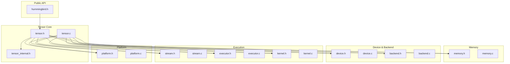
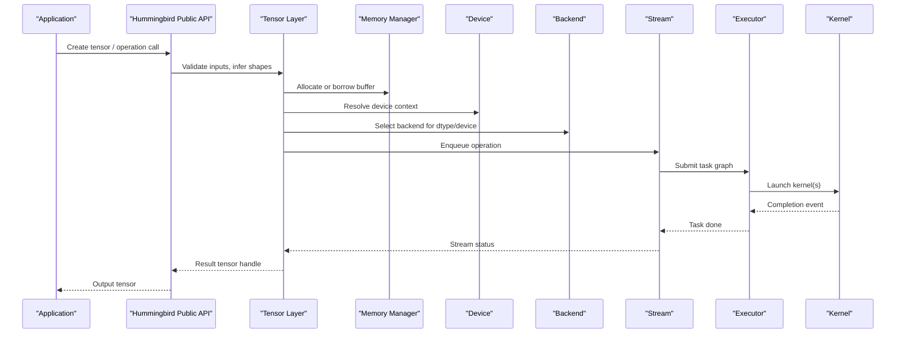
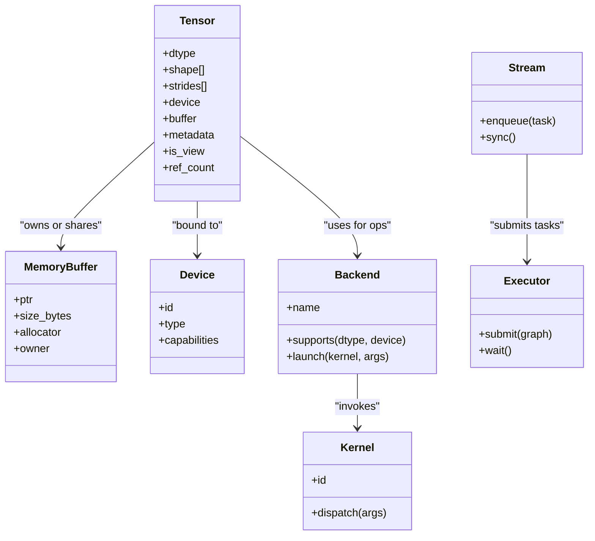
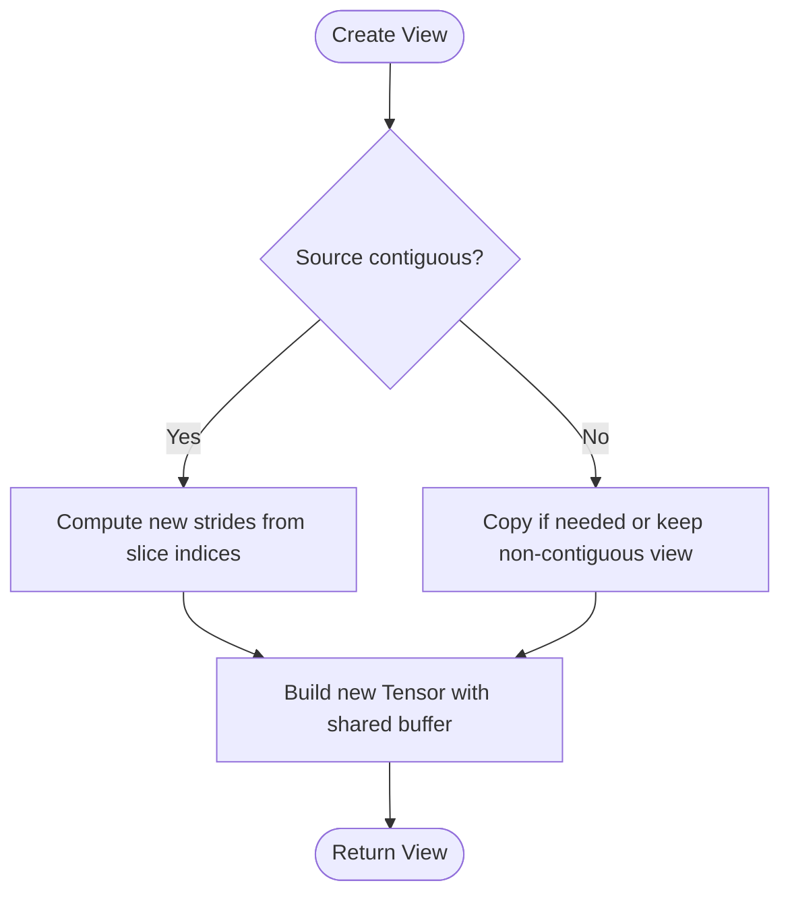
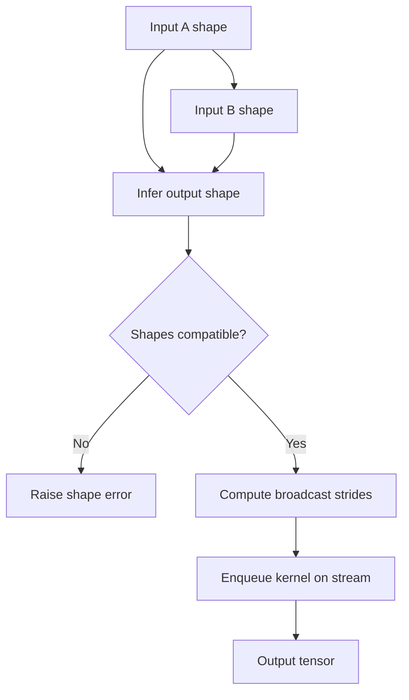
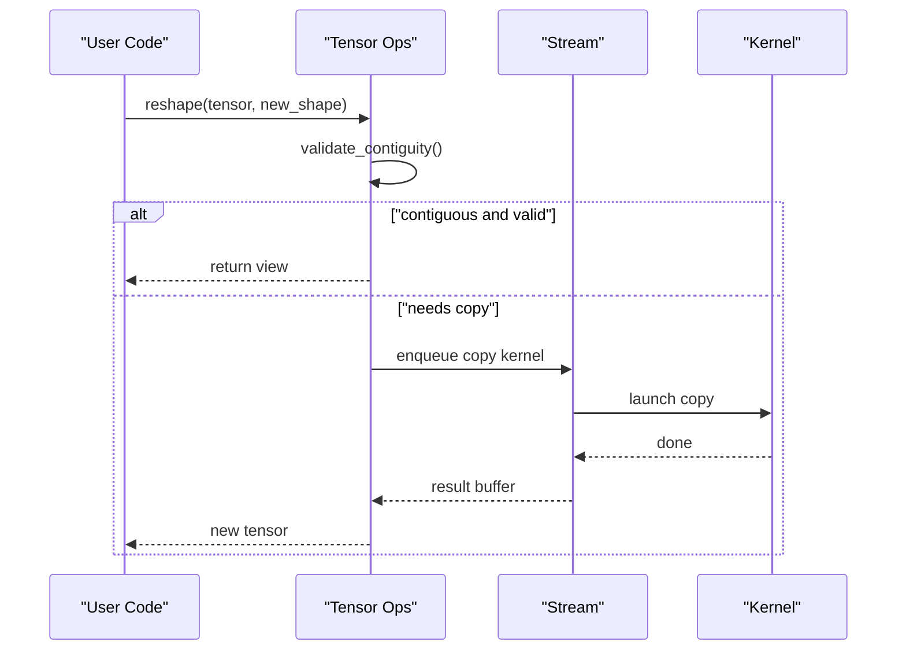
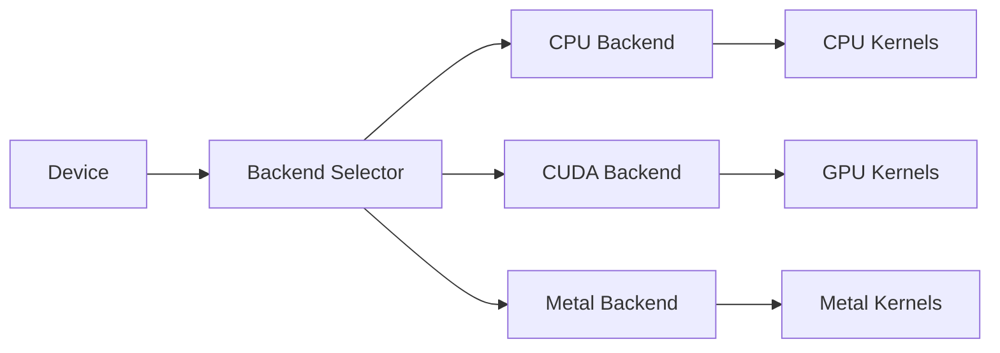
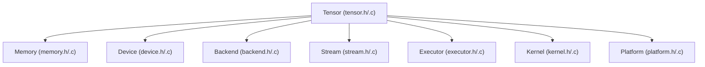

# Tensor Operations and Types

<cite>
**Referenced Files in This Document**
- [tensor.h](file://src/tensor/tensor.h)
- [tensor.c](file://src/tensor/tensor.c)
- [tensor_internal.h](file://src/tensor/tensor_internal.h)
- [memory.h](file://src/memory/memory.h)
- [memory.c](file://src/memory/memory.c)
- [backend.h](file://src/backend/backend.h)
- [backend.c](file://src/backend/backend.c)
- [device.h](file://src/device/device.h)
- [device.c](file://src/device/device.c)
- [stream.h](file://src/stream/stream.h)
- [stream.c](file://src/stream/stream.c)
- [executor.h](file://src/executor/executor.h)
- [executor.c](file://src/executor/executor.c)
- [kernel.h](file://src/kernel/kernel.h)
- [kernel.c](file://src/kernel/kernel.c)
- [platform.h](file://src/platform/platform.h)
- [platform.c](file://src/platform/platform.c)
- [hummingbird.h](file://include/hummingbird/hummingbird.h)
</cite>

## Table of Contents
1. [Introduction](#introduction)
2. [Project Structure](#project-structure)
3. [Core Components](#core-components)
4. [Architecture Overview](#architecture-overview)
5. [Detailed Component Analysis](#detailed-component-analysis)
6. [Dependency Analysis](#dependency-analysis)
7. [Performance Considerations](#performance-considerations)
8. [Troubleshooting Guide](#troubleshooting-guide)
9. [Conclusion](#conclusion)
10. [Appendices](#appendices)

## Introduction
This document explains Hummingbird’s tensor operations and type system with a focus on data structures, memory layout, numeric types, shapes, metadata, broadcasting, shape inference, and memory sharing strategies. It also covers creation from various sources, element-wise operations, advanced manipulations, performance considerations, backend compatibility, and guidance for large tensors and streaming workflows.

## Project Structure
The tensor subsystem is implemented under src/tensor and integrates with memory, device, backend, stream, executor, kernel, and platform layers. The public API surface is exposed via include/hummingbird/hummingbird.h.

**Diagram sources**
- [hummingbird.h:1-200](file://include/hummingbird/hummingbird.h#L1-L200)
- [tensor.h:1-200](file://src/tensor/tensor.h#L1-L200)
- [tensor_internal.h:1-200](file://src/tensor/tensor_internal.h#L1-L200)
- [memory.h:1-200](file://src/memory/memory.h#L1-L200)
- [device.h:1-200](file://src/device/device.h#L1-L200)
- [backend.h:1-200](file://src/backend/backend.h#L1-L200)
- [stream.h:1-200](file://src/stream/stream.h#L1-L200)
- [executor.h:1-200](file://src/executor/executor.h#L1-L200)
- [kernel.h:1-200](file://src/kernel/kernel.h#L1-L200)
- [platform.h:1-200](file://src/platform/platform.h#L1-L200)

**Section sources**
- [tensor.h:1-200](file://src/tensor/tensor.h#L1-L200)
- [tensor.c:1-200](file://src/tensor/tensor.c#L1-L200)
- [memory.h:1-200](file://src/memory/memory.h#L1-L200)
- [device.h:1-200](file://src/device/device.h#L1-L200)
- [backend.h:1-200](file://src/backend/backend.h#L1-L200)
- [stream.h:1-200](file://src/stream/stream.h#L1-L200)
- [executor.h:1-200](file://src/executor/executor.h#L1-L200)
- [kernel.h:1-200](file://src/kernel/kernel.h#L1-L200)
- [platform.h:1-200](file://src/platform/platform.h#L1-L200)
- [hummingbird.h:1-200](file://include/hummingbird/hummingbird.h#L1-L200)

## Core Components
- Tensor object: Represents an N-dimensional array with shape, stride, dtype, device, and optional metadata.
- Numeric types: Enumerated set of supported dtypes (e.g., float32, int32).
- Shape and strides: Stored as arrays; strides may be computed or provided to support views and slicing.
- Memory ownership: Tensors can own their buffer or share it via views.
- Device and backend: Tensors are bound to a device and executed by a backend implementation.
- Stream and execution: Operations are enqueued into streams and executed asynchronously when requested.
- Kernels: Element-wise and reduction kernels implement the actual math.

Key responsibilities:
- Creation and destruction of tensors
- Shape and dtype queries
- Views and slicing without copying
- Broadcasting and shape inference
- Enqueueing operations to backends
- Managing memory lifetimes and sharing

**Section sources**
- [tensor.h:1-200](file://src/tensor/tensor.h#L1-L200)
- [tensor_internal.h:1-200](file://src/tensor/tensor_internal.h#L1-L200)
- [memory.h:1-200](file://src/memory/memory.h#L1-L200)
- [device.h:1-200](file://src/device/device.h#L1-L200)
- [backend.h:1-200](file://src/backend/backend.h#L1-L200)
- [stream.h:1-200](file://src/stream/stream.h#L1-L200)
- [executor.h:1-200](file://src/executor/executor.h#L1-L200)
- [kernel.h:1-200](file://src/kernel/kernel.h#L1-L200)

## Architecture Overview
The tensor layer abstracts over devices and backends while providing a consistent API for creation, manipulation, and computation.

**Diagram sources**
- [hummingbird.h:1-200](file://include/hummingbird/hummingbird.h#L1-L200)
- [tensor.h:1-200](file://src/tensor/tensor.h#L1-L200)
- [memory.h:1-200](file://src/memory/memory.h#L1-L200)
- [device.h:1-200](file://src/device/device.h#L1-L200)
- [backend.h:1-200](file://src/backend/backend.h#L1-L200)
- [stream.h:1-200](file://src/stream/stream.h#L1-L200)
- [executor.h:1-200](file://src/executor/executor.h#L1-L200)
- [kernel.h:1-200](file://src/kernel/kernel.h#L1-L200)

## Detailed Component Analysis

### Tensor Data Model and Type System
- Numeric types: A compact enum represents supported dtypes. Each dtype has known size and alignment.
- Shapes: Represented as a dynamic array of dimensions. Strides may be contiguous or custom for views.
- Metadata: Optional fields such as name, tags, or quantization parameters.
- Ownership: A tensor either owns its buffer or references another tensor’s buffer (view semantics).

**Diagram sources**
- [tensor.h:1-200](file://src/tensor/tensor.h#L1-L200)
- [tensor_internal.h:1-200](file://src/tensor/tensor_internal.h#L1-L200)
- [memory.h:1-200](file://src/memory/memory.h#L1-L200)
- [device.h:1-200](file://src/device/device.h#L1-L200)
- [backend.h:1-200](file://src/backend/backend.h#L1-L200)
- [stream.h:1-200](file://src/stream/stream.h#L1-L200)
- [executor.h:1-200](file://src/executor/executor.h#L1-L200)
- [kernel.h:1-200](file://src/kernel/kernel.h#L1-L200)

**Section sources**
- [tensor.h:1-200](file://src/tensor/tensor.h#L1-L200)
- [tensor_internal.h:1-200](file://src/tensor/tensor_internal.h#L1-L200)
- [memory.h:1-200](file://src/memory/memory.h#L1-L200)
- [device.h:1-200](file://src/device/device.h#L1-L200)
- [backend.h:1-200](file://src/backend/backend.h#L1-L200)
- [stream.h:1-200](file://src/stream/stream.h#L1-L200)
- [executor.h:1-200](file://src/executor/executor.h#L1-L200)
- [kernel.h:1-200](file://src/kernel/kernel.h#L1-L200)

### Memory Layout and Sharing Strategies
- Contiguous layout: Default for newly created tensors; strides equal canonical row-major strides.
- Views and slicing: Zero-copy slices produce new tensors that share the underlying buffer with adjusted shape and strides.
- Broadcasting buffers: For binary ops, broadcasted views may be materialized lazily or handled by kernels.
- Ownership model: Reference counting or arena allocation may be used to manage lifetime across views.

**Diagram sources**
- [tensor.c:1-200](file://src/tensor/tensor.c#L1-L200)
- [memory.h:1-200](file://src/memory/memory.h#L1-L200)

**Section sources**
- [tensor.c:1-200](file://src/tensor/tensor.c#L1-L200)
- [memory.h:1-200](file://src/memory/memory.h#L1-L200)

### Creation from Various Sources
- From host arrays: Copies data into device memory according to dtype and shape.
- From existing tensors: Creates views or copies depending on contiguity and dtype/device requirements.
- From files/models: Loads serialized tensors (e.g., GGUF/safetensors) into allocated buffers.
- Zeros/ones/random: Allocates and initializes buffers with constant or random values.

Typical flow:
- Validate dtype and shape
- Allocate buffer on target device
- Copy or initialize data
- Construct tensor descriptor

**Section sources**
- [tensor.c:1-200](file://src/tensor/tensor.c#L1-L200)
- [memory.h:1-200](file://src/memory/memory.h#L1-L200)
- [device.h:1-200](file://src/device/device.h#L1-L200)

### Arithmetic and Element-wise Operations
- Supported ops: Add, subtract, multiply, divide, comparisons, reductions, etc.
- Broadcasting rules:
  - Align trailing dimensions
  - Dimensions must be equal or one of them is 1
  - Result shape is the element-wise max per dimension
- Shape inference:
  - Derived from operand shapes and op semantics
  - Validates compatibility before enqueueing
- Execution:
  - Dispatch to backend-specific kernel
  - Asynchronous via stream unless explicitly synchronized

**Diagram sources**
- [tensor.c:1-200](file://src/tensor/tensor.c#L1-L200)
- [kernel.h:1-200](file://src/kernel/kernel.h#L1-L200)
- [stream.h:1-200](file://src/stream/stream.h#L1-L200)

**Section sources**
- [tensor.c:1-200](file://src/tensor/tensor.c#L1-L200)
- [kernel.h:1-200](file://src/kernel/kernel.h#L1-L200)
- [stream.h:1-200](file://src/stream/stream.h#L1-L200)

### Advanced Manipulations
- Reshape: Changes shape without copying if strides allow; otherwise copies to contiguous buffer.
- Transpose: Swaps axes by adjusting strides; may require copy if not representable.
- Concatenate/stack: Builds new tensor by concatenating along a specified axis.
- Gather/scatter: Index-based selection and update using integer index tensors.

**Diagram sources**
- [tensor.c:1-200](file://src/tensor/tensor.c#L1-L200)
- [stream.h:1-200](file://src/stream/stream.h#L1-L200)
- [kernel.h:1-200](file://src/kernel/kernel.h#L1-L200)

**Section sources**
- [tensor.c:1-200](file://src/tensor/tensor.c#L1-L200)
- [stream.h:1-200](file://src/stream/stream.h#L1-L200)
- [kernel.h:1-200](file://src/kernel/kernel.h#L1-L200)

### Backends and Devices
- Device abstraction: CPU, CUDA, Metal, etc.
- Backend selection: Based on dtype and device capabilities.
- Kernel dispatch: Backend implements kernel launchers for each operation.

**Diagram sources**
- [device.h:1-200](file://src/device/device.h#L1-L200)
- [backend.h:1-200](file://src/backend/backend.h#L1-L200)
- [platform.h:1-200](file://src/platform/platform.h#L1-L200)

**Section sources**
- [device.h:1-200](file://src/device/device.h#L1-L200)
- [backend.h:1-200](file://src/backend/backend.h#L1-L200)
- [platform.h:1-200](file://src/platform/platform.h#L1-L200)

## Dependency Analysis
High-level dependencies between core modules:

**Diagram sources**
- [tensor.h:1-200](file://src/tensor/tensor.h#L1-L200)
- [memory.h:1-200](file://src/memory/memory.h#L1-L200)
- [device.h:1-200](file://src/device/device.h#L1-L200)
- [backend.h:1-200](file://src/backend/backend.h#L1-L200)
- [stream.h:1-200](file://src/stream/stream.h#L1-L200)
- [executor.h:1-200](file://src/executor/executor.h#L1-L200)
- [kernel.h:1-200](file://src/kernel/kernel.h#L1-L200)
- [platform.h:1-200](file://src/platform/platform.h#L1-L200)

**Section sources**
- [tensor.h:1-200](file://src/tensor/tensor.h#L1-L200)
- [memory.h:1-200](file://src/memory/memory.h#L1-L200)
- [device.h:1-200](file://src/device/device.h#L1-L200)
- [backend.h:1-200](file://src/backend/backend.h#L1-L200)
- [stream.h:1-200](file://src/stream/stream.h#L1-L200)
- [executor.h:1-200](file://src/executor/executor.h#L1-L200)
- [kernel.h:1-200](file://src/kernel/kernel.h#L1-L200)
- [platform.h:1-200](file://src/platform/platform.h#L1-L200)

## Performance Considerations
- Prefer contiguous tensors for compute-heavy ops to avoid extra copies.
- Use views and slicing to minimize allocations and data movement.
- Batch operations and fuse where possible to reduce kernel launch overhead.
- Reuse streams and executors to amortize setup costs.
- Choose appropriate dtypes (e.g., lower precision) when accuracy allows.
- Avoid unnecessary synchronization; batch sync points at logical boundaries.
- Profile memory bandwidth vs. compute-bound workloads and tune accordingly.

[No sources needed since this section provides general guidance]

## Troubleshooting Guide
Common issues and resolutions:
- Shape mismatch errors: Verify broadcasting compatibility and explicit shape inference results.
- Dtype mismatches: Ensure operands have compatible dtypes or cast explicitly.
- Device placement errors: Confirm tensors are on the same device or move them before ops.
- Non-contiguous strides: Some ops may require contiguous buffers; use contiguous views or copies.
- Memory leaks: Ensure proper release of tensor handles and check reference counts for views.
- Async completion: If results appear stale, synchronize the stream or wait on futures.

**Section sources**
- [tensor.c:1-200](file://src/tensor/tensor.c#L1-L200)
- [stream.h:1-200](file://src/stream/stream.h#L1-L200)
- [executor.h:1-200](file://src/executor/executor.h#L1-L200)

## Conclusion
Hummingbird’s tensor subsystem provides a flexible, efficient foundation for multi-device tensor computations. By combining clear type and shape semantics, zero-copy views, and asynchronous execution, it supports both high-performance numerical workloads and ergonomic APIs. Following the guidelines here will help you write correct, efficient code across backends and scale to large datasets.

[No sources needed since this section summarizes without analyzing specific files]

## Appendices

### Examples and Usage Patterns
- Creating tensors:
  - From host arrays: allocate on device and copy
  - From other tensors: create views or copies based on contiguity
  - Constant initialization: zeros, ones, random
- Element-wise operations:
  - Binary ops with broadcasting
  - Reductions (sum, mean, max)
- Advanced manipulations:
  - Reshape, transpose, concatenate, stack, gather/scatter

For concrete function signatures and examples, consult the public header and tensor module documentation.

**Section sources**
- [hummingbird.h:1-200](file://include/hummingbird/hummingbird.h#L1-L200)
- [tensor.h:1-200](file://src/tensor/tensor.h#L1-L200)
- [tensor.c:1-200](file://src/tensor/tensor.c#L1-L200)