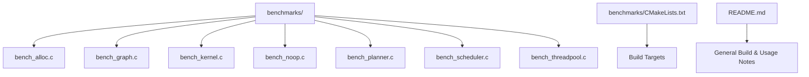
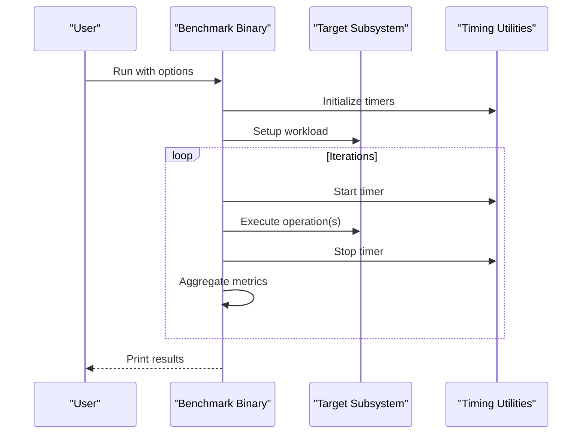
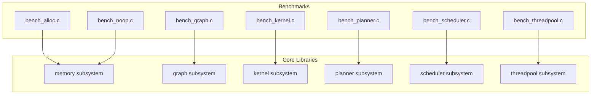

# Benchmarking Suite and Methodology

<cite>
**Referenced Files in This Document**
- [bench_alloc.c](file://benchmarks/bench_alloc.c)
- [bench_graph.c](file://benchmarks/bench_graph.c)
- [bench_kernel.c](file://benchmarks/bench_kernel.c)
- [bench_noop.c](file://benchmarks/bench_noop.c)
- [bench_planner.c](file://benchmarks/bench_planner.c)
- [bench_scheduler.c](file://benchmarks/bench_scheduler.c)
- [bench_threadpool.c](file://benchmarks/bench_threadpool.c)
- [CMakeLists.txt](file://benchmarks/CMakeLists.txt)
- [README.md](file://README.md)
</cite>

## Table of Contents
1. [Introduction](#introduction)
2. [Project Structure](#project-structure)
3. [Core Components](#core-components)
4. [Architecture Overview](#architecture-overview)
5. [Detailed Component Analysis](#detailed-component-analysis)
6. [Dependency Analysis](#dependency-analysis)
7. [Performance Considerations](#performance-considerations)
8. [Troubleshooting Guide](#troubleshooting-guide)
9. [Conclusion](#conclusion)
10. [Appendices](#appendices)

## Introduction
This document explains Hummingbird’s benchmarking suite and methodology. It covers the available benchmarks (allocation, graph execution, kernel performance, planner efficiency, scheduler throughput, and threadpool utilization), how to build and run them, how to interpret results, and how to compare across configurations. It also provides guidance for creating custom benchmarks, establishing baselines, and integrating regression testing. Practical examples illustrate common scenarios and optimization validation workflows.

## Project Structure
The benchmarking suite is implemented as a set of standalone C executables under the benchmarks directory. Each executable targets a specific subsystem or workload:
- Allocation: bench_alloc
- Graph execution: bench_graph
- Kernel performance: bench_kernel
- No-op baseline: bench_noop
- Planner efficiency: bench_planner
- Scheduler throughput: bench_scheduler
- Threadpool utilization: bench_threadpool

These are built via CMake and can be executed directly from the build tree. The top-level README provides general project context and build instructions that apply to benchmarks as well.

**Diagram sources**
- [bench_alloc.c](file://benchmarks/bench_alloc.c)
- [bench_graph.c](file://benchmarks/bench_graph.c)
- [bench_kernel.c](file://benchmarks/bench_kernel.c)
- [bench_noop.c](file://benchmarks/bench_noop.c)
- [bench_planner.c](file://benchmarks/bench_planner.c)
- [bench_scheduler.c](file://benchmarks/bench_scheduler.c)
- [bench_threadpool.c](file://benchmarks/bench_threadpool.c)
- [CMakeLists.txt](file://benchmarks/CMakeLists.txt)
- [README.md](file://README.md)

**Section sources**
- [README.md](file://README.md)

## Core Components
The suite consists of focused benchmark binaries:
- Allocation benchmark: measures allocator behavior and memory pressure patterns.
- Graph execution benchmark: evaluates end-to-end graph runtime performance.
- Kernel benchmark: isolates kernel-level operations for micro-benchmarking.
- No-op benchmark: establishes a minimal overhead baseline for timing infrastructure.
- Planner benchmark: assesses planning time and strategy selection overhead.
- Scheduler benchmark: measures scheduling throughput and latency characteristics.
- Threadpool benchmark: evaluates concurrency scaling and threadpool efficiency.

Each binary typically accepts command-line options to control workload size, iteration counts, and output verbosity. Results are printed to standard output in a machine-parseable format suitable for automation.

**Section sources**
- [bench_alloc.c](file://benchmarks/bench_alloc.c)
- [bench_graph.c](file://benchmarks/bench_graph.c)
- [bench_kernel.c](file://benchmarks/bench_kernel.c)
- [bench_noop.c](file://benchmarks/bench_noop.c)
- [bench_planner.c](file://benchmarks/bench_planner.c)
- [bench_scheduler.c](file://benchmarks/bench_scheduler.c)
- [bench_threadpool.c](file://benchmarks/bench_threadpool.c)

## Architecture Overview
At a high level, each benchmark initializes its target subsystem, constructs representative workloads, runs iterations, collects metrics, and prints results. The no-op benchmark serves as a reference to quantify measurement overhead.

[No sources needed since this diagram shows conceptual workflow, not actual code structure]

## Detailed Component Analysis

### Allocation Benchmark
Purpose:
- Measure allocation/deallocation rates, fragmentation effects, and allocator responsiveness under different sizes and patterns.

How to run:
- Build the suite using CMake and execute the allocation benchmark binary from the build tree.
- Use command-line flags to vary block sizes, iteration counts, and allocation patterns.

Interpreting results:
- Look for per-iteration timings and aggregate statistics such as mean, min, max, and variance.
- Compare across block sizes and patterns to identify hotspots or regressions.

Common scenarios:
- Small frequent allocations vs large infrequent ones.
- Mixed-size workloads simulating real-world usage.

Optimization validation:
- Validate improvements by comparing pre/post metrics on identical inputs.
- Use the no-op benchmark to subtract measurement overhead.

**Section sources**
- [bench_alloc.c](file://benchmarks/bench_alloc.c)

### Graph Execution Benchmark
Purpose:
- Evaluate end-to-end graph execution performance, including compilation/planning overhead and runtime throughput.

How to run:
- Build and execute the graph benchmark binary.
- Provide graph topology parameters and iteration counts via command-line options.

Interpreting results:
- Separate planning time from execution time if reported.
- Track throughput (operations per second) and latency distributions.

Common scenarios:
- Varying graph depth and width.
- Different backend selections (CPU/GPU) if supported.

Optimization validation:
- Compare against baseline graphs to validate fusion or scheduling improvements.

**Section sources**
- [bench_graph.c](file://benchmarks/bench_graph.c)

### Kernel Performance Benchmark
Purpose:
- Isolate individual kernels to measure compute-bound performance and memory bandwidth utilization.

How to run:
- Build and execute the kernel benchmark binary.
- Select kernel types and input dimensions via options.

Interpreting results:
- Focus on per-kernel latency and throughput.
- Observe scaling with input size to detect algorithmic changes.

Common scenarios:
- Matrix multiply variants, reductions, element-wise ops.
- Data layout variations (row-major vs column-major).

Optimization validation:
- Confirm gains after tuning loops, vectorization, or memory access patterns.

**Section sources**
- [bench_kernel.c](file://benchmarks/bench_kernel.c)

### No-op Benchmark
Purpose:
- Establish a baseline for timing infrastructure overhead and system noise.

How to run:
- Build and execute the no-op benchmark binary.
- Use it to calibrate measurement precision and subtract overhead from other benchmarks.

Interpreting results:
- Expect near-zero work; use results to understand minimum measurable intervals and jitter.

Common scenarios:
- Repeated runs to estimate variance and stability.

Optimization validation:
- Ensure new measurement paths do not introduce significant overhead.

**Section sources**
- [bench_noop.c](file://benchmarks/bench_noop.c)

### Planner Efficiency Benchmark
Purpose:
- Measure planning time and effectiveness of strategies used to optimize graph execution.

How to run:
- Build and execute the planner benchmark binary.
- Supply planning scenarios and configuration flags.

Interpreting results:
- Track planning latency and any trade-offs with downstream execution speed.

Common scenarios:
- Different optimization levels and feature flags.
- Complex graphs with many dependencies.

Optimization validation:
- Validate reduced planning times without sacrificing execution quality.

**Section sources**
- [bench_planner.c](file://benchmarks/bench_planner.c)

### Scheduler Throughput Benchmark
Purpose:
- Assess scheduling throughput and latency under concurrent workloads.

How to run:
- Build and execute the scheduler benchmark binary.
- Configure number of tasks and worker threads via options.

Interpreting results:
- Monitor task completion rates and queue wait times.
- Identify contention points and bottlenecks.

Common scenarios:
- High-concurrency workloads with varying task granularity.

Optimization validation:
- Confirm improved throughput after scheduler tuning.

**Section sources**
- [bench_scheduler.c](file://benchmarks/bench_scheduler.c)

### Threadpool Utilization Benchmark
Purpose:
- Evaluate threadpool scaling, load balancing, and overhead under different parallelism levels.

How to run:
- Build and execute the threadpool benchmark binary.
- Adjust thread count and workload distribution via options.

Interpreting results:
- Observe scaling curves and diminishing returns.
- Detect oversubscription or idle workers.

Common scenarios:
- CPU-bound vs IO-bound tasks.
- Dynamic task submission patterns.

Optimization validation:
- Validate better utilization after threadpool policy changes.

**Section sources**
- [bench_threadpool.c](file://benchmarks/bench_threadpool.c)

## Dependency Analysis
Benchmarks depend on core Hummingbird components through their respective subsystems. The CMake configuration defines build targets for each benchmark and links them against required libraries.

**Diagram sources**
- [bench_alloc.c](file://benchmarks/bench_alloc.c)
- [bench_graph.c](file://benchmarks/bench_graph.c)
- [bench_kernel.c](file://benchmarks/bench_kernel.c)
- [bench_noop.c](file://benchmarks/bench_noop.c)
- [bench_planner.c](file://benchmarks/bench_planner.c)
- [bench_scheduler.c](file://benchmarks/bench_scheduler.c)
- [bench_threadpool.c](file://benchmarks/bench_threadpool.c)

**Section sources**
- [CMakeLists.txt](file://benchmarks/CMakeLists.txt)

## Performance Considerations
- Warm-up runs: Execute a small number of iterations before measuring to reduce cold-start effects.
- Stable environment: Close unrelated applications and pin CPU frequencies when possible.
- Statistical rigor: Repeat runs and report mean, median, min, max, and variance.
- Overhead subtraction: Use the no-op benchmark to estimate and subtract measurement overhead.
- Input consistency: Keep dataset sizes and shapes constant across comparisons.
- Output parsing: Prefer structured outputs for automated analysis and CI integration.

[No sources needed since this section provides general guidance]

## Troubleshooting Guide
- Build issues: Ensure CMake presets and toolchains match your platform. Refer to the top-level README for build prerequisites and steps.
- Missing symbols: Verify that all required libraries are linked; check the benchmarks CMake configuration for correct target definitions.
- Flaky results: Increase iteration counts and repeat runs; consider disabling power-saving features during measurement.
- Interpreting anomalies: Cross-check with the no-op benchmark to rule out timing artifacts.

**Section sources**
- [README.md](file://README.md)
- [CMakeLists.txt](file://benchmarks/CMakeLists.txt)

## Conclusion
Hummingbird’s benchmarking suite provides targeted tools to evaluate key subsystems and overall runtime performance. By following the recommended methodology—consistent inputs, repeated runs, overhead calibration, and structured output—you can establish reliable baselines, detect regressions early, and validate optimizations effectively.

[No sources needed since this section summarizes without analyzing specific files]

## Appendices

### How to Build and Run Benchmarks
- Configure and build using CMake according to the project’s build instructions in the top-level README.
- Locate the benchmark binaries in the build tree and execute them with desired options.
- Capture stdout for analysis; redirect to files for later comparison.

**Section sources**
- [README.md](file://README.md)

### Creating Custom Benchmarks
- Add a new C file under the benchmarks directory implementing your workload.
- Update the benchmarks CMakeLists.txt to define a new executable target and link necessary libraries.
- Follow the existing pattern: parse options, initialize subsystems, iterate, collect metrics, and print results.
- Integrate into CI by adding a test step that executes the new benchmark and asserts thresholds.

**Section sources**
- [CMakeLists.txt](file://benchmarks/CMakeLists.txt)

### Establishing Baselines and Regression Testing
- Record baseline results for canonical workloads and configurations.
- Store outputs in version-controlled artifacts or a dedicated repository.
- In CI, compare current results against baselines and fail builds if regressions exceed defined tolerances.
- Use the no-op benchmark to ensure measurement stability over time.

**Section sources**
- [bench_noop.c](file://benchmarks/bench_noop.c)

### Practical Examples and Workflows
- Example 1: Validate a kernel optimization by running the kernel benchmark before and after changes, keeping input sizes fixed.
- Example 2: Assess scheduler improvements by increasing concurrency and observing throughput gains.
- Example 3: Check allocator changes by varying allocation sizes and patterns, then comparing latency distributions.

[No sources needed since this section provides general guidance]