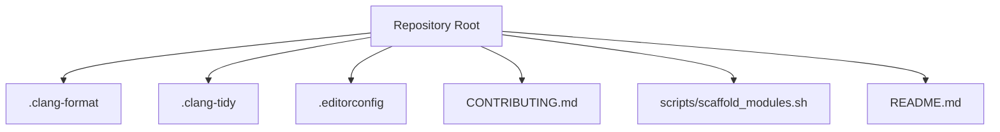
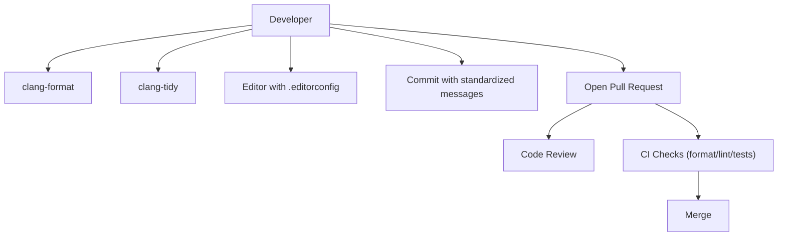
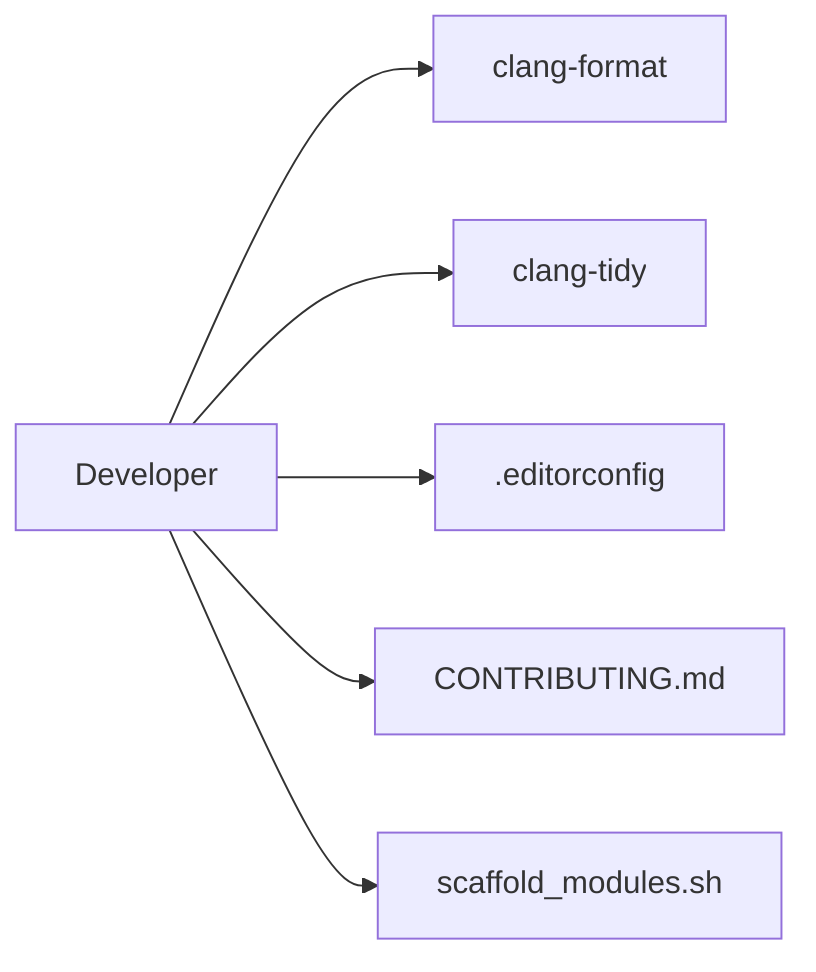

# Code Quality and Standards

<cite>
**Referenced Files in This Document**
- [.clang-format](file://.clang-format)
- [.clang-tidy](file://.clang-tidy)
- [.editorconfig](file://.editorconfig)
- [CONTRIBUTING.md](file://CONTRIBUTING.md)
- [scaffold_modules.sh](file://scripts/scaffold_modules.sh)
- [README.md](file://README.md)
</cite>

## Table of Contents
1. [Introduction](#introduction)
2. [Project Structure](#project-structure)
3. [Core Components](#core-components)
4. [Architecture Overview](#architecture-overview)
5. [Detailed Component Analysis](#detailed-component-analysis)
6. [Dependency Analysis](#dependency-analysis)
7. [Performance Considerations](#performance-considerations)
8. [Troubleshooting Guide](#troubleshooting-guide)
9. [Conclusion](#conclusion)

## Introduction
This document defines the code quality standards and development practices for Hummingbird. It consolidates coding conventions enforced by .clang-format and .clang-tidy, editor consistency via .editorconfig, contribution workflow from CONTRIBUTING.md, and automation tools such as scaffold_modules.sh. The goal is to ensure consistent formatting, static analysis compliance, predictable editor behavior, and a smooth contribution process across the team.

## Project Structure
The repository includes configuration files at the root that govern formatting, linting, and editor behavior:
- .clang-format: C/C++ formatting rules
- .clang-tidy: Static analysis checks and fixes
- .editorconfig: Editor settings for consistent indentation, line endings, and file metadata
- CONTRIBUTING.md: Contribution workflow, commit message standards, PR procedures, and review guidelines
- scripts/scaffold_modules.sh: Automation script for generating new module scaffolding

[No sources needed since this diagram shows conceptual project structure]

## Core Components
- Formatting standards (.clang-format): Enforces consistent style for C/C++ code (indentation, spacing, braces, includes, etc.).
- Static analysis (.clang-tidy): Defines checks, warnings, and fix suggestions to improve correctness and maintainability.
- Editor consistency (.editorconfig): Standardizes editor behavior (tabs vs spaces, line endings, trailing whitespace).
- Contribution workflow (CONTRIBUTING.md): Describes how to propose changes, write commits, open pull requests, and conduct reviews.
- Module scaffolding (scaffold_modules.sh): Automates creation of new modules with boilerplate files and build integration.

**Section sources**
- [.clang-format](file://.clang-format)
- [.clang-tidy](file://.clang-tidy)
- [.editorconfig](file://.editorconfig)
- [CONTRIBUTING.md](file://CONTRIBUTING.md)
- [scaffold_modules.sh](file://scripts/scaffold_modules.sh)

## Architecture Overview
The quality pipeline integrates local tooling and CI checks:
- Developers format and lint locally using clang-format and clang-tidy.
- EditorConfig ensures consistent editor behavior across environments.
- Contributions follow the workflow defined in CONTRIBUTING.md.
- New modules are generated via scaffold_modules.sh to maintain uniform structure.

[No sources needed since this diagram shows conceptual workflow]

## Detailed Component Analysis

### Formatting Standards (.clang-format)
Purpose:
- Enforce consistent C/C++ formatting across the codebase.
- Reduce noise in diffs and improve readability.

Key aspects typically covered:
- Indentation width and style
- Brace placement and spacing
- Include ordering and grouping
- Line length limits
- Pointer/reference alignment
- Enum and struct layout

How to apply:
- Run formatter on changed files before committing.
- Integrate into pre-commit hooks or IDE plugins.

Best practices:
- Configure your editor to auto-format on save.
- Use clang-format’s dry-run mode during CI to catch deviations.

**Section sources**
- [.clang-format](file://.clang-format)

### Static Analysis Requirements (.clang-tidy)
Purpose:
- Detect bugs, anti-patterns, and potential issues early.
- Provide automated fixes where possible.

Typical categories:
- Modern C++ usage
- Performance hints
- Security checks
- Readability and maintainability
- Portability and platform-specific concerns

How to apply:
- Run clang-tidy on modified files locally.
- Apply suggested fixes when appropriate.
- Ensure CI enforces clang-tidy checks.

Best practices:
- Keep checks relevant and actionable.
- Suppress false positives sparingly and document reasons.
- Periodically review and update check lists.

**Section sources**
- [.clang-tidy](file://.clang-tidy)

### Editor Consistency (.editorconfig)
Purpose:
- Ensure consistent editor behavior across different editors and platforms.

Common settings:
- Indentation type and size
- Insert final newline
- Trim trailing whitespace
- File encoding
- Max line length hints

Integration:
- Most modern editors support .editorconfig out of the box.
- Verify settings in your preferred editor/IDE.

**Section sources**
- [.editorconfig](file://.editorconfig)

### Contribution Workflow (CONTRIBUTING.md)
Scope:
- How to set up the environment
- Branching strategy and naming conventions
- Commit message standards
- Pull request creation and review process
- Testing expectations and CI gates

Commit message standards:
- Clear subject line summarizing change
- Optional body explaining rationale and impact
- Reference related issues or tickets when applicable

Pull request procedures:
- Keep PRs focused and small
- Update tests and documentation as needed
- Address reviewer feedback promptly

Code review processes:
- Expect constructive feedback
- Maintain respectful and professional communication
- Ensure all checks pass before requesting merge

**Section sources**
- [CONTRIBUTING.md](file://CONTRIBUTING.md)

### Module Scaffolding Tool (scaffold_modules.sh)
Purpose:
- Generate new modules with consistent structure and boilerplate.
- Speed up development and reduce manual setup errors.

Typical outputs:
- Header and source files
- Internal header for private interfaces
- Test file skeleton
- Build system integration entries (e.g., CMakeLists.txt updates)

Usage guidance:
- Run the script from the repository root or as documented.
- Provide required parameters (module name, target paths).
- Verify generated files compile and tests run.

Automation benefits:
- Uniform naming and directory layout
- Consistent include guards and file organization
- Reduced boilerplate maintenance overhead

**Section sources**
- [scaffold_modules.sh](file://scripts/scaffold_modules.sh)

### Documentation and Comment Conventions
Guidelines:
- Public APIs should have clear headers describing purpose, parameters, return values, and error conditions.
- Internal functions may use concise comments focusing on non-obvious logic.
- Avoid redundant comments; prefer self-documenting code where possible.
- Keep comments updated alongside code changes.

Maintainability practices:
- Favor small, focused functions and modules.
- Use descriptive names for variables, functions, and types.
- Centralize shared utilities and avoid duplication.

**Section sources**
- [README.md](file://README.md)

## Dependency Analysis
Quality-related dependencies:
- clang-format and clang-tidy are external tools invoked locally and in CI.
- .editorconfig is consumed by editors and IDEs.
- CONTRIBUTING.md guides human processes and expectations.
- scaffold_modules.sh automates repetitive tasks to maintain structural consistency.

[No sources needed since this diagram shows conceptual relationships]

## Performance Considerations
- Prefer incremental runs of clang-format and clang-tidy to minimize overhead.
- Cache results where supported by your toolchain or CI runner.
- Keep clang-tidy checks targeted to avoid excessive runtime.
- Use editor integrations to format on save, reducing manual effort.

[No sources needed since this section provides general guidance]

## Troubleshooting Guide
Common issues and resolutions:
- Formatting failures in CI:
  - Ensure clang-format version matches local configuration.
  - Run formatter locally and commit corrected files.
- clang-tidy violations:
  - Review specific rule explanations and apply suggested fixes.
  - If suppression is necessary, add minimal, justified suppressions.
- Editor inconsistencies:
  - Verify .editorconfig is recognized by your editor.
  - Check indentation and line ending settings.
- Scaffolded module not building:
  - Confirm CMakeLists.txt entries were added correctly.
  - Validate file paths and naming conventions.

**Section sources**
- [.clang-format](file://.clang-format)
- [.clang-tidy](file://.clang-tidy)
- [.editorconfig](file://.editorconfig)
- [scaffold_modules.sh](file://scripts/scaffold_modules.sh)

## Conclusion
Adhering to these standards ensures consistent, high-quality code across Hummingbird. Use clang-format and clang-tidy to enforce style and correctness, rely on .editorconfig for editor consistency, follow the contribution workflow for collaborative development, and leverage scaffold_modules.sh to streamline module creation. Together, these practices enhance maintainability, readability, and developer productivity.