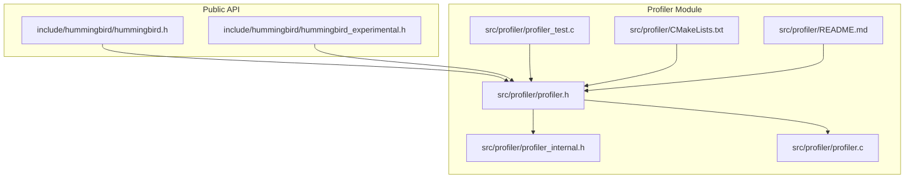
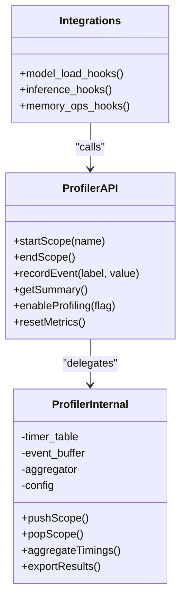
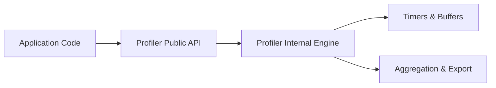

# Profiling Tools and Techniques

<cite>
**Referenced Files in This Document**
- [profiler.h](file://src/profiler/profiler.h)
- [profiler.c](file://src/profiler/profiler.c)
- [profiler_internal.h](file://src/profiler/profiler_internal.h)
- [profiler_test.c](file://src/profiler/profiler_test.c)
- [README.md](file://src/profiler/README.md)
- [CMakeLists.txt](file://src/profiler/CMakeLists.txt)
- [hummingbird.h](file://include/hummingbird/hummingbird.h)
- [hummingbird_experimental.h](file://include/hummingbird/hummingbird_experimental.h)
</cite>

## Table of Contents
1. [Introduction](#introduction)
2. [Project Structure](#project-structure)
3. [Core Components](#core-components)
4. [Architecture Overview](#architecture-overview)
5. [Detailed Component Analysis](#detailed-component-analysis)
6. [Dependency Analysis](#dependency-analysis)
7. [Performance Considerations](#performance-considerations)
8. [Troubleshooting Guide](#troubleshooting-guide)
9. [Conclusion](#conclusion)
10. [Appendices](#appendices)

## Introduction
This document explains Hummingbird’s profiling tools and techniques, focusing on the built-in profiler architecture, performance measurement APIs, and end-to-end profiling workflows. It covers how to enable profiling, collect metrics, analyze execution bottlenecks, and interpret results. Practical examples are provided for model loading, inference execution, and memory operations. The content is organized for both beginners learning basic profiling concepts and experienced developers optimizing critical paths.

## Project Structure
The profiler is implemented as a dedicated module under src/profiler with public headers exposed via include/hummingbird. The build system integrates the profiler into the core library and tests.

**Diagram sources**
- [hummingbird.h](file://include/hummingbird/hummingbird.h)
- [hummingbird_experimental.h](file://include/hummingbird/hummingbird_experimental.h)
- [profiler.h](file://src/profiler/profiler.h)
- [profiler_internal.h](file://src/profiler/profiler_internal.h)
- [profiler.c](file://src/profiler/profiler.c)
- [profiler_test.c](file://src/profiler/profiler_test.c)
- [README.md](file://src/profiler/README.md)
- [CMakeLists.txt](file://src/profiler/CMakeLists.txt)

**Section sources**
- [profiler.h](file://src/profiler/profiler.h)
- [profiler.c](file://src/profiler/profiler.c)
- [profiler_internal.h](file://src/profiler/profiler_internal.h)
- [profiler_test.c](file://src/profiler/profiler_test.c)
- [README.md](file://src/profiler/README.md)
- [CMakeLists.txt](file://src/profiler/CMakeLists.txt)
- [hummingbird.h](file://include/hummingbird/hummingbird.h)
- [hummingbird_experimental.h](file://include/hummingbird/hummingbird_experimental.h)

## Core Components
- Public profiling API: Declared in the profiler header and optionally re-exported through the main public headers. It provides functions to start/stop timers, record events, query timing data, and control profiling behavior.
- Internal implementation: Encapsulated in the internal header and source file, including timer storage, event recording, aggregation, and output formatting.
- Tests: Validate lifecycle, accuracy, and edge cases such as nested scopes and concurrent access.
- Build integration: CMake configuration ensures the profiler is compiled and linked with the rest of the library.

Key responsibilities:
- Provide low-overhead instrumentation points around hot paths.
- Aggregate per-scope timings and expose summaries.
- Support enabling/disabling profiling at runtime or compile time.
- Offer utilities for exporting or printing results.

**Section sources**
- [profiler.h](file://src/profiler/profiler.h)
- [profiler_internal.h](file://src/profiler/profiler_internal.h)
- [profiler.c](file://src/profiler/profiler.c)
- [profiler_test.c](file://src/profiler/profiler_test.c)
- [CMakeLists.txt](file://src/profiler/CMakeLists.txt)

## Architecture Overview
The profiler follows a layered design:
- Public API layer: Stable interface for application code to instrument regions and query metrics.
- Internal engine: Manages timers, scopes, and aggregated statistics; handles thread safety and overhead minimization.
- Integration points: Optional hooks from model loading, graph execution, kernel dispatch, and memory allocation paths.

**Diagram sources**
- [profiler.h](file://src/profiler/profiler.h)
- [profiler_internal.h](file://src/profiler/profiler_internal.h)
- [profiler.c](file://src/profiler/profiler.c)

## Detailed Component Analysis

### Public API Surface
- Scope-based timing: Start/end markers around code regions to measure duration.
- Event recording: Lightweight key-value measurements for non-timing metrics (e.g., counts, sizes).
- Summary retrieval: Access aggregated results for analysis.
- Control flags: Enable/disable profiling and reset accumulated metrics.

Typical usage patterns:
- Wrap model loading phases with scoped timers.
- Instrument inference steps (preprocessing, compute, postprocessing).
- Mark memory allocations/deallocations to track pressure.

**Section sources**
- [profiler.h](file://src/profiler/profiler.h)
- [hummingbird.h](file://include/hummingbird/hummingbird.h)
- [hummingbird_experimental.h](file://include/hummingbird/hummingbird_experimental.h)

### Internal Implementation
- Timer management: Per-scope timestamps and durations stored in an efficient table.
- Event buffer: Circular or append-only buffer for lightweight event logging.
- Aggregation: Rolling sums, min/max, and counts per scope/event label.
- Thread safety: Atomic updates or lock-free structures where possible to minimize overhead.
- Export/formatting: Structured output suitable for downstream analysis tools.

Design considerations:
- Minimize instrumentation overhead by deferring heavy work until summary/export.
- Avoid dynamic allocations inside hot paths.
- Provide compile-time toggles to strip profiling when not needed.

**Section sources**
- [profiler_internal.h](file://src/profiler/profiler_internal.h)
- [profiler.c](file://src/profiler/profiler.c)

### Tests and Validation
- Lifecycle tests: Ensure start/end pairs balance and do not leak state.
- Accuracy tests: Verify measured durations align with expected ranges.
- Concurrency tests: Confirm correctness under multi-threaded workloads.
- Edge cases: Empty scopes, repeated resets, and large event volumes.

**Section sources**
- [profiler_test.c](file://src/profiler/profiler_test.c)

### Build Integration
- CMake configuration compiles the profiler module and links it into the library.
- Tests are included in the test suite for continuous validation.

**Section sources**
- [CMakeLists.txt](file://src/profiler/CMakeLists.txt)

## Dependency Analysis
The profiler depends on minimal subsystems and exposes a stable API. External integrations call into the public API without needing internal details.

[No sources needed since this diagram shows conceptual workflow, not actual code structure]

## Performance Considerations
- Overhead budget: Keep instrumentation light; avoid allocations and I/O in hot paths.
- Sampling vs. full tracing: Prefer sampling for long-running processes; use full tracing for targeted segments.
- Batch exports: Aggregate and export results periodically rather than after every operation.
- Selective enablement: Use compile-time flags or runtime toggles to disable profiling in production unless required.
- Cache-friendly data: Store metrics in compact arrays to improve locality.

[No sources needed since this section provides general guidance]

## Troubleshooting Guide
Common issues and resolutions:
- Missing symbols: Ensure the profiler module is built and linked; verify CMake includes the profiler target.
- No data collected: Confirm profiling is enabled and scopes are properly paired.
- High overhead: Reduce granularity of scopes, switch to sampling, or disable non-critical instrumentation.
- Inconsistent results: Check for unbalanced start/end calls and ensure thread-safe usage.

Operational checks:
- Validate that summary retrieval returns expected labels and values.
- Inspect exported formats for completeness and correctness.

**Section sources**
- [profiler_test.c](file://src/profiler/profiler_test.c)
- [README.md](file://src/profiler/README.md)

## Conclusion
Hummingbird’s profiler provides a clean, low-overhead mechanism to measure and analyze performance across model loading, inference, and memory operations. By using scoped timers and event recording, developers can pinpoint bottlenecks and validate optimizations. Adopting selective enablement and batched exports helps maintain performance while gaining actionable insights.

[No sources needed since this section summarizes without analyzing specific files]

## Appendices

### Basic Profiling Workflow
- Initialize or ensure profiling is enabled.
- Wrap critical sections with start/end scopes.
- Record key events (counts, sizes) alongside timings.
- Retrieve summaries and export results for analysis.

### Advanced Strategies
- Hierarchical scopes: Nest scopes to capture phase-level breakdowns.
- Conditional instrumentation: Gate expensive instrumentation behind flags.
- Correlation with external tools: Export structured data compatible with profilers or dashboards.
- Regression detection: Compare summaries across runs to detect regressions.

[No sources needed since this section provides general guidance]