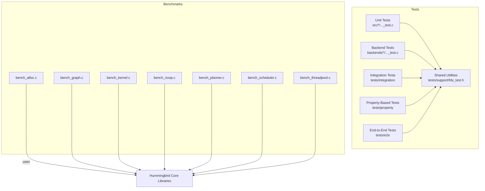
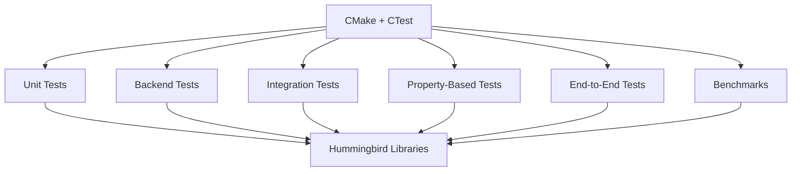
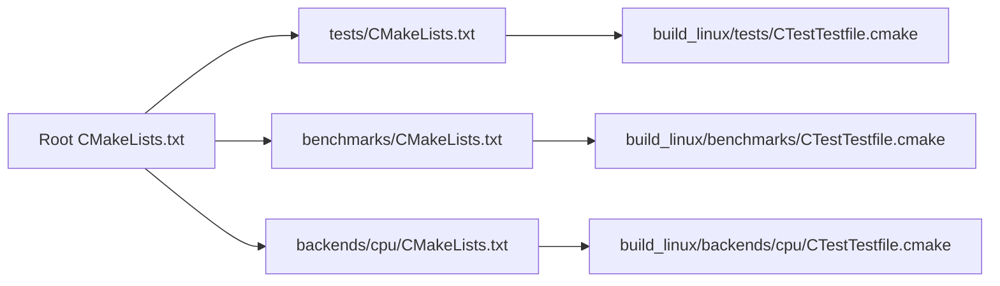

# Testing Framework and Infrastructure

<cite>
**Referenced Files in This Document**
- [CMakeLists.txt](file://CMakeLists.txt)
- [tests/CMakeLists.txt](file://tests/CMakeLists.txt)
- [tests/support/hbi_test.h](file://tests/support/hbi_test.h)
- [tests/integration/test_public_abi.c](file://tests/integration/test_public_abi.c)
- [tests/e2e/test_placeholder.c](file://tests/e2e/test_placeholder.c)
- [tests/property/test_placeholder.c](file://tests/property/test_placeholder.c)
- [backends/cpu/backend_cpu_kernels_test.c](file://backends/cpu/backend_cpu_kernels_test.c)
- [backends/cpu/backend_cpu_test.c](file://backends/cpu/backend_cpu_test.c)
- [src/adapter/adapter_test.c](file://src/adapter/adapter_test.c)
- [src/adapter/adapter_mock.c](file://src/adapter/adapter_mock.c)
- [benchmarks/bench_alloc.c](file://benchmarks/bench_alloc.c)
- [benchmarks/bench_graph.c](file://benchmarks/bench_graph.c)
- [benchmarks/bench_kernel.c](file://benchmarks/bench_kernel.c)
- [benchmarks/bench_noop.c](file://benchmarks/bench_noop.c)
- [benchmarks/bench_planner.c](file://benchmarks/bench_planner.c)
- [benchmarks/bench_scheduler.c](file://benchmarks/bench_scheduler.c)
- [benchmarks/bench_threadpool.c](file://benchmarks/bench_threadpool.c)
- [build_linux/tests/CTestTestfile.cmake](file://build_linux/tests/CTestTestfile.cmake)
- [build_linux/backends/cpu/CTestTestfile.cmake](file://build_linux/backends/cpu/CTestTestfile.cmake)
- [build_linux/benchmarks/CTestTestfile.cmake](file://build_linux/benchmarks/CTestTestfile.cmake)
</cite>

## Table of Contents
1. [Introduction](#introduction)
2. [Project Structure](#project-structure)
3. [Core Components](#core-components)
4. [Architecture Overview](#architecture-overview)
5. [Detailed Component Analysis](#detailed-component-analysis)
6. [Dependency Analysis](#dependency-analysis)
7. [Performance Considerations](#performance-considerations)
8. [Troubleshooting Guide](#troubleshooting-guide)
9. [Conclusion](#conclusion)
10. [Appendices](#appendices)

## Introduction
This document explains Hummingbird’s testing framework and infrastructure, covering unit tests, integration tests, property-based tests, end-to-end tests, benchmarking tools, performance validation, regression strategies, test utilities, CI setup, automated pipelines, result analysis, and guidance for writing effective tests. It is intended for contributors who want to understand how tests are organized, how to add new tests, and how to debug failures.

## Project Structure
The repository organizes tests by category:
- Unit tests co-located with source modules under src/<module>/..._test.c
- Backend-specific tests under backends/<backend>/..._test.c
- Integration tests under tests/integration
- Property-based tests under tests/property
- End-to-end tests under tests/e2e
- Shared test utilities under tests/support
- Benchmarks under benchmarks

[No sources needed since this diagram shows conceptual structure]

**Section sources**
- [tests/CMakeLists.txt](file://tests/CMakeLists.txt)
- [build_linux/tests/CTestTestfile.cmake](file://build_linux/tests/CTestTestfile.cmake)
- [build_linux/backends/cpu/CTestTestfile.cmake](file://build_linux/backends/cpu/CTestTestfile.cmake)
- [build_linux/benchmarks/CTestTestfile.cmake](file://build_linux/benchmarks/CTestTestfile.cmake)

## Core Components
- Test utilities header: provides assertion macros and helper functions used across unit and integration tests.
- Public ABI integration test: validates the stable API surface.
- Placeholder tests for property-based and e2e categories to anchor CTest targets.
- Backend CPU tests: validate kernel and backend behavior on CPU.
- Adapter layer tests and mock: demonstrate isolation via mocks.

Key responsibilities:
- hbi_test.h: central assertions and helpers
- adapter_mock.c: mock implementation for adapter dependencies
- test_public_abi.c: ensures public headers compile and expose expected symbols
- *_test.c files per module: verify correctness of core logic

**Section sources**
- [tests/support/hbi_test.h](file://tests/support/hbi_test.h)
- [tests/integration/test_public_abi.c](file://tests/integration/test_public_abi.c)
- [tests/property/test_placeholder.c](file://tests/property/test_placeholder.c)
- [tests/e2e/test_placeholder.c](file://tests/e2e/test_placeholder.c)
- [backends/cpu/backend_cpu_kernels_test.c](file://backends/cpu/backend_cpu_kernels_test.c)
- [backends/cpu/backend_cpu_test.c](file://backends/cpu/backend_cpu_test.c)
- [src/adapter/adapter_test.c](file://src/adapter/adapter_test.c)
- [src/adapter/adapter_mock.c](file://src/adapter/adapter_mock.c)

## Architecture Overview
The testing architecture integrates multiple layers:
- Build system (CMake) defines test targets and registers them with CTest.
- Unit tests exercise internal APIs directly; backend tests exercise device-specific implementations.
- Integration tests validate cross-module contracts and public ABI stability.
- Property-based tests assert invariants over randomized inputs.
- E2E tests drive full workflows through frontends or CLI/server entry points.
- Benchmarks measure performance characteristics and regressions.

[No sources needed since this diagram shows conceptual workflow]

## Detailed Component Analysis

### Test Utilities: hbi_test.h
Purpose:
- Provides assertion macros and helper functions used throughout the test suite.
- Standardizes failure reporting and simplifies common checks.

Usage patterns:
- Include the header in test files.
- Use provided macros to assert conditions and compare values.
- Leverage helpers for resource setup/teardown where applicable.

Best practices:
- Prefer typed comparison helpers when available.
- Keep assertions focused and descriptive.
- Avoid side effects inside assertions.

**Section sources**
- [tests/support/hbi_test.h](file://tests/support/hbi_test.h)

### Public ABI Integration Test
Purpose:
- Ensures that public headers compile and expose expected symbols.
- Guards against accidental breaking changes to the stable API surface.

What it validates:
- Compilation of public headers.
- Presence of key symbols/functions/types.

How to extend:
- Add new symbol checks as the public API evolves.
- Keep the test minimal and fast.

**Section sources**
- [tests/integration/test_public_abi.c](file://tests/integration/test_public_abi.c)

### Property-Based Tests
Purpose:
- Validate invariants over randomized inputs.
- Catch edge cases missed by hand-written examples.

Current state:
- Placeholder target exists to anchor CTest configuration.

Guidelines:
- Define clear properties/invariants per feature.
- Generate diverse inputs including boundary conditions.
- Use deterministic seeds for reproducibility when needed.

**Section sources**
- [tests/property/test_placeholder.c](file://tests/property/test_placeholder.c)
- [tests/CMakeLists.txt](file://tests/CMakeLists.txt)

### End-to-End Tests
Purpose:
- Exercise complete workflows from user-facing entry points.
- Validate multi-module interactions and real-world scenarios.

Current state:
- Placeholder target exists to anchor CTest configuration.

Guidelines:
- Keep tests focused on critical paths.
- Use lightweight fixtures and minimal data sets.
- Isolate external dependencies via configuration or mocks.

**Section sources**
- [tests/e2e/test_placeholder.c](file://tests/e2e/test_placeholder.c)
- [tests/CMakeLists.txt](file://tests/CMakeLists.txt)

### Backend CPU Tests
Purpose:
- Validate CPU backend kernels and runtime behavior.
- Ensure numerical correctness and memory safety on CPU.

Coverage areas:
- Kernel-level operations.
- Backend initialization and lifecycle.

Execution:
- Built and registered as separate CTest targets.

**Section sources**
- [backends/cpu/backend_cpu_kernels_test.c](file://backends/cpu/backend_cpu_kernels_test.c)
- [backends/cpu/backend_cpu_test.c](file://backends/cpu/backend_cpu_test.c)
- [build_linux/backends/cpu/CTestTestfile.cmake](file://build_linux/backends/cpu/CTestTestfile.cmake)

### Adapter Layer Tests and Mocks
Purpose:
- Verify adapter behavior in isolation using a mock implementation.
- Demonstrate dependency injection patterns for testability.

Key elements:
- adapter_test.c: exercises adapter logic with controlled inputs.
- adapter_mock.c: provides a fake implementation of external dependencies.

Benefits:
- Faster, deterministic tests without external I/O or hardware.
- Clear separation between adapter logic and its dependencies.

**Section sources**
- [src/adapter/adapter_test.c](file://src/adapter/adapter_test.c)
- [src/adapter/adapter_mock.c](file://src/adapter/adapter_mock.c)

### Benchmark Suite
Purpose:
- Measure performance of allocator, graph, kernel, planner, scheduler, thread pool, and a baseline noop path.
- Track regressions and guide optimizations.

Components:
- bench_alloc.c: allocation throughput and latency
- bench_graph.c: graph construction and traversal
- bench_kernel.c: kernel execution hot paths
- bench_noop.c: baseline overhead measurement
- bench_planner.c: planning efficiency
- bench_scheduler.c: scheduling overhead
- bench_threadpool.c: concurrency primitives

Running:
- Build benchmark targets and execute binaries.
- Compare results across commits or configurations.

**Section sources**
- [benchmarks/bench_alloc.c](file://benchmarks/bench_alloc.c)
- [benchmarks/bench_graph.c](file://benchmarks/bench_graph.c)
- [benchmarks/bench_kernel.c](file://benchmarks/bench_kernel.c)
- [benchmarks/bench_noop.c](file://benchmarks/bench_noop.c)
- [benchmarks/bench_planner.c](file://benchmarks/bench_planner.c)
- [benchmarks/bench_scheduler.c](file://benchmarks/bench_scheduler.c)
- [benchmarks/bench_threadpool.c](file://benchmarks/bench_threadpool.c)
- [build_linux/benchmarks/CTestTestfile.cmake](file://build_linux/benchmarks/CTestTestfile.cmake)

## Dependency Analysis
The build system wires tests and benchmarks into CTest. The following diagram maps generated CTest files to their corresponding source trees.

**Diagram sources**
- [CMakeLists.txt](file://CMakeLists.txt)
- [tests/CMakeLists.txt](file://tests/CMakeLists.txt)
- [build_linux/tests/CTestTestfile.cmake](file://build_linux/tests/CTestTestfile.cmake)
- [build_linux/benchmarks/CTestTestfile.cmake](file://build_linux/benchmarks/CTestTestfile.cmake)
- [build_linux/backends/cpu/CTestTestfile.cmake](file://build_linux/backends/cpu/CTestTestfile.cmake)

**Section sources**
- [CMakeLists.txt](file://CMakeLists.txt)
- [tests/CMakeLists.txt](file://tests/CMakeLists.txt)
- [build_linux/tests/CTestTestfile.cmake](file://build_linux/tests/CTestTestfile.cmake)
- [build_linux/benchmarks/CTestTestfile.cmake](file://build_linux/benchmarks/CTestTestfile.cmake)
- [build_linux/backends/cpu/CTestTestfile.cmake](file://build_linux/backends/cpu/CTestTestfile.cmake)

## Performance Considerations
- Prefer small, focused unit tests for fast feedback.
- Use mocks to avoid slow I/O or hardware calls in unit tests.
- Run benchmarks on dedicated machines to reduce noise.
- Pin compiler flags and environment variables for reproducible measurements.
- Track benchmark baselines and alert on significant regressions.

[No sources needed since this section provides general guidance]

## Troubleshooting Guide
Common issues and remedies:
- Missing test targets: ensure CMake reconfiguration after adding new *_test.c files and updating CMakeLists.
- Linker errors in tests: confirm test links against required libraries and includes.
- Flaky tests: isolate nondeterministic code, use fixed seeds, and avoid shared global state.
- Benchmark variance: run multiple iterations, warm up, and disable unrelated services.
- Assertion failures: consult hbi_test.h helpers for clearer diagnostics and consider printing context around failed assertions.

**Section sources**
- [tests/support/hbi_test.h](file://tests/support/hbi_test.h)

## Conclusion
Hummingbird’s testing infrastructure combines layered tests (unit, backend, integration, property-based, e2e), robust utilities, and a comprehensive benchmark suite. By following the guidelines here, contributors can write reliable tests, maintain performance, and catch regressions early.

[No sources needed since this section summarizes without analyzing specific files]

## Appendices

### Guidelines for Writing Effective Tests
- Keep tests deterministic and isolated.
- Favor small, single-purpose tests.
- Use mocks for external dependencies.
- Provide meaningful error messages via assertion helpers.
- Cover happy paths, error paths, and edge cases.

[No sources needed since this section provides general guidance]

### Test Data Management
- Store small fixtures inline or in dedicated data directories.
- Version control only small datasets; reference larger assets externally if needed.
- Normalize inputs to avoid platform-dependent differences.

[No sources needed since this section provides general guidance]

### Mock Implementations
- Create thin mock modules that implement interfaces used by tested components.
- Record expectations and verify call sequences in tests.
- Keep mocks minimal to reduce maintenance burden.

**Section sources**
- [src/adapter/adapter_mock.c](file://src/adapter/adapter_mock.c)

### Continuous Integration and Automated Pipelines
- CMake + CTest drives discovery and execution of all test targets.
- Configure CI to build release/debug variants and run CTest suites.
- Capture logs and artifacts for failed runs.
- Integrate benchmark comparisons to detect regressions.

**Section sources**
- [build_linux/tests/CTestTestfile.cmake](file://build_linux/tests/CTestTestfile.cmake)
- [build_linux/benchmarks/CTestTestfile.cmake](file://build_linux/benchmarks/CTestTestfile.cmake)

### Adding New Tests
Steps:
- Create a new *_test.c file next to the module or under the appropriate tests directory.
- Include tests/support/hbi_test.h for assertions.
- Update the relevant CMakeLists.txt to register the new test target.
- Reconfigure and run via CTest to verify registration.

**Section sources**
- [tests/CMakeLists.txt](file://tests/CMakeLists.txt)
- [tests/support/hbi_test.h](file://tests/support/hbi_test.h)

### Debugging Test Failures
- Run individual test binaries directly to inspect output.
- Enable verbose logging and print contextual information near failures.
- Use sanitizer builds to detect memory issues.
- Reduce test scope to isolate the failing component.

**Section sources**
- [tests/support/hbi_test.h](file://tests/support/hbi_test.h)