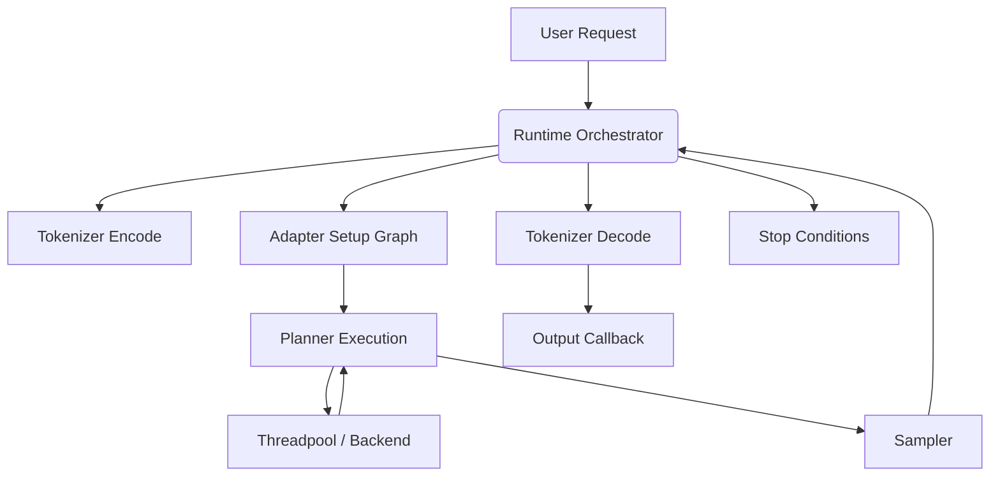
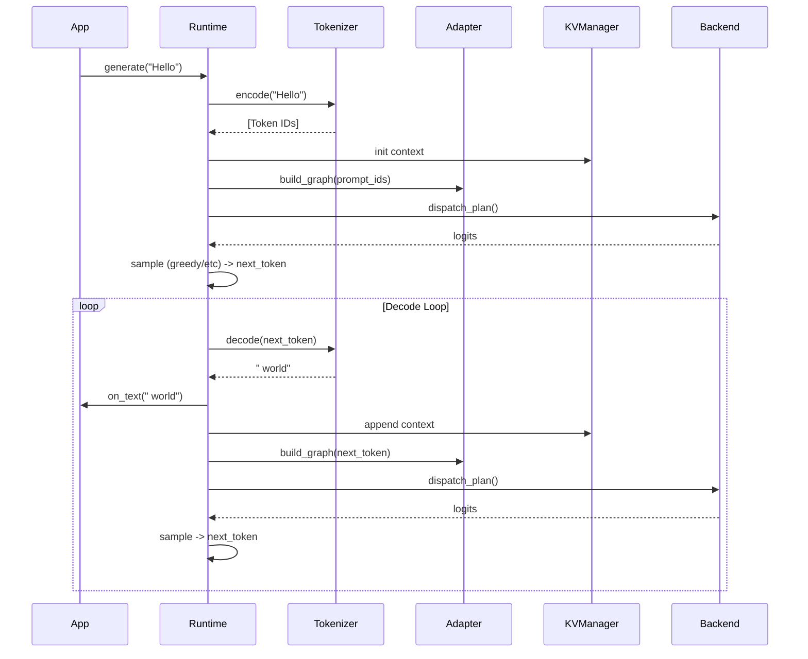

# RFC-019: Runtime Orchestrator & End-to-End Inference Architecture

Status: DRAFT
Authors: Hummingbird Core Team

---

## 1. Runtime Architecture

The Runtime Orchestrator (module `runtime`, Layer 9) acts as the apex layer of the Hummingbird inference engine. It is responsible for bridging the user-facing API with the internal systems. It coordinates the execution across the following components:
- **Tokenizer (Layer 8):** Converts text to and from token IDs.
- **Model Adapter (Layer 8):** Maps generic inference graphs to model-specific architectures.
- **KV Cache Manager (Layer 8):** Allocates and manages KV cache memory.
- **Model Loader (Layer 7):** Handles model weights and metadata.
- **Execution Graph & Planner (Layer 6/5):** Compiles the logical graph into an execution plan and sequences operations.
- **Streaming Engine (Layer 6):** Streams weights from disk to RAM/VRAM.
- **Backend & Scheduler (Layer 4/5):** Dispatches kernels to actual hardware (CPU/CUDA/Metal).

The Orchestrator ties these together into a generation loop (prefill and decoding) while strictly respecting the layered dependency rules. The `runtime` module depends on layers 0-8 but cannot be depended on by them.

---

## 2. Session Lifecycle

The lifecycle of an inference session comprises the following phases:
1. **Creation:** `hbi_runtime_session_create` initializes the state, accepting pre-initialized model, tokenizer, adapter, and allocator dependencies.
2. **Configuration:** Parameters (e.g., sampler strategy, max tokens, EOS configuration) are set.
3. **Execution (Prefill):** The runtime prompts the tokenizer to encode the input, passes the tokens to the adapter to build the forward graph, and asks the planner to execute the prefill stage.
4. **Execution (Decode Loop):** Generates tokens one-by-one. In each step:
   - The graph is updated with the last generated token.
   - The forward pass yields logits.
   - The sampler selects a token ID.
   - The stop conditions (EOS, max tokens) are evaluated.
   - The token is passed to the tokenizer for decoding and the output is dispatched to the callback.
5. **Teardown:** `hbi_runtime_session_destroy` safely cleans up runtime-owned resources, aborting any active generation.

---

## 3. Object Ownership

Ownership boundaries are strict to avoid circular dependencies and dangling pointers:
- **Owned by Caller:** Model Loader session, Tokenizer, Model Adapter, Allocator. These MUST outlive the Runtime Session.
- **Owned by Runtime Session:** Generation state, Sampler configuration, Stop condition evaluators, and the KV Context (via KV Manager).
- **Transient Objects:** Execution graph plans and tensor views generated per-token are owned by the generation loop and recycled or freed across loop iterations.

---

## 4. Thread Model

The Runtime Session is **NOT thread-safe**.
- All calls to a single `hbi_runtime_session` must be serialized externally.
- Multiple independent sessions can run concurrently in the same process, provided the lower layers (e.g., Threadpool, Model Loader) are thread-safe or isolated.
- The threadpool orchestrates parallel kernel execution underneath the runtime, but the runtime loop itself runs sequentially on the calling thread.

---

## 5. Memory Ownership

- The runtime module allocates internal state using the provided `hbi_allocator`.
- **KV Cache:** Handled by the KV Manager, but the Runtime instructs the Manager when to allocate and free contexts.
- **I/O & Tensors:** The tensor memory during forward passes is managed by the Planner and Arena allocator. The runtime does not manually allocate/free tensor buffers.
- All allocations must use `hbi_alloc`/`hbi_free` tagged with appropriate `hbi_mem_tag`.

---

## 6. Runtime API

The public C API (`hb_` prefix) wraps the internal `hbi_` API.

**Internal API (M3/M4):**
```c
typedef struct hbi_runtime_config {
    uint32_t max_new_tokens;
    uint32_t eos_token_id;
    bool greedy;
    /* ... Sampler parameters ... */
} hbi_runtime_config;

hbi_status hbi_runtime_session_create(const hbi_load_session *model,
                                      const hbi_model_adapter *adapter,
                                      const hbi_tokenizer *tokenizer,
                                      const hbi_runtime_config *config,
                                      hbi_allocator *allocator,
                                      hbi_runtime_session **out);

void hbi_runtime_session_destroy(hbi_runtime_session *s);

hbi_status hbi_runtime_generate(hbi_runtime_session *s,
                                const char *prompt,
                                void (*on_text)(const char *text, void *ud),
                                void *user_data);
```

---

## 7. Error Handling

- Errors are strictly returned as `hbi_status` codes (e.g., `HBI_ERR_OOM`, `HBI_ERR_UNSUPPORTED`, `HBI_ERR_STATE`).
- Detailed diagnostics are pushed to the thread-local error record via `HBI_ERR_SET`.
- The generation loop gracefully aborts on error, cleaning up transient memory, and returns the error code to the caller. No `exit()` or `assert()` is used.

---

## 8. Pipeline Diagram



---

## 9. Sequence Diagram



---

## 10. State Machine

The runtime session operates as a state machine:
- `INIT`: Session created.
- `ENCODING`: Converting text to prompt IDs.
- `PREFILL`: Executing the full prompt graph.
- `DECODING`: Autoregressive generation loop.
- `STOPPED`: Generation finished (EOS, max tokens, or error).
- `DESTROYED`: Session teardown.

---

## 11. Extension Points

- **Custom Samplers:** The sampling logic is isolated and can be extended to support top-k, top-p, temperature, and min-p.
- **Adapter Registry:** Any model can be executed if an adapter implements the `hbi_model_adapter` interface.
- **Logit Processors:** Hooks for repetition penalties or grammatical constraints can be injected before the sampler.

---

## 12. Future Streaming Integration

(For M4 and beyond) The Orchestrator will integrate with the Streaming Engine (Layer 6).
- During graph compilation, the planner will emit `prefetch` nodes.
- The Runtime loop will poll or await the Streaming Engine's I/O callbacks, ensuring expert weights are loaded directly into RAM/VRAM before kernel dispatch.

---

## 13. Future CUDA Integration

The runtime abstraction allows zero-code changes when executing on GPUs. The Backend Registry will intercept kernel dispatches and execute on CUDA/Metal if the tensors reside in VRAM. The Runtime orchestrator merely calls `dispatch` on the compiled execution graph.

---

## 14. Future Distributed Runtime

In a distributed environment (e.g., tensor parallelism across nodes), the Runtime Orchestrator will serve as the coordinator node. It will serialize execution graphs, distribute them via a transport layer (MPI or NCCL-like custom layer), and gather logits before sampling.

---

## 15. Public C API

Exposed in `hummingbird.h` for external embedders:
```c
hb_status hb_session_create(hb_model *model, hb_session **out);
void hb_session_destroy(hb_session *session);
hb_status hb_generate(hb_session *session, const char *prompt, hb_text_cb cb, void *ud);
hb_status hb_session_cancel(hb_session *session);
```

---

## 16. Internal APIs

The `runtime` module relies heavily on:
- `hbi_adapter_forward()`
- `hbi_kv_context_append_tokens()`
- `hbi_tokenizer_encode()` / `decode()`
- `hbi_scheduler_compile()` and `hbi_scheduler_execute()`

---

## 17. Locking Strategy

- The Session itself is lock-free and relies on external synchronization.
- Callbacks (`on_text`) must be handled re-entrantly or externally synchronized by the caller if manipulating shared app state.
- Internal threadpools use lock-free work-stealing queues; the runtime orchestrator just waits on a completion condition variable during kernel dispatch.

---

## 18. Cancellation Strategy

Cancellation is supported via a thread-safe `hb_session_cancel` flag. The generation loop checks this atomic flag at the start of every decode iteration. If set, it gracefully exits the loop, returning `HBI_ERR_CANCELLED`.

---

## 19. Resource Cleanup

Upon error or destruction:
- KV caches are released to the `KVManager`.
- Transient memory arenas for the current generation run are reset.
- Tokenizer, Model, and Allocator instances are preserved as they are owned externally.

---

## 20. Testing Strategy

- **Unit Tests:** Mock Adapters and Mock Tokenizers to ensure the State Machine properly transitions and errors are bubbled up.
- **Integration Tests:** Connect a dummy CPU backend, KV manager, and GPT-OSS adapter to execute a mock forward pass and verify token limits/EOS behavior.
- **Leak Tests:** ASan/UBSan runs on the generation loop to guarantee transient allocations are fully reclaimed per token.
